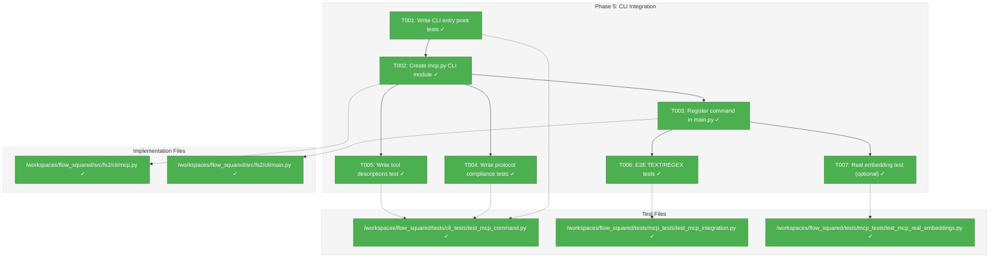
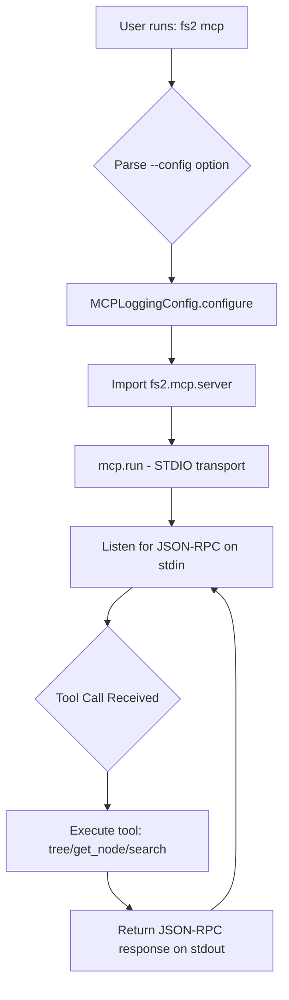
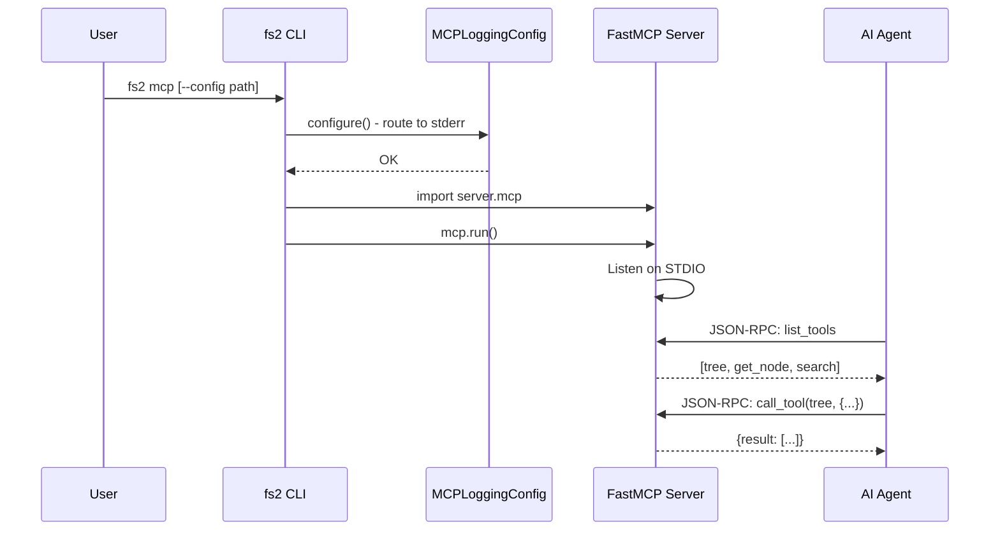

# Phase 5: CLI Integration – Tasks & Alignment Brief

**Spec**: [mcp-spec.md](../../mcp-spec.md)
**Plan**: [mcp-plan.md](../../mcp-plan.md)
**Date**: 2026-01-01

---

## Executive Briefing

### Purpose

This phase creates the `fs2 mcp` CLI command that starts the MCP server, enabling AI agents like Claude Desktop to connect and use the tree, get_node, and search tools. Without this CLI entry point, there's no way to launch the server.

### What We're Building

A Typer CLI command (`fs2 mcp`) that:
- Configures stderr-only logging BEFORE any fs2 imports (Critical Discovery 01)
- Starts the FastMCP server with STDIO transport
- Uses default config system (.fs2/config.yaml, ~/.config/fs2/config.yaml)
- Outputs only valid JSON-RPC messages to stdout

### User Value

Users can start the MCP server with a single command and connect AI agents like Claude Desktop to explore their indexed codebase programmatically.

### Example

```bash
# Start MCP server (uses .fs2/config.yaml or ~/.config/fs2/config.yaml)
$ fs2 mcp

# Claude Desktop configuration (~/.config/claude/claude_desktop_config.json)
{
  "mcpServers": {
    "fs2": {
      "command": "fs2",
      "args": ["mcp"],
      "cwd": "/path/to/your/project"
    }
  }
}
```

---

## Objectives & Scope

### Objective

Implement the `fs2 mcp` CLI command as specified in the plan, satisfying AC11, AC13, and AC15.

**Behavior Checklist**:
- [ ] AC11: `fs2 mcp` starts the MCP server on STDIO
- [ ] AC13: Only JSON-RPC on stdout; all logging to stderr
- [ ] AC15: Tool listing shows agent-optimized descriptions

**Deferred** (DYK#3):
- ❌ AC12: `--config` option deferred to future plan (cross-cutting concern for all CLI commands)

### Goals

- ✅ Create `src/fs2/cli/mcp.py` with the mcp command function
- ✅ Register command in `src/fs2/cli/main.py`
- ✅ Write TDD tests verifying command behavior
- ✅ Ensure protocol compliance (no stdout pollution)
- ✅ Validate tool descriptions are visible to agents
- ✅ **End-to-end integration test**: Spawn MCP server subprocess, connect FastMCP client, run search against real graph

### Non-Goals

- ❌ HTTP transport (STDIO only for v1)
- ❌ Authentication/authorization (local execution)
- ❌ Hot-reload of graph file (restart required)
- ❌ Modifying existing CLI commands (tree.py, get_node.py, search.py)
- ❌ Adding new MCP tools (tree, get_node, search already implemented)
- ❌ Resource exposure (tools only for v1)
- ❌ `--config` option (DYK#3: deferred to future plan - cross-cutting concern for all CLI commands)

---

## Architecture Map

### Component Diagram
<!-- Status: grey=pending, orange=in-progress, green=completed, red=blocked -->
<!-- Updated by plan-6 during implementation -->



### Task-to-Component Mapping

<!-- Status: ⬜ Pending | 🟧 In Progress | ✅ Complete | 🔴 Blocked -->

| Task | Component(s) | Files | Status | Comment |
|------|-------------|-------|--------|---------|
| T001 | Test Suite | tests/cli_tests/test_mcp_command.py | ✅ Complete | TDD: 2 tests written, RED phase confirmed |
| T002 | CLI Module | src/fs2/cli/mcp.py | ✅ Complete | MCPLoggingConfig called FIRST, then mcp.run() |
| T003 | CLI Registration | src/fs2/cli/main.py | ✅ Complete | Command registered, 2 tests pass |
| T004 | Test Suite | tests/cli_tests/test_mcp_command.py | ✅ Complete | 2 protocol compliance tests pass |
| T005 | Test Suite | tests/cli_tests/test_mcp_command.py | ✅ Complete | 2 tool description tests pass |
| T006 | Integration | tests/mcp_tests/test_mcp_integration.py | ✅ Complete | 6 E2E tests pass via StdioTransport |
| T007 | Validation | tests/mcp_tests/test_mcp_real_embeddings.py | ✅ Complete | 2 tests skip without creds, run with Azure |

---

## Tasks

| Status | ID | Task | CS | Type | Dependencies | Absolute Path(s) | Validation | Subtasks | Notes |
|--------|-----|------|----|------|--------------|------------------|------------|----------|-------|
| [x] | T001 | Write TDD tests for `fs2 mcp` command existence and --help | 2 | Test | – | /workspaces/flow_squared/tests/cli_tests/test_mcp_command.py | Tests fail with command not found | – | Plan 5.1 |
| [x] | T002 | Create src/fs2/cli/mcp.py with mcp() function | 2 | Core | T001 | /workspaces/flow_squared/src/fs2/cli/mcp.py | Command runs, logging to stderr | – | Plan 5.3; MCPLoggingConfig FIRST |
| [x] | T003 | Register mcp command in main.py | 1 | Core | T002 | /workspaces/flow_squared/src/fs2/cli/main.py | `fs2 mcp --help` works | – | Plan 5.4 |
| [x] | T004 | Write protocol compliance test (no stdout pollution) | 2 | Test | T002 | /workspaces/flow_squared/tests/cli_tests/test_mcp_command.py | AC13: only JSON-RPC on stdout | – | Plan 5.5 |
| [x] | T005 | Write tool descriptions visibility test | 2 | Test | T002 | /workspaces/flow_squared/tests/cli_tests/test_mcp_command.py | AC15: descriptions in tool listing | – | Plan 5.6 |
| [x] | T006 | Write E2E integration test: spawn subprocess via CLI, connect FastMCP client, run TEXT/REGEX search | 3 | Integration | T003 | /workspaces/flow_squared/tests/mcp_tests/test_mcp_integration.py | Search returns results from real graph | – | Uses StdioTransport (DYK#1, DYK#2, DYK#4, DYK#5) |
| [x] | T007 | Write optional real-embedding validation test (skip in CI) | 2 | Test | T003 | /workspaces/flow_squared/tests/mcp_tests/test_mcp_real_embeddings.py | SEMANTIC search works with real API | – | @pytest.mark.requires_api (DYK#5) |

---

## Alignment Brief

### Prior Phases Review

#### Phase-by-Phase Summary (Evolution)

**Phase 1 (Core Infrastructure)** → Established foundation:
- Created `src/fs2/mcp/` module structure as peer to `cli/`
- Implemented lazy service initialization in `dependencies.py`
- Created FastMCP server instance in `server.py`
- Implemented `MCPLoggingConfig` adapter for stderr-only logging
- Established error translation pattern with `translate_error()`
- **21 tests passing**

**Phase 2 (Tree Tool)** → First tool implementation:
- Implemented `tree()` MCP tool with pattern filtering, depth limiting
- Created `_tree_node_to_dict()` helper for serialization
- Established function-then-decorator pattern for testability
- Added agent-optimized docstrings with WHEN TO USE, PREREQUISITES, WORKFLOW
- Added MCP annotations (readOnlyHint, idempotentHint, etc.)
- **28 tests, 54 total MCP tests**

**Phase 3 (Get-Node Tool)** → Node retrieval with file save:
- Implemented `get_node()` MCP tool with save_to_file option
- Created `_code_node_to_dict()` with explicit field selection (no asdict!)
- Created `_validate_save_path()` for path security
- Established None-vs-ToolError pattern (None for not-found, ToolError for errors)
- **26 tests, 80 total MCP tests**

**Phase 4 (Search Tool)** → Async search with all modes:
- Implemented async `search()` MCP tool with TEXT, REGEX, SEMANTIC, AUTO modes
- Created `_build_search_envelope()` using `SearchResultMeta`
- Added `get_embedding_adapter()` to dependencies
- Extended `make_code_node()` with embedding parameters
- Discovered `openWorldHint=True` needed for SEMANTIC API calls
- **34 tests, 114 total MCP tests**

#### Cumulative Deliverables (by Phase of Origin)

**From Phase 1** (Foundation):
- `/workspaces/flow_squared/src/fs2/mcp/__init__.py`
- `/workspaces/flow_squared/src/fs2/mcp/dependencies.py`
  - `get_config()`, `set_config()`, `get_graph_store()`, `set_graph_store()`
  - `get_embedding_adapter()`, `set_embedding_adapter()`, `reset_services()`
- `/workspaces/flow_squared/src/fs2/mcp/server.py`
  - `mcp: FastMCP` instance
  - `translate_error()` function
- `/workspaces/flow_squared/src/fs2/core/adapters/logging_config.py`
  - `MCPLoggingConfig` class (stderr-only logging)
  - `DefaultLoggingConfig` class

**From Phase 2** (Tree Tool):
- `tree()` function in `server.py`
- `_tree_node_to_dict()` helper in `server.py`
- Tree node dict structure

**From Phase 3** (Get-Node Tool):
- `get_node()` function in `server.py`
- `_code_node_to_dict()` helper in `server.py`
- `_validate_save_path()` helper in `server.py`

**From Phase 4** (Search Tool):
- `search()` async function in `server.py`
- `_build_search_envelope()` helper in `server.py`

**Test Infrastructure Available**:
- `/workspaces/flow_squared/tests/mcp_tests/conftest.py`
  - `make_code_node()` helper
  - `fake_config`, `fake_graph_store`, `fake_embedding_adapter` fixtures
  - `tree_test_graph_store`, `mcp_client` fixtures
  - `search_test_graph_store`, `search_semantic_graph_store`, `search_mcp_client` fixtures
  - `reset_mcp_dependencies` autouse fixture
  - `parse_tool_response()` helper

#### Pattern Evolution & Architectural Continuity

1. **Logging-first pattern** (Phase 1): `MCPLoggingConfig().configure()` MUST be called before any fs2 imports
2. **Function-then-decorator pattern** (Phase 2): Define function separately, then apply `@mcp.tool()` decorator
3. **Explicit field selection** (Phase 3): Never use `asdict()` on CodeNode/TreeNode - explicit field whitelisting
4. **None-vs-ToolError pattern** (Phase 3): Return None for "not found", raise ToolError for actual errors
5. **Async tool pattern** (Phase 4): Use `async def` with `await` for async services

#### Anti-Patterns to Avoid

1. **Don't import fs2 modules before configuring logging** - stdout pollution
2. **Don't name test directories to shadow packages** - use `mcp_tests/` not `mcp/`
3. **Don't use `asdict()`** - leaks embeddings
4. **Don't mock service internals** - use Fakes (FakeGraphStore, etc.)
5. **Don't set readOnlyHint=True for tools that write files**

#### Technical Debt from Prior Phases

- **ReDoS vulnerability** (Phase 4, T006d SKIPPED): Include/exclude filters in SearchService lack timeout protection

### Critical Findings Affecting This Phase

| Finding | Source | Impact on Phase 5 |
|---------|--------|-------------------|
| **CD01**: STDIO requires stderr-only logging BEFORE imports | Phase 1 | T003 MUST call `MCPLoggingConfig().configure()` as first line |
| **CD02**: Tool descriptions drive agent selection | Phases 2-4 | T006 validates descriptions are visible |
| **HD07**: File creation order matters | Phase 1 | mcp.py imports from `fs2.mcp.server` |

### ADR Decision Constraints

**No ADRs exist** for this project. N/A.

### Invariants & Guardrails

1. **Protocol Compliance**: stdout is 100% reserved for JSON-RPC; ANY other output breaks MCP
2. **Import Order**: Logging configuration MUST precede all fs2 imports
3. **No CLI Modifications**: Don't modify existing tree.py, get_node.py, search.py

### Inputs to Read

| File | Purpose |
|------|---------|
| `/workspaces/flow_squared/src/fs2/cli/main.py` | CLI registration pattern |
| `/workspaces/flow_squared/src/fs2/mcp/server.py` | FastMCP instance to run |
| `/workspaces/flow_squared/src/fs2/core/adapters/logging_config.py` | MCPLoggingConfig usage |

### Visual Alignment Aids

#### Flow Diagram: CLI Command Execution



#### Sequence Diagram: MCP Server Startup



### Test Plan (Full TDD)

**Testing Approach**: Full TDD with Typer's CliRunner + subprocess integration tests

#### CLI Unit Tests (tests/cli_tests/test_mcp_command.py)

| Test | Class | Purpose | Fixture | Expected |
|------|-------|---------|---------|----------|
| `test_mcp_command_exists` | TestMCPCommandEntry | AC11: Command registered | CliRunner | exit_code=0, "MCP" in output |
| `test_mcp_command_help` | TestMCPCommandEntry | Help text shows | CliRunner | exit_code=0, help text displayed |
| `test_mcp_no_stdout_on_import` | TestProtocolCompliance | AC13: No pollution | monkeypatch | stdout empty after import |
| `test_mcp_logging_goes_to_stderr` | TestProtocolCompliance | AC13: Logs to stderr | monkeypatch | stderr has content |
| `test_mcp_tools_have_descriptions` | TestToolDescriptions | AC15: Descriptions visible | mcp_client | description length > 100 |
| `test_mcp_tools_have_workflow_hints` | TestToolDescriptions | AC15: WORKFLOW section | mcp_client | "WORKFLOW" in description |

#### E2E Integration Tests (tests/mcp_tests/test_mcp_integration.py) - No Real API

| Test | Class | Purpose | Fixture | Expected |
|------|-------|---------|---------|----------|
| `test_search_text_mode_via_subprocess` | TestMCPServerIntegration | TEXT search via subprocess | integration_test_graph | Returns "authenticate" node |
| `test_search_regex_mode_via_subprocess` | TestMCPServerIntegration | REGEX search via subprocess | integration_test_graph | Returns pattern matches |
| `test_tree_tool_via_subprocess` | TestMCPServerIntegration | Tree via subprocess | integration_test_graph | Returns list of tree nodes |
| `test_get_node_tool_via_subprocess` | TestMCPServerIntegration | Get-node via subprocess | integration_test_graph | Returns full CodeNode data |
| `test_list_tools_via_subprocess` | TestMCPServerIntegration | Tool listing works | integration_test_graph | Lists tree, get_node, search |
| `test_search_invalid_mode_returns_error` | TestMCPServerErrorHandling | Error handling | integration_test_graph | ToolError with actionable message |

#### Real Embedding Validation (tests/mcp_tests/test_mcp_real_embeddings.py) - Optional

| Test | Class | Purpose | Fixture | Expected |
|------|-------|---------|---------|----------|
| `test_semantic_search_with_real_embeddings` | TestRealEmbeddings | SEMANTIC works with real API | real_embedding_config | Returns semantically relevant results |
| `test_auto_mode_uses_embeddings_when_available` | TestRealEmbeddings | AUTO mode uses embeddings | real_embedding_config | Falls back correctly |

**Note**: Real embedding tests require `FS2_AZURE__OPENAI__*` env vars. Run manually:
```bash
pytest -m requires_api tests/mcp_tests/test_mcp_real_embeddings.py -v
```

**Integration Test Architecture**:
- `integration_test_graph` fixture creates complete `.fs2/` structure (DYK#5):
  - `tmp_path/.fs2/config.yaml` with graph path
  - `tmp_path/.fs2/graph.pickle` with test nodes
  - Subprocess runs with `cwd=tmp_path`
- Uses `create_search_test_nodes()` factory from conftest.py (DYK#2: shared with unit tests)
- Spawns subprocess via `StdioTransport(command=sys.executable, args=["-m", "fs2.cli.main", "mcp"], cwd=tmp_path)` (DYK#1)
- Connects `FastMCP Client` to subprocess STDIO
- Tests TEXT/REGEX modes only - no embedding adapter needed (DYK#5)
- Real embedding tests in separate file with `@pytest.mark.requires_api`

### Step-by-Step Implementation Outline

1. **T001**: Create `tests/cli_tests/test_mcp_command.py` with CliRunner tests for command existence
2. **T002**: Create `src/fs2/cli/mcp.py`:
   - FIRST LINE: `MCPLoggingConfig().configure()`
   - Import `mcp` from `fs2.mcp.server`
   - Define `mcp()` function (no options for now - DYK#3)
   - Call `mcp.run()` for STDIO transport
3. **T003**: Update `src/fs2/cli/main.py`:
   - Add `from fs2.cli.mcp import mcp as mcp_command`
   - Register: `app.command(name="mcp")(mcp_command)`
4. **T004**: Add protocol compliance tests (stdout isolation, stderr logging)
5. **T005**: Add tool description visibility tests
6. **T006**: Create `tests/mcp_tests/test_mcp_integration.py` (DYK#4: same dir as unit tests):
   - First: Extract `create_search_test_nodes()` factory in conftest.py (DYK#2)
   - Refactor `search_test_graph_store` to use the factory
   - Create `integration_test_graph` fixture with full `.fs2/` structure (DYK#5):
     - `tmp_path/.fs2/config.yaml` pointing to graph
     - `tmp_path/.fs2/graph.pickle` with test nodes
   - Use `StdioTransport` with `args=["-m", "fs2.cli.main", "mcp"], cwd=tmp_path` (DYK#1)
   - Connect `FastMCP Client` to subprocess STDIO
   - Test TEXT and REGEX modes only (no embedding adapter needed - DYK#5)
   - Validates MCPLoggingConfig is applied correctly in production path
7. **T007**: Create `tests/mcp_tests/test_mcp_real_embeddings.py`:
   - Mark with `@pytest.mark.requires_api` (skipped in CI)
   - Test SEMANTIC search with real embedding API
   - Test AUTO mode fallback behavior
   - Requires `FS2_AZURE__OPENAI__*` env vars

### Commands to Run

```bash
# Environment setup
cd /workspaces/flow_squared
uv sync

# Run CLI tests
UV_CACHE_DIR=.uv_cache uv run pytest tests/cli_tests/test_mcp_command.py -v

# Run MCP tests (unit + E2E integration, excludes real-embedding tests)
UV_CACHE_DIR=.uv_cache uv run pytest tests/mcp_tests/ -v --ignore=tests/mcp_tests/test_mcp_real_embeddings.py

# Run all Phase 5 tests (standard CI)
UV_CACHE_DIR=.uv_cache uv run pytest tests/mcp_tests/ tests/cli_tests/test_mcp_command.py -v --ignore=tests/mcp_tests/test_mcp_real_embeddings.py

# Run real embedding tests (manual, requires API keys)
UV_CACHE_DIR=.uv_cache uv run pytest tests/mcp_tests/test_mcp_real_embeddings.py -v

# Linting
UV_CACHE_DIR=.uv_cache uv run ruff check src/fs2/cli/mcp.py tests/cli_tests/ tests/mcp_tests/

# Type checking (if configured)
UV_CACHE_DIR=.uv_cache uv run mypy src/fs2/cli/mcp.py

# Manual verification
fs2 mcp --help
```

### Risks & Unknowns

| Risk | Severity | Mitigation |
|------|----------|------------|
| CliRunner doesn't capture MCP protocol behavior | Medium | Test protocol compliance separately with monkeypatch |
| MCPLoggingConfig import order issue | High | Explicit first-line import pattern; test with stdout capture |
| mcp.run() blocks indefinitely | Low | Don't test actual run in CliRunner; test help/options only |
| StdioTransport subprocess may not terminate cleanly | Medium | Use `keep_alive=False`, wrap in `async with Client()` |
| Graph pickle format mismatch | Low | Use production `NetworkXGraphStore.save()` to create fixture |
| PYTHONPATH not set correctly in subprocess | Medium | Explicitly set in env dict for StdioTransport |

### Ready Check

- [x] Prior phases reviewed (4/4 complete)
- [x] Critical findings identified (CD01, CD02, HD07)
- [x] ADR constraints mapped to tasks (N/A - no ADRs exist)
- [x] Test plan defined (6 CLI + 6 E2E + 2 real-embedding = 14 tests)
- [x] Implementation outline complete (7 tasks)
- [x] Commands documented
- [x] DYK#1: E2E uses real CLI path `-m fs2.cli.main mcp`
- [x] DYK#2: Shared node factory prevents drift
- [x] DYK#3: --config deferred to future cross-cutting plan
- [x] DYK#4: Integration tests in mcp_tests/ (no new directory)
- [x] DYK#5: E2E uses TEXT/REGEX only; real embeddings in separate optional test
- [ ] **HUMAN GO/NO-GO REQUIRED**

---

## Phase Footnote Stubs

_Populated during implementation by plan-6. Do not create footnote tags during planning._

| Footnote | Tasks | Description |
|----------|-------|-------------|
| | | |

[^21]: Phase 5 Tasks 5.1-5.6 - CLI Integration
  - `file:src/fs2/cli/mcp.py` - MCP CLI command module
  - `file:src/fs2/cli/main.py` - Command registration
  - `file:tests/cli_tests/__init__.py` - CLI tests package
  - `file:tests/cli_tests/conftest.py` - CLI test fixtures
  - `file:tests/cli_tests/test_mcp_command.py` - 6 CLI tests
  - `file:tests/mcp_tests/test_mcp_integration.py` - 6 E2E tests
  - `file:tests/mcp_tests/test_mcp_real_embeddings.py` - 2 optional tests

---

## Evidence Artifacts

Implementation will write:
- `execution.log.md` in this directory
- Test output captured in execution log

---

## Discoveries & Learnings

_Populated during implementation by plan-6. Log anything of interest to your future self._

| Date | Task | Type | Discovery | Resolution | References |
|------|------|------|-----------|------------|------------|
| | | | | | |

**Types**: `gotcha` | `research-needed` | `unexpected-behavior` | `workaround` | `decision` | `debt` | `insight`

**What to log**:
- Things that didn't work as expected
- External research that was required
- Implementation troubles and how they were resolved
- Gotchas and edge cases discovered
- Decisions made during implementation
- Technical debt introduced (and why)
- Insights that future phases should know about

_See also: `execution.log.md` for detailed narrative._

---

## Directory Layout

```
docs/plans/011-mcp/
├── mcp-spec.md
├── mcp-plan.md
└── tasks/
    ├── phase-1-core-infrastructure/
    │   ├── tasks.md
    │   └── execution.log.md
    ├── phase-2-tree-tool-implementation/
    │   ├── tasks.md
    │   └── execution.log.md
    ├── phase-3-get-node-tool-implementation/
    │   ├── tasks.md
    │   └── execution.log.md
    ├── phase-4-search-tool-implementation/
    │   ├── tasks.md
    │   └── execution.log.md
    └── phase-5-cli-integration/
        ├── tasks.md        # ← This file
        └── execution.log.md  # ← Created by plan-6
```

---

## Critical Insights Discussion

**Session**: 2026-01-01
**Context**: Phase 5: CLI Integration - Tasks & Alignment Brief
**Analyst**: AI Clarity Agent
**Format**: Water Cooler Conversation (5 Critical Insights)

### DYK#1: E2E Subprocess Must Use Real CLI Path

**Did you know**: The original E2E test plan used inline Python (`-c "from fs2.mcp.server import mcp; mcp.run()"`) which bypasses the CLI entirely and never tests that MCPLoggingConfig is applied correctly.

**Implications**:
- E2E test could pass while actual `fs2 mcp` CLI is broken
- Critical Discovery 01 (logging BEFORE imports) not validated end-to-end
- Tests the server, not the CLI integration

**Options Considered**:
- Option A: Use actual CLI entry point (`-m fs2.cli.main mcp`)
- Option B: Create test runner script
- Option C: Add logging to inline Python
- Option D: Two tests (inline + CLI)

**AI Recommendation**: Option A
- Reasoning: Tests what users actually run, validates full integration path

**Decision**: Use `-m fs2.cli.main mcp` in StdioTransport

---

### DYK#2: Shared Node Factory Prevents Test Drift

**Did you know**: The integration test fixture would recreate the same test nodes that exist in `search_test_graph_store`, leading to code duplication and drift risk.

**Implications**:
- Updates to one fixture might not propagate to the other
- Test failures for mysterious reasons ("works in unit tests!")
- Maintenance burden multiplied

**Options Considered**:
- Option A: Extract shared `create_search_test_nodes()` factory
- Option B: Import from conftest
- Option C: Accept duplication
- Option D: Create shared test data module

**AI Recommendation**: Option A
- Reasoning: Single source of truth, minimal change, already in conftest

**Decision**: Extract `create_search_test_nodes()` factory in conftest.py

---

### DYK#3: --config Option Deferred

**Did you know**: The `--config` option affects ALL CLI commands (scan, search, mcp) and should be implemented consistently across the entire CLI, not bolted onto just the MCP command.

**Implications**:
- `FS2ConfigurationService` has no constructor parameter for custom path
- Would need cross-cutting implementation
- Risk of inconsistent behavior across commands

**Options Considered**:
- Option A: Implement for mcp only
- Option B: Defer to future plan
- Option C: Use env var override

**AI Recommendation**: Option B
- Reasoning: Cross-cutting concern deserves proper planning

**Decision**: Defer `--config` to future plan. Phase 5 uses default config system only.

**Action Items**:
- [x] Remove AC12 from Phase 5 scope
- [x] Add to Non-Goals section

---

### DYK#4: Integration Tests Stay in mcp_tests/

**Did you know**: Creating `tests/integration/` would establish a new directory structure requiring its own conftest.py and cross-module imports.

**Implications**:
- New structure to maintain
- Fixture sharing becomes complex
- Pytest discovery might need adjustment

**Options Considered**:
- Option A: Create tests/integration/
- Option B: Put in tests/mcp_tests/
- Option C: Use tests/e2e/

**AI Recommendation**: Option B
- Reasoning: KISS - fixtures already available, file name distinguishes

**Decision**: Integration tests go in `tests/mcp_tests/test_mcp_integration.py`

---

### DYK#5: E2E Tests Need Full .fs2/ Structure + Embedding Strategy

**Did you know**: The subprocess needs not just `graph.pickle` but a complete `.fs2/` directory with `config.yaml` pointing to that graph. Also, SEMANTIC search needs an embedding adapter that can't be injected into a subprocess.

**Implications**:
- Without config.yaml, subprocess loads wrong/default graph
- SEMANTIC mode requires query embedding (can't inject FakeEmbeddingAdapter)
- Real embedding tests need API keys

**Options Considered**:
- Option A: Full .fs2/ structure + TEXT/REGEX only in E2E
- Option B: Env var to enable fake adapter
- Option C: Skip E2E for search entirely

**AI Recommendation**: Option A + separate real-embedding test
- Reasoning: Keeps production code clean, unit tests cover SEMANTIC with fakes

**Decision**:
1. E2E tests create full `.fs2/` structure with `cwd=tmp_path`
2. E2E tests only use TEXT/REGEX modes (no embedding adapter needed)
3. Add T007: Optional real-embedding test with `@pytest.mark.requires_api`

---

## Session Summary

**Insights Surfaced**: 5 critical insights identified and discussed
**Decisions Made**: 5 decisions reached through collaborative discussion
**Tasks Updated**: T001-T007 refined based on insights
**Test Count**: 6 CLI + 6 E2E + 2 real-embedding = 14 tests

**DYK Reference Summary**:
| ID | Summary |
|----|---------|
| DYK#1 | E2E uses real CLI path `-m fs2.cli.main mcp` |
| DYK#2 | Shared `create_search_test_nodes()` factory |
| DYK#3 | `--config` deferred to future cross-cutting plan |
| DYK#4 | Integration tests in `mcp_tests/` (no new directory) |
| DYK#5 | E2E uses TEXT/REGEX only; real embeddings in separate optional test |

**Shared Understanding Achieved**: ✓

**Confidence Level**: High - Key risks identified and mitigated

**Next Steps**: Awaiting GO to run `/plan-6-implement-phase --phase 5`
