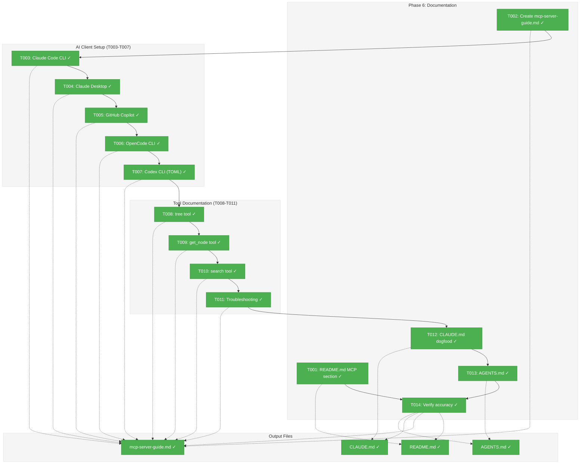
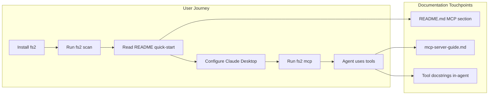

# Phase 6: Documentation – Tasks & Alignment Brief

**Spec**: [../../mcp-spec.md](../../mcp-spec.md)
**Plan**: [../../mcp-plan.md](../../mcp-plan.md)
**Date**: 2026-01-02
**Phase Slug**: `phase-6-documentation`

---

## Executive Briefing

### Purpose

This phase creates comprehensive documentation for the MCP server, enabling users to configure Claude Desktop and understand the three available tools (tree, get_node, search). Without documentation, users cannot discover or use the MCP server effectively.

### What We're Building

Documentation artifacts following the hybrid strategy (README + docs/how/):
- **README.md section**: Quick-start with `fs2 mcp` command and multi-client setup
- **docs/how/mcp-server-guide.md**: Comprehensive guide covering all tools, parameters, examples, troubleshooting, and architecture

**Multi-Client Setup Documentation**:
- **Claude Code CLI**: `claude mcp add` command + `~/.claude.json` config
- **Claude Desktop**: JSON config in `claude_desktop_config.json`
- **GitHub Copilot (VS Code)**: `.vscode/mcp.json` workspace config
- **OpenCode CLI**: `opencode.json` project/global config
- **Codex CLI (OpenAI)**: `~/.codex/config.toml` TOML format

### User Value

Users can:
1. Start the MCP server with a single command
2. Configure their preferred AI coding assistant (Claude Code, Copilot, OpenCode, Codex)
3. Understand when to use each tool (tree vs search vs get_node)
4. Troubleshoot common issues independently
5. Reference detailed parameter documentation

### Example

**Before**: User runs `fs2 mcp` but doesn't know how to configure Claude Desktop or what tools are available.

**After**:
```json
// ~/.config/claude/claude_desktop_config.json
{
  "mcpServers": {
    "fs2": {
      "command": "fs2",
      "args": ["mcp"],
      "cwd": "/path/to/your/project"
    }
  }
}
```

User runs `fs2 mcp`, Claude Desktop connects, and the agent can explore the codebase.

---

## Objectives & Scope

### Objective

Create documentation artifacts satisfying the hybrid documentation strategy from the spec, covering AC15 (tool descriptions visible to agents) and user-facing documentation needs.

**Behavior Checklist**:
- [ ] AC15: Tool listing shows agent-optimized descriptions (already implemented in server.py - documentation must match)
- [ ] README.md has MCP quick-start section
- [ ] docs/how/mcp-server-guide.md is complete and accurate
- [ ] All documented commands work correctly
- [ ] Documentation matches actual tool signatures and behaviors

### Goals

- ✅ Add MCP quick-start section to README.md with command and multi-client configs
- ✅ Create docs/how/mcp-server-guide.md with full tool documentation
- ✅ Document all tool parameters with types, defaults, and examples
- ✅ Include troubleshooting section for common issues
- ✅ Provide architecture overview for advanced users
- ✅ Document Claude Code CLI setup (`claude mcp add` + config file locations)
- ✅ Document GitHub Copilot VS Code setup (`.vscode/mcp.json`)
- ✅ Document OpenCode CLI setup (`opencode.json`)
- ✅ Document Codex CLI setup (`~/.codex/config.toml` TOML format)
- ✅ **Update CLAUDE.md with fs2 dogfooding instructions** (use fs2 to work on fs2)
- ✅ **Create docs/how/AGENTS.md with fs2 usage suggestions for AI agents**
- ✅ Verify documentation accuracy against implementation

### Non-Goals

- ❌ API reference documentation (tools are self-documenting via MCP)
- ❌ Video tutorials or interactive demos
- ❌ Translations or localization
- ❌ Changelog documentation (tracked in plan footnotes)
- ❌ Developer documentation for extending MCP tools (separate concern)
- ❌ Performance tuning guide (premature optimization)

---

## Architecture Map

### Component Diagram

<!-- Status: grey=pending, orange=in-progress, green=completed, red=blocked -->
<!-- Updated by plan-6 during implementation -->



### Task-to-Component Mapping

<!-- Status: ⬜ Pending | 🟧 In Progress | ✅ Complete | 🔴 Blocked -->

| Task | Component(s) | Files | Status | Comment |
|------|-------------|-------|--------|---------|
| T001 | README | /workspaces/flow_squared/README.md | ✅ Complete | Add ## MCP Server section with quick-start |
| T002 | MCP Guide | /workspaces/flow_squared/docs/how/mcp-server-guide.md | ✅ Complete | Create new file with structure |
| T003 | Claude Code CLI | /workspaces/flow_squared/docs/how/mcp-server-guide.md | ✅ Complete | `claude mcp add` command + config |
| T004 | Claude Desktop | /workspaces/flow_squared/docs/how/mcp-server-guide.md | ✅ Complete | JSON config for all platforms |
| T005 | GitHub Copilot | /workspaces/flow_squared/docs/how/mcp-server-guide.md | ✅ Complete | `.vscode/mcp.json` config |
| T006 | OpenCode CLI | /workspaces/flow_squared/docs/how/mcp-server-guide.md | ✅ Complete | `opencode.json` config |
| T007 | Codex CLI | /workspaces/flow_squared/docs/how/mcp-server-guide.md | ✅ Complete | TOML format in `~/.codex/config.toml` |
| T008 | tree docs | /workspaces/flow_squared/docs/how/mcp-server-guide.md | ✅ Complete | Document tree tool per server.py |
| T009 | get_node docs | /workspaces/flow_squared/docs/how/mcp-server-guide.md | ✅ Complete | Document get_node tool per server.py |
| T010 | search docs | /workspaces/flow_squared/docs/how/mcp-server-guide.md | ✅ Complete | Document search tool per server.py |
| T011 | Troubleshooting | /workspaces/flow_squared/docs/how/mcp-server-guide.md | ✅ Complete | Common errors and solutions |
| T012 | CLAUDE.md dogfood | /workspaces/flow_squared/CLAUDE.md | ✅ Complete | fs2 MCP usage for this project |
| T013 | AGENTS.md | /workspaces/flow_squared/docs/how/AGENTS.md | ✅ Complete | AI agent instructions for fs2 usage |
| T014 | Verification | All doc files | ✅ Complete | Run commands, verify all configs valid |

---

## Tasks

| Status | ID | Task | CS | Type | Dependencies | Absolute Path(s) | Validation | Subtasks | Notes |
|--------|------|------|-----|------|--------------|------------------|------------|----------|-------|
| [x] | T001 | Add MCP Server quick-start section to README.md | 2 | Doc | – | /workspaces/flow_squared/README.md | Section exists with `fs2 mcp` command and multi-client config overview | – | Insert after "Embeddings" section |
| [x] | T002 | Create mcp-server-guide.md with document structure | 2 | Doc | – | /workspaces/flow_squared/docs/how/mcp-server-guide.md | File exists with Overview, Prerequisites, Client Setup, Tools, Troubleshooting sections | – | Follow wormhole-mcp-guide.md pattern |
| [x] | T003 | Document Claude Code CLI setup | 2 | Doc | T002 | /workspaces/flow_squared/docs/how/mcp-server-guide.md | Section shows `claude mcp add` command, config file locations (~/.claude.json), scopes | – | Prefer CLI command over manual edit |
| [x] | T004 | Document Claude Desktop setup | 1 | Doc | T003 | /workspaces/flow_squared/docs/how/mcp-server-guide.md | Section shows JSON config for macOS/Windows/Linux paths | – | Config at ~/Library/Application Support/Claude/ |
| [x] | T005 | Document GitHub Copilot (VS Code) setup | 2 | Doc | T004 | /workspaces/flow_squared/docs/how/mcp-server-guide.md | Section shows .vscode/mcp.json config with servers.fs2 structure | – | Also mention user settings.json option |
| [x] | T006 | Document OpenCode CLI setup | 2 | Doc | T005 | /workspaces/flow_squared/docs/how/mcp-server-guide.md | Section shows `opencode mcp add` command, config file locations, JSON structure | – | CLI is interactive guided setup |
| [x] | T007 | Document Codex CLI (OpenAI) setup | 2 | Doc | T006 | /workspaces/flow_squared/docs/how/mcp-server-guide.md | Section shows TOML format in ~/.codex/config.toml, `codex mcp add` command | – | TOML not JSON - different syntax |
| [x] | T008 | Document tree tool with parameters and examples | 2 | Doc | T007 | /workspaces/flow_squared/docs/how/mcp-server-guide.md | Tree section has all params from server.py:188-266 | – | Match docstring structure |
| [x] | T009 | Document get_node tool with parameters and examples | 2 | Doc | T008 | /workspaces/flow_squared/docs/how/mcp-server-guide.md | get_node section has all params from server.py:356-433 | – | Include save_to_file security note |
| [x] | T010 | Document search tool with parameters and examples | 3 | Doc | T009 | /workspaces/flow_squared/docs/how/mcp-server-guide.md | search section has all params, modes, envelope format from server.py:508-706 | – | Most complex tool - 4 search modes |
| [x] | T011 | Add troubleshooting section with common errors | 2 | Doc | T010 | /workspaces/flow_squared/docs/how/mcp-server-guide.md | Section covers GraphNotFoundError, EmbeddingAdapterError, pattern errors | – | Reference translate_error() from server.py |
| [x] | T012 | Update CLAUDE.md with fs2 dogfooding instructions | 2 | Doc | T007 | /workspaces/flow_squared/CLAUDE.md | Section shows how to use fs2 MCP in Claude Code for this project, includes `claude mcp add` command and usage examples | – | Critical: eat our own dogfood |
| [x] | T013 | Create docs/how/AGENTS.md with fs2 usage suggestions | 2 | Doc | T012 | /workspaces/flow_squared/docs/how/AGENTS.md | File exists with fs2 MCP tool usage guidance, recommended workflows, when to use each tool | – | Generic agent instructions |
| [x] | T014 | Verify documentation accuracy against implementation | 1 | QA | T001, T013 | /workspaces/flow_squared/README.md, /workspaces/flow_squared/docs/how/mcp-server-guide.md, /workspaces/flow_squared/CLAUDE.md, /workspaces/flow_squared/docs/how/AGENTS.md | `fs2 mcp --help` matches docs, tool params accurate, all configs valid | – | Manual verification |

---

## Alignment Brief

### Prior Phases Review

#### Phase 1: Core Infrastructure (Complete)
**Deliverables Created**:
- `/workspaces/flow_squared/src/fs2/mcp/__init__.py` - Module marker
- `/workspaces/flow_squared/src/fs2/mcp/dependencies.py` - Lazy service initialization with `get_config()`, `get_graph_store()`, `get_embedding_adapter()`, `set_*()` functions
- `/workspaces/flow_squared/src/fs2/mcp/server.py` - FastMCP instance, `translate_error()` function
- `/workspaces/flow_squared/src/fs2/core/adapters/logging_config.py` - `MCPLoggingConfig` and `DefaultLoggingConfig` adapters
- `/workspaces/flow_squared/tests/mcp_tests/` - Test directory with conftest.py fixtures

**Dependencies Exported for Phase 6**:
- `mcp` FastMCP instance (documented in server.py usage example)
- `translate_error()` function for error response format
- Error types: `GraphNotFoundError`, `GraphStoreError`, `MissingConfigurationError`

**Critical Findings Applied**:
- Critical Discovery 01: STDIO protocol requires stderr-only logging - **Document that MCP server outputs only JSON-RPC to stdout**
- Critical Discovery 05: Error translation at MCP boundary - **Document error response format in troubleshooting**

**Test Infrastructure**:
- `tests/mcp_tests/conftest.py` - `make_code_node()` helper, `fake_config`, `fake_graph_store`, `fake_embedding_adapter` fixtures
- 21 tests passing

#### Phase 2: Tree Tool Implementation (Complete)
**Deliverables Created**:
- `/workspaces/flow_squared/src/fs2/mcp/server.py:tree` - Tree tool function (lines 188-266)
- `/workspaces/flow_squared/src/fs2/mcp/server.py:_tree_node_to_dict` - Conversion helper

**Dependencies Exported for Phase 6**:
- Tree tool signature: `tree(pattern=".", max_depth=0, detail="min") -> list[dict]`
- MCP annotations: readOnlyHint=True, destructiveHint=False, idempotentHint=True, openWorldHint=False
- Agent-optimized docstring with WHEN TO USE, PREREQUISITES, WORKFLOW sections

**Critical Findings Applied**:
- Critical Discovery 02: Tool descriptions drive agent selection - **Docstring follows best practice format**

**Test Infrastructure**:
- 28 tests in `test_tree_tool.py`
- `tree_test_graph_store` fixture in conftest.py
- `mcp_client` async fixture for MCP protocol testing

#### Phase 3: Get-Node Tool Implementation (Complete)
**Deliverables Created**:
- `/workspaces/flow_squared/src/fs2/mcp/server.py:get_node` - Get-node tool function (lines 356-421)
- `/workspaces/flow_squared/src/fs2/mcp/server.py:_code_node_to_dict` - Conversion helper with explicit field selection
- `/workspaces/flow_squared/src/fs2/mcp/server.py:_validate_save_path` - Security validation for save_to_file

**Dependencies Exported for Phase 6**:
- Get-node tool signature: `get_node(node_id, save_to_file=None, detail="min") -> dict | None`
- MCP annotations: readOnlyHint=**False** (can write files), openWorldHint=False
- Security constraint: save_to_file path must be under current working directory

**Technical Discoveries**:
- DYK Session: Explicit field filtering prevents embedding vector leakage
- DYK Session: readOnlyHint=False because save_to_file writes to filesystem

**Test Infrastructure**:
- 26 tests in `test_get_node_tool.py`
- Path security tests validate directory traversal prevention

#### Phase 4: Search Tool Implementation (Complete)
**Deliverables Created**:
- `/workspaces/flow_squared/src/fs2/mcp/server.py:search` - Async search tool (lines 508-694)
- `/workspaces/flow_squared/src/fs2/mcp/server.py:_build_search_envelope` - Envelope builder using SearchResultMeta

**Dependencies Exported for Phase 6**:
- Search tool signature: `async search(pattern, mode="auto", limit=20, offset=0, include=None, exclude=None, detail="min") -> dict`
- Four search modes: TEXT, REGEX, SEMANTIC, AUTO
- MCP annotations: readOnlyHint=True, openWorldHint=**True** (SEMANTIC calls embedding APIs)
- Envelope format with `meta` and `results` keys

**Technical Discoveries**:
- DYK#8: openWorldHint=True because SEMANTIC mode calls external embedding APIs
- DYK#9: Embedding API errors (auth, rate limit) have specific error messages
- DYK#10: SearchError already has actionable messages

**Test Infrastructure**:
- 34 tests in `test_search_tool.py`
- `search_test_graph_store` and `search_semantic_graph_store` fixtures
- 114 total MCP tests

#### Phase 5: CLI Integration (Complete)
**Deliverables Created**:
- `/workspaces/flow_squared/src/fs2/cli/mcp.py` - CLI command module
- `/workspaces/flow_squared/src/fs2/cli/main.py` - Command registration
- `/workspaces/flow_squared/tests/cli_tests/test_mcp_command.py` - CLI tests
- `/workspaces/flow_squared/tests/mcp_tests/test_mcp_integration.py` - E2E tests

**Dependencies Exported for Phase 6**:
- CLI command: `fs2 mcp` (no arguments required)
- Uses default config: `.fs2/config.yaml` or `~/.config/fs2/config.yaml`
- Outputs only JSON-RPC to stdout per AC13

**Deferred Items**:
- DYK#3: `--config` option deferred to future plan (cross-cutting concern for all CLI commands)

**Test Infrastructure**:
- 6 CLI tests in `test_mcp_command.py`
- 6 E2E integration tests in `test_mcp_integration.py`
- 2 optional real embedding tests in `test_mcp_real_embeddings.py`

### AI Client Configuration Reference (Research Summary)

The following configurations were researched for T003-T007. **Prefer CLI commands over manual file edits** where available.

#### Claude Code CLI (T003)

**CLI Command (Preferred)**:
```bash
# Add fs2 MCP server (user scope = available across all projects)
claude mcp add fs2 --scope user -- fs2 mcp

# Or for current project only
claude mcp add fs2 -- fs2 mcp

# List configured servers
claude mcp list

# Check status inside Claude Code
/mcp
```

**Scopes**: `--scope local` (default, current project), `--scope project` (shared via .mcp.json), `--scope user` (all projects)

**Config File** (`~/.claude.json`):
```json
{
  "mcpServers": {
    "fs2": {
      "command": "fs2",
      "args": ["mcp"]
    }
  }
}
```

#### Claude Desktop (T004)

**Config File Locations**:
- macOS: `~/Library/Application Support/Claude/claude_desktop_config.json`
- Windows: `%APPDATA%\Claude\claude_desktop_config.json`
- Linux: `~/.config/claude/claude_desktop_config.json`

**JSON Config**:
```json
{
  "mcpServers": {
    "fs2": {
      "command": "fs2",
      "args": ["mcp"],
      "cwd": "/path/to/your/project"
    }
  }
}
```

#### GitHub Copilot / VS Code (T005)

**Workspace Config** (`.vscode/mcp.json` - shareable with team):
```json
{
  "servers": {
    "fs2": {
      "type": "stdio",
      "command": "fs2",
      "args": ["mcp"]
    }
  }
}
```

**User Config**: Via Command Palette → "MCP: Add Server" or in `settings.json`

**Setup Steps**:
1. Open VS Code with GitHub Copilot enabled
2. Command Palette (Ctrl+Shift+P / Cmd+Shift+P)
3. Run "MCP: Add Server"
4. Select "stdio" type
5. Enter command: `fs2`, args: `["mcp"]`

#### OpenCode CLI (T006)

**CLI Command (Preferred)**:
```bash
# Interactive guided setup
opencode mcp add

# List configured servers
opencode mcp list
# or short form
opencode mcp ls

# Check status in OpenCode TUI
/mcp
```

**Config File Locations**:
- Global: `~/.config/opencode/opencode.json`
- Per-project: `opencode.json` in project directory

**JSON Config**:
```json
{
  "$schema": "https://opencode.ai/config.json",
  "mcp": {
    "fs2": {
      "type": "local",
      "enabled": true,
      "command": ["fs2", "mcp"]
    }
  }
}
```

#### Codex CLI (OpenAI) (T007)

**CLI Command (Preferred)**:
```bash
# Add fs2 MCP server
codex mcp add fs2 -- fs2 mcp

# List configured servers
codex mcp list

# Check status in Codex TUI
/mcp
```

**Config File**: `~/.codex/config.toml`

**TOML Config** (note: TOML syntax, not JSON):
```toml
[mcp_servers.fs2]
command = "fs2"
args = ["mcp"]
```

**Important**: Codex uses TOML format with `mcp_servers` (underscore, not `mcpServers`).

---

### Critical Findings Affecting This Phase

| Finding | Impact | Addressed By |
|---------|--------|--------------|
| Critical Discovery 02: Tool descriptions drive agent selection | Documentation must match agent-optimized docstrings in server.py | T008, T009, T010 |
| DYK#3: --config deferred | Do NOT document --config option | T001, T002 |
| DYK#8: openWorldHint for search | Document that SEMANTIC mode may call external APIs | T010 |
| Research: Prefer CLI over file edits | Claude Code, OpenCode, and Codex have `mcp add` commands | T003, T006, T007 |
| Research: Codex uses TOML not JSON | Different syntax from other clients | T007 |

### Invariants & Guardrails

- Documentation MUST match implementation in server.py
- Do NOT document features that don't exist (--config option)
- All code examples must be tested/verified
- Claude Desktop config JSON must be valid JSON

### Inputs to Read

| File | Purpose |
|------|---------|
| `/workspaces/flow_squared/src/fs2/mcp/server.py` | Authoritative source for tool signatures, docstrings, annotations |
| `/workspaces/flow_squared/docs/how/wormhole-mcp-guide.md` | Reference for documentation style and structure |
| `/workspaces/flow_squared/docs/plans/011-mcp/research-dossier.md` | Tool description best practices from research |
| `/workspaces/flow_squared/README.md` | Current state, insertion point for MCP section |
| `/workspaces/flow_squared/CLAUDE.md` | Project instructions for Claude Code - add fs2 dogfooding section |
| `/workspaces/flow_squared/docs/how/AGENTS.md` | New file: AI agent instructions for fs2 usage (to be created) |

### Visual Alignment Aids

#### Documentation Flow Diagram



#### Document Structure Diagram

```mermaid
flowchart TD
    subgraph README["README.md"]
        R1[## MCP Server]
        R2[Quick-start command]
        R3[Claude Desktop config]
        R4[Link to full guide]
    end

    subgraph Guide["mcp-server-guide.md"]
        G1[## Overview]
        G2[## Prerequisites]
        G3[## Available Tools]
        G3a[### tree]
        G3b[### get_node]
        G3c[### search]
        G4[## Claude Desktop Setup]
        G5[## Troubleshooting]
        G6[## Architecture]
    end

    subgraph Agents["AGENTS.md"]
        A1[## fs2 MCP Integration]
        A2[### Available Tools]
        A3[### When to Use Each Tool]
        A4[### Recommended Workflows]
        A5[### Example Queries]
    end

    R4 --> G1
    G3 --> G3a
    G3 --> G3b
    G3 --> G3c
    G3 --> A2
```



### Test Plan

This phase is documentation-only. Validation is manual verification:

| Verification | Method | Expected Result |
|--------------|--------|-----------------|
| README.md section exists | Read file | ## MCP Server section present after ## Embeddings |
| mcp-server-guide.md exists | Read file | File at docs/how/mcp-server-guide.md with all sections |
| AGENTS.md exists | Read file | File at docs/how/AGENTS.md with tool guidance |
| `fs2 mcp --help` | Run command | Output matches documented usage |
| Claude Desktop config | JSON validation | Valid JSON, correct structure |
| Tool parameters | Compare server.py | All params documented with correct types/defaults |

### Step-by-Step Implementation Outline

1. **T001**: Edit README.md to add MCP Server section after Embeddings
   - Add quick-start with `fs2 mcp` command
   - Show Claude Desktop config as primary example
   - Link to full guide for other clients

2. **T002**: Create mcp-server-guide.md with structure
   - Copy structure from wormhole-mcp-guide.md
   - Sections: Overview, Prerequisites, Client Setup, Tools, Troubleshooting

3. **T003**: Document Claude Code CLI setup
   - Show `claude mcp add fs2 -- fs2 mcp` command (preferred)
   - Document scopes (local, project, user)
   - Show config file location (~/.claude.json)

4. **T004**: Document Claude Desktop setup
   - Show JSON config for macOS/Windows/Linux
   - Note cwd requirement

5. **T005**: Document GitHub Copilot setup
   - Show .vscode/mcp.json config
   - Document VS Code Command Palette steps
   - Note "servers" key (not "mcpServers")

6. **T006**: Document OpenCode CLI setup
   - Show `opencode mcp add` command (interactive guided setup)
   - Show `opencode mcp list` to verify
   - Show opencode.json config for manual setup
   - Note global (~/.config/opencode/) vs project locations

7. **T007**: Document Codex CLI setup
   - Show `codex mcp add fs2 -- fs2 mcp` command (preferred)
   - Show TOML config in ~/.codex/config.toml
   - Emphasize TOML format with `mcp_servers` (underscore)

8. **T008**: Document tree tool
   - Copy docstring from server.py:188-238
   - Format as markdown with parameter table
   - Add examples section

9. **T009**: Document get_node tool
   - Copy docstring from server.py:356-381
   - Note security constraint for save_to_file
   - Document detail levels

10. **T010**: Document search tool
    - Copy docstring from server.py:508-564
    - Document all 4 search modes (TEXT, REGEX, SEMANTIC, AUTO)
    - Include envelope response format

11. **T011**: Add troubleshooting section
    - List common errors from translate_error()
    - Add solutions for each
    - Include "When to Use vs. Traditional Search" table

12. **T012**: Update CLAUDE.md with fs2 dogfooding instructions
    - Add section showing how to use fs2 MCP with this project
    - Include `claude mcp add` command for fs2
    - Show example workflows: explore codebase, find code, understand architecture
    - Emphasize: "eat our own dogfood" - use fs2 to work on fs2

13. **T013**: Create docs/how/AGENTS.md with fs2 usage suggestions
    - Create generic agent instructions file for fs2 MCP tools
    - Document when to use each tool (tree vs search vs get_node)
    - Include recommended workflows for common tasks
    - Show example queries and expected outputs
    - Designed for AGENTS.md or similar agent instruction files

14. **T014**: Verify accuracy
    - Run `fs2 mcp --help`
    - Compare documented params to server.py
    - Validate all config formats (JSON and TOML)
    - Verify CLAUDE.md instructions work
    - Verify AGENTS.md content is accurate

### Commands to Run

```bash
# Verify MCP command works
fs2 mcp --help

# Verify JSON config is valid
python3 -c 'import json; json.load(open("test_config.json"))'

# Run existing tests to ensure nothing broken
just test tests/mcp_tests/ tests/cli_tests/test_mcp_command.py

# Verify README renders correctly (optional)
grip README.md
```

### Risks/Unknowns

| Risk | Severity | Mitigation |
|------|----------|------------|
| Documentation drifts from implementation | Medium | T007 verification step; cross-reference server.py |
| Claude Desktop config format changes | Low | Use simple, stable config structure |
| Missing edge cases in troubleshooting | Low | Add issues as discovered by users |

### Ready Check

- [x] Prior phases complete (5/5)
- [x] Critical findings documented (Critical Discovery 02, DYK#3, DYK#8)
- [x] Reference files identified (server.py, wormhole-mcp-guide.md)
- [x] Tasks have absolute paths
- [x] Validation criteria specified
- [ ] ADR constraints mapped to tasks (IDs noted in Notes column) - N/A (no ADRs for this plan)

**Ready for implementation: GO**

---

## Phase Footnote Stubs

_Populated by plan-6 during implementation. Do not create entries here during planning._

| Footnote | Task | Description |
|----------|------|-------------|
| | | |

---

## Evidence Artifacts

Implementation will produce:
- `execution.log.md` in this directory documenting implementation progress
- No additional artifacts expected (documentation phase)

---

## Discoveries & Learnings

_Populated during implementation by plan-6. Log anything of interest to your future self._

| Date | Task | Type | Discovery | Resolution | References |
|------|------|------|-----------|------------|------------|
| | | | | | |

**Types**: `gotcha` | `research-needed` | `unexpected-behavior` | `workaround` | `decision` | `debt` | `insight`

**What to log**:
- Things that didn't work as expected
- External research that was required
- Implementation troubles and how they were resolved
- Gotchas and edge cases discovered
- Decisions made during implementation
- Technical debt introduced (and why)
- Insights that future phases should know about

_See also: `execution.log.md` for detailed narrative._

---

## Directory Layout

```
docs/plans/011-mcp/
├── mcp-spec.md
├── mcp-plan.md
├── research-dossier.md
└── tasks/
    ├── phase-1-core-infrastructure/
    │   ├── tasks.md
    │   └── execution.log.md
    ├── phase-2-tree-tool-implementation/
    │   ├── tasks.md
    │   └── execution.log.md
    ├── phase-3-get-node-tool-implementation/
    │   ├── tasks.md
    │   └── execution.log.md
    ├── phase-4-search-tool-implementation/
    │   ├── tasks.md
    │   └── execution.log.md
    ├── phase-5-cli-integration/
    │   ├── tasks.md
    │   └── execution.log.md
    └── phase-6-documentation/
        ├── tasks.md          ← This file
        └── execution.log.md  ← Created by plan-6
```
