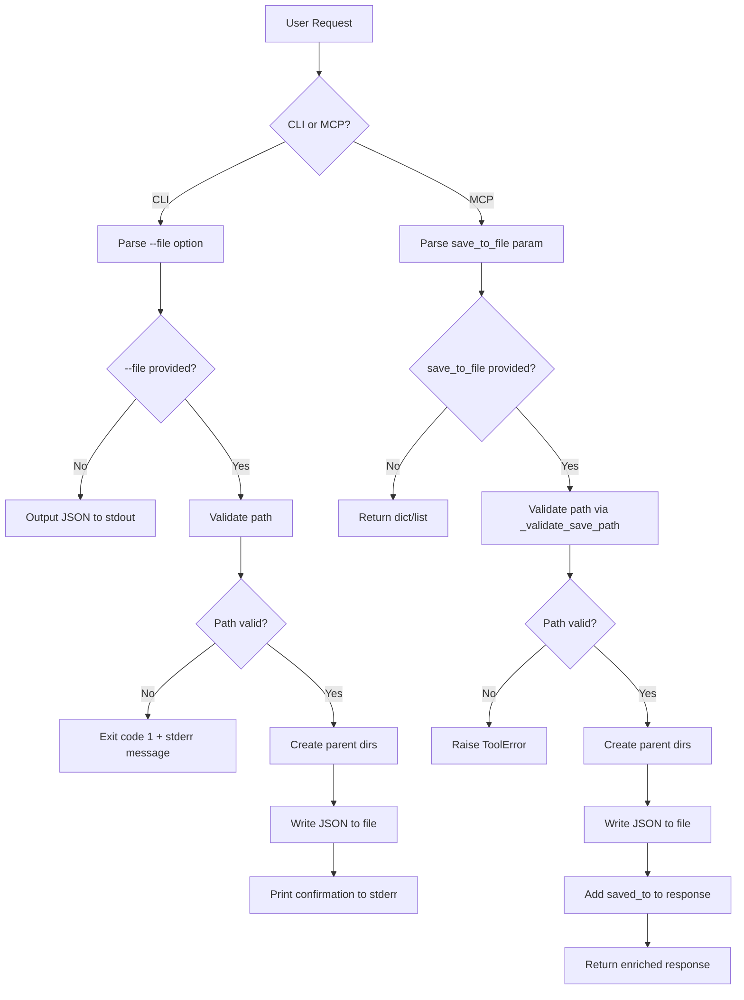
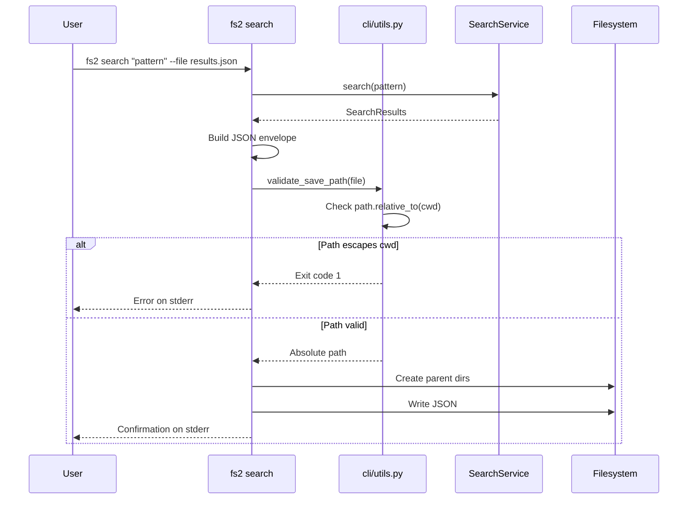
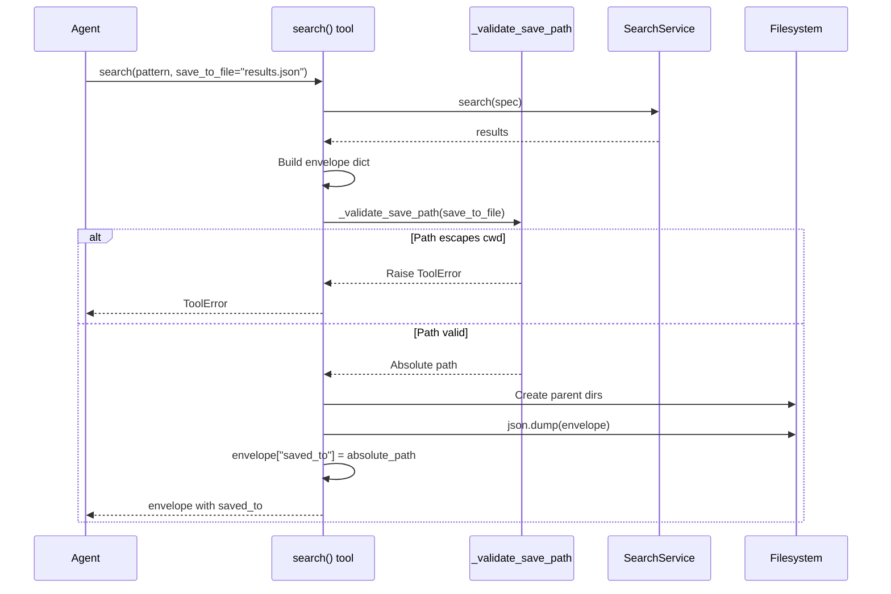

# Phase 1: Save-to-File Implementation – Tasks & Alignment Brief

**Spec**: [save-to-file-spec.md](/workspaces/flow_squared/docs/plans/012-save-to-file/save-to-file-spec.md)
**Plan**: [save-to-file-plan.md](/workspaces/flow_squared/docs/plans/012-save-to-file/save-to-file-plan.md)
**Date**: 2026-01-02
**Phase**: 1 of 1 (Simple Mode - Single Phase)

---

## Executive Briefing

### Purpose
This phase adds file output capability to the fs2 CLI `search` and `tree` commands, and MCP `search()` and `tree()` tools. This enables AI agents and scripts to save complex search results for post-processing with tools like `jq`, supporting query-once-process-many workflows essential for agent automation.

### What We're Building

**CLI Enhancements:**
- `fs2 search "pattern" --file results.json` - Save search envelope to file
- `fs2 tree --json` - Output tree as JSON instead of Rich text
- `fs2 tree --file tree.txt` - Save Rich text output to file
- `fs2 tree --json --file tree.json` - Save JSON tree to file

**MCP Tool Enhancements:**
- `search(pattern="...", save_to_file="results.json")` - Returns envelope with `saved_to` field
- `tree(pattern=".", save_to_file="tree.json")` - Returns wrapped response with `saved_to` field

**Security:**
- Path validation preventing directory traversal attacks
- Consistent security between CLI and MCP

### User Value
Users can programmatically save search and tree results to files, enabling:
- Batch processing of large result sets with `jq`
- Agent workflows that save once, process multiple times
- Integration with external tools expecting file-based input

### Example

**CLI Search:**
```bash
$ fs2 search "authentication" --file auth_results.json
✓ Wrote search results to auth_results.json

$ jq '.results[].node_id' auth_results.json
"callable:src/auth/service.py:authenticate"
"callable:src/auth/service.py:validate_token"
```

**MCP Search:**
```python
result = await search(pattern="auth", save_to_file="results.json")
# Returns: {"meta": {...}, "results": [...], "saved_to": "/abs/path/results.json"}
```

---

## Objectives & Scope

### Objective
Implement file output for CLI `search` and `tree` commands, and MCP `search()` and `tree()` tools, following established patterns from `get_node` implementation while ensuring security parity.

### Goals

- ✅ Add `--file` option to CLI `search` command with path validation
- ✅ Add `--json` and `--file` options to CLI `tree` command
- ✅ Add `save_to_file` parameter to MCP `search()` tool
- ✅ Add `save_to_file` parameter to MCP `tree()` tool
- ✅ Create shared path validation utility for CLI commands
- ✅ Move `_tree_node_to_dict` to shared location (avoid layer violation)
- ✅ Update MCP annotations to `readOnlyHint=False`
- ✅ Auto-create subdirectories when saving to nested paths
- ✅ Save empty results as valid JSON envelope
- ✅ Update documentation (README, MCP guide)

### Non-Goals (Scope Boundaries)

- ❌ Fixing existing `get_node` CLI path validation gap (pre-existing, out of scope)
- ❌ Adding compression (gzip) for output files
- ❌ Adding append mode (always overwrite)
- ❌ Adding output format options (CSV, YAML) - JSON only
- ❌ Modifying existing `get_node` behavior
- ❌ Adding HTTP transport for MCP (STDIO only)
- ❌ Graph hot-reload detection

---

## Architecture Map

### Component Diagram

```mermaid
flowchart TD
    classDef pending fill:#9E9E9E,stroke:#757575,color:#fff
    classDef inprogress fill:#FF9800,stroke:#F57C00,color:#fff
    classDef completed fill:#4CAF50,stroke:#388E3C,color:#fff
    classDef blocked fill:#F44336,stroke:#D32F2F,color:#fff

    subgraph CLI["CLI Layer"]
        T001["T001: Tests for search --file"]:::pending
        T002["T002: Shared path validation"]:::pending
        T003["T003: Add --file to search"]:::pending
        T007["T007: Tests for tree --json"]:::pending
        T008["T008: Tests for tree --file"]:::pending
        T009["T009: Add --json/--file to tree"]:::pending
        T011["T011: Import validation in tree"]:::pending
    end

    subgraph MCP["MCP Layer"]
        T004["T004: Tests for MCP search save"]:::pending
        T005["T005: Add save_to_file to search"]:::pending
        T006["T006: Update search annotation"]:::pending
        T012["T012: Tests for MCP tree save"]:::pending
        T013["T013: Add save_to_file to tree"]:::pending
        T014["T014: Update tree annotation"]:::pending
        T015["T015: Update tool descriptions"]:::pending
    end

    subgraph Core["Core Layer"]
        T010["T010: Move _tree_node_to_dict"]:::pending
    end

    subgraph Docs["Documentation"]
        T016["T016: Update README"]:::pending
        T017["T017: Update MCP guide"]:::pending
    end

    subgraph Files["Files"]
        F1["/src/fs2/cli/search.py"]:::pending
        F2["/src/fs2/cli/tree.py"]:::pending
        F3["/src/fs2/cli/utils.py"]:::pending
        F4["/src/fs2/mcp/server.py"]:::pending
        F5["/src/fs2/core/serialization.py"]:::pending
        F6["/tests/unit/cli/test_search_cli.py"]:::pending
        F7["/tests/unit/cli/test_tree_cli.py"]:::pending
        F8["/tests/mcp_tests/test_search_tool.py"]:::pending
        F9["/tests/mcp_tests/test_tree_tool.py"]:::pending
        F10["/README.md"]:::pending
        F11["/docs/how/mcp-server-guide.md"]:::pending
    end

    %% CLI Dependencies
    T001 --> T002
    T002 --> T003
    T007 --> T008
    T008 --> T009
    T009 --> T010
    T009 --> T011
    T002 --> T011

    %% MCP Dependencies
    T004 --> T005
    T005 --> T006
    T012 --> T013
    T013 --> T014
    T005 --> T015
    T013 --> T015

    %% Doc Dependencies
    T003 --> T016
    T009 --> T016
    T015 --> T017

    %% File mappings (dotted)
    T001 -.-> F6
    T002 -.-> F3
    T003 -.-> F1
    T004 -.-> F8
    T005 -.-> F4
    T006 -.-> F4
    T007 -.-> F7
    T008 -.-> F7
    T009 -.-> F2
    T010 -.-> F5
    T010 -.-> F4
    T010 -.-> F2
    T011 -.-> F2
    T012 -.-> F9
    T013 -.-> F4
    T014 -.-> F4
    T015 -.-> F4
    T016 -.-> F10
    T017 -.-> F11
```

<!-- Status: grey=pending, orange=in-progress, green=completed, red=blocked -->
<!-- Updated by plan-6 during implementation -->



### Task-to-Component Mapping

<!-- Status: ⬜ Pending | 🟧 In Progress | ✅ Complete | 🔴 Blocked -->

| Task | Component(s) | Files | Status | Comment |
|------|-------------|-------|--------|---------|
| T001 | CLI Search Tests | `/tests/unit/cli/test_search_cli.py` | ⬜ Pending | TDD: Write failing tests for --file option |
| T002 | CLI Utils | `/src/fs2/cli/utils.py` | ⬜ Pending | Create shared path validation utility |
| T003 | CLI Search | `/src/fs2/cli/search.py` | ⬜ Pending | Add --file option implementation |
| T004 | MCP Search Tests | `/tests/mcp_tests/test_search_tool.py` | ⬜ Pending | TDD: Write failing tests for save_to_file |
| T005 | MCP Search | `/src/fs2/mcp/server.py` | ⬜ Pending | Add save_to_file parameter |
| T006 | MCP Search | `/src/fs2/mcp/server.py` | ⬜ Pending | Update annotation to readOnlyHint=False |
| T007 | CLI Tree Tests | `/tests/unit/cli/test_tree_cli.py` | ⬜ Pending | TDD: Write failing tests for --json flag |
| T008 | CLI Tree Tests | `/tests/unit/cli/test_tree_cli.py` | ⬜ Pending | TDD: Write failing tests for --file option |
| T009 | CLI Tree | `/src/fs2/cli/tree.py` | ⬜ Pending | Add --json and --file options |
| T010 | Core Serialization | `/src/fs2/core/serialization.py`, server.py, tree.py | ⬜ Pending | Move _tree_node_to_dict to shared location |
| T011 | CLI Tree | `/src/fs2/cli/tree.py` | ⬜ Pending | Import shared path validation |
| T012 | MCP Tree Tests | `/tests/mcp_tests/test_tree_tool.py` | ⬜ Pending | TDD: Write failing tests for save_to_file |
| T013 | MCP Tree | `/src/fs2/mcp/server.py` | ⬜ Pending | Add save_to_file parameter |
| T014 | MCP Tree | `/src/fs2/mcp/server.py` | ⬜ Pending | Update annotation to readOnlyHint=False |
| T015 | MCP Docs | `/src/fs2/mcp/server.py` | ⬜ Pending | Update tool docstrings |
| T016 | README | `/README.md` | ⬜ Pending | Add --file usage examples |
| T017 | MCP Guide | `/docs/how/mcp-server-guide.md` | ⬜ Pending | Document save_to_file parameter |

---

## Tasks

| Status | ID | Task | CS | Type | Dependencies | Absolute Path(s) | Validation | Subtasks | Notes |
|--------|-----|------|----|------|--------------|------------------|------------|----------|-------|
| [ ] | T001 | Write tests for CLI search `--file` option | 2 | Test | -- | `/workspaces/flow_squared/tests/unit/cli/test_search_cli.py` | Tests cover: file creation, valid JSON envelope, empty stdout, stderr confirmation, path validation rejection, empty results save, subdirectory creation; all tests FAIL initially | -- | Create `TestSearchFileOutput` class; requires `scanned_project`, `tmp_path`, `monkeypatch` fixtures |
| [ ] | T002 | Create shared CLI path validation utility | 1 | Core | T001 | `/workspaces/flow_squared/src/fs2/cli/utils.py` | Create `validate_save_path(file: Path, console: Console) -> Path` that exits with code 1 for path escape, mirrors MCP validation logic; auto-creates parent directories. Also add `safe_write_file(path: Path, content: str)` helper with try/except cleanup and `encoding="utf-8"` per Insights #2 & #3 | -- | New module; per Critical Finding 01; Insight #2: cleanup on error; Insight #3: enforce UTF-8 |
| [ ] | T003 | Add `--file` option to CLI search command | 2 | Core | T002 | `/workspaces/flow_squared/src/fs2/cli/search.py` | Tests from T001 pass: file write works, stdout empty with --file, confirmation on stderr, path validated, subdirs created | -- | Add `file: Path | None` parameter; per Critical Finding 02 |
| [ ] | T004 | Write tests for MCP search `save_to_file` | 2 | Test | -- | `/workspaces/flow_squared/tests/mcp_tests/test_search_tool.py` | Tests cover: `saved_to` field in response, file creation, valid JSON, path validation ToolError, subdirectory creation; all tests FAIL initially | -- | Create `TestSearchSaveToFile` class; requires `search_test_graph_store`, `tmp_path` fixtures |
| [ ] | T005 | Add `save_to_file` parameter to MCP search | 2 | Core | T004 | `/workspaces/flow_squared/src/fs2/mcp/server.py` | Tests from T004 pass: envelope enriched with `saved_to`, file written with valid JSON, path validated via `_validate_save_path()`; use `encoding="utf-8"` per Insight #3 | -- | Add param after `detail`; per Critical Finding 02 |
| [ ] | T006 | Update MCP search annotation to readOnlyHint=False | 1 | Core | T005 | `/workspaces/flow_squared/src/fs2/mcp/server.py` | Annotation has `readOnlyHint: False`; verify via code inspection | -- | Per Critical Finding 05; AC8 compliance |
| [ ] | T007 | Write tests for CLI tree `--json` flag | 2 | Test | -- | `/workspaces/flow_squared/tests/unit/cli/test_tree_cli.py` | Tests cover: `--json` outputs valid JSON array to stdout, parseable by json.loads, has expected structure (node_id, name, category, children); all tests FAIL initially | -- | Create `TestTreeJsonOutput` class; per Critical Finding 03 |
| [ ] | T008 | Write tests for CLI tree `--file` options | 2 | Test | T007 | `/workspaces/flow_squared/tests/unit/cli/test_tree_cli.py` | Tests cover: `--file` saves plain text (ANSI stripped), `--json --file` saves JSON, stdout empty with --file, path validation, subdirectory creation; all tests FAIL initially | -- | Extend `TestTreeFileOutput` class; per Insight #1 decision: strip ANSI codes |
| [ ] | T009 | Add `--json` and `--file` options to CLI tree | 3 | Core | T007, T008 | `/workspaces/flow_squared/src/fs2/cli/tree.py` | Tests from T007/T008 pass: JSON mode outputs valid JSON, file save works for both modes; plain text mode uses `Console(no_color=True)` to strip ANSI | -- | Add branching logic in presentation section; per Critical Finding 03; per Insight #1: use no_color=True for file output |
| [ ] | T010 | Move `_tree_node_to_dict` to shared location | 2 | Core | T009 | `/workspaces/flow_squared/src/fs2/core/serialization.py`, `/workspaces/flow_squared/src/fs2/mcp/server.py`, `/workspaces/flow_squared/src/fs2/cli/tree.py` | Function moved to core/serialization.py; MCP server imports from there; CLI tree imports from there; existing MCP tree tests still pass | -- | Per Critical Finding 07; avoids CLI→MCP layer violation |
| [ ] | T011 | Import shared path validation in tree.py | 1 | Core | T002, T009 | `/workspaces/flow_squared/src/fs2/cli/tree.py` | Path escape attempts exit with code 1; uses `validate_save_path` from `fs2.cli.utils` | -- | Import from shared utils created in T002 |
| [ ] | T012 | Write tests for MCP tree `save_to_file` | 2 | Test | -- | `/workspaces/flow_squared/tests/mcp_tests/test_tree_tool.py` | Tests cover: return ALWAYS `{"tree": [...]}` wrapper (per Insight #5), `saved_to` field added when saving, file creation, path validation; all tests FAIL initially | -- | Create `TestTreeSaveToFile` class; per Insight #5: consistent wrapper like search |
| [ ] | T013 | Add `save_to_file` parameter to MCP tree | 2 | Core | T012 | `/workspaces/flow_squared/src/fs2/mcp/server.py` | Tests from T012 pass: ALWAYS return `{"tree": [...]}` wrapper, add `saved_to` only when saving, path validated; use `encoding="utf-8"` per Insight #3 | -- | Per Insight #5: consistent return type like search |
| [ ] | T014 | Update MCP tree annotation to readOnlyHint=False | 1 | Core | T013 | `/workspaces/flow_squared/src/fs2/mcp/server.py` | Annotation has `readOnlyHint: False`; verify via code inspection | -- | Per Critical Finding 05; AC8 compliance |
| [ ] | T015 | Update MCP tool descriptions for save_to_file | 1 | Docs | T005, T013 | `/workspaces/flow_squared/src/fs2/mcp/server.py` | Tool docstrings mention `save_to_file` param; tree suggests JSON for programmatic use | -- | Update Parameters section in docstrings |
| [ ] | T016 | Update README.md with `--file` examples | 1 | Docs | T003, T009 | `/workspaces/flow_squared/README.md` | README CLI section shows `--file` usage examples for search and tree | -- | Add 1-2 examples per command |
| [ ] | T017 | Update MCP server guide with save_to_file | 1 | Docs | T015 | `/workspaces/flow_squared/docs/how/mcp-server-guide.md` | Guide documents `save_to_file` parameter for search, tree, get_node tools | -- | Add parameter documentation |

---

## Alignment Brief

### Prior Phases Review
**N/A** - This is Phase 1 (only phase in Simple Mode plan).

### Critical Findings Affecting This Phase

| Finding | Title | Constraint/Requirement | Addressed By |
|---------|-------|------------------------|--------------|
| 01 | CLI has NO path validation | Must add `validate_save_path()` function mirroring MCP security | T002 |
| 02 | Pattern exists in get_node | Follow `get_node.py:102-107` (CLI) and `server.py:394-407` (MCP) patterns | T003, T005 |
| 03 | Tree CLI outputs Rich text | Add `--json` flag to enable JSON output mode | T007, T009 |
| 04 | MCP tree return type consistency | Always return `{"tree": [...]}` wrapper; add `saved_to` field only when saving (per Insight #5: match search pattern) | T012, T013 |
| 05 | MCP annotations say readOnlyHint=True | Change to `readOnlyHint=False` for file-writing tools | T006, T014 |
| 06 | stdout/stderr discipline | Use `print()` for JSON stdout, `Console(stderr=True)` for messages | T003, T009 |
| 07 | _tree_node_to_dict in MCP server | Move to `fs2.core.serialization` for shared use | T010 |
| 08 | Subdirectory auto-creation | Use `Path.parent.mkdir(parents=True, exist_ok=True)` | T002, T003, T005 |
| 09 | Empty results must save | Write envelope even when `results: []` | T003, T005, T009, T013 |
| 10 | Avoid asdict() | Use explicit `to_dict(detail)` methods | T010 |

### Invariants & Guardrails

- **Security**: All file paths MUST be validated before write (no directory traversal)
- **stdout Discipline**: When `--file` is used, stdout MUST be empty (JSON only goes to file)
- **stderr Discipline**: Confirmation messages MUST go to stderr (not stdout)
- **Return Types**: MCP tree MUST always return `{"tree": [...]}` wrapper; `saved_to` added only when saving (Insight #5)
- **Annotations**: MCP tools with file write capability MUST have `readOnlyHint=False`
- **File Write Safety**: All file writes MUST use try/except with cleanup on error (Insight #2)
- **UTF-8 Encoding**: All file writes MUST use `encoding="utf-8"` per JSON spec RFC 8259 (Insight #3)

### Inputs to Read

| File | Purpose |
|------|---------|
| `/workspaces/flow_squared/src/fs2/cli/get_node.py:102-107` | Reference pattern for CLI file output |
| `/workspaces/flow_squared/src/fs2/mcp/server.py:394-407` | Reference pattern for MCP save_to_file |
| `/workspaces/flow_squared/src/fs2/mcp/server.py:324-353` | `_validate_save_path()` security function |
| `/workspaces/flow_squared/src/fs2/mcp/server.py:133-180` | `_tree_node_to_dict()` to move |
| `/workspaces/flow_squared/tests/mcp_tests/test_get_node_tool.py:341-563` | Reference tests for save_to_file |

### Visual Alignment Aids

#### System Flow Diagram



#### CLI Search Sequence



#### MCP Search Sequence



### Test Plan (Full TDD)

**Testing Approach**: Full TDD per spec
**Mock Usage**: Targeted mocks - FakeGraphStore, FakeConfigurationService; real file I/O with `tmp_path`

#### Test Classes to Create

| Test Class | File | Purpose | Fixtures Required |
|------------|------|---------|-------------------|
| `TestSearchFileOutput` | `test_search_cli.py` | CLI search --file tests | `scanned_project`, `tmp_path`, `monkeypatch` |
| `TestSearchSaveToFile` | `test_search_tool.py` | MCP search save_to_file tests | `search_test_graph_store`, `tmp_path` |
| `TestTreeJsonOutput` | `test_tree_cli.py` | CLI tree --json tests | `scanned_project`, `tmp_path`, `monkeypatch` |
| `TestTreeFileOutput` | `test_tree_cli.py` | CLI tree --file tests | `scanned_project`, `tmp_path`, `monkeypatch` |
| `TestTreeSaveToFile` | `test_tree_tool.py` | MCP tree save_to_file tests | `tree_test_graph_store`, `tmp_path` |

#### Named Tests (CLI Search)

| Test Name | Rationale | Expected Output |
|-----------|-----------|-----------------|
| `test_given_file_flag_when_search_then_writes_to_file` | Core functionality - file creation | File exists with valid JSON envelope |
| `test_given_file_flag_when_search_then_stdout_is_empty` | stdout discipline | `result.stdout == ""` |
| `test_given_file_flag_when_search_then_shows_confirmation_on_stderr` | stderr confirmation | `"✓" in result.stderr` |
| `test_given_path_escape_when_search_file_then_exits_with_error` | Security - path validation | `exit_code == 1` |
| `test_given_empty_results_when_file_flag_then_still_saves_envelope` | Edge case - empty results | File contains `{"results": []}` |
| `test_given_nested_path_when_file_flag_then_creates_subdirectory` | Convenience - subdir creation | Nested path created and file written |
| `test_given_absolute_path_outside_cwd_when_file_flag_then_exits_with_error` | Security - absolute paths | `exit_code == 1` |

#### Named Tests (MCP Search)

| Test Name | Rationale | Expected Output |
|-----------|-----------|-----------------|
| `test_search_save_returns_saved_to_field` | Response enrichment | `"saved_to" in result` |
| `test_search_save_creates_file` | File creation | `Path(result["saved_to"]).exists()` |
| `test_search_save_rejects_path_escape` | Security | `raises(ToolError)` |
| `test_search_save_creates_subdirectory` | Convenience | Nested dir created |
| `test_search_save_with_empty_results` | Edge case | File contains valid envelope |

#### Named Tests (CLI Tree)

| Test Name | Rationale | Expected Output |
|-----------|-----------|-----------------|
| `test_given_json_flag_when_tree_then_outputs_json_to_stdout` | JSON mode | Valid JSON array on stdout |
| `test_given_json_flag_when_tree_then_output_is_parseable` | JSON validity | `json.loads(result.stdout)` succeeds |
| `test_given_file_flag_without_json_when_tree_then_saves_plain_text` | Plain text file save | File contains readable text (ANSI stripped), tree structure preserved |
| `test_given_json_and_file_flags_when_tree_then_saves_json` | JSON file save | File contains valid JSON array |
| `test_given_file_flag_when_tree_then_stdout_is_empty` | stdout discipline | `result.stdout == ""` |

#### Named Tests (MCP Tree)

| Test Name | Rationale | Expected Output |
|-----------|-----------|-----------------|
| `test_tree_always_returns_dict_wrapper` | Consistent return type (Insight #5) | `isinstance(result, dict) and "tree" in result` |
| `test_tree_without_save_omits_saved_to` | No field when not saving | `"saved_to" not in result` |
| `test_tree_with_save_includes_saved_to` | Field added when saving | `"saved_to" in result and result["saved_to"] == abs_path` |
| `test_tree_save_creates_file` | File creation | File exists |
| `test_tree_save_rejects_path_escape` | Security | `raises(ToolError)` |

### Step-by-Step Implementation Outline

**Block 1: CLI Search (T001-T003)**
1. T001: Write `TestSearchFileOutput` class with 7 failing tests
2. T002: Create `/src/fs2/cli/utils.py` with `validate_save_path()` function
3. T003: Add `--file` option to `search()` in `search.py`, make tests pass

**Block 2: MCP Search (T004-T006)**
4. T004: Write `TestSearchSaveToFile` class with 5 failing tests
5. T005: Add `save_to_file` parameter to MCP `search()`, make tests pass
6. T006: Update annotation to `readOnlyHint=False`

**Block 3: CLI Tree (T007-T011)**
7. T007: Write `TestTreeJsonOutput` class with failing tests
8. T008: Write `TestTreeFileOutput` class with failing tests
9. T009: Add `--json` and `--file` options to CLI `tree()`, make tests pass
10. T010: Move `_tree_node_to_dict` to `core/serialization.py`, update imports
11. T011: Import `validate_save_path` in `tree.py`

**Block 4: MCP Tree (T012-T014)**
12. T012: Write `TestTreeSaveToFile` class with failing tests
13. T013: Add `save_to_file` parameter to MCP `tree()`, make tests pass
14. T014: Update annotation to `readOnlyHint=False`

**Block 5: Documentation (T015-T017)**
15. T015: Update MCP tool docstrings
16. T016: Update README.md with CLI examples
17. T017: Update MCP server guide

### Commands to Run

```bash
# Environment setup (if needed)
cd /workspaces/flow_squared
uv sync

# Run tests incrementally
pytest tests/unit/cli/test_search_cli.py::TestSearchFileOutput -v
pytest tests/mcp_tests/test_search_tool.py::TestSearchSaveToFile -v
pytest tests/unit/cli/test_tree_cli.py::TestTreeJsonOutput -v
pytest tests/unit/cli/test_tree_cli.py::TestTreeFileOutput -v
pytest tests/mcp_tests/test_tree_tool.py::TestTreeSaveToFile -v

# Full test suite after all tasks
pytest tests/ -v

# Lint/format
ruff check src/fs2/cli/search.py src/fs2/cli/tree.py src/fs2/cli/utils.py src/fs2/mcp/server.py src/fs2/core/serialization.py
ruff format --check src/fs2/

# Manual validation
fs2 search "test" --file /tmp/test_results.json && jq '.meta' /tmp/test_results.json
fs2 tree --json | jq '.[0]'
fs2 tree --json --file /tmp/test_tree.json && jq 'length' /tmp/test_tree.json
```

### Risks & Unknowns

| Risk | Severity | Mitigation |
|------|----------|------------|
| Path validation inconsistent between CLI and MCP | High | T002 creates shared logic; test both paths identically |
| Tree --json flag user confusion | Medium | Clear help text in CLI; README examples |
| MCP tree wrapper change (Insight #5) | Low | Not shipped yet; consistent with search pattern; well-documented |
| _tree_node_to_dict move breaks MCP tests | Medium | Run existing tests after T010; verify imports |
| Rich text capture for file save | Low | Use `Console(no_color=True)` per Insight #1 |

### Ready Check

- [x] ADR constraints mapped to tasks - N/A (no ADRs exist)
- [x] Critical findings mapped to tasks
- [x] Test plan covers all acceptance criteria
- [x] Absolute paths used throughout
- [x] Dependencies clearly stated
- [x] Commands to run specified
- [x] Risks identified with mitigations

**⏳ Awaiting GO/NO-GO decision before implementation**

---

## Phase Footnote Stubs

_To be populated during implementation by plan-6a._

| Footnote | Task | Description | FlowSpace Node IDs |
|----------|------|-------------|-------------------|
| | | | |

---

## Evidence Artifacts

### Execution Log
Implementation narrative will be written to:
```
/workspaces/flow_squared/docs/plans/012-save-to-file/tasks/phase-1-implementation/execution.log.md
```

### Supporting Files
Any screenshots, test outputs, or other evidence will be placed in:
```
/workspaces/flow_squared/docs/plans/012-save-to-file/tasks/phase-1-implementation/
```

---

## Discoveries & Learnings

_Populated during implementation by plan-6. Log anything of interest to your future self._

| Date | Task | Type | Discovery | Resolution | References |
|------|------|------|-----------|------------|------------|
| | | | | | |

**Types**: `gotcha` | `research-needed` | `unexpected-behavior` | `workaround` | `decision` | `debt` | `insight`

**What to log**:
- Things that didn't work as expected
- External research that was required
- Implementation troubles and how they were resolved
- Gotchas and edge cases discovered
- Decisions made during implementation
- Technical debt introduced (and why)
- Insights that future phases should know about

_See also: `execution.log.md` for detailed narrative._

---

## Critical Insights Discussion

**Session**: 2026-01-02
**Context**: Save-to-File Implementation Plan - Phase 1 Tasks
**Analyst**: AI Clarity Agent
**Reviewer**: Development Team
**Format**: Water Cooler Conversation (5 Critical Insights)

### Insight 1: Rich Text File Format Ambiguity

**Did you know**: The spec said "save Rich text as plain text" but the test validation said "File contains Rich markup" - these mean different things (plain text vs ANSI escape codes).

**Implications**:
- Users expecting readable text would see garbage ANSI codes in editors
- Files would only render correctly in terminals that interpret ANSI
- Inconsistent with the spec clarification Q4

**Options Considered**:
- Option A: Strip ANSI codes, save as true plain text
- Option B: Save ANSI codes as-is
- Option C: Export Rich markup format
- Option D: Generate HTML instead

**AI Recommendation**: Option A - Strip ANSI codes
- Reasoning: Honors spec clarification, universally readable in any editor

**Decision**: Strip ANSI codes using `Console(no_color=True)` for file output

**Action Items**:
- [x] T008 test validation updated
- [x] T009 implementation notes updated

**Affects**: T008, T009

---

### Insight 2: File Writes Are Not Atomic

**Did you know**: If JSON serialization succeeds but file write fails midway (disk full, power loss), a corrupted partial file remains that agents might try to parse.

**Implications**:
- Partial files look like success (file exists)
- JSON parsing fails with cryptic errors
- Agent workflows silently break

**Options Considered**:
- Option A: Atomic write with temp file + rename
- Option B: Error handling + cleanup on failure
- Option C: Do nothing, document risk

**AI Recommendation**: Option B - Error handling with cleanup
- Reasoning: Simpler than atomic, prevents corrupt files from confusing agents

**Decision**: Wrap file writes in try/except, delete partial file on failure

**Action Items**:
- [x] T002 gains `safe_write_file()` helper with cleanup

**Affects**: T002, T003, T005, T009, T013

---

### Insight 3: UTF-8 Encoding Not Enforced

**Did you know**: Python's `write_text()` defaults to system encoding, not UTF-8. Non-ASCII code (Japanese comments, emoji) could fail or produce mojibake.

**Implications**:
- JSON spec (RFC 8259) defines UTF-8 as default
- Windows systems often use CP-1252
- International codebases would have encoding issues

**Options Considered**:
- Option A: Explicitly use UTF-8 everywhere
- Option B: Bake UTF-8 into `safe_write_file()` helper
- Option C: Document as limitation

**AI Recommendation**: Option B - Bake into helper
- Reasoning: Single point of enforcement, can't forget

**Decision**: `safe_write_file()` enforces `encoding="utf-8"`

**Action Items**:
- [x] T002 helper uses UTF-8
- [x] T005, T013 MCP implementations note UTF-8 requirement

**Affects**: T002, T005, T013

---

### Insight 4: Task Parallelism Not Leveraged

**Did you know**: The step-by-step outline lists tasks 1-17 sequentially, but the dependency graph shows parallel tracks (T001/T004/T007/T012 can all start simultaneously).

**Implications**:
- Sequential execution slower than necessary
- Mermaid diagram already shows dependencies

**Options Considered**:
- Option A: Update Step-by-Step to show parallel blocks
- Option B: Add parallelism note
- Option C: Do nothing, trust diagram

**AI Recommendation**: Option B - Add parallelism note
- Reasoning: Simple change, makes opportunity explicit

**Decision**: Trust the mermaid diagram, no changes needed

**Action Items**: None

**Affects**: Nothing

---

### Insight 5: MCP Tree Return Type Polymorphism

**Did you know**: The plan specified tree returning `list` normally but `dict` when saving - this polymorphism breaks type hints and causes agent code complexity.

**Implications**:
- Type hints become `list | dict` - hard to work with
- Agents must check `if "saved_to" in result` before accessing data
- Inconsistent with search (which always returns dict envelope)

**Options Considered**:
- Option A: Always return dict wrapper (breaking change)
- Option B: Keep polymorphic, document clearly
- Option C: Add separate `tree_to_file()` function
- Option D: Return through metadata channel

**AI Recommendation**: Option B - Keep polymorphic
- Reasoning: Backward compatible, spec already decided this

**Discussion Summary**: User noted "we have not shipped yet" and wanted consistency. Workshopped the design: search always returns envelope, so tree should too.

**Decision**: Tree always returns `{"tree": [...]}` wrapper; `saved_to` added only when saving

**Action Items**:
- [x] T012, T013 updated for consistent wrapper
- [x] Critical Finding 04 updated
- [x] Named Tests updated
- [x] Spec AC7 updated with note

**Affects**: T012, T013, spec AC7, Critical Finding 04

---

## Session Summary

**Insights Surfaced**: 5 critical insights identified and discussed
**Decisions Made**: 5 decisions reached through collaborative discussion
**Action Items Created**: 0 remaining (all applied immediately)
**Updates Applied**:
- tasks.md: 12 edits
- save-to-file-plan.md: 3 edits
- save-to-file-spec.md: 2 edits

**Shared Understanding Achieved**: ✓

**Confidence Level**: High - Key ambiguities resolved, implementation path clear

**Next Steps**:
Run `/plan-6-implement-phase --plan "docs/plans/012-save-to-file/save-to-file-plan.md"` when ready to begin implementation.

---

## Directory Layout

```
docs/plans/012-save-to-file/
├── save-to-file-spec.md
├── save-to-file-plan.md
├── research-dossier.md
└── tasks/
    └── phase-1-implementation/
        ├── tasks.md              # This file
        └── execution.log.md      # Created by /plan-6
```
