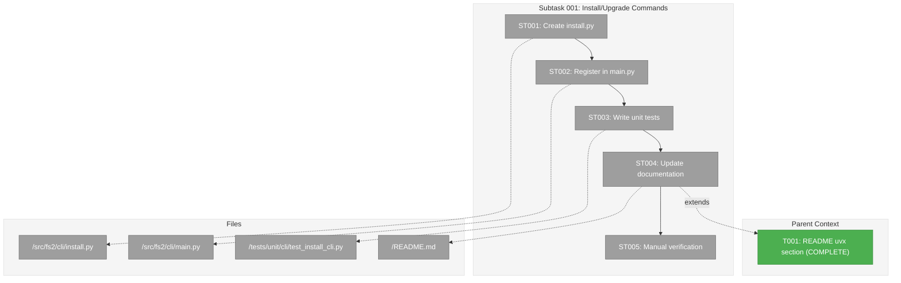
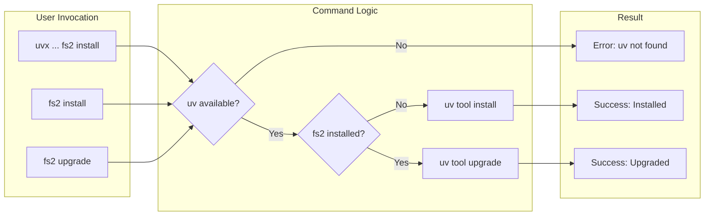
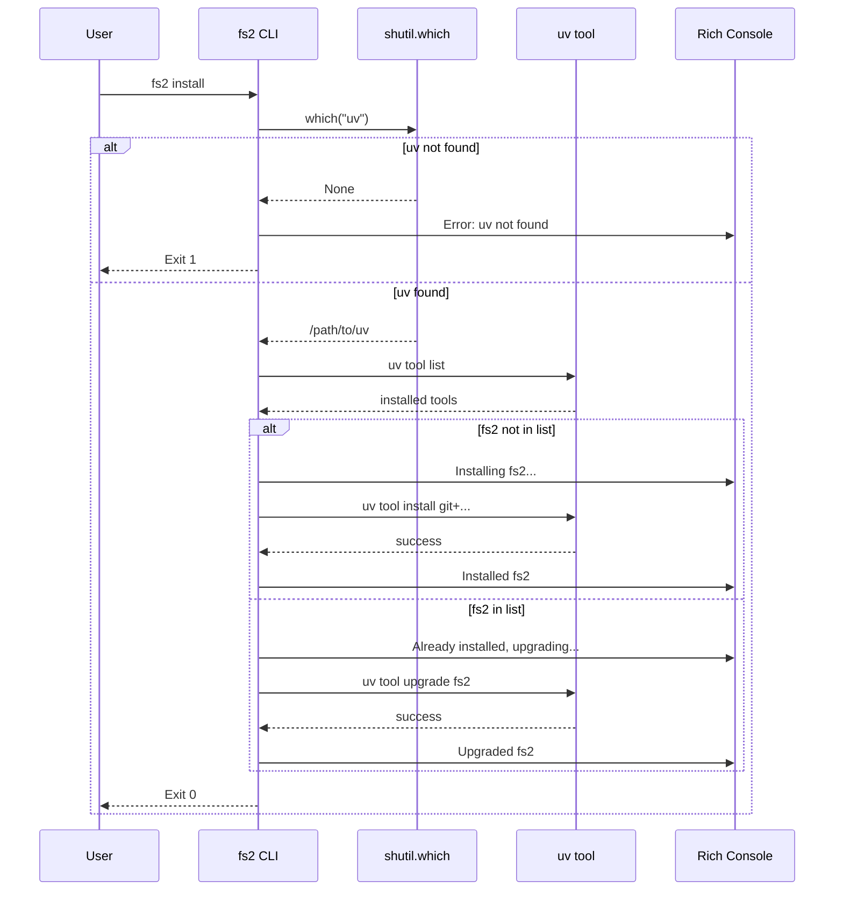

# Subtask 001: Install/Upgrade CLI Commands

**Parent Plan:** [View Plan](../../uvx-support-plan.md)
**Parent Phase:** Phase 1: Implementation
**Parent Task(s):** [T001: README uvx section](./tasks.md#tasks) (extends uvx functionality)
**Plan Task Reference:** [Implementation Phase](../../uvx-support-plan.md#implementation-single-phase)

**Why This Subtask:**
After documenting uvx usage, users need a self-bootstrapping way to permanently install fs2. Running `uvx --from git+... fs2 install` should install fs2 as a permanent tool, eliminating the need for subsequent uvx invocations.

**Created:** 2026-01-02
**Requested By:** Development Team

---

## Executive Briefing

### Purpose
This subtask adds `fs2 install` and `fs2 upgrade` CLI commands that wrap `uv tool install/upgrade`, providing a self-bootstrapping experience where users discover fs2 via uvx, then the tool installs itself permanently with a single command.

### What We're Building
Two CLI commands (same behavior, different names for UX clarity):
- `fs2 install` - Checks if fs2 is installed; if not, runs `uv tool install`; if yes, runs `uv tool upgrade`
- `fs2 upgrade` - Alias for install (same idempotent behavior)

Both commands:
- Detect if `uv` is available (error with helpful message if not)
- Detect if fs2 is already installed via `uv tool list`
- Run appropriate uv command based on state
- Provide Rich-formatted success/error messages

### Unblocks
- Completes the uvx user journey: discover via uvx → install permanently → use directly
- Enables users to run `uvx --from git+... fs2 install` once, then use `fs2` directly forever

### Example
```bash
# First time (via uvx)
$ uvx --from git+https://github.com/AI-Substrate/flow_squared fs2 install
ℹ Installing fs2...
✓ Installed fs2 v0.1.0 (main @ abc1234)
  Now available as 'fs2' command globally

# After installation
$ fs2 install
ℹ fs2 already installed, upgrading...
✓ Upgraded fs2 v0.1.0 → v0.1.1 (main @ def5678)
```

---

## Objectives & Scope

### Objective
Implement self-bootstrapping CLI commands so users can permanently install fs2 from a uvx invocation.

### Goals

- ✅ Create `install.py` with `install()` and `upgrade()` functions
- ✅ Register both commands in `main.py`
- ✅ Handle `uv` not available with helpful error message
- ✅ Detect existing installation via `uv tool list`
- ✅ Run `uv tool install` for new installations
- ✅ Run `uv tool upgrade` for existing installations
- ✅ Show version, git branch, and commit ID in success messages
- ✅ Add `fs2 --version` command showing version and git info
- ✅ Write unit tests with mocked subprocess
- ✅ Update README.md with install command documentation

### Non-Goals

- ❌ Windows-specific handling (Linux/macOS only for now)
- ❌ Uninstall command (out of scope)
- ❌ Version pinning options (use default latest)
- ❌ Custom GitHub URL override (hardcoded to AI-Substrate/flow_squared)

---

## Architecture Map

### Component Diagram
<!-- Status: grey=pending, orange=in-progress, green=completed, red=blocked -->
<!-- Updated by plan-6 during implementation -->



### Task-to-Component Mapping

<!-- Status: ⬜ Pending | 🟧 In Progress | ✅ Complete | 🔴 Blocked -->

| Task | Component(s) | Files | Status | Comment |
|------|-------------|-------|--------|---------|
| ST001 | CLI Command | /workspaces/flow_squared/src/fs2/cli/install.py | ⬜ Pending | Core install/upgrade logic with subprocess |
| ST002 | CLI Registration | /workspaces/flow_squared/src/fs2/cli/main.py | ⬜ Pending | Add 2 imports + 2 app.command() calls |
| ST003 | Unit Tests | /workspaces/flow_squared/tests/unit/cli/test_install_cli.py | ⬜ Pending | Mock subprocess, test all branches |
| ST004 | Documentation | /workspaces/flow_squared/README.md | ⬜ Pending | Add install command to uvx section |
| ST005 | Verification | -- | ⬜ Pending | Manual test: real uv install/upgrade cycle |

---

## Tasks

| Status | ID | Task | CS | Type | Dependencies | Absolute Path(s) | Validation | Subtasks | Notes |
|--------|-----|------|----|------|--------------|------------------|------------|----------|-------|
| [x] | ST000 | Experiment with uv/uvx behavior | 1 | Research | -- | -- | Document findings in execution log | -- | Install/upgrade/list commands, output formats, metadata locations |
| [x] | ST001 | Create install.py with install/upgrade functions + version display | 2 | Core | ST000 | /workspaces/flow_squared/src/fs2/cli/install.py | Functions exist, show version/branch/commit | -- | S:1 I:1 D:0 N:1 F:1 T:0 = 4pts |
| [x] | ST002 | Register install/upgrade commands + --version flag in main.py | 1 | Core | ST001 | /workspaces/flow_squared/src/fs2/cli/main.py | Commands + --version appear in `fs2 --help` | -- | S:0 I:1 D:1 N:0 F:0 T:0 = 2pts |
| [x] | ST003 | ~~Write unit tests for install command~~ | -- | -- | -- | -- | SKIPPED: Mocking subprocess for uv is messy for CI | -- | Manual verification in ST005 instead |
| [x] | ST004 | Update README.md with install command | 1 | Docs | ST001-ST003 | /workspaces/flow_squared/README.md | Install command documented in uvx section | -- | S:0 I:0 D:1 N:0 F:0 T:0 = 1pt |
| [x] | ST005 | Manual verification with real uv commands | 1 | Test | ST001-ST004 | -- | Run actual install/upgrade cycle, document in execution log | -- | Verifies git-source upgrade works |

---

## Alignment Brief

### Objective Recap
Extend the uvx support plan with self-bootstrapping CLI commands that allow users to permanently install fs2 from a uvx invocation.

### Checklist (from parent acceptance criteria)
- [x] uvx documentation complete (parent phase)
- [ ] Install command works from uvx invocation (this subtask)
- [ ] Upgrade command works for existing installations (this subtask)

### Critical Findings Affecting This Subtask

| # | Finding | Impact | Addressed By |
|---|---------|--------|--------------|
| 01 | CLI uses Typer with commands in separate files | Follow existing pattern | ST001, ST002 |
| 02 | Entry point: `app.command(name="...")(func)` | Use same registration pattern | ST002 |
| 03 | No existing subprocess usage in CLI | First subprocess command, handle errors | ST001 |
| 04 | Test pattern: CliRunner + monkeypatch | Follow existing test patterns | ST003 |
| 05 | `uv tool list` output format: `name version` | Parse to detect installation | ST001 |

### ADR Decision Constraints

**N/A** - No ADRs affect this subtask.

### Invariants & Guardrails

- **GitHub URL**: Hardcode `git+https://github.com/AI-Substrate/flow_squared`
- **Idempotent**: Both install and upgrade have identical behavior
- **Error Handling**: Graceful failure when `uv` not available
- **No Side Effects**: Only runs uv commands, no file modifications

### Inputs to Read

| File | Purpose | Lines |
|------|---------|-------|
| /workspaces/flow_squared/src/fs2/cli/main.py | Command registration pattern | 1-67 |
| /workspaces/flow_squared/src/fs2/cli/init.py | Simple command example | 1-72 |
| /workspaces/flow_squared/tests/unit/cli/test_init_cli.py | Test pattern | 1-172 |

### Flow Diagram



### Sequence Diagram



### Test Plan

**Approach**: TDD with mocked subprocess (no actual uv calls in tests)

| Test | Description | Expected |
|------|-------------|----------|
| test_uv_not_available | shutil.which returns None | Exit 1, "uv not found" message |
| test_fs2_not_installed_installs | uv tool list empty | Calls `uv tool install`, success message with version |
| test_fs2_installed_upgrades | uv tool list contains fs2 | Calls `uv tool upgrade`, success message with version |
| test_install_failure | uv tool install fails | Exit 1, error message shown |
| test_upgrade_same_as_install | Call upgrade command | Same behavior as install |
| test_version_flag | Run `fs2 --version` | Shows version and source info |
| test_version_parsing | Parse various `uv tool list` formats | Correctly extracts version/source |
| test_version_parsing_fallback | Malformed `uv tool list` output | Graceful fallback to basic version |

### Implementation Outline

0. **ST000: Experiment with uv/uvx behavior**
   - Run `uv tool install git+https://github.com/AI-Substrate/flow_squared` on a test system
   - Examine `uv tool list` output format (with and without `--show-paths`)
   - Explore `~/.local/share/uv/tools/fs2/` directory structure
   - Check what metadata/lockfiles exist and what info they contain
   - Test `uv tool upgrade fs2` behavior with git-installed packages
   - Document: What version info is available? Branch? Commit? Source URL?
   - Determine best approach for version display based on findings
   - Record all findings in execution log before proceeding to ST001

1. **ST001: Create install.py**
   - Define `GITHUB_URL` constant
   - Implement `_uv_available()` using `shutil.which`
   - Implement `_is_fs2_installed()` using subprocess + parse output
   - Implement `_get_installed_version()` to parse version from `uv tool list`
   - Implement `_get_version_info()` to get version, branch, commit from package metadata
   - Implement `install()` function with Typer signature
   - Show version/branch/commit in success message
   - Create `upgrade = install` alias
   - Implement `get_version_string()` for --version flag

2. **ST002: Register in main.py**
   - Add import: `from fs2.cli.install import install, upgrade, get_version_string`
   - Add: `app.command(name="install")(install)`
   - Add: `app.command(name="upgrade")(upgrade)`
   - Add `--version` callback to app using Typer's version_callback pattern

3. **ST003: Write unit tests**
   - Use `CliRunner` from `typer.testing`
   - Mock `shutil.which` and `subprocess.run`
   - Test all branches: uv missing, install new, upgrade existing, failures

4. **ST004: Update README.md**
   - Add install command to "Option 2: Zero-Install with uvx" section
   - Show example: `uvx --from git+... fs2 install`

### Commands to Run

```bash
# Run tests (after implementation)
UV_CACHE_DIR=/workspaces/flow_squared/.uv_cache uv run pytest tests/unit/cli/test_install_cli.py -v

# Lint check
uv run ruff check src/fs2/cli/install.py

# Verify commands appear
uv run python -m fs2.cli.main --help
```

### Risks & Unknowns

| Risk | Severity | Mitigation |
|------|----------|------------|
| `uv tool list` output format changes | Low | Parse conservatively, test with real output |
| Network errors during install | Low | Let subprocess error propagate, show stderr |
| Different uv versions | Low | Use stable CLI interface only |

### Ready Check

- [x] Parent phase reviewed (complete)
- [x] Critical findings mapped to subtasks
- [x] Test plan defined (TDD with mocked subprocess)
- [x] Implementation outline complete
- [x] Commands documented
- [x] No time estimates (CS scores only)

**Status**: ✅ READY FOR GO

---

## Phase Footnote Stubs

_To be populated by plan-6 during implementation._

| Footnote | Task | Files Modified |
|----------|------|----------------|
| | | |

---

## Evidence Artifacts

| Artifact | Location | Purpose |
|----------|----------|---------|
| Execution Log | `./001-subtask-install-upgrade-cli-commands.execution.log.md` | Detailed implementation narrative |
| install.py | `/workspaces/flow_squared/src/fs2/cli/install.py` | New CLI command module |
| test_install_cli.py | `/workspaces/flow_squared/tests/unit/cli/test_install_cli.py` | Unit tests |

---

## Discoveries & Learnings

_Populated during implementation by plan-6. Log anything of interest to your future self._

| Date | Task | Type | Discovery | Resolution | References |
|------|------|------|-----------|------------|------------|
| | | | | | |

**Types**: `gotcha` | `research-needed` | `unexpected-behavior` | `workaround` | `decision` | `debt` | `insight`

**What to log**:
- Things that didn't work as expected
- External research that was required
- Implementation troubles and how they were resolved
- Gotchas and edge cases discovered
- Decisions made during implementation
- Technical debt introduced (and why)
- Insights that future phases should know about

_See also: `execution.log.md` for detailed narrative._

---

## After Subtask Completion

**This subtask extends:**
- Parent Task: [T001: README uvx section](./tasks.md#tasks)
- Plan Phase: [Implementation (Single Phase)](../../uvx-support-plan.md#implementation-single-phase)

**When all ST### tasks complete:**

1. **Record completion** in parent execution log:
   ```
   ### Subtask 001-subtask-install-upgrade-cli-commands Complete

   Resolved: Added fs2 install and fs2 upgrade CLI commands
   See detailed log: [subtask execution log](./001-subtask-install-upgrade-cli-commands.execution.log.md)
   ```

2. **Update parent task** (if applicable):
   - Open: [`tasks.md`](./tasks.md)
   - T001 Subtasks column: Add `001-subtask-install-upgrade-cli-commands`

3. **Resume parent phase work** (if needed):
   ```bash
   /plan-6-implement-phase --phase "Phase 1: Implementation" \
     --plan "/workspaces/flow_squared/docs/plans/013-uvx-support/uvx-support-plan.md"
   ```

**Quick Links:**
- [Parent Dossier](./tasks.md)
- [Parent Plan](../../uvx-support-plan.md)
- [Parent Execution Log](./execution.log.md)

---

## Directory Layout

```
docs/plans/013-uvx-support/
├── uvx-support-spec.md
├── uvx-support-plan.md
└── tasks/
    └── phase-1-implementation/
        ├── tasks.md
        ├── execution.log.md
        ├── 001-subtask-install-upgrade-cli-commands.md          # THIS FILE
        └── 001-subtask-install-upgrade-cli-commands.execution.log.md  # Created by plan-6
```

---

## Critical Insights Discussion

**Session**: 2026-01-02
**Context**: Subtask 001: Install/Upgrade CLI Commands
**Analyst**: AI Clarity Agent
**Reviewer**: Development Team
**Format**: Water Cooler Conversation (5 Critical Insights)

### Insight 1: Verify Git-Source Upgrade Behavior

**Did you know**: `uv tool upgrade fs2` correctly remembers the git source URL, but we should verify this in testing.

**Implications**:
- Unit tests mock subprocess, won't catch real uv behavior
- Need manual verification to confirm upgrade works with git-installed packages

**Options Considered**:
- Option A: Add Manual Verification Step - one-time check during implementation
- Option B: Add Integration Test - automated but adds CI complexity
- Option C: Keep Unit Tests Only - trust uv's documented behavior

**AI Recommendation**: Option A - Manual Verification Step
- Reasoning: Practical verification without CI complexity

**Discussion Summary**: Confirmed uv remembers git sources via Perplexity research. Added manual verification step.

**Decision**: Added ST005 for manual verification with real uv commands.

**Action Items**:
- [x] Added ST005 to tasks table
- [x] Updated architecture diagram

**Affects**: Tasks table, test strategy

---

### Insight 2: Shell Alias Collision After Install

**Did you know**: Users with existing shell aliases would still use uvx after running `fs2 install`.

**Implications**:
- "Permanent install" benefit invisible to users with aliases
- Already experienced this issue earlier in conversation

**Options Considered**:
- Option A: Document Alias Cleanup in README
- Option B: Detect and Warn at Runtime
- Option C: Both - Document AND Warn

**AI Recommendation**: Option C - Both approaches

**Discussion Summary**: User decided shell alias was an experiment that didn't work out.

**Decision**: Remove all shell alias instructions from documentation.

**Action Items**:
- [x] Removed alias section from README.md
- [x] Removed alias section from docs/how/AGENTS.md

**Affects**: README.md, AGENTS.md

---

### Insight 3: Success Messages Should Show Version Info

**Did you know**: Users couldn't verify what version was installed or if an upgrade changed anything.

**Implications**:
- No way to confirm success beyond "it didn't error"
- Harder support/debugging

**Options Considered**:
- Option A: Show Version in Success Message
- Option B: Add `fs2 --version` Command
- Option C: Keep It Simple (No Version Display)

**AI Recommendation**: Option C - Keep It Simple

**Discussion Summary**: User requested full version display: version, git branch, and commit ID. Also requested `--version` command.

**Decision**: Show version, git branch, and commit ID in success messages. Add `fs2 --version` command.

**Action Items**:
- [x] Updated goals with version display requirements
- [x] Updated example output in Executive Briefing
- [x] Updated ST001 and ST002 task descriptions

**Affects**: ST001, ST002, goals, example output

---

### Insight 4: Getting Git Info Without Build System

**Did you know**: Git branch/commit isn't preserved in installed packages without a build system.

**Implications**:
- Can't embed git info at build time (no build system yet)
- Need runtime approach to get version info

**Options Considered**:
- Option A: Embed Git Info at Build Time - requires build system
- Option B: Query uv's Internal Metadata - relies on internals
- Option C: Version Only from Package Metadata - no git info
- Option D: Parse `uv tool list` Output - uses official CLI

**AI Recommendation**: Option A (Build Time), but user noted no build system exists.

**Discussion Summary**: User clarified we don't have a build system. Must use uv to get info. Added experimentation task to understand actual uv behavior before implementation.

**Decision**: Use Option D (parse `uv tool list`). Added ST000 to experiment with uv behavior first.

**Action Items**:
- [x] Added ST000: Experiment with uv/uvx behavior
- [x] Added experimentation steps to implementation outline
- [x] ST001 now depends on ST000

**Affects**: Tasks table, implementation outline, task dependencies

---

### Insight 5: Test Plan Needs Version-Related Tests

**Did you know**: The test plan didn't include tests for the new version display functionality.

**Implications**:
- Version parsing could fail without test coverage
- --version flag untested

**Options Considered**:
- Option A: Add Version Tests to Test Plan
- Option B: Defer Version Tests

**AI Recommendation**: Option A - Add Version Tests

**Discussion Summary**: User agreed to add tests.

**Decision**: Added 3 version-related tests to test plan.

**Action Items**:
- [x] Added test_version_flag
- [x] Added test_version_parsing
- [x] Added test_version_parsing_fallback

**Affects**: Test plan (ST003)

---

## Session Summary

**Insights Surfaced**: 5 critical insights identified and discussed
**Decisions Made**: 5 decisions reached through collaborative discussion
**Action Items Created**: All completed during session
**Files Updated During Session**:
- `001-subtask-install-upgrade-cli-commands.md` (this file) - tasks, tests, implementation outline
- `/workspaces/flow_squared/README.md` - removed shell alias section
- `/workspaces/flow_squared/docs/how/AGENTS.md` - removed shell alias section

**Shared Understanding Achieved**: ✓

**Confidence Level**: High - Key gaps identified and addressed. ST000 experimentation will validate approach before implementation.

**Next Steps**:
Proceed to implementation with `/plan-6-implement-phase --subtask 001-subtask-install-upgrade-cli-commands`

**Notes**:
- ST000 (experimentation) added as gating research before implementation
- Version display approach depends on ST000 findings
- Shell alias feature removed entirely (was experimental)
