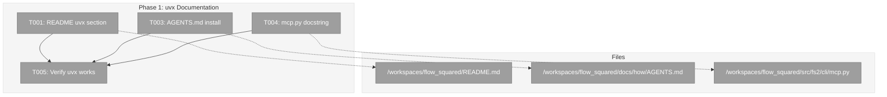
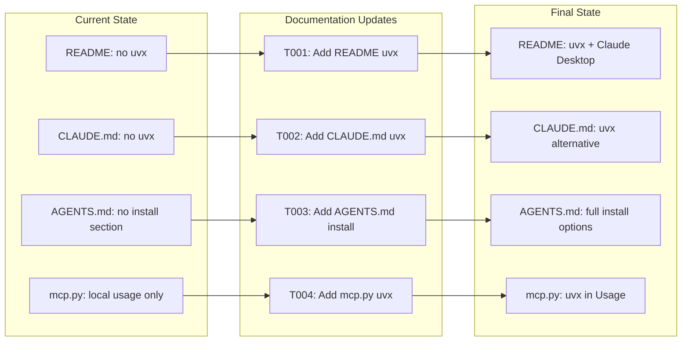
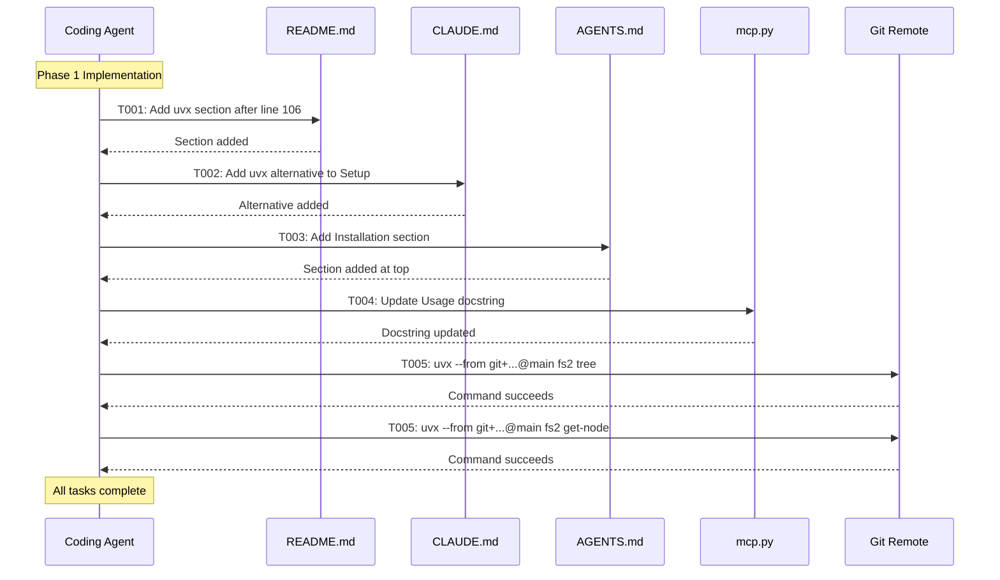

# Phase 1: Implementation – Tasks & Alignment Brief

**Spec**: [../../uvx-support-spec.md](../../uvx-support-spec.md)
**Plan**: [../../uvx-support-plan.md](../../uvx-support-plan.md)
**Date**: 2026-01-02
**Mode**: Simple (single phase)

---

## Executive Briefing

### Purpose
This phase adds uvx documentation to enable zero-install access to fs2 CLI and MCP server directly from the GitHub repository. Users and AI agent operators can run fs2 without cloning or managing Python environments.

### What We're Building
Documentation updates across four files that explain how to use `uvx --from git+https://github.com/AI-Substrate/flow_squared` to run fs2 commands:
- README.md: Quick-start uvx section for general users
- CLAUDE.md: uvx alternative for Claude Code developers working on fs2
- docs/how/AGENTS.md: Installation section for AI agent integration
- src/fs2/cli/mcp.py: Module docstring with uvx example

### User Value
Users can copy-paste a single command to run fs2 immediately, without any prior setup. AI agent configurations (Claude Desktop, etc.) can use uvx for MCP server access.

### Example
**Before**: User must clone repo, install dependencies, then run `fs2 mcp`
**After**: `uvx --from git+https://github.com/AI-Substrate/flow_squared fs2 mcp` - works immediately

---

## Objectives & Scope

### Objective
Document uvx usage patterns for CLI and MCP access, including commit pinning for reproducibility.

### Goals

- ✅ README.md contains uvx CLI usage with copy-pasteable commands
- ✅ README.md shows Claude Desktop configuration using uvx
- ✅ CLAUDE.md fs2 MCP section includes uvx alternative
- ✅ docs/how/AGENTS.md has Installation section with all uvx patterns
- ✅ mcp.py docstring includes uvx example
- ✅ Commit pinning pattern (`@main`, `@<sha>`) documented

### Non-Goals

- ❌ PyPI publishing (explicitly out of scope per spec)
- ❌ Shell aliases or wrapper scripts
- ❌ uvx caching configuration documentation
- ❌ Code changes to fs2 (documentation only)
- ❌ Testing scan command via uvx (uses tree/get-node only)

---

## Architecture Map

### Component Diagram
<!-- Status: grey=pending, orange=in-progress, green=completed, red=blocked -->
<!-- Updated by plan-6 during implementation -->



### Task-to-Component Mapping

<!-- Status: ⬜ Pending | 🟧 In Progress | ✅ Complete | 🔴 Blocked -->

| Task | Component(s) | Files | Status | Comment |
|------|-------------|-------|--------|---------|
| T001 | README | /workspaces/flow_squared/README.md | ⬜ Pending | Add uvx section after Claude Code setup |
| T002 | ~~CLAUDE.md~~ | -- | ✅ Skipped | CLAUDE.md is for dogfooding local changes |
| T003 | AGENTS.md | /workspaces/flow_squared/docs/how/AGENTS.md | ⬜ Pending | Add Installation section at top |
| T004 | mcp.py | /workspaces/flow_squared/src/fs2/cli/mcp.py | ⬜ Pending | Update Usage in module docstring |
| T005 | Verification | -- | ⬜ Pending | Smoke test uvx from git remote |

---

## Tasks

| Status | ID | Task | CS | Type | Dependencies | Absolute Path(s) | Validation | Subtasks | Notes |
|--------|-----|------|----|------|--------------|------------------|------------|----------|-------|
| [~] | T001 | Restructure README.md MCP section with uvx option | 1 | Docs | -- | /workspaces/flow_squared/README.md | MCP section has Option 1 (Local) + Option 2 (uvx) subsections | -- | Reorganize lines 89-128 |
| [x] | T002 | ~~Add uvx alternative to CLAUDE.md~~ | -- | -- | -- | -- | SKIPPED: CLAUDE.md is for dogfooding local changes | -- | Use local install |
| [ ] | T003 | Add Prerequisites + Installation sections to AGENTS.md | 1 | Docs | -- | /workspaces/flow_squared/docs/how/AGENTS.md | Prerequisites (scan step) + Installation with uvx patterns | -- | Insert after Overview |
| [ ] | T004 | Update mcp.py module docstring with uvx example | 1 | Docs | -- | /workspaces/flow_squared/src/fs2/cli/mcp.py | Usage section includes uvx example | -- | Add after line 10 |
| [ ] | T005 | Verify uvx commands work from remote | 1 | Test | T001,T003,T004 | -- | Two-part: (1) `fs2 --help` anywhere, (2) `fs2 tree` from repo root | -- | Part 2 requires `.fs2/` directory |

---

## Alignment Brief

### Prior Phases Review

**N/A** - This is Phase 1 (no prior phases).

### Critical Findings Affecting This Phase

| # | Finding | Impact | Addressed By |
|---|---------|--------|--------------|
| 01 | uvx already works with current pyproject.toml | No code changes needed | All tasks (docs only) |
| 02 | README.md MCP section at lines 89-128 | Insert location identified | T001 |
| 03 | CLAUDE.md fs2 MCP section at lines 214-244 | Insert location identified | T002 |
| 04 | AGENTS.md exists but lacks installation section | Add new section | T003 |
| 05 | mcp.py docstring lacks uvx example | Update Usage section | T004 |

### ADR Decision Constraints

**N/A** - No ADRs exist for this feature.

### Invariants & Guardrails

- **URL Consistency**: All docs must use `git+https://github.com/AI-Substrate/flow_squared`
- **Branch Reference**: Use `@main` for latest, `@<sha>` for pinned commits
- **Read-Only Testing**: Only test `tree` and `get-node` commands (not `scan`)

### Inputs to Read

| File | Purpose | Lines |
|------|---------|-------|
| /workspaces/flow_squared/README.md | MCP section location | 89-128 |
| /workspaces/flow_squared/CLAUDE.md | fs2 MCP section | 214-244 |
| /workspaces/flow_squared/docs/how/AGENTS.md | Full file for insertion point | 1-183 |
| /workspaces/flow_squared/src/fs2/cli/mcp.py | Module docstring | 1-25 |

### Flow Diagram



### Sequence Diagram



### Test Plan

**Approach**: Manual verification (documentation-only task per spec)

| Test | Description | Expected |
|------|-------------|----------|
| README uvx section | Section exists with CLI, MCP, and commit pinning examples | All three patterns present |
| CLAUDE.md uvx | uvx alternative shown in fs2 MCP Server section | Alternative exists alongside `claude mcp add` |
| AGENTS.md install | Installation section with uvx, Claude MCP add, Claude Desktop | All three options documented |
| mcp.py docstring | Usage section includes uvx example | uvx command shown |
| uvx smoke test | `uvx --from git+...@main fs2 tree` executes | Help text or tree output shown |

### Implementation Outline

1. **T001**: Edit README.md
   - Read current MCP section (lines 89-128)
   - Insert uvx subsection after line 106 (after `claude mcp list`)
   - Include: CLI examples, Claude Desktop JSON with uvx, commit pinning

2. **T002**: Edit CLAUDE.md
   - Read fs2 MCP Server section (lines 214-244)
   - Add uvx alternative in Setup subsection
   - Keep existing `claude mcp add` pattern, add uvx as alternative

3. **T003**: Edit AGENTS.md
   - Read Overview section (lines 1-7)
   - Insert Installation section after Overview
   - Include: uvx (zero-install), Claude MCP add, Claude Desktop config

4. **T004**: Edit mcp.py
   - Read module docstring (lines 1-25)
   - Update Usage section (after line 10)
   - Add uvx example after existing `fs2 mcp` usage

5. **T005**: Verify
   - Run `uvx --from git+https://github.com/AI-Substrate/flow_squared@main fs2 tree`
   - Run `uvx --from git+https://github.com/AI-Substrate/flow_squared@main fs2 get-node --help`
   - Confirm both execute without error

### Commands to Run

```bash
# Verification (T005) - Two-part test

# Part 1: Proves uvx install works (run from anywhere)
uvx --from git+https://github.com/AI-Substrate/flow_squared@main fs2 --help

# Part 2: Proves tools work (run from repo root where .fs2/ exists)
cd /workspaces/flow_squared
uvx --from git+https://github.com/AI-Substrate/flow_squared@main fs2 tree

# Lint check (optional)
uv run ruff check src/fs2/cli/mcp.py
```

### Risks & Unknowns

| Risk | Severity | Mitigation |
|------|----------|------------|
| GitHub rate limiting | Low | uvx caches builds locally after first run |
| Remote changes before push | Low | Test with current main branch SHA |

### Ready Check

- [x] Prior phases reviewed (N/A - Phase 1)
- [x] Critical findings mapped to tasks
- [x] ADR constraints mapped to tasks (N/A - no ADRs)
- [x] Test plan defined
- [x] Implementation outline complete
- [x] Commands documented

**Status**: ✅ READY FOR GO

---

## Phase Footnote Stubs

_To be populated by plan-6a during implementation._

| Footnote | Task | Files Modified |
|----------|------|----------------|
| | | |

---

## Evidence Artifacts

| Artifact | Location | Purpose |
|----------|----------|---------|
| Execution Log | `./execution.log.md` | Detailed implementation narrative |
| Updated README | `/workspaces/flow_squared/README.md` | uvx documentation |
| Updated CLAUDE.md | `/workspaces/flow_squared/CLAUDE.md` | uvx alternative |
| Updated AGENTS.md | `/workspaces/flow_squared/docs/how/AGENTS.md` | Installation section |
| Updated mcp.py | `/workspaces/flow_squared/src/fs2/cli/mcp.py` | uvx in docstring |

---

## Discoveries & Learnings

_Populated during implementation by plan-6. Log anything of interest to your future self._

| Date | Task | Type | Discovery | Resolution | References |
|------|------|------|-----------|------------|------------|
| | | | | | |

**Types**: `gotcha` | `research-needed` | `unexpected-behavior` | `workaround` | `decision` | `debt` | `insight`

**What to log**:
- Things that didn't work as expected
- External research that was required
- Implementation troubles and how they were resolved
- Gotchas and edge cases discovered
- Decisions made during implementation
- Technical debt introduced (and why)
- Insights that future phases should know about

_See also: `execution.log.md` for detailed narrative._

---

## Directory Layout

```
docs/plans/013-uvx-support/
├── uvx-support-spec.md
├── uvx-support-plan.md
└── tasks/
    └── phase-1-implementation/
        ├── tasks.md           # This file
        └── execution.log.md   # Created by plan-6
```
