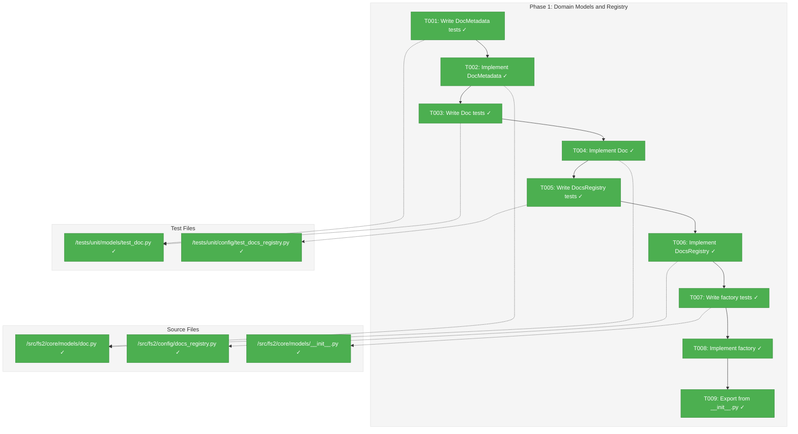
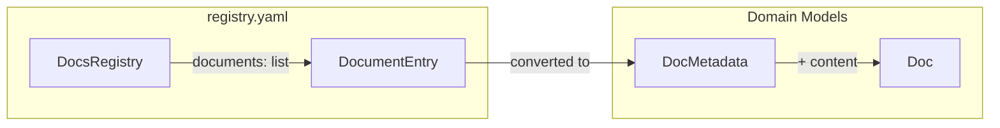
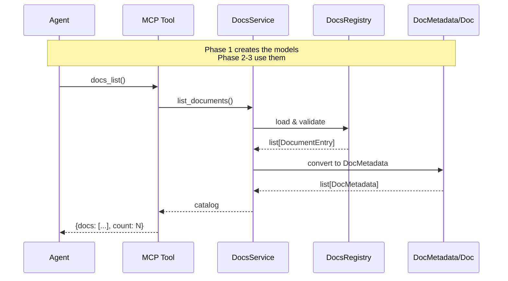

# Phase 1: Domain Models and Registry – Tasks & Alignment Brief

**Spec**: [../../mcp-doco-spec.md](../../mcp-doco-spec.md)
**Plan**: [../../mcp-doco-plan.md](../../mcp-doco-plan.md)
**Date**: 2026-01-02
**Phase Slug**: `phase-1-domain-models-and-registry`

---

## Executive Briefing

### Purpose
This phase establishes the foundational domain models for the MCP documentation system. These models define the contract for how documentation metadata and content are represented throughout the system, enabling type-safe registry validation and document retrieval.

### What We're Building
Three domain models that form the core data structures:

1. **`DocMetadata`** - A frozen dataclass representing document metadata (id, title, summary, category, tags, path). Used for catalog listings without loading full content.

2. **`Doc`** - A frozen dataclass combining metadata with full markdown content. Returned when agents request complete document content.

3. **`DocsRegistry`** - A Pydantic model for validating the `registry.yaml` structure. Ensures invalid registries fail fast with actionable error messages.

### User Value
By establishing well-typed domain models:
- Registry validation catches typos/errors at load time, not tool call time
- AI agents receive consistent, predictable response structures
- Type safety prevents bugs in filtering and serialization logic

### Example
```python
# DocMetadata in catalog response
DocMetadata(
    id="agents",
    title="AI Agent Guidance",
    summary="Best practices for AI agents using fs2 tools...",
    category="how-to",
    tags=("agents", "mcp", "getting-started"),
    path="agents.md"
)

# Doc with full content
Doc(
    metadata=DocMetadata(...),
    content="# AI Agent Guidance\n\nThis document provides..."
)
```

---

## Objectives & Scope

### Objective
Create domain models for documentation metadata, documents, and registry validation following fs2 patterns (frozen dataclasses, Pydantic v2).

**Behavior Checklist** (from spec AC1, AC4, AC6):
- [x] DocMetadata has all 6 required fields: id, title, summary, category, tags, path
- [x] Doc combines metadata with content field
- [x] DocsRegistry validates registry.yaml structure with actionable errors
- [x] Document IDs match pattern `^[a-z0-9-]+$`
- [x] Models are immutable (frozen)
- [x] Models exported from `fs2.core.models`

### Goals

- ✅ Create `DocMetadata` frozen dataclass with 6 fields
- ✅ Create `Doc` frozen dataclass composing metadata + content
- ✅ Create `DocsRegistry` Pydantic model with field validation
- ✅ Validate document ID pattern (`^[a-z0-9-]+$`)
- ✅ Add `DocMetadata.from_registry_entry()` factory method (per DYK-1)
- ✅ Export models from `src/fs2/core/models/__init__.py`
- ✅ Full TDD with tests written first

### Non-Goals

- ❌ Loading documents from files (Phase 2: DocsService)
- ❌ MCP tool integration (Phase 3)
- ❌ Creating actual documentation files (Phase 4)
- ❌ Registry caching or lazy loading (not needed per spec)
- ❌ Section extraction from documents (spec explicitly excludes)
- ❌ Path validation (paths validated at load time in Phase 2, not at model level)
- ❌ Frontmatter parsing (registry approach chosen per spec)

---

## Architecture Map

### Component Diagram
<!-- Status: grey=pending, orange=in-progress, green=completed, red=blocked -->
<!-- Updated by plan-6 during implementation -->



### Task-to-Component Mapping

<!-- Status: ⬜ Pending | 🟧 In Progress | ✅ Complete | 🔴 Blocked -->

| Task | Component(s) | Files | Status | Comment |
|------|-------------|-------|--------|---------|
| T001 | DocMetadata Tests | /workspaces/flow_squared/tests/unit/models/test_doc.py | ✅ Complete | TDD: 10 failing tests written for immutability, required fields |
| T002 | DocMetadata Model | /workspaces/flow_squared/src/fs2/core/models/doc.py | ✅ Complete | Frozen dataclass with 6 fields, tuple for tags |
| T003 | Doc Tests | /workspaces/flow_squared/tests/unit/models/test_doc.py | ✅ Complete | 5 failing tests for Doc composition |
| T004 | Doc Model | /workspaces/flow_squared/src/fs2/core/models/doc.py | ✅ Complete | Composition: metadata + content |
| T005 | DocsRegistry Tests | /workspaces/flow_squared/tests/unit/config/test_docs_registry.py | ✅ Complete | 13 failing tests for Pydantic validation |
| T006 | DocsRegistry Model | /workspaces/flow_squared/src/fs2/config/docs_registry.py | ✅ Complete | Per DYK-3: config/ layer for Pydantic |
| T007 | Factory Tests | /workspaces/flow_squared/tests/unit/models/test_doc.py | ✅ Complete | 3 failing tests for factory conversion |
| T008 | Factory Method | /workspaces/flow_squared/src/fs2/core/models/doc.py | ✅ Complete | Per DYK-1: from_registry_entry() factory |
| T009 | Model Exports | /workspaces/flow_squared/src/fs2/core/models/__init__.py | ✅ Complete | Add DocMetadata, Doc to __all__ |

---

## Tasks

| Status | ID | Task | CS | Type | Dependencies | Absolute Path(s) | Validation | Subtasks | Notes |
|--------|------|------|-----|------|--------------|------------------|------------|----------|-------|
| [x] | T001 | Write tests for DocMetadata frozen dataclass | 1 | Test | – | /workspaces/flow_squared/tests/unit/models/test_doc.py | Tests verify: immutability (FrozenInstanceError), 6 required fields (id, title, summary, category, tags, path), tags is tuple | – | 10 tests [^1] |
| [x] | T002 | Implement DocMetadata in doc.py | 1 | Core | T001 | /workspaces/flow_squared/src/fs2/core/models/doc.py | All T001 tests pass, @dataclass(frozen=True) | – | Frozen dataclass [^1] |
| [x] | T003 | Write tests for Doc frozen dataclass | 1 | Test | T002 | /workspaces/flow_squared/tests/unit/models/test_doc.py | Tests verify: metadata field, content field (str), immutability | – | 5 tests [^1] |
| [x] | T004 | Implement Doc dataclass | 1 | Core | T003 | /workspaces/flow_squared/src/fs2/core/models/doc.py | All T003 tests pass | – | Composition [^1] |
| [x] | T005 | Write tests for DocsRegistry Pydantic model | 2 | Test | T004 | /workspaces/flow_squared/tests/unit/config/test_docs_registry.py | Tests verify: YAML parsing, validation errors for missing fields, ID pattern ^[a-z0-9-]+$, actionable error messages | – | 13 tests [^2] |
| [x] | T006 | Implement DocsRegistry Pydantic model | 2 | Core | T005 | /workspaces/flow_squared/src/fs2/config/docs_registry.py | All T005 tests pass, uses Pydantic v2 patterns, Field(pattern=...) | – | Per DYK-3 [^2] |
| [x] | T007 | Write tests for `DocMetadata.from_registry_entry()` factory | 1 | Test | T006 | /workspaces/flow_squared/tests/unit/models/test_doc.py | Tests verify: converts DocumentEntry→DocMetadata, handles list→tuple for tags | – | 3 tests [^1] |
| [x] | T008 | Implement `DocMetadata.from_registry_entry()` factory method | 1 | Core | T007 | /workspaces/flow_squared/src/fs2/core/models/doc.py | All T007 tests pass, returns frozen DocMetadata from Pydantic entry | – | Per DYK-1 [^1] |
| [x] | T009 | Export DocMetadata, Doc from __init__.py | 1 | Integration | T008 | /workspaces/flow_squared/src/fs2/core/models/__init__.py | `from fs2.core.models import DocMetadata, Doc` works | – | Exports [^1] |

---

## Alignment Brief

### Prior Phases Review

*N/A - This is Phase 1 (foundational phase with no prior phases)*

### Critical Findings Affecting This Phase

| Finding | Impact | Constraint/Requirement | Addressed By |
|---------|--------|------------------------|--------------|
| 🚨 Critical Finding 02: importlib.resources Wheel Compatibility | Medium | Models must not assume filesystem paths; paths are relative strings resolved at load time | T002, T004: path field is `str`, not `Path` |
| 🔴 High Finding 04: Registry Validation | High | Invalid registry.yaml must fail fast with actionable errors, not at tool call time | T005, T006: DocsRegistry Pydantic model with strict validation |

### ADR Decision Constraints

*No ADRs found for this feature.*

### Invariants & Guardrails

- **Immutability**: All domain models MUST use `@dataclass(frozen=True)`
- **Type Safety**: Use `tuple` for immutable sequences (tags), not `list`
- **ID Pattern**: Document IDs MUST match `^[a-z0-9-]+$` (lowercase, numbers, hyphens only)
- **No Filesystem Assumptions**: `path` field is a relative string, not a `Path` object (per Critical Finding 02)
- **Pydantic v2**: Use Pydantic v2 patterns only (Field, model_validator, etc.)

### Inputs to Read

| File | Purpose |
|------|---------|
| /workspaces/flow_squared/src/fs2/core/models/code_node.py | Reference for frozen dataclass pattern |
| /workspaces/flow_squared/src/fs2/core/models/__init__.py | Understand export pattern |
| /workspaces/flow_squared/tests/unit/models/test_domain_models.py | Reference for test documentation pattern |
| /workspaces/flow_squared/src/fs2/config/objects.py | Reference for Pydantic v2 validation patterns (DocsRegistry goes here per DYK-3) |

### Visual Alignment Aids

#### Flow Diagram: Model Relationships



#### Sequence Diagram: Model Usage (Preview of Phase 2-3)



### Test Plan

**Testing Approach**: Full TDD (per spec)
**Mock Usage**: None - pure domain models with no dependencies

#### Test Suite: test_doc.py

| Test Name | Purpose | Expected Output |
|-----------|---------|-----------------|
| `test_docmetadata_is_frozen` | Proves immutability | FrozenInstanceError on assignment |
| `test_docmetadata_requires_all_fields` | Proves all 6 fields required | TypeError on missing fields |
| `test_docmetadata_id_field` | Proves id is string | Field accessible |
| `test_docmetadata_title_field` | Proves title is string | Field accessible |
| `test_docmetadata_summary_field` | Proves summary is string | Field accessible |
| `test_docmetadata_category_field` | Proves category is string | Field accessible |
| `test_docmetadata_tags_is_tuple` | Proves tags is tuple (immutable) | isinstance(tags, tuple) |
| `test_docmetadata_path_is_string` | Proves path is string (not Path) | isinstance(path, str) |
| `test_doc_is_frozen` | Proves Doc immutability | FrozenInstanceError on assignment |
| `test_doc_has_metadata_field` | Proves metadata composition | metadata is DocMetadata |
| `test_doc_has_content_field` | Proves content is string | isinstance(content, str) |
| `test_from_registry_entry_converts_correctly` | Proves factory creates DocMetadata from DocumentEntry | All fields match |
| `test_from_registry_entry_converts_tags_list_to_tuple` | Proves list→tuple conversion for tags | tags is tuple |

#### Test Suite: test_docs_registry.py

| Test Name | Purpose | Expected Output |
|-----------|---------|-----------------|
| `test_registry_parses_valid_yaml` | Proves YAML parsing works | DocsRegistry instance |
| `test_registry_validates_required_fields` | Proves validation catches missing fields | ValidationError with field name |
| `test_registry_validates_id_pattern` | Proves ID pattern enforced | ValidationError for "Invalid ID" |
| `test_registry_rejects_uppercase_id` | Proves uppercase rejected | ValidationError |
| `test_registry_rejects_spaces_in_id` | Proves spaces rejected | ValidationError |
| `test_registry_accepts_valid_id` | Proves valid IDs pass | No error |
| `test_registry_documents_is_list` | Proves documents field is list | isinstance check |
| `test_registry_empty_documents_valid` | Proves empty list is valid | No error |

### Step-by-Step Implementation Outline

1. **T001**: Create `/workspaces/flow_squared/tests/unit/models/test_doc.py`
   - Add `@pytest.mark.unit` class `TestDocMetadata`
   - Write 8 failing tests for DocMetadata
   - Follow docstring pattern from test_domain_models.py

2. **T002**: Create `/workspaces/flow_squared/src/fs2/core/models/doc.py`
   - Define `DocMetadata` as `@dataclass(frozen=True)`
   - 6 fields: id, title, summary, category, tags (tuple), path (str)
   - Run tests → all pass

3. **T003**: Extend `test_doc.py`
   - Add `TestDoc` class
   - Write 3 failing tests for Doc

4. **T004**: Extend `doc.py`
   - Define `Doc` as `@dataclass(frozen=True)`
   - 2 fields: metadata (DocMetadata), content (str)
   - Run tests → all pass

5. **T005**: Create `/workspaces/flow_squared/tests/unit/config/test_docs_registry.py`
   - Add `@pytest.mark.unit` class `TestDocsRegistry`
   - Write 8 failing tests for DocsRegistry
   - Include validation error message assertions

6. **T006**: Create `/workspaces/flow_squared/src/fs2/config/docs_registry.py` (per DYK-3)
   - Define Pydantic models: `DocumentEntry`, `DocsRegistry`
   - Use `Field(pattern=r"^[a-z0-9-]+$")` for id validation
   - Run tests → all pass

7. **T007**: Extend `test_doc.py` with factory tests
   - Add `TestDocMetadataFactory` class
   - Write 2 failing tests for `from_registry_entry()` (per DYK-1)
   - Test list→tuple conversion for tags

8. **T008**: Add `from_registry_entry()` to DocMetadata
   - Add classmethod that takes `DocumentEntry` and returns `DocMetadata`
   - Convert `tags: list` → `tuple`
   - Run tests → all pass

9. **T009**: Update `/workspaces/flow_squared/src/fs2/core/models/__init__.py`
   - Import DocMetadata, Doc from doc.py
   - Add to `__all__` list
   - Verify import works

### Commands to Run

```bash
# Environment setup (already configured in devcontainer)
cd /workspaces/flow_squared

# Run specific test file during development
UV_CACHE_DIR=.uv_cache uv run pytest tests/unit/models/test_doc.py -v

# Run DocsRegistry tests (in config/ layer per DYK-3)
UV_CACHE_DIR=.uv_cache uv run pytest tests/unit/config/test_docs_registry.py -v

# Run all unit model tests
UV_CACHE_DIR=.uv_cache uv run pytest tests/unit/models/ -v

# Type checking
UV_CACHE_DIR=.uv_cache uv run python -m ruff check src/fs2/core/models/doc.py
UV_CACHE_DIR=.uv_cache uv run python -m ruff check src/fs2/core/models/docs_registry.py

# Lint check
just lint

# Full test suite (after all tasks complete)
just test
```

### Risks & Unknowns

| Risk | Severity | Likelihood | Mitigation |
|------|----------|------------|------------|
| Pydantic v2 migration issues | Low | Low | Reference existing config/objects.py patterns |
| Import cycle with other models | Low | Low | Domain models have no dependencies on services/adapters |
| FrozenInstanceError import path | Low | Low | Use `from dataclasses import FrozenInstanceError` |

### Ready Check

- [x] Plan tasks (1.1-1.7) understood and mapped to T001-T009
- [x] Critical Finding 02 (importlib.resources) addressed: path is string, not Path
- [x] Critical Finding 04 (Registry Validation) addressed: DocsRegistry Pydantic model
- [x] Test patterns understood (test_domain_models.py reviewed)
- [x] Model patterns understood (code_node.py reviewed)
- [x] Export pattern understood (__init__.py reviewed)
- [N/A] ADR constraints mapped to tasks - no ADRs exist for this feature

---

## Phase Footnote Stubs

| ID | Task | Description | References |
|----|------|-------------|------------|
| [^1] | T001-T004, T007-T009 | Domain Models | `class:doc.py:DocMetadata`, `class:doc.py:Doc`, `method:doc.py:DocMetadata.from_registry_entry` |
| [^2] | T005-T006 | Registry Validation | `class:docs_registry.py:DocumentEntry`, `class:docs_registry.py:DocsRegistry` |

---

## Evidence Artifacts

**Execution Log**: `execution.log.md` (created by plan-6 in this directory)

**Supporting Files**:
- Test results from pytest runs
- Ruff lint output (if issues found)

---

## Discoveries & Learnings

_Populated during implementation by plan-6. Log anything of interest to your future self._

| Date | Task | Type | Discovery | Resolution | References |
|------|------|------|-----------|------------|------------|
| | | | | | |

**Types**: `gotcha` | `research-needed` | `unexpected-behavior` | `workaround` | `decision` | `debt` | `insight`

**What to log**:
- Things that didn't work as expected
- External research that was required
- Implementation troubles and how they were resolved
- Gotchas and edge cases discovered
- Decisions made during implementation
- Technical debt introduced (and why)
- Insights that future phases should know about

_See also: `execution.log.md` for detailed narrative._

---

## Directory Layout

```
docs/plans/014-mcp-doco/
├── mcp-doco-spec.md
├── mcp-doco-plan.md
├── research-dossier.md
└── tasks/
    └── phase-1-domain-models-and-registry/
        ├── tasks.md                    # This file
        └── execution.log.md            # Created by plan-6
```

---

**Next Step**: Await explicit **GO** before proceeding to implementation with `/plan-6-implement-phase --phase 1`

---

## Critical Insights Discussion

**Session**: 2026-01-02
**Context**: Phase 1: Domain Models and Registry - Tasks & Alignment Brief
**Analyst**: AI Clarity Agent
**Reviewer**: Development Team
**Format**: Water Cooler Conversation (5 Critical Insights)

### Insight 1: DocumentEntry → DocMetadata Conversion Gap (DYK-1)

**Did you know**: The Phase 1 tasks create two separate representations of document metadata (Pydantic `DocumentEntry` and frozen dataclass `DocMetadata`) without defining how to convert between them.

**Implications**:
- Phase 2's DocsService would have to invent conversion logic
- Two nearly-identical data structures without a bridge
- Conversion could scatter across multiple locations

**Options Considered**:
- Option A: Add `DocMetadata.from_registry_entry()` factory method (Phase 1)
- Option B: Defer to DocsService (Phase 2)
- Option C: Create standalone converter function

**AI Recommendation**: Option A - Factory Method
- Reasoning: Keeps conversion logic testable and close to model, follows ProcessResult.ok()/fail() pattern

**Discussion Summary**: User agreed factory method is cleaner and follows existing patterns.

**Decision**: Add `DocMetadata.from_registry_entry()` factory method in Phase 1

**Action Items**:
- [x] Added T007: Write tests for factory method
- [x] Added T008: Implement factory method
- [x] Renumbered T009: Export models

**Affects**: Tasks T007, T008, T009; Phase 2 DocsService simplified

---

### Insight 2: Triple Tag Conversion (DYK-2)

**Did you know**: The `tags` field goes through three type conversions (YAML list → Pydantic list → dataclass tuple → JSON list), each a potential bug source.

**Implications**:
- Conversion 1: PyYAML creates lists
- Conversion 2: Factory must do `tuple(entry.tags)`
- Conversion 3: JSON serialization converts tuple back to list

**Options Considered**:
- Option A: Keep tuple, accept conversions (current plan)
- Option B: Use list throughout, rely on frozen dataclass
- Option C: Use frozenset for true immutability

**AI Recommendation**: Option A - Keep Tuple
- Reasoning: Consistency with codebase patterns, full immutability, JSON handles conversion automatically

**Discussion Summary**: User confirmed tuple is the right choice for consistency.

**Decision**: Keep `tuple[str, ...]` for tags (current plan confirmed)

**Action Items**: None - current plan already correct

**Affects**: Confirms T002, T008 implementation

---

### Insight 3: DocsRegistry Layer Violation (DYK-3)

**Did you know**: Putting `DocsRegistry` (Pydantic validation model) in `core/models/` breaks the architectural pattern where Pydantic models belong in `config/` layer.

**Implications**:
- `core/models/` is for frozen dataclasses only
- `config/` is for Pydantic validation models (LLMConfig, EmbeddingConfig, etc.)
- Mixing concerns confuses future developers

**Options Considered**:
- Option A: Move DocsRegistry to `config/` layer
- Option B: Keep in `core/models/` with documented exception
- Option C: Create new `schemas/` layer

**AI Recommendation**: Option A - Move to config/
- Reasoning: Follows established pattern, clear precedent, minimal change

**Discussion Summary**: User agreed to maintain layer consistency.

**Decision**: Move DocsRegistry to `src/fs2/config/docs_registry.py`

**Action Items**:
- [x] Updated T005 path: `tests/unit/config/test_docs_registry.py`
- [x] Updated T006 path: `src/fs2/config/docs_registry.py`
- [x] Updated Architecture Map diagram
- [x] Updated Implementation Outline
- [x] Updated Commands to Run

**Affects**: T005, T006, file paths, Architecture Map

---

### Insight 4: Serialization Strategy for Phase 3 (DYK-4)

**Did you know**: Phase 3 needs to serialize `DocMetadata` to JSON, but frozen dataclasses don't have `.model_dump()` - should Phase 1 add a `to_dict()` method?

**Implications**:
- Options: `asdict()`, custom `to_dict()`, or separate serializer
- Tuple→list conversion happens automatically in JSON
- Standard library `asdict()` is idiomatic

**Options Considered**:
- Option A: Add `to_dict()` method to DocMetadata (Phase 1)
- Option B: Let Phase 3 use `dataclasses.asdict()` directly
- Option C: Create separate serializer in Phase 3

**AI Recommendation**: Option B - Use asdict()
- Reasoning: Standard library is idiomatic, avoids premature optimization, well-tested

**Discussion Summary**: User agreed to defer serialization to Phase 3.

**Decision**: Use `dataclasses.asdict()` in Phase 3

**Action Items**: None for Phase 1

**Affects**: Phase 3 implementation only

---

### Insight 5: No Schema Version for Registry (DYK-5)

**Did you know**: The `registry.yaml` schema has no version field, so future breaking changes would fail silently with confusing errors.

**Implications**:
- Adding required fields later breaks all existing registries
- No migration path for schema evolution
- Error messages won't guide users to upgrade

**Options Considered**:
- Option A: Add `schema_version` field now
- Option B: Defer versioning until needed (YAGNI)
- Option C: Use file naming convention

**AI Recommendation**: Option B - Defer
- Reasoning: Registry is bundled with package (not user-created), YAGNI, easy to add later

**Discussion Summary**: User agreed YAGNI applies since we control the bundled registry.

**Decision**: Defer schema versioning until needed

**Action Items**: None - revisit if registry becomes user-editable

**Affects**: Future consideration only

---

## Session Summary

**Insights Surfaced**: 5 critical insights identified and discussed
**Decisions Made**: 5 decisions reached through collaborative discussion
**Action Items Created**: 3 task additions/updates applied immediately
**Areas Updated**:
- Tasks T007, T008 added (factory method)
- T009 renumbered (exports)
- T005, T006 paths changed (config/ layer)
- Architecture Map updated
- Implementation Outline updated
- Commands to Run updated

**Shared Understanding Achieved**: ✓

**Confidence Level**: High - Key architectural decisions made, patterns clarified

**Next Steps**:
Proceed to implementation with `/plan-6-implement-phase --phase 1`

**Notes**:
- DYK-1 through DYK-5 referenced in task Notes columns for traceability
- Phase 3 should use `dataclasses.asdict()` for serialization
- Registry versioning can be added later if needed
