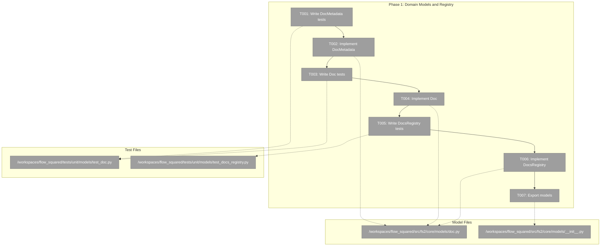
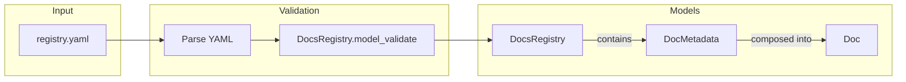
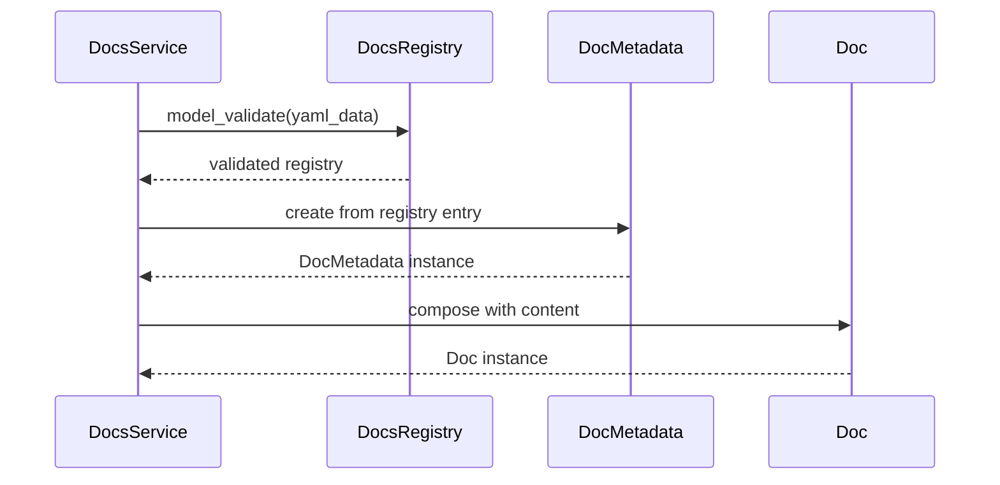

# Phase 1: Domain Models and Registry – Tasks & Alignment Brief

**Spec**: [../../mcp-doco-spec.md](../../mcp-doco-spec.md)
**Plan**: [../../mcp-doco-plan.md](../../mcp-doco-plan.md)
**Date**: 2026-01-02
**Phase Slug**: phase-1-domain-models-and-registry

---

## Executive Briefing

### Purpose
This phase establishes the foundational domain models that represent documentation metadata and content. These models are the building blocks for the entire MCP documentation system—without them, no documents can be stored, validated, or served.

### What We're Building
Three core domain models:
1. **DocMetadata** - A frozen dataclass holding document metadata (id, title, summary, category, tags, path)
2. **Doc** - A frozen dataclass composing DocMetadata with the full markdown content
3. **DocsRegistry** - A Pydantic model that validates the registry.yaml structure and enforces constraints

### User Value
Agents will be able to discover documentation with rich metadata (summaries that explain WHAT and WHEN to use each doc), enabling effective self-service without human intervention.

### Example
```python
# DocMetadata - immutable metadata for a document
meta = DocMetadata(
    id="agents",
    title="AI Agent Guidance",
    summary="Best practices for AI agents using fs2 tools...",
    category="how-to",
    tags=("agents", "mcp", "getting-started"),
    path="agents.md"
)

# Doc - full document with content
doc = Doc(metadata=meta, content="# AI Agent Guidance\n\nThis document...")

# DocsRegistry - validates registry.yaml
registry = DocsRegistry.model_validate(yaml.safe_load(registry_yaml))
```

---

## Objectives & Scope

### Objective
Implement domain models for documentation with full TDD coverage, following fs2 patterns (frozen dataclasses, Pydantic validation, Clean Architecture).

**Behavior Checklist**:
- [ ] DocMetadata is frozen (immutable)
- [ ] DocMetadata requires all 6 fields (id, title, summary, category, tags, path)
- [ ] Doc composes DocMetadata with content field
- [ ] DocsRegistry validates YAML structure
- [ ] DocsRegistry enforces ID pattern `^[a-z0-9-]+$`
- [ ] Models exported from `fs2.core.models`

### Goals

- ✅ Create DocMetadata frozen dataclass with 6 required fields
- ✅ Create Doc frozen dataclass composing metadata + content
- ✅ Create DocsRegistry Pydantic model for registry.yaml validation
- ✅ Write comprehensive tests BEFORE implementation (TDD)
- ✅ Export all models from `__init__.py`

### Non-Goals

- ❌ DocsService implementation (Phase 2)
- ❌ Registry file loading from importlib.resources (Phase 2)
- ❌ MCP tool integration (Phase 3)
- ❌ Actual registry.yaml content creation (Phase 4)
- ❌ Path validation (documents may not exist during model creation)
- ❌ Caching or performance optimization

---

## Architecture Map

### Component Diagram
<!-- Status: grey=pending, orange=in-progress, green=completed, red=blocked -->
<!-- Updated by plan-6 during implementation -->



### Task-to-Component Mapping

<!-- Status: ⬜ Pending | 🟧 In Progress | ✅ Complete | 🔴 Blocked -->

| Task | Component(s) | Files | Status | Comment |
|------|-------------|-------|--------|---------|
| T001 | DocMetadata Tests | test_doc.py | ⬜ Pending | TDD: Write failing tests for DocMetadata first |
| T002 | DocMetadata Model | doc.py | ⬜ Pending | Implement frozen dataclass to pass T001 tests |
| T003 | Doc Tests | test_doc.py | ⬜ Pending | TDD: Write failing tests for Doc dataclass |
| T004 | Doc Model | doc.py | ⬜ Pending | Implement Doc frozen dataclass |
| T005 | DocsRegistry Tests | test_docs_registry.py | ⬜ Pending | TDD: Write failing tests for Pydantic model |
| T006 | DocsRegistry Model | doc.py | ⬜ Pending | Implement Pydantic model with validation |
| T007 | Model Exports | __init__.py | ⬜ Pending | Export DocMetadata, Doc from models package |

---

## Tasks

| Status | ID | Task | CS | Type | Dependencies | Absolute Path(s) | Validation | Subtasks | Notes |
|--------|------|------|-----|------|--------------|------------------|------------|----------|-------|
| [ ] | T001 | Write tests for DocMetadata frozen dataclass | 1 | Test | – | /workspaces/flow_squared/tests/unit/models/test_doc.py | Tests verify immutability, all 6 required fields, type validation | – | Plan task 1.1 |
| [ ] | T002 | Implement DocMetadata frozen dataclass | 1 | Core | T001 | /workspaces/flow_squared/src/fs2/core/models/doc.py | All T001 tests pass; dataclass is frozen | – | Plan task 1.2; tuple for tags |
| [ ] | T003 | Write tests for Doc frozen dataclass | 1 | Test | T002 | /workspaces/flow_squared/tests/unit/models/test_doc.py | Tests verify metadata field, content field, immutability | – | Plan task 1.3 |
| [ ] | T004 | Implement Doc frozen dataclass | 1 | Core | T003 | /workspaces/flow_squared/src/fs2/core/models/doc.py | All T003 tests pass | – | Plan task 1.4 |
| [ ] | T005 | Write tests for DocsRegistry Pydantic model | 2 | Test | T004 | /workspaces/flow_squared/tests/unit/models/test_docs_registry.py | Tests verify YAML parsing, validation errors, ID pattern constraint | – | Plan task 1.5 |
| [ ] | T006 | Implement DocsRegistry Pydantic model | 2 | Core | T005 | /workspaces/flow_squared/src/fs2/core/models/doc.py | All T005 tests pass; validates registry.yaml structure | – | Plan task 1.6; pattern `^[a-z0-9-]+$` |
| [ ] | T007 | Export models from models/__init__.py | 1 | Core | T006 | /workspaces/flow_squared/src/fs2/core/models/__init__.py | `from fs2.core.models import DocMetadata, Doc` works | – | Plan task 1.7 |

---

## Alignment Brief

### Prior Phases Review

N/A - This is Phase 1, no prior phases to review.

### Critical Findings Affecting This Phase

**From Plan § Critical Research Findings:**

1. **Finding 04: Registry Validation** (High Impact)
   - **Constrains**: DocsRegistry must validate eagerly with actionable errors
   - **Requires**: Pydantic model with field constraints and custom validators
   - **Addressed by**: T005, T006 - Pydantic model with ID pattern validation

### ADR Decision Constraints

No ADRs currently affect this phase.

### Invariants & Guardrails

- **Immutability**: DocMetadata and Doc MUST be frozen dataclasses
- **Type Safety**: All fields must have type annotations
- **Tuple for Tags**: Use `tuple[str, ...]` not `list[str]` for immutability
- **No External Dependencies**: Models have no dependencies on adapters/services

### Inputs to Read

| File | Purpose |
|------|---------|
| /workspaces/flow_squared/src/fs2/core/models/code_node.py | Reference: existing frozen dataclass pattern |
| /workspaces/flow_squared/src/fs2/core/models/__init__.py | Reference: export pattern |
| /workspaces/flow_squared/docs/plans/014-mcp-doco/mcp-doco-spec.md | AC1, AC4 response formats |

### Visual Alignment Aids

#### Flow Diagram: Model Creation and Validation



#### Sequence Diagram: Registry Loading (Future Phase 2)



### Test Plan (Full TDD)

**Mock Usage**: None - use real data per spec

| Test Name | Rationale | Fixture | Expected Output |
|-----------|-----------|---------|-----------------|
| `test_docmetadata_is_frozen` | Proves immutability | None | AttributeError on assignment |
| `test_docmetadata_requires_all_fields` | Catches incomplete entries | None | TypeError on missing fields |
| `test_docmetadata_tags_is_tuple` | Enforces immutable collection | None | tags field is tuple type |
| `test_doc_is_frozen` | Proves immutability | None | AttributeError on assignment |
| `test_doc_has_metadata_and_content` | Validates structure | DocMetadata | Both fields accessible |
| `test_docsregistry_parses_valid_yaml` | Validates parsing | YAML string | Registry with documents list |
| `test_docsregistry_rejects_invalid_id` | Enforces ID pattern | YAML with spaces | ValidationError |
| `test_docsregistry_rejects_missing_fields` | Validates completeness | Incomplete YAML | ValidationError |

### Step-by-Step Implementation Outline

1. **T001**: Create `tests/unit/models/test_doc.py` with TestDocMetadata class
   - Write `test_docmetadata_is_frozen`
   - Write `test_docmetadata_requires_all_fields`
   - Write `test_docmetadata_tags_is_tuple`
   - Run tests → expect failures (RED)

2. **T002**: Create `src/fs2/core/models/doc.py`
   - Implement `DocMetadata` frozen dataclass with 6 fields
   - Use `tuple[str, ...]` for tags
   - Run tests → expect pass (GREEN)

3. **T003**: Extend `test_doc.py` with TestDoc class
   - Write `test_doc_is_frozen`
   - Write `test_doc_has_metadata_and_content`
   - Run tests → expect failures (RED)

4. **T004**: Extend `doc.py` with Doc
   - Implement `Doc` frozen dataclass
   - Fields: metadata: DocMetadata, content: str
   - Run tests → expect pass (GREEN)

5. **T005**: Create `tests/unit/models/test_docs_registry.py`
   - Write `test_docsregistry_parses_valid_yaml`
   - Write `test_docsregistry_rejects_invalid_id`
   - Write `test_docsregistry_rejects_missing_fields`
   - Run tests → expect failures (RED)

6. **T006**: Extend `doc.py` with DocsRegistry
   - Implement Pydantic model with documents list
   - Add ID pattern validator `^[a-z0-9-]+$`
   - Run tests → expect pass (GREEN)

7. **T007**: Update `src/fs2/core/models/__init__.py`
   - Add exports for DocMetadata, Doc
   - Verify import works

### Commands to Run

```bash
# Run all unit tests for models
UV_CACHE_DIR=/workspaces/flow_squared/.uv_cache uv run pytest tests/unit/models/test_doc.py -v

# Run registry tests
UV_CACHE_DIR=/workspaces/flow_squared/.uv_cache uv run pytest tests/unit/models/test_docs_registry.py -v

# Run all tests to check for regressions
UV_CACHE_DIR=/workspaces/flow_squared/.uv_cache uv run pytest tests/ -v

# Type check
UV_CACHE_DIR=/workspaces/flow_squared/.uv_cache uv run python -m mypy src/fs2/core/models/doc.py

# Lint
just lint
```

### Risks/Unknowns

| Risk | Severity | Mitigation |
|------|----------|------------|
| Pydantic v2 API differences | Low | Use only v2 patterns; reference existing fs2 Pydantic models |
| tests/unit/models/ may not exist | Low | Create directory if missing |
| Import cycle with other models | Low | Keep doc.py self-contained |

### Ready Check

- [x] Plan exists and phase heading found
- [x] Critical findings reviewed and mapped to tasks
- [ ] ADR constraints mapped to tasks - N/A (no ADRs)
- [x] Test plan defined with named tests
- [x] Commands documented
- [x] Risks identified with mitigations

**READY FOR IMPLEMENTATION**: Awaiting GO

---

## Phase Footnote Stubs

_Footnotes will be added by plan-6 during implementation._

| Footnote | Task | Description | Added |
|----------|------|-------------|-------|
| | | | |

---

## Evidence Artifacts

| Artifact | Path | Description |
|----------|------|-------------|
| Execution Log | ./execution.log.md | Detailed implementation narrative |
| Test Results | (stdout) | pytest output captured in log |

---

## Discoveries & Learnings

_Populated during implementation by plan-6. Log anything of interest to your future self._

| Date | Task | Type | Discovery | Resolution | References |
|------|------|------|-----------|------------|------------|
| | | | | | |

**Types**: `gotcha` | `research-needed` | `unexpected-behavior` | `workaround` | `decision` | `debt` | `insight`

**What to log**:
- Things that didn't work as expected
- External research that was required
- Implementation troubles and how they were resolved
- Gotchas and edge cases discovered
- Decisions made during implementation
- Technical debt introduced (and why)
- Insights that future phases should know about

_See also: `execution.log.md` for detailed narrative._

---

## Directory Layout

```
docs/plans/014-mcp-doco/
├── mcp-doco-spec.md
├── mcp-doco-plan.md
├── research-dossier.md
└── tasks/
    └── phase-1-domain-models-and-registry/
        ├── tasks.md              # This file
        └── execution.log.md      # Created by plan-6
```
