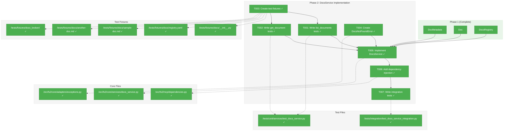
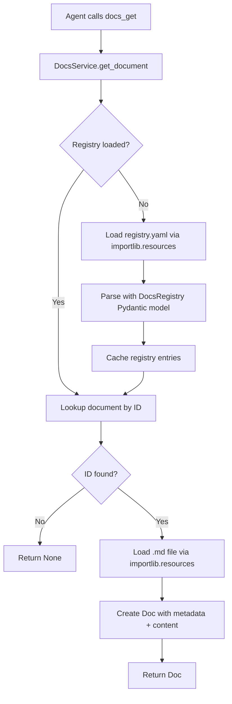
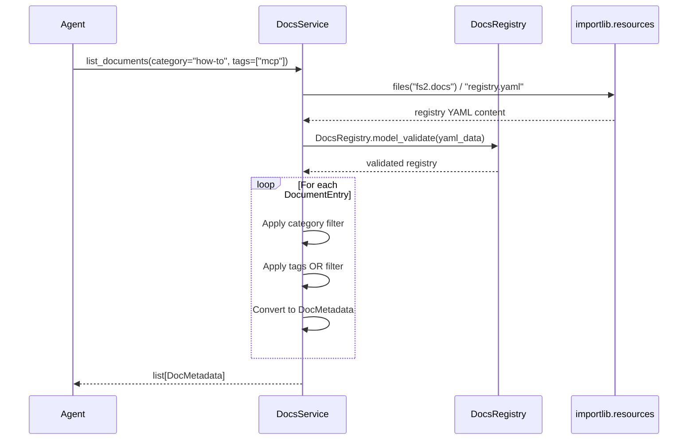

# Phase 2: DocsService Implementation – Tasks & Alignment Brief

**Spec**: [../../mcp-doco-spec.md](../../mcp-doco-spec.md)
**Plan**: [../../mcp-doco-plan.md](../../mcp-doco-plan.md)
**Date**: 2026-01-02

---

## Executive Briefing

### Purpose
This phase implements the core service layer that bridges the registry/model infrastructure from Phase 1 with the MCP tools in Phase 3. DocsService is the business logic heart of the documentation system, responsible for loading the registry, retrieving documents, and filtering by category/tags.

### What We're Building
A `DocsService` class that:
- Loads `registry.yaml` from package resources using `importlib.resources`
- Returns filtered `DocMetadata` lists via `list_documents(category?, tags?)`
- Returns full `Doc` content via `get_document(id)` or `None` for not found
- Integrates with MCP's dependency injection pattern for testability

Supporting infrastructure:
- `DocsNotFoundError` domain exception with actionable recovery message
- `get_docs_service()` / `set_docs_service()` / `reset_docs_service()` in `dependencies.py`
- Test fixtures with real sample files (no mocks)

### User Value
This phase provides the complete programmatic interface for documentation access. AI agents will use this service (via MCP tools in Phase 3) to discover and read fs2 documentation without human intervention.

### Example
**list_documents(category="how-to")** returns:
```python
[
    DocMetadata(id="agents", title="AI Agent Guidance", category="how-to", ...)
]
```

**get_document(id="agents")** returns:
```python
Doc(
    metadata=DocMetadata(id="agents", ...),
    content="# AI Agent Guidance\n\nThis document describes..."
)
```

---

## Objectives & Scope

### Objective
Implement DocsService with full TDD, following the TemplateService pattern for `importlib.resources` usage, and integrating with the existing dependency injection architecture.

#### Behavior Checklist (from plan acceptance criteria)
- [x] DocsService loads registry via importlib.resources
- [x] list_documents() returns all, filters by category/tags
- [x] get_document() returns Doc or None
- [x] Thread-safe singleton in dependencies.py
- [x] All tests passing (15 tests: 12 unit + 3 integration)
- [x] No stdout output (stderr only via logging)

### Goals

- ✅ Create `DocsService` class with `list_documents()` and `get_document()` methods
- ✅ Follow `TemplateService` pattern for `importlib.resources` (wheel-safe)
- ✅ Implement OR-logic tag filtering per spec AC3
- ✅ Create `DocsNotFoundError` with actionable message per Critical Finding 06
- ✅ Add dependency injection per Critical Finding 05
- ✅ Create real fixture files per spec testing strategy (no mocks)
- ✅ Achieve 100% test coverage for DocsService

### Non-Goals

- ❌ MCP tool implementation (Phase 3)
- ❌ Actual documentation files in `src/fs2/docs/` (Phase 4)
- ❌ Caching layer (spec says read each time - docs are small)
- ❌ Section extraction (full documents only per spec)
- ❌ Search within document content (use existing fs2 search tools)
- ❌ Async implementation (sync is sufficient for small bundled docs)
- ❌ Custom template rendering (markdown returned as-is)

---

## Architecture Map

### Component Diagram
<!-- Status: grey=pending, orange=in-progress, green=completed, red=blocked -->
<!-- Updated by plan-6 during implementation -->



### Task-to-Component Mapping

<!-- Status: ⬜ Pending | 🟧 In Progress | ✅ Complete | 🔴 Blocked -->

| Task | Component(s) | Files | Status | Comment |
|------|-------------|-------|--------|---------|
| T001 | Unit Tests | `/tests/unit/services/test_docs_service.py` | ✅ Complete | Tests for list_documents() with all filter combinations |
| T002 | Unit Tests | `/tests/unit/services/test_docs_service.py` | ✅ Complete | Tests for get_document() including not-found case |
| T003 | Test Fixtures | `/tests/fixtures/docs/`, `/tests/fixtures/docs_broken/` | ✅ Complete | Valid fixtures + broken registry for DYK-3 validation test |
| T004 | Domain Exception | `/src/fs2/core/adapters/exceptions.py` | ✅ Complete | DocsNotFoundError with actionable message |
| T005 | DocsService | `/src/fs2/core/services/docs_service.py` | ✅ Complete | Core service with importlib.resources, path validation at init |
| T006 | Dependency Injection | `/src/fs2/mcp/dependencies.py` | ✅ Complete | Thread-safe singleton pattern |
| T007 | Integration Tests | `/tests/integration/test_docs_service_integration.py` | ✅ Complete | Tests mechanism with `tests.fixtures.docs`; prod verified Phase 5 (DYK-5) |

---

## Tasks

| Status | ID | Task | CS | Type | Dependencies | Absolute Path(s) | Validation | Subtasks | Notes |
|--------|------|------|-----|------|--------------|------------------|------------|----------|-------|
| [x] | T001 | Write tests for DocsService.list_documents() | 2 | Test | T003 | /workspaces/flow_squared/tests/unit/services/test_docs_service.py | Tests fail with ImportError or AttributeError (RED phase) | – | 6+ tests: all docs, category filter, tags OR filter, empty results, no matches, multiple tags |
| [x] | T002 | Write tests for DocsService.get_document() | 2 | Test | T003 | /workspaces/flow_squared/tests/unit/services/test_docs_service.py | Tests fail with ImportError or AttributeError (RED phase) | – | 4+ tests: existing doc, non-existent doc (None), content matches file, metadata populated |
| [x] | T003 | Create test fixtures in tests/fixtures/docs/ | 2 | Setup | – | /workspaces/flow_squared/tests/fixtures/docs/__init__.py, /workspaces/flow_squared/tests/fixtures/docs/registry.yaml, /workspaces/flow_squared/tests/fixtures/docs/sample-doc.md, /workspaces/flow_squared/tests/fixtures/docs/another-doc.md, /workspaces/flow_squared/tests/fixtures/docs_broken/__init__.py, /workspaces/flow_squared/tests/fixtures/docs_broken/registry.yaml | Fixture files exist, registry is valid YAML, __init__.py makes it a package, docs_broken has missing file ref | – | Real files per spec (DYK-1); broken registry for DYK-3 test |
| [x] | T004 | Create DocsNotFoundError exception | 1 | Core | – | /workspaces/flow_squared/src/fs2/core/adapters/exceptions.py | Exception exists, includes actionable message | – | Per Critical Finding 06; extends AdapterError |
| [x] | T005 | Implement DocsService with importlib.resources | 3 | Core | T001, T002, T003, T004 | /workspaces/flow_squared/src/fs2/core/services/docs_service.py | All tests from T001, T002 pass (GREEN phase) | – | `docs_package` param (DYK-1); cache registry at init, fresh content per-call (DYK-2); validate all paths at init (DYK-3); per CF-02 |
| [x] | T006 | Add get_docs_service() to dependencies.py | 1 | Core | T005 | /workspaces/flow_squared/src/fs2/mcp/dependencies.py | Thread-safe singleton, includes set_ and reset_ functions | – | Simpler than other services - no get_config() call needed (DYK-4); per CF-05 |
| [x] | T007 | Write integration test verifying fixture package injection | 2 | Integration | T005, T006 | /workspaces/flow_squared/tests/integration/test_docs_service_integration.py | Test passes using `tests.fixtures.docs` package | – | Tests DocsService mechanism with fixtures (DYK-5); production fs2.docs verified in Phase 5 |

---

## Alignment Brief

### Prior Phase Review

#### Phase 1: Domain Models and Registry – Summary

**Status**: COMPLETE (9/9 tasks, 31 tests passing)
**Execution Date**: 2026-01-02

##### A. Deliverables Created

| File | Key Elements |
|------|--------------|
| `/workspaces/flow_squared/src/fs2/core/models/doc.py` | `DocMetadata` (6 fields, frozen), `Doc` (composition), `from_registry_entry()` factory |
| `/workspaces/flow_squared/src/fs2/config/docs_registry.py` | `DocumentEntry` (Pydantic), `DocsRegistry` (validation) |
| `/workspaces/flow_squared/src/fs2/core/models/__init__.py` | Exports `DocMetadata`, `Doc` |
| `/workspaces/flow_squared/tests/unit/models/test_doc.py` | 18 tests (3 classes) |
| `/workspaces/flow_squared/tests/unit/config/test_docs_registry.py` | 13 tests (2 classes) |

##### B. Dependencies Exported for This Phase

| Export | Import Path | Purpose |
|--------|-------------|---------|
| `DocMetadata` | `from fs2.core.models import DocMetadata` | Return type for `list_documents()` |
| `Doc` | `from fs2.core.models import Doc` | Return type for `get_document()` |
| `DocMetadata.from_registry_entry()` | Method on DocMetadata | Convert registry entries to domain models |
| `DocumentEntry` | `from fs2.config.docs_registry import DocumentEntry` | Type for registry YAML parsing |
| `DocsRegistry` | `from fs2.config.docs_registry import DocsRegistry` | Registry YAML validation |

##### C. Architectural Patterns Established

1. **Layer Separation**: `core/models/` = frozen dataclasses, `config/` = Pydantic validation
2. **Immutability**: `@dataclass(frozen=True)` + `tuple[str, ...]` for tags
3. **Factory Pattern**: `DocMetadata.from_registry_entry()` bridges Pydantic → dataclass
4. **ID Validation**: `Field(pattern=r"^[a-z0-9-]+$")` at Pydantic level

##### D. DYK Decisions Applied

| DYK | Decision | Impact on This Phase |
|-----|----------|---------------------|
| DYK-1 | Factory method for conversion | Use `DocMetadata.from_registry_entry(entry)` in DocsService |
| DYK-2 | Tags as tuple | Tags returned as tuple, OR filtering works on tuples |
| DYK-3 | DocsRegistry in config/ layer | Import from `fs2.config.docs_registry` |
| DYK-4 | Defer serialization | Use `dataclasses.asdict()` in Phase 3 MCP tools |
| DYK-5 | Defer schema versioning | No version field in registry |

##### E. Technical Gotchas Discovered

- **TYPE_CHECKING guard**: Use for `DocumentEntry` import in `doc.py` to avoid circular imports
- **FrozenInstanceError import**: Must import from `dataclasses` module
- **Path as str**: Path field is string, not pathlib.Path (per Critical Finding 02)

##### F. Execution Log Reference
- [Phase 1 Execution Log](../phase-1-domain-models-and-registry/execution.log.md)

---

### Critical Findings Affecting This Phase

| Finding | Title | What It Constrains | Tasks Affected |
|---------|-------|-------------------|----------------|
| CF-01 | MCP Protocol Integrity | All logging must go to stderr; no print statements | T005 (DocsService logging) |
| CF-02 | importlib.resources Wheel Compatibility | Use `.is_file()`, `.read_text()`, `.joinpath()` only; never `.resolve()` | T005 (DocsService implementation) |
| CF-05 | Dependency Injection Pattern | Add `get_/set_/reset_docs_service()` to dependencies.py | T006 |
| CF-06 | Error Translation | DocsNotFoundError with actionable "Use docs_list() to see available documents" | T004 |

---

### Invariants & Guardrails

- **No stdout**: All logging via `logging.getLogger("fs2.core.services.docs_service")` routed to stderr
- **Thread-safe**: Use `threading.RLock()` for singleton access
- **Wheel-safe**: Only use `importlib.resources` Traversable API
- **No external network**: Docs are bundled package resources
- **No ConfigurationService**: DocsService has no external dependencies - just `docs_package` param (DYK-4, YAGNI)

---

### Inputs to Read

| File | Purpose |
|------|---------|
| `/workspaces/flow_squared/src/fs2/core/services/smart_content/template_service.py` | Reference pattern for `importlib.resources` usage |
| `/workspaces/flow_squared/src/fs2/mcp/dependencies.py` | Reference pattern for dependency injection |
| `/workspaces/flow_squared/src/fs2/core/adapters/exceptions.py` | Location for DocsNotFoundError |
| `/workspaces/flow_squared/src/fs2/core/models/doc.py` | Domain models to use |
| `/workspaces/flow_squared/src/fs2/config/docs_registry.py` | Registry parsing models |

---

### Visual Alignment Aids

#### Flow Diagram: Document Retrieval



#### Sequence Diagram: list_documents with Filtering



---

### Test Plan

**Testing Approach**: Full TDD (per spec)
**Mock Usage**: None (real fixtures per spec)

#### Unit Tests: TestDocsServiceListDocuments

| Test Name | Rationale | Expected Output |
|-----------|-----------|-----------------|
| `test_list_all_documents` | Validates basic catalog functionality | Returns all registered docs as DocMetadata list |
| `test_filter_by_category` | Validates AC2 category filtering | Only matching category returned |
| `test_filter_by_tags_or_logic` | Validates AC3 tag OR semantics | Docs with ANY matching tag returned |
| `test_filter_by_category_and_tags` | Validates combined filtering | Both filters applied |
| `test_filter_returns_empty_list` | Edge case: no matches | Empty list, no error |
| `test_list_with_empty_registry` | Edge case: no docs registered | Empty list |

#### Unit Tests: TestDocsServiceGetDocument

| Test Name | Rationale | Expected Output |
|-----------|-----------|-----------------|
| `test_get_existing_document` | Core functionality | Returns Doc with content |
| `test_get_nonexistent_returns_none` | Per spec: return None, not error | Returns None |
| `test_content_matches_file` | Validates file loading | content field = file contents |
| `test_metadata_populated` | Validates metadata pass-through | metadata matches registry entry |

#### Non-Happy-Path Coverage

| Scenario | Test | Expected Behavior |
|----------|------|-------------------|
| Registry file not found | `test_registry_not_found_raises` | DocsNotFoundError with actionable message |
| Document file missing at init | `test_missing_doc_file_raises_at_init` | DocsNotFoundError at service creation (DYK-3) |
| Invalid YAML in registry | `test_invalid_registry_raises_validation` | Pydantic ValidationError |
| Non-UTF8 document | `test_non_utf8_document_handled` | Raises or returns None with warning |
| Document ID not in registry | `test_get_unknown_id_returns_none` | Returns None (per spec AC5) |

#### Fixtures Needed

| Fixture | Location | Contents |
|---------|----------|----------|
| `__init__.py` | `tests/fixtures/docs/__init__.py` | Empty file (makes directory a package for importlib.resources) - DYK-1 |
| `docs_service_fixture` | `tests/unit/services/conftest.py` | DocsService initialized with `docs_package="tests.fixtures.docs"` |
| `sample_registry.yaml` | `tests/fixtures/docs/registry.yaml` | 2 document entries |
| `sample-doc.md` | `tests/fixtures/docs/sample-doc.md` | Markdown content |
| `another-doc.md` | `tests/fixtures/docs/another-doc.md` | Markdown content (different category) |
| `broken_registry` | `tests/fixtures/docs_broken/` | Separate package with registry pointing to missing file (DYK-3 test) |

---

### Implementation Outline (Mapped to Tasks)

| Step | Task | Action |
|------|------|--------|
| 1 | T003 | Create fixture files: registry.yaml + 2 .md files |
| 2 | T001 | Write 6+ failing tests for list_documents() - RED phase |
| 3 | T002 | Write 4+ failing tests for get_document() - RED phase |
| 4 | T004 | Create DocsNotFoundError in exceptions.py |
| 5 | T005 | Implement DocsService following TemplateService pattern - GREEN phase |
| 6 | T006 | Add get_/set_/reset_docs_service() to dependencies.py |
| 7 | T007 | Write integration test with fixture package injection |
| 8 | – | Run full test suite, verify no regressions |

---

### Commands to Run

```bash
# Environment setup (from project root)
cd /workspaces/flow_squared

# Run Phase 2 tests only
UV_CACHE_DIR=.uv_cache uv run pytest tests/unit/services/test_docs_service.py -v

# Run all unit tests to check for regressions
UV_CACHE_DIR=.uv_cache uv run pytest tests/unit/ -v

# Run integration tests
UV_CACHE_DIR=.uv_cache uv run pytest tests/integration/test_docs_service_integration.py -v

# Type checking
UV_CACHE_DIR=.uv_cache uv run python -m mypy src/fs2/core/services/docs_service.py

# Lint check
UV_CACHE_DIR=.uv_cache uv run ruff check src/fs2/core/services/docs_service.py

# Full test suite
just test
```

---

### Risks/Unknowns

| Risk | Severity | Likelihood | Mitigation |
|------|----------|------------|------------|
| importlib.resources edge cases in editable install | High | Medium | Follow TemplateService pattern exactly; test in both modes |
| Fixture injection complexity | Medium | Low | Use constructor injection with package path override |
| Thread safety for lazy loading | Medium | Low | Use RLock pattern from existing dependencies.py (N/A - using eager loading per DYK-2) |
| Circular import between DocsService and dependencies | Low | Low | Use TYPE_CHECKING guard if needed |

### Phase 5 Follow-up (DYK-5)

Phase 5 task 5.3 ("Run full test suite, fix any failures") should include verification that:
- `fs2.docs` package loads correctly via `importlib.resources`
- Production `registry.yaml` passes validation
- All registered documents are accessible

---

### Ready Check

- [x] Phase 1 complete and all tests passing
- [x] Critical Findings mapped to tasks (CF-01→T005, CF-02→T005, CF-05→T006, CF-06→T004)
- [x] TemplateService pattern reviewed for importlib.resources usage
- [x] dependencies.py pattern reviewed for singleton injection
- [x] exceptions.py pattern reviewed for domain exception creation
- [x] Human approval to proceed (GO/NO-GO)

**Status**: ✅ PHASE COMPLETE (2026-01-02)

---

## Phase Footnote Stubs

_Populated by plan-6 during implementation. Links task completions to FlowSpace node IDs._

| Footnote | Task(s) | FlowSpace Node ID(s) | Description |
|----------|---------|---------------------|-------------|
| [^3] | T001, T002, T003, T007 | `file:tests/unit/services/test_docs_service.py`, `file:tests/integration/test_docs_service_integration.py`, `file:tests/fixtures/docs/*` | Test infrastructure |
| [^4] | T004, T005 | `class:src/fs2/core/services/docs_service.py:DocsService`, `class:src/fs2/core/adapters/exceptions.py:DocsNotFoundError` | DocsService core implementation |
| [^5] | T006 | `function:src/fs2/mcp/dependencies.py:get_docs_service`, `function:src/fs2/mcp/dependencies.py:set_docs_service`, `function:src/fs2/mcp/dependencies.py:reset_docs_service` | Dependency injection |

---

## Evidence Artifacts

**Execution Log**: `./execution.log.md` (created by /plan-6)

Evidence files written during implementation:
- Test output captures
- Coverage reports
- Lint/type check results

---

## Discoveries & Learnings

_Populated during implementation by plan-6. Log anything of interest to your future self._

| Date | Task | Type | Discovery | Resolution | References |
|------|------|------|-----------|------------|------------|
| 2026-01-02 | T005 | gotcha | `importlib.resources.files()` requires `__init__.py` in all parent directories | Added `/tests/__init__.py` and `/tests/fixtures/__init__.py` | execution.log.md#t005 |

**Types**: `gotcha` | `research-needed` | `unexpected-behavior` | `workaround` | `decision` | `debt` | `insight`

**What to log**:
- Things that didn't work as expected
- External research that was required
- Implementation troubles and how they were resolved
- Gotchas and edge cases discovered
- Decisions made during implementation
- Technical debt introduced (and why)
- Insights that future phases should know about

_See also: `execution.log.md` for detailed narrative._

---

## Directory Layout

```
docs/plans/014-mcp-doco/
├── mcp-doco-spec.md
├── mcp-doco-plan.md
├── research-dossier.md
├── doc-samples/                      # Draft docs for approval
│   ├── agents.md
│   └── configuration-guide.md
└── tasks/
    ├── phase-1-domain-models-and-registry/
    │   ├── tasks.md
    │   └── execution.log.md          # Complete
    └── phase-2-docsservice-implementation/
        ├── tasks.md                   # This file
        └── execution.log.md           # Created by plan-6
```

---

## Critical Insights Discussion

**Session**: 2026-01-02
**Context**: Phase 2: DocsService Implementation - Tasks & Alignment Brief
**Analyst**: AI Clarity Agent
**Reviewer**: Development Team
**Format**: Water Cooler Conversation (5 Critical Insights)

### DYK-1: Fixture Package Path Injection Gap

**Did you know**: The test approach had no mechanism for DocsService to load fixtures from `tests/fixtures/docs/` since `importlib.resources.files()` takes a package name, not a filesystem path.

**Implications**:
- Tests would fail looking for non-existent `fs2.docs` package
- Without package structure, TDD RED phase fails for wrong reason
- Need `__init__.py` to make fixture directory a Python package

**Options Considered**:
- Option A: Package Path Parameter (like TemplateService) - add `docs_package` constructor param
- Option B: Pre-loaded Data Injection - bypass importlib.resources in tests
- Option C: Monkeypatch importlib.resources - feels like mocking

**AI Recommendation**: Option A (Package Path Parameter)
- Reasoning: Follows TemplateService pattern, enables true fixture isolation without mocking

**Decision**: Add `docs_package` parameter to DocsService constructor; create `__init__.py` in fixture directories

**Action Items**:
- [x] T003 updated to include `__init__.py`
- [x] T005 updated to require `docs_package` parameter
- [x] Fixtures table updated

**Affects**: T003, T005, fixture structure

---

### DYK-2: Registry Loading Strategy - Cached vs Lazy

**Did you know**: The tasks didn't specify whether DocsService should cache the registry at init or reload on every call, with thread-safety implications for lazy loading.

**Implications**:
- Lazy loading requires thread locks for concurrent access
- Eager loading at init provides fail-fast validation
- "No caching" in plan referred to document content, not registry

**Options Considered**:
- Option A: Eager Loading at __init__ (like TemplateService)
- Option B: Lazy Loading with Caching
- Option C: Reload Every Call

**AI Recommendation**: Option A (Eager Loading at __init__)
- Reasoning: Matches TemplateService, fail-fast validation, thread-safe by default

**Decision**: Cache registry at `__init__`, load document content fresh per-call

**Action Items**:
- [x] T005 updated with caching strategy note

**Affects**: T005

---

### DYK-3: Document File Missing vs Registry Missing - Two Different Errors

**Did you know**: The design conflated "registry not found" (service error) with "document file missing" (registry references non-existent file), requiring different handling.

**Implications**:
- Registry missing = can't operate, must fail
- Document in registry but file missing = packaging/config error
- TemplateService validates all paths at init

**Options Considered**:
- Option A: Return None + Log Warning
- Option B: Raise DocsNotFoundError
- Option C: Validate All Files at Init (like TemplateService)

**AI Recommendation**: Option C (Validate at Init)
- Reasoning: Fail-fast catches config errors at startup, matches TemplateService pattern

**Decision**: Validate all document paths exist at `__init__`, fail fast if any missing

**Action Items**:
- [x] T005 updated with validation requirement
- [x] Non-Happy-Path table updated
- [x] Added `docs_broken/` fixture for testing validation failure

**Affects**: T003, T005, test coverage

---

### DYK-4: DocsService Has No External Dependencies

**Did you know**: Unlike other fs2 services, DocsService doesn't need ConfigurationService injection - it just reads package resources.

**Implications**:
- Constructor signature differs from other services
- Dependency injection is simpler (no get_config() call)
- Testing is simpler (no fake ConfigurationService needed)

**Options Considered**:
- Option A: Accept the Difference (No Config) - honest interface
- Option B: Add Config for Consistency - unnecessary dependency
- Option C: Add DocsConfig for Future - YAGNI

**AI Recommendation**: Option A (Accept the Difference)
- Reasoning: YAGNI, honest interfaces, simpler testing, easy to add later if needed

**Decision**: DocsService takes only `docs_package` parameter, no ConfigurationService

**Action Items**:
- [x] T006 CS reduced to 1 (simpler)
- [x] Invariants updated with "No ConfigurationService" note

**Affects**: T005, T006

---

### DYK-5: Integration Test Timing - What Can We Actually Test in Phase 2?

**Did you know**: T007 ("real package resources") can't test `fs2.docs` since that package doesn't exist until Phase 4, creating unclear expectations.

**Implications**:
- Phase 2 can test the mechanism (fixture package injection)
- Production package verification must wait for Phase 4/5
- Task name was misleading about what it actually tests

**Options Considered**:
- Option A: Rename T007 to Clarify Scope - accurate expectations
- Option B: Keep as Placeholder, Skip Until Phase 4 - messy workflow
- Option C: Create Minimal Stub in fs2.docs Now - scope creep

**AI Recommendation**: Option A (Rename T007 to Clarify Scope)
- Reasoning: Accurate expectations, clean phase boundaries, fixture injection proves mechanism

**Decision**: T007 tests fixture package injection; production verification in Phase 5

**Action Items**:
- [x] T007 renamed and description updated
- [x] Added Phase 5 Follow-up section for production verification

**Affects**: T007, Phase 5

---

## Session Summary

**Insights Surfaced**: 5 critical insights identified and discussed
**Decisions Made**: 5 decisions reached through collaborative discussion
**Action Items Created**: 12 updates applied immediately
**Areas Updated**:
- Tasks table (T003, T005, T006, T007)
- Architecture diagram (added Fix_broken node)
- Task-to-Component mapping
- Non-Happy-Path Coverage table
- Fixtures Needed table
- Invariants & Guardrails
- Risks/Unknowns table
- Added Phase 5 Follow-up section

**Shared Understanding Achieved**: ✓

**Confidence Level**: High - Key design decisions clarified, patterns from TemplateService applied consistently

**Next Steps**:
1. Approve updated tasks.md (Ready Check)
2. Run `/plan-6-implement-phase --phase 2` to begin implementation

**Notes**:
All 5 DYK insights trace to specific task updates. The DocsService design now aligns with TemplateService patterns while remaining simpler (no config dependency).
