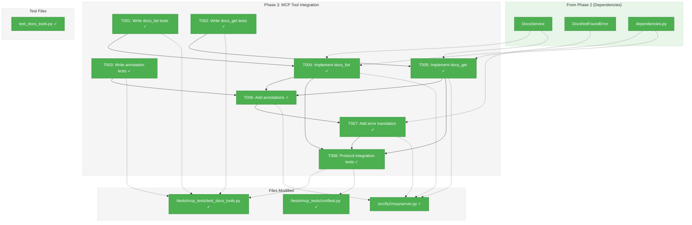
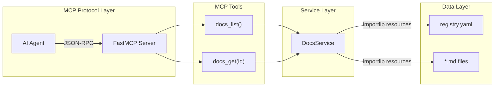
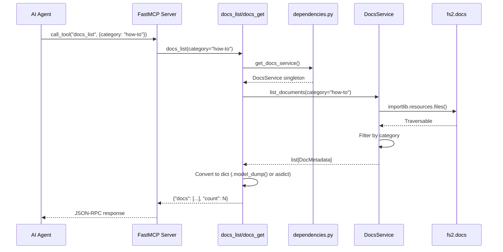

# Phase 3: MCP Tool Integration – Tasks & Alignment Brief

**Spec**: [../../mcp-doco-spec.md](../../mcp-doco-spec.md)
**Plan**: [../../mcp-doco-plan.md](../../mcp-doco-plan.md)
**Date**: 2026-01-02
**Testing Approach**: Full TDD

---

## Executive Briefing

### Purpose
This phase adds two MCP tools (`docs_list` and `docs_get`) to the fs2 MCP server, enabling AI agents to discover and retrieve bundled documentation without human intervention. This is the integration point where the DocsService from Phase 2 becomes accessible to agents via the MCP protocol.

### What We're Building
Two FastMCP tools registered in `server.py`:
- **`docs_list`**: Browse available documentation with optional category/tag filtering
- **`docs_get`**: Retrieve full document content by ID

Both tools will:
- Use proper MCP annotations (readOnlyHint=True, idempotentHint=True, etc.)
- Return JSON-serializable responses via `.model_dump()` or `dataclasses.asdict()`
- Handle errors with actionable messages via `translate_error()` integration

### User Value
AI agents can self-serve documentation about fs2 tools, configuration, and best practices. When an agent is unsure how to use fs2 tools, it can call `docs_list()` to discover what help is available, then `docs_get(id="agents")` to read the full guidance.

### Example
**Agent workflow**:
```python
# Agent discovers available docs
docs_list()
# Returns: {"docs": [{"id": "agents", "title": "AI Agent Guidance", ...}, ...], "count": 2}

# Agent retrieves specific doc
docs_get(id="agents")
# Returns: {"id": "agents", "title": "AI Agent Guidance", "content": "# AI Agent Guidance\n...", "metadata": {...}}
```

---

## Objectives & Scope

### Objective
Add `docs_list` and `docs_get` MCP tools with proper annotations and error handling, as specified in plan tasks 3.1-3.8.

### Behavior Checklist (from Spec)
- [ ] AC1: `docs_list()` returns all documents when no filters provided
- [ ] AC2: `docs_list(category="how-to")` filters by category (exact match)
- [ ] AC3: `docs_list(tags=["agents"])` filters by tags (OR logic)
- [ ] AC4: `docs_get(id="agents")` returns full document with content and metadata
- [ ] AC5: `docs_get(id="nonexistent")` returns None (not an error)
- [ ] AC6: Response format is JSON-serializable dict

### Goals

- ✅ Register `docs_list` tool with FastMCP
- ✅ Register `docs_get` tool with FastMCP
- ✅ Add proper tool annotations (readOnlyHint, destructiveHint, idempotentHint, openWorldHint)
- ✅ Integrate DocsNotFoundError into translate_error()
- ✅ Achieve protocol-level test coverage via MCP client tests
- ✅ Return JSON-serializable responses (not Pydantic models or dataclasses)

### Non-Goals (Scope Boundaries)

- ❌ Creating production documentation content (Phase 4)
- ❌ Creating the `src/fs2/docs/` package (Phase 4)
- ❌ Test fixtures for production fs2.docs (Phase 5 verifies production)
- ❌ Document content caching (not needed - docs are small)
- ❌ Async DocsService (sync is sufficient - no I/O blocking)
- ❌ Section extraction from documents (full doc only in v1)
- ❌ Pagination for docs_list (will be <10 docs initially)

---

## Architecture Map

### Component Diagram
<!-- Status: grey=pending, orange=in-progress, green=completed, red=blocked -->
<!-- Updated by plan-6 during implementation -->



### Task-to-Component Mapping

<!-- Status: ⬜ Pending | 🟧 In Progress | ✅ Complete | 🔴 Blocked -->

| Task | Component(s) | Files | Status | Comment |
|------|-------------|-------|--------|---------|
| T001 | Test Suite | /workspaces/flow_squared/tests/mcp_tests/test_docs_tools.py | ✅ Complete | Write failing tests for docs_list tool |
| T002 | Test Suite | /workspaces/flow_squared/tests/mcp_tests/test_docs_tools.py | ✅ Complete | Write failing tests for docs_get tool |
| T003 | Test Suite | /workspaces/flow_squared/tests/mcp_tests/test_docs_tools.py | ✅ Complete | Write tests for tool annotations |
| T004 | MCP Server | /workspaces/flow_squared/src/fs2/mcp/server.py | ✅ Complete | Implement docs_list tool function |
| T005 | MCP Server | /workspaces/flow_squared/src/fs2/mcp/server.py | ✅ Complete | Implement docs_get tool function |
| T006 | MCP Server | /workspaces/flow_squared/src/fs2/mcp/server.py | ✅ Complete | Add tool annotations for both tools |
| T007 | MCP Server | /workspaces/flow_squared/src/fs2/mcp/server.py | ✅ Complete | Add DocsNotFoundError to translate_error() |
| T008 | Integration | /workspaces/flow_squared/tests/mcp_tests/test_docs_tools.py, conftest.py | ✅ Complete | Protocol-level MCP integration tests |

---

## Tasks

| Status | ID | Task | CS | Type | Dependencies | Absolute Path(s) | Validation | Subtasks | Notes |
|--------|------|------|-----|------|--------------|------------------|------------|----------|-------|
| [x] | T001 | Write tests for docs_list tool (no params, category filter, tags filter, response format) | 2 | Test | – | /workspaces/flow_squared/tests/mcp_tests/test_docs_tools.py | Tests fail with ModuleNotFoundError or AttributeError | – | RED phase: 6+ tests; SYNC function pattern (DYK-1) |
| [x] | T002 | Write tests for docs_get tool (valid id, invalid id returns None, response format with content) | 2 | Test | – | /workspaces/flow_squared/tests/mcp_tests/test_docs_tools.py | Tests fail with expected error | – | RED phase: 4+ tests; SYNC function pattern (DYK-1) |
| [x] | T003 | Write tests for tool annotations (readOnlyHint, etc.) | 1 | Test | – | /workspaces/flow_squared/tests/mcp_tests/test_docs_tools.py | Tests fail (no tools registered yet) | – | Per Critical Finding 03 |
| [x] | T004 | Implement docs_list sync tool function in server.py | 2 | Core | T001 | /workspaces/flow_squared/src/fs2/mcp/server.py | T001 tests pass | – | SYNC per DYK-1; CF-01 stderr-only; return {"docs": [...], "count": N} per DYK-5 |
| [x] | T005 | Implement docs_get sync tool function in server.py | 2 | Core | T002 | /workspaces/flow_squared/src/fs2/mcp/server.py | T002 tests pass | – | SYNC per DYK-1; None per DYK-2; return {id, title, content, metadata} per DYK-5; docstring: "Use docs_list()" |
| [x] | T006 | Add tool annotations for docs_list and docs_get | 1 | Core | T003, T004, T005 | /workspaces/flow_squared/src/fs2/mcp/server.py | T003 tests pass | – | Per Critical Finding 03 |
| [x] | T007 | Add DocsNotFoundError to translate_error() + defensive test | 1 | Core | T004, T005 | /workspaces/flow_squared/src/fs2/mcp/server.py, /workspaces/flow_squared/tests/mcp_tests/test_docs_tools.py | Error returns actionable message; test mocks error scenario | – | Per CF-06 and DYK-3; rare but documents error path |
| [x] | T008 | Write MCP protocol integration tests via docs_mcp_client | 2 | Integration | T004, T005, T006, T007 | /workspaces/flow_squared/tests/mcp_tests/test_docs_tools.py, /workspaces/flow_squared/tests/mcp_tests/conftest.py | All protocol tests pass | – | Per DYK-4: Simple dedicated fixture; inject DocsService(docs_package="tests.fixtures.docs"); no GraphStore needed |

---

## Alignment Brief

### Prior Phases Review

#### Phase 1: Domain Models and Registry (COMPLETE)

**A. Deliverables Created**:
| Component | Location |
|-----------|----------|
| `DocMetadata` | `/workspaces/flow_squared/src/fs2/core/models/doc.py:28-70` |
| `Doc` | `/workspaces/flow_squared/src/fs2/core/models/doc.py:73-87` |
| `DocMetadata.from_registry_entry()` | `/workspaces/flow_squared/src/fs2/core/models/doc.py` |
| `DocumentEntry` | `/workspaces/flow_squared/src/fs2/config/docs_registry.py:20-41` |
| `DocsRegistry` | `/workspaces/flow_squared/src/fs2/config/docs_registry.py:44-67` |

**B. Lessons Learned**:
- DYK process (5-insight discussion) surfaced key decisions before coding
- Strict TDD ensured all tasks completed with clear RED-GREEN evidence
- DocsRegistry moved to `config/` layer per DYK-3 (architectural consistency)

**C. Technical Discoveries**:
- `TYPE_CHECKING` guard needed for factory method to avoid circular imports
- Tuple for tags (immutability), list-to-tuple conversion in factory
- ID pattern `^[a-z0-9-]+$` strictly enforced

**D. Dependencies Exported for Phase 3**:
```python
from fs2.core.models import DocMetadata, Doc
from fs2.config.docs_registry import DocsRegistry, DocumentEntry
```
- `DocMetadata` fields: `id`, `title`, `summary`, `category`, `tags`, `path`
- `Doc` composition: `metadata: DocMetadata`, `content: str`

**E. Test Infrastructure**: 31 tests in 2 files (`test_doc.py`, `test_docs_registry.py`)

---

#### Phase 2: DocsService Implementation (COMPLETE)

**A. Deliverables Created**:
| Component | Location |
|-----------|----------|
| `DocsService` | `/workspaces/flow_squared/src/fs2/core/services/docs_service.py` |
| `DocsNotFoundError` | `/workspaces/flow_squared/src/fs2/core/adapters/exceptions.py:322-357` |
| `get_docs_service()` | `/workspaces/flow_squared/src/fs2/mcp/dependencies.py:141-160` |
| `set_docs_service()` | `/workspaces/flow_squared/src/fs2/mcp/dependencies.py:163-170` |
| `reset_docs_service()` | `/workspaces/flow_squared/src/fs2/mcp/dependencies.py:173-179` |

**B. Lessons Learned**:
- `importlib.resources.files()` requires `__init__.py` in ALL parent directories
- Package injection pattern (`docs_package` param) enables test isolation without mocking
- Fail-fast path validation at init catches broken registry entries immediately

**C. Technical Discoveries**:
- **CRITICAL**: Parent package markers required (`tests/__init__.py`, `tests/fixtures/__init__.py`)
- Traversable API only: `.is_file()`, `.read_text()`, `.joinpath()` - never `.resolve()`
- Thread safety via `threading.RLock()` from dependencies.py pattern

**D. Dependencies Exported for Phase 3**:
```python
from fs2.core.services.docs_service import DocsService
from fs2.mcp.dependencies import get_docs_service, set_docs_service, reset_docs_service
from fs2.core.adapters.exceptions import DocsNotFoundError

# DocsService API
class DocsService:
    def __init__(self, docs_package: str = "fs2.docs") -> None: ...
    def list_documents(self, *, category: str | None = None, tags: Sequence[str] | None = None) -> list[DocMetadata]: ...
    def get_document(self, doc_id: str) -> Doc | None: ...
```

**E. Test Infrastructure**:
- 15 tests (12 unit + 3 integration)
- Fixtures: `tests/fixtures/docs/` (valid), `tests/fixtures/docs_broken/` (validation tests)

---

### Critical Findings Affecting This Phase

| Finding | Title | Impact | Addressed By |
|---------|-------|--------|--------------|
| CF-01 | MCP Protocol Integrity (stdout/stderr) | Critical | T004, T005: All logging via `logger.debug()` only |
| CF-03 | Tool Annotation Requirements | High | T003, T006: readOnlyHint=True, destructiveHint=False, idempotentHint=True, openWorldHint=False |
| CF-06 | Error Translation | Medium | T007: Add DocsNotFoundError to translate_error() |
| CF-07 | JSON Serialization Safety | Medium | T004, T005: Use `.model_dump()` or `dataclasses.asdict()` |

---

### Invariants & Guardrails

1. **stdout prohibition**: Zero print statements; all logging to stderr
2. **JSON serialization**: All responses must pass `json.dumps()` without error
3. **No external calls**: openWorldHint=False (docs are bundled in package)
4. **Idempotent reads**: Same inputs always return same outputs

---

### Inputs to Read

| File | Purpose |
|------|---------|
| `/workspaces/flow_squared/src/fs2/mcp/server.py` | Add tools after line 761 (after search tool) |
| `/workspaces/flow_squared/src/fs2/mcp/dependencies.py` | Use `get_docs_service()` |
| `/workspaces/flow_squared/tests/mcp_tests/conftest.py` | Add `docs_mcp_client` fixture |
| `/workspaces/flow_squared/src/fs2/core/services/docs_service.py` | Understand DocsService API |
| `/workspaces/flow_squared/tests/fixtures/docs/` | Test fixtures from Phase 2 |

---

### Visual Alignment Aids

#### System States (Mermaid Flow)



#### Interaction Sequence (Mermaid Sequence)



---

### Test Plan (Full TDD)

**Test File**: `/workspaces/flow_squared/tests/mcp_tests/test_docs_tools.py`

#### TestDocsListTool (T001)

| Test Name | Purpose | Fixture | Expected Output |
|-----------|---------|---------|-----------------|
| `test_docs_list_returns_all_documents` | AC1: No filter returns all | docs_mcp_client | `{"docs": [...], "count": 2}` |
| `test_docs_list_with_category_filter` | AC2: Category filtering | docs_mcp_client | Only matching category |
| `test_docs_list_with_tags_filter_or_logic` | AC3: Tags OR logic | docs_mcp_client | Docs with ANY matching tag |
| `test_docs_list_with_combined_filters` | Category + tags together | docs_mcp_client | Both filters applied |
| `test_docs_list_empty_results` | No matches | docs_mcp_client | `{"docs": [], "count": 0}` |
| `test_docs_list_response_format` | AC6: JSON structure | docs_mcp_client | Has `docs`, `count` keys |

#### TestDocsGetTool (T002)

| Test Name | Purpose | Fixture | Expected Output |
|-----------|---------|---------|-----------------|
| `test_docs_get_returns_content` | AC4: Full doc retrieval | docs_mcp_client | Has `id`, `title`, `content`, `metadata` |
| `test_docs_get_nonexistent_returns_none` | AC5: Not found = None | docs_mcp_client | Returns `null` (not error) |
| `test_docs_get_content_matches_file` | Content integrity | docs_mcp_client | Content matches fixture |
| `test_docs_get_metadata_populated` | Metadata fields | docs_mcp_client | All metadata fields present |

#### TestDocsToolAnnotations (T003)

| Test Name | Purpose | Fixture | Expected Output |
|-----------|---------|---------|-----------------|
| `test_docs_list_has_correct_annotations` | CF-03 compliance | mcp_client | readOnlyHint=True, etc. |
| `test_docs_get_has_correct_annotations` | CF-03 compliance | mcp_client | readOnlyHint=True, etc. |

#### TestDocsToolProtocol (T008)

| Test Name | Purpose | Fixture | Expected Output |
|-----------|---------|---------|-----------------|
| `test_docs_list_via_mcp_protocol` | Protocol framing | docs_mcp_client | Valid JSON-RPC response |
| `test_docs_get_via_mcp_protocol` | Protocol framing | docs_mcp_client | Valid JSON-RPC response |

---

### Step-by-Step Implementation Outline

**T001: Write docs_list tests**
1. Create `/tests/mcp_tests/test_docs_tools.py`
2. Add `TestDocsListTool` class with 6 tests
3. Import from `fs2.mcp.server` (will fail - RED)
4. Use direct function calls first (simpler)

**T002: Write docs_get tests**
1. Extend `test_docs_tools.py` with `TestDocsGetTool` class
2. Add 4 tests for get functionality
3. Tests fail with ModuleNotFoundError (RED)

**T003: Write annotation tests**
1. Add `TestDocsToolAnnotations` class
2. Use `mcp_client.list_tools()` to verify annotations
3. Tests fail (tools not registered yet)

**T004: Implement docs_list tool**
1. Add `docs_list()` function after search tool in `server.py`
2. Use `get_docs_service()` for DI
3. Convert `DocMetadata` to dict via `dataclasses.asdict()`
4. Return `{"docs": [...], "count": N}`
5. Run T001 tests - should pass (GREEN)

**T005: Implement docs_get tool**
1. Add `docs_get()` function in `server.py`
2. Return `None` for not-found (not error per AC5)
3. Convert `Doc` to dict with nested metadata
4. Run T002 tests - should pass (GREEN)

**T006: Add tool annotations**
1. Register tools with `@mcp.tool()` decorator
2. Add annotations dict per CF-03
3. Run T003 tests - should pass (GREEN)

**T007: Add error translation**
1. Import `DocsNotFoundError` in server.py
2. Add handler in `translate_error()` function
3. Return actionable message: "Use docs_list() to see available documents"

**T008: Protocol integration tests**
1. Add `docs_mcp_client` fixture to conftest.py
2. Inject DocsService with test fixture package
3. Add protocol-level tests using `client.call_tool()`
4. Verify JSON-RPC framing works

---

### Commands to Run

```bash
# Install dependencies
uv sync

# Run Phase 3 tests only (once created)
UV_CACHE_DIR=.uv_cache uv run pytest tests/mcp_tests/test_docs_tools.py -v

# Run all MCP tests
UV_CACHE_DIR=.uv_cache uv run pytest tests/mcp_tests/ -v

# Run full test suite
UV_CACHE_DIR=.uv_cache uv run pytest -v

# Lint check
UV_CACHE_DIR=.uv_cache uv run ruff check src/fs2/mcp/server.py

# Type check (if mypy configured)
UV_CACHE_DIR=.uv_cache uv run mypy src/fs2/mcp/server.py
```

---

### Risks/Unknowns

| Risk | Severity | Likelihood | Mitigation |
|------|----------|------------|------------|
| JSON serialization of dataclasses | Medium | Low | Use `dataclasses.asdict()` explicitly |
| Fixture package discovery | Low | Low | Phase 2 already solved this pattern |
| Tool registration order | Low | Low | Follow existing tree/search pattern |
| Annotation syntax changes | Low | Low | Check FastMCP docs if errors |

---

### Ready Check

- [ ] Reviewed Phase 1 deliverables (DocMetadata, Doc, DocsRegistry)
- [ ] Reviewed Phase 2 deliverables (DocsService, DocsNotFoundError, DI)
- [ ] Understand existing tool patterns (tree, get_node, search in server.py)
- [ ] Understand test fixture pattern (conftest.py, tree_test_graph_store)
- [ ] Critical Finding 03 annotations documented
- [ ] Critical Finding 06 error translation documented
- [ ] ADR constraints mapped to tasks - N/A (no ADRs)

**Awaiting GO/NO-GO from human sponsor.**

---

## Phase Footnote Stubs

_Populated by plan-6 during implementation. Links FlowSpace node IDs to plan change footnotes._

| Footnote | Type | Node ID | Description |
|----------|------|---------|-------------|
| [^6] | function | `function:src/fs2/mcp/server.py:docs_list` | List documents with filtering (sync, DYK-1) |
| [^6] | function | `function:src/fs2/mcp/server.py:docs_get` | Get document by ID (sync, DYK-1) |
| [^6] | file | `file:tests/mcp_tests/test_docs_tools.py` | 19 tests for docs tools |
| [^6] | file | `file:tests/mcp_tests/conftest.py` | docs_mcp_client fixture (DYK-4) |

---

## Evidence Artifacts

Implementation will write:
- `execution.log.md` in this directory
- Test results captured in execution log
- Code snippets and evidence in task entries

---

## Discoveries & Learnings

_Populated during implementation by plan-6. Log anything of interest to your future self._

| Date | Task | Type | Discovery | Resolution | References |
|------|------|------|-----------|------------|------------|
| 2026-01-02 | T008 | unexpected-behavior | FastMCP returns None via `structured_content` not `content` array. When tool returns None, `result.content == []` and `result.structured_content == {"result": None}` | Test checks `structured_content` instead of parsing `content[0].text` | log#task-t008 |

---

## Critical Insights Discussion

**Session**: 2026-01-02
**Context**: Phase 3: MCP Tool Integration Tasks & Alignment Brief
**Analyst**: AI Clarity Agent
**Reviewer**: Development Team
**Format**: Water Cooler Conversation (5 Critical Insights)

### DYK-1: Sync vs Async Tool Pattern

**Did you know**: The docs tools should be sync functions like `tree()` and `get_node()`, not async like `search()`, because DocsService has no I/O blocking.

**Implications**:
- Test examples in plan showed `@pytest.mark.asyncio` but direct tests should be sync
- Matches existing pattern in server.py (only search is async due to embedding APIs)
- Simpler implementation and testing

**Options Considered**:
- Option A: Sync Tools + Sync Direct Tests - Simple, matches pattern
- Option B: Async Tools Everywhere - Unnecessary complexity

**AI Recommendation**: Option A (Sync Tools)
- Reasoning: DocsService is sync, no benefit to async wrappers, matches tree/get_node

**Decision**: Use sync function pattern for docs_list and docs_get

**Affects**: T001, T002, T004, T005

---

### DYK-2: None Return UX for Not-Found

**Did you know**: When `docs_get(id="nonexistent")` returns None, agents get `null` with no context, but this matches `get_node()` behavior.

**Implications**:
- Consistency with existing pattern is valuable
- Docstring should guide agents to call docs_list() first
- No structured "not found" response needed

**Options Considered**:
- Option A: Keep None, Match get_node Pattern - Consistent, simple
- Option B: Structured "Not Found" Response - More helpful but inconsistent
- Option C: Raise Error for Invalid ID - Partial solution

**AI Recommendation**: Option A (Keep None)
- Reasoning: Consistency with get_node(), simplicity, docstring guidance sufficient

**Decision**: Return None for not-found, docstring says "Use docs_list() to discover IDs"

**Affects**: T005 implementation, docstring content

---

### DYK-3: DocsNotFoundError Rarely Fires

**Did you know**: DocsNotFoundError only occurs when fs2.docs package is missing (broken install), never in tests (fixture injection) or normal prod use.

**Implications**:
- T007 adds error translation for rare edge case
- Need defensive test that mocks the error scenario
- Documents the error path even if uncommon

**Options Considered**:
- Option A: Add Error Translation + Defensive Test - Complete coverage
- Option B: Skip Error Translation (YAGNI) - Poor UX on broken install
- Option C: Test with Real Missing Package - Already in Phase 2

**AI Recommendation**: Option A (Keep + Defensive Test)
- Reasoning: Minimal effort, documents error path, helps broken installs

**Decision**: Keep T007 with one test that mocks DocsNotFoundError scenario

**Affects**: T007 scope (includes test)

---

### DYK-4: docs_mcp_client Fixture Pattern

**Did you know**: Existing `mcp_client` fixture is built around GraphStore injection, but DocsService doesn't use GraphStore - needs different, simpler pattern.

**Implications**:
- Can't reuse tree_test_graph_store fixture
- DocsService only needs docs_package injection
- Simpler fixture: just set_docs_service() with test package

**Options Considered**:
- Option A: Simple docs_mcp_client Fixture - Clean, minimal
- Option B: Extend Existing mcp_client - More complex
- Option C: No Fixture, Inline Setup - Repetitive, error-prone

**AI Recommendation**: Option A (Simple Dedicated Fixture)
- Reasoning: DocsService doesn't need GraphStore/Config, keep it clean

**Decision**: Create simple `docs_mcp_client` fixture injecting DocsService(docs_package="tests.fixtures.docs")

**Affects**: T008, conftest.py

---

### DYK-5: Response Serialization Format

**Did you know**: `dataclasses.asdict()` on nested Doc structure works (tuples become lists for JSON), but response format needs explicit construction per spec.

**Implications**:
- docs_list: `{"docs": [...], "count": N}` - wrapped with count
- docs_get: `{"id": ..., "title": ..., "content": ..., "metadata": {...}}` - flattened top-level
- Can't just use raw asdict() - need custom dict construction

**Options Considered**:
- Option A: Plan's Format (Wrapped + Flattened) - Matches spec, convenient
- Option B: Raw asdict() Output - Simpler but no count, nested access
- Option C: Fully Flattened - Loses structure

**AI Recommendation**: Option A (Plan's Format)
- Reasoning: Matches spec examples, count useful, convenient top-level fields

**Decision**: Use plan's response format with explicit dict construction

**Affects**: T004, T005 implementation

---

## Session Summary

**Insights Surfaced**: 5 critical insights identified and discussed
**Decisions Made**: 5 decisions reached through collaborative discussion
**Action Items Created**: 0 (all integrated into task notes)
**Updates Applied**: 8 task notes updated with DYK references

**Shared Understanding Achieved**: ✓

**Confidence Level**: High - Key implementation decisions clarified before coding

**Next Steps**: Proceed with `/plan-6-implement-phase --phase 3`

---

## Directory Layout

```
docs/plans/014-mcp-doco/
├── mcp-doco-spec.md
├── mcp-doco-plan.md
└── tasks/
    ├── phase-1-domain-models-and-registry/
    │   ├── tasks.md
    │   └── execution.log.md
    ├── phase-2-docsservice-implementation/
    │   ├── tasks.md
    │   └── execution.log.md
    └── phase-3-mcp-tool-integration/
        ├── tasks.md           # This file
        └── execution.log.md   # Created by /plan-6
```
