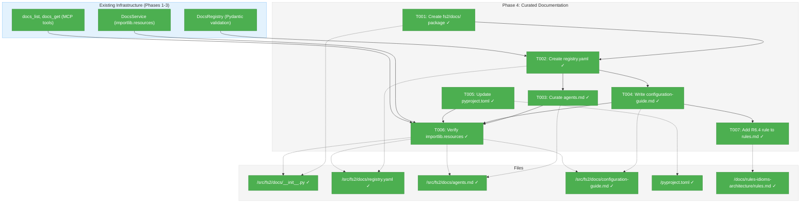
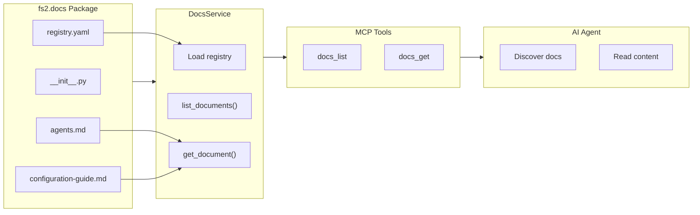
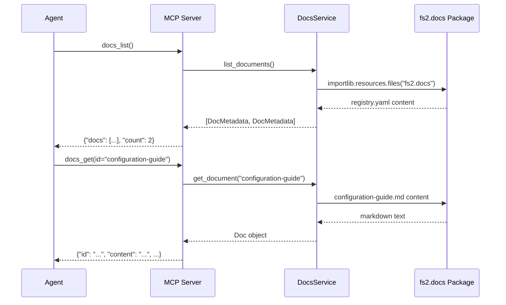

# Phase 4: Curated Documentation – Tasks & Alignment Brief

**Spec**: [../../mcp-doco-spec.md](../../mcp-doco-spec.md)
**Plan**: [../../mcp-doco-plan.md](../../mcp-doco-plan.md)
**Date**: 2026-01-02
**Testing Approach**: Lightweight (content creation, minimal logic)

---

## Executive Briefing

### Purpose
This phase creates the bundled documentation package (`src/fs2/docs/`) that ships with fs2 and provides curated, agent-accessible documentation via the MCP tools built in Phases 1-3. Without this phase, the tools have no content to serve.

### What We're Building
A Python package containing:
- **registry.yaml**: Centralized metadata for 2 curated documents
- **agents.md**: Guidance for AI agents using fs2 MCP tools (from prepared doc-samples)
- **configuration-guide.md**: Comprehensive configuration reference (from prepared doc-samples)

### User Value
AI agents can self-serve documentation without human intervention:
- Call `docs_list()` to discover available docs with actionable summaries
- Call `docs_get(id="agents")` to learn how to use fs2 tools effectively
- Call `docs_get(id="configuration-guide")` to understand configuration options

### Example
```python
# Agent discovers available documentation
docs_list()
# Returns: {"docs": [{"id": "agents", "title": "AI Agent Guidance", ...},
#                    {"id": "configuration-guide", "title": "Complete Configuration Guide", ...}],
#          "count": 2}

# Agent retrieves configuration help
docs_get(id="configuration-guide")
# Returns: {"id": "configuration-guide", "title": "...",
#          "content": "# Complete Configuration Guide\n\n...", "metadata": {...}}
```

---

## Objectives & Scope

### Objective
Create the production documentation package that populates the MCP docs tools with initial curated content.

### Goals

- ✅ Create `src/fs2/docs/` package with `__init__.py`
- ✅ Create `registry.yaml` validated by DocsRegistry Pydantic model (Phase 1)
- ✅ Copy `agents.md` from prepared `doc-samples/agents.md` (183 lines, agent-focused)
- ✅ Copy `configuration-guide.md` from prepared `doc-samples/configuration-guide.md` (536 lines, comprehensive)
- ✅ Update `pyproject.toml` to include docs in wheel build
- ✅ Verify importlib.resources access works for the new package

### Non-Goals (Scope Boundaries)

- ❌ Creating more than 2 initial documents (future expansion phase)
- ❌ Adding search/indexing within documents (out of scope)
- ❌ Creating user-editable documentation (bundled package only)
- ❌ Translating documentation to other languages
- ❌ Adding interactive examples or code execution
- ❌ Version-specific documentation branches

---

## Architecture Map

### Component Diagram
<!-- Status: grey=pending, orange=in-progress, green=completed, red=blocked -->
<!-- Updated by plan-6 during implementation -->



### Task-to-Component Mapping

<!-- Status: ⬜ Pending | 🟧 In Progress | ✅ Complete | 🔴 Blocked -->

| Task | Component(s) | Files | Status | Comment |
|------|-------------|-------|--------|---------|
| T001 | Package Init | /src/fs2/docs/__init__.py | ✅ Complete | Empty __init__.py for Python package recognition |
| T002 | Registry | /src/fs2/docs/registry.yaml | ✅ Complete | 2 entries matching DocsRegistry schema (Phase 1) |
| T003 | Agents Doc | /src/fs2/docs/agents.md | ✅ Complete | Copy from doc-samples/agents.md (183 lines) |
| T004 | Config Guide | /src/fs2/docs/configuration-guide.md | ✅ Complete | Copy from doc-samples/configuration-guide.md (536 lines) |
| T005 | Build Config | /pyproject.toml | ✅ Complete | Add docs to wheel includes |
| T006 | Verification | Multiple | ✅ Complete | Smoke test importlib.resources access |
| T007 | Project Rules | /docs/rules-idioms-architecture/rules.md | ✅ Complete | Add R6.4 for bundled docs maintenance |

---

## Tasks

| Status | ID | Task | CS | Type | Dependencies | Absolute Path(s) | Validation | Subtasks | Notes |
|--------|------|--------------------------------------|-----|------|--------------|---------------------------------------------|------------------------------------------|----------|-------|
| [x] | T001 | Create `src/fs2/docs/` package directory with `__init__.py` | 1 | Setup | – | /workspaces/flow_squared/src/fs2/docs/__init__.py | Directory exists, `__init__.py` is empty or has module docstring | – | Required for importlib.resources |
| [x] | T002 | Create `registry.yaml` with 2 document entries | 1 | Core | T001 | /workspaces/flow_squared/src/fs2/docs/registry.yaml | YAML is valid, passes DocsRegistry validation, contains agents + configuration-guide entries | – | Per plan § registry content; agents entry gets expanded tags: [agents, mcp, getting-started, tree, get-node, search, tools] (DYK-5) |
| [x] | T003 | Copy `agents.md` from `doc-samples/agents.md` | 1 | Content | T002 | /workspaces/flow_squared/src/fs2/docs/agents.md | Content copied, file accessible via importlib.resources | – | Source: doc-samples (183 lines) |
| [x] | T004 | Copy `configuration-guide.md` from `doc-samples/configuration-guide.md` | 1 | Content | T002 | /workspaces/flow_squared/src/fs2/docs/configuration-guide.md | Content copied, file accessible via importlib.resources | – | Source: doc-samples (536 lines) |
| [x] | T005 | Update `pyproject.toml` to include docs in wheel | 1 | Build | T001 | /workspaces/flow_squared/pyproject.toml | Docs package included in wheel build | – | Add `"src/fs2/docs/**/*.yaml"` and `"src/fs2/docs/**/*.md"` to hatch.build includes (DYK-1) |
| [x] | T006 | Verify importlib.resources access works | 1 | Verify | T003, T004, T005 | /workspaces/flow_squared/src/fs2/docs/ | Python REPL test confirms files accessible via importlib.resources | – | Smoke test; manual wheel verification after push (DYK-2) |
| [x] | T007 | Add R6.4 Bundled Documentation Maintenance rule | 1 | Doc | T004 | /workspaces/flow_squared/docs/rules-idioms-architecture/rules.md | R6.4 added to Section 6 (Documentation Rules) after R6.3 | – | Ensures future plans update bundled docs when config changes (DYK-4) |

---

## Alignment Brief

### Prior Phases Review

#### Phase-by-Phase Summary

**Phase 1 (Domain Models and Registry)** established the foundational data structures:
- `DocMetadata` and `Doc` frozen dataclasses for immutable document representation
- `DocsRegistry` and `DocumentEntry` Pydantic models for YAML validation
- Factory method `DocMetadata.from_registry_entry()` for type conversion
- 31 tests validating the domain model layer

**Phase 2 (DocsService Implementation)** created the service layer:
- `DocsService` with `docs_package` parameter for package injection
- Methods: `list_documents(category?, tags?)` and `get_document(id)`
- Thread-safe singleton via `get_docs_service()` in dependencies.py
- `DocsNotFoundError` domain exception for missing resources
- 15 tests (12 unit + 3 integration)

**Phase 3 (MCP Tool Integration)** exposed the service via MCP:
- `docs_list` and `docs_get` sync functions in server.py
- Tool annotations (readOnlyHint, idempotentHint, etc.)
- Error translation for `DocsNotFoundError`
- `docs_mcp_client` fixture for testing
- 19 tests covering function calls, annotations, and protocol

#### Cumulative Deliverables (Available to Phase 4)

| Phase | Deliverables | How Phase 4 Uses |
|-------|-------------|------------------|
| 1 | `DocsRegistry` Pydantic model | Validates registry.yaml on first load |
| 1 | `DocMetadata.from_registry_entry()` | Converts registry entries to domain objects |
| 2 | `DocsService(docs_package="fs2.docs")` | Default package path we're creating |
| 2 | `importlib.resources.files("fs2.docs")` pattern | How our docs will be loaded |
| 3 | `docs_list()`, `docs_get()` tools | Will serve our curated content |

#### Critical Patterns to Maintain

1. **Registry ID Format**: Must match `^[a-z0-9-]+$` pattern (from Phase 1 DocsRegistry)
2. **UTF-8 Encoding**: All files must be UTF-8 (Phase 2 DocsService reads with `encoding="utf-8"`)
3. **No stdout Output**: Phase 4 is content-only, no logging concerns
4. **Wheel Compatibility**: Use importlib.resources Traversable API patterns

#### Test Fixtures From Prior Phases

- `tests/fixtures/docs/` - Valid registry + 2 sample docs (Phase 2)
- `tests/fixtures/docs_broken/` - Missing file reference (Phase 2)
- `docs_mcp_client` fixture in conftest.py (Phase 3)

### Critical Findings Affecting This Phase

| Finding | Title | Impact on Phase 4 |
|---------|-------|-------------------|
| CF-02 | importlib.resources Wheel Compatibility | Must create proper package with `__init__.py` for Traversable access |
| CF-04 | Registry Validation | `registry.yaml` must pass DocsRegistry Pydantic validation |

### Invariants & Guardrails

- **No Secrets**: Configuration guide must use `${VAR}` placeholders, never literal keys
- **ID Pattern**: Document IDs must be lowercase alphanumeric with hyphens only
- **Path Convention**: Paths in registry are relative to the docs package (e.g., `agents.md`)

### Inputs to Read

| File | Purpose |
|------|---------|
| `/workspaces/flow_squared/docs/plans/014-mcp-doco/doc-samples/agents.md` | Source for agents.md (prepared, 183 lines) |
| `/workspaces/flow_squared/docs/plans/014-mcp-doco/doc-samples/configuration-guide.md` | Source for configuration-guide.md (prepared, 536 lines) |
| `/workspaces/flow_squared/pyproject.toml` | Current wheel include patterns |

### Visual Alignment Aids

#### System State Diagram



#### Sequence Diagram (Agent Using Docs)



### Test Plan (Lightweight)

This phase is primarily file copying with minimal logic. Testing is lightweight:

| Test | Type | Description |
|------|------|-------------|
| Registry validation | Manual | Pass registry.yaml through DocsRegistry Pydantic model |
| File copy verification | Manual | Confirm files copied correctly from doc-samples |
| Wheel inclusion | Build | Run `uv build` and inspect wheel contents |
| importlib.resources access | REPL | Interactive Python test confirms package accessible |
| Integration smoke test | Integration | Use existing Phase 3 tests with production package |

### Step-by-Step Implementation Outline

1. **T001**: Create `/src/fs2/docs/` directory and empty `__init__.py`
2. **T002**: Write `registry.yaml` with 2 entries, validate with DocsRegistry
3. **T003**: Copy `doc-samples/agents.md` to `/src/fs2/docs/agents.md`
4. **T004**: Copy `doc-samples/configuration-guide.md` to `/src/fs2/docs/configuration-guide.md`
5. **T005**: Update `pyproject.toml` to add `"src/fs2/docs/**/*"` to wheel includes
6. **T006**: Verify with Python REPL: `importlib.resources.files("fs2.docs").joinpath("registry.yaml").read_text()`

### Commands to Run

```bash
# Validate registry YAML (after T002)
cd /workspaces/flow_squared
uv run python -c "
from fs2.config.docs_registry import DocsRegistry
import yaml
with open('src/fs2/docs/registry.yaml') as f:
    data = yaml.safe_load(f)
DocsRegistry.model_validate(data)
print('Registry validation: PASSED')
"

# Verify importlib.resources access (after T006)
uv run python -c "
import importlib.resources
pkg = importlib.resources.files('fs2.docs')
print('Package accessible:', pkg.is_dir())
for item in pkg.iterdir():
    print(f'  {item.name}: {item.is_file()}')
"

# Build wheel and inspect (after T005)
uv build
unzip -l dist/fs2-*.whl | grep docs

# Run Phase 3 integration tests to verify end-to-end
UV_CACHE_DIR=.uv_cache uv run pytest tests/mcp_tests/test_docs_tools.py -v
```

### Risks/Unknowns

| Risk | Severity | Mitigation |
|------|----------|------------|
| pyproject.toml include pattern incorrect | Medium | Test with `uv build` and inspect wheel contents |
| Configuration guide inaccurate | Low | Cross-reference with actual config/objects.py |
| Missing __init__.py breaks importlib | High | Verify early in T001 with REPL test |

### Ready Check

- [ ] Phase 1-3 foundation understood (DocsRegistry, DocsService, MCP tools)
- [ ] doc-samples/agents.md reviewed (183 lines, agent-focused)
- [ ] doc-samples/configuration-guide.md reviewed (536 lines, all 11 sections)
- [ ] pyproject.toml include pattern syntax understood
- [ ] ADR constraints mapped to tasks - **N/A** (no ADRs exist)

---

## Phase Footnote Stubs

_Populated by plan-6 during implementation. Do not create footnote tags during planning._

| Footnote | Task(s) | Description |
|----------|---------|-------------|
| | | |

---

## Evidence Artifacts

Implementation artifacts will be placed in this directory:
- `execution.log.md` - Task-by-task execution log with evidence

---

## Discoveries & Learnings

_Populated during implementation by plan-6. Log anything of interest to your future self._

| Date | Task | Type | Discovery | Resolution | References |
|------|------|------|-----------|------------|------------|
| | | | | | |

**Types**: `gotcha` | `research-needed` | `unexpected-behavior` | `workaround` | `decision` | `debt` | `insight`

**What to log**:
- Things that didn't work as expected
- External research that was required
- Implementation troubles and how they were resolved
- Gotchas and edge cases discovered
- Decisions made during implementation
- Technical debt introduced (and why)
- Insights that future phases should know about

_See also: `execution.log.md` for detailed narrative._

---

## Directory Layout

```
docs/plans/014-mcp-doco/
├── mcp-doco-spec.md
├── mcp-doco-plan.md
└── tasks/
    ├── phase-1-domain-models-and-registry/
    │   ├── tasks.md
    │   └── execution.log.md
    ├── phase-2-docsservice-implementation/
    │   ├── tasks.md
    │   └── execution.log.md
    ├── phase-3-mcp-tool-integration/
    │   ├── tasks.md
    │   └── execution.log.md
    └── phase-4-curated-documentation/
        ├── tasks.md          ← This file
        └── execution.log.md  ← Created by /plan-6
```

---

**STOP**: Do not edit code. Output complete. Awaiting human **GO** before implementation.

---

## Critical Insights Discussion

**Session**: 2026-01-02
**Context**: Phase 4: Curated Documentation – Tasks & Alignment Brief
**Analyst**: AI Clarity Agent
**Reviewer**: Development Team
**Format**: Water Cooler Conversation (5 Critical Insights)

### DYK-1: pyproject.toml Include Pattern is Critical

**Did you know**: Without explicit include patterns for `.yaml` and `.md` files, the production wheel will contain an empty docs package (just `__init__.py`), causing `DocsNotFoundError` at runtime.

**Implications**:
- Hatch's `packages` directive only includes `.py` files by default
- `.yaml` and `.md` files require explicit `include` patterns
- Wheel builds successfully with no errors even if docs are excluded
- Failure only occurs at runtime when user calls `docs_list()`

**Options Considered**:
- Option A: Specific file extensions (`**/*.yaml`, `**/*.md`)
- Option B: Wildcard all docs files (`**/*`)
- Option C: Wildcard with explicit exclusions

**AI Recommendation**: Option A - Specific File Extensions
- Reasoning: Explicit is better than implicit; matches existing `.j2` pattern; prevents accidental inclusion

**Discussion Summary**: User agreed explicit patterns are safer than wildcards.

**Decision**: Use `"src/fs2/docs/**/*.yaml"` and `"src/fs2/docs/**/*.md"` in hatch.build includes

**Action Items**:
- [x] Update T005 notes with exact pattern

**Affects**: T005 task

---

### DYK-2: No Wheel Installation Test

**Did you know**: T006's verification only tests the editable install (filesystem), not the actual wheel that users install via `uvx`. These are different code paths in importlib.resources.

**Implications**:
- Editable install points to filesystem (`src/fs2/docs/`)
- Wheel install points inside the wheel archive
- Pattern could work in dev but fail in production
- `unzip -l` inspection doesn't prove the wheel works

**Options Considered**:
- Option A: Add wheel smoke test to T006 (build, install isolated, test)
- Option B: Defer to Phase 5
- Option C: Add CI check (out of scope)

**AI Recommendation**: Option A - Add Wheel Smoke Test
- Reasoning: Fail fast, low effort, prevents shipping broken artifact

**Discussion Summary**: User suggested pragmatic approach - push changes and do manual `uvx` test at the end.

**Decision**: Manual wheel verification after pushing, not automated in T006

**Action Items**:
- [x] Update T006 notes about manual wheel verification

**Affects**: T006 validation approach

---

### DYK-3: Registry Metadata May Not Match Document Headers

**Did you know**: The titles in registry.yaml ("AI Agent Guidance") don't exactly match the H1 headers in documents ("# fs2 MCP Integration for AI Agents"), which could confuse agents.

**Implications**:
- Registry title is for discovery via `docs_list()`
- Document H1 is for reading via `docs_get()`
- `docs_get()` response already includes both registry metadata and content
- Similarity is close enough that confusion is unlikely

**Options Considered**:
- Option A: Align registry titles to match H1s
- Option B: Align H1s to match registry titles
- Option C: Keep both, accept minor inconsistency
- Option D: Rely on metadata in response (already implemented)

**AI Recommendation**: Option C - Accept Minor Inconsistency
- Reasoning: Already handled via metadata; similarity is close enough; zero effort

**Discussion Summary**: User agreed the mismatch is acceptable.

**Decision**: Accept minor title mismatch between registry and document H1s

**Action Items**: None

**Affects**: Nothing (conscious acceptance)

---

### DYK-4: Configuration Guide Will Drift from Actual Config

**Did you know**: The bundled configuration-guide.md is a static snapshot that won't auto-update when someone changes config defaults or adds fields in `objects.py`.

**Implications**:
- Bundled docs in `src/fs2/docs/` are "hidden" compared to `docs/`
- Config changes may not trigger doc update awareness
- Drift is inevitable over time
- Users could receive outdated information

**Options Considered**:
- Option A: Add reminder comments to config files
- Option B: Add PR template checkbox
- Option C: Accept drift, periodic review
- Option D: Generate docs from schemas (over-engineering)

**AI Recommendation**: Option C - Accept Drift, Periodic Review
- Reasoning: Pragmatic; all docs drift; people problem not tooling problem

**Discussion Summary**: User agreed drift is acceptable reality.

**Decision**: Accept docs drift, fix during periodic reviews or when users report issues; add rule to ensure future awareness

**Action Items**:
- [x] Add T007: Add R6.4 rule to rules.md for bundled docs maintenance

**Affects**: Future maintenance; T007 added to Phase 4

---

### DYK-5: agents.md Lacks Tool-Specific Tags for Discovery

**Did you know**: If an agent searches `docs_list(tags=["search"])` looking for help with the search tool, they get zero results - even though agents.md thoroughly documents the search tool.

**Implications**:
- Current tags: `[agents, mcp, getting-started]`
- Document covers: tree, get_node, search tools + workflows
- Tool names not in tags = missed discovery opportunity
- Spec AC3 mentions tags with OR logic, implying filtering is expected

**Options Considered**:
- Option A: Add tool-specific tags `[..., tree, get-node, search, tools]`
- Option B: Keep broad tags only
- Option C: Add just "tools" tag

**AI Recommendation**: Option A - Add Tool-Specific Tags
- Reasoning: Tags are cheap; discovery matters; matches spec AC3 intent

**Discussion Summary**: User agreed richer tagging improves discoverability.

**Decision**: Expand agents.md tags to `[agents, mcp, getting-started, tree, get-node, search, tools]`

**Action Items**:
- [x] Update T002 notes with expanded tags

**Affects**: T002 registry.yaml content

---

## Session Summary

**Insights Surfaced**: 5 critical insights identified and discussed
**Decisions Made**: 5 decisions reached through collaborative discussion
**Action Items Created**: 4 task updates applied
**Areas Updated**:
- T002: Expanded tags for agents.md (DYK-5)
- T005: Explicit include patterns (DYK-1)
- T006: Manual wheel verification note (DYK-2)
- T007: NEW - Add R6.4 rule for bundled docs maintenance (DYK-4)

**Shared Understanding Achieved**: ✓

**Confidence Level**: High - All key risks identified and addressed or consciously accepted

**Next Steps**: Proceed with `/plan-6-implement-phase --phase 4` implementation

**Notes**: Phase 4 is straightforward file copying with one critical gotcha (pyproject.toml pattern). Manual wheel test after push will catch any remaining issues.
