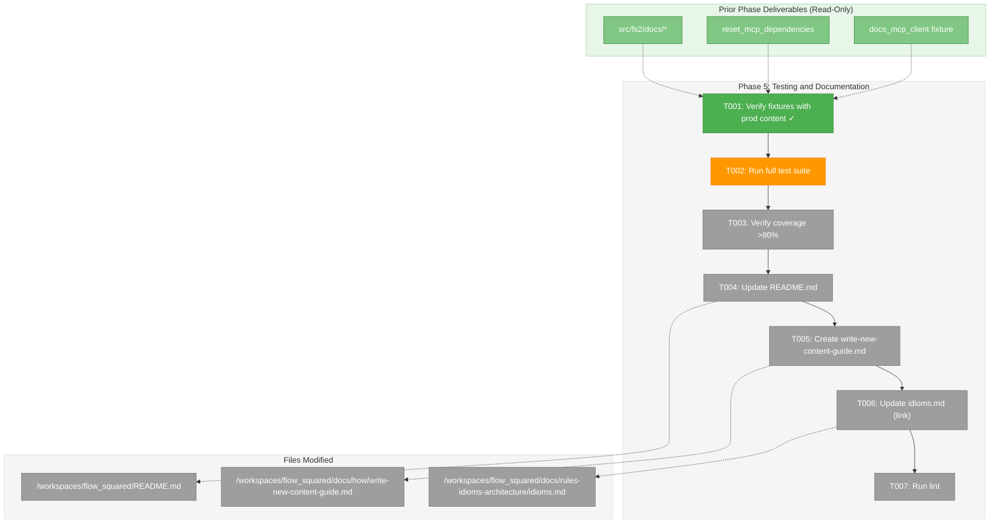
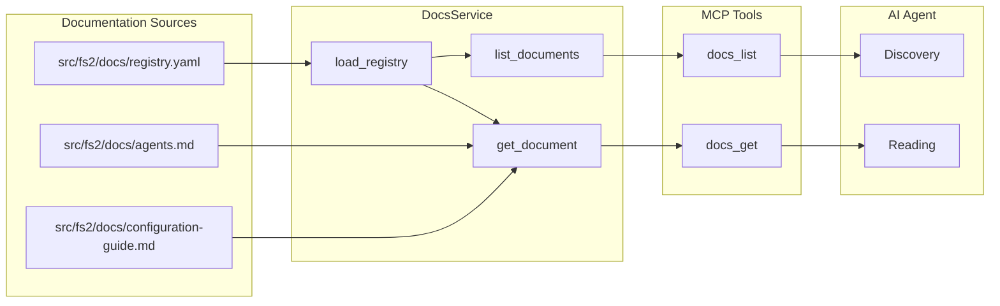
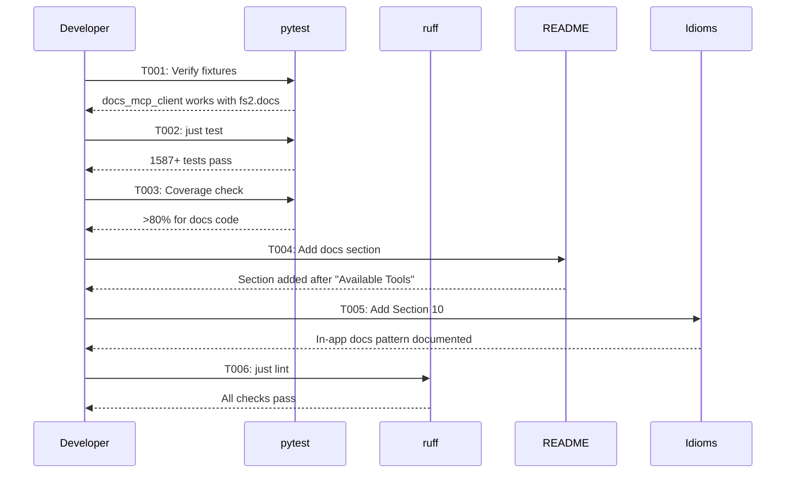

# Phase 5: Testing and Documentation – Tasks & Alignment Brief

**Spec**: [../../mcp-doco-spec.md](../../mcp-doco-spec.md)
**Plan**: [../../mcp-doco-plan.md](../../mcp-doco-plan.md)
**Date**: 2026-01-03
**Testing Approach**: Lightweight (verification & documentation focus)

---

## Executive Briefing

### Purpose
This phase completes the MCP Documentation Tools feature by verifying test infrastructure, ensuring coverage targets are met, updating user-facing documentation, and establishing patterns for future documentation additions. This is the final phase that delivers the complete feature.

### What We're Building
Phase 5 is primarily verification and documentation:
- Verify the test fixtures created in Phase 3 work correctly with production content
- Run the full test suite to catch any integration issues
- Update README.md with docs tool usage examples (per Documentation Strategy)
- Document the `src/fs2/docs/` in-app documentation pattern in idioms.md (per AC9)
- Ensure lint passes for all new code

### User Value
Users and AI agents gain:
- Documentation in README.md showing how to use `docs_list` and `docs_get` tools
- A documented pattern (in idioms.md) for adding new curated documentation
- Confidence that all 65+ docs-related tests pass with production content

### Example
After Phase 5, an agent can read idioms.md and learn:
```markdown
## In-App Documentation Pattern

To add a new curated document:
1. Create `src/fs2/docs/my-guide.md` with content
2. Add entry to `src/fs2/docs/registry.yaml`
3. Verify: `docs_list()` returns new document
```

---

## Objectives & Scope

### Objective
Complete the MCP Documentation Tools feature by verifying test coverage, updating project documentation per spec AC9 and Documentation Strategy, and ensuring all acceptance criteria are satisfied.

### Goals

- ✅ Verify test fixtures from Phase 3 work with production `fs2.docs` package
- ✅ Run full test suite with no regressions (1587+ tests)
- ✅ Verify docs-related test coverage meets >80% threshold
- ✅ Update README.md with `docs_list` and `docs_get` tool documentation
- ✅ Document in-app documentation pattern in idioms.md (AC9)
- ✅ Ensure `just lint` passes

### Non-Goals

- ❌ Creating new MCP tools (completed in Phases 1-3)
- ❌ Adding new curated documents (Phase 4 delivered agents.md and configuration-guide.md)
- ❌ Modifying DocsService implementation (stable from Phase 2)
- ❌ Performance optimization (docs are small, sync reads acceptable)
- ❌ Updating mcp-server-guide.md (README is sufficient per Documentation Strategy)
- ❌ Adding automated wheel smoke test (manual uvx test post-push is acceptable)

---

## Architecture Map

### Component Diagram
<!-- Status: grey=pending, orange=in-progress, green=completed, red=blocked -->
<!-- Updated by plan-6 during implementation -->



### Task-to-Component Mapping

<!-- Status: ⬜ Pending | 🟧 In Progress | ✅ Complete | 🔴 Blocked -->

| Task | Component(s) | Files | Status | Comment |
|------|-------------|-------|--------|---------|
| T001 | Test Infrastructure | tests/mcp_tests/conftest.py (read), tests/mcp_tests/test_docs_tools.py | ✅ Complete | Verify Phase 3 fixtures work with production content |
| T002 | Full Test Suite | All test files | 🟧 In Progress | Run `just test`, expect 1587+ tests |
| T003 | Coverage Report | Coverage output | ⬜ Pending | Verify >80% for src/fs2/core/services/docs_service.py and related |
| T004 | README | /workspaces/flow_squared/README.md | ⬜ Pending | Add "Documentation Tools" section after "Available Tools" |
| T005 | Guide | /workspaces/flow_squared/docs/how/write-new-content-guide.md | ⬜ Pending | Create in-app docs guide (AC9 content) |
| T006 | Idioms | /workspaces/flow_squared/docs/rules-idioms-architecture/idioms.md | ⬜ Pending | Add brief Section 10 linking to guide |
| T007 | Linting | All source files | ⬜ Pending | Run `just lint`, fix any issues |

---

## Tasks

| Status | ID | Task | CS | Type | Dependencies | Absolute Path(s) | Validation | Subtasks | Notes |
|--------|------|------|-----|------|--------------|------------------|------------|----------|-------|
| [x] | T001 | Verify test fixtures work with production fs2.docs package | 1 | Verification | – | /workspaces/flow_squared/tests/mcp_tests/conftest.py, /workspaces/flow_squared/tests/mcp_tests/test_docs_tools.py | Run subset of tests with fs2.docs, all pass | – | Confirm Phase 3 fixtures work |
| [~] | T002 | Run full test suite and fix any failures | 2 | Testing | T001 | /workspaces/flow_squared/ | `just test` passes, 1587+ tests green | – | No regressions |
| [ ] | T003 | Verify test coverage exceeds 80% for new code | 1 | Verification | T002 | /workspaces/flow_squared/src/fs2/core/services/docs_service.py, /workspaces/flow_squared/src/fs2/mcp/server.py | Coverage report shows >80% for docs-related code | – | Per CF-08 |
| [ ] | T004 | Update README.md with Documentation Tools section | 2 | Doc | T003 | /workspaces/flow_squared/README.md | Section exists after "Available Tools" table with docs_list/docs_get examples | – | Per Documentation Strategy |
| [ ] | T005 | Create docs/how/write-new-content-guide.md | 2 | Doc | T004 | /workspaces/flow_squared/docs/how/write-new-content-guide.md | Guide covers in-app docs pattern, registry schema, build config | – | Per AC9 |
| [ ] | T006 | Update idioms.md with brief reference to guide | 1 | Doc | T005 | /workspaces/flow_squared/docs/rules-idioms-architecture/idioms.md | Section 10 exists with link to write-new-content-guide.md | – | Per AC9 |
| [ ] | T007 | Run lint and fix any issues | 1 | Quality | T006 | /workspaces/flow_squared/ | `just lint` passes | – | – |

---

## Alignment Brief

### Prior Phases Review

#### Phase 1: Domain Models and Registry (Complete)

**A. Deliverables Created**:
- `/workspaces/flow_squared/src/fs2/core/models/doc.py` - DocMetadata (frozen dataclass, 6 fields), Doc (frozen dataclass), factory method `from_registry_entry()`
- `/workspaces/flow_squared/src/fs2/config/docs_registry.py` - DocumentEntry, DocsRegistry Pydantic models
- `/workspaces/flow_squared/src/fs2/core/models/__init__.py` - Exports DocMetadata, Doc

**B. Lessons Learned**:
- TDD with RED-GREEN phases ensures quality
- `TYPE_CHECKING` pattern avoids circular imports between domain and config layers
- Tuple for tags ensures full immutability

**C. Technical Discoveries**:
- `FrozenInstanceError` import needed for test assertions
- Path must be `str` (not `pathlib.Path`) for wheel compatibility with importlib.resources
- ID pattern `^[a-z0-9-]+$` validates at config layer

**D. Dependencies Exported**:
- `DocMetadata` - Return type for `list_documents()`
- `Doc` - Return type for `get_document()`
- `DocMetadata.from_registry_entry()` - Factory for Pydantic→dataclass conversion
- `DocsRegistry` - Registry validation model

**E. Critical Findings Applied**:
- CF-02 (importlib.resources): `path: str` field type
- CF-04 (Registry validation): DocsRegistry Pydantic model with Field(pattern=...)

**F-H. Status**: All 9 tasks complete, 31 tests, no blocked items, no technical debt

**I. Architectural Decisions**:
- Frozen dataclasses for domain models
- Pydantic models in `config/` layer (not `core/models/`)
- Factory methods bridge Pydantic to dataclass

**K. Key Log References**: [^1], [^2] in plan footnotes

---

#### Phase 2: DocsService Implementation (Complete)

**A. Deliverables Created**:
- `/workspaces/flow_squared/src/fs2/core/services/docs_service.py` - DocsService with `list_documents()`, `get_document()`, `_load_registry()`
- `/workspaces/flow_squared/src/fs2/core/adapters/exceptions.py` - DocsNotFoundError (lines 322-356)
- `/workspaces/flow_squared/src/fs2/mcp/dependencies.py` - `get_docs_service()`, `set_docs_service()`, `reset_docs_service()` (lines 141-179)

**B. Lessons Learned**:
- Package marker files (`__init__.py`) required for ALL parent directories with importlib.resources
- TemplateService pattern for importlib.resources ensures wheel compatibility
- Constructor injection for `docs_package` enables test fixture injection

**C. Technical Discoveries**:
- Traversable API: only use `.is_file()`, `.read_text()`, `.joinpath()` - never `.resolve()`
- Registry cached at init, content fresh per-call
- No ConfigurationService dependency (simpler than other services)

**D. Dependencies Exported**:
- `DocsService` class with `list_documents(category?, tags?)` and `get_document(doc_id)`
- `DocsNotFoundError` exception
- DI functions: `get_docs_service()`, `set_docs_service()`, `reset_docs_service()`

**E. Critical Findings Applied**:
- CF-01 (stdout/stderr): All logging via `logger.debug()` to stderr
- CF-02 (importlib.resources): Traversable API only
- CF-05 (DI pattern): Thread-safe singleton with RLock
- CF-06 (Error translation): DocsNotFoundError with actionable message

**F-H. Status**: All 7 tasks complete, 15 tests (12 unit + 3 integration), no technical debt

**I. Architectural Decisions**:
- Package injection pattern: `DocsService(docs_package="tests.fixtures.docs")`
- Fail-fast validation at construction
- `None` return for not-found (not exceptions)

**K. Key Log References**: [^3], [^4], [^5] in plan footnotes

---

#### Phase 3: MCP Tool Integration (Complete)

**A. Deliverables Created**:
- `/workspaces/flow_squared/src/fs2/mcp/server.py` - `docs_list()` (lines 774-822), `docs_get()` (lines 825-869), tool registrations (lines 872-895), DocsNotFoundError handler (lines 114-116)
- `/workspaces/flow_squared/tests/mcp_tests/test_docs_tools.py` - 19 tests across 5 test classes
- `/workspaces/flow_squared/tests/mcp_tests/conftest.py` - `docs_mcp_client` fixture (lines 533-557)

**B. Lessons Learned**:
- Sync tools (not async) match `tree()` and `get_node()` patterns
- FastMCP None return uses `structured_content == {"result": None}`
- Simple fixture sufficient - DocsService doesn't need GraphStore

**C. Technical Discoveries**:
- DYK-1: Sync functions for non-blocking service calls
- DYK-2: `None` return for not-found matches `get_node()` behavior
- DYK-4: Dedicated `docs_mcp_client` fixture simpler than extending existing fixtures
- DYK-5: Custom dict construction for spec-compliant response format

**D. Dependencies Exported**:
- `docs_list(category?, tags?)` → `{"docs": [...], "count": N}`
- `docs_get(id)` → `{"id", "title", "content", "metadata"}` or `None`
- `docs_mcp_client` fixture for MCP protocol tests
- Tool annotations: `readOnlyHint=True`, `idempotentHint=True`, `openWorldHint=False`

**E. Critical Findings Applied**:
- CF-01 (stdout/stderr): No print statements
- CF-03 (Tool annotations): All 4 hints correctly set
- CF-06 (Error translation): DocsNotFoundError added to translate_error()
- CF-07 (JSON serialization): `dataclasses.asdict()` for DocMetadata

**F-H. Status**: All 8 tasks complete, 19 tests, no technical debt

**I. Architectural Decisions**:
- Sync tools for non-async service
- None for not-found (consistent with get_node)
- Explicit response format (not raw asdict)

**K. Key Log References**: [^6] in plan footnotes

---

#### Phase 4: Curated Documentation (Complete)

**A. Deliverables Created**:
- `/workspaces/flow_squared/src/fs2/docs/__init__.py` - Package init (9 lines)
- `/workspaces/flow_squared/src/fs2/docs/registry.yaml` - 2 document entries (32 lines)
- `/workspaces/flow_squared/src/fs2/docs/agents.md` - AI agent guidance (183 lines)
- `/workspaces/flow_squared/src/fs2/docs/configuration-guide.md` - Configuration reference (536 lines)
- `/workspaces/flow_squared/pyproject.toml` - Added docs patterns to wheel/sdist includes
- `/workspaces/flow_squared/docs/rules-idioms-architecture/rules.md` - Added R6.4 Bundled Documentation Maintenance rule

**B. Lessons Learned**:
- Pre-prepared doc-samples eliminated content creation effort
- Explicit file patterns (`**/*.yaml`, `**/*.md`) safer than wildcards
- Hatch's `packages` directive only includes `.py` by default

**C. Technical Discoveries**:
- DYK-1: pyproject.toml include patterns critical for non-.py files
- DYK-2: Editable vs wheel install differences (manual post-push verification)
- DYK-3: Registry titles don't need to match document H1 exactly
- DYK-5: Expanded tags for discoverability (tree, get-node, search, tools)

**D. Dependencies Exported**:
- `fs2.docs` package for production use
- registry.yaml schema reference
- R6.4 rule for maintenance awareness

**E. Critical Findings Applied**:
- CF-02 (importlib.resources): `__init__.py` with module docstring
- CF-04 (Registry validation): registry.yaml validated against DocsRegistry

**F-H. Status**: All 7 tasks complete, 62 tests passing (reused Phase 3 tests), no technical debt

**I. Architectural Decisions**:
- `src/fs2/docs/` location for wheel distribution
- Registry-based metadata (no frontmatter)
- Tag taxonomy: tool names + topics + providers

**K. Key Log References**: [^7] in plan footnotes

---

### Cross-Phase Synthesis

**Cumulative Test Count**: 65 docs-related tests
- Phase 1: 31 tests (models, registry validation)
- Phase 2: 15 tests (service unit + integration)
- Phase 3: 19 tests (MCP tools + protocol)

**Pattern Evolution**:
1. Phase 1 established frozen dataclass + Pydantic validation pattern
2. Phase 2 applied TemplateService pattern for importlib.resources
3. Phase 3 applied sync tool pattern matching tree/get_node
4. Phase 4 applied bundled package pattern with explicit includes

**Reusable Infrastructure** (all available for Phase 5):
- `tests/fixtures/docs/` - Test registry and sample documents
- `docs_mcp_client` fixture - MCP protocol testing
- `reset_mcp_dependencies` autouse fixture - Test isolation
- DocsService package injection pattern - Fixture/production switching

**Architectural Continuity**:
- All phases followed TDD (except Phase 4 lightweight approach)
- All phases applied relevant Critical Findings
- Clean Architecture boundaries maintained throughout

---

### Critical Findings Affecting This Phase

| Finding | Title | Impact on Phase 5 | Addressed By |
|---------|-------|-------------------|--------------|
| CF-08 | Test Fixture Architecture | Verify fixtures isolate tests, coverage meets threshold | T001, T003 |

---

### ADR Decision Constraints

None applicable to Phase 5.

---

### Invariants & Guardrails

- Test suite must not regress (1587+ tests must pass)
- Coverage for new code must exceed 80%
- No stdout output from docs tools (MCP protocol integrity)
- All lint rules must pass

---

### Inputs to Read

| File | Purpose |
|------|---------|
| `/workspaces/flow_squared/README.md` | Understand current structure before adding docs section |
| `/workspaces/flow_squared/docs/rules-idioms-architecture/idioms.md` | Understand existing sections before adding new pattern |
| `/workspaces/flow_squared/tests/mcp_tests/conftest.py` | Verify docs_mcp_client fixture |
| `/workspaces/flow_squared/tests/mcp_tests/test_docs_tools.py` | Understand test coverage |

---

### Visual Alignment Aids

#### Documentation Flow (Mermaid)



#### Phase 5 Sequence Diagram



---

### Test Plan (Lightweight)

Phase 5 is primarily verification and documentation. No new tests are written.

| Task | Test Type | Command | Expected Result |
|------|-----------|---------|-----------------|
| T001 | Verification | `uv run pytest tests/mcp_tests/test_docs_tools.py -v` | 19 tests pass |
| T002 | Full Suite | `just test` | 1587+ tests pass |
| T003 | Coverage | `uv run pytest --cov=src/fs2/core/services/docs_service --cov=src/fs2/mcp/server --cov-report=term-missing` | >80% coverage |
| T007 | Lint | `just lint` | No errors |

---

### Step-by-Step Implementation Outline

| Step | Task | Action |
|------|------|--------|
| 1 | T001 | Run `pytest tests/mcp_tests/test_docs_tools.py -v` to verify fixtures work |
| 2 | T002 | Run `just test` to execute full test suite |
| 3 | T003 | Run coverage report, verify >80% for docs code |
| 4 | T004 | Edit README.md: Add "Documentation Tools" section after line 252 (after Available Tools table) |
| 5 | T005 | Create `docs/how/write-new-content-guide.md` with full in-app docs pattern |
| 6 | T006 | Edit idioms.md: Add brief Section 10 linking to write-new-content-guide.md |
| 7 | T007 | Run `just lint`, fix any issues |

---

### Commands to Run

```bash
# T001: Verify fixtures
UV_CACHE_DIR=.uv_cache uv run pytest tests/mcp_tests/test_docs_tools.py -v

# T002: Full test suite
just test

# T003: Coverage report
UV_CACHE_DIR=.uv_cache uv run pytest tests/unit/services/test_docs_service.py tests/mcp_tests/test_docs_tools.py --cov=src/fs2/core/services/docs_service --cov=src/fs2/mcp/server --cov-report=term-missing

# T007: Lint
just lint

# T007 (if fixes needed): Auto-fix
just fix
```

---

### Risks & Unknowns

| Risk | Severity | Likelihood | Mitigation |
|------|----------|------------|------------|
| Test regressions from Phase 4 changes | Medium | Low | Run full suite early (T002) |
| Coverage below 80% threshold | Low | Low | Docs tests are comprehensive; add targeted tests if needed |
| README/idioms formatting issues | Low | Low | Follow existing patterns in files |

---

### Ready Check

- [x] Prior phases complete (Phases 1-4 all done)
- [x] Test fixtures exist (docs_mcp_client from Phase 3)
- [x] Production content exists (src/fs2/docs/ from Phase 4)
- [x] README.md read and understood
- [x] idioms.md read and understood
- [ ] **GO/NO-GO from human sponsor**

---

## Phase Footnote Stubs

_Populated during implementation by plan-6._

| ID | Description | Files Affected |
|----|-------------|----------------|
| | | |

---

## Evidence Artifacts

Execution evidence will be written to:
- `docs/plans/014-mcp-doco/tasks/phase-5-testing-and-documentation/execution.log.md`

Supporting files (if any):
- Coverage report output

---

## Discoveries & Learnings

_Populated during implementation by plan-6. Log anything of interest to your future self._

| Date | Task | Type | Discovery | Resolution | References |
|------|------|------|-----------|------------|------------|
| | | | | | |

**Types**: `gotcha` | `research-needed` | `unexpected-behavior` | `workaround` | `decision` | `debt` | `insight`

**What to log**:
- Things that didn't work as expected
- External research that was required
- Implementation troubles and how they were resolved
- Gotchas and edge cases discovered
- Decisions made during implementation
- Technical debt introduced (and why)
- Insights that future phases should know about

_See also: `execution.log.md` for detailed narrative._

---

## Directory Layout

```
docs/plans/014-mcp-doco/
├── mcp-doco-spec.md
├── mcp-doco-plan.md
├── research-dossier.md
├── doc-samples/
│   ├── agents.md
│   └── configuration-guide.md
└── tasks/
    ├── phase-1-domain-models-and-registry/
    │   ├── tasks.md
    │   └── execution.log.md
    ├── phase-2-docsservice-implementation/
    │   ├── tasks.md
    │   └── execution.log.md
    ├── phase-3-mcp-tool-integration/
    │   ├── tasks.md
    │   └── execution.log.md
    ├── phase-4-curated-documentation/
    │   ├── tasks.md
    │   └── execution.log.md
    └── phase-5-testing-and-documentation/
        ├── tasks.md              # This file
        └── execution.log.md      # Created by /plan-6
```

---

## README.md Content to Add (T004)

Insert after line 252 (after the "Available Tools" table):

```markdown
### Documentation Tools

The MCP server includes self-service documentation tools for AI agents:

| Tool | Purpose |
|------|---------|
| `docs_list` | Browse available documentation with optional filtering |
| `docs_get` | Retrieve full document content by ID |

**Browse documentation**:
```python
# List all documents
docs_list()
# Returns: {"docs": [...], "count": 2}

# Filter by category
docs_list(category="how-to")

# Filter by tags (OR logic - matches ANY tag)
docs_list(tags=["config", "setup"])
```

**Get full document**:
```python
docs_get(id="agents")
# Returns: {"id": "agents", "title": "...", "content": "...", "metadata": {...}}
```

Available documents:
- `agents` - Best practices for AI agents using fs2 tools
- `configuration-guide` - Comprehensive configuration reference

See [Writing New Curated Documentation](docs/how/write-new-content-guide.md) for adding new documents.
```

---

## write-new-content-guide.md Content (T005)

Create new file at `/workspaces/flow_squared/docs/how/write-new-content-guide.md`:

```markdown
# Writing New Curated Documentation

This guide explains how to add new curated documentation to fs2's bundled `src/fs2/docs/` package. These documents are accessible via MCP tools (`docs_list`, `docs_get`) and ship with the wheel distribution.

## Overview

fs2 has two documentation locations:

| Location | Purpose | Audience |
|----------|---------|----------|
| `docs/how/` | Developer documentation for repo contributors | Developers |
| `src/fs2/docs/` | Curated user/agent documentation, bundled with package | End users, AI agents |

The `src/fs2/docs/` documents are designed for AI agent self-service - agents can discover and read them without network access or external dependencies.

## Adding a New Document

### Step 1: Create the Markdown File

Create your document in `src/fs2/docs/`:

\`\`\`bash
touch src/fs2/docs/my-guide.md
\`\`\`

Write agent-friendly content:
- Clear structure with headers
- Practical examples
- Common pitfalls and solutions

### Step 2: Add Registry Entry

Add an entry to `src/fs2/docs/registry.yaml`:

\`\`\`yaml
documents:
  # ... existing entries ...
  - id: my-guide                    # Slug format: lowercase, hyphens only
    title: "My Guide Title"         # Human-readable title
    summary: "One-line description of what this doc covers and when to read it."
    category: how-to                # Or: reference
    tags:
      - relevant
      - tags
      - for-discovery
    path: my-guide.md               # Relative to src/fs2/docs/
\`\`\`

### Step 3: Verify Access

Test that your document is discoverable:

\`\`\`python
from fs2.mcp.server import docs_list, docs_get

# Check it appears in the list
result = docs_list()
assert any(d["id"] == "my-guide" for d in result["docs"])

# Check content loads
doc = docs_get(id="my-guide")
assert doc is not None
assert len(doc["content"]) > 0
\`\`\`

## Registry Schema

### ID Format

Document IDs must match pattern `^[a-z0-9-]+$`:
- Lowercase letters
- Numbers
- Hyphens only
- No spaces or underscores

### Required Fields

| Field | Type | Description |
|-------|------|-------------|
| `id` | string | Unique identifier (slug format) |
| `title` | string | Human-readable title |
| `summary` | string | 1-2 sentences: what it covers + when to use |
| `category` | string | Classification (e.g., "how-to", "reference") |
| `tags` | list | Discovery tags for filtering |
| `path` | string | Relative path to markdown file |

### Summary Best Practices

Summaries should answer two questions:
1. **What** does this document cover?
2. **When** should someone read it?

Good example:
> "Best practices for AI agents using fs2 tools. Read this FIRST when starting to use fs2 MCP server to understand tool selection and search strategies."

## Build Configuration

The `pyproject.toml` includes docs in the wheel:

\`\`\`toml
[tool.hatch.build.targets.wheel]
include = [
    "src/fs2/docs/**/*.yaml",
    "src/fs2/docs/**/*.md",
]
\`\`\`

**Important**: Hatch's `packages` directive only includes `.py` files by default. Without these explicit include patterns, markdown and YAML files would be missing from the wheel.

## Maintenance

Per R6.4 in `docs/rules-idioms-architecture/rules.md`, bundled docs require explicit maintenance:

- Changes to configuration schema → review `configuration-guide.md`
- New MCP tools → review `agents.md`
- Changes to registry schema → review `registry.yaml`

## See Also

- [MCP Server Guide](mcp-server-guide.md) - MCP tool setup and usage
- [R6.4 Rule](../rules-idioms-architecture/rules.md#r64-bundled-documentation-maintenance) - Maintenance requirements
```

---

## idioms.md Content to Add (T006)

Insert as Section 10 after line 775:

```markdown
---

## 10. In-App Documentation Pattern

fs2 bundles curated documentation in `src/fs2/docs/` that is accessible via MCP tools. This enables AI agents to self-serve documentation without network access.

**Key points**:
- `docs/how/` = Developer docs (repo contributors)
- `src/fs2/docs/` = User/agent docs (bundled with wheel)
- Registry-based metadata in `registry.yaml`
- Accessible via `docs_list()` and `docs_get()` MCP tools

**See**: [Writing New Curated Documentation](../how/write-new-content-guide.md) for full guide.

<!-- USER CONTENT START -->
<!-- Add project-specific in-app docs patterns here -->
<!-- USER CONTENT END -->
```

---

**STOP**: Do **not** edit code. Await human **GO** before running `/plan-6-implement-phase --phase 5`.
