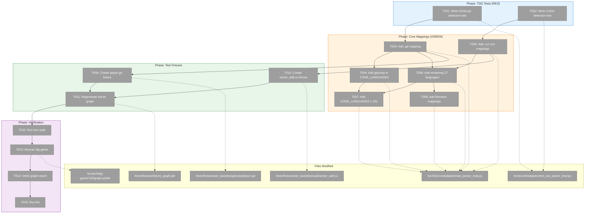
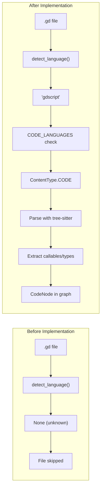
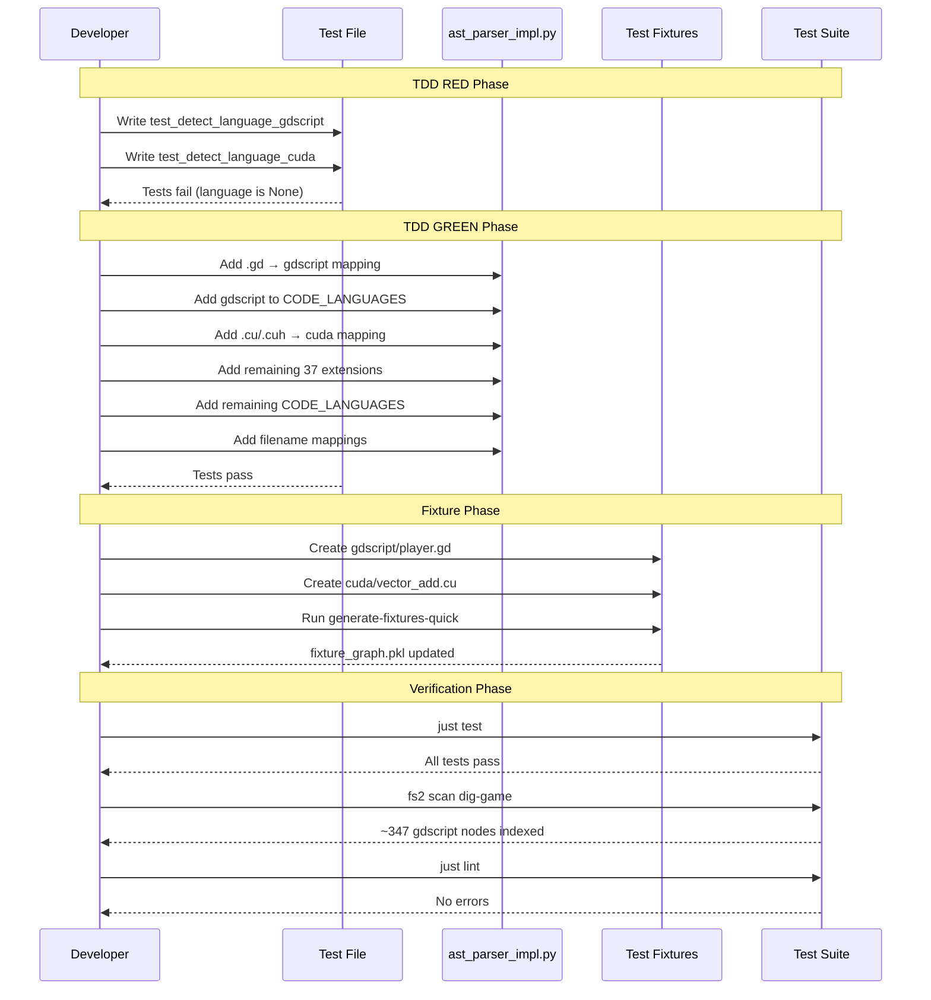

# Implementation – Tasks & Alignment Brief

**Phase**: Implementation (Single Phase - Simple Mode)
**Spec**: [../../scan-fix-spec.md](../../scan-fix-spec.md)
**Plan**: [../../scan-fix-plan.md](../../scan-fix-plan.md)
**Date**: 2026-01-02

---

## Executive Briefing

### Purpose

This phase adds file extension mappings for 29 programming languages to fs2's scanner, enabling detection and indexing of GDScript, Vue, Svelte, CUDA, Verilog, and other commonly-used languages. Without this change, users scanning Godot game projects, web component frameworks, or hardware design codebases get zero indexing for these file types.

### What We're Building

Extension mappings in `ast_parser_impl.py` that enable:
- **Language detection**: 40 new file extensions mapped to 29 language names
- **Code classification**: ~20 languages added to `CODE_LANGUAGES` for callable/type extraction
- **Filename detection**: 5 build system filenames (BUILD, WORKSPACE, meson.build) mapped
- **Test coverage**: GDScript and CUDA test fixtures for verification

### User Value

Users with Godot game projects (`.gd` files), web component frameworks (`.vue`, `.svelte`, `.astro`), shader code (`.glsl`, `.hlsl`, `.wgsl`, `.cu`), hardware designs (`.sv`, `.vhdl`), and other specialized codebases can now use fs2's semantic search, code navigation, and smart content generation on their previously-invisible files.

### Example

**Before**:
```bash
$ fs2 scan /path/to/godot-game
# Result: 0 .gd files indexed (347 files silently skipped)
```

**After**:
```bash
$ fs2 scan /path/to/godot-game
# Result: 347 GDScript files indexed with functions, classes, and methods extracted
```

---

## Objectives & Scope

### Objective

Add file extension mappings for 29 programming languages per plan acceptance criteria AC1-AC9.

**Behavior Checklist**:
- [ ] `.gd` files detected as `gdscript` and classified as `ContentType.CODE`
- [ ] All 7 broken CODE_LANGUAGES (commonlisp, cuda, fortran, glsl, hlsl, wgsl) have working extension mappings
- [ ] Web framework extensions (`.vue`, `.svelte`, `.astro`) detected and indexed
- [ ] Hardware extensions (`.sv`, `.svh`, `.vhd`, `.vhdl`) detected and indexed
- [ ] Test suite passes with new language detection tests
- [ ] dig-game rescan shows ~347 GDScript nodes

### Goals

- ✅ Add 40 extension mappings to `EXTENSION_TO_LANGUAGE` dict
- ✅ Add 5 filename mappings to `FILENAME_TO_LANGUAGE` dict
- ✅ Add ~20 code languages to `CODE_LANGUAGES` set
- ✅ Create GDScript test fixture (`player.gd`)
- ✅ Create CUDA test fixture (`vector_add.cu`)
- ✅ Regenerate test fixture graph
- ✅ Verify with dig-game real-world scan
- ✅ Pass lint and test suite

### Non-Goals (Scope Boundaries)

- ❌ **Custom language handlers**: DefaultHandler sufficient for all 29 languages (per Finding 09)
- ❌ **Ambiguous extension resolution**: Not resolving `.v` (V vs Verilog) or `.m` (MATLAB vs Objective-C) conflicts
- ❌ **Performance optimization**: No parsing performance changes needed
- ❌ **All 116 unmapped languages**: Only adding prioritized 29 (high + medium demand)
- ❌ **Grammar-level parsing fixes**: Relying on tree-sitter grammars as-is
- ❌ **Documentation updates**: Internal dictionary changes only (per spec)
- ❌ **Custom language handlers**: DefaultHandler sufficient (no handler code changes)

---

## Architecture Map

### Component Diagram

<!-- Status: grey=pending, orange=in-progress, green=completed, red=blocked -->
<!-- Updated by plan-6 during implementation -->



### Task-to-Component Mapping

<!-- Status: ⬜ Pending | 🟧 In Progress | ✅ Complete | 🔴 Blocked -->

| Task | Component(s) | Files | Status | Comment |
|------|-------------|-------|--------|---------|
| T001 | Test Suite | `/workspaces/flow_squared/tests/unit/adapters/test_ast_parser_impl.py` | ⬜ Pending | TDD RED: Write failing test for `.gd` detection |
| T002 | Test Suite | `/workspaces/flow_squared/tests/unit/adapters/test_ast_parser_impl.py` | ⬜ Pending | TDD RED: Write failing test for `.cu` detection |
| T003 | AST Parser | `/workspaces/flow_squared/src/fs2/core/adapters/ast_parser_impl.py` | ⬜ Pending | TDD GREEN: Add `.gd` → `gdscript` mapping |
| T004 | AST Parser | `/workspaces/flow_squared/src/fs2/core/adapters/ast_parser_impl.py` | ⬜ Pending | Add `gdscript` to CODE_LANGUAGES |
| T005 | AST Parser | `/workspaces/flow_squared/src/fs2/core/adapters/ast_parser_impl.py` | ⬜ Pending | TDD GREEN: Add `.cu`, `.cuh` → `cuda` mapping |
| T006 | AST Parser | `/workspaces/flow_squared/src/fs2/core/adapters/ast_parser_impl.py` | ⬜ Pending | Add remaining 27 language extensions |
| T007 | AST Parser | `/workspaces/flow_squared/src/fs2/core/adapters/ast_parser_impl.py` | ⬜ Pending | Add ~20 languages to CODE_LANGUAGES |
| T008 | AST Parser | `/workspaces/flow_squared/src/fs2/core/adapters/ast_parser_impl.py` | ⬜ Pending | Add BUILD, WORKSPACE, meson.build mappings |
| T009 | Test Fixtures | `/workspaces/flow_squared/tests/fixtures/ast_samples/gdscript/player.gd` | ⬜ Pending | Create GDScript sample with class + functions |
| T010 | Test Fixtures | `/workspaces/flow_squared/tests/fixtures/ast_samples/cuda/vector_add.cu` | ⬜ Pending | Create CUDA sample with kernel + host function |
| T011 | Build | `/workspaces/flow_squared/tests/fixtures/fixture_graph.pkl` | ⬜ Pending | Regenerate fixture graph with new samples |
| T012 | Verification | All test files | ⬜ Pending | Run `just test` - all tests pass |
| T013 | Verification | `/workspaces/flow_squared/scratch/dig-game/.fs2/graph.pickle` | ⬜ Pending | Rescan dig-game with new language support |
| T014 | Verification | `/workspaces/flow_squared/scripts/graph_report.py` | ⬜ Pending | Verify gdscript nodes appear in report |
| T015 | Quality | `/workspaces/flow_squared/src/fs2/core/adapters/ast_parser_impl.py` | ⬜ Pending | Run `just lint` - no errors |

---

## Tasks

| Status | ID | Task | CS | Type | Dependencies | Absolute Path(s) | Validation | Subtasks | Notes |
|--------|-----|------|----|------|--------------|------------------|------------|----------|-------|
| [ ] | T001 | Write language detection test for GDScript following existing pattern in test class `TestTreeSitterParserLanguageDetection` | 1 | Test | -- | `/workspaces/flow_squared/tests/unit/adapters/test_ast_parser_impl.py` | Test exists, runs, fails with `assert language == "gdscript"` | -- | TDD RED phase |
| [ ] | T002 | Write language detection test for CUDA following existing pattern | 1 | Test | -- | `/workspaces/flow_squared/tests/unit/adapters/test_ast_parser_impl.py` | Test exists, runs, fails with `assert language == "cuda"` | -- | TDD RED phase |
| [ ] | T003 | Add GDScript extension mapping `".gd": "gdscript"` to EXTENSION_TO_LANGUAGE dict (after line ~92, Mobile section) | 1 | Core | T001 | `/workspaces/flow_squared/src/fs2/core/adapters/ast_parser_impl.py` | T001 test passes | -- | TDD GREEN phase |
| [ ] | T004 | Add `"gdscript"` to CODE_LANGUAGES set (new Game Engines section after line 163) | 1 | Core | T003 | `/workspaces/flow_squared/src/fs2/core/adapters/ast_parser_impl.py` | GDScript files classified as ContentType.CODE | -- | Enables callable extraction |
| [ ] | T005 | Add CUDA extensions `".cu": "cuda"`, `".cuh": "cuda"` to EXTENSION_TO_LANGUAGE | 1 | Core | T002 | `/workspaces/flow_squared/src/fs2/core/adapters/ast_parser_impl.py` | T002 test passes | -- | TDD GREEN phase |
| [ ] | T006 | Add remaining 37 extension mappings for 27 languages per Extension Mapping Reference in plan | 2 | Core | T003,T005 | `/workspaces/flow_squared/src/fs2/core/adapters/ast_parser_impl.py` | All 40 extensions present in dict | -- | Per Finding 05 |
| [ ] | T007 | Add ~19 languages to CODE_LANGUAGES: vue, svelte, astro, verilog, vhdl, solidity, cairo, odin, gleam, hare, pony, haxe, elm, purescript, cobol, pascal, ada, objc | 1 | Core | T006 | `/workspaces/flow_squared/src/fs2/core/adapters/ast_parser_impl.py` | All 20 languages in CODE_LANGUAGES set | -- | Per Finding 12 |
| [ ] | T008 | Add 5 filename mappings to FILENAME_TO_LANGUAGE: BUILD, BUILD.bazel, WORKSPACE, meson.build, meson_options.txt | 1 | Core | T006 | `/workspaces/flow_squared/src/fs2/core/adapters/ast_parser_impl.py` | All 5 filenames mapped | -- | Build system support |
| [ ] | T009 | Create GDScript test fixture directory and player.gd file with class, extends, functions | 1 | Fixture | T003 | `/workspaces/flow_squared/tests/fixtures/ast_samples/gdscript/player.gd` | File exists, valid GDScript syntax | -- | Per research dossier |
| [ ] | T010 | Create CUDA test fixture directory and vector_add.cu file with __global__ and __host__ functions | 1 | Fixture | T005 | `/workspaces/flow_squared/tests/fixtures/ast_samples/cuda/vector_add.cu` | File exists, valid CUDA syntax | -- | Per research dossier |
| [ ] | T011 | Run `just generate-fixtures` from `/workspaces/flow_squared/` (full mode with smart content) | 1 | Build | T009,T010 | `/workspaces/flow_squared/tests/fixtures/fixture_graph.pkl` | Command succeeds, pickle file updated with AI summaries | -- | Azure credentials available |
| [ ] | T012 | Run `cd /workspaces/flow_squared && just test` | 1 | Verify | T011 | `/workspaces/flow_squared/` | All tests pass (0 failures) | -- | AC7 validation |
| [ ] | T013 | Run `cd /workspaces/flow_squared/scratch/dig-game && uv run fs2 scan` | 1 | Verify | T012 | `/workspaces/flow_squared/scratch/dig-game/.fs2/graph.pickle` | Scan completes without error | -- | Real-world validation |
| [ ] | T014 | Run `uv run python /workspaces/flow_squared/scripts/graph_report.py --graph-path /workspaces/flow_squared/scratch/dig-game/.fs2/graph.pickle` | 1 | Verify | T013 | `/workspaces/flow_squared/scripts/graph_report.py` | Report shows `gdscript` language with ~300-400 nodes | -- | AC1, AC2, AC6 |
| [ ] | T015 | Run `cd /workspaces/flow_squared && just lint` | 1 | Quality | T014 | `/workspaces/flow_squared/src/fs2/core/adapters/ast_parser_impl.py` | Lint passes with no errors | -- | Code quality |

---

## Alignment Brief

### Prior Phases Review

**N/A** - This is Phase 1 (Simple Mode single phase). No prior phases to review.

### Critical Findings Affecting This Phase

| Finding | Constraint/Requirement | Tasks Addressing |
|---------|----------------------|------------------|
| **01: GDScript grammar available** | Can add `.gd` mapping immediately | T003, T004 |
| **02: 7 CODE_LANGUAGES broken** | Must add extension mappings for cuda, glsl, hlsl, etc. | T006 |
| **03: All 29 grammars verified** | No grammar-related blockers | All core tasks |
| **04: Graceful degradation exists** | No error handling changes needed | N/A - no changes |
| **05: Insertion points mapped** | Insert at lines 131 (extensions), 170 (CODE_LANGUAGES) | T003-T008 |
| **06: Test fixture pattern established** | Create fixtures in `tests/fixtures/ast_samples/` | T009, T010 |
| **07: Test patterns clear** | Follow `test_detect_language_<lang>` pattern | T001, T002 |
| **08: Extension conflict `.v`** | Use `.sv`/`.svh` for Verilog, skip `.v` | T006 |
| **09: DefaultHandler covers all** | No custom handlers needed | N/A - no changes |
| **10: Fixture regeneration ready** | Use `just generate-fixtures` (full mode, credentials available) | T011 |
| **12: ContentType classification** | Only add code languages to CODE_LANGUAGES | T007 |

### ADR Decision Constraints

**N/A** - No ADRs reference this spec/plan. ADR Seeds are documented inline in spec (lines 116-128).

### Invariants & Guardrails

- **Backward compatibility**: No existing extension mappings modified (pure additive)
- **Test isolation**: New tests don't interfere with existing 951-line test file
- **Memory**: No memory budget changes (static dict additions only)
- **Performance**: No parsing performance impact (detection is O(1) dict lookup)

### Inputs to Read

| File | Purpose | Lines of Interest |
|------|---------|-------------------|
| `/workspaces/flow_squared/src/fs2/core/adapters/ast_parser_impl.py` | Modify extension mappings | 44-131, 133-144, 149-170 |
| `/workspaces/flow_squared/tests/unit/adapters/test_ast_parser_impl.py` | Add detection tests | 27-46 (pattern), 174-193 (csharp example) |
| `/workspaces/flow_squared/tests/conftest.py` | Understand fixture loading | 152-234 |
| `/workspaces/flow_squared/justfile` | Verify commands | 15-16 (test), 97-101 (generate-fixtures) |

### Visual Alignment Aids

#### System State Flow



#### Implementation Sequence



### Test Plan (Full TDD)

| Test Name | Rationale | Fixture | Expected Output |
|-----------|-----------|---------|-----------------|
| `test_detect_language_gdscript` | Verify `.gd` extension detection | `tmp_path / "test.gd"` | `language == "gdscript"` |
| `test_detect_language_cuda` | Verify `.cu` extension detection | `tmp_path / "kernel.cu"` | `language == "cuda"` |
| `test_parse_gdscript_extracts_callables` | Verify CODE classification + extraction | `ast_samples/gdscript/player.gd` | Contains callable nodes with `_physics_process`, `take_damage` |

**Mock Usage**: None (per spec clarification C3 - avoid mocks entirely)

**Test Pattern** (from existing tests, lines 27-46):
```python
def test_detect_language_gdscript(self, tmp_path):
    """
    Purpose: Verifies .gd extension detected as gdscript.
    Quality Contribution: Ensures GDScript files use correct grammar.
    Acceptance Criteria: detect_language returns "gdscript" for .gd files.

    Task: T001
    AC: AC1
    """
    from fs2.config.service import FakeConfigurationService
    from fs2.config.objects import ScanConfig
    from fs2.core.adapters.ast_parser_impl import TreeSitterParser

    config = FakeConfigurationService(ScanConfig())
    parser = TreeSitterParser(config)

    gd_file = tmp_path / "player.gd"
    gd_file.write_text("class_name Player")
    language = parser.detect_language(gd_file)

    assert language == "gdscript"
```

### Step-by-Step Implementation Outline

1. **T001**: Add `test_detect_language_gdscript` method to `TestTreeSitterParserLanguageDetection` class
2. **T002**: Add `test_detect_language_cuda` method to same test class
3. **T003**: Add `".gd": "gdscript"` to EXTENSION_TO_LANGUAGE (after Mobile section, ~line 92)
4. **T004**: Add `"gdscript"` to CODE_LANGUAGES (new Game Engines section)
5. **T005**: Add `".cu": "cuda"`, `".cuh": "cuda"` to EXTENSION_TO_LANGUAGE
6. **T006**: Add all 37 remaining extensions per plan Extension Mapping Reference
7. **T007**: Add 19 languages to CODE_LANGUAGES per plan CODE_LANGUAGES additions
8. **T008**: Add 5 filename mappings to FILENAME_TO_LANGUAGE
9. **T009**: Create `tests/fixtures/ast_samples/gdscript/` directory, write `player.gd`
10. **T010**: Create `tests/fixtures/ast_samples/cuda/` directory, write `vector_add.cu`
11. **T011**: Run `just generate-fixtures` (full mode with AI summaries)
12. **T012**: Run `just test` - verify all tests pass
13. **T013**: Run `cd scratch/dig-game && uv run fs2 scan`
14. **T014**: Run `graph_report.py` - verify gdscript appears with ~347 nodes
15. **T015**: Run `just lint` - verify no errors

### Commands to Run (Copy/Paste)

```bash
# Setup (already done - verify)
cd /workspaces/flow_squared

# Run single test during TDD
uv run pytest tests/unit/adapters/test_ast_parser_impl.py::TestTreeSitterParserLanguageDetection::test_detect_language_gdscript -v

# Regenerate fixtures after adding samples (full mode with AI summaries)
just generate-fixtures

# Run full test suite
just test

# Rescan dig-game
cd /workspaces/flow_squared/scratch/dig-game
uv run fs2 scan

# Check graph report
uv run python /workspaces/flow_squared/scripts/graph_report.py --graph-path .fs2/graph.pickle

# Run lint
cd /workspaces/flow_squared
just lint
```

### Risks/Unknowns

| Risk | Severity | Mitigation |
|------|----------|------------|
| Tree-sitter grammar bug for specific language | Low | Verified all 29 grammars work; DefaultHandler covers all |
| Extension conflict causes confusion | Medium | Only `.v` conflict; using `.sv` for Verilog per Finding 08 |
| Fixture regeneration fails | Low | `generate-fixtures-quick` doesn't need Azure credentials |
| New tests interfere with existing tests | Low | Pure additive; existing tests unaffected |

### Ready Check

- [x] Critical findings reviewed and mapped to tasks
- [x] No ADRs to map (ADR Seeds inline in spec)
- [x] Absolute paths for all files
- [x] Test plan with expected outputs
- [x] Commands documented
- [ ] **Awaiting GO/NO-GO from human sponsor**

---

## Phase Footnote Stubs

_Populated during implementation by plan-6a. Do not create footnote tags during planning._

| Footnote | Task ID | Summary | FlowSpace Node IDs |
|----------|---------|---------|-------------------|
| [^1] | -- | -- | -- |
| [^2] | -- | -- | -- |
| [^3] | -- | -- | -- |

---

## Evidence Artifacts

| Artifact | Location | Created By |
|----------|----------|------------|
| Execution Log | `./execution.log.md` | plan-6 during implementation |
| Test Output | Captured in execution log | plan-6 |
| Graph Report Output | Captured in execution log | plan-6 |

---

## Discoveries & Learnings

_Populated during implementation by plan-6. Log anything of interest to your future self._

| Date | Task | Type | Discovery | Resolution | References |
|------|------|------|-----------|------------|------------|
| | | | | | |

**Types**: `gotcha` | `research-needed` | `unexpected-behavior` | `workaround` | `decision` | `debt` | `insight`

**What to log**:
- Things that didn't work as expected
- External research that was required
- Implementation troubles and how they were resolved
- Gotchas and edge cases discovered
- Decisions made during implementation
- Technical debt introduced (and why)
- Insights that future phases should know about

_See also: `execution.log.md` for detailed narrative._

---

## Directory Layout

```
/workspaces/flow_squared/docs/plans/016-scan-fix/
├── scan-fix-spec.md              # Specification
├── scan-fix-plan.md              # Implementation plan (Simple Mode)
├── research-dossier.md           # Research findings
└── tasks/
    └── implementation/
        ├── tasks.md              # This file
        └── execution.log.md      # Created by plan-6 during implementation
```

---

**Status**: READY FOR IMPLEMENTATION

**Next step**: Run `/plan-6-implement-phase --plan "docs/plans/016-scan-fix/scan-fix-plan.md"` after human GO.
