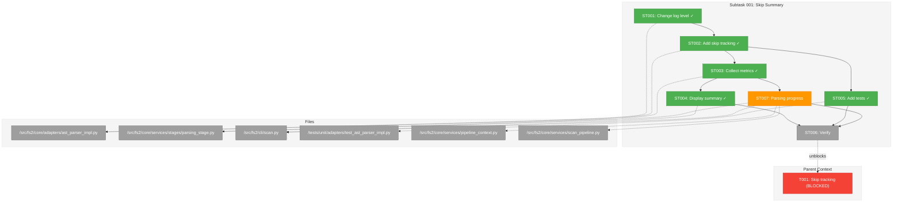

# Subtask 001: Skip Summary Implementation

**Parent Plan:** [View Plan](../../scan-fix-plan.md)
**Parent Phase:** Phase 2: Quiet Scan Output
**Parent Task(s):** [T001: Implement skip tracking and summary display](./tasks.md#task-t001)
**Created:** 2026-01-02

---

## Parent Context

**Why This Subtask:**
T001 requires breakdown into discrete implementation steps: changing log levels, adding skip tracking to parser, collecting metrics in pipeline, and displaying summary in CLI.

---

## Executive Briefing

### Purpose

This subtask implements the complete skip summary feature: hiding per-file skip messages by default and displaying a consolidated summary (e.g., "Skipped: 89 .pyc, 12 .pkl") in the scan output panel.

### What We're Building

1. **Log level change**: `logger.warning()` → `logger.debug()` for skip messages
2. **Skip tracker**: `_skip_counts` dict in TreeSitterParser with `get_skip_summary()` method
3. **Metrics collection**: ParsingStage queries parser and adds to `context.metrics`
4. **CLI display**: Skip summary line after parsing output
5. **Progress callback**: Show "Parsing: 100/1500 files..." every 100 files (if total > 100)

### Unblocks

- T001: Implement skip tracking and summary display (parent task)

### Example

**Generated output** after PARSING stage (before SMART CONTENT):
```
┌─ PARSING ──────────────────────────────┐
│ ✓ Scanned 150 files                    │
│ ✓ Created 1,234 nodes                  │
│ Skipped: 89 .pyc, 12 .pkl, 3 .so       │
└────────────────────────────────────────┘

┌─ SMART CONTENT ────────────────────────┐
│ ...                                    │
```

---

## Objectives & Scope

### Objective

Implement skip tracking and summary display to reduce scan output noise while preserving information.

### Goals

- ✅ Change skip log level from WARNING to DEBUG
- ✅ Add skip count tracking by extension to TreeSitterParser
- ✅ Add `get_skip_summary()` method to parser
- ✅ Collect skip metrics in ParsingStage
- ✅ Display skip summary in CLI scan output
- ✅ Add parsing progress callback (every 100 files if total > 100)
- ✅ Add unit tests for skip tracking

### Non-Goals

- ❌ Separate "unknown language" vs "binary file" categories (combined per user decision)
- ❌ Truncate extension list (show all per user decision)
- ❌ Persist skip info to graph pickle

---

## Architecture Map

### Component Diagram

<!-- Status: grey=pending, orange=in-progress, green=completed, red=blocked -->
<!-- Updated by plan-6 during implementation -->



### Task-to-Component Mapping

<!-- Status: ⬜ Pending | 🟧 In Progress | ✅ Complete | 🔴 Blocked -->

| Task | Component(s) | Files | Status | Comment |
|------|-------------|-------|--------|---------|
| ST001 | Parser logging | ast_parser_impl.py:362,381 | ✅ Complete | Change warning→debug |
| ST002 | Skip tracker | ast_parser_impl.py | ✅ Complete | Add _skip_counts dict + methods |
| ST003 | Metrics | parsing_stage.py | ✅ Complete | Query parser, add to metrics |
| ST004 | CLI display | scan.py:~209 | ✅ Complete | After PARSING, before SMART CONTENT |
| ST005 | Tests | test_ast_parser_impl.py | ✅ Complete | TDD for skip tracking |
| ST007 | Progress callback | pipeline_context.py, scan_pipeline.py, parsing_stage.py, scan.py | 🟧 In Progress | Every 100 files if total > 100 |
| ST006 | Verification | -- | ⬜ Pending | Run full test suite |

---

## Tasks

| Status | ID | Task | CS | Type | Dependencies | Absolute Path(s) | Validation | Subtasks | Notes |
|--------|-----|------|----|------|--------------|------------------|------------|----------|-------|
| [x] | ST001 | Change `logger.warning` to `logger.debug` for skip messages | 1 | Core | -- | `/workspaces/flow_squared/src/fs2/core/adapters/ast_parser_impl.py` | Messages hidden without --verbose | – | Lines 362, 381 |
| [x] | ST002 | Add skip tracking to TreeSitterParser | 2 | Core | ST001 | `/workspaces/flow_squared/src/fs2/core/adapters/ast_parser_impl.py` | `get_skip_summary()` returns counts | – | Add _skip_counts, _record_skip(), get_skip_summary() |
| [x] | ST003 | Collect skip metrics in ParsingStage | 1 | Core | ST002 | `/workspaces/flow_squared/src/fs2/core/services/stages/parsing_stage.py` | Metrics include parsing_skipped_by_ext | – | Query parser after loop |
| [x] | ST004 | Display skip summary in CLI | 1 | Core | ST003 | `/workspaces/flow_squared/src/fs2/cli/scan.py` | "Skipped: N .ext" after parsing | – | After PARSING, before SMART CONTENT |
| [x] | ST005 | Add tests for skip tracking | 2 | Test | ST002 | `/workspaces/flow_squared/tests/unit/adapters/test_ast_parser_impl.py` | Tests pass | – | TDD: test counts, test reset |
| [~] | ST007 | Add parsing progress callback | 2 | Core | ST003 | Multiple (see details) | "Parsing: 100/1500..." shown | – | Every 100 files if total > 100 |
| [ ] | ST006 | Run full test suite and lint | 1 | Verify | ST004,ST005,ST007 | -- | `just test` passes, lint clean | – | Final verification |

---

## Alignment Brief

### Implementation Details

#### ST001: Change Log Level

**File**: `ast_parser_impl.py`

```python
# Line 362 - change:
logger.warning(f"Unknown language for {file_path}, skipping")
# To:
logger.debug(f"Unknown language for {file_path}, skipping")

# Line 381 - change:
logger.warning(f"Binary file detected: {file_path}, skipping")
# To:
logger.debug(f"Binary file detected: {file_path}, skipping")
```

#### ST002: Add Skip Tracking

**File**: `ast_parser_impl.py`

Add to `__init__`:
```python
# Skip tracking for summary reporting
self._skip_counts: dict[str, int] = {}
```

Add methods:
```python
def _record_skip(self, file_path: Path) -> None:
    """Record a skipped file by extension for summary reporting."""
    ext = file_path.suffix.lower() or "(no extension)"
    self._skip_counts[ext] = self._skip_counts.get(ext, 0) + 1

def get_skip_summary(self) -> dict[str, int]:
    """Return skip counts by extension. Clears counts after reading."""
    counts = self._skip_counts.copy()
    self._skip_counts.clear()
    return counts
```

Call `_record_skip(file_path)` at both skip points (lines 362-363 and 381-382).

#### ST003: Collect Skip Metrics

**File**: `parsing_stage.py`

After the parsing loop:
```python
# Collect skip summary from parser
skip_summary = context.ast_parser.get_skip_summary()
context.metrics["parsing_skipped_by_ext"] = skip_summary
context.metrics["parsing_skipped_total"] = sum(skip_summary.values())
```

#### ST004: Display Skip Summary

**File**: `scan.py` - After PARSING stage output, before SMART CONTENT stage

The skip summary should appear immediately after parsing completes:

```
┌─ PARSING ──────────────────────────────┐
│ ✓ Scanned 150 files                    │
│ ✓ Created 1,234 nodes                  │
│ Skipped: 89 .pyc, 12 .pkl, 3 .so       │  ← NEW LINE HERE
└────────────────────────────────────────┘

┌─ SMART CONTENT ────────────────────────┐
│ ...                                    │
```

**Implementation**: Add after the parsing success messages (around line 209-210 in scan.py):

```python
# After printing parsing success messages
console.print_success(f"Scanned {summary.files_scanned} files")
console.print_success(f"Created {summary.nodes_created} nodes")

# Add skip summary if any files were skipped
skipped_by_ext = summary.metrics.get("parsing_skipped_by_ext", {})
if skipped_by_ext:
    skip_parts = [f"{count} {ext}" for ext, count in sorted(
        skipped_by_ext.items(), key=lambda x: -x[1]  # Sort by count desc
    )]
    console.print_info(f"Skipped: {', '.join(skip_parts)}")
```

#### ST007: Add Parsing Progress Callback

**Pattern**: Follow existing SmartContentStage/EmbeddingStage callback pattern.

**Files to modify** (4 files):

1. **PipelineContext** (`/workspaces/flow_squared/src/fs2/core/services/pipeline_context.py`):
   Add after line 101 (embedding callback):
   ```python
   # Parsing progress callback: (processed, total)
   parsing_progress_callback: "Callable[[int, int], None] | None" = None
   ```

2. **ScanPipeline** (`/workspaces/flow_squared/src/fs2/core/services/scan_pipeline.py`):
   - Add parameter to `__init__` (around line 95):
     ```python
     parsing_progress_callback: Callable[[int, int], None] | None = None,
     ```
   - Store and inject into context (around line 181):
     ```python
     context.parsing_progress_callback = self._parsing_progress_callback
     ```

3. **ParsingStage** (`/workspaces/flow_squared/src/fs2/core/services/stages/parsing_stage.py`):
   Modify the file processing loop (lines 58-65):
   ```python
   total = len(context.scan_results)
   progress_callback = context.parsing_progress_callback
   progress_interval = 100  # Report every 100 files

   for i, scan_result in enumerate(context.scan_results):
       # Progress callback (every 100 files, only if total > 100)
       if progress_callback and total > 100 and i > 0 and i % progress_interval == 0:
           progress_callback(i, total)

       try:
           nodes = context.ast_parser.parse(scan_result.path)
           context.nodes.extend(nodes)
       except ASTParserError as e:
           context.errors.append(str(e))
           error_count += 1
   ```

4. **CLI scan.py** (`/workspaces/flow_squared/src/fs2/cli/scan.py`):
   Add callback definition after line 188 (embedding_progress):
   ```python
   def parsing_progress(processed: int, total: int) -> None:
       pct = (processed / total * 100.0) if total else 0.0
       console.print_progress(f"Parsing: {processed}/{total} ({pct:.1f}%) files...")
   ```

   Pass to ScanPipeline constructor (around line 191-201):
   ```python
   pipeline = ScanPipeline(
       ...,
       parsing_progress_callback=parsing_progress,
   )
   ```

**Output example**:
```
┌─ PARSING ──────────────────────────────┐
│ Parsing: 100/1500 (6.7%) files...      │
│ Parsing: 200/1500 (13.3%) files...     │
│ ...                                    │
│ ✓ Scanned 1500 files                   │
│ ✓ Created 12,345 nodes                 │
│ Skipped: 89 .pyc, 12 .pkl              │
└────────────────────────────────────────┘
```

---

#### ST005: Tests

**File**: `test_ast_parser_impl.py`

```python
class TestTreeSitterParserSkipTracking:
    """Tests for skip tracking functionality."""

    def test_get_skip_summary_tracks_unknown_extensions(self, parser, tmp_path):
        """Skip tracking records unknown extensions."""
        # Create files with unknown extensions
        (tmp_path / "file1.xyz").write_text("content")
        (tmp_path / "file2.xyz").write_text("content")
        (tmp_path / "file3.abc").write_text("content")

        # Parse files (will skip due to unknown extension)
        parser.parse(tmp_path / "file1.xyz")
        parser.parse(tmp_path / "file2.xyz")
        parser.parse(tmp_path / "file3.abc")

        summary = parser.get_skip_summary()
        assert summary == {".xyz": 2, ".abc": 1}

    def test_get_skip_summary_clears_after_reading(self, parser, tmp_path):
        """Skip summary clears counts after reading."""
        (tmp_path / "file.xyz").write_text("content")
        parser.parse(tmp_path / "file.xyz")

        summary1 = parser.get_skip_summary()
        assert summary1 == {".xyz": 1}

        summary2 = parser.get_skip_summary()
        assert summary2 == {}  # Cleared
```

### Test Plan

**Testing Approach**: Full TDD

1. Write tests for `get_skip_summary()` first (RED)
2. Implement skip tracking (GREEN)
3. Verify integration with ParsingStage

### Commands

```bash
# Run specific tests
UV_CACHE_DIR=.uv_cache uv run pytest tests/unit/adapters/test_ast_parser_impl.py::TestTreeSitterParserSkipTracking -v

# Run all parser tests
UV_CACHE_DIR=.uv_cache uv run pytest tests/unit/adapters/test_ast_parser_impl.py -v

# Lint
uv run ruff check src/fs2/core/adapters/ast_parser_impl.py src/fs2/core/services/stages/parsing_stage.py src/fs2/cli/scan.py

# Full suite
just test
```

### Ready Check

- [x] Parent phase dossier exists
- [x] Implementation details documented
- [x] Test cases defined
- [x] Files to modify identified
- [x] Ready for `/plan-6-implement-phase --subtask 001-subtask-skip-summary`

---

## Discoveries & Learnings

_Populated during implementation by plan-6. Log anything of interest to your future self._

| Date | Task | Type | Discovery | Resolution | References |
|------|------|------|-----------|------------|------------|
| | | | | | |

**Types**: `gotcha` | `research-needed` | `unexpected-behavior` | `workaround` | `decision` | `debt` | `insight`

**What to log**:
- Things that didn't work as expected
- External research that was required
- Implementation troubles and how they were resolved
- Gotchas and edge cases discovered
- Decisions made during implementation
- Technical debt introduced (and why)
- Insights that future phases should know about

_See also: `001-subtask-skip-summary.execution.log.md` for detailed narrative._

---

## Evidence Artifacts

- **Execution Log**: `001-subtask-skip-summary.execution.log.md` (created by /plan-6-implement-phase)
- **Test Files**: `/workspaces/flow_squared/tests/unit/adapters/test_ast_parser_impl.py`

---

## After Subtask Completion

**This subtask resolves a blocker for:**
- Parent Task: [T001: Implement skip tracking and summary display](./tasks.md#task-t001)

**When all ST### tasks complete:**

1. **Record completion** in parent execution log:
   ```
   ### Subtask 001-subtask-skip-summary Complete

   Resolved: Implemented skip tracking and summary display
   See detailed log: [subtask execution log](./001-subtask-skip-summary.execution.log.md)
   ```

2. **Update parent task** (if it was blocked):
   - Open: [`tasks.md`](./tasks.md)
   - Find: T001
   - Update Status: `[~]` → `[x]` (complete)
   - Update Notes: Add "Subtask 001-subtask-skip-summary complete"

3. **Resume parent phase work:**
   ```bash
   /plan-6-implement-phase --phase "Phase 2: Quiet Scan Output" \
     --plan "/workspaces/flow_squared/docs/plans/016-scan-fix/scan-fix-plan.md"
   ```

**Quick Links:**
- [Parent Dossier](./tasks.md)
- [Parent Plan](../../scan-fix-plan.md)

---

**Directory Structure:**
```
docs/plans/016-scan-fix/
├── scan-fix-plan.md                    # Main plan (updated with Phase 2)
├── scan-fix-spec.md                    # Original spec
├── execution.log.md                    # Phase 1 execution log
├── research-dossier.md                 # Research findings
├── reviews/
│   └── review.md                       # Phase 1 code review
└── tasks/
    ├── implementation/                 # Phase 1 (Simple Mode)
    │   └── tasks.md
    └── phase-2-quiet-scan-output/      # Phase 2
        ├── tasks.md                    # Phase 2 dossier
        ├── 001-subtask-skip-summary.md # This subtask
        └── 001-subtask-skip-summary.execution.log.md  # Created by plan-6
```
