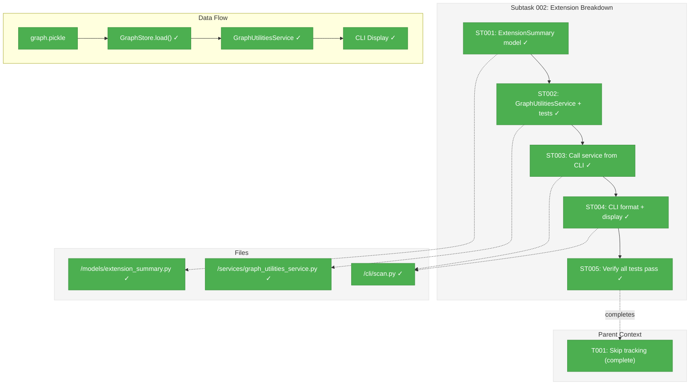

# Subtask 002: Extension Breakdown in Final Summary

**Parent Plan:** [View Plan](../../scan-fix-plan.md)
**Parent Phase:** Phase 2: Quiet Scan Output
**Parent Task(s):** [T001: Implement skip tracking and summary display](../tasks.md#task-t001)
**Plan Task Reference:** [Phase 2 in Plan](../../scan-fix-plan.md#phase-2-quiet-scan-output)

**Why This Subtask:**
User requested enhancement to final scan summary panel to show file/node counts broken down by extension (e.g., "Files: 788 (120 .py, 80 .ts, ...)") for better visibility into what's in the graph.

**Created:** 2026-01-02
**Requested By:** User

---

## Executive Briefing

### Purpose

This subtask enhances the final scan summary panel to show a breakdown of files and nodes by extension. Currently, the summary shows only totals (`Files: 788`, `Nodes: 3776`). Users want to see what languages are represented in the graph at a glance.

### What We're Building

- **GraphUtilitiesService**: New reusable service for graph analysis utilities
- **ExtensionSummary model**: Domain model for extension breakdown data
- **Summary display**: Enhanced Files/Nodes/Skipped lines in final panel

### Architecture Decision

Creating `GraphUtilitiesService` as a central, reusable service following Clean Architecture patterns:
- Receives `ConfigurationService` + `GraphStore` via DI (per R3.2)
- **Loads graph from disk** and reports on persisted state (not transient scan data)
- Lazy loading pattern (like TreeService/GetNodeService)
- Returns domain models, not formatted strings (CLI formats)
- Future: will add graph_report-style methods (out of scope now)

**Key Insight**: This reports on **what's in the graph**, NOT what was just scanned. The service is independent of the scan pipeline and can be called anytime to analyze persisted graph state.

### Unblocks

- Completes Phase 2 UX improvements for scan output
- Provides at-a-glance visibility into graph composition

### Example

**Before:**
```
┌─ Scan Complete ───────────────────────────────┐
│ Status: SUCCESS                               │
│ Files: 788                                    │
│ Nodes: 3776                                   │
│ Smart Content: 78 enriched, 3698 preserved    │
└───────────────────────────────────────────────┘
```

**After:** (Two separate boxes - KISS)
```
┌─ Scan Complete ───────────────────────────────┐
│ Status: SUCCESS                               │
│ Files: 788                                    │
│ Nodes: 3776                                   │
│ Smart Content: 78 enriched, 3698 preserved    │
└───────────────────────────────────────────────┘

┌─ Graph Contents ──────────────────────────────────────────────────────┐
│ Files: 788 (120 .py, 80 .ts, 50 .js, 40 .md, 30 .json, +5 more)      │
│ Nodes: 3776 (500 .py, 300 .ts, 200 .js, 150 .md, +3 more)            │
│ Skipped: 249 .pyc, 6 .j2, 1 .backup, 1 .bin, 1 .pkl                  │
└───────────────────────────────────────────────────────────────────────┘
```

**Design Decision**: Keep first box unchanged (KISS). Add second box for graph stats.

---

## Objectives & Scope

### Objective

Add extension breakdown to the final scan summary panel so users can see at a glance what languages are represented in the graph.

### Goals

- ✅ Create `ExtensionSummary` domain model
- ✅ Create `GraphUtilitiesService` with `get_extension_summary()` method
- ✅ Write tests first (TDD) using FakeGraphStore
- ✅ Call service from ParsingStage, store results in metrics
- ✅ Add `_format_ext_breakdown()` helper in scan.py
- ✅ Update `_display_final_summary()` to show Files/Nodes/Skipped breakdown

### Non-Goals

- ❌ Changes to graph/pickle structure (display only)
- ❌ Language names instead of extensions (keep simple)
- ❌ Configurable limit (hardcode top 5 for now)
- ❌ graph_report-style full analysis (future method, OOS)
- ❌ GraphUtilitiesService config object (not needed yet)

---

## Architecture Map

### Component Diagram
<!-- Status: grey=pending, orange=in-progress, green=completed, red=blocked -->
<!-- Updated by plan-6 during implementation -->



### Task-to-Component Mapping

<!-- Status: ⬜ Pending | 🟧 In Progress | ✅ Complete | 🔴 Blocked -->

| Task | Component(s) | Files | Status | Comment |
|------|-------------|-------|--------|---------|
| ST001 | Domain Model | /models/extension_summary.py | ✅ Complete | Frozen dataclass with files_by_ext, nodes_by_ext |
| ST002 | Service + Tests | /services/graph_utilities_service.py, tests | ✅ Complete | TDD: 12 tests pass. Includes `extract_file_path()` |
| ST003 | CLI Integration | /cli/scan.py | ✅ Complete | Service called after pipeline |
| ST004 | CLI Display | /cli/scan.py | ✅ Complete | `_display_graph_contents()` + `_format_ext_breakdown()` |
| ST005 | Verification | -- | ✅ Complete | 1324 tests pass, lint clean |

---

## Tasks

| Status | ID | Task | CS | Type | Dependencies | Absolute Path(s) | Validation | Subtasks | Notes |
|--------|-----|------|----|------|--------------|------------------|------------|----------|-------|
| [x] | ST001 | Create ExtensionSummary domain model | 1 | Model | – | `/workspaces/flow_squared/src/fs2/core/models/extension_summary.py` | Frozen dataclass exists | – | files_by_ext, nodes_by_ext dicts |
| [x] | ST002 | Create GraphUtilitiesService with TDD | 2 | Core | ST001 | `/workspaces/flow_squared/src/fs2/core/services/graph_utilities_service.py`, `/workspaces/flow_squared/tests/unit/services/test_graph_utilities_service.py` | Tests pass, service loads from GraphStore | – | TDD: 12 tests pass. Includes `extract_file_path(node_id)` static method. |
| [x] | ST003 | Call service from CLI after pipeline | 1 | CLI | ST002 | `/workspaces/flow_squared/src/fs2/cli/scan.py` | Service called after graph persisted | – | Fixed GraphConfig registry bug |
| [x] | ST004 | Add _display_graph_contents() function | 1 | CLI | ST003 | `/workspaces/flow_squared/src/fs2/cli/scan.py` | New "Graph Contents" box appears | – | KISS: separate box |
| [x] | ST005 | Run full test suite and lint | 1 | Verify | ST004 | – | All tests pass, lint clean | – | 1324 passed, 11 skipped |

---

## Alignment Brief

### Objective Recap

Add a second "Graph Contents" box after the scan summary showing extension breakdown (KISS - leave first box alone).

### Critical Findings Affecting This Subtask

| # | Impact | Finding | Action |
|---|--------|---------|--------|
| 01 | High | GraphUtilitiesService should load from GraphStore (persisted graph) | Service is independent of scan pipeline |
| 02 | High | Skip counts already available in metrics from Subtask 001 | Include in Graph Contents box |
| 03 | Medium | TreeService/GetNodeService patterns show DI + lazy load | Follow same pattern |

### Invariants

- All existing tests must pass
- No changes to graph/pickle structure
- Summary panel remains readable (no line wrapping issues)

### Files to Create/Modify

| File | Action | Changes |
|------|--------|---------|
| `/workspaces/flow_squared/src/fs2/core/models/extension_summary.py` | CREATE | Frozen dataclass for extension breakdown |
| `/workspaces/flow_squared/src/fs2/core/models/__init__.py` | MODIFY | Export ExtensionSummary |
| `/workspaces/flow_squared/src/fs2/core/services/graph_utilities_service.py` | CREATE | New service with get_extension_summary(), loads from GraphStore |
| `/workspaces/flow_squared/src/fs2/core/services/__init__.py` | MODIFY | Export GraphUtilitiesService |
| `/workspaces/flow_squared/tests/unit/services/test_graph_utilities_service.py` | CREATE | TDD tests for service |
| `/workspaces/flow_squared/src/fs2/cli/scan.py` | MODIFY | Call service after pipeline, add `_format_ext_breakdown()`, update `_display_final_summary()` |

### Implementation Details

**ST001: ExtensionSummary Domain Model**

```python
# /workspaces/flow_squared/src/fs2/core/models/extension_summary.py
"""ExtensionSummary - Domain model for extension breakdown data."""

from dataclasses import dataclass

@dataclass(frozen=True)
class ExtensionSummary:
    """Immutable summary of file/node counts by extension.

    Attributes:
        files_by_ext: Dict mapping extension to unique file count.
        nodes_by_ext: Dict mapping extension to total node count.
    """
    files_by_ext: dict[str, int]
    nodes_by_ext: dict[str, int]

    @property
    def total_files(self) -> int:
        """Total unique files across all extensions."""
        return sum(self.files_by_ext.values())

    @property
    def total_nodes(self) -> int:
        """Total nodes across all extensions."""
        return sum(self.nodes_by_ext.values())
```

**ST002: GraphUtilitiesService with TDD**

```python
# TESTS FIRST: /workspaces/flow_squared/tests/unit/services/test_graph_utilities_service.py

import pytest
from fs2.config.service import FakeConfigurationService
from fs2.config.objects import GraphConfig
from fs2.core.models.code_node import CodeNode
from fs2.core.repos.graph_store_fake import FakeGraphStore
from fs2.core.services.graph_utilities_service import GraphUtilitiesService

class TestGraphUtilitiesServiceExtensionSummary:
    """Tests for get_extension_summary method."""

    def test_given_graph_with_nodes_when_get_extension_summary_then_returns_counts(self):
        """Verify extension counting from graph store."""
        # Arrange
        config = FakeConfigurationService(GraphConfig())
        graph_store = FakeGraphStore(config)

        # Add nodes to fake graph store
        graph_store.add_node(CodeNode.create_file(file_path="src/main.py", ...))
        graph_store.add_node(CodeNode.create_callable(file_path="src/main.py", name="func", ...))
        graph_store.add_node(CodeNode.create_file(file_path="src/utils.ts", ...))

        service = GraphUtilitiesService(config=config, graph_store=graph_store)

        # Act
        result = service.get_extension_summary()

        # Assert
        assert result.files_by_ext == {".py": 1, ".ts": 1}
        assert result.nodes_by_ext == {".py": 2, ".ts": 1}

    def test_given_file_without_extension_when_get_extension_summary_then_uses_no_ext(self):
        """Verify files without extension are counted as '(no ext)'."""
        ...

    def test_given_empty_graph_when_get_extension_summary_then_returns_empty(self):
        """Verify empty graph returns empty dicts."""
        ...


# SERVICE: /workspaces/flow_squared/src/fs2/core/services/graph_utilities_service.py
"""GraphUtilitiesService - Reusable graph analysis utilities.

Reports on persisted graph state (what's IN the graph),
not transient scan data. Independent of scan pipeline.
"""

from collections import Counter
from pathlib import Path
from typing import TYPE_CHECKING

from fs2.config.objects import GraphConfig
from fs2.core.models.extension_summary import ExtensionSummary

if TYPE_CHECKING:
    from fs2.config.service import ConfigurationService
    from fs2.core.repos.graph_store import GraphStore


class GraphUtilitiesService:
    """Service for graph analysis utilities.

    This service analyzes persisted graph state - what's IN the graph,
    not what was just scanned. It loads from GraphStore on demand.

    First method: extension breakdown for summary.
    Future: graph_report-style analysis methods.

    Follows same pattern as TreeService/GetNodeService:
    - Receives ConfigurationService + GraphStore via DI
    - Lazy loads graph on first access
    - Does NOT cache graph data (per R3.5)
    """

    def __init__(
        self,
        config: "ConfigurationService",
        graph_store: "GraphStore",
    ) -> None:
        """Initialize with config registry and graph store.

        Args:
            config: ConfigurationService registry.
            graph_store: GraphStore for loading persisted graph.
        """
        self._config = config.require(GraphConfig)
        self._graph_store = graph_store
        self._loaded = False

    @staticmethod
    def extract_file_path(node_id: str) -> str:
        """Extract file path from a node_id string.

        Node IDs follow the format: {category}:{file_path}:{qualified_name}
        This method extracts the file_path component.

        Args:
            node_id: Node identifier string (e.g., "class:src/main.py:MyClass")

        Returns:
            The file path component (e.g., "src/main.py")

        Raises:
            ValueError: If node_id format is invalid (fewer than 2 colons)

        Example:
            >>> GraphUtilitiesService.extract_file_path("method:src/calc.py:Calc.add")
            'src/calc.py'
            >>> GraphUtilitiesService.extract_file_path("file:src/main.py:")
            'src/main.py'
        """
        parts = node_id.split(":", 2)  # Split into at most 3 parts
        if len(parts) < 2:
            raise ValueError(
                f"Invalid node_id format: '{node_id}'. "
                "Expected format: {{category}}:{{file_path}}:{{qualified_name}}"
            )
        return parts[1]

    def _ensure_loaded(self) -> None:
        """Lazy load graph on first access."""
        if self._loaded:
            return
        graph_path = Path(self._config.graph_path)
        self._graph_store.load(graph_path)
        self._loaded = True

    def get_extension_summary(self) -> ExtensionSummary:
        """Get extension breakdown from persisted graph.

        Loads graph from disk and counts files/nodes by extension.
        Reports on what's IN the graph, not transient scan state.

        Returns:
            ExtensionSummary with files_by_ext and nodes_by_ext.
        """
        self._ensure_loaded()

        files_by_ext: Counter[str] = Counter()
        nodes_by_ext: Counter[str] = Counter()
        seen_files: set[str] = set()

        # Query graph store on demand (never cache - per R3.5)
        for node in self._graph_store.get_all_nodes():
            # Extract file path from node_id (CodeNode has no file_path attribute)
            file_path = self.extract_file_path(node.node_id)
            ext = Path(file_path).suffix.lower() or "(no ext)"
            nodes_by_ext[ext] += 1
            if file_path not in seen_files:
                seen_files.add(file_path)
                files_by_ext[ext] += 1

        return ExtensionSummary(
            files_by_ext=dict(files_by_ext),
            nodes_by_ext=dict(nodes_by_ext),
        )
```

**ST003: Call from CLI after pipeline completes**

```python
# In scan.py, after pipeline.run() completes and graph is persisted:
from fs2.core.services.graph_utilities_service import GraphUtilitiesService

# Create service with same graph_store used by pipeline
graph_utils = GraphUtilitiesService(config=config, graph_store=graph_store)

# Get extension summary (loads from persisted graph)
ext_summary = graph_utils.get_extension_summary()

# Pass to _display_final_summary
_display_final_summary(
    console,
    summary,
    ext_summary=ext_summary,  # NEW parameter
    ...
)
```

**ST004: New Display Function (KISS - separate box)**

```python
# In scan.py:
from fs2.core.models.extension_summary import ExtensionSummary

def _format_ext_breakdown(counts: dict[str, int], limit: int = 5) -> str:
    """Format extension counts as '120 .py, 80 .ts, ...'"""
    if not counts:
        return ""
    sorted_counts = sorted(counts.items(), key=lambda x: -x[1])[:limit]
    parts = [f"{count} {ext}" for ext, count in sorted_counts]
    remaining = len(counts) - limit
    if remaining > 0:
        parts.append(f"+{remaining} more")
    return ", ".join(parts)


def _display_graph_contents(
    console: Console,
    ext_summary: ExtensionSummary,
    skip_summary: dict[str, int],
) -> None:
    """Display second box with graph contents breakdown.

    KISS: Separate box from scan summary. Shows:
    - Files by extension
    - Nodes by extension
    - Skipped by extension (from scan metrics)
    """
    # Build lines
    files_line = f"Files: {ext_summary.total_files}"
    if ext_summary.files_by_ext:
        files_line += f" ({_format_ext_breakdown(ext_summary.files_by_ext)})"

    nodes_line = f"Nodes: {ext_summary.total_nodes}"
    if ext_summary.nodes_by_ext:
        nodes_line += f" ({_format_ext_breakdown(ext_summary.nodes_by_ext)})"

    skipped_line = "Skipped: 0"
    if skip_summary:
        skipped_line = f"Skipped: {_format_ext_breakdown(skip_summary, limit=10)}"

    lines = [files_line, nodes_line, skipped_line]

    # Display panel
    panel = Panel(
        "\n".join(lines),
        title="Graph Contents",
        border_style="blue",
    )
    console.print(panel)


# Called after _display_final_summary() in scan.py main flow:
# _display_final_summary(console, summary, ...)
# _display_graph_contents(console, ext_summary, skip_summary)
```

### Test Plan

**Testing Approach**: TDD (Test-Driven Development)

1. **ST002**: Write tests FIRST for `GraphUtilitiesService.get_extension_summary()`
   - Test counts files by extension correctly
   - Test counts nodes by extension correctly
   - Test handles files without extension as "(no ext)"
   - Test empty input returns empty dicts
2. **ST002**: Implement service to make tests pass
3. **ST005**: Run full test suite to ensure no regressions
4. **ST05**: Manual verification via `fs2 scan` on project

### Commands

```bash
# Run tests
UV_CACHE_DIR=.uv_cache uv run pytest tests/unit -v

# Run lint
uv run ruff check src/fs2/core/services/stages/parsing_stage.py src/fs2/cli/scan.py

# Manual verification
fs2 scan
```

### Ready Check

- [x] Subtask dossier created
- [x] Implementation details documented
- [x] Files to modify identified
- [x] Parent context linked

---

## Discoveries & Learnings

_Populated during implementation by plan-6. Log anything of interest to your future self._

| Date | Task | Type | Discovery | Resolution | References |
|------|------|------|-----------|------------|------------|
| 2026-01-02 | ST002 | gotcha | CodeNode has no file_path attribute - path is embedded in node_id format `{category}:{file_path}:{qualified_name}` | Add `extract_file_path(node_id)` static method to GraphUtilitiesService | node_id format documented in CodeNode docstring |
| 2026-01-02 | ST003 | gotcha | GraphConfig not in registry when `--graph-file` not provided - local variable never set back | Add `config.set(graph_config)` in else branch of scan.py:106-112 | Caused 21 CLI test failures |

**Types**: `gotcha` | `research-needed` | `unexpected-behavior` | `workaround` | `decision` | `debt` | `insight`

**What to log**:
- Things that didn't work as expected
- External research that was required
- Implementation troubles and how they were resolved
- Gotchas and edge cases discovered
- Decisions made during implementation
- Technical debt introduced (and why)
- Insights that future phases should know about

_See also: `execution.log.md` for detailed narrative._

---

## Evidence Artifacts

- **Execution Log**: `002-subtask-extension-breakdown-summary.execution.log.md` (created by /plan-6-implement-phase)
- **Modified Files**:
  - `/workspaces/flow_squared/src/fs2/core/services/stages/parsing_stage.py`
  - `/workspaces/flow_squared/src/fs2/cli/scan.py`

---

## After Subtask Completion

**This subtask completes Phase 2 enhancements:**
- Parent Task: [T001: Implement skip tracking and summary display](../tasks.md#task-t001)
- Plan Reference: [Phase 2: Quiet Scan Output](../../scan-fix-plan.md#phase-2-quiet-scan-output)

**When all ST### tasks complete:**

1. **Record completion** in parent execution log:
   ```
   ### Subtask 002-subtask-extension-breakdown-summary Complete

   Resolved: Added extension breakdown to final summary panel
   See detailed log: [subtask execution log](./002-subtask-extension-breakdown-summary.execution.log.md)
   ```

2. **Update parent task** (T001):
   - Open: [`tasks.md`](./tasks.md)
   - Find: T001
   - Update Status: `[~]` → `[x]` (complete)
   - Update Subtasks: Add `002-subtask-extension-breakdown-summary`

3. **Update Phase 2 Acceptance Criteria** in plan:
   - Mark AC2.1-AC2.5 as complete
   - Add note about extension breakdown enhancement

**Quick Links:**
- [Parent Dossier](./tasks.md)
- [Parent Plan](../../scan-fix-plan.md)
- [Subtask 001](./001-subtask-skip-summary.md) (Skip Summary - complete)
