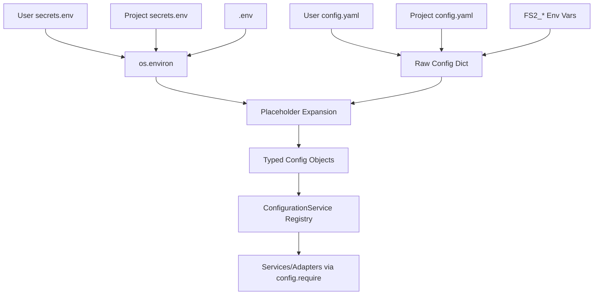

# Research Report: fs2 Configuration System for Doctor Command

**Generated**: 2026-01-02T04:15:00Z
**Research Query**: "Research how the fs2 configuration system works including: ConfigurationService, config loading hierarchy (central ~/.fs2 vs local .fs2), secrets.env handling, pydantic-settings integration. Focus on understanding the full config resolution chain to design an fs2 doctor command."
**Mode**: Plan-Associated
**Location**: docs/plans/017-doctor/research-dossier.md
**fs2 MCP**: Available
**Findings**: 55+ findings from 7 specialized subagents

---

## Executive Summary

### What It Does
The fs2 configuration system implements a **multi-source, typed-object registry** that loads configuration from secrets files, YAML configs, and environment variables with strict precedence rules. It uses Pydantic for validation and supports `${VAR}` placeholder expansion for secrets.

### Business Purpose
Enables flexible configuration across development, CI, and production environments while preventing accidental secret commits. Supports user-global defaults (`~/.config/fs2/`) with project-level overrides (`./.fs2/`).

### Key Insights
1. **Four-Phase Loading Pipeline**: secrets → YAML merge → env override → placeholder expansion → typed instantiation
2. **Precedence Order**: defaults < user YAML < project YAML < FS2_* env vars < .env (working dir wins)
3. **Typed Registry Pattern**: `config.get(AzureOpenAIConfig)` not string-based lookups
4. **Two-Stage Secret Validation**: Field validators (pre-expansion) + model validators (post-expansion)
5. **XDG Compliance**: User config at `~/.config/fs2/`, project at `./.fs2/`

### Quick Stats
- **Components**: 6 core files in `src/fs2/config/`
- **Config Types**: 11 registered in YAML_CONFIG_TYPES
- **Dependencies**: pydantic, pydantic-settings, python-dotenv, PyYAML
- **Test Coverage**: 22 test files, 80+ test classes
- **Prior Learnings**: 15 relevant discoveries from previous implementations

---

## How It Currently Works

### Entry Points

| Entry Point | Type | Location | Purpose |
|-------------|------|----------|---------|
| `FS2ConfigurationService()` | Constructor | `src/fs2/config/service.py:96` | Production config loading |
| `FakeConfigurationService(*configs)` | Constructor | `src/fs2/config/service.py:179` | Test double |
| `fs2 init` | CLI Command | `src/fs2/cli/init.py:34` | Create initial config |
| `fs2 scan` | CLI Command | `src/fs2/cli/scan.py` | Uses config for scanning |

### Core Execution Flow (Four-Phase Pipeline)

```
FS2ConfigurationService.__init__()
│
├─ Phase 1: load_secrets_to_env()
│   ├─ Load ~/.config/fs2/secrets.env (user-global)
│   ├─ Load ./.fs2/secrets.env (project)
│   └─ Load ./.env (working dir - WINS via override=True)
│
├─ Phase 2: Build raw config dict
│   ├─ user_config = load_yaml_config(~/.config/fs2/config.yaml)
│   ├─ project_config = load_yaml_config(./.fs2/config.yaml)
│   ├─ env_config = parse_env_vars()  # FS2_* → nested dict
│   └─ raw_config = deep_merge(user → project → env)
│
├─ Phase 3: expand_placeholders(raw_config)
│   └─ Replace ${VAR} with os.environ[VAR]
│
└─ Phase 4: _create_config_objects(raw_config)
    └─ For each type in YAML_CONFIG_TYPES:
        └─ Extract data at __config_path__, instantiate typed model
```

### Configuration Precedence (Lowest → Highest)

```
1. Config object defaults (Pydantic field defaults)
   ↓ overridden by
2. User YAML (~/.config/fs2/config.yaml)
   ↓ overridden by
3. Project YAML (./.fs2/config.yaml)
   ↓ overridden by
4. Environment variables (FS2_* prefix)
   ↓ overridden by
5. .env file in working directory (./.env)
```

### Secrets Loading Precedence

```
load_secrets_to_env() loads in order (later wins):
1. OS environment (base)
2. ~/.config/fs2/secrets.env (user-global)
3. ./.fs2/secrets.env (project)
4. ./.env (working dir - HIGHEST PRIORITY)
```

### Data Flow



---

## Architecture & Design

### Component Map

```
src/fs2/config/
├── __init__.py          # Public exports
├── service.py           # ConfigurationService ABC + implementations
├── objects.py           # All Pydantic config models + YAML_CONFIG_TYPES registry
├── loaders.py           # Multi-source loading functions
├── paths.py             # XDG path resolution
├── models.py            # YamlConfigSettingsSource (Pydantic integration)
└── exceptions.py        # ConfigurationError hierarchy
```

### Core Components

#### ConfigurationService (ABC)
**File**: `src/fs2/config/service.py:34-92`
```python
class ConfigurationService(ABC):
    @abstractmethod
    def set(self, config: T) -> None: ...

    @abstractmethod
    def get(self, config_type: type[T]) -> T | None: ...

    @abstractmethod
    def require(self, config_type: type[T]) -> T:
        """Raises MissingConfigurationError if not found"""
```

#### YAML_CONFIG_TYPES Registry
**File**: `src/fs2/config/objects.py:744-747`
```python
YAML_CONFIG_TYPES: list[type[BaseModel]] = [
    AzureOpenAIConfig,      # __config_path__ = "azure.openai"
    ScanConfig,             # __config_path__ = "scan"
    GraphConfig,            # __config_path__ = "graph"
    LLMConfig,              # __config_path__ = "llm"
    EmbeddingConfig,        # __config_path__ = "embedding"
    SmartContentConfig,     # __config_path__ = "smart_content"
    SearchConfig,           # __config_path__ = "search"
    # ... 11 total
]
```

#### Path Resolution (XDG Compliant)
**File**: `src/fs2/config/paths.py`
```python
def get_user_config_dir() -> Path:
    xdg_config = os.environ.get("XDG_CONFIG_HOME")
    if xdg_config:
        return Path(xdg_config) / "fs2"
    return Path.home() / ".config" / "fs2"

def get_project_config_dir() -> Path:
    return Path.cwd() / ".fs2"
```

### Design Patterns Identified

1. **Typed Object Registry** - Type-keyed storage via `dict[type, BaseModel]`
2. **Multi-Phase Pipeline** - Clear separation: secrets → merge → expand → instantiate
3. **Deep Merge with Leaf Precedence** - Overlay wins at leaf level, preserves siblings
4. **Deferred Error Surfacing** - Validation errors surface at `require()` time, not construction
5. **Placeholder Expansion** - `${VAR}` syntax with recursive resolution
6. **Dual-Layer Validation** - Field validators (early) + model validators (cross-field)
7. **Graceful Fallback** - Missing files return `{}`, no crashes
8. **Actionable Errors** - Exceptions list candidate fix sources
9. **Dependency Injection** - No singletons, explicit construction
10. **XDG Compliance** - User config follows XDG Base Directory spec

---

## Dependencies & Integration

### External Dependencies

| Library | Purpose | Criticality |
|---------|---------|-------------|
| `pydantic` | Config model validation | Critical |
| `pydantic-settings` | Multi-source settings | Critical |
| `python-dotenv` | .env file loading | High |
| `PyYAML` | YAML config parsing | High |

### What Consumes ConfigurationService

| Consumer | Config Types Required | Location |
|----------|----------------------|----------|
| ScanPipeline | ScanConfig | `src/fs2/core/services/scan_pipeline.py` |
| SmartContentService | SmartContentConfig, LLMConfig | `src/fs2/core/services/smart_content/` |
| EmbeddingService | EmbeddingConfig | `src/fs2/core/services/embedding/` |
| SearchService | SearchConfig | `src/fs2/core/services/search/` |
| FileSystemScanner | ScanConfig | `src/fs2/core/adapters/` |
| AzureEmbeddingAdapter | EmbeddingConfig | `src/fs2/core/adapters/` |
| CLI commands | Various | `src/fs2/cli/` |

---

## fs2 init Command (Current Implementation)

**File**: `src/fs2/cli/init.py:34-71`

```python
@app.command()
def init(force: bool = typer.Option(False, "--force", "-f")):
    """Initialize fs2 configuration in current directory."""
    config_dir = Path.cwd() / ".fs2"
    config_file = config_dir / "config.yaml"

    if config_file.exists() and not force:
        console.print("[yellow]Config already exists. Use --force to overwrite.[/yellow]")
        raise typer.Exit(code=1)

    config_dir.mkdir(exist_ok=True)

    # Creates basic scan config
    default_config = {
        "scan": {
            "scan_paths": ["."],
            "respect_gitignore": True,
            "max_file_size_kb": 500,
            "follow_symlinks": False,
        }
    }

    with open(config_file, "w") as f:
        yaml.dump(default_config, f)
```

### What fs2 init Currently Does NOT Do
- Does NOT create `~/.config/fs2/` (user-global config)
- Does NOT create `secrets.env` files
- Does NOT provide example configs for LLM/embedding setup
- Does NOT check for existing user-global config

---

## Prior Learnings (Critical for Doctor Command)

### PL-01: Singleton Pollution Risk (CRITICAL)
**Source**: Phase 1 Configuration System planning
**Learning**: Accidental import of singleton form (`from fs2.config import settings`) pollutes test suite.
**Doctor Impact**: Doctor command must use fresh instances, never trigger singleton creation.

### PL-02: Multi-Source Precedence Order (CRITICAL)
**Source**: Subtask 001 - Configuration Service Multi-Source
**Learning**: Precedence is: defaults < user YAML < project YAML < env vars
**Doctor Impact**: Must scan ALL sources in correct precedence order.

### PL-03: XDG Base Directory Standard
**Source**: Configuration planning
**Learning**: User config at `~/.config/fs2/`, project at `./.fs2/`
**Doctor Impact**: Check BOTH locations. Warn if user-global doesn't exist.

### PL-04: Environment Variable Convention (CRITICAL)
**Source**: Configuration planning
**Learning**: `FS2_AZURE__OPENAI__TIMEOUT=120` → `azure.openai.timeout`
**Doctor Impact**: Validate env var naming follows convention.

### PL-05: Leaf-Level Override Behavior
**Source**: Configuration precedence tests
**Learning**: Env vars override individual fields, not entire sections.
**Doctor Impact**: Show merged state with source attribution.

### PL-06: Placeholder Expansion (CRITICAL)
**Source**: Configuration planning
**Learning**: `${VAR}` expands from os.environ after all sources merged.
**Doctor Impact**: Validate all placeholders can be resolved.

### PL-07: Literal Secret Detection (SECURITY)
**Source**: Security validation planning
**Learning**: Reject `sk-*` prefix and `>64 char` secrets in config.
**Doctor Impact**: Flag literal secrets as security violations.

### PL-11: CWD-Relative Config Path
**Source**: Configuration brittleness insight
**Learning**: `.fs2/config.yaml` is CWD-relative, varies by environment.
**Doctor Impact**: Report CWD and resolved paths explicitly.

### PL-14: Missing Config Files Are Graceful
**Source**: Resilience testing
**Learning**: Missing files return `{}`. Invalid YAML raises error.
**Doctor Impact**: Distinguish missing (OK) vs invalid (error).

### PL-15: Gitignore Pattern
**Source**: Maintenance insight
**Learning**: Track `.example`, ignore actual config files.
**Doctor Impact**: Warn if config is accidentally tracked in git.

---

## Doctor Command Design Implications

### Required Capabilities

Based on the research, the `fs2 doctor` command should:

#### 1. Configuration Source Discovery
```
Files to check:
├── Central (User-Global)
│   ├── ~/.config/fs2/config.yaml
│   └── ~/.config/fs2/secrets.env
├── Local (Project)
│   ├── ./.fs2/config.yaml
│   └── ./.fs2/secrets.env
└── Working Directory
    └── ./.env
```

#### 2. Precedence Chain Visualization
Show the complete merge chain with source attribution:
```
Configuration Merge Chain:
┌─────────────────────────────────────────────────────┐
│ Layer 1: Defaults                                   │
│   scan.max_file_size_kb = 500                       │
├─────────────────────────────────────────────────────┤
│ Layer 2: ~/.config/fs2/config.yaml                  │
│   embedding.mode = "azure"                          │
│   embedding.dimensions = 1024                       │
├─────────────────────────────────────────────────────┤
│ Layer 3: ./.fs2/config.yaml                         │
│   scan.max_file_size_kb = 1000  [OVERRIDES Layer 1] │
├─────────────────────────────────────────────────────┤
│ Layer 4: Environment (FS2_*)                        │
│   FS2_LLM__PROVIDER = "azure"                       │
└─────────────────────────────────────────────────────┘
```

#### 3. Missing Configuration Warnings
- Warn if LLM not configured (no `llm.provider` or `llm.api_key`)
- Warn if embeddings not configured (no `embedding.mode`)
- Link to setup docs: `docs/how/embeddings/` and `docs/how/llm/`

#### 4. Override Warnings
Highlight when local config overrides central:
```
⚠️  Override detected:
    scan.max_file_size_kb: 500 → 1000
    Source: ./.fs2/config.yaml overrides ~/.config/fs2/config.yaml
```

#### 5. Placeholder Validation
Check all `${VAR}` placeholders can be resolved:
```
Placeholder Status:
  ✓ ${AZURE_OPENAI_API_KEY} → resolved from ./.fs2/secrets.env
  ✗ ${MISSING_KEY} → NOT FOUND in environment
```

#### 6. Security Checks
- Flag literal secrets in config files
- Warn if secrets.env is tracked in git
- Verify .env permissions

#### 7. fs2 init Enhancement Needs
Current `fs2 init` should be enhanced to:
- Create `~/.config/fs2/` structure with example files
- Create `secrets.env.example` templates
- Source examples from `docs/` (ship with uvx, not hardcoded)

---

## Modification Considerations

### ✅ Safe to Modify
1. **fs2 init command** - Adding user-global config creation
2. **New doctor command** - Pure addition, no existing code changes
3. **Example config files** - Documentation/templates

### ⚠️ Modify with Caution
1. **ConfigurationService** - Many consumers depend on current API
2. **Loading precedence** - Tests verify exact behavior

### 🚫 Danger Zones
1. **YAML_CONFIG_TYPES registry** - Adding types requires careful validation
2. **Secrets loading order** - Security implications

---

## Appendix: File Inventory

### Core Configuration Files
| File | Purpose | Lines |
|------|---------|-------|
| `src/fs2/config/service.py` | ConfigurationService ABC + impls | ~220 |
| `src/fs2/config/objects.py` | All config models | ~750 |
| `src/fs2/config/loaders.py` | Multi-source loading | ~210 |
| `src/fs2/config/paths.py` | XDG path resolution | ~50 |
| `src/fs2/config/models.py` | YamlConfigSettingsSource | ~130 |
| `src/fs2/config/exceptions.py` | Error types | ~70 |

### CLI Files
| File | Purpose |
|------|---------|
| `src/fs2/cli/init.py` | fs2 init command |
| `src/fs2/cli/main.py` | CLI app registration |

### Test Files
| Pattern | Count |
|---------|-------|
| `tests/unit/config/test_*.py` | 22 files |

---

## Next Steps

1. **Run `/plan-1b-specify`** to create specification for:
   - `fs2 doctor` command with Rich output
   - Enhanced `fs2 init` with user-global setup
   - Example config templates in `docs/`

2. **Consider external research** (optional):
   - Best practices for CLI diagnostic commands (homebrew doctor, npm doctor patterns)
   - Rich library table/panel patterns for config visualization

---

**Research Complete**: 2026-01-02T04:15:00Z
**Report Location**: `/workspaces/flow_squared/docs/plans/017-doctor/research-dossier.md`
