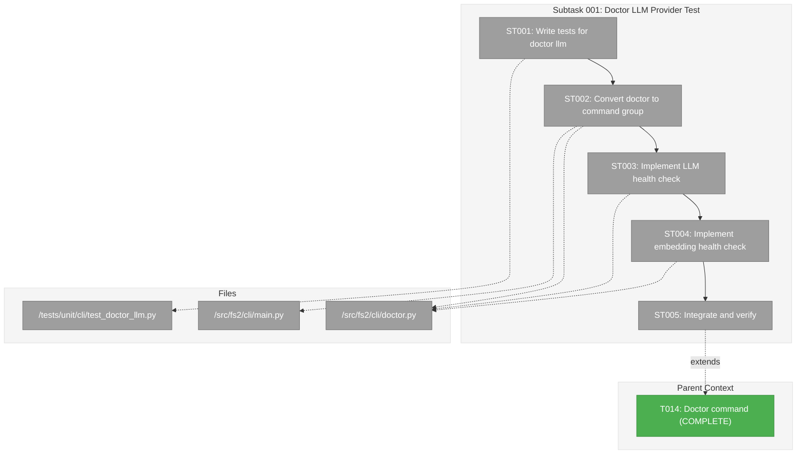
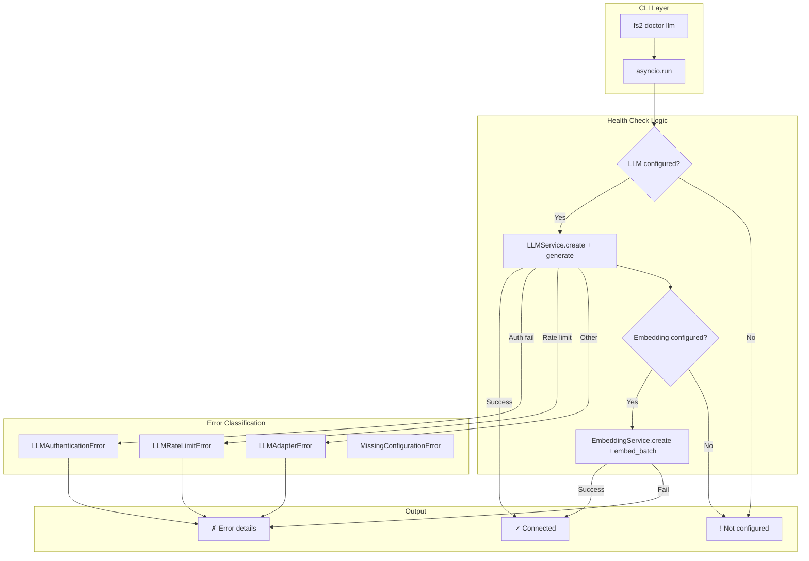
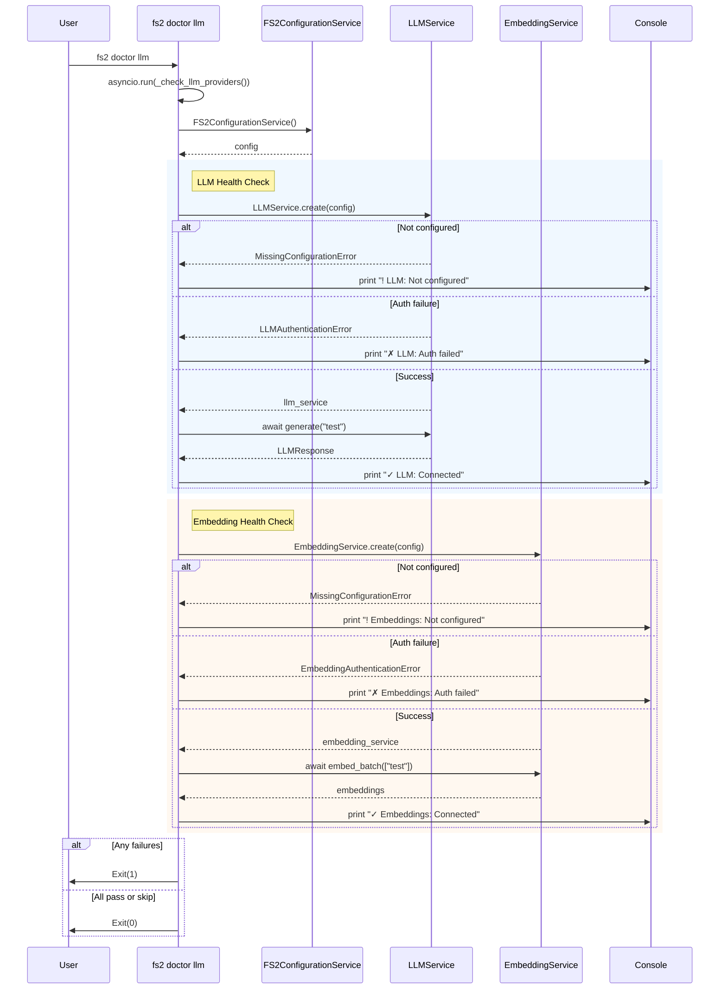

# Subtask 001: fs2 doctor llm Subcommand for Provider Connectivity Testing

**Parent Plan:** [../../doctor-plan.md](../../doctor-plan.md)
**Parent Phase:** Phase 1: Implementation
**Parent Task(s):** [T014: Implement doctor() command and register in main.py](./tasks.md#task-t014)
**Plan Task Reference:** [Task T014 in Plan](../../doctor-plan.md#implementation-single-phase)

**Why This Subtask:**
The original doctor command validates configuration *structure* but not *connectivity*. Users need a way to verify their LLM and embedding credentials actually work before running expensive `fs2 scan --embed` operations. This subtask adds `fs2 doctor llm` to test providers with actual API calls.

**Created:** 2026-01-03
**Requested By:** Development Team

---

## Executive Briefing

### Purpose
This subtask adds a new `fs2 doctor llm` subcommand that validates LLM and embedding configurations by making **actual API calls** to verify credentials work, providers are reachable, and services can generate content/embeddings. This provides a pre-flight check before committing to long scan operations.

### What We're Building
A Typer command group that extends `fs2 doctor` with:
- `fs2 doctor` - existing config validation (unchanged)
- `fs2 doctor llm` - NEW: tests LLM and embedding providers with real API calls
  - Instantiates `LLMService.create(config)` and `EmbeddingService.create(config)`
  - Makes health check calls with substantial prompts to ensure valid responses:
    - LLM: `"This is a health check from fs2. Please respond with exactly: HEALTH_CHECK_OK"`
    - Embedding: `"fs2 health check: This text is used to verify embedding generation is working correctly."`
  - Reports success/failure with provider names and detailed error messages
  - Distinguishes auth failures, rate limits, and connectivity issues

### Unblocks
- Users can validate credentials before running `fs2 scan --embed` (avoids failed scans)
- Provides pre-flight check for CI/CD pipelines
- Surfaces actionable error messages from provider SDKs

### Example

**Success output:**
```
$ fs2 doctor llm

🔌 LLM Provider Test
  ✓ LLM (azure): Connected
    Response: HEALTH_CHECK_OK
    Tokens used: 12

🔌 Embedding Provider Test
  ✓ Embeddings (azure): Connected
    Dimensions: 1024
```

**Authentication failure:**
```
$ fs2 doctor llm

🔌 LLM Provider Test
  ✗ LLM: Authentication failed
    Authentication failed. Check your API key.

🔌 Embedding Provider Test
  ✗ Embeddings: Authentication failed
    Authentication failed. Check your Azure embedding API key.
```

**Not configured:**
```
$ fs2 doctor llm

🔌 LLM Provider Test
  ! LLM: Not configured (skipped)

🔌 Embedding Provider Test
  ! Embeddings: Not configured (skipped)
```

---

## Objectives & Scope

### Objective
Add `fs2 doctor llm` subcommand that tests LLM and embedding providers with actual API calls, providing pre-flight validation before expensive scan operations.

### Goals

- ✅ Convert doctor to Typer command group (supports subcommands)
- ✅ Implement `fs2 doctor llm` async health check
- ✅ Test LLM connectivity via `LLMService.create()` + `generate()`
- ✅ Test embedding connectivity via `EmbeddingService.create()` + `embed_batch()`
- ✅ Catch and report specific error types (auth, rate limit, connectivity)
- ✅ Handle "not configured" gracefully (skip with warning)
- ✅ Exit code 0 if all configured services pass, 1 if any failure

### Non-Goals

- ❌ Modify existing `fs2 doctor` behavior (preserves backward compatibility)
- ❌ Test all possible API operations (minimal test call only)
- ❌ Performance benchmarking of providers
- ❌ Interactive credential prompting
- ❌ Caching or retrying failed connections

---

## Architecture Map

### Component Diagram
<!-- Status: grey=pending, orange=in-progress, green=completed, red=blocked -->
<!-- Updated by plan-6 during implementation -->



### Task-to-Component Mapping

<!-- Status: ⬜ Pending | 🟧 In Progress | ✅ Complete | 🔴 Blocked -->

| Task | Component(s) | Files | Status | Comment |
|------|-------------|-------|--------|---------|
| ST001 | Test Suite | /workspaces/flow_squared/tests/unit/cli/test_doctor_llm.py | ⬜ Pending | Write tests for new subcommand (TDD) |
| ST002 | CLI Refactor | /workspaces/flow_squared/src/fs2/cli/doctor.py, main.py | ⬜ Pending | Convert to Typer command group |
| ST003 | LLM Health | /workspaces/flow_squared/src/fs2/cli/doctor.py | ⬜ Pending | LLMService.create() + generate() test |
| ST004 | Embedding Health | /workspaces/flow_squared/src/fs2/cli/doctor.py | ⬜ Pending | EmbeddingService.create() + embed_batch() test |
| ST005 | Integration | -- | ⬜ Pending | End-to-end verification |

---

## Tasks

| Status | ID | Task | CS | Type | Dependencies | Absolute Path(s) | Validation | Subtasks | Notes |
|--------|-----|------|----|------|--------------|------------------|------------|----------|-------|
| [ ] | ST001 | Write tests for `fs2 doctor llm` subcommand | 2 | Test | -- | /workspaces/flow_squared/tests/unit/cli/test_doctor_llm.py | Tests cover: success, auth failure, not configured, rate limit; uses FakeLLMAdapter/FakeEmbeddingAdapter | -- | TDD first; follow test_doctor.py patterns |
| [ ] | ST002 | Convert doctor to Typer command group with default callback | 2 | Core | ST001 | /workspaces/flow_squared/src/fs2/cli/doctor.py, /workspaces/flow_squared/src/fs2/cli/main.py | `fs2 doctor` still works (backward compatible); `fs2 doctor llm` now available | -- | Use `doctor_app = typer.Typer()` with `@doctor_app.callback(invoke_without_command=True)` |
| [ ] | ST003 | Implement LLM provider health check | 2 | Core | ST002 | /workspaces/flow_squared/src/fs2/cli/doctor.py | `LLMService.create()` + `generate(HEALTH_CHECK_PROMPT)` works; catches LLMAuthenticationError, LLMRateLimitError, LLMAdapterError | -- | Use asyncio.run(); catch MissingConfigurationError for "not configured"; use substantial prompt to ensure valid response |
| [ ] | ST004 | Implement embedding provider health check | 2 | Core | ST003 | /workspaces/flow_squared/src/fs2/cli/doctor.py | `EmbeddingService.create()` + `embed_batch([HEALTH_CHECK_TEXT])` works; catches EmbeddingAuthenticationError | -- | Report dimensions on success; use meaningful text for embedding |
| [ ] | ST005 | Integrate and verify end-to-end | 1 | Test | ST004 | -- | All tests pass; `fs2 doctor llm` runs in real environment; exit codes correct | -- | Manual verification with actual Azure/OpenAI creds |

---

## Alignment Brief

### Objective Recap

This subtask extends T014 (doctor command) by adding `fs2 doctor llm` subcommand that performs actual API connectivity testing. The original doctor validates config *structure*; this validates config *works*.

### Critical Findings Affecting This Subtask

| Finding | Constraint/Requirement | Addressed By |
|---------|------------------------|--------------|
| **PL-09**: Async-first LLM design | All LLM/embedding calls are async; wrap with `asyncio.run()` in CLI | ST003, ST004 |
| **PL-10**: Pass ConfigurationService, not extracted config | Use `LLMService.create(config)` factory pattern | ST003, ST004 |
| **PL-13**: Azure content filter handling | Check `response.was_filtered` flag; don't treat as failure | ST003 |
| **DC-04**: Exception hierarchy | Catch `LLMAuthenticationError`, `EmbeddingAuthenticationError` separately for actionable messages | ST003, ST004 |
| **QT-06**: Actionable error messages | Exceptions already contain recovery instructions; surface them directly | ST003, ST004 |

### Invariants & Guardrails

- **Backward Compatibility**: `fs2 doctor` (without subcommand) MUST continue to work exactly as before
- **Exit Codes**: 0 = all configured services pass, 1 = any failure or auth error
- **Not Configured**: When a service is not configured (MissingConfigurationError), show yellow warning and skip (not failure)
- **Security**: Only show truncated response preview; don't log full prompts/responses

### Health Check Constants

```python
# Substantial prompts to ensure valid LLM responses (too-minimal prompts may return empty)
LLM_HEALTH_CHECK_PROMPT = "This is a health check from fs2. Please respond with exactly: HEALTH_CHECK_OK"

# Meaningful text for embedding (ensures embedding model processes real content)
EMBEDDING_HEALTH_CHECK_TEXT = "fs2 health check: This text is used to verify embedding generation is working correctly."
```

### Inputs to Read

| File | Purpose |
|------|---------|
| `/workspaces/flow_squared/src/fs2/core/services/llm_service.py` | LLMService.create() factory pattern |
| `/workspaces/flow_squared/src/fs2/core/services/embedding/embedding_service.py` | EmbeddingService.create() factory |
| `/workspaces/flow_squared/src/fs2/core/adapters/exceptions.py` | Exception hierarchy for error handling |
| `/workspaces/flow_squared/src/fs2/config/exceptions.py` | MissingConfigurationError for "not configured" |
| `/workspaces/flow_squared/tests/unit/cli/test_doctor.py` | Test patterns to follow |

### Visual Alignment Aids

#### System Flow Diagram



#### Sequence Diagram



### Test Plan

**Testing Approach**: Full TDD - write tests first, then implementation
**Mock Usage**: Avoid mocks - use `FakeLLMAdapter` and `FakeEmbeddingAdapter` fakes

| Test Case | Fixture | Expected Result |
|-----------|---------|-----------------|
| `test_doctor_llm_success` | FakeLLMAdapter with response, FakeEmbeddingAdapter | Exit 0, shows "✓ Connected" for both |
| `test_doctor_llm_auth_failure` | FakeLLMAdapter raises LLMAuthenticationError | Exit 1, shows "✗ Auth failed" |
| `test_doctor_llm_not_configured` | No LLMConfig registered | Exit 0, shows "! Not configured" |
| `test_doctor_llm_rate_limit` | FakeLLMAdapter raises LLMRateLimitError | Exit 1, shows "✗ Rate limit exceeded" |
| `test_doctor_llm_embedding_auth_failure` | FakeEmbeddingAdapter raises EmbeddingAuthenticationError | Exit 1, shows embedding auth failed |
| `test_doctor_without_subcommand` | N/A | Exit 0, runs existing doctor behavior (backward compat) |

### Commands to Run

```bash
# Environment setup
cd /workspaces/flow_squared
uv sync

# Run new test file
UV_CACHE_DIR=.uv_cache uv run pytest tests/unit/cli/test_doctor_llm.py -v

# Run all doctor tests
UV_CACHE_DIR=.uv_cache uv run pytest tests/unit/cli/test_doctor*.py -v

# Lint check
uv run ruff check src/fs2/cli/doctor.py

# Manual test (requires configured LLM/embedding)
uv run python -m fs2.cli.main doctor llm

# Verify backward compatibility
uv run python -m fs2.cli.main doctor
```

### Risks & Unknowns

| Risk | Severity | Mitigation |
|------|----------|------------|
| API call costs money | Low | Use minimal "test" prompt; single token response expected |
| Rate limits during testing | Low | Use FakeLLMAdapter in tests; manual testing is rare |
| Breaking `fs2 doctor` backward compat | High | Test `invoke_without_command=True` callback pattern carefully |
| Async complexity in CLI | Medium | Follow existing async patterns in scan.py |

### Ready Check

- [x] Tasks have absolute paths
- [x] Critical findings mapped to tasks
- [x] Test plan defined (Full TDD)
- [x] Mock usage policy defined (use fakes, not mocks)
- [x] Visual diagrams show system flow
- [x] Commands ready to copy/paste
- [x] Risks identified with mitigations
- [ ] **AWAITING GO/NO-GO**

---

## Phase Footnote Stubs

_Populated during implementation by plan-6. Footnotes will be added here and linked to plan § 12._

| Footnote | FlowSpace Node ID | Description |
|----------|-------------------|-------------|
| | | |

---

## Evidence Artifacts

| Artifact | Location | Purpose |
|----------|----------|---------|
| Execution Log | `./001-subtask-doctor-llm-provider-test.execution.log.md` | Detailed implementation narrative |
| Test Results | pytest output | Validation of health check behavior |

---

## Discoveries & Learnings

_Populated during implementation by plan-6. Log anything of interest to your future self._

| Date | Task | Type | Discovery | Resolution | References |
|------|------|------|-----------|------------|------------|
| | | | | | |

**Types**: `gotcha` | `research-needed` | `unexpected-behavior` | `workaround` | `decision` | `debt` | `insight`

**What to log**:
- Things that didn't work as expected
- External research that was required
- Implementation troubles and how they were resolved
- Gotchas and edge cases discovered
- Decisions made during implementation
- Technical debt introduced (and why)
- Insights that future phases should know about

_See also: `execution.log.md` for detailed narrative._

---

## After Subtask Completion

**This subtask resolves a blocker for:**
- Parent Task: [T014: Implement doctor() command](./tasks.md#task-t014)
- Plan Task: [T014 in Plan](../../doctor-plan.md#implementation-single-phase)

**When all ST### tasks complete:**

1. **Record completion** in parent execution log:
   ```
   ### Subtask 001-subtask-doctor-llm-provider-test Complete

   Resolved: Added `fs2 doctor llm` subcommand for LLM/embedding provider connectivity testing
   See detailed log: [subtask execution log](./001-subtask-doctor-llm-provider-test.execution.log.md)
   ```

2. **Update parent task** (if it was blocked):
   - This subtask extends T014, not blocks it
   - No status change needed (T014 already complete)

3. **Resume parent phase work:**
   ```bash
   /plan-6-implement-phase --phase "Phase 1: Implementation" \
     --plan "/workspaces/flow_squared/docs/plans/017-doctor/doctor-plan.md"
   ```
   (Note: NO `--subtask` flag to resume main phase)

**Quick Links:**
- 📋 [Parent Dossier](./tasks.md)
- 📄 [Parent Plan](../../doctor-plan.md)
- 📊 [Parent Execution Log](./execution.log.md)

---

## Directory Layout

```
docs/plans/017-doctor/
├── doctor-spec.md
├── doctor-plan.md
├── research-dossier.md
└── tasks/
    └── phase-1-implementation/
        ├── tasks.md
        ├── execution.log.md
        ├── 001-subtask-doctor-llm-provider-test.md           # This file
        └── 001-subtask-doctor-llm-provider-test.execution.log.md  # Created by plan-6
```

---

**STOP**: Awaiting **GO/NO-GO** before implementation begins.

**Next step**: `/plan-6-implement-phase --subtask 001-subtask-doctor-llm-provider-test --plan "/workspaces/flow_squared/docs/plans/017-doctor/doctor-plan.md"`
