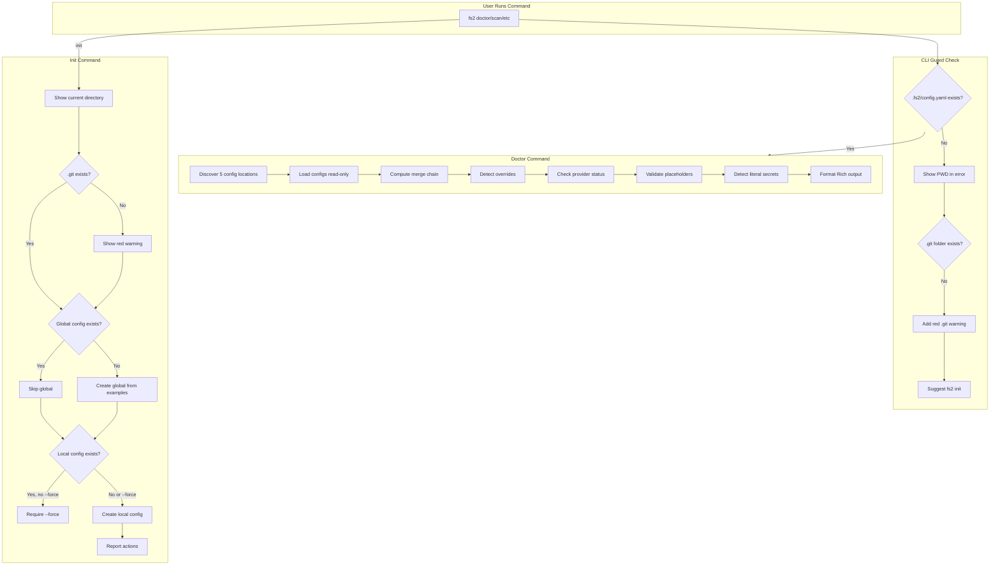
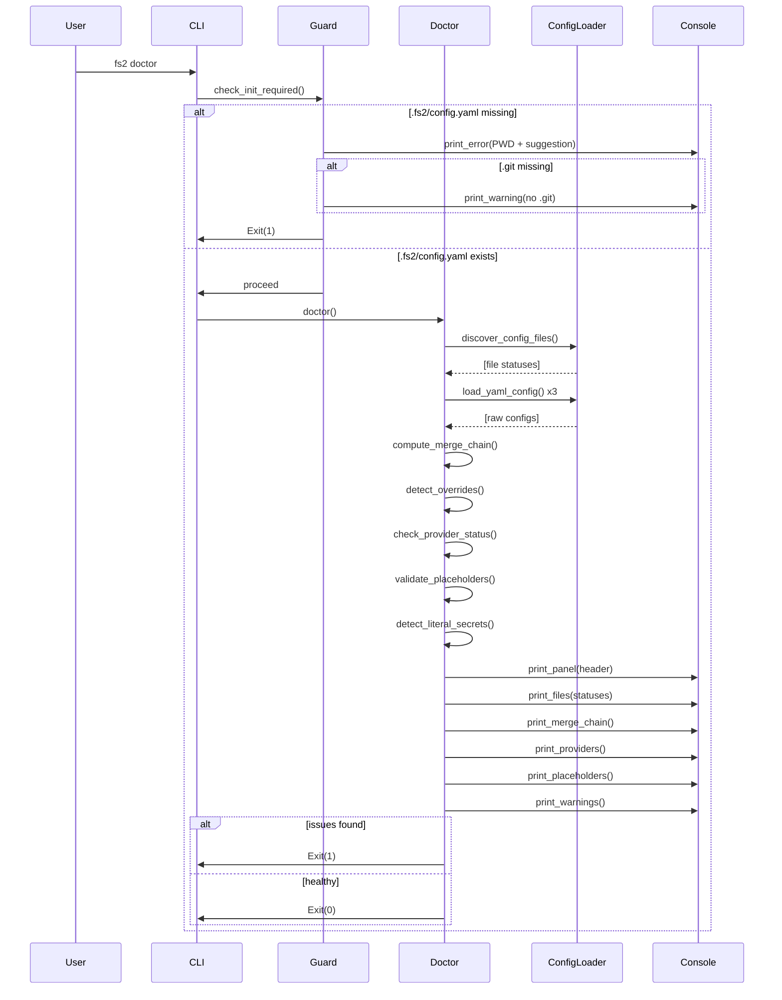

# Phase 1: Implementation – Tasks & Alignment Brief

**Spec**: [../../doctor-spec.md](../../doctor-spec.md)
**Plan**: [../../doctor-plan.md](../../doctor-plan.md)
**Date**: 2026-01-02

---

## Executive Briefing

### Purpose
This phase implements `fs2 doctor`, a diagnostic command that gives users complete visibility into their configuration state. It also enhances `fs2 init` to bootstrap both local and global configs automatically, and adds CLI guards to prevent accidental operations in uninitialized directories.

### What We're Building

1. **`fs2 doctor` command** - A Rich-formatted diagnostic display showing:
   - All 5 config file locations (found/not found)
   - Merge chain with source attribution and override warnings
   - LLM and embedding provider status with GitHub documentation links
   - Placeholder resolution status (`${VAR}` → resolved/unresolved)
   - Literal secret detection warnings

2. **Enhanced `fs2 init`** - Single command that:
   - Creates local `./.fs2/config.yaml`
   - Creates global `~/.config/fs2/` with example configs (if not exists)
   - Displays current working directory
   - Warns (big red) if no `.git` folder present

3. **CLI Guard** - Fail-fast protection for commands (`scan`, `search`, `tree`, `get-node`, `mcp`) that:
   - Requires `.fs2/config.yaml` to exist before running
   - Shows PWD and `.git` warning in error message
   - Prevents accidental `.fs2/` directory creation

### User Value
Users can quickly diagnose why fs2 isn't working, understand the config precedence chain, and get direct links to setup documentation. The guard prevents the frustrating experience of accidentally scanning the wrong directory.

### Example

**`fs2 doctor` output:**
```
╭─ fs2 Configuration Health Check ─────────────────────────────────────────────╮
│  Current Directory: /home/user/my-project                                     │
╰───────────────────────────────────────────────────────────────────────────────╯

📁 Configuration Files:
  ✓ ~/.config/fs2/config.yaml
  ✓ ~/.config/fs2/secrets.env
  ✓ ./.fs2/config.yaml
  ✗ ./.fs2/secrets.env (not found)
  ✓ ./.env

🔌 Provider Status:
  ✓ LLM: azure (configured)
  ✗ Embeddings: NOT CONFIGURED
    → https://github.com/AI-Substrate/flow_squared/blob/main/docs/how/embeddings/2-configuration.md

🔐 Secrets & Placeholders:
  ✓ ${AZURE_OPENAI_API_KEY} → resolved
  ✗ ${AZURE_EMBEDDING_API_KEY} → NOT FOUND
```

**CLI Guard error:**
```
$ fs2 scan

❌ Error: fs2 not initialized in this directory

   Current directory: /home/user/wrong-folder

   ⚠️  WARNING: No .git folder found!
       Are you sure this is a project root?

   Run 'fs2 init' to initialize fs2 in this directory.
```

---

## Objectives & Scope

### Objective
Implement the `fs2 doctor` diagnostic command with full config validation, enhance `fs2 init` for unified local+global setup, and add CLI guards to prevent operations in uninitialized directories. Satisfies all 38 acceptance criteria from the spec.

### Goals

- ✅ Create `fs2 doctor` command with Rich output (AC-01 through AC-13)
- ✅ Show all 5 config file locations with status
- ✅ Display merge chain with override warnings
- ✅ Detect LLM/embedding provider configuration status
- ✅ Validate placeholder resolution
- ✅ Detect literal secrets in config files
- ✅ **Full config validation** with actionable errors (AC-32 through AC-38):
  - YAML syntax validation with line numbers
  - Pydantic schema validation with field paths
  - Provider-specific required fields validation
  - Links to configuration-guide.md for fixes
  - Distinguish "not configured" vs "misconfigured"
- ✅ Enhance `fs2 init` to create both local and global configs (AC-14 through AC-22)
- ✅ Add CLI guard for protected commands (AC-23 through AC-28)
- ✅ Create example config templates (AC-29, AC-30, AC-31)

### Non-Goals

- ❌ `--format json` output for CI (deferred per spec Q1)
- ❌ Config editing/modification (doctor is read-only diagnostic)
- ❌ Auto-fix configuration issues (only reports and suggests)
- ❌ API connectivity testing (only checks config structure)
- ❌ Interactive configuration wizard (separate feature)
- ❌ Performance profiling of config loading

---

## Architecture Map

### Component Diagram

```mermaid
flowchart TD
    classDef pending fill:#9E9E9E,stroke:#757575,color:#fff
    classDef inprogress fill:#FF9800,stroke:#F57C00,color:#fff
    classDef completed fill:#4CAF50,stroke:#388E3C,color:#fff
    classDef blocked fill:#F44336,stroke:#D32F2F,color:#fff

    subgraph Setup["Setup"]
        T001["T001: Example templates"]:::pending
    end

    subgraph DoctorTests["Doctor Tests"]
        T002["T002: Config discovery tests"]:::pending
        T003["T003: Merge chain tests"]:::pending
        T004["T004: Provider status tests"]:::pending
        T005["T005: Placeholder tests"]:::pending
        T006["T006: Secret detection tests"]:::pending
        T007["T007: Edge case tests"]:::pending
    end

    subgraph DoctorCore["Doctor Core"]
        T008["T008: Config inspection helpers"]:::pending
        T009["T009: Merge chain computation"]:::pending
        T010["T010: Provider detection"]:::pending
        T011["T011: Placeholder validation"]:::pending
        T012["T012: Secret detection"]:::pending
        T013["T013: Rich output formatting"]:::pending
        T014["T014: Doctor command"]:::pending
    end

    subgraph InitEnhancement["Init Enhancement"]
        T015["T015: Init tests"]:::pending
        T016["T016: Init implementation"]:::pending
    end

    subgraph CLIGuard["CLI Guard"]
        T017["T017: Guard tests"]:::pending
        T018["T018: Guard implementation"]:::pending
        T019["T019: Apply to commands"]:::pending
    end

    subgraph Docs["Documentation"]
        T020["T020: README update"]:::pending
    end

    subgraph ConfigValidation["Config Validation"]
        T022["T022: YAML syntax tests"]:::pending
        T023["T023: Pydantic schema tests"]:::pending
        T024["T024: Provider validation tests"]:::pending
        T025["T025: Validation helpers"]:::pending
        T026["T026: Provider validation impl"]:::pending
    end

    subgraph Validation["Validation"]
        T021["T021: Full test suite"]:::pending
    end

    T001 --> T002
    T002 --> T003 & T004 & T005 & T006 & T007
    T003 & T004 & T005 & T006 & T007 --> T008
    T008 --> T009 & T010 & T011 & T012
    T009 & T010 & T011 & T012 --> T013
    T013 --> T014
    T001 --> T015
    T015 --> T016
    T001 --> T017
    T017 --> T018
    T018 --> T019
    T014 --> T020
    T002 --> T022 & T023 & T024
    T022 & T023 & T024 --> T025
    T025 --> T026
    T014 & T016 & T019 & T026 --> T021

    subgraph Files["Key Files"]
        F1["/src/fs2/docs/*.example"]:::pending
        F2["/tests/unit/cli/test_doctor.py"]:::pending
        F3["/src/fs2/cli/doctor.py"]:::pending
        F4["/tests/unit/cli/test_init.py"]:::pending
        F5["/src/fs2/cli/init.py"]:::pending
        F6["/tests/unit/cli/test_cli_guard.py"]:::pending
        F7["/src/fs2/cli/guard.py"]:::pending
        F8["/src/fs2/cli/main.py"]:::pending
    end

    T001 -.-> F1
    T002 & T003 & T004 & T005 & T006 & T007 -.-> F2
    T008 & T009 & T010 & T011 & T012 & T013 & T014 -.-> F3
    T015 -.-> F4
    T016 -.-> F5
    T017 -.-> F6
    T018 -.-> F7
    T014 & T018 & T019 -.-> F8
```

<!-- Status: grey=pending, orange=in-progress, green=completed, red=blocked -->
<!-- Updated by plan-6 during implementation -->



### Task-to-Component Mapping

<!-- Status: ⬜ Pending | 🟧 In Progress | ✅ Complete | 🔴 Blocked -->

| Task | Component(s) | Files | Status | Comment |
|------|-------------|-------|--------|---------|
| T001 | Example Templates | src/fs2/docs/ | ⬜ Pending | Create config.yaml.example, secrets.env.example (NOT registered in registry) |
| T002 | Doctor Tests | tests/unit/cli/test_doctor.py | ⬜ Pending | Config file discovery tests (5 locations) |
| T003 | Doctor Tests | tests/unit/cli/test_doctor.py | ⬜ Pending | Merge chain and override detection tests |
| T004 | Doctor Tests | tests/unit/cli/test_doctor.py | ⬜ Pending | LLM/embedding provider status tests |
| T005 | Doctor Tests | tests/unit/cli/test_doctor.py | ⬜ Pending | Placeholder validation tests |
| T006 | Doctor Tests | tests/unit/cli/test_doctor.py | ⬜ Pending | Literal secret detection tests |
| T007 | Doctor Tests | tests/unit/cli/test_doctor.py | ⬜ Pending | Edge cases (no config, central-only) |
| T008 | Doctor Core | src/fs2/cli/doctor.py | ⬜ Pending | Read-only config inspection helpers |
| T009 | Doctor Core | src/fs2/cli/doctor.py | ⬜ Pending | Merge chain with source attribution |
| T010 | Doctor Core | src/fs2/cli/doctor.py | ⬜ Pending | Provider status detection |
| T011 | Doctor Core | src/fs2/cli/doctor.py | ⬜ Pending | Placeholder validation |
| T012 | Doctor Core | src/fs2/cli/doctor.py | ⬜ Pending | Literal secret detection |
| T013 | Doctor Core | src/fs2/cli/doctor.py | ⬜ Pending | Rich output formatting |
| T014 | Doctor Core | src/fs2/cli/doctor.py, main.py | ⬜ Pending | Doctor command registration |
| T015 | Init Tests | tests/unit/cli/test_init.py | ⬜ Pending | Enhanced init tests (local+global) |
| T016 | Init Core | src/fs2/cli/init.py | ⬜ Pending | Enhanced init implementation |
| T017 | Guard Tests | tests/unit/cli/test_cli_guard.py | ⬜ Pending | CLI guard tests |
| T018 | Guard Core | src/fs2/cli/guard.py, main.py | ⬜ Pending | CLI guard implementation |
| T019 | Guard Application | scan.py, search.py, tree.py, get_node.py, mcp.py | ⬜ Pending | Apply guard to protected commands |
| T020 | Documentation | README.md | ⬜ Pending | Document doctor command |
| T021 | Validation | -- | ⬜ Pending | Full test suite verification |
| T022 | Validation Tests | tests/unit/cli/test_doctor.py | ⬜ Pending | YAML syntax validation tests |
| T023 | Validation Tests | tests/unit/cli/test_doctor.py | ⬜ Pending | Pydantic schema validation tests |
| T024 | Validation Tests | tests/unit/cli/test_doctor.py | ⬜ Pending | Provider-specific validation tests |
| T025 | Validation Core | src/fs2/cli/doctor.py | ⬜ Pending | Config validation helpers |
| T026 | Validation Core | src/fs2/cli/doctor.py | ⬜ Pending | Provider validation with doc links |

---

## Tasks

| Status | ID | Task | CS | Type | Dependencies | Absolute Path(s) | Validation | Subtasks | Notes |
|--------|-----|------|----|------|--------------|------------------|------------|----------|-------|
| [ ] | T001 | Create example config templates in src/fs2/docs/ | 2 | Setup | -- | /workspaces/flow_squared/src/fs2/docs/config.yaml.example, /workspaces/flow_squared/src/fs2/docs/secrets.env.example | Files exist with documented LLM/embedding sections; AC-29, AC-30, AC-31 | -- | Do NOT register in registry.yaml (templates, not docs); access via importlib.resources.files("fs2.docs") |
| [ ] | T002 | Write tests for config file discovery (all 5 locations) | 2 | Test | T001 | /workspaces/flow_squared/tests/unit/cli/test_doctor.py | Tests cover: user/project YAML, user/project secrets.env, .env; missing file handling; AC-02 | -- | Use tmp_path fixtures |
| [ ] | T003 | Write tests for merge chain computation and override detection | 2 | Test | T002 | /workspaces/flow_squared/tests/unit/cli/test_doctor.py | Tests cover: multi-layer merge, leaf-level overrides, source attribution; AC-03, AC-04 | -- | Test R1-04 edge cases |
| [ ] | T004 | Write tests for provider status detection (LLM/embedding) | 2 | Test | T002 | /workspaces/flow_squared/tests/unit/cli/test_doctor.py | Tests cover: configured/not configured, required fields per provider; AC-05, AC-06, AC-07 | -- | Include GitHub URL generation |
| [ ] | T005 | Write tests for placeholder validation | 2 | Test | T002 | /workspaces/flow_squared/tests/unit/cli/test_doctor.py | Tests cover: ${VAR} detection, resolved/unresolved status; AC-08 | -- | Test R1-03 scope |
| [ ] | T006 | Write tests for literal secret detection | 2 | Test | T002 | /workspaces/flow_squared/tests/unit/cli/test_doctor.py | Tests cover: sk-* prefix, >64 char strings in secret fields; AC-13 | -- | Never expose actual values (R1-06) |
| [ ] | T007 | Write tests for edge cases (no config, central-only, warnings) | 2 | Test | T002 | /workspaces/flow_squared/tests/unit/cli/test_doctor.py | Tests cover: no configs → suggest init, central exists but no local .fs2; AC-09, AC-10 | -- | Test exit codes 0 vs 1 |
| [ ] | T008 | Implement config inspection helpers (read-only) | 2 | Core | T002-T007 | /workspaces/flow_squared/src/fs2/cli/doctor.py | Helpers read configs without side effects; use dotenv_values() not load_secrets_to_env() | -- | Per R1-01 mitigation |
| [ ] | T009 | Implement merge chain computation with source attribution | 3 | Core | T008 | /workspaces/flow_squared/src/fs2/cli/doctor.py | Can identify which source each value came from; override detection works | -- | Per R1-04 mitigation |
| [ ] | T010 | Implement provider status detection | 2 | Core | T008 | /workspaces/flow_squared/src/fs2/cli/doctor.py | Detects LLM/embedding config with required field status | -- | Per R1-08 - show requirements |
| [ ] | T011 | Implement placeholder validation | 2 | Core | T008 | /workspaces/flow_squared/src/fs2/cli/doctor.py | Finds all ${VAR} placeholders, checks os.environ resolution | -- | Regex pattern from I1-05 |
| [ ] | T012 | Implement literal secret detection | 2 | Core | T008 | /workspaces/flow_squared/src/fs2/cli/doctor.py | Detects sk-* and >64 char strings; never prints values | -- | Per R1-06 - field name only |
| [ ] | T013 | Implement Rich output formatting | 2 | Core | T008-T012 | /workspaces/flow_squared/src/fs2/cli/doctor.py | Uses ConsoleAdapter; panels, tables, colored indicators; AC-11 | -- | Match mockup from spec |
| [ ] | T014 | Implement doctor() command and register in main.py | 2 | Core | T013 | /workspaces/flow_squared/src/fs2/cli/doctor.py, /workspaces/flow_squared/src/fs2/cli/main.py | `fs2 doctor` runs and shows output; exit 0 healthy, 1 issues; AC-01, AC-12 | -- | Follow I1-01 CLI pattern |
| [ ] | T015 | Write tests for enhanced init (local + global) | 2 | Test | T001 | /workspaces/flow_squared/tests/unit/cli/test_init.py | Tests cover: creates both local and global, skips global if exists, shows cwd, warns if no .git, creates .gitignore; AC-14-22 | -- | No --global flag |
| [ ] | T016 | Implement enhanced init (local + global) | 2 | Core | T015, T001 | /workspaces/flow_squared/src/fs2/cli/init.py | Creates both configs; shows cwd; red warning if no .git; creates .fs2/.gitignore; AC-14-22 | -- | .gitignore ignores all except config.yaml; use .exists() for .git |
| [ ] | T017 | Write tests for CLI guard (require init) | 2 | Test | T001 | /workspaces/flow_squared/tests/unit/cli/test_cli_guard.py | Tests: scan/search/tree/mcp fail without .fs2/config.yaml; init/doctor/--help work; error shows PWD and .git warning; AC-23-28 | -- | Fail fast before mkdir |
| [ ] | T018 | Implement CLI guard as @require_init decorator | 2 | Core | T017 | /workspaces/flow_squared/src/fs2/cli/guard.py | @require_init decorator checks .fs2/config.yaml; fails with PWD + red .git warning; AC-23-28 | -- | Decorator approach (not callback) so --help works |
| [ ] | T019 | Apply CLI guard to scan, search, tree, get-node, mcp | 2 | Core | T018 | /workspaces/flow_squared/src/fs2/cli/scan.py, /workspaces/flow_squared/src/fs2/cli/search.py, /workspaces/flow_squared/src/fs2/cli/tree.py, /workspaces/flow_squared/src/fs2/cli/get_node.py, /workspaces/flow_squared/src/fs2/cli/mcp.py | Guard runs before mkdir; mkdir stays but only executes after guard passes | -- | Reorder, don't remove mkdir |
| [ ] | T020 | Update README.md with doctor command documentation | 1 | Docs | T014 | /workspaces/flow_squared/README.md | README lists `fs2 doctor` with brief description and example output | -- | Per Documentation Strategy |
| [ ] | T021 | Run full test suite and verify all ACs pass | 1 | Test | T001-T020, T022-T026 | -- | All 38 acceptance criteria verified; tests pass; no regressions | -- | Final validation |
| [ ] | T022 | Write tests for YAML syntax validation | 2 | Test | T002 | /workspaces/flow_squared/tests/unit/cli/test_doctor.py | Tests cover: malformed YAML, encoding issues, line number in error; AC-32, AC-33 | -- | Test with intentionally broken configs |
| [ ] | T023 | Write tests for pydantic schema validation | 2 | Test | T002 | /workspaces/flow_squared/tests/unit/cli/test_doctor.py | Tests cover: wrong types, missing required fields, field path in error; AC-34 | -- | Test FS2Settings validation errors |
| [ ] | T024 | Write tests for provider-specific validation | 2 | Test | T002 | /workspaces/flow_squared/tests/unit/cli/test_doctor.py | Tests cover: Azure needs endpoint+deployment+api_key, OpenAI needs api_key, etc; AC-35, AC-36, AC-38 | -- | Per-provider required fields |
| [ ] | T025 | Implement config validation helpers | 3 | Core | T022-T024 | /workspaces/flow_squared/src/fs2/cli/doctor.py | Load configs with actual loaders; catch YAML/pydantic errors; translate to actionable messages; AC-32, AC-33, AC-34 | -- | Use pydantic validation_error.errors() for field paths |
| [ ] | T026 | Implement provider-specific validation with doc links | 2 | Core | T025 | /workspaces/flow_squared/src/fs2/cli/doctor.py | Validate LLM/embedding required fields per provider; link to configuration-guide.md; AC-35, AC-36, AC-37, AC-38 | -- | Show "not configured" vs "misconfigured" |

---

## Alignment Brief

### Critical Findings Affecting This Phase

| Finding | Constraint/Requirement | Addressed By |
|---------|------------------------|--------------|
| **R1-01**: `load_secrets_to_env()` mutates global `os.environ` | Use `dotenv_values()` read-only; no side effects | T008 |
| **R1-06**: Secret detection could expose values in logs | Never print values; only field name and length | T006, T012 |
| **R1-03**: Placeholder resolution depends on current env state | Load secrets first before checking placeholders | T005, T011 |
| **I1-02**: Use raw loaders to avoid singleton pollution | Call `load_yaml_config()` directly | T008 |
| **R1-04**: Deep merge doesn't track source attribution | Load configs separately; compare values manually | T003, T009 |
| **R1-09**: `scan` creates `.fs2/` via `graph_path.parent.mkdir()` | Add CLI guard that fails fast BEFORE any mkdir | T017, T018, T019 |
| **NEW**: Config validation must be actionable | YAML errors show line; pydantic errors show field path; link to docs | T022-T026 |
| **NEW**: Distinguish "not configured" vs "misconfigured" | Different UX for missing vs invalid config sections | T024, T026 |

### Invariants & Guardrails

- **Security**: Never print actual secret values - only field names and lengths
- **Side Effects**: Doctor must be completely read-only; no config mutation
- **Exit Codes**: 0 = healthy, 1 = issues found
- **Terminal**: Graceful degradation for narrow terminals and non-TTY

### Inputs to Read

| File | Purpose |
|------|---------|
| `/workspaces/flow_squared/src/fs2/config/paths.py` | XDG path resolution functions |
| `/workspaces/flow_squared/src/fs2/config/loaders.py` | `load_yaml_config()`, `dotenv_values()` usage |
| `/workspaces/flow_squared/src/fs2/config/objects.py` | Config models and `YAML_CONFIG_TYPES` |
| `/workspaces/flow_squared/src/fs2/cli/init.py` | Current init implementation to enhance |
| `/workspaces/flow_squared/src/fs2/cli/scan.py` | CLI pattern to follow; guard application target |
| `/workspaces/flow_squared/src/fs2/core/adapters/console_adapter.py` | ConsoleAdapter ABC for Rich output |

### Visual Alignment Aids

#### System Flow Diagram



#### Sequence Diagram



### Test Plan

**Testing Approach**: Full TDD - write tests first, then implementation
**Mock Usage**: Avoid mocks entirely - use real fixtures, `tmp_path`, and `FakeConfigurationService`

| Test Suite | Tests | Fixtures | Purpose |
|------------|-------|----------|---------|
| `test_doctor.py::TestConfigDiscovery` | 5+ | tmp_path with config files | Verify all 5 locations detected correctly |
| `test_doctor.py::TestMergeChain` | 4+ | Multi-layer configs | Verify merge computation and override detection |
| `test_doctor.py::TestProviderStatus` | 4+ | Various provider configs | Verify LLM/embedding detection |
| `test_doctor.py::TestPlaceholders` | 3+ | Configs with ${VAR} | Verify resolution status |
| `test_doctor.py::TestSecretDetection` | 3+ | Configs with secrets | Verify sk-* and >64 char detection |
| `test_doctor.py::TestEdgeCases` | 3+ | Empty/missing configs | Verify suggestions and exit codes |
| `test_doctor.py::TestYAMLValidation` | 4+ | Malformed YAML configs | Verify YAML syntax errors with line numbers (AC-32, AC-33) |
| `test_doctor.py::TestPydanticValidation` | 4+ | Invalid typed configs | Verify schema errors with field paths (AC-34) |
| `test_doctor.py::TestProviderValidation` | 6+ | Incomplete provider configs | Verify per-provider required fields (AC-35, AC-36, AC-38) |
| `test_init.py::TestEnhancedInit` | 5+ | tmp_path, monkeypatch | Verify local+global creation, .git warning |
| `test_cli_guard.py::TestGuard` | 6+ | tmp_path, monkeypatch | Verify guard blocks uninitialized commands |

### Commands to Run

```bash
# Environment setup
cd /workspaces/flow_squared
uv sync

# Run specific test file
uv run pytest tests/unit/cli/test_doctor.py -v

# Run all CLI tests
uv run pytest tests/unit/cli/ -v

# Run with coverage
uv run pytest tests/unit/cli/ --cov=src/fs2/cli --cov-report=term-missing

# Lint check
uv run ruff check src/fs2/cli/doctor.py src/fs2/cli/guard.py

# Type check
uv run mypy src/fs2/cli/doctor.py src/fs2/cli/guard.py

# Manual test
uv run python -m fs2.cli.main doctor
uv run python -m fs2.cli.main init --help
```

### Risks & Unknowns

| Risk | Severity | Mitigation |
|------|----------|------------|
| Config loader side effects pollute tests | Medium | Use `dotenv_values()` instead of `load_secrets_to_env()` |
| Merge attribution complexity | Medium | Load configs separately; manual comparison |
| CLI guard breaks existing workflows | Low | Clear error message with PWD and suggestion |
| Rich output issues on narrow terminals | Low | Test with various widths; graceful degradation |

### Ready Check

- [x] Tasks have absolute paths
- [x] Critical findings mapped to tasks
- [x] Test plan defined (Full TDD)
- [x] Mock usage policy defined (avoid mocks)
- [x] Visual diagrams show system flow
- [x] Commands ready to copy/paste
- [x] Risks identified with mitigations
- [ ] **AWAITING GO/NO-GO**

---

## Evidence Artifacts

| Artifact | Location | Purpose |
|----------|----------|---------|
| Execution Log | `./execution.log.md` | Detailed implementation narrative |
| Test Results | CI output | Validation of all 29 ACs |
| Coverage Report | pytest output | Code coverage metrics |

---

## Discoveries & Learnings

_Populated during implementation by plan-6. Log anything of interest to your future self._

| Date | Task | Type | Discovery | Resolution | References |
|------|------|------|-----------|------------|------------|
| | | | | | |

**Types**: `gotcha` | `research-needed` | `unexpected-behavior` | `workaround` | `decision` | `debt` | `insight`

**What to log**:
- Things that didn't work as expected
- External research that was required
- Implementation troubles and how they were resolved
- Gotchas and edge cases discovered
- Decisions made during implementation
- Technical debt introduced (and why)
- Insights that future phases should know about

_See also: `execution.log.md` for detailed narrative._

---

## Directory Layout

```
docs/plans/017-doctor/
├── doctor-spec.md
├── doctor-plan.md
├── research-dossier.md
└── tasks/
    └── phase-1-implementation/
        ├── tasks.md              # This file
        └── execution.log.md      # Created by plan-6 during implementation
```

---

## Critical Insights Discussion

**Session**: 2026-01-02
**Context**: fs2 Doctor Command Implementation - Phase 1 Tasks
**Analyst**: AI Clarity Agent
**Reviewer**: Development Team
**Format**: Water Cooler Conversation (5 Critical Insights)

### Insight 1: Package Resource Access - Example Files Won't Be Found via uvx

**Did you know**: When users install fs2 via uvx, the `docs/examples/` directory won't exist at the filesystem path - package resources must use `importlib.resources`.

**Implications**:
- T001 originally pointed to `docs/examples/` which doesn't exist in installed packages
- Every uvx user (our primary audience) would hit FileNotFoundError
- Must follow mcp-doco plan pattern for package resources

**Options Considered**:
- Option A: Use importlib.resources with `src/fs2/docs/`
- Option B: Embed templates as Python strings
- Option C: Download from GitHub at runtime

**AI Recommendation**: Option A - Use importlib.resources
- Reasoning: Works everywhere (dev, pip, uvx); follows established mcp-doco pattern

**Decision**: Store templates in `src/fs2/docs/`, do NOT register in `registry.yaml` (templates are not documentation), access via `importlib.resources.files("fs2.docs")`

**Action Items**:
- [x] Updated T001 path to `src/fs2/docs/`
- [x] Updated AC-31 to clarify templates are NOT registered (they're templates, not docs)
- [x] Updated spec, plan, and tasks

**Affects**: T001, AC-29, AC-30, AC-31

---

### Insight 2: CLI Guard Could Break CI/CD Pipelines Using Env-Only Config

**Did you know**: The CLI guard checking for `.fs2/config.yaml` could break CI workflows that configure fs2 entirely through environment variables.

**Implications**:
- Current config system supports env vars as highest priority
- Strict guard would require config file even if env vars are set
- CI pipelines would need to run `fs2 init` first

**Options Considered**:
- Option A: Guard checks for config OR env vars
- Option B: Add `--no-init-check` flag
- Option C: Check for `.fs2/` directory only
- Option D: Strict guard with documented migration

**AI Recommendation**: Option D - Strict guard
- Reasoning: Explicit initialization is better; no CI workflows exist yet

**Decision**: Strict guard requiring `.fs2/config.yaml` - no CI to break

**Affects**: No changes needed - plan already implements strict guard

---

### Insight 3: Git Detection Will False-Positive on Git Worktrees and Submodules

**Did you know**: Checking `Path(".git").is_dir()` will show false warnings for git worktrees and submodules where `.git` is a file, not a directory.

**Implications**:
- In worktrees, `.git` is a file pointing to main repo
- In submodules, `.git` is a file with gitdir reference
- False warnings erode trust in the warning system

**Options Considered**:
- Option A/C: Check `.git` exists (file or directory) using `.exists()`
- Option B: Use `git rev-parse --git-dir` subprocess

**AI Recommendation**: Option A/C - Use `.exists()`
- Reasoning: Handles 99% of cases; no subprocess overhead

**Decision**: Use `Path(".git").exists()` instead of `.is_dir()`

**Action Items**:
- [x] Updated T016 notes
- [x] Updated T018 notes

**Affects**: T016, T018

---

### Insight 4: T019 Says "Remove graph_path.mkdir" But Scan Still Needs It

**Did you know**: T019's original note said "Remove graph_path.mkdir from scan" but scan legitimately needs to create the `.fs2/` directory for the graph file.

**Implications**:
- The mkdir isn't the problem - the order is
- Scan creates `.fs2/` before checking if config exists
- Fix is to ensure guard runs first, then mkdir

**Options Considered**:
- Option A: Reorder mkdir to after guard passes
- Option B: Guard creates .fs2/ implicitly

**AI Recommendation**: Option A - Reorder, don't remove
- Reasoning: mkdir stays in scan, just happens after guard passes

**Decision**: Guard runs first, mkdir stays but only executes after guard passes

**Action Items**:
- [x] Updated T019 validation and notes

**Affects**: T019

---

### Insight 5: Typer Callback Guard Will Block --help Unless Carefully Implemented

**Did you know**: If we implement the CLI guard as a Typer callback, it will run for ALL commands including `fs2 scan --help`, blocking help output.

**Implications**:
- `ctx.invoked_subcommand` would be "scan" for `fs2 scan --help`
- Guard would fail before help is shown
- AC-26 requires --help to always work

**Options Considered**:
- Option A: Callback with sys.argv check for --help
- Option B: @require_init decorator on protected commands

**AI Recommendation**: Option B - Decorator approach
- Reasoning: Decorator only runs when command executes, not during help parsing

**Decision**: Use `@require_init` decorator instead of callback

**Action Items**:
- [x] Updated T018 to specify decorator approach

**Affects**: T018

---

## Session Summary

**Insights Surfaced**: 5 critical insights identified and discussed
**Decisions Made**: 5 decisions reached through collaborative discussion
**Action Items Created**: 8 updates applied immediately
**Areas Updated**:
- spec: AC-28, AC-29, AC-30
- plan: T001, T018, T019
- tasks: T001, T016, T017, T018, T019

**Shared Understanding Achieved**: ✓

**Confidence Level**: High - Key risks identified and mitigated before implementation

**Next Steps**: Proceed to implementation with `/plan-6-implement-phase`

---

**STOP**: Awaiting **GO/NO-GO** before implementation begins.

**Next step**: `/plan-6-implement-phase --phase "Phase 1: Implementation" --plan "docs/plans/017-doctor/doctor-plan.md"`
