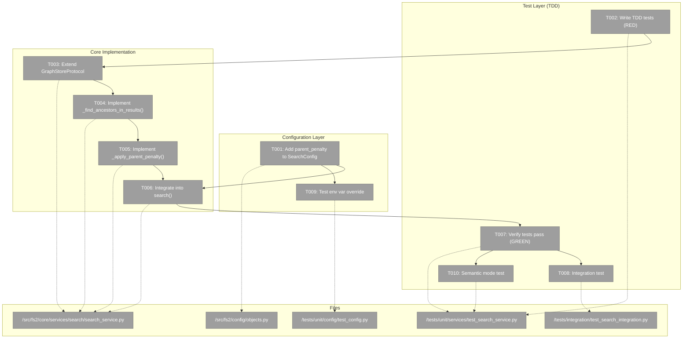
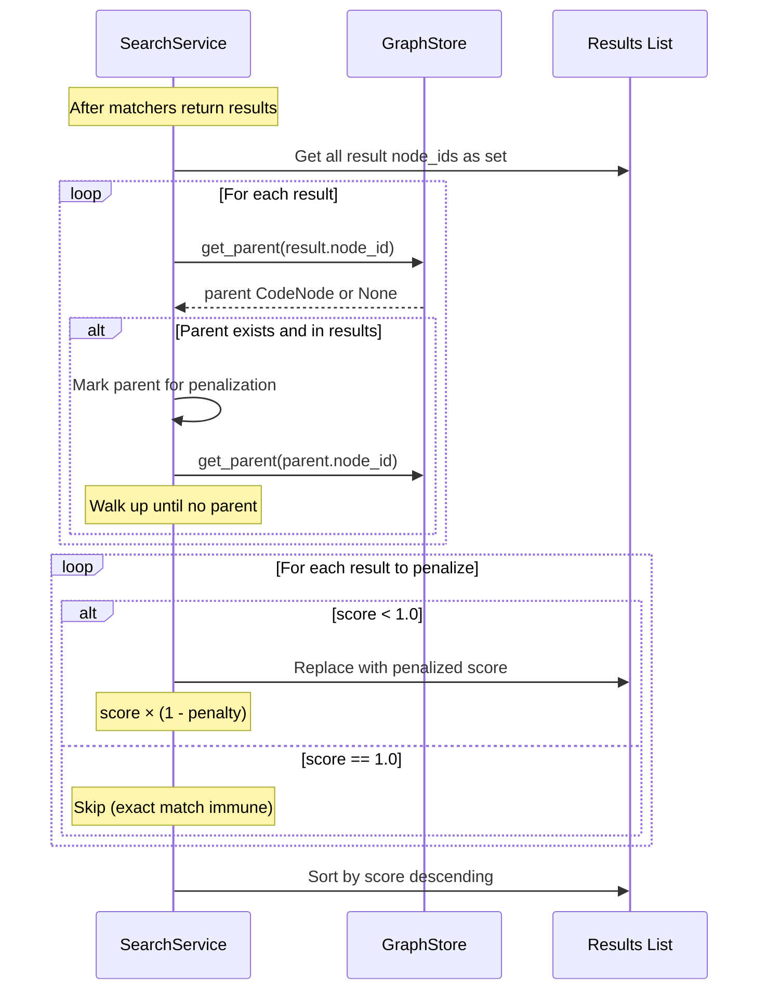

# Search Result Parent Penalization – Tasks & Alignment Brief

**Spec**: [search-trimming-spec.md](/workspaces/flow_squared/docs/plans/018-search-trimming/search-trimming-spec.md)
**Plan**: [search-trimming-plan.md](/workspaces/flow_squared/docs/plans/018-search-trimming/search-trimming-plan.md)
**Date**: 2026-01-03
**Mode**: Simple (inline tasks, single phase)

---

## Executive Briefing

### Purpose
This implementation adds hierarchy-aware score penalization to fs2 search results. When a search returns both a code element (method) and its containing parent elements (class, file), parent scores are automatically reduced so more specific child matches surface first.

### What We're Building
A parent penalization system in `SearchService.search()` that:
- Detects when parent nodes appear alongside their children in results
- Reduces parent scores by a configurable factor (default 0.25 = 75% retention)
- Preserves exact matches (score 1.0) from penalization
- Integrates seamlessly with existing text, regex, and semantic search modes

### User Value
Users searching for "authenticate" will see `AuthService.authenticate()` (the specific method) ranked above `AuthService` (the class) and `auth.py` (the file), even when all three match the query. This reduces result clutter and surfaces the most relevant, specific matches first.

### Example
**Search**: `"auth"` on codebase with file→class→method hierarchy

**Before penalization** (all match on content, score 0.5):
| Rank | Node | Score |
|------|------|-------|
| 1 | file:src/auth.py | 0.50 |
| 2 | class:src/auth.py:AuthService | 0.50 |
| 3 | callable:src/auth.py:AuthService.authenticate | 0.50 |

**After penalization** (0.25 penalty, depth-weighted per DYK-01):
| Rank | Node | Score | Calculation |
|------|------|-------|-------------|
| 1 | callable:src/auth.py:AuthService.authenticate | 0.50 | unchanged (leaf) |
| 2 | class:src/auth.py:AuthService | 0.375 | 0.50 × 0.75¹ |
| 3 | file:src/auth.py | 0.28125 | 0.50 × 0.75² |

---

## Objectives & Scope

### Objective
Implement hierarchy-aware score penalization per AC01-AC10 in the specification. The system must detect parent-child relationships in search results and reduce parent scores while preserving exact match immunity.

### Goals

- ✅ Add `parent_penalty` field to `SearchConfig` with default 0.25, validated [0.0, 1.0]
- ✅ Extend local `GraphStoreProtocol` in SearchService to include `get_parent()` signature
- ✅ Implement `_find_ancestors_in_results()` helper for hierarchy walking
- ✅ Implement `_apply_parent_penalty()` method with score=1.0 immunity
- ✅ Integrate penalization into `search()` after matchers, before sort (line ~203)
- ✅ Support env var override via `FS2_SEARCH__PARENT_PENALTY`
- ✅ Full TDD coverage with 3-level hierarchy fixtures
- ✅ Work across text, regex, and semantic search modes

### Non-Goals

- ❌ Complete parent removal from results (we penalize, not filter)
- ❌ Changing matcher scoring logic (penalization is post-processing only)
- ❌ Multi-level penalty scaling (no "grandparent penalized more than parent")
- ❌ Performance optimization (accept O(depth × results) cost; optimize later if needed)
- ❌ CLI `--parent-penalty` flag (config-only per clarification)
- ❌ MCP tool parameter for penalty (config-only per clarification)
- ❌ New relationship types (call graphs, inheritance are future work)

---

## Architecture Map

### Component Diagram
<!-- Status: grey=pending, orange=in-progress, green=completed, red=blocked -->
<!-- Updated by plan-6 during implementation -->



### Task-to-Component Mapping

<!-- Status: ⬜ Pending | 🟧 In Progress | ✅ Complete | 🔴 Blocked -->

| Task | Component(s) | Files | Status | Comment |
|------|-------------|-------|--------|---------|
| T001 | SearchConfig | objects.py | ⬜ Pending | Add parent_penalty field with 0.0-1.0 validation |
| T002 | Test Suite | test_search_service.py | ⬜ Pending | TDD: write failing tests first with 3-level hierarchy |
| T003 | GraphStoreProtocol | search_service.py | ⬜ Pending | Extend local Protocol with get_parent() signature |
| T004 | SearchService | search_service.py | ⬜ Pending | Ancestor walking helper using graph edges |
| T005 | SearchService | search_service.py | ⬜ Pending | Score penalization with immunity for score=1.0 |
| T006 | SearchService | search_service.py | ⬜ Pending | Wire penalization into search() pipeline |
| T007 | Test Verification | test_search_service.py | ⬜ Pending | All TDD tests must pass |
| T008 | Integration Test | test_search_integration.py | ⬜ Pending | Real graph hierarchy verification |
| T009 | Config Test | test_config.py | ⬜ Pending | Environment variable override |
| T010 | Semantic Test | test_search_service.py | ⬜ Pending | Verify semantic mode penalization |

---

## Tasks

| Status | ID | Task | CS | Type | Dependencies | Absolute Path(s) | Validation | Subtasks | Notes |
|--------|-----|------|----|------|--------------|------------------|------------|----------|-------|
| [ ] | T001 | Add `parent_penalty` field to SearchConfig with default 0.25, validated [0.0, 1.0] | 1 | Config | – | `/workspaces/flow_squared/src/fs2/config/objects.py` | Field exists with `@field_validator`, default 0.25 | – | Follow min_similarity pattern (lines 716-722) |
| [ ] | T002 | Write TDD tests for parent penalization (RED phase) | 2 | Test | – | `/workspaces/flow_squared/tests/unit/services/test_search_service.py` | Tests exist, fail initially; cover AC01-AC05, AC09-AC10 | – | **First**: delete local FakeGraphStore stub (lines 58-65), import from `graph_store_fake.py`; then write hierarchy tests |
| [ ] | T003 | Extend local GraphStoreProtocol with `get_parent(node_id) -> CodeNode \| None` | 1 | Core | T002 | `/workspaces/flow_squared/src/fs2/core/services/search/search_service.py` | Protocol at line ~30 includes new method signature | – | GraphStore ABC already has implementation |
| [ ] | T004 | Implement `_find_ancestors_in_results()` helper | 2 | Core | T003 | `/workspaces/flow_squared/src/fs2/core/services/search/search_service.py` | Walks graph via `get_parent()`, returns dict[node_id, depth] for ancestors in result set; **must include visited set for cycle protection (DYK-04)** | – | Per PL-04: use graph edges; depth needed for DYK-01 |
| [ ] | T005 | Implement `_apply_parent_penalty()` method | 2 | Core | T004 | `/workspaces/flow_squared/src/fs2/core/services/search/search_service.py` | Depth-weighted: `score × (1-penalty)^depth`; skips score=1.0, clamps to [0,1]; uses `dataclasses.replace()` | – | SearchResult is frozen; DYK-01 decision |
| [ ] | T006 | Integrate penalization into `search()` method | 2 | Core | T005, T001 | `/workspaces/flow_squared/src/fs2/core/services/search/search_service.py` | Add `config: ConfigurationService` param; call `config.require(SearchConfig)`; penalize after matchers, before sort | – | Per PL-11; follows DI pattern per DYK-02 |
| [ ] | T007 | Verify all TDD tests pass (GREEN phase) | 1 | Test | T006 | `/workspaces/flow_squared/tests/unit/services/test_search_service.py` | All AC01-AC10 tests pass | – | Run: `pytest tests/unit/services/test_search_service.py -v -k parent` |
| [ ] | T008 | Write integration test with real graph hierarchy | 2 | Test | T007 | `/workspaces/flow_squared/tests/integration/test_search_integration.py` | Method > class > file ordering verified | – | Create file if not exists; AC02, AC03 |
| [ ] | T009 | Test env var override `FS2_SEARCH__PARENT_PENALTY` | 1 | Test | T001 | `/workspaces/flow_squared/tests/unit/config/test_config.py` | Env var overrides config file value | – | AC08 |
| [ ] | T010 | Verify semantic search mode works with penalization | 1 | Test | T007 | `/workspaces/flow_squared/tests/unit/services/test_search_service.py` | Semantic results also penalized correctly | – | AC10; requires FakeEmbeddingAdapter |

---

## Alignment Brief

### Critical Findings Affecting Implementation

| Finding | Constraint/Requirement | Addressed By |
|---------|------------------------|--------------|
| **01**: No hierarchy awareness in SearchService | Implement `_apply_parent_penalty()` in post-processing | T005, T006 |
| **02**: TreeService `_build_root_bucket()` has ancestor-walking algorithm | Adapt pattern: walk up via `get_parent()` | T004 |
| **03**: `GraphStore.get_parent()` exists in ABC | Use for hierarchy traversal, extend local Protocol | T003 |
| **04**: Score range [0.0, 1.0] is contractual | Clamp penalized scores: `max(0.0, score * (1 - factor)^depth)` | T005 |
| **05**: No tests for parent-child scoring scenarios | Write TDD tests FIRST with 3-level hierarchy fixtures | T002 |
| **06**: `SearchResult` is frozen dataclass | Use `dataclasses.replace()` to create modified copies | T005 |
| **07**: GraphStoreProtocol only has `get_all_nodes()` | Extend protocol to include `get_parent()` method | T003 |
| **08**: Penalization must happen AFTER matchers, BEFORE sort | Insert at line ~200 in `SearchService.search()` | T006 |
| **DYK-02**: Services needing config use ConfigurationService + require() | Add `config: ConfigurationService` param, call `config.require(SearchConfig)` | T006 |
| **09**: Conservative defaults avoid hiding results | Use 0.25 penalty (75% retention) as default | T001 |
| **10**: Existing `FakeGraphStore` supports parent-child edges | Use for test fixtures with `add_edge()` | T002 |

### Prior Learning References

- **PL-04**: Use graph-based parent traversal via `get_parent()`, not `parent_node_id` field directly
- **PL-11**: Penalization insertion point in search pipeline (after matchers, before sort)
- **PL-15**: Conservative defaults to avoid hiding relevant results

### Invariants & Guardrails

| Constraint | Requirement | Validation |
|------------|-------------|------------|
| Score bounds | All scores must remain in [0.0, 1.0] | T005 clamps with `max(0.0, ...)` |
| Exact match immunity | Score 1.0 nodes never penalized | T005 checks `score < 1.0` |
| Config validation | parent_penalty must be [0.0, 1.0] | T001 adds `@field_validator` |
| Frozen dataclass | SearchResult cannot be mutated | T005 uses `dataclasses.replace()` |
| Depth-weighted ordering | Deeper ancestors penalized more | T005 uses `(1-penalty)^depth` (DYK-01) |
| Relevance preserved | Parent with higher initial score may still outrank child | DYK-05: Penalization reduces advantage, doesn't override match quality |

### Inputs to Read

| File | Purpose | Key Lines |
|------|---------|-----------|
| `/workspaces/flow_squared/src/fs2/core/services/search/search_service.py` | Main implementation target | 29-34 (Protocol), 91-206 (search method), 203 (sort) |
| `/workspaces/flow_squared/src/fs2/config/objects.py` | Config pattern | 677-730 (SearchConfig), 716-722 (min_similarity validator) |
| `/workspaces/flow_squared/src/fs2/core/repos/graph_store_fake.py` | Test fake | 106-128 (add_edge), 163-180 (get_parent) |
| `/workspaces/flow_squared/tests/unit/services/test_search_service.py` | Test patterns | 58-65 (local FakeGraphStore), 226-248 (test structure) |

### Visual Alignment Aids

#### Flow Diagram: Search Pipeline with Penalization

```mermaid
flowchart TD
    A[search(QuerySpec)] --> B{Resolve Mode}
    B --> C[Get All Nodes]
    C --> D{Select Matcher}
    D -->|TEXT| E[TextMatcher]
    D -->|REGEX| F[RegexMatcher]
    D -->|SEMANTIC| G[SemanticMatcher]
    E --> H[Matcher Results]
    F --> H
    G --> H
    H --> I[Apply Include Filter]
    I --> J[Apply Exclude Filter]
    J --> K["🆕 Apply Parent Penalty"]
    K --> L[Sort by Score DESC]
    L --> M[Apply Offset/Limit]
    M --> N[Return Results]

    style K fill:#4CAF50,stroke:#388E3C,color:#fff
```

#### Sequence Diagram: Parent Penalization Flow



### Test Plan (Full TDD)

**Mock Usage**: Fakes only (per spec) — use `FakeGraphStore` from `fs2.core.repos.graph_store_fake`

#### Test Fixture: 3-Level Hierarchy

```python
from fs2.core.repos.graph_store_fake import FakeGraphStore
from tests.conftest import make_code_node

@pytest.fixture
def parent_penalty_graph_store(fake_config_service):
    """Graph with file → class → method hierarchy, all matching 'auth'."""
    store = FakeGraphStore(fake_config_service)

    file_node = make_code_node(
        node_id="file:src/auth.py",
        category="file",
        name="auth.py",
        content="# Authentication module with authenticate function",
    )
    class_node = make_code_node(
        node_id="class:src/auth.py:AuthService",
        category="type",
        name="AuthService",
        content="class AuthService: handles authentication",
        parent_node_id="file:src/auth.py",
    )
    method_node = make_code_node(
        node_id="callable:src/auth.py:AuthService.authenticate",
        category="callable",
        name="authenticate",
        content="def authenticate(self, user, password): verify credentials",
        parent_node_id="class:src/auth.py:AuthService",
    )

    store.set_nodes([file_node, class_node, method_node])
    store.add_edge("file:src/auth.py", "class:src/auth.py:AuthService")
    store.add_edge("class:src/auth.py:AuthService", "callable:src/auth.py:AuthService.authenticate")

    return store
```

#### Test Matrix

| Test Name | AC | Purpose | Expected Outcome |
|-----------|-----|---------|------------------|
| `test_parent_penalized_when_child_in_results` | AC01 | Proves parent scores reduced | method=0.5, class=0.375, file=0.28125 (depth-weighted) |
| `test_child_ranks_higher_than_parent` | AC02 | Proves ordering correct | results[0] is method |
| `test_multi_level_hierarchy_penalized` | AC03 | Proves depth-weighted penalty | class=0.75×, file=0.75²×; file < class guaranteed |
| `test_scores_remain_in_bounds` | AC04 | Proves clamping works | All scores in [0.0, 1.0] |
| `test_exact_match_immune_to_penalty` | AC05 | Proves score=1.0 preserved | Exact match stays 1.0 |
| `test_penalty_enabled_by_default` | AC06 | Proves default 0.25 | Parents penalized without config |
| `test_configurable_via_search_config` | AC07 | Proves config works | Custom penalty applied |
| `test_env_var_override` | AC08 | Proves env var works | FS2_SEARCH__PARENT_PENALTY overrides |
| `test_penalty_disabled_with_zero` | AC09 | Proves opt-out works | No penalization when 0.0 |
| `test_semantic_mode_penalized` | AC10 | Proves all modes work | Semantic results also penalized |

### Step-by-Step Implementation Outline

1. **T001**: Add `parent_penalty: float = 0.25` to SearchConfig with `@field_validator` (follow `min_similarity` pattern)
2. **T002**: Write failing tests using `FakeGraphStore` with `add_edge()` for hierarchy
3. **T003**: Add `get_parent(node_id: str) -> CodeNode | None` to local `GraphStoreProtocol` at line ~30
4. **T004**: Implement `_find_ancestors_in_results()` that walks up via `get_parent()` and returns `dict[node_id, depth]`; **add visited set to guard against graph cycles (DYK-04)**
5. **T005**: Implement `_apply_parent_penalty()` with depth-weighted formula `score × (1-penalty)^depth`; use `dataclasses.replace()` for frozen SearchResult
6. **T006**: Add `config: ConfigurationService` to `__init__`; call `config.require(SearchConfig)` to get penalty; call `_apply_parent_penalty()` after exclude filter, before sort; **also update CLI `search.py` to pass config**
7. **T007**: Run tests, verify GREEN
8. **T008**: Add integration test with real scanned graph
9. **T009**: Add env var override test
10. **T010**: Add semantic mode test with FakeEmbeddingAdapter

### Commands to Run

```bash
# Environment setup
cd /workspaces/flow_squared
uv sync

# Run TDD tests (RED phase - should fail initially)
pytest tests/unit/services/test_search_service.py -v -k "parent"

# Run config tests
pytest tests/unit/config/test_config.py -v -k "parent_penalty"

# Run integration tests
pytest tests/integration/test_search_integration.py -v

# Full test suite
uv run pytest

# Linting
uv run ruff check src/fs2/

# Type checking (if configured)
uv run mypy src/fs2/
```

### Risks & Unknowns

| Risk | Severity | Likelihood | Mitigation |
|------|----------|------------|------------|
| Over-penalization hides relevant parents | Medium | Low | Conservative 0.25 default; user can adjust to 0.0 |
| Performance regression on large results | Low | Low | O(depth) per result; depth typically 2-3; monitor |
| Edge cases in hierarchy detection | Medium | Low | Reuse battle-tested TreeService pattern |
| Graph cycle causing infinite loop | High | Very Low | DYK-04: Add visited set in `_find_ancestors_in_results()` |
| Local FakeGraphStore stub in test file duplicates canonical one | Medium | N/A | DYK-03: Delete stub (lines 58-65), import canonical FakeGraphStore |
| SearchResult frozen - cannot modify scores | Low | N/A | Known: use `dataclasses.replace()` |

### Ready Check

- [x] Plan validated (5 HIGH violations fixed)
- [x] All absolute paths verified
- [x] Test commands specified
- [x] Critical findings mapped to tasks
- [x] Prior learnings documented (PL-04, PL-11, PL-15)
- [x] Mock usage policy: Fakes only (per spec)
- [x] Architecture diagram created
- [x] Flow and sequence diagrams created
- [ ] **Await explicit GO from human sponsor**

---

## Phase Footnote Stubs

_To be populated by plan-6 during implementation:_

| Footnote | Task | Description |
|----------|------|-------------|
| [^1] | | |
| [^2] | | |
| [^3] | | |

---

## Evidence Artifacts

Implementation will write:
- `execution.log.md` in `/workspaces/flow_squared/docs/plans/018-search-trimming/` (Simple Mode: sibling to plan)
- Test results captured in log
- Any debugging artifacts or screenshots

---

## Discoveries & Learnings

_Populated during implementation by plan-6. Log anything of interest to your future self._

| Date | Task | Type | Discovery | Resolution | References |
|------|------|------|-----------|------------|------------|
| | | | | | |

**Types**: `gotcha` | `research-needed` | `unexpected-behavior` | `workaround` | `decision` | `debt` | `insight`

**What to log**:
- Things that didn't work as expected
- External research that was required
- Implementation troubles and how they were resolved
- Gotchas and edge cases discovered
- Decisions made during implementation
- Technical debt introduced (and why)
- Insights that future phases should know about

_See also: `execution.log.md` for detailed narrative._

---

## Directory Layout

```
docs/plans/018-search-trimming/
├── search-trimming-spec.md      # Specification
├── search-trimming-plan.md      # Plan with inline tasks
├── research-dossier.md          # Research findings
├── execution.log.md             # Created by /plan-6 (Simple Mode)
└── tasks/
    └── tasks.md                 # This dossier
```

---

**Next step**: `/plan-6-implement-phase --plan "/workspaces/flow_squared/docs/plans/018-search-trimming/search-trimming-plan.md"`

**Await GO/NO-GO from human sponsor before implementation.**

---

## Critical Insights Discussion

**Session**: 2026-01-04
**Context**: Search Result Parent Penalization – Tasks & Alignment Brief
**Analyst**: Claude (AI Clarity Agent)
**Reviewer**: Development Team
**Format**: Water Cooler Conversation (5 Critical Insights)

### Insight 1: Uniform Penalty Creates Class=File Ranking Ties (DYK-01)

**Did you know**: With uniform penalty, class and file end up with identical penalized scores (both 0.375), making their relative ordering undefined.

**Implications**:
- Goal "class > file" ordering not guaranteed with uniform penalty
- Results could flip between runs if node iteration order changes
- "More specific match surfaces first" only works for method vs parents, not class vs file

**Options Considered**:
- Option A: Depth-Weighted Penalty - `score × (1-penalty)^depth`
- Option B: Accept Current Behavior + Document
- Option C: Add Small Tiebreaker by Depth

**AI Recommendation**: Option A (Depth-Weighted Penalty)
- Reasoning: Guarantees proper ordering at all levels, minimal complexity increase

**Discussion Summary**: User immediately agreed that deeper ancestors should be penalized more to guarantee proper ordering.

**Decision**: Use depth-weighted penalty formula `score × (1-penalty)^depth`

**Action Items**:
- [x] Update spec AC03 with depth-weighted formula
- [x] Update T004 to return dict[node_id, depth]
- [x] Update T005 to use depth-weighted formula
- [x] Update test expectations with correct scores

**Affects**: T004, T005, AC03, test matrix

---

### Insight 2: SearchService Has No Config Access (DYK-02)

**Did you know**: SearchService.__init__() doesn't receive any configuration, but T006 expects it to "read config" for the penalty value.

**Implications**:
- Current SearchService has no way to access SearchConfig
- Test examples showing `parent_penalty=0.0` param don't match current interface
- Need to decide between adding param vs injecting config

**Options Considered**:
- Option A: Add `parent_penalty` parameter to SearchService
- Option B: Inject ConfigurationService into SearchService
- Option C: Read from global config at runtime (anti-pattern)

**AI Recommendation**: Option A initially, but research changed this

**Discussion Summary**: User requested research into codebase patterns. Subagent found all services needing config use `ConfigurationService + require()` pattern per `docs/how/dev/di.md`.

**Decision**: Inject ConfigurationService, call `config.require(SearchConfig)` internally

**Action Items**:
- [x] Update T006 to add config parameter and require() pattern
- [x] Document that CLI search.py needs updating to pass config

**Affects**: T006, SearchService.__init__, CLI search.py

---

### Insight 3: Test File Uses Incompatible Local FakeGraphStore (DYK-03)

**Did you know**: `test_search_service.py` defines its own 8-line FakeGraphStore stub that lacks `get_parent()` and `add_edge()` methods needed for hierarchy tests.

**Implications**:
- Local stub duplicates canonical FakeGraphStore from graph_store_fake.py
- New tests can't use local stub for hierarchy testing
- Two classes with same name is confusing

**Options Considered**:
- Option A: Import canonical FakeGraphStore, delete local stub
- Option B: Extend local stub with needed methods
- Option C: Keep both, use canonical only for new tests

**AI Recommendation**: Option A (Import canonical)

**Discussion Summary**: User pointed out the confusion of having two "FakeGraphStore" classes. Agreed this is technical debt that should be cleaned up.

**Decision**: Delete local stub, import canonical FakeGraphStore

**Action Items**:
- [x] Update T002 to delete stub first, then import canonical

**Affects**: T002, test file cleanup

---

### Insight 4: Infinite Loop Risk on Malformed Graphs (DYK-04)

**Did you know**: `_find_ancestors_in_results()` walks up via `get_parent()` until None, but a graph cycle (A→B→A) would cause infinite loop.

**Implications**:
- AST-derived graphs can't have cycles normally
- But corrupted pickle, bugs, or manual manipulation could create cycles
- Crash on malformed data is poor user experience

**Options Considered**:
- Option A: Add visited set for cycle detection
- Option B: Add max depth guard
- Option C: Trust the graph is always valid

**AI Recommendation**: Option A (Visited Set)
- Reasoning: 2 lines of defensive code prevents potential crash

**Discussion Summary**: User agreed to add cycle protection.

**Decision**: Add visited set in `_find_ancestors_in_results()`

**Action Items**:
- [x] Update T004 to require visited set guard
- [x] Add to risk table with mitigation

**Affects**: T004 implementation

---

### Insight 5: Parent With Higher Initial Score Still Wins (DYK-05)

**Did you know**: If a parent has higher initial score (e.g., name match 0.8) than child (content match 0.5), the parent can still outrank child after penalization (0.6 > 0.5).

**Implications**:
- Penalization doesn't guarantee children always rank higher
- When parent is genuinely more relevant, it should still win
- Feature solves equal-score case, not all cases

**Options Considered**:
- Option A: Accept behavior - relevance preserved
- Option B: Aggressive penalty (0.5 default)
- Option C: Minimum child boost

**AI Recommendation**: Option A (Accept Behavior)
- Reasoning: If parent matches better, it IS more relevant; penalization reduces advantage without overriding relevance signals

**Discussion Summary**: User agreed this edge case is acceptable.

**Decision**: Accept behavior - document as invariant

**Action Items**:
- [x] Add to Invariants & Guardrails table

**Affects**: User expectations, test documentation

---

## Session Summary

**Insights Surfaced**: 5 critical insights identified and discussed
**Decisions Made**: 5 decisions reached through collaborative discussion
**Action Items Created**: 10+ updates applied to plan and tasks
**Areas Updated**:
- Spec: AC03 updated with depth-weighted formula
- Plan: T004, T005, T006 updated with new requirements
- Tasks: All task descriptions, test matrix, risks, invariants updated

**Shared Understanding Achieved**: ✓

**Confidence Level**: High - All critical implementation details clarified before coding begins

**Next Steps**:
1. User provides GO to proceed with implementation
2. Run `/plan-6-implement-phase` to execute tasks T001-T010
