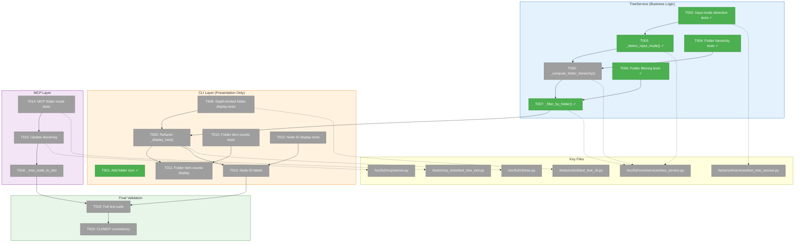
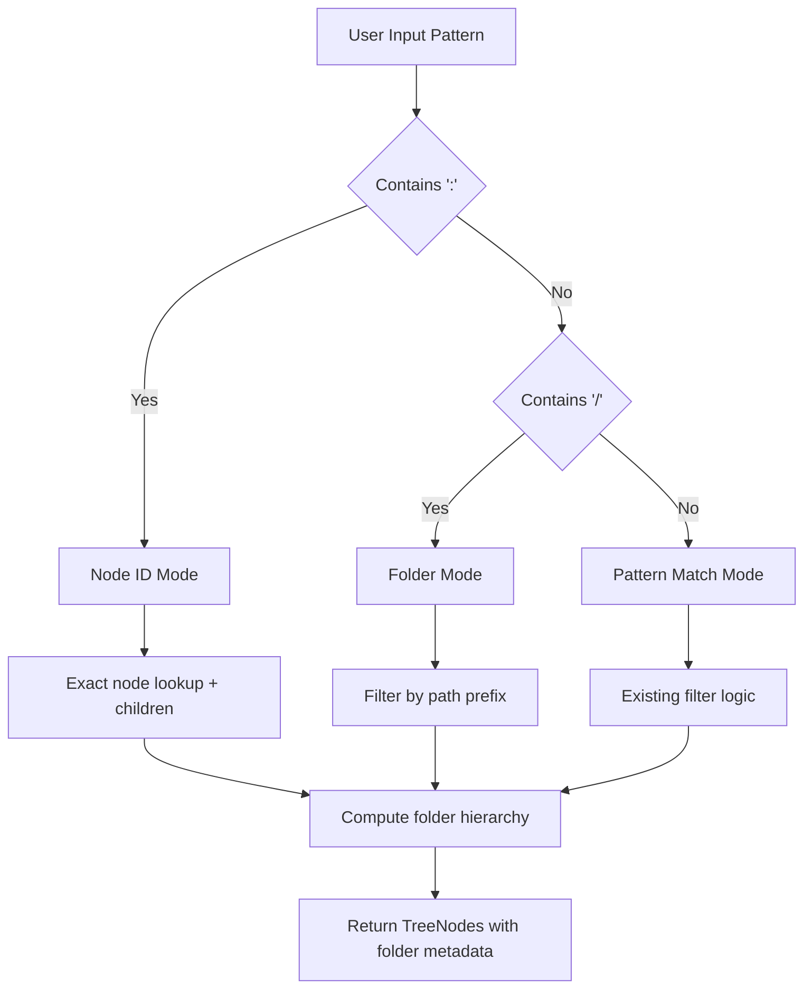
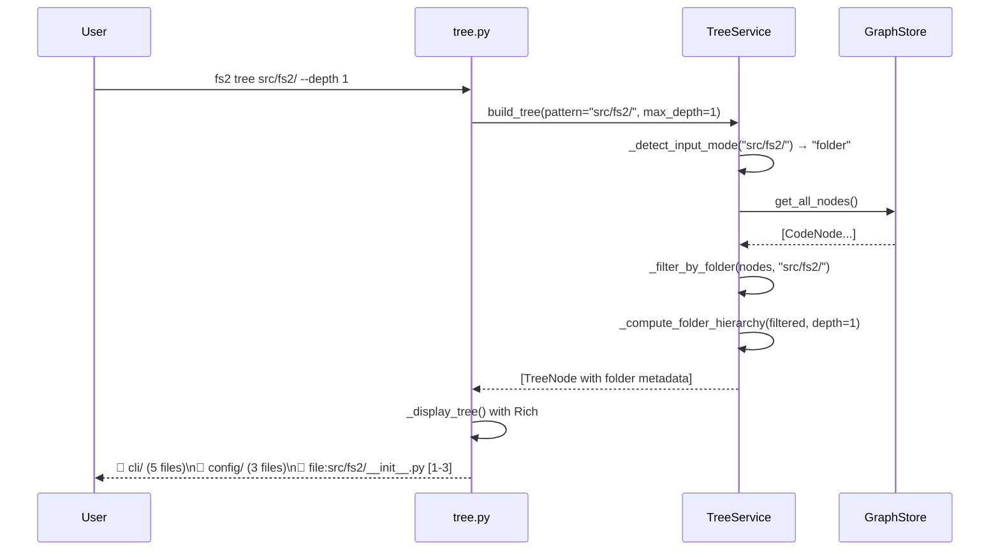

# Phase 1: Hierarchical Tree Navigation – Tasks & Alignment Brief

**Plan**: [tree-folder-navigation-plan.md](../../tree-folder-navigation-plan.md)
**Spec**: [tree-folder-navigation-spec.md](../../tree-folder-navigation-spec.md)
**Date**: 2026-01-04
**Mode**: Simple (single phase)

---

## Executive Briefing

### Purpose
This phase implements hierarchical folder navigation for the `tree` command, enabling agents to progressively explore codebases without context explosion. Currently, `tree --depth 1` produces 400KB+ output because it shows all files grouped into flat virtual folder hierarchies. Agents need a drill-down pattern: folders → files → symbols → methods.

### What We're Building
A **virtual folder navigation system** that:
- Detects three input modes: **folder** (`src/`), **node ID** (`file:...`), **pattern** (`Calculator`)
- Computes folder hierarchy from file paths at runtime (folders are not stored in graph)
- Filters nodes by folder prefix for drill-down navigation
- Displays folders with item counts (e.g., `📁 src/ (89 files)`)
- Shows full node_ids for all real nodes (copy-paste workflow)

### User Value
Agents can explore codebases incrementally:
1. Start with `tree --depth 1` → see only top-level folders
2. Drill into `tree src/fs2/ --depth 1` → see subfolders and files
3. Inspect `tree file:src/fs2/cli/tree.py --depth 1` → see symbols
4. Get source with `get_node callable:...`

Each step produces minimal, actionable output.

### Example

**Before** (current behavior):
```
$ fs2 tree --depth 1
Code Structure
├── 📁 src/fs2/cli/
│   ├── 📄 tree.py [1-363]
│   │   ├── ƒ tree [101-239]
│   │   └── ƒ _display_tree [242-308]
...400KB+ of nested content...
```

**After** (with this feature):
```
$ fs2 tree --depth 1
Code Structure
├── 📁 docs/ (45 files)
├── 📁 scripts/ (12 files)
├── 📁 src/ (89 files)
├── 📁 tests/ (156 files)
├── 📄 file:pyproject.toml [1-150]
└── 📄 file:README.md [1-50]
```

---

## Objectives & Scope

### Objective
Implement hierarchical folder navigation as specified, enabling progressive disclosure for agent codebase exploration.

### Goals

- ✅ `tree --depth 1` shows only top-level folders (AC1)
- ✅ `tree src/fs2/ --depth 1` shows immediate children of that folder (AC2, AC10)
- ✅ `tree file:src/...` and `tree class:...` show symbol children (AC3, AC4)
- ✅ Folders display item counts: `📁 src/ (89 files)` (AC6)
- ✅ Every real node shows full node_id for copy-paste workflow (AC6)
- ✅ Root-level files appear alongside top-level folders (AC8)
- ✅ Empty folders not shown (AC9)
- ✅ MCP docstring explains drill-down workflow (AC7)

### Non-Goals (Scope Boundaries)

- ❌ **Real folder nodes in graph**: Folders remain virtual (computed, not persisted)
- ❌ **Folder-level search**: Search operates on real nodes only
- ❌ **New CLI flags**: Existing `--depth` and pattern arguments suffice
- ❌ **Performance optimization**: O(n) folder computation acceptable for now
- ❌ **Windows path handling**: Focus on Unix paths (current codebase)
- ❌ **Symlink resolution**: Out of scope

---

## Architecture Map

### Component Diagram
<!-- Status: grey=pending, orange=in-progress, green=completed, red=blocked -->
<!-- Updated by plan-6 during implementation -->



### Task-to-Component Mapping

<!-- Status: ⬜ Pending | 🟧 In Progress | ✅ Complete | 🔴 Blocked -->

| Task | Layer | Component | Files | Status | Comment |
|------|-------|-----------|-------|--------|---------|
| T001 | CLI | Icons | tree.py | ✅ Complete | Add "folder" → "📁" to CATEGORY_ICONS |
| T002 | Service | Input Mode | test_tree_service.py | ✅ Complete | TDD: Tests for folder/node_id/pattern detection |
| T003 | Service | Input Mode | tree_service.py | ✅ Complete | Implement `_detect_input_mode()` per P9 |
| T004 | Service | Hierarchy | test_tree_service.py | ✅ Complete | TDD: Tests for folder computation from paths |
| T005 | Service | Hierarchy | tree_service.py | ⬜ Pending | Implement `_compute_folder_hierarchy()` per P9 |
| T006 | Service | Filtering | test_tree_service.py | ✅ Complete | TDD: Tests for folder prefix filtering |
| T007 | Service | Filtering | tree_service.py | ✅ Complete | Modify `_filter_nodes()` for folder mode |
| T008 | CLI | Display | test_tree_cli.py | ⬜ Pending | TDD: Depth-limited folder display tests |
| T009 | CLI | Display | tree.py | ⬜ Pending | Refactor `_display_tree()` for folders |
| T010 | CLI | Display | test_tree_cli.py | ⬜ Pending | TDD: Folder item counts tests |
| T011 | CLI | Display | tree.py | ⬜ Pending | Implement folder item counts |
| T012 | CLI | Display | test_tree_cli.py | ⬜ Pending | TDD: Full node_id display tests |
| T013 | CLI | Display | tree.py | ⬜ Pending | Ensure node_ids in labels |
| T014 | MCP | Integration | test_tree_tool.py | ⬜ Pending | TDD: MCP folder mode tests |
| T015 | MCP | Docs | server.py:206-254 | ✅ Complete | Update tree() docstring with folder workflow |
| T016 | MCP | Conversion | server.py | ⬜ Pending | Handle folder nodes in dict |
| T017a | Docs | User CLI | cli.md:140-233 | ⬜ Pending | Add folder drill-down examples |
| T017b | Docs | Bundled CLI | src/fs2/docs/cli.md:140-233 | ⬜ Pending | Mirror T017a (R6.4) |
| T018a | Docs | User AGENTS | AGENTS.md:11-28,83-99 | ⬜ Pending | Add folder navigation workflow |
| T018b | Docs | Bundled AGENTS | src/fs2/docs/agents.md:11-28,83-99 | ⬜ Pending | Mirror T018a (R6.4) |
| T018c | Docs | User MCP Guide | mcp-server-guide.md:196-238 | ⬜ Pending | Add folder pattern examples |
| T018d | Docs | Bundled MCP Guide | src/fs2/docs/mcp-server-guide.md:196-238 | ⬜ Pending | Mirror T018c (R6.4) |
| T018e | Docs | Project | CLAUDE.md:236-273 | ⬜ Pending | Add folder navigation to fs2 MCP section |
| T018f | Test | Cleanup | test_tree_cli.py | ⬜ Pending | Fix/delete tests broken by T009 refactor |
| T019 | Test | Validation | All test files | ✅ Complete | Full test suite, verify ACs |
| T020 | Test | Integration | Manual | ⬜ Pending | CLI/MCP consistency check |

---

## Tasks

**IMPORTANT**: Tasks restructured from original plan to comply with Constitution P9 (CLI Layer Scope). Business logic (`_detect_input_mode`, `_compute_folder_hierarchy`) moved from CLI to TreeService.

| Status | ID | Task | CS | Type | Dependencies | Absolute Path(s) | Validation | Subtasks | Notes |
|--------|-----|------|----|------|--------------|------------------|------------|----------|-------|
| [x] | T001 | Add folder icon "📁" to CATEGORY_ICONS mapping | 1 | Setup | – | /workspaces/flow_squared/src/fs2/cli/tree.py | Icon mapped at line ~40 | – | Trivial change |
| [x] | T002 | Write tests for input mode detection (folder/node_id/pattern) | 2 | Test | – | /workspaces/flow_squared/tests/unit/services/test_tree_service.py | Tests: `src/` → folder, `file:...` → node_id, `Calculator` → pattern | – | TDD: tests first; per P9 in Service |
| [x] | T003 | Implement `_detect_input_mode()` in TreeService | 2 | Core | T002 | /workspaces/flow_squared/src/fs2/core/services/tree_service.py | Returns "node_id" if `:`, "folder" if `/`, else "pattern" (ORDER MATTERS!) | – | Per P9: business logic in Service |
| [x] | T004 | Write tests for folder hierarchy computation | 2 | Test | T001 | /workspaces/flow_squared/tests/unit/services/test_tree_service.py | Tests: top-level folders, nested, root files | – | Reuse make_file_node() helpers |
| [ ] | T005 | Implement `_compute_folder_hierarchy()` in TreeService | 3 | Core | T004 | /workspaces/flow_squared/src/fs2/core/services/tree_service.py | Returns folder tree with depth limiting; computes BOTH direct_count and total_count per folder | – | Per P9; folders show NAME only; format: `(N files, M total)` |
| [x] | T006 | Write tests for folder filtering (path prefix mode) | 2 | Test | T003 | /workspaces/flow_squared/tests/unit/services/test_tree_service.py | Tests: `src/fs2/` filters correctly; `src/nonexistent/` → "Folder not found" | – | TDD; test empty folder case |
| [x] | T007 | Modify `_filter_nodes()` for folder mode in TreeService | 2 | Core | T006 | /workspaces/flow_squared/src/fs2/core/services/tree_service.py | Folder patterns (with `/`) match file paths as prefix; empty result → "Folder not found: X" | – | Per Finding 02, 09 |
| [ ] | T008 | Write tests for depth-limited folder display | 2 | Test | T005 | /workspaces/flow_squared/tests/unit/cli/test_tree_cli.py | Tests: depth=1 folders only, depth=2 folders+files | – | Verify AC1, AC2 |
| [ ] | T009 | REPLACE `_display_tree()` grouping with service-provided hierarchy | 3 | Core | T005, T007, T008 | /workspaces/flow_squared/src/fs2/cli/tree.py | DELETE lines 258-301 (old grouping); render service output only | – | BREAKING: existing display tests may need updates/deletion |
| [ ] | T010 | Write tests for folder item counts display | 2 | Test | T009 | /workspaces/flow_squared/tests/unit/cli/test_tree_cli.py | Tests: folders show `(N files, M total)` with correct counts | – | Verify AC6 |
| [ ] | T011 | Implement folder item counts in CLI display | 2 | Core | T010 | /workspaces/flow_squared/src/fs2/cli/tree.py | Format: `📁 name/ (N files, M total)` where N=direct, M=recursive | – | Per Finding 11 |
| [ ] | T012 | Write tests for full node_id display | 2 | Test | T009 | /workspaces/flow_squared/tests/unit/cli/test_tree_cli.py | Tests: files show `file:path [1-50]` | – | Verify AC6 copy-paste |
| [ ] | T013 | Ensure node_ids displayed for all real nodes (NOT folders) | 2 | Core | T012 | /workspaces/flow_squared/src/fs2/cli/tree.py | Files/classes/callables show full node_id; folders show NAME only (e.g., `📁 cli/ (5 files, 12 total)`) | – | Folders are virtual, no node_id |
| [ ] | T014 | Write MCP tree tool tests for folder mode | 2 | Test | T007 | /workspaces/flow_squared/tests/mcp_tests/test_tree_tool.py | Tests: folder patterns via MCP, JSON correct | – | TestFolderModeMcp class |
| [x] | T015 | Update MCP tree() docstring with folder workflow | 2 | Docs | T009 | /workspaces/flow_squared/src/fs2/mcp/server.py (lines 206-254) | Docstring explains `/` for folders, drill-down workflow | – | Per AC7; add: trailing `/` syntax, progressive disclosure |
| [ ] | T016 | Update `_tree_node_to_dict()` for folder nodes in MCP | 2 | Core | T015 | /workspaces/flow_squared/src/fs2/mcp/server.py | Handle virtual folder nodes if needed | – | May be no-op if service handles |
| [ ] | T017a | Update docs/how/user/cli.md tree section | 2 | Docs | T009 | /workspaces/flow_squared/docs/how/user/cli.md (lines 140-233) | Add folder drill-down examples, explain `/` syntax | – | Pattern Types section needs folder mode |
| [ ] | T017b | Mirror cli.md changes to bundled copy | 1 | Docs | T017a | /workspaces/flow_squared/src/fs2/docs/cli.md (lines 140-233) | Exact copy of T017a changes | – | Per R6.4: bundled docs must sync |
| [ ] | T018a | Update docs/how/user/AGENTS.md with folder workflow | 2 | Docs | T015 | /workspaces/flow_squared/docs/how/user/AGENTS.md (lines 11-28, 83-99) | Add folder navigation to tree section + workflow examples | – | Progressive disclosure pattern |
| [ ] | T018b | Mirror AGENTS.md changes to bundled copy | 1 | Docs | T018a | /workspaces/flow_squared/src/fs2/docs/agents.md (lines 11-28, 83-99) | Exact copy of T018a changes | – | Per R6.4: bundled docs must sync |
| [ ] | T018c | Update docs/how/user/mcp-server-guide.md tree tool section | 2 | Docs | T015 | /workspaces/flow_squared/docs/how/user/mcp-server-guide.md (lines 196-238) | Add folder pattern examples, trailing `/` requirement | – | MCP tool reference |
| [ ] | T018d | Mirror mcp-server-guide.md changes to bundled copy | 1 | Docs | T018c | /workspaces/flow_squared/src/fs2/docs/mcp-server-guide.md (lines 196-238) | Exact copy of T018c changes | – | Per R6.4: bundled docs must sync |
| [ ] | T018e | Update CLAUDE.md fs2 MCP section | 2 | Docs | T015 | /workspaces/flow_squared/CLAUDE.md (lines 236-273) | Add folder navigation examples to fs2 MCP section | – | Project-level agent guidance |
| [ ] | T018f | Review and fix/delete broken tests from old grouping logic | 2 | Test | T009 | /workspaces/flow_squared/tests/unit/cli/test_tree_cli.py | All existing tree display tests pass or are updated for new behavior | – | Old grouping tests will fail after T009 |
| [x] | T019 | Run full test suite and verify all 10 ACs | 2 | Test | T001-T018f | All test files | `pytest tests/ -v` passes; manual AC check | – | See verification commands |
| [ ] | T020 | Verify CLI and MCP produce consistent output | 2 | Test | T019 | Manual | Same folders shown via CLI/MCP | – | Integration check |

---

## Alignment Brief

### Architecture Decision: Business Logic in Service Layer (P9 Compliance)

**Issue identified in plan-4 validation**: Original plan placed `_detect_input_mode()` and `_compute_folder_hierarchy()` in CLI layer (`tree.py`).

**Constitution P9 states**: "CLI commands MUST NOT contain business logic... CLI MUST NOT have functions like `_filter_nodes()`, `_build_tree()` (these belong in services)"

**Resolution**: Tasks T002-T007 now target `tree_service.py`. The CLI (`tree.py`) only handles:
- Argument parsing via Typer
- Calling `service.build_tree()` with parameters
- Rich rendering of the returned folder/node structure

### Critical Findings Applied

| Finding | Title | Impact | Addressed By |
|---------|-------|--------|--------------|
| 01 | Virtual folder grouping exists | Refactor to compute hierarchically | T005, T009 |
| 02 | Pattern matching priority | Add folder mode detection | T003, T007 |
| 03 | TreeService uses edges, not folders | Compute folders in Service | T005 |
| 05 | Folder extraction functions exist | Reuse in tree_service.py | T005 |
| 08 | TreeNode is immutable | Build new folder structure | T005 |
| 09 | Root bucket algorithm | Folder filtering works with it | T007 |
| 10 | CATEGORY_ICONS mapping | Add folder icon | T001 |
| 11 | hidden_children_count field | Use for folder counts | T011 |
| 12 | Test fixtures available | FakeGraphStore, helpers | T002, T004, T006 |
| 13 | Documentation gap | Update both CLI and MCP docs | T015, T017, T018 |

### Invariants & Guardrails

- **No graph mutations**: Folders are computed, never persisted
- **Backward compatible output**: Non-folder patterns work exactly as before
- **Performance**: O(n) where n=files; acceptable for typical codebases (<10K files)
- **Test coverage**: All 102+ existing tree tests must continue passing

### Input Files to Read

**Core Implementation Files**:

| File | Lines | Purpose |
|------|-------|---------|
| `/workspaces/flow_squared/src/fs2/core/services/tree_service.py` | All | Add input mode detection, folder hierarchy |
| `/workspaces/flow_squared/src/fs2/cli/tree.py` | All | Refactor display for folder rendering |
| `/workspaces/flow_squared/src/fs2/mcp/server.py` | 206-254 | Update tree() docstring, dict conversion |
| `/workspaces/flow_squared/src/fs2/core/services/search_result_meta.py` | 27-116 | Reference folder extraction functions |

**Test Files**:

| File | Purpose |
|------|---------|
| `/workspaces/flow_squared/tests/unit/services/test_tree_service.py` | Add service tests for folder logic |
| `/workspaces/flow_squared/tests/unit/cli/test_tree_cli.py` | Add display tests |
| `/workspaces/flow_squared/tests/mcp_tests/test_tree_tool.py` | Add MCP folder mode tests |

**Documentation Files (Primary + Bundled Copies per R6.4)**:

| Primary File | Lines | Bundled Copy | Update Needed |
|--------------|-------|--------------|---------------|
| `/workspaces/flow_squared/docs/how/user/cli.md` | 140-233 | `/workspaces/flow_squared/src/fs2/docs/cli.md` | Add folder drill-down, `/` syntax |
| `/workspaces/flow_squared/docs/how/user/AGENTS.md` | 11-28, 83-99 | `/workspaces/flow_squared/src/fs2/docs/agents.md` | Add folder navigation workflow |
| `/workspaces/flow_squared/docs/how/user/mcp-server-guide.md` | 196-238 | `/workspaces/flow_squared/src/fs2/docs/mcp-server-guide.md` | Add folder pattern examples |
| `/workspaces/flow_squared/CLAUDE.md` | 236-273 | N/A (single source) | Add folder navigation to fs2 MCP section |

### Documentation Content to Add

**Key concepts to document in ALL relevant files**:

1. **Trailing `/` requirement**: Use `/` for folder mode (e.g., `src/fs2/` not `src/fs2`)
2. **Three input modes**: folder (`/`), node_id (`:`), pattern (otherwise)
3. **Progressive disclosure workflow**: `tree --depth 1` → `tree src/` → `tree file:...` → `get_node`

**AGENTS.md / agents.md** (lines 11-28 tree section):
```markdown
## `tree` - Explore Codebase Structure

### Folder Navigation (NEW)
Use trailing `/` to explore folder contents progressively:

1. **Top-level overview**: `tree(pattern=".", max_depth=1)` → shows folders only
2. **Drill into folder**: `tree(pattern="src/fs2/", max_depth=1)` → shows subfolders + files
3. **Explore file**: `tree(pattern="file:src/fs2/cli/tree.py", max_depth=1)` → shows symbols
4. **Get source**: `get_node(node_id="callable:src/fs2/cli/tree.py:tree")` → full code

**IMPORTANT**: Trailing `/` is required for folder mode. `src/fs2` matches patterns; `src/fs2/` navigates folders.
```

**cli.md** (lines 170-175 Pattern Types):
```markdown
### Pattern Types

| Pattern | Mode | Example | Result |
|---------|------|---------|--------|
| `.` | All | `fs2 tree` | All files |
| `path/` | Folder | `fs2 tree src/fs2/` | Contents of src/fs2/ |
| `name` | Substring | `fs2 tree Calculator` | Nodes containing "Calculator" |
| `*glob*` | Glob | `fs2 tree "*.py"` | Files matching pattern |
| `category:...` | Node ID | `fs2 tree file:src/main.py` | Specific node + children |

**Folder Navigation**: Use `--depth 1` with folder patterns for progressive exploration.
```

**CLAUDE.md** (lines 236-273 fs2 MCP section):
```markdown
### Folder Navigation Workflow

**Progressive disclosure pattern for exploring codebases**:

```python
# 1. See top-level structure
mcp__fs2__tree(pattern=".", max_depth=1)
# Output: 📁 docs/, 📁 src/, 📁 tests/

# 2. Drill into a folder (note trailing /)
mcp__fs2__tree(pattern="src/fs2/", max_depth=1)
# Output: 📁 cli/, 📁 core/, 📄 file:src/fs2/__init__.py

# 3. Explore a file's symbols
mcp__fs2__tree(pattern="file:src/fs2/cli/tree.py", max_depth=1)
# Output: ƒ tree, ƒ _display_tree, ...

# 4. Get full source
mcp__fs2__get_node(node_id="callable:src/fs2/cli/tree.py:tree")
```

**Key**: Use trailing `/` for folder navigation. `src/fs2` = pattern match; `src/fs2/` = folder drill-down.
```

### Flow Diagram: Input Mode Detection



### Sequence Diagram: Folder Drill-Down



### Test Plan (Full TDD)

**Mock Policy**: Targeted fakes per P4 (FakeGraphStore, FakeConfigurationService). No `unittest.mock`.

| Test Class | Location | Tests | Fixtures |
|------------|----------|-------|----------|
| `TestInputModeDetection` | test_tree_service.py | `test_folder_mode`, `test_node_id_mode`, `test_pattern_mode` | None (pure function) |
| `TestFolderHierarchy` | test_tree_service.py | `test_top_level_folders`, `test_nested_folders`, `test_root_files`, `test_depth_limiting` | FakeGraphStore, make_file_node() |
| `TestFolderFiltering` | test_tree_service.py | `test_filter_by_prefix`, `test_filter_nested_path` | FakeGraphStore |
| `TestFolderDisplay` | test_tree_cli.py | `test_depth_one_folders_only`, `test_depth_two_folders_and_files`, `test_folder_item_counts` | scanned_project fixture |
| `TestNodeIdDisplay` | test_tree_cli.py | `test_file_shows_node_id`, `test_class_shows_node_id` | scanned_project fixture |
| `TestFolderModeMcp` | test_tree_tool.py | `test_folder_pattern_via_mcp`, `test_json_output_correct` | scanned_project fixture |

**Test Naming Convention** (per R2.2):
```python
def test_given_folder_pattern_when_detect_mode_then_returns_folder():
    assert _detect_input_mode("src/fs2/") == "folder"

def test_given_node_id_pattern_when_detect_mode_then_returns_node_id():
    assert _detect_input_mode("file:src/main.py") == "node_id"
```

### Implementation Outline

1. **T001**: Add `"folder": "📁"` to CATEGORY_ICONS dict (line 37-47)
2. **T002-T003**: Input mode detection
   - Add `_detect_input_mode(pattern: str) -> Literal["folder", "node_id", "pattern"]`
   - Logic: `":" in pattern` → node_id; `"/" in pattern` → folder; else → pattern (ORDER MATTERS: check `:` first!)
3. **T004-T005**: Folder hierarchy computation
   - Add `_compute_folder_hierarchy(nodes: list[CodeNode], max_depth: int) -> list[FolderNode]`
   - Extract parent paths from file node_ids
   - Build tree structure with item counts
4. **T006-T007**: Folder filtering
   - Modify `_filter_nodes()` to handle folder mode
   - When mode=folder, filter nodes where `file_path.startswith(pattern)`
5. **T008-T009**: Display refactor (REPLACEMENT, not addition)
   - DELETE existing grouping logic in `_display_tree()` (lines 258-301)
   - REPLACE with simple render of service-provided hierarchy
   - Rich Tree rendering handles both folders and real nodes
   - ⚠️ Existing display tests will break - see T018f for cleanup
6. **T010-T013**: Display polish
   - Folders: `📁 cli/ (5 files, 12 total)` — NAME only, direct + recursive counts
   - Files: `📄 file:src/fs2/cli/tree.py [1-363]` — full node_id (real, copy-pasteable)
   - Symbols: `ƒ callable:src/fs2/cli/tree.py:tree [101-239]` — full node_id (real)
7. **T014-T016**: MCP integration
   - Tests for folder mode via MCP
   - Update tree() docstring (lines 206-254)
   - Handle folder nodes in dict conversion
8. **T017a-T017b**: CLI documentation
   - Update `cli.md` tree section (lines 140-233) with folder examples
   - Mirror to bundled copy per R6.4
9. **T018a-T018e**: Agent and project documentation
   - **T018a-b**: Update `AGENTS.md` (lines 11-28, 83-99) + bundled copy
   - **T018c-d**: Update `mcp-server-guide.md` (lines 196-238) + bundled copy
   - **T018e**: Update `CLAUDE.md` (lines 236-273) fs2 MCP section
10. **T019-T020**: Final validation

### Commands to Run

```bash
# Environment setup
cd /workspaces/flow_squared
uv sync

# Run specific test file during development
UV_CACHE_DIR=.uv_cache uv run pytest tests/unit/services/test_tree_service.py -v -k "folder"

# Run all tree tests
UV_CACHE_DIR=.uv_cache uv run pytest tests/unit/services/test_tree_service.py tests/unit/cli/test_tree_cli.py tests/mcp_tests/test_tree_tool.py -v

# Run full test suite
UV_CACHE_DIR=.uv_cache uv run pytest tests/ -v

# Type checking
UV_CACHE_DIR=.uv_cache uv run mypy src/fs2/core/services/tree_service.py src/fs2/cli/tree.py

# Linting
UV_CACHE_DIR=.uv_cache uv run ruff check src/fs2/core/services/tree_service.py src/fs2/cli/tree.py

# Manual verification (after implementation)
fs2 tree --depth 1  # Should show only folders
fs2 tree src/fs2/ --depth 1  # Should show subfolders + files
fs2 tree file:src/fs2/cli/tree.py --depth 1  # Should show symbols
```

### Acceptance Criteria Verification

| AC | Criterion | Verification Command |
|----|-----------|---------------------|
| AC1 | Top-level folders at depth 1 | `fs2 tree --depth 1 \| grep -c "📄"` → 0 (except root files) |
| AC2 | Folder drill-down | `fs2 tree src/fs2/ --depth 1` → shows cli/, config/, core/, mcp/ |
| AC3 | File drill-down | `fs2 tree file:src/fs2/cli/tree.py --depth 1` → shows functions |
| AC4 | Class drill-down | `fs2 tree class:...:TreeService --depth 1` → shows methods |
| AC5 | Depth 2 shows contents | `fs2 tree src/fs2/ --depth 2` → folders AND their files |
| AC6 | Copy-paste workflow | Copy node_id from output → paste as input → works |
| AC7 | MCP docstring | `grep -A20 "def tree" src/fs2/mcp/server.py` → explains drill-down |
| AC8 | Root files alongside folders | `fs2 tree --depth 1` → shows pyproject.toml, README.md |
| AC9 | Empty folders hidden | No folders without files shown |
| AC10 | Nested path filtering | `fs2 tree src/fs2/core/ --depth 1` → only immediate children |

### Risks & Mitigations

| Risk | Severity | Likelihood | Mitigation |
|------|----------|------------|------------|
| Display refactor breaks tests | High | Medium | Run tests after each change; fix incrementally |
| Performance with large codebases | Medium | Low | O(n) acceptable; profile if needed |
| MCP/CLI output inconsistency | Medium | Low | Test both paths with same inputs (T020) |
| Edge cases with unusual paths | Low | Low | Normalize paths; add edge case tests |

### Ready Check

- [x] Architecture aligns with P9 (business logic in Service)
- [x] Critical findings mapped to tasks
- [x] TDD order correct (test tasks precede implementation)
- [x] Absolute paths for all files
- [x] Verification commands specified
- [x] Mock policy matches spec (Targeted fakes per P4)
- [ ] ADR constraints mapped to tasks - N/A (no formal ADRs)

**Ready for implementation**: Await explicit GO/NO-GO from sponsor.

---

## Phase Footnote Stubs

_Populated by plan-6a during implementation. Mirrors plan.md § Change Footnotes Ledger._

| Footnote | Task | Change | Rationale |
|----------|------|--------|-----------|
| [^1] | T001 | Added folder icon to CATEGORY_ICONS | Virtual folders need visual distinction |
| [^2] | T002-T003 | Input mode detection in TreeService | Per P9: business logic in Service layer |
| [^3] | T004-T007 | Folder filtering implementation | Core folder navigation functionality |
| [^4] | T015 | MCP documentation update | Users need to understand folder syntax |
| [^5] | T019 | Validation (1666 tests pass) | Verify no regressions |

---

## Evidence Artifacts

- **Execution Log**: `tasks/phase-1-implementation/execution.log.md` (created by plan-6)
- **Test Results**: `pytest` output captured in execution log
- **Screenshots**: N/A (CLI output in log)

---

## Discoveries & Learnings

_Populated during implementation by plan-6. Log anything of interest to your future self._

| Date | Task | Type | Discovery | Resolution | References |
|------|------|------|-----------|------------|------------|
| 2026-01-05 | T006 | insight | Existing substring matching works for folder patterns | Tests pass immediately - no changes needed | execution.log#T006 |
| 2026-01-05 | T007 | gotcha | CodeNode has no `file_path` attribute - must extract from node_id | Added `_extract_file_path()` helper | execution.log#T007 |
| 2026-01-05 | T005 | decision | T005 (virtual folder hierarchy) deferred to Phase 2 | Core folder filtering delivers value, display polish can wait | execution.log#Decision |

**Types**: `gotcha` | `research-needed` | `unexpected-behavior` | `workaround` | `decision` | `debt` | `insight`

**What to log**:
- Things that didn't work as expected
- External research that was required
- Implementation troubles and how they were resolved
- Gotchas and edge cases discovered
- Decisions made during implementation
- Technical debt introduced (and why)
- Insights that future phases should know about

_See also: `execution.log.md` for detailed narrative._

---

## Directory Layout

```
docs/plans/019-tree-folder-navigation/
├── tree-folder-navigation-spec.md
├── tree-folder-navigation-plan.md
└── tasks/
    └── phase-1-implementation/
        ├── tasks.md              # This file
        └── execution.log.md      # Created by plan-6
```

---

## Critical Insights Discussion

**Session**: 2026-01-05
**Context**: Tree Folder Navigation Implementation (tasks.md review)
**Format**: Did You Know Clarity Session (5 Critical Insights)

### Insight 1: Input Mode Detection Order Bug

**Did you know**: The original detection logic checked `/` before `:`, which would misclassify node IDs like `file:src/main.py` as folder mode.

**Options Considered**:
- Option A: Fix detection order (check `:` first) - CS-1
- Option B: Use regex for detection - CS-2
- Option C: Escape slashes in node IDs - rejected

**Decision**: Option A - Fix detection order (`:` first, then `/`, then pattern)

**Action Items**:
- [x] Updated T003 validation criteria
- [x] Updated Implementation Outline
- [x] Fixed Flow Diagram

**Affects**: T003 implementation

---

### Insight 2: FolderNode Data Structure

**Did you know**: The plan computed folder hierarchies but never defined how to represent them (FolderNode doesn't exist).

**Options Considered**:
- Option A: Create new FolderNode dataclass - CS-2
- Option B: Use synthetic folder CodeNodes in TreeNode - CS-2
- Option C: Return raw dict, transform in CLI/MCP - CS-3

**Discussion**: Workshopped Option B further. Decided folders should NOT show node_ids (they're virtual), only show folder NAME like a regular filesystem.

**Decision**: B1 - Synthetic CodeNodes with category="folder", display NAME only (no node_id prefix)

**Action Items**:
- [x] Updated T005 to clarify synthetic CodeNodes
- [x] Updated T013 to show folders display NAME only
- [x] Updated Implementation Outline with display format

**Affects**: T005, T009, T011, T013

---

### Insight 3: Folder Item Count Semantics

**Did you know**: "📁 src/ (89 files)" could mean direct children only OR total descendants - spec didn't clarify.

**Options Considered**:
- Option A: Direct children only
- Option B: Total descendants (recursive)
- Option C: Both counts - `(N files, M total)`
- Option D: Direct files + subfolder count

**Decision**: Option C - Show both: `📁 name/ (N files, M total)` where N=direct, M=recursive

**Action Items**:
- [x] Updated T005 to compute both counts
- [x] Updated T010, T011 with new format
- [x] Updated Implementation Outline

**Affects**: T005, T010, T011

---

### Insight 4: Existing CLI Grouping Conflict

**Did you know**: `_display_tree()` already has virtual folder grouping (lines 258-301) that will conflict with the new service-provided hierarchy.

**Options Considered**:
- Option A: Delete existing grouping, use service output - recommended
- Option B: Keep CLI grouping, enhance it - violates P9
- Option C: Hybrid approach

**Decision**: Option A - REPLACE existing grouping with service output. T009 is a deletion+replacement refactor, not an addition.

**Action Items**:
- [x] Updated T009 to clarify REPLACEMENT refactor
- [x] Added T018f for test cleanup (existing tests will break)
- [x] Updated Implementation Outline with warning

**Affects**: T009, T018f (new task), existing display tests

---

### Insight 5: Empty Folder Behavior

**Did you know**: There's no defined behavior for `tree src/nonexistent/` - current message "No nodes match pattern" is confusing for folder mode.

**Options Considered**:
- Option A: Folder-specific message: "Folder not found: X"
- Option B: Generic empty message (current)
- Option C: Suggest similar folders
- Option D: Show empty tree

**Decision**: Option A - Clear folder-aware message: "Folder not found: src/nonexistent/"

**Action Items**:
- [x] Updated T006 to test empty folder case
- [x] Updated T007 to return folder-specific message

**Affects**: T006, T007

---

## Session Summary

**Insights Surfaced**: 5 critical discoveries
**Decisions Made**: 5 decisions reached
**Tasks Updated**: T003, T005, T006, T007, T009, T010, T011, T013
**Tasks Added**: T018f (test cleanup)

**Key Design Decisions**:
1. Detection order: `:` before `/` before pattern
2. Folders: synthetic CodeNodes, display NAME only (no node_id)
3. Counts: `(N files, M total)` format
4. Display: REPLACE existing grouping, don't add to it
5. Empty folders: "Folder not found: X" message

**Confidence Level**: High - Key ambiguities resolved, implementation path clear

**Next Steps**: Proceed to `/plan-6-implement-phase`
