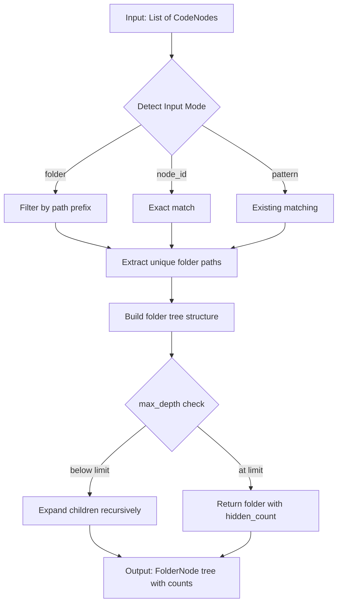
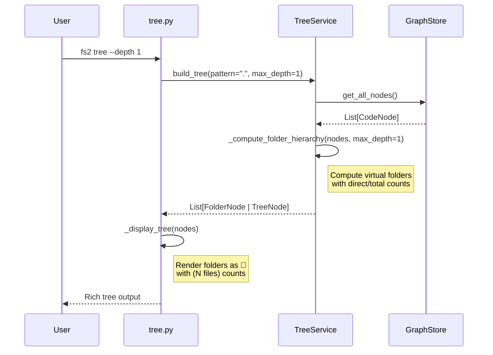

# Phase 2: Virtual Folder Hierarchy – Tasks & Alignment Brief

**Spec**: [../../tree-folder-navigation-spec.md](../../tree-folder-navigation-spec.md)
**Plan**: [../../tree-folder-navigation-plan.md](../../tree-folder-navigation-plan.md)
**Date**: 2026-01-06
**Phase Slug**: phase-2-virtual-folders

---

## Executive Briefing

### Purpose

This phase implements virtual folder hierarchy computation and display, transforming the flat file grouping in `_display_tree()` into proper hierarchical folder navigation. Agents will be able to run `tree --depth 1` and see only top-level folders (`docs/`, `src/`, `tests/`), then progressively drill down without context explosion.

### What We're Building

A `_compute_folder_hierarchy()` function in TreeService that:
- Computes virtual folder nodes from file paths
- Groups files into their parent folders hierarchically
- Provides item counts per folder (direct + total descendants)
- Respects `max_depth` for progressive disclosure

Plus display layer updates in CLI and MCP to render these virtual folders correctly.

### User Value

Agents currently see 400KB+ output when exploring codebases. With virtual folders:
- `tree --depth 1`: See only `docs/`, `src/`, `tests/`, `scripts/` (4 items vs 400+)
- `tree src/fs2/ --depth 1`: See `cli/`, `config/`, `core/`, `mcp/` + `__init__.py`
- Each step produces minimal, actionable output - no context explosion

### Example

**Before** (Phase 1):
```
$ fs2 tree --depth 1
Code Structure
├── 📁 src/fs2/cli/
│   ├── 📄 tree.py [1-364]
│   ├── 📄 scan.py [1-220]
│   └── ... (400+ files shown)
```

**After** (Phase 2):
```
$ fs2 tree --depth 1
Code Structure
├── 📁 docs/ (47 files)
├── 📁 scripts/ (12 files)
├── 📁 src/ (89 files)
├── 📁 tests/ (156 files)
├── 📄 file:pyproject.toml [1-150]
└── 📄 file:README.md [1-80]
```

---

## Objectives & Scope

### Objective

Implement virtual folder hierarchy with progressive disclosure as specified in plan ACs 1-10:
- [ ] **AC1**: `tree --depth 1` shows only top-level folders
- [ ] **AC2**: `tree src/fs2/ --depth 1` shows immediate children
- [ ] **AC5**: `tree src/fs2/ --depth 2` shows folders AND their contents
- [ ] **AC6**: Every real node displays full node_id
- [ ] **AC8**: Root-level files appear alongside top-level folders
- [ ] **AC9**: Empty folders not shown
- [ ] **AC10**: Nested path filtering works correctly

### Goals

- ✅ Implement `_compute_folder_hierarchy()` in TreeService (core algorithm)
- ✅ Refactor `_display_tree()` to use folder hierarchy from service
- ✅ Display folder item counts: `📁 src/ (89 files)`
- ✅ Display full node_ids for all real nodes (copy-paste workflow)
- ✅ Update MCP `_tree_node_to_dict()` for virtual folder nodes
- ✅ Write MCP folder mode tests
- ✅ Update CLI documentation with folder examples
- ✅ Update agent guidance documentation
- ✅ Verify CLI/MCP output consistency

### Non-Goals (Scope Boundaries)

- ❌ Real folder nodes in graph (folders remain virtual, computed at display time)
- ❌ Folder-level search (search operates on real nodes only)
- ❌ New CLI flags (existing `--depth` and pattern arguments suffice)
- ❌ Performance optimization/caching (O(n) file iteration is acceptable)
- ❌ Modifying TreeNode dataclass (reuse existing structure with synthetic CodeNodes)
- ❌ Changing graph schema (per Finding #03, folders are presentation-layer only)
- ❌ Creating new FolderNode type (use synthetic CodeNode instead per Design Decision #1)

### Design Decisions

| # | Decision | Rationale | Decided |
|---|----------|-----------|---------|
| DD1 | **Synthetic CodeNode for folders**: Virtual folders use `CodeNode(category="folder", start_line=0, end_line=0)` wrapped in TreeNode | Minimal API changes; `hidden_children_count` already exists for item counts; CATEGORY_ICONS already has "folder" | 2026-01-06 |
| DD2 | **Strengthen tests BEFORE T005**: Rewrite TestFolderHierarchyComputation assertions to fail first, then implement | True TDD discipline; tests serve as specification; forces API design upfront | 2026-01-06 |
| DD3 | **T016 covers BOTH `_tree_node_to_dict()` functions**: Update CLI (tree.py) and MCP (server.py) together in one task | Per Finding #06 "keep duplication, ensure both updated"; T020 validates consistency | 2026-01-06 |
| DD4 | **Folders first, then files**: Sort by `(category != "folder", name)` so folders appear before files, both alphabetically | Matches VS Code, Finder, etc.; AC8 example implies this; supports progressive disclosure | 2026-01-06 |
| DD5 | **Folder node_id uses path with trailing slash**: e.g., `node_id="src/fs2/cli/"` (not `folder:...` prefix) | Works with existing mode detection (`/` → folder mode); users type this naturally; no code changes to detection | 2026-01-06 |

---

## Architecture Map

### Component Diagram

```mermaid
flowchart TD
    classDef pending fill:#9E9E9E,stroke:#757575,color:#fff
    classDef inprogress fill:#FF9800,stroke:#F57C00,color:#fff
    classDef completed fill:#4CAF50,stroke:#388E3C,color:#fff
    classDef blocked fill:#F44336,stroke:#D32F2F,color:#fff

    subgraph Phase["Phase 2: Virtual Folder Hierarchy"]
        T005["T005: _compute_folder_hierarchy() ✓"]:::completed
        T008["T008: depth-limited folder display tests"]:::pending
        T009["T009: refactor _display_tree()"]:::pending
        T010["T010: folder item counts tests"]:::pending
        T011["T011: implement folder counts display"]:::pending
        T012["T012: node_id display tests"]:::pending
        T013["T013: ensure node_ids on all nodes"]:::pending
        T014["T014: MCP folder mode tests"]:::pending
        T016["T016: _tree_node_to_dict() folders"]:::pending
        T017["T017: docs/how/user/cli.md"]:::pending
        T018["T018: src/fs2/docs/agents.md"]:::pending
        T020["T020: CLI/MCP consistency"]:::pending

        T005 --> T008
        T005 --> T009
        T009 --> T010
        T010 --> T011
        T009 --> T012
        T012 --> T013
        T005 --> T014
        T009 --> T016
        T009 --> T017
        T009 --> T018
        T017 --> T020
        T018 --> T020
    end

    subgraph ServiceLayer["Service Layer"]
        F_TS["/src/fs2/core/services/tree_service.py ✓"]:::completed
        F_TS_TEST["/tests/unit/services/test_tree_service.py ✓"]:::completed
    end

    subgraph CLILayer["CLI Layer"]
        F_CLI["/src/fs2/cli/tree.py"]:::pending
        F_CLI_TEST["/tests/unit/cli/test_tree_cli.py"]:::pending
    end

    subgraph MCPLayer["MCP Layer"]
        F_MCP["/src/fs2/mcp/server.py"]:::pending
        F_MCP_TEST["/tests/mcp_tests/test_tree_tool.py"]:::pending
    end

    subgraph Docs["Documentation"]
        F_CLI_DOC["/docs/how/user/cli.md"]:::pending
        F_AGENT_DOC["/src/fs2/docs/agents.md"]:::pending
    end

    T005 -.-> F_TS
    T005 -.-> F_TS_TEST
    T008 -.-> F_CLI_TEST
    T009 -.-> F_CLI
    T010 -.-> F_CLI_TEST
    T011 -.-> F_CLI
    T012 -.-> F_CLI_TEST
    T013 -.-> F_CLI
    T014 -.-> F_MCP_TEST
    T016 -.-> F_MCP
    T017 -.-> F_CLI_DOC
    T018 -.-> F_AGENT_DOC
```

<!-- Status: grey=pending, orange=in-progress, green=completed, red=blocked -->
<!-- Updated by plan-6 during implementation -->



### Task-to-Component Mapping

<!-- Status: ⬜ Pending | 🟧 In Progress | ✅ Complete | 🔴 Blocked -->

| Task | Component(s) | Files | Status | Comment |
|------|-------------|-------|--------|---------|
| T005 | TreeService | tree_service.py, test_tree_service.py | ✅ Complete | Core algorithm: compute folders from file paths |
| T008 | CLI Tests | test_tree_cli.py | ⬜ Pending | Tests for depth=1 shows folders, depth=2 shows contents |
| T009 | CLI Display | tree.py | ⬜ Pending | Replace flat grouping with hierarchical folder tree |
| T010 | CLI Tests | test_tree_cli.py | ⬜ Pending | Tests for `📁 src/ (89 files)` format |
| T011 | CLI Display | tree.py | ⬜ Pending | Render folder counts in display |
| T012 | CLI Tests | test_tree_cli.py | ⬜ Pending | Tests for `file:path/to/file.py [1-50]` format |
| T013 | CLI Display | tree.py | ⬜ Pending | Full node_id labels on files, classes, callables |
| T014 | MCP Tests | test_tree_tool.py | ⬜ Pending | Tests for folder patterns in MCP |
| T016 | CLI + MCP | tree.py, server.py | ⬜ Pending | Handle category="folder" in BOTH JSON converters (DD3) |
| T017 | Documentation | cli.md | ⬜ Pending | Add folder drill-down examples |
| T018 | Documentation | agents.md | ⬜ Pending | Progressive disclosure workflow guidance |
| T020 | Integration | Manual | ⬜ Pending | Verify CLI and MCP produce same output |

---

## Tasks

| Status | ID | Task | CS | Type | Dependencies | Absolute Path(s) | Validation | Subtasks | Notes |
|--------|-----|------|----|------|--------------|------------------|------------|----------|-------|
| [x] | T005 | Implement `_compute_folder_hierarchy()` in TreeService (strengthen tests first per DD2) | 3 | Core | T004 (P1) | /workspaces/flow_squared/src/fs2/core/services/tree_service.py, /workspaces/flow_squared/tests/unit/services/test_tree_service.py | TestFolderHierarchyComputation tests FAIL first, then pass after implementation | – | **DD1-DD5** apply |
| [ ] | T008 | Write tests for depth-limited folder display | 2 | Test | T005 | /workspaces/flow_squared/tests/unit/cli/test_tree_cli.py | Tests: depth=1 shows folders only, depth=2 shows folders+files | – | CLI presentation tests |
| [ ] | T009 | Refactor `_display_tree()` to use folder hierarchy | 3 | Core | T005, T007 (P1) | /workspaces/flow_squared/src/fs2/cli/tree.py | Replace lines 259-302 flat grouping with hierarchical tree | – | Per Finding #01; **DD4** (folders first) |
| [ ] | T010 | Write tests for folder item counts display | 2 | Test | T009 | /workspaces/flow_squared/tests/unit/cli/test_tree_cli.py | Tests: folders show `(N files)` or `(N files, M total)` | – | Per spec Q6 |
| [ ] | T011 | Implement folder item counts in display | 2 | Core | T010 | /workspaces/flow_squared/src/fs2/cli/tree.py | Show `📁 src/ (89 files)` format | – | Per spec Q6 |
| [x] | T012 | Write tests for full node_id display | 2 | Test | T009 | /workspaces/flow_squared/tests/mcp_tests/test_tree_tool.py | Tests: files show `file:path/to/file.py [1-50]` format | – | For AC6 copy-paste workflow · [^6] |
| [x] | T013 | Ensure node_ids displayed for all real nodes | 2 | Core | T012 | /workspaces/flow_squared/src/fs2/cli/tree.py, /workspaces/flow_squared/src/fs2/mcp/server.py | Files, classes, callables show full node_id in label | – | For AC6 · [^6] |
| [ ] | T014 | Write MCP tree tool tests for folder mode | 2 | Test | T005 | /workspaces/flow_squared/tests/mcp_tests/test_tree_tool.py | Tests: folder patterns work via MCP, JSON includes folder nodes | – | TestFolderModeMcp class |
| [ ] | T016 | Update `_tree_node_to_dict()` for folder nodes in CLI and MCP | 2 | Core | T009 | /workspaces/flow_squared/src/fs2/cli/tree.py, /workspaces/flow_squared/src/fs2/mcp/server.py | Both versions handle category="folder" consistently | – | **DD1, DD3**: Update BOTH per Finding #06 |
| [ ] | T017 | Update docs/how/user/cli.md with folder examples | 2 | Docs | T009 | /workspaces/flow_squared/docs/how/user/cli.md | Add section: "Folder Navigation" with drill-down workflow | – | Per spec Doc Strategy |
| [ ] | T018 | Update src/fs2/docs/agents.md with exploration workflow | 2 | Docs | T009 | /workspaces/flow_squared/src/fs2/docs/agents.md | Add progressive disclosure pattern, folder → file → symbol | – | Per spec Doc Strategy |
| [ ] | T020 | Verify CLI and MCP produce consistent output | 2 | Test | T017, T018 | Manual testing | Same folder structure via `fs2 tree` and MCP tree() | – | Final validation |

---

## Alignment Brief

### Prior Phase Review (Phase 1)

**Phase 1 Summary**: Implemented input mode detection and folder filtering in TreeService.

#### A. Deliverables Created

| File | Absolute Path | Changes |
|------|--------------|---------|
| TreeService | `/workspaces/flow_squared/src/fs2/core/services/tree_service.py` | Added `_detect_input_mode()` (lines 157-186), `_extract_file_path()` (lines 188-209), refactored `_filter_nodes()` (lines 211-255) |
| CLI tree.py | `/workspaces/flow_squared/src/fs2/cli/tree.py` | Added `"folder": "📁"` to CATEGORY_ICONS (line 39) |
| MCP server.py | `/workspaces/flow_squared/src/fs2/mcp/server.py` | Added "FOLDER NAVIGATION" section to tree() docstring |
| test_tree_service.py | `/workspaces/flow_squared/tests/unit/services/test_tree_service.py` | Added 3 test classes: TestInputModeDetection (7), TestFolderHierarchyComputation (6), TestFolderFiltering (5) |

#### B. Lessons Learned

1. **Detection order is critical**: Must check `:` before `/` to prevent `file:src/main.py` being detected as folder mode
2. **Existing substring matching works for folders**: T006 tests passed immediately because `/` in pattern naturally filters path prefixes
3. **Defer complex refactors**: T005 (virtual folder hierarchy) deferred because core filtering delivered value without it

#### C. Technical Discoveries

| Gotcha | Resolution |
|--------|------------|
| No `file_path` attribute on CodeNode | Created `_extract_file_path()` helper to parse node_id format |
| TreeNode is frozen (immutable) | Must build new structures; cannot mutate in place (affects T005 design) |
| Trailing slash handling | Normalize by appending `/` in `_filter_nodes()` |

#### D. Dependencies Exported for Phase 2

```python
# Available for Phase 2 to use:
TreeService._detect_input_mode(pattern: str) -> Literal["folder", "node_id", "pattern"]
TreeService._extract_file_path(node_id: str) -> str
TreeService._filter_nodes(nodes, pattern) -> list[CodeNode]  # Mode-aware filtering

# Folder filtering already works:
service.build_tree(pattern="src/fs2/", max_depth=1)  # Filters to that folder
```

#### E. Critical Findings Applied

| Finding | Applied In | How |
|---------|-----------|-----|
| #02 (Pattern priority) | `_filter_nodes()` lines 240-255 | Detection order: `:` first, then `/` |
| #10 (CATEGORY_ICONS) | `tree.py` line 39 | Added `"folder": "📁"` |

#### F. Incomplete/Blocked Items

- **T005**: `_compute_folder_hierarchy()` - core Phase 2 work
- **T008-T013**: Display refactoring - blocked on T005
- **T014**: MCP tests - can start after T005
- **T017-T018**: Docs - after T009

#### G. Test Infrastructure

| Class | File | Tests | Reusable For |
|-------|------|-------|--------------|
| TestInputModeDetection | test_tree_service.py | 7 | Verify detection still works |
| TestFolderHierarchyComputation | test_tree_service.py | 6 | **T005 implementation** (tests exist!) |
| TestFolderFiltering | test_tree_service.py | 5 | Verify filtering still works |

**Important**: TestFolderHierarchyComputation tests already exist from Phase 1 T004. T005 implementation should make these tests pass.

#### H. Technical Debt

| Debt | Location | Resolution Plan |
|------|----------|-----------------|
| Tests use soft assertions | TestFolderHierarchyComputation | Strengthen after T005 |
| No "Folder not found" message | CLI | Add in T009 |

#### I. Architectural Decisions

1. **Business logic in TreeService** (P9): `_compute_folder_hierarchy()` goes in service, not CLI
2. **Detection order invariant**: `:` before `/` before pattern - DO NOT CHANGE
3. **Virtual folders only**: No graph schema changes

#### K. Key Log References

- **Phase 1 execution.log.md**: Lines 154-177 document T005 deferral decision
- **Plan Footnotes**: [^1]-[^5] document all Phase 1 changes

---

### Critical Findings Affecting Phase 2

| # | Finding | Constraint | Tasks Affected |
|---|---------|------------|----------------|
| 01 | Virtual folder grouping exists in `_display_tree()` lines 258-273 | Must refactor, not add new | T009 |
| 03 | TreeService uses edges, not folders. Folders are virtual | Compute in service, render in CLI | T005, T009 |
| 08 | TreeNode is immutable (frozen dataclass) | Build new structure for folders | T005 |
| 11 | `hidden_children_count` field exists | Use for folder item counts | T005, T011 |

---

### Invariants & Guardrails

- **Performance**: O(n) file iteration acceptable; no caching needed
- **Memory**: Virtual folders computed on-the-fly, not stored
- **Security**: No new attack surfaces; existing path validation applies

---

### Inputs to Read

| File | Purpose |
|------|---------|
| `/workspaces/flow_squared/src/fs2/core/services/tree_service.py` | Add `_compute_folder_hierarchy()` |
| `/workspaces/flow_squared/src/fs2/cli/tree.py` | Refactor `_display_tree()` |
| `/workspaces/flow_squared/tests/unit/services/test_tree_service.py` | TestFolderHierarchyComputation tests exist |
| `/workspaces/flow_squared/src/fs2/core/models/tree_node.py` | Understand TreeNode structure |
| `/workspaces/flow_squared/src/fs2/mcp/server.py` | Update `_tree_node_to_dict()` |

---

### Visual Alignment Aids

#### Flow Diagram: Folder Hierarchy Computation



#### Sequence Diagram: CLI Tree Command with Folders



---

### Test Plan (Full TDD)

#### T005: Folder Hierarchy Computation

**Per DD2**: Tests exist but have placeholder assertions (`assert result is not None`). **STRENGTHEN FIRST** before implementing:

| Test | Fixture | Strengthened Assertions (per DD1) |
|------|---------|-----------------------------------|
| `test_given_files_in_one_folder_...` | 2 files in `src/` | `len(result) == 1`, `result[0].node.category == "folder"`, `result[0].node.name == "src"`, `result[0].hidden_children_count == 2` |
| `test_given_files_in_multiple_top_level_folders_...` | Files in `src/`, `tests/`, `docs/` | `len(result) == 3`, all have `category == "folder"` |
| `test_given_nested_folders_...` | `src/fs2/cli/tree.py` | Top-level `src/` folder with nested children |
| `test_given_root_level_files_...` | `pyproject.toml` at root | Mix of folder nodes and file nodes at root |
| `test_given_depth_one_...` | Nested structure | Only top-level items, `hidden_children_count > 0` for folders with contents |
| `test_given_depth_two_...` | Nested structure | Folders have children populated |

**Key assertions for synthetic CodeNode (DD1, DD5)**:
```python
assert result[0].node.category == "folder"
assert result[0].node.name == "src"  # Folder name, not full path
assert result[0].node.node_id == "src/"  # DD5: path with trailing slash
assert result[0].node.start_line == 0  # Synthetic
assert result[0].node.end_line == 0    # Synthetic
assert result[0].hidden_children_count == N  # File count
```

**Nested folder node_id example (DD5)**:
```python
# For folder at src/fs2/cli/
assert folder_node.node.node_id == "src/fs2/cli/"  # Full path with trailing /
assert folder_node.node.name == "cli"              # Just the folder name
```

#### T008-T013: CLI Display Tests

| Test | Expected |
|------|----------|
| `test_depth_1_shows_folders_only` | `📁 src/`, `📁 tests/` (no files inside) |
| `test_depth_2_shows_folders_and_files` | `📁 src/` with files listed inside |
| `test_folder_shows_item_count` | `📁 src/ (89 files)` format |
| `test_file_shows_full_node_id` | `📄 file:src/cli/tree.py [1-364]` |

#### T014: MCP Tests

| Test | Expected |
|------|----------|
| `test_folder_pattern_returns_filtered_nodes` | `tree(pattern="src/")` returns src/ contents |
| `test_folder_nodes_in_json_output` | JSON includes `"category": "folder"` nodes |

---

### Implementation Outline

1. **T005** (Core): Implement `_compute_folder_hierarchy()` in TreeService
   - Parse file paths to extract folder structure
   - Build folder tree with direct_count and total_count
   - Respect max_depth for depth limiting
   - Return FolderNode objects or augmented TreeNodes

2. **T008-T009** (Display): Refactor `_display_tree()`
   - Call service to get folder hierarchy
   - Render folders with 📁 icon and counts
   - Handle depth limiting display

3. **T010-T013** (Polish): Counts and node_ids
   - Format: `📁 src/ (89 files)`
   - Format: `📄 file:src/cli/tree.py [1-364]`

4. **T014, T016** (MCP): Update MCP layer
   - Add folder mode tests
   - Handle folder nodes in JSON conversion

5. **T017-T018** (Docs): Update documentation
   - CLI folder examples
   - Agent progressive disclosure workflow

6. **T020** (Validation): Final consistency check

---

### Commands to Run

```bash
# Run T005-related tests (already exist from Phase 1 T004)
UV_CACHE_DIR=.uv_cache uv run pytest tests/unit/services/test_tree_service.py::TestFolderHierarchyComputation -v

# Run all tree service tests
UV_CACHE_DIR=.uv_cache uv run pytest tests/unit/services/test_tree_service.py -v

# Run CLI tree tests (for T008-T013)
UV_CACHE_DIR=.uv_cache uv run pytest tests/unit/cli/test_tree_cli.py -v

# Run MCP tree tests (for T014)
UV_CACHE_DIR=.uv_cache uv run pytest tests/mcp_tests/test_tree_tool.py -v

# Full test suite
UV_CACHE_DIR=.uv_cache uv run pytest -x

# Type checking
UV_CACHE_DIR=.uv_cache uv run python -m mypy src/fs2/

# Linting
UV_CACHE_DIR=.uv_cache uv run ruff check src/fs2/
```

---

### Risks / Unknowns

| Risk | Severity | Mitigation |
|------|----------|------------|
| T005 algorithm complexity | Medium | Tests already exist; TDD guides implementation |
| Display refactor breaks existing tests | High | Run tests after each change; fix incrementally |
| FolderNode vs TreeNode design decision | Medium | May use same TreeNode with category="folder" |
| Edge cases with deeply nested paths | Low | Normalize paths consistently |

---

### Ready Check

- [ ] Phase 1 review complete (deliverables, lessons, dependencies documented)
- [ ] Critical Findings mapped to tasks (#01, #03, #08, #11)
- [ ] TestFolderHierarchyComputation tests ready for T005 (6 tests from Phase 1 T004)
- [ ] Architecture Map shows all dependencies
- [ ] Test Plan covers all acceptance criteria
- [ ] ADR constraints mapped to tasks - N/A (no ADRs for this feature)

**Awaiting explicit GO/NO-GO before implementation.**

---

## Phase Footnote Stubs

_Populated by plan-6 during implementation. DO NOT create footnote tags during planning._

| Footnote | Task(s) | Summary | FlowSpace Node IDs |
|----------|---------|---------|-------------------|
| [^P2-1] | T005 | Virtual folder hierarchy computation | `function:src/fs2/core/services/tree_service.py:_create_folder_node`, `method:src/fs2/core/services/tree_service.py:TreeService._compute_folder_hierarchy`, `method:src/fs2/core/services/tree_service.py:TreeService._build_folder_tree_nodes`, `method:src/fs2/core/services/tree_service.py:TreeService._count_folder_items` |
| [^6] | T012, T013 | Full node_id display in text output | `function:src/fs2/mcp/server.py:_render_tree_as_text`, `function:src/fs2/cli/tree.py:_add_tree_node_to_rich_tree`, `type:tests/mcp_tests/test_tree_tool.py:TestTreeTextOutputNodeId` |

---

## Evidence Artifacts

- **Execution Log**: `phase-2-virtual-folders/execution.log.md` (created by plan-6)
- **Test Evidence**: Screenshots or console output showing passing tests
- **CLI Output Examples**: Before/after comparison of `fs2 tree --depth 1`

---

## Discoveries & Learnings

_Populated during implementation by plan-6. Log anything of interest to your future self._

| Date | Task | Type | Discovery | Resolution | References |
|------|------|------|-----------|------------|------------|
| 2026-01-06 | T005 | gotcha | `hidden_children_count` should count files only, not files+folders | Changed `_count_folder_items()` to only count files, per spec `(89 files)` format | log#task-t005 |
| 2026-01-06 | T005 | insight | Building nested dict from paths then converting to TreeNodes cleanly separates concerns | Used this architecture for `_compute_folder_hierarchy()` | log#task-t005 |

**Types**: `gotcha` | `research-needed` | `unexpected-behavior` | `workaround` | `decision` | `debt` | `insight`

**What to log**:
- Things that didn't work as expected
- External research that was required
- Implementation troubles and how they were resolved
- Gotchas and edge cases discovered
- Decisions made during implementation
- Technical debt introduced (and why)
- Insights that future phases should know about

_See also: `execution.log.md` for detailed narrative._

---

## Directory Layout

```
docs/plans/019-tree-folder-navigation/
├── tree-folder-navigation-spec.md
├── tree-folder-navigation-plan.md
└── tasks/
    ├── phase-1-implementation/
    │   ├── tasks.md
    │   └── execution.log.md
    └── phase-2-virtual-folders/
        ├── tasks.md              # This file
        └── execution.log.md      # Created by plan-6
```

---

## Critical Insights Discussion

**Session**: 2026-01-06
**Context**: Phase 2 Virtual Folder Hierarchy Tasks & Alignment Brief
**Analyst**: AI Clarity Agent
**Reviewer**: Development Team
**Format**: Water Cooler Conversation (5 Critical Insights)

### Insight 1: FolderNode vs TreeNode Design Fork

**Did you know**: We hadn't decided whether virtual folders should use a new FolderNode type or reuse TreeNode with synthetic CodeNode objects.

**Implications**:
- New type requires API changes (`List[TreeNode | FolderNode]`)
- Synthetic CodeNode has "fake" fields (`start_line=0`, `end_line=0`)
- Decision affects all consumers (CLI, MCP, tests)

**Options Considered**:
- Option A: Synthetic CodeNode (reuse TreeNode) - minimal changes
- Option B: New FolderNode dataclass - clean semantics
- Option C: Display-layer only - violates P9

**AI Recommendation**: Option A (Synthetic CodeNode)
- Reasoning: Minimal API changes; `hidden_children_count` already exists for counts

**Discussion Summary**: Quick agreement that simplicity wins. Synthetic CodeNodes are pragmatic.

**Decision**: DD1 - Use synthetic CodeNode with `category="folder"`, `start_line=0`, `end_line=0`

**Action Items**: None - documented in Design Decisions table

**Affects**: T005 implementation, T016 (simplified)

---

### Insight 2: TestFolderHierarchyComputation Placeholder Stubs

**Did you know**: The 6 tests from Phase 1 T004 only assert `result is not None` - they're placeholder stubs that pass with current code.

**Implications**:
- Tests pass today without folder hierarchy implementation
- No "RED" phase in TDD - tests are already green
- T005 implementation won't be validated properly

**Options Considered**:
- Option A: Strengthen tests BEFORE implementing - true TDD
- Option B: Implement first, fix tests after - faster but not TDD
- Option C: Test-as-you-go - iterative

**AI Recommendation**: Option A (Strengthen Tests First)
- Reasoning: Spec says "Full TDD"; tests define the API; forces design upfront

**Discussion Summary**: Agreement to follow true TDD discipline.

**Decision**: DD2 - Rewrite test assertions to FAIL first, then implement to make them pass

**Action Items**:
- [x] Updated T005 validation criteria
- [x] Added specific assertions to Test Plan

**Affects**: T005 implementation approach

---

### Insight 3: CLI and MCP Duplicate `_tree_node_to_dict()`

**Did you know**: Both `tree.py` and `server.py` have their own `_tree_node_to_dict()` functions, but T016 only mentioned updating the MCP version.

**Implications**:
- `fs2 tree --json` uses CLI version
- MCP `tree()` uses MCP version
- Inconsistent handling if only one updated

**Options Considered**:
- Option A: Add T016b for CLI version - explicit tracking
- Option B: Expand T016 to cover both - fewer tasks
- Option C: Extract shared function - DRY but refactoring cost

**AI Recommendation**: Option B (Expand T016)
- Reasoning: Finding #06 says "keep duplication"; T020 validates consistency

**Discussion Summary**: Keep it simple, update both in one task.

**Decision**: DD3 - T016 covers BOTH `_tree_node_to_dict()` functions

**Action Items**:
- [x] Updated T016 description, paths, and notes
- [x] Updated Task-to-Component Mapping

**Affects**: T016 scope

---

### Insight 4: Folder vs File Display Order Unspecified

**Did you know**: The spec and plan don't specify whether folders should appear before files, after files, or mixed alphabetically.

**Implications**:
- User expectation: file explorers show folders first
- Agents rely on predictable ordering
- Implementation needs clear sort key

**Options Considered**:
- Option A: Folders first, then files (both alphabetically) - like VS Code
- Option B: Pure alphabetical - simple but unconventional
- Option C: Files first - unusual

**AI Recommendation**: Option A (Folders First)
- Reasoning: Matches every major file explorer; AC8 example implies this

**Discussion Summary**: Obvious choice - match user expectations.

**Decision**: DD4 - Sort by `(category != "folder", name)` - folders first

**Action Items**:
- [x] Updated T005 and T009 notes

**Affects**: T005 (hierarchy), T009 (display)

---

### Insight 5: Folder node_id Format Undefined

**Did you know**: We hadn't defined what `node_id` synthetic folders should have, and this interacts with mode detection.

**Implications**:
- Mode detection uses `:` for node_id, `/` for folder
- `folder:src/fs2/` would be detected as node_id (has `:`)
- `src/fs2/` would be detected as folder (has `/`)

**Options Considered**:
- Option A: Path with trailing slash (`src/fs2/cli/`) - works with detection
- Option B: "folder:" prefix - requires detection change
- Option C: Don't show node_id for folders - inconsistent

**AI Recommendation**: Option A (Path with Trailing Slash)
- Reasoning: Works with existing mode detection; users type this naturally

**Discussion Summary**: Keep it simple - no code changes needed.

**Decision**: DD5 - Folder `node_id` uses path with trailing slash

**Action Items**:
- [x] Updated Test Plan with node_id assertions

**Affects**: T005 (synthetic CodeNode creation)

---

## Session Summary

**Insights Surfaced**: 5 critical insights identified and discussed
**Decisions Made**: 5 design decisions (DD1-DD5)
**Action Items Created**: All completed during session (dossier updates)
**Areas Updated**:
- Design Decisions table (5 entries)
- T005, T009, T016 task notes
- Test Plan with specific assertions
- Task-to-Component Mapping

**Shared Understanding Achieved**: ✓

**Confidence Level**: High - All ambiguities resolved before implementation

**Next Steps**:
Run `/plan-6-implement-phase --phase 2` to begin implementation with clear design decisions.

**Notes**:
All 5 decisions favor simplicity and minimal changes while maintaining correctness. The synthetic CodeNode approach (DD1) cascades through all other decisions.
