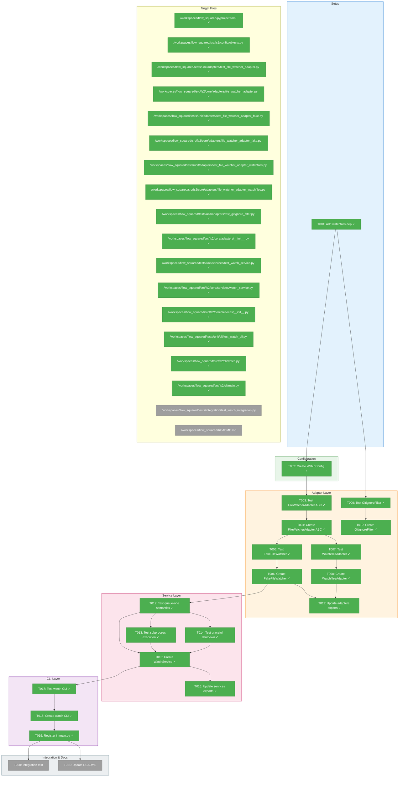
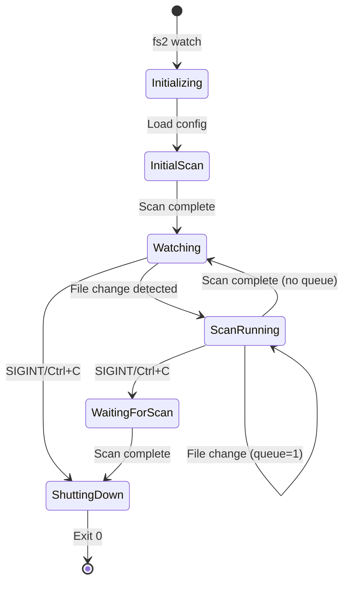
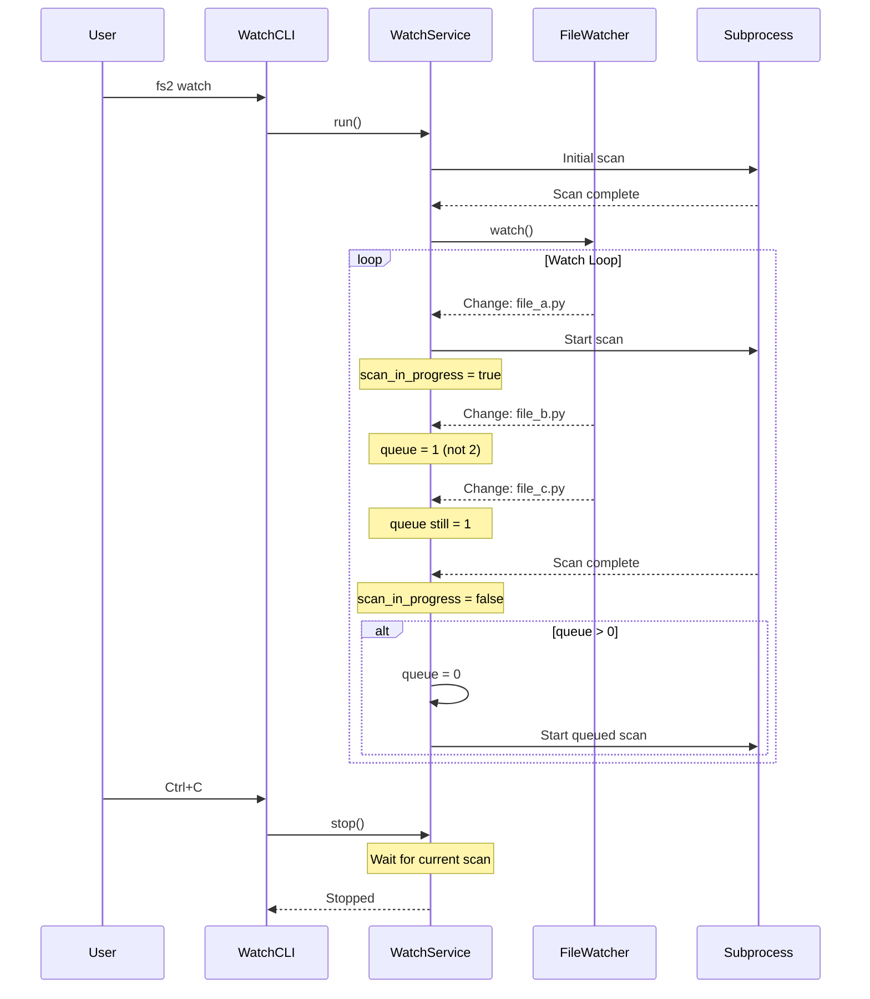

# Watch Mode Implementation – Tasks & Alignment Brief

**Spec**: [../../watch-mode-spec.md](../../watch-mode-spec.md)
**Plan**: [../../watch-mode-plan.md](../../watch-mode-plan.md)
**Date**: 2026-01-11
**Mode**: Simple (single-phase, inline tasks)
**Phase Slug**: `full-implementation`

---

## Executive Briefing

### Purpose
This implementation adds `fs2 watch` command that monitors directories for file changes and automatically triggers `fs2 scan` using subprocess isolation, debouncing, and queue-one semantics. Without this, developers must manually run `fs2 scan` after every code change, interrupting flow and causing stale code graphs.

### What We're Building
A complete watch system consisting of:
- **WatchConfig**: Pydantic configuration for debounce timing, watch paths, and ignore patterns
- **FileWatcherAdapter ABC**: Abstract interface for file change detection
- **FakeFileWatcher**: Test double for unit testing service logic
- **WatchfilesAdapter**: Production adapter wrapping the `watchfiles` library with gitignore filtering
- **WatchService**: Business logic layer implementing queue-one semantics and subprocess isolation
- **watch CLI command**: Typer command with Rich output, registered with `@require_init` guard

### User Value
Real-time code intelligence updates during development. As developers edit code, the graph stays current without manual intervention, enabling accurate search results, tree navigation, and MCP tool responses.

### Example
```bash
# Start watching (initial scan runs automatically)
$ fs2 watch
[10:30:45] Scanning: 142 files
[10:30:47] Graph updated: 1,847 nodes
[10:30:47] Watching for changes... (Ctrl+C to stop)

# Developer edits src/calculator.py - scan triggers automatically
[10:32:15] Change detected: src/calculator.py
[10:32:15] Scanning: 142 files
[10:32:17] Graph updated: 1,852 nodes

# Multiple rapid edits - queue-one semantics batch them
[10:33:01] Change detected: src/utils.py (scan in progress, queued)
[10:33:02] Change detected: src/main.py (scan queued)
[10:33:03] Scan complete. Running queued scan...
[10:33:05] Graph updated: 1,855 nodes

# Ctrl+C for graceful shutdown
^C
[10:35:00] Stopped.
```

---

## Objectives & Scope

### Objective
Implement `fs2 watch` command per spec acceptance criteria AC1-AC12, enabling automatic code graph updates on file changes with cross-platform support.

### Behavior Checklist (from Spec)
- [ ] AC1: Basic watch triggers scan on file change
- [ ] AC2: Queue-one semantics (multiple changes = one queued scan)
- [ ] AC3: Cross-platform (Linux, macOS, Windows)
- [ ] AC4: Gitignore patterns respected
- [ ] AC5: Debounce batches rapid changes
- [ ] AC6: Subprocess isolation (stable memory)
- [ ] AC7: Graceful shutdown on Ctrl+C
- [ ] AC8: Scan argument pass-through (--no-embeddings, --verbose)
- [ ] AC9: Configuration integration (WatchConfig from YAML/env)
- [ ] AC10: Error resilience (scan failure doesn't stop watcher)
- [ ] AC11: Startup information displayed
- [ ] AC12: Initial scan on startup

### Goals

- ✅ Add `watchfiles` dependency for cross-platform file watching
- ✅ Create WatchConfig with debounce_ms, watch_paths, additional_ignores
- ✅ Implement FileWatcherAdapter ABC with watch() async generator and stop()
- ✅ Implement FakeFileWatcher for comprehensive unit testing
- ✅ Implement WatchfilesAdapter with GitignoreFilter
- ✅ Implement WatchService with queue-one semantics and subprocess isolation
- ✅ Create watch CLI command with Typer and Rich output
- ✅ Register command in main.py with @require_init guard
- ✅ Write comprehensive TDD tests (tests first, then implementation)

### Non-Goals (Scope Boundaries)

- ❌ IDE plugin integration (CLI-only per spec)
- ❌ Incremental scanning (full scan each time per spec)
- ❌ Remote file watching (local filesystem only)
- ❌ Custom scan commands (always `fs2 scan`)
- ❌ Parallel scans (one at a time with queue-one)
- ❌ Background daemon mode (foreground only)
- ❌ File content diffing (filesystem events only)
- ❌ Session statistics (simple "Stopped." message per clarification)
- ❌ Performance optimization (defer to future phases)

---

## Architecture Map

### Component Diagram
<!-- Status: grey=pending, orange=in-progress, green=completed, red=blocked -->
<!-- Updated by plan-6 during implementation -->



### Task-to-Component Mapping

<!-- Status: ⬜ Pending | 🟧 In Progress | ✅ Complete | 🔴 Blocked -->

| Task | Component(s) | Files | Status | Comment |
|------|-------------|-------|--------|---------|
| T001 | Dependencies | pyproject.toml | ✅ Complete | Add watchfiles>=0.21 after tree-sitter |
| T002 | Configuration | config/objects.py | ✅ Complete | WatchConfig with __config_path__ = "watch" |
| T003 | Adapter ABC Test | tests/unit/adapters/test_file_watcher_adapter.py | ✅ Complete | TDD: ABC contract tests |
| T004 | Adapter ABC | adapters/file_watcher_adapter.py | ✅ Complete | watch() async generator, stop() method |
| T005 | Fake Adapter Test | tests/unit/adapters/test_file_watcher_adapter_fake.py | ✅ Complete | TDD: Fake behavior tests |
| T006 | Fake Adapter | adapters/file_watcher_adapter_fake.py | ✅ Complete | add_changes(), watch_calls, stop() |
| T007 | Watchfiles Test | tests/unit/adapters/test_file_watcher_adapter_watchfiles.py | ✅ Complete | TDD: Debounce, filter, stop tests |
| T008 | Watchfiles Impl | adapters/file_watcher_adapter_watchfiles.py | ✅ Complete | Wrap watchfiles.awatch |
| T009 | GitignoreFilter Test | tests/unit/adapters/test_gitignore_filter.py | ✅ Complete | TDD: Pattern matching tests |
| T010 | GitignoreFilter | adapters/file_watcher_adapter_watchfiles.py | ✅ Complete | Extend watchfiles.DefaultFilter |
| T011 | Adapter Exports | adapters/__init__.py | ✅ Complete | Add FileWatcherAdapter to __all__ |
| T012 | Queue-One Test | tests/unit/services/test_watch_service.py | ✅ Complete | TDD: Exactly one queued scan |
| T013 | Subprocess Test | tests/unit/services/test_watch_service.py | ✅ Complete | TDD: Command construction |
| T014 | Shutdown Test | tests/unit/services/test_watch_service.py | ✅ Complete | TDD: Graceful SIGINT handling |
| T015 | WatchService | services/watch_service.py | ✅ Complete | Queue-one, subprocess, shutdown |
| T016 | Service Exports | services/__init__.py | ✅ Complete | Add WatchService to __all__ |
| T017 | CLI Test | tests/unit/cli/test_watch_cli.py | ✅ Complete | TDD: Args, exit codes, guard |
| T018 | watch CLI | cli/watch.py | ✅ Complete | Typer command with Rich output |
| T019 | CLI Registration | cli/main.py | ✅ Complete | app.command with require_init |
| T020 | Integration Test | tests/integration/test_watch_integration.py | ⬜ Pending | E2E with real file changes |
| T021 | Documentation | README.md | ⬜ Pending | Add watch usage examples |

---

## Tasks

| Status | ID | Task | CS | Type | Dependencies | Absolute Path(s) | Validation | Subtasks | Notes |
|--------|-----|------|----|------|--------------|------------------|------------|----------|-------|
| [x] | T001 | Add watchfiles dependency to pyproject.toml | 1 | Setup | – | `/workspaces/flow_squared/pyproject.toml` | `uv pip install -e .` succeeds, `import watchfiles` works | – | Insert alphabetically after tree-sitter-language-pack; Per Finding 13 |
| [x] | T002 | Create WatchConfig in config/objects.py | 1 | Core | T001 | `/workspaces/flow_squared/src/fs2/config/objects.py` | Config loads with `FS2_WATCH__DEBOUNCE_MS=2000` | – | Fields: debounce_ms (1600), watch_paths, additional_ignores, scan_timeout_seconds (300); Per Finding 04, DYK-2 |
| [x] | T003 | Write tests for FileWatcherAdapter ABC | 2 | Test | T001 | `/workspaces/flow_squared/tests/unit/adapters/test_file_watcher_adapter.py` | Tests define expected interface contract | – | TDD: Test ABC can't be instantiated, methods are abstract; Per Finding 02 |
| [x] | T004 | Create FileWatcherAdapter ABC | 1 | Core | T003 | `/workspaces/flow_squared/src/fs2/core/adapters/file_watcher_adapter.py` | ABC with `watch()` async generator, `stop()` method | – | Returns `AsyncIterator[set[tuple[str, str]]]`; Per Finding 02 |
| [x] | T005 | Write tests for FakeFileWatcher | 2 | Test | T004 | `/workspaces/flow_squared/tests/unit/adapters/test_file_watcher_adapter_fake.py` | Tests validate fake behavior | – | Test `add_changes()`, auto-stop after queue empty; Per Finding 06, DYK-4 |
| [x] | T006 | Create FakeFileWatcher implementation | 2 | Core | T005 | `/workspaces/flow_squared/src/fs2/core/adapters/file_watcher_adapter_fake.py` | Fake passes all tests from T005 | – | Finite queue + auto-stop pattern; Per Finding 06, DYK-4 |
| [x] | T007 | Write tests for WatchfilesAdapter | 2 | Test | T004 | `/workspaces/flow_squared/tests/unit/adapters/test_file_watcher_adapter_watchfiles.py` | Tests cover debounce, filter, stop_event | – | Use real watchfiles with tmp_path; Per Finding 07 |
| [x] | T008 | Create WatchfilesAdapter implementation | 2 | Core | T007 | `/workspaces/flow_squared/src/fs2/core/adapters/file_watcher_adapter_watchfiles.py` | Adapter passes all tests from T007 | – | Wrap watchfiles.awatch with GitignoreFilter |
| [x] | T009 | Write tests for GitignoreFilter | 2 | Test | T001 | `/workspaces/flow_squared/tests/unit/adapters/test_gitignore_filter.py` | Tests cover .gitignore + additional_ignores | – | Test pattern matching with tmp_path; Per Finding 09 |
| [x] | T010 | Create GitignoreFilter class | 2 | Core | T009 | `/workspaces/flow_squared/src/fs2/core/adapters/file_watcher_adapter_watchfiles.py` | Filter passes all tests from T009 | – | Extends watchfiles.DefaultFilter; reuse pathspec |
| [x] | T011 | Update adapters/__init__.py exports | 1 | Core | T006,T008 | `/workspaces/flow_squared/src/fs2/core/adapters/__init__.py` | `from fs2.core.adapters import FileWatcherAdapter` works | – | Add to __all__ list; Per Finding 12 |
| [x] | T012 | Write tests for WatchService queue-one semantics | 3 | Test | T006 | `/workspaces/flow_squared/tests/unit/services/test_watch_service.py` | Tests verify exactly one queued scan | – | Use FakeFileWatcher, FakeScanRunner; Per spec AC2 |
| [x] | T013 | Write tests for WatchService subprocess execution | 2 | Test | T012 | `/workspaces/flow_squared/tests/unit/services/test_watch_service.py` | Tests verify subprocess command construction | – | Test uvx fallback to sys.executable; Per Finding 11 |
| [x] | T014 | Write tests for WatchService graceful shutdown | 2 | Test | T012 | `/workspaces/flow_squared/tests/unit/services/test_watch_service.py` | Tests verify stop_event triggers shutdown | – | Test SIGINT handler behavior; Per Finding 10 |
| [x] | T015 | Create WatchService implementation | 3 | Core | T012,T013,T014 | `/workspaces/flow_squared/src/fs2/core/services/watch_service.py` | Service passes all tests from T012-T014 | – | Queue-one, subprocess isolation, graceful shutdown; Per Finding 03, DYK-3 (start watcher before initial scan) |
| [x] | T016 | Update services/__init__.py exports | 1 | Core | T015 | `/workspaces/flow_squared/src/fs2/core/services/__init__.py` | `from fs2.core.services import WatchService` works | – | Add to __all__ list; Per Finding 12 |
| [x] | T017 | Write tests for watch CLI command | 2 | Test | T015 | `/workspaces/flow_squared/tests/unit/cli/test_watch_cli.py` | Tests cover args, exit codes, guard | – | Use CliRunner with NO_COLOR=1; Per Finding 14 |
| [x] | T018 | Create watch CLI command | 2 | Core | T017 | `/workspaces/flow_squared/src/fs2/cli/watch.py` | CLI passes all tests from T017 | – | Typer command with @require_init guard; Per Finding 01 |
| [x] | T019 | Register watch command in main.py | 1 | Core | T018 | `/workspaces/flow_squared/src/fs2/cli/main.py` | `fs2 watch --help` works | – | `app.command(name="watch")(require_init(watch))`; Per Finding 01 |
| [ ] | T020 | Write integration test for watch command | 2 | Test | T019 | `/workspaces/flow_squared/tests/integration/test_watch_integration.py` | E2E test with real file changes | – | Use tmp_path, short timeout; Per spec AC1 |
| [ ] | T021 | Update README.md with watch usage | 1 | Docs | T019 | `/workspaces/flow_squared/README.md` | README includes watch examples | – | Add to CLI Commands section |
| [x] | T022 | Add scan timeout for change-triggered scans | 2 | Core | T015 | `/workspaces/flow_squared/src/fs2/core/services/watch_service.py`, `/workspaces/flow_squared/src/fs2/config/objects.py` | Subprocess killed after timeout, watch continues | – | Per DYK-2: No timeout on initial scan; default 300s for subsequent |

---

## Alignment Brief

### Critical Findings Affecting This Implementation

From plan § Critical Research Findings:

| # | Finding | Impact | Addressed By |
|---|---------|--------|--------------|
| 01 | CLI Registration uses `app.command(name="X")(require_init(X))` pattern | Must follow existing pattern exactly | T018, T019 |
| 02 | Adapter ABC Pattern: Three files required (ABC, Fake, Impl) | Structure adapter layer correctly | T003-T010 |
| 03 | Service DI Pattern: Services receive ConfigurationService registry | WatchService takes config, extracts WatchConfig internally | T015 |
| 04 | Config Objects use `__config_path__` ClassVar for YAML/env mapping | WatchConfig needs `__config_path__ = "watch"` | T002 |
| 05 | ConsoleAdapter ABC: CLI uses RichConsoleAdapter, passes to services via callbacks | Use console adapter for Rich output | T018 |
| 06 | Fake Adapters for Testing: Use FakeFileWatcher (not mocks), state-driven | Implement proper fake with add_changes() | T005, T006 |
| 07 | Async Testing: Use `@pytest.mark.asyncio`, `asyncio.timeout()` | All service tests must be async with timeout guards | T012-T014 |
| 08 | Exit Codes: 0=success, 1=config error, 2=data error | Watch exits 0 on Ctrl+C, 1 on missing config | T017, T018 |
| 09 | Gitignore Reuse: FileSystemScanner has gitignore logic via pathspec | Reuse pathspec pattern matching in watch filter | T009, T010 |
| 10 | Windows Signal Handling: SIGINT works everywhere, SIGTERM Unix-only | Guard SIGTERM with `hasattr()` and try/except | T014, T015 |
| 11 | Subprocess Pattern: Use `asyncio.create_subprocess_exec()` with output streaming | Stream subprocess stdout in real-time | T013, T015 |
| 12 | Export Registration: Update `__init__.py` in adapters/ and services/ | Add FileWatcherAdapter and WatchService exports | T011, T016 |
| 13 | Dependency Addition: Add to pyproject.toml dependencies alphabetically | Insert `"watchfiles>=0.21"` after tree-sitter | T001 |
| 14 | CliRunner Testing: Use `typer.testing.CliRunner`, `NO_COLOR=1` | Disable Rich in CLI tests | T017 |
| 15 | Config Validation: Use `@field_validator` for WatchConfig constraints | Validate debounce_ms range (100-60000) | T002 |

### Invariants & Guardrails

- **Memory**: Watch process memory must remain stable over extended periods (subprocess isolation)
- **Debounce**: Default 1600ms batches rapid changes
- **Queue**: Maximum one scan queued at any time (queue-one semantics)
- **Shutdown**: Always wait for in-progress scan before exiting

### Inputs to Read

| File | Purpose |
|------|---------|
| `/workspaces/flow_squared/src/fs2/core/adapters/file_scanner.py` | ABC pattern reference |
| `/workspaces/flow_squared/src/fs2/core/adapters/file_scanner_fake.py` | Fake pattern reference |
| `/workspaces/flow_squared/src/fs2/core/adapters/file_scanner_impl.py` | Gitignore/pathspec usage |
| `/workspaces/flow_squared/src/fs2/config/objects.py` | Config object patterns |
| `/workspaces/flow_squared/src/fs2/cli/scan.py` | CLI command pattern |
| `/workspaces/flow_squared/src/fs2/cli/main.py` | Command registration |
| `/workspaces/flow_squared/scripts/fs2-watch.sh` | Reference implementation |

### Visual Alignment Aids

#### System State Flow



#### Queue-One Sequence Diagram



### Test Plan (Full TDD)

Per spec clarification Q2: Full TDD approach with targeted mocks (Q3).

#### Adapter Tests

| Test | File | Purpose | Fixtures | Expected |
|------|------|---------|----------|----------|
| `test_file_watcher_adapter_is_abstract` | test_file_watcher_adapter.py | ABC contract | None | TypeError on instantiation |
| `test_file_watcher_adapter_has_watch_method` | test_file_watcher_adapter.py | Interface | None | Has async watch() generator |
| `test_file_watcher_adapter_has_stop_method` | test_file_watcher_adapter.py | Interface | None | Has stop() method |
| `test_fake_file_watcher_emits_programmed_changes` | test_file_watcher_adapter_fake.py | Fake behavior | Pre-programmed changes | Yields changes in order |
| `test_fake_file_watcher_tracks_watch_calls` | test_file_watcher_adapter_fake.py | Fake tracking | None | watch_calls increments |
| `test_fake_file_watcher_stop_exits_loop` | test_file_watcher_adapter_fake.py | Stop behavior | None | Generator exits cleanly |
| `test_watchfiles_adapter_debounces` | test_file_watcher_adapter_watchfiles.py | Debounce | tmp_path with files | Single batch for rapid changes |
| `test_watchfiles_adapter_filters_gitignore` | test_file_watcher_adapter_watchfiles.py | Gitignore | tmp_path + .gitignore | Ignored files not yielded |
| `test_watchfiles_adapter_stop_exits` | test_file_watcher_adapter_watchfiles.py | Stop | tmp_path | Generator exits on stop() |
| `test_gitignore_filter_respects_patterns` | test_gitignore_filter.py | Filter | tmp_path + patterns | Returns True for ignored |
| `test_gitignore_filter_additional_ignores` | test_gitignore_filter.py | Config ignores | additional_ignores list | Returns True for config patterns |

#### Service Tests

| Test | File | Purpose | Fixtures | Expected |
|------|------|---------|----------|----------|
| `test_queue_one_exactly_one_queued_scan` | test_watch_service.py | Queue-one | FakeFileWatcher, FakeScanRunner | scan_count == 2 |
| `test_queue_one_no_queue_when_idle` | test_watch_service.py | No unnecessary queue | Single change | scan_count == 1 |
| `test_subprocess_uses_uvx_when_available` | test_watch_service.py | uvx preference | Mock shutil.which | Command starts with "uvx" |
| `test_subprocess_falls_back_to_sys_executable` | test_watch_service.py | Fallback | Mock shutil.which returns None | Command uses sys.executable |
| `test_subprocess_passes_arguments` | test_watch_service.py | Arg pass-through | --no-embeddings flag | Args in subprocess command |
| `test_graceful_shutdown_waits_for_scan` | test_watch_service.py | Graceful | Long-running fake scan | Scan completes before exit |
| `test_graceful_shutdown_exits_zero` | test_watch_service.py | Exit code | Normal shutdown | Exit code 0 |
| `test_scan_failure_continues_watching` | test_watch_service.py | Resilience | FakeScanRunner returns 1 | Watch continues |

#### CLI Tests

| Test | File | Purpose | Fixtures | Expected |
|------|------|---------|----------|----------|
| `test_watch_requires_init` | test_watch_cli.py | Guard | tmp_path without .fs2 | Exit code 1 |
| `test_watch_help_works` | test_watch_cli.py | Help | None | Exit code 0, help text |
| `test_watch_passes_no_embeddings` | test_watch_cli.py | Arg pass-through | Mock WatchService | --no-embeddings passed |
| `test_watch_displays_startup_info` | test_watch_cli.py | Startup | Mock WatchService | Output contains paths |

### Step-by-Step Implementation Outline

```
1. T001: Add watchfiles dependency
   - Edit pyproject.toml
   - Run uv pip install -e .
   - Verify import watchfiles works

2. T002: Create WatchConfig
   - Add to src/fs2/config/objects.py
   - Fields: debounce_ms, watch_paths, additional_ignores
   - Add @field_validator for debounce_ms range
   - Add to YAML_CONFIG_TYPES list

3. T003-T004: FileWatcherAdapter ABC
   - Write test_file_watcher_adapter.py (TDD)
   - Create file_watcher_adapter.py with ABC

4. T005-T006: FakeFileWatcher
   - Write test_file_watcher_adapter_fake.py (TDD)
   - Create file_watcher_adapter_fake.py

5. T009-T010: GitignoreFilter
   - Write test_gitignore_filter.py (TDD)
   - Create GitignoreFilter in file_watcher_adapter_watchfiles.py

6. T007-T008: WatchfilesAdapter
   - Write test_file_watcher_adapter_watchfiles.py (TDD)
   - Create WatchfilesAdapter with GitignoreFilter

7. T011: Update adapters/__init__.py
   - Add imports and __all__ entries

8. T012-T014: WatchService tests (TDD)
   - Write all service tests first
   - Test queue-one, subprocess, shutdown

9. T015: Create WatchService
   - Implement to pass all service tests

10. T016: Update services/__init__.py
    - Add WatchService to exports

11. T017-T018: watch CLI
    - Write CLI tests (TDD)
    - Create cli/watch.py

12. T019: Register command
    - Add to main.py

13. T020: Integration test
    - E2E test with tmp_path

14. T021: Update README
    - Add usage examples
```

### Commands to Run

```bash
# Install dependencies
uv pip install -e .

# Run all tests
pytest tests/ -v

# Run specific test file
pytest tests/unit/adapters/test_file_watcher_adapter.py -v

# Run with coverage
pytest tests/ --cov=fs2 --cov-report=term-missing

# Type checking
# (no mypy configured, skip)

# Linting
ruff check src/ tests/
ruff format src/ tests/

# Verify watch command
fs2 watch --help
```

### Risks & Unknowns

| Risk | Severity | Mitigation |
|------|----------|------------|
| Windows signal handling limitations | Medium | Guard SIGTERM with hasattr(), use asyncio.Event |
| watchfiles platform quirks | Low | Library battle-tested by uvicorn; fallback to polling |
| Subprocess memory isolation | Low | uvx provides full isolation; fallback to sys.executable |
| Gitignore edge cases | Low | Reuse proven pathspec library patterns |
| Large codebase file watching | Low | Native OS notifications + debouncing handle this well |
| **Graph store concurrent access** | Medium | **Known limitation** - see DYK-1 below |

### Known Limitations (Future Work)

**DYK-1: Graph Store Concurrent Access Risk**
- **Issue**: `NetworkXGraphStore.save()` writes directly to `graph.pickle` without atomic write pattern or file locking
- **Impact**: If user runs `fs2 search` or `fs2 tree` while watch-triggered scan is writing, they may get corrupted data or crashes
- **Workaround**: Users should wait for "Graph updated" message before querying
- **Future Fix**: Add atomic write (temp file + rename) to `NetworkXGraphStore.save()` in a separate subtask
- **Decision**: Out of scope for watch mode; pre-existing issue affecting all concurrent access

**DYK-2: Scan Timeout Strategy**
- **Issue**: Subprocess scans could hang indefinitely (API timeout, I/O stall, bug)
- **Solution**: Add `scan_timeout_seconds` to WatchConfig (default: 300s = 5 minutes)
- **Initial scan exception**: No timeout on initial scan (can take 40+ minutes with embeddings on large repos)
- **Behavior**: Kill hung subprocess after timeout, log error, continue watching
- **Config field**: `scan_timeout_seconds: int = 300` with validator (min 60, max 3600)
- **Task**: T022 added to implement this

**DYK-3: Watcher Start Order (Race Condition Prevention)**
- **Issue**: Files changing during initial scan would be missed if watcher starts after scan
- **Solution**: Start FileWatcher BEFORE initial scan begins
- **Sequence**:
  1. Start FileWatcher (begins collecting changes)
  2. Run initial scan (no timeout)
  3. If queue > 0 (changes during scan), run queued scan
  4. Enter normal watch loop
- **Benefit**: Queue-one semantics naturally handle changes during scan
- **Impact**: WatchService.run() must follow this order; affects T015 implementation

**DYK-4: FakeFileWatcher Termination Design**
- **Issue**: Tests need deterministic way to terminate watch() async generator
- **Solution**: Finite Queue + Auto-Stop pattern
- **Behavior**:
  1. `add_changes()` queues pre-programmed change sets
  2. `watch()` yields each change set in order
  3. After queue empty, automatically raises StopAsyncIteration
  4. Service sees watcher stop and exits gracefully
- **Test pattern**:
  ```python
  fake_watcher = FakeFileWatcher()
  fake_watcher.add_changes({("modified", "a.py")})  # Triggers scan
  fake_watcher.add_changes({("modified", "b.py")})  # Queued
  # watch() yields 2 times, then auto-stops
  await service.run()  # Returns deterministically
  assert scanner.scan_count == 2
  ```
- **Benefit**: No timeouts, no flaky tests, simple mental model
- **Impact**: Affects T005/T006 FakeFileWatcher design

**DYK-5: Scan Failure Visibility (KISS)**
- **Issue**: Repeated scan failures could go unnoticed
- **Decision**: Keep it simple - log errors and continue (per AC10)
- **Rationale**: KISS principle; users can check logs if they notice stale data
- **No extra complexity**: No failure counters, no status indicators, no auto-exit
- **Future consideration**: If users report this as a pain point, revisit

### Ready Check

- [ ] Plan read and understood
- [ ] Spec acceptance criteria clear (AC1-AC12)
- [ ] Critical findings incorporated (01-15)
- [ ] All 21 tasks have absolute paths
- [ ] Test plan covers all behaviors
- [ ] Implementation order respects dependencies
- [ ] No ADRs to reference (N/A for this feature)

**Awaiting explicit GO/NO-GO before implementation.**

---

## Phase Footnote Stubs

_To be populated by plan-6 during implementation._

| Ref | Task | Description | File:Line |
|-----|------|-------------|-----------|
| | | | |

---

## Evidence Artifacts

- **Execution Log**: `tasks/full-implementation/execution.log.md` (created by plan-6)
- **Test Results**: pytest output captured in execution log
- **Coverage Report**: pytest-cov output

---

## Discoveries & Learnings

_Populated during implementation by plan-6. Log anything of interest to your future self._

| Date | Task | Type | Discovery | Resolution | References |
|------|------|------|-----------|------------|------------|
| | | | | | |

**Types**: `gotcha` | `research-needed` | `unexpected-behavior` | `workaround` | `decision` | `debt` | `insight`

**What to log**:
- Things that didn't work as expected
- External research that was required
- Implementation troubles and how they were resolved
- Gotchas and edge cases discovered
- Decisions made during implementation
- Technical debt introduced (and why)
- Insights that future phases should know about

_See also: `execution.log.md` for detailed narrative._

---

## Directory Layout

```
docs/plans/020-watch-mode/
├── research-dossier.md           # Research findings
├── watch-mode-spec.md            # Feature specification
├── watch-mode-plan.md            # Implementation plan
└── tasks/
    └── full-implementation/
        ├── tasks.md              # This file
        └── execution.log.md      # Created by plan-6
```

---

**Next Step**: Run `/plan-6-implement-phase --plan "docs/plans/020-watch-mode/watch-mode-plan.md"` after GO confirmation.
