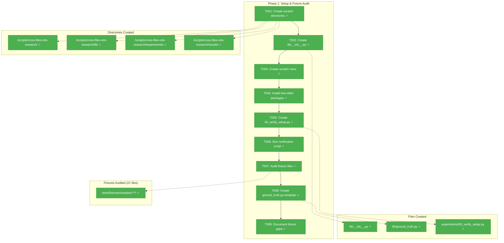
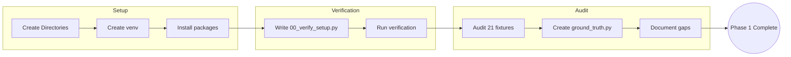
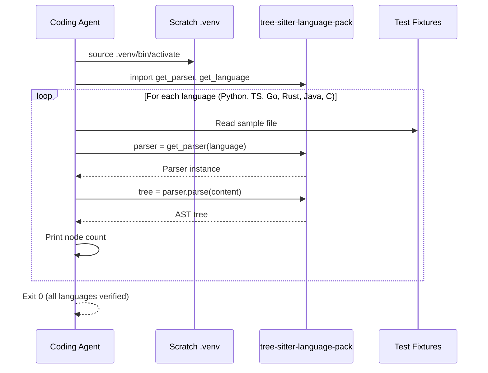

# Phase 1: Setup & Fixture Audit – Tasks & Alignment Brief

**Phase Slug**: `phase-1-setup-fixture-audit`
**Spec**: [cross-file-experimentation-spec.md](/workspaces/flow_squared/docs/plans/022-cross-file-rels/cross-file-experimentation-spec.md)
**Plan**: [cross-file-experimentation-plan.md](/workspaces/flow_squared/docs/plans/022-cross-file-rels/cross-file-experimentation-plan.md)
**Date**: 2026-01-12

---

## Executive Briefing

### Purpose
This phase establishes the isolated scratch environment for Tree-sitter experimentation and documents the current state of test fixtures. Without this foundation, subsequent phases cannot validate extraction scripts or measure accuracy against ground truth.

### What We're Building
A complete scratch workspace (`/workspaces/flow_squared/scripts/cross-files-rels-research/`) containing:
- Isolated Python virtual environment with Tree-sitter packages
- Modular directory structure for shared libraries, experiments, and results
- A verification script proving Tree-sitter works across target languages
- Comprehensive audit of all 21 existing fixture files
- Ground truth template for measuring extraction accuracy in later phases

### User Value
Enables systematic experimentation with cross-file relationship detection without risking production code or polluting the main project dependencies.

### Example
**Before**: No scratch environment, fixtures undocumented, no ground truth schema
**After**:
```
/workspaces/flow_squared/scripts/cross-files-rels-research/
├── .venv/                    # Isolated tree-sitter environment
├── lib/
│   ├── __init__.py
│   └── ground_truth.py       # ExpectedRelation schema ready
├── experiments/
│   └── 00_verify_setup.py    # Proves tree-sitter parses Python/TS/Go
└── results/                  # Empty, ready for Phase 2
```

---

## Objectives & Scope

### Objective
Establish scratch environment and document current fixture state per Plan § Phase 1 acceptance criteria:
- [x] All experiment scripts can `import lib.parser` successfully ✓
- [x] Tree-sitter can parse Python, TypeScript, Go, Rust, Java, C files ✓
- [x] Audit table documents all 21 fixtures with import analysis ✓
- [x] Ground truth template ready for population ✓

### Goals

- ✅ Create modular directory structure per Finding 07 (`lib/`, `experiments/`, `results/`)
- ✅ Install tree-sitter and tree-sitter-language-pack in isolated venv
- ✅ Verify Tree-sitter parses files in 6 target languages
- ✅ Audit all 21 fixture files for current imports (expect: stdlib only)
- ✅ Create ground truth template with ExpectedRelation dataclass per Finding 08
- ✅ Document fixture gaps for Phase 3 enrichment planning

### Non-Goals

- ❌ Creating extraction scripts (Phase 2)
- ❌ Enriching fixtures with cross-file relationships (Phase 3)
- ❌ Writing formal unit tests (Lightweight testing approach)
- ❌ Modifying pyproject.toml or production dependencies
- ❌ Populating ground truth with actual entries (template only)
- ❌ Performance benchmarking of Tree-sitter parsing

---

## Architecture Map

### Component Diagram
<!-- Status: grey=pending, orange=in-progress, green=completed, red=blocked -->
<!-- Updated by plan-6 during implementation -->



### Task-to-Component Mapping

<!-- Status: ⬜ Pending | 🟧 In Progress | ✅ Complete | 🔴 Blocked -->

| Task | Component(s) | Files | Status | Comment |
|------|-------------|-------|--------|---------|
| T001 | Directory Structure | `/workspaces/flow_squared/scripts/cross-files-rels-research/{lib,experiments,results}/` | ✅ Complete | Create modular layout per Finding 07 |
| T002 | Package Marker | `/workspaces/flow_squared/scripts/cross-files-rels-research/lib/__init__.py` | ✅ Complete | Enable `import lib.parser` |
| T003 | Virtual Environment | `/workspaces/flow_squared/scripts/cross-files-rels-research/.venv/` | ✅ Complete | Isolated Python env |
| T004 | Dependencies | `.venv/` (tree-sitter, tree-sitter-language-pack) | ✅ Complete | Install via pip |
| T005 | Verification Script | `/workspaces/flow_squared/scripts/cross-files-rels-research/experiments/00_verify_setup.py` | ✅ Complete | Proves tree-sitter works |
| T006 | Setup Validation | N/A (runtime) | ✅ Complete | Execute 00_verify_setup.py |
| T007 | Fixture Audit | `/workspaces/flow_squared/tests/fixtures/samples/**/*` (21 files) | ✅ Complete | Document all imports |
| T008 | Ground Truth Template | `/workspaces/flow_squared/scripts/cross-files-rels-research/lib/ground_truth.py` | ✅ Complete | Per Finding 08 schema |
| T009 | Gap Analysis | Audit output → gap list | ✅ Complete | Informs Phase 3 enrichment |

---

## Tasks

| Status | ID | Task | CS | Type | Dependencies | Absolute Path(s) | Validation | Subtasks | Notes |
|--------|------|------|-----|------|--------------|------------------|------------|----------|-------|
| [x] | T001 | Create scratch directory structure with lib/, experiments/, results/ subdirectories | 1 | Setup | – | `/workspaces/flow_squared/scripts/cross-files-rels-research/`, `/workspaces/flow_squared/scripts/cross-files-rels-research/lib/`, `/workspaces/flow_squared/scripts/cross-files-rels-research/experiments/`, `/workspaces/flow_squared/scripts/cross-files-rels-research/results/` | `ls -la /workspaces/flow_squared/scripts/cross-files-rels-research/{lib,experiments,results}/` returns all 3 dirs | – | Per Finding 07 modular architecture |
| [x] | T002 | Create lib/__init__.py package marker to enable imports | 1 | Setup | T001 | `/workspaces/flow_squared/scripts/cross-files-rels-research/lib/__init__.py` | File exists, `python -c "import sys; sys.path.insert(0, '/workspaces/flow_squared/scripts/cross-files-rels-research'); import lib"` succeeds | – | Plan task 1.1 |
| [x] | T003 | Create isolated Python virtual environment in scratch directory | 1 | Setup | T001 | `/workspaces/flow_squared/scripts/cross-files-rels-research/.venv/` | `.venv/bin/python --version` returns Python 3.x | – | Plan task 1.2 |
| [x] | T004 | Install tree-sitter and tree-sitter-language-pack in scratch venv, pin versions | 1 | Setup | T003 | `/workspaces/flow_squared/scripts/cross-files-rels-research/.venv/`, `/workspaces/flow_squared/scripts/cross-files-rels-research/requirements.txt` | `pip list \| grep tree-sitter` shows both packages AND `python -c "from tree_sitter_language_pack import get_parser; print(get_parser('python'))"` succeeds AND `requirements.txt` exists | – | Plan task 1.2; API verification per insight #1; version pinning per insight #3 |
| [x] | T005 | Create experiments/00_verify_setup.py with FIXTURE_MAP constant mapping 6 languages to specific fixture files, then parse each | 2 | Core | T002, T004 | `/workspaces/flow_squared/scripts/cross-files-rels-research/experiments/00_verify_setup.py` | Script exists, ~40-60 LOC, includes FIXTURE_MAP = {"python": "python/auth_handler.py", "typescript": "javascript/app.ts", "go": "go/server.go", "rust": "rust/lib.rs", "java": "java/UserService.java", "c": "c/algorithm.c"} | – | Plan task 1.3; explicit mapping per insight #2 |
| [x] | T006 | Run 00_verify_setup.py and verify Tree-sitter parses all 6 target languages | 1 | Validation | T005 | N/A (runtime) | Script exits 0, prints AST node counts for each language | – | Plan task 1.3 |
| [x] | T007 | Audit all 21 fixture files: document language, imports (via tree-sitter for code), potential reference types (for non-code), cross-file refs | 2 | Analysis | T006 | `/workspaces/flow_squared/tests/fixtures/samples/**/*` (21 files) | Audit table with 21 rows: file, language, current imports, potential ref types (per external-research.md), cross-file refs (expect: 0) | – | Plan task 1.4; ref types inform Phase 2 per insight #4 |
| [x] | T008 | Create lib/ground_truth.py with ExpectedRelation dataclass and empty GROUND_TRUTH list | 1 | Core | T002 | `/workspaces/flow_squared/scripts/cross-files-rels-research/lib/ground_truth.py` | File contains ExpectedRelation dataclass matching Finding 08 schema, GROUND_TRUTH = [] | – | Plan task 1.5, per Finding 08 |
| [x] | T009 | Document fixture gaps: list missing fixture types per language for Phase 3 enrichment | 1 | Analysis | T007 | Execution log | Gap list identifies: Python needs app_service.py, JS needs index.ts, MD needs execution-log.md | – | Plan task 1.6 |

---

## Alignment Brief

### Prior Phases Review

**N/A** – This is Phase 1 (foundational phase). No prior phases to review.

### Critical Findings Affecting This Phase

| Finding | Title | Constraint/Requirement | Tasks Addressing |
|---------|-------|------------------------|------------------|
| Finding 07 | Modular Script Architecture | Create `lib/`, `experiments/`, `results/` subdirectories instead of flat structure | T001, T002 |
| Finding 08 | Ground Truth Reference Table | Use explicit `ExpectedRelation` dataclass schema with source_file, target_file, target_symbol, rel_type, expected_confidence fields | T008 |

### ADR Decision Constraints

**N/A** – No ADRs exist in `/workspaces/flow_squared/docs/adr/`.

### Invariants & Guardrails

- **Isolation**: All tree-sitter packages install in scratch `.venv/` only, never in main project
- **No Production Changes**: No modifications to `src/`, `pyproject.toml`, or existing test files
- **Fixture Preservation**: Audit is read-only; fixtures not modified until Phase 3

### Inputs to Read

| File | Purpose |
|------|---------|
| `/workspaces/flow_squared/tests/fixtures/samples/**/*` (21 files) | Audit for current imports |
| `/workspaces/flow_squared/docs/plans/022-cross-file-rels/cross-file-experimentation-plan.md` § Finding 07, 08 | Ground truth schema, directory structure |

### Visual Alignment Aids

#### Flow Diagram: Phase 1 Workflow



#### Sequence Diagram: Tree-sitter Verification



### Test Plan (Lightweight)

Per spec Testing Strategy: **Lightweight** approach.

| Test | Type | Rationale | Expected Output |
|------|------|-----------|-----------------|
| Run `00_verify_setup.py` | Smoke | Proves tree-sitter works for all 6 languages | Exit code 0, prints node counts |
| `import lib` in Python | Import | Validates package structure | No ImportError |
| `pip list \| grep tree-sitter` | Install | Confirms dependencies | Shows 2 packages |

**No formal unit tests required** – validation is console output demonstrating functionality.

**Phase 2 Validation Note** (per insight #5): Phase 2 experiments validate via console output (e.g., seeing "found: dataclasses, datetime, enum" proves extraction works). Formal ground truth validation is deferred to Phase 3 when cross-file relationships are added. This keeps experimentation lightweight per spec.

### Step-by-Step Implementation Outline

1. **T001**: `mkdir -p` for all 4 directories
2. **T002**: Create empty `__init__.py` with docstring
3. **T003**: `python -m venv .venv`
4. **T004**: `source .venv/bin/activate && pip install tree-sitter tree-sitter-language-pack`
5. **T005**: Write verification script that:
   - Imports `tree_sitter_language_pack.get_parser`
   - Defines FIXTURE_MAP = {"python": "python/auth_handler.py", "typescript": "javascript/app.ts", "go": "go/server.go", "rust": "rust/lib.rs", "java": "java/UserService.java", "c": "c/algorithm.c"}
   - For each language in FIXTURE_MAP: parse the mapped fixture file, count nodes, print result
6. **T006**: Execute script, verify exit code 0
7. **T007**: For each of 21 fixture files:
   - Identify language from extension
   - For code files: parse with tree-sitter, extract imports (stdlib only expected)
   - For non-code files: note potential reference types per external-research.md:
     * Dockerfile: COPY, FROM, CMD paths
     * YAML: $ref, anchors, file paths
     * Markdown: links [text](path), node_ids in backticks
     * JSON: main, dependencies
     * Terraform: module, source
     * SQL, TOML, Bash: note as config/script (minimal refs)
   - Record: file path, language, current imports, potential ref types, cross-file refs (expect: 0)
   - Output markdown table (this informs Phase 2 extraction patterns)
8. **T008**: Create `ground_truth.py` with:
   - `ExpectedRelation` dataclass per Finding 08
   - Empty `GROUND_TRUTH: list[ExpectedRelation] = []`
9. **T009**: From audit, identify gaps:
   - Python: needs `app_service.py` importing from `auth_handler.py`, `data_parser.py`
   - JavaScript: needs `index.ts` importing from `app.ts`, `utils.js`, `component.tsx`
   - Markdown: needs `execution-log.md` with node_id patterns

### Commands to Run

```bash
# T001: Create directories
mkdir -p /workspaces/flow_squared/scripts/cross-files-rels-research/{lib,experiments,results}

# T002: Create __init__.py
echo '"""Shared library modules for cross-file relationship experiments."""' > /workspaces/flow_squared/scripts/cross-files-rels-research/lib/__init__.py

# T003: Create venv
cd /workspaces/flow_squared/scripts/cross-files-rels-research && python -m venv .venv

# T004: Install packages + verify API + pin versions
cd /workspaces/flow_squared/scripts/cross-files-rels-research && source .venv/bin/activate && pip install tree-sitter tree-sitter-language-pack && python -c "from tree_sitter_language_pack import get_parser; print('API OK:', get_parser('python'))" && pip freeze > requirements.txt

# T005: (Create script via editor/Write tool)

# T006: Run verification
cd /workspaces/flow_squared/scripts/cross-files-rels-research && source .venv/bin/activate && python experiments/00_verify_setup.py

# T007: Audit fixtures
find /workspaces/flow_squared/tests/fixtures/samples -type f | wc -l  # Should be 21

# Verify __init__.py works
cd /workspaces/flow_squared/scripts/cross-files-rels-research && source .venv/bin/activate && python -c "import sys; sys.path.insert(0, '.'); import lib; print('lib import OK')"
```

### Risks & Unknowns

| Risk | Severity | Likelihood | Mitigation |
|------|----------|------------|------------|
| tree-sitter-language-pack missing a grammar | Medium | Low | Document missing language, work around with subset |
| Python version incompatibility | Low | Low | Devcontainer uses Python 3.12, should be compatible |
| Fixture count changed since research | Low | Low | `find` command will show actual count |

### Ready Check

- [x] Phase 1 is foundational (no prior phase dependencies)
- [x] Critical Findings 07, 08 mapped to tasks T001, T002, T008
- [x] ADR constraints mapped to tasks – **N/A** (no ADRs exist)
- [x] All 21 fixture files identified for audit
- [x] Commands specified with absolute paths
- [x] Lightweight testing approach honored (no formal tests)
- [ ] **Awaiting human GO/NO-GO**

---

## Phase Footnote Stubs

**NOTE**: This section will be populated during implementation by plan-6a-update-progress.

| Footnote | Task | Description | Date |
|----------|------|-------------|------|
| | | | |

---

## Evidence Artifacts

| Artifact | Location | Purpose |
|----------|----------|---------|
| Execution Log | `/workspaces/flow_squared/docs/plans/022-cross-file-rels/tasks/phase-1-setup-fixture-audit/execution.log.md` | Detailed narrative of implementation |
| Fixture Audit Table | Embedded in execution log | Documents all 21 fixtures |
| Gap Analysis | Embedded in execution log | Informs Phase 3 enrichment |

---

## Discoveries & Learnings

_Populated during implementation by plan-6. Log anything of interest to your future self._

| Date | Task | Type | Discovery | Resolution | References |
|------|------|------|-----------|------------|------------|
| | | | | | |

**Types**: `gotcha` | `research-needed` | `unexpected-behavior` | `workaround` | `decision` | `debt` | `insight`

**What to log**:
- Things that didn't work as expected
- External research that was required
- Implementation troubles and how they were resolved
- Gotchas and edge cases discovered
- Decisions made during implementation
- Technical debt introduced (and why)
- Insights that future phases should know about

_See also: `execution.log.md` for detailed narrative._

---

## Directory Layout

```
/workspaces/flow_squared/docs/plans/022-cross-file-rels/
├── cross-file-experimentation-spec.md
├── cross-file-experimentation-plan.md
├── research-dossier.md
├── external-research.md
└── tasks/
    └── phase-1-setup-fixture-audit/
        ├── tasks.md              # This file
        └── execution.log.md      # Created by plan-6 during implementation
```

---

**Dossier Complete**: 2026-01-12
**Next Step**: Await human **GO** then run `/plan-6-implement-phase --phase "Phase 1: Setup & Fixture Audit"`

---

## Critical Insights Discussion

**Session**: 2026-01-12
**Context**: Phase 1 Tasks Dossier - Setup & Fixture Audit
**Analyst**: AI Clarity Agent
**Reviewer**: Development Team
**Format**: Water Cooler Conversation (5 Critical Insights)

### Insight 1: tree-sitter-language-pack API Uncertainty

**Did you know**: T005 assumes `from tree_sitter_language_pack import get_parser` works, but we hadn't verified this is the actual API.

**Implications**:
- If API differs, T005/T006 would fail on first run
- Wasted debugging time mid-implementation

**Options Considered**:
- Option A: Research API first (add task)
- Option B: Discovery during implementation
- Option C: Add API verification to T004

**AI Recommendation**: Option C
- Reasoning: Quick 5-second verification catches issues immediately after install

**Discussion Summary**: User agreed - minimal effort, maximum protection.

**Decision**: Add API verification command to T004 validation

**Action Items**:
- [x] T004 validation updated with `python -c "from tree_sitter_language_pack import get_parser; print(get_parser('python'))"`

**Affects**: T004

---

### Insight 2: Verification Script Fixture Mapping

**Did you know**: T005 says "parse Python, TS, Go, Rust, Java, C files" but doesn't specify WHICH fixture files map to which language.

**Implications**:
- 21 fixtures include 8 distinct parser types (not 6)
- Ambiguity leads to wrong file/parser combinations
- C parser on C++ file would likely fail

**Options Considered**:
- Option A: Expand to 8 languages
- Option B: Stick to 6 core, map explicitly
- Option C: Create FIXTURE_MAP constant in T005

**AI Recommendation**: Option C
- Reasoning: Explicit mapping is reusable by Phase 2 scripts

**Discussion Summary**: User agreed - removes ambiguity, becomes infrastructure.

**Decision**: T005 includes explicit FIXTURE_MAP constant

**Action Items**:
- [x] T005 updated with FIXTURE_MAP = {"python": "python/auth_handler.py", ...}

**Affects**: T005

---

### Insight 3: Version Pinning for Reproducibility

**Did you know**: `pip install tree-sitter tree-sitter-language-pack` without versions could cause mysterious failures if packages update mid-experiment.

**Implications**:
- Multi-day experimentation spans package releases
- Phase 2 scripts could fail due to API changes
- Debugging "what changed?" wastes hours

**Options Considered**:
- Option A: Pin versions via `pip freeze > requirements.txt`
- Option B: Pin explicit versions now
- Option C: Accept risk, don't pin

**AI Recommendation**: Option A
- Reasoning: Get latest versions, lock them, standard Python practice

**Discussion Summary**: User agreed - requirements.txt documents what worked.

**Decision**: Add `pip freeze > requirements.txt` after install

**Action Items**:
- [x] T004 command updated to include pip freeze

**Affects**: T004

---

### Insight 4: Fixture Audit Methodology

**Did you know**: T007 says "document imports" for 21 files but doesn't specify methodology, especially for non-code files.

**Implications**:
- 15 of 21 files are non-code (Dockerfile, YAML, Markdown, etc.)
- Simply marking "N/A" loses valuable information
- external-research.md shows non-code files HAVE extractable references

**Options Considered**:
- Option A: Manual audit, markdown only
- Option B: Tree-sitter for code, note "potential ref types" for non-code
- Option C: Full audit script

**AI Recommendation**: Option B
- Reasoning: Informs Phase 2/3 extraction patterns without extra scripting

**Discussion Summary**: User requested review of external-research.md first. Found that Dockerfile, YAML, Markdown, JSON, Terraform all have documented reference patterns. Refined Option B to include "Potential Ref Types" column.

**Decision**: Tree-sitter for code files; document potential reference types for non-code files per external-research.md

**Action Items**:
- [x] T007 updated with potential ref types column
- [x] Implementation outline expanded with ref type examples

**Affects**: T007

---

### Insight 5: Ground Truth Timeline Gap

**Did you know**: Phase 1 creates an EMPTY ground truth template, Phase 3 populates it, but Phase 2 runs experiments - what does Phase 2 validate against?

**Implications**:
- No structured validation for Phase 2 extraction
- "Scripts run" ≠ "Scripts extract correctly"
- Could miss bugs until Phase 3

**Options Considered**:
- Option A: Add stdlib ground truth in Phase 1
- Option B: Accept console validation for Phase 2
- Option C: Create STDLIB_EXPECTED dict during audit

**AI Recommendation**: Option B
- Reasoning: Spec says "Lightweight" - console output showing recognizable imports is sufficient for experimentation

**Discussion Summary**: User agreed - experimentation is about learning, not certifying.

**Decision**: Phase 2 validation is console-output based; formal ground truth validation deferred to Phase 3

**Action Items**:
- [x] Clarifying note added to Test Plan section

**Affects**: Alignment Brief / Test Plan

---

## Session Summary

**Insights Surfaced**: 5 critical insights identified and discussed
**Decisions Made**: 5 decisions reached through collaborative discussion
**Action Items Created**: 6 updates applied to tasks.md
**Areas Updated**:
- T004: API verification + version pinning
- T005: FIXTURE_MAP constant
- T007: Potential ref types column
- Test Plan: Phase 2 validation note
- Implementation Outline: Expanded T005 and T007 steps

**Shared Understanding Achieved**: ✓

**Confidence Level**: High - Key risks identified and mitigated before implementation.

**Next Steps**:
Proceed to implementation with `/plan-6-implement-phase --phase "Phase 1: Setup & Fixture Audit"`

**Notes**:
All insights improved implementation clarity without adding complexity. The "Lightweight" testing approach is preserved while adding practical safeguards (API verification, version pinning, explicit mappings).
