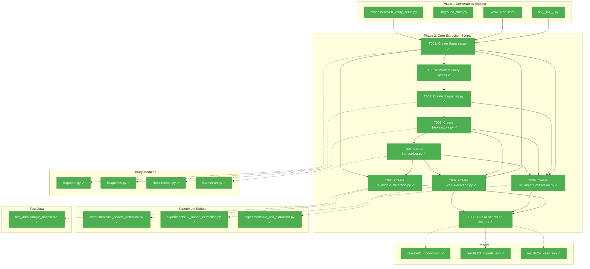
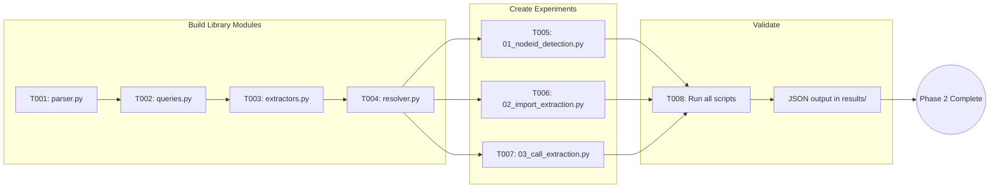
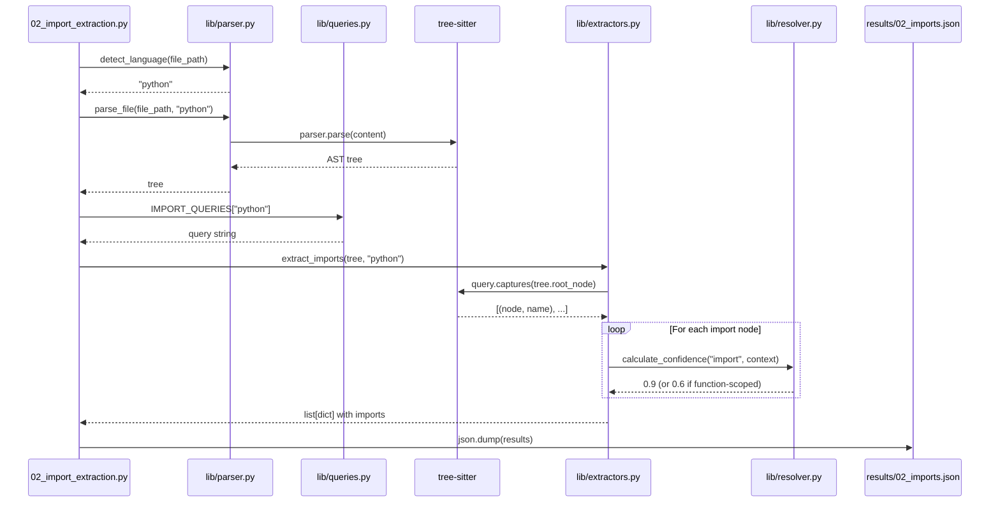
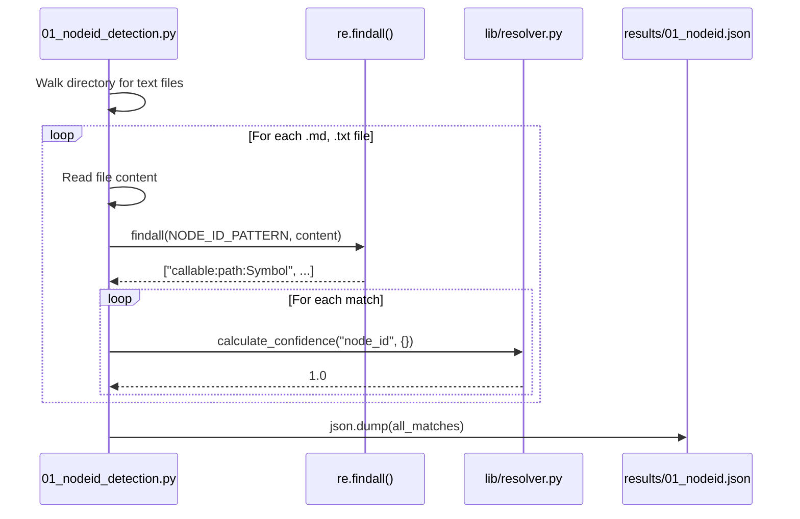

# Phase 2: Core Extraction Scripts – Tasks & Alignment Brief

**Phase Slug**: `phase-2-core-extraction-scripts`
**Spec**: [cross-file-experimentation-spec.md](/workspaces/flow_squared/docs/plans/022-cross-file-rels/cross-file-experimentation-spec.md)
**Plan**: [cross-file-experimentation-plan.md](/workspaces/flow_squared/docs/plans/022-cross-file-rels/cross-file-experimentation-plan.md)
**Date**: 2026-01-12

---

## Executive Briefing

### Purpose
This phase creates and validates extraction scripts against the existing stdlib imports in fixture files. Before enriching fixtures with cross-file relationships (Phase 3), we must prove that Tree-sitter-based extraction works reliably on known-good imports. This de-risks the overall experimentation by validating extraction logic incrementally.

### What We're Building
A complete extraction library and experiment suite in `/workspaces/flow_squared/scripts/cross-files-rels-research/`:
- **`lib/parser.py`**: Tree-sitter initialization and file parsing
- **`lib/queries.py`**: Query registry with language-specific Tree-sitter queries
- **`lib/extractors.py`**: Reusable extraction functions returning structured results
- **`lib/resolver.py`**: Confidence scoring logic implementing tiered heuristics
- **`experiments/01_nodeid_detection.py`**: Regex-based node_id extraction from text/markdown
- **`experiments/02_import_extraction.py`**: Tree-sitter import extraction for Python/TS/Go
- **`experiments/03_call_extraction.py`**: Method/function call extraction with receiver tracking
- **`test_data/sample_nodeid.md`**: Test data with known node_id patterns for validation

### User Value
Developers gain validated extraction patterns that can be directly translated to fs2 production code. Console output demonstrates extraction works on real fixture files, giving confidence before implementation.

### Example
**Input**: Parse `/workspaces/flow_squared/tests/fixtures/samples/python/auth_handler.py`
**Extracted Imports**:
```json
[
  {"module": "dataclasses", "names": ["dataclass"], "confidence": 0.9, "line": 1},
  {"module": "datetime", "names": ["datetime", "timedelta"], "confidence": 0.9, "line": 2},
  {"module": "enum", "names": ["Enum"], "confidence": 0.9, "line": 3},
  {"module": "uuid", "names": null, "confidence": 0.6, "line": 174, "scope": "function"}
]
```

---

## Objectives & Scope

### Objective
Create and validate extraction scripts against stdlib imports per Plan § Phase 2 acceptance criteria:
- [ ] All 4 experiment scripts run without errors
- [ ] Node ID detection extracts patterns from README.md code blocks (as examples)
- [ ] Import extraction finds stdlib imports in all Python fixtures
- [ ] Call extraction identifies method calls with receivers
- [ ] Confidence scoring assigns correct tiers

### Goals

- ✅ Create shared `lib/parser.py` for Tree-sitter initialization and file parsing
- ✅ Create `lib/queries.py` with query registry for Python, TypeScript, Go imports
- ✅ Create `lib/extractors.py` with reusable extraction functions
- ✅ Create `lib/resolver.py` implementing confidence scoring tiers per Finding 03
- ✅ Create `experiments/01_nodeid_detection.py` for regex-based node_id extraction
- ✅ Create `experiments/02_import_extraction.py` with import handling per Findings 02, 04, 05
- ✅ Create `experiments/03_call_extraction.py` with constructor patterns per Finding 03
- ✅ Validate all scripts against existing fixtures, producing JSON output in `results/`

### Non-Goals

- ❌ Creating new fixture files with cross-file relationships (Phase 3)
- ❌ Populating ground truth with expected relationships (Phase 3)
- ❌ Measuring precision/recall metrics (Phase 3 - no ground truth yet)
- ❌ Writing formal unit tests (Lightweight testing approach per spec)
- ❌ Handling GDScript or CUDA (edge cases identified in Phase 1 - out of scope)
- ❌ Parsing markdown code blocks as real imports (Finding 01 - skip or assign 0.1)
- ❌ Production-quality error handling (scratch scripts are throwaway)
- ❌ Performance optimization (functional correctness first)

---

## Architecture Map

### Component Diagram
<!-- Status: grey=pending, orange=in-progress, green=completed, red=blocked -->
<!-- Updated by plan-6 during implementation -->



### Task-to-Component Mapping

<!-- Status: ⬜ Pending | 🟧 In Progress | ✅ Complete | 🔴 Blocked -->

| Task | Component(s) | Files | Status | Comment |
|------|-------------|-------|--------|---------|
| T001 | Parser Infrastructure | `/workspaces/flow_squared/scripts/cross-files-rels-research/lib/parser.py` | ✅ Complete | Tree-sitter init, parse_file(), detect_language() |
| T001a | Query Syntax Validation | Console output (AST node inspection) | ✅ Complete | Print actual AST node names to validate query patterns |
| T002 | Query Registry | `/workspaces/flow_squared/scripts/cross-files-rels-research/lib/queries.py` | ✅ Complete | Per-language Tree-sitter queries for imports |
| T003 | Extractors | `/workspaces/flow_squared/scripts/cross-files-rels-research/lib/extractors.py` | ✅ Complete | Reusable import/call extraction functions |
| T004 | Confidence Resolver | `/workspaces/flow_squared/scripts/cross-files-rels-research/lib/resolver.py` | ✅ Complete | Tiered scoring per Finding 03 |
| T005 | Node ID Detection | `/workspaces/flow_squared/scripts/cross-files-rels-research/experiments/01_nodeid_detection.py`, `test_data/sample_nodeid.md` | ✅ Complete | Regex extraction per Finding 10; creates test data to validate regex |
| T006 | Import Extraction | `/workspaces/flow_squared/scripts/cross-files-rels-research/experiments/02_import_extraction.py` | ✅ Complete | Python/TS/Go imports with Tree-sitter |
| T007 | Call Extraction | `/workspaces/flow_squared/scripts/cross-files-rels-research/experiments/03_call_extraction.py` | ✅ Complete | Method calls with receiver tracking |
| T008 | Validation Run | `results/*.json` | ✅ Complete | Execute all scripts, capture JSON output |

---

## Tasks

| Status | ID | Task | CS | Type | Dependencies | Absolute Path(s) | Validation | Subtasks | Notes |
|--------|------|------|-----|------|--------------|------------------|------------|----------|-------|
| [x] | T001 | Create `lib/parser.py`: Tree-sitter initialization, parse_file(path, lang), detect_language(path) using extension mapping, optional tree caching | 2 | Core | – | `/workspaces/flow_squared/scripts/cross-files-rels-research/lib/parser.py` | `python -c "from lib.parser import parse_file, detect_language; from pathlib import Path; print(detect_language(Path('test.py')))"` returns `python` | – | Plan task 2.1; reuse FIXTURE_MAP pattern from 00_verify_setup.py |
| [x] | T001a | Validate Tree-sitter query syntax: Parse one fixture per language (Python, TypeScript, Go), print AST node types and field names to verify query patterns match actual grammar. Document correct node names for T002. | 1 | Validation | T001 | Console output | Prints node types like `import_statement`, `import_from_statement` for Python; documents actual field names | – | Per didyouknow insight #1; prevents query debugging in T002 |
| [x] | T002 | Create `lib/queries.py`: IMPORT_QUERIES dict with Tree-sitter query strings for Python (import_statement, import_from_statement), TypeScript (import_statement with type differentiation per Finding 02), Go (import_declaration with dot/blank import handling per Finding 05) | 2 | Core | T001a | `/workspaces/flow_squared/scripts/cross-files-rels-research/lib/queries.py` | File contains IMPORT_QUERIES dict with keys "python", "typescript", "go"; queries are valid S-expression syntax | – | Plan task 2.2; per Finding 02, 05 |
| [x] | T003 | Create `lib/extractors.py`: extract_imports(tree, lang) returning list[dict] with module, names, line, confidence; extract_calls(tree, lang) returning list[dict] with function, receiver, args, line, confidence. **Must include parent-traversal logic** to detect function-scoped imports (walk node.parent chain to check for function_definition ancestor → assign 0.6 instead of 0.9) | 2 | Core | T001, T002 | `/workspaces/flow_squared/scripts/cross-files-rels-research/lib/extractors.py` | `python -c "from lib.extractors import extract_imports, extract_calls; print('Functions defined')"` succeeds | – | Plan task 2.5; per didyouknow insight #2: function-scope detection via parent traversal, not query patterns |
| [x] | T004 | Create `lib/resolver.py`: calculate_confidence(rel_type, context, lang=None) implementing tier logic: 1.0 for node_ids, 0.9 for explicit imports, 0.8 for self-calls, 0.6 for typed receivers/function-scoped imports, 0.5 for type-only imports, 0.3 for inference required, 0.1 for fuzzy. **Language-specific constructor confidence**: Python PascalCase→0.5 else→0.3; JS/Java with `new`→0.8; Go `NewXxx()`→0.6 | 2 | Core | – | `/workspaces/flow_squared/scripts/cross-files-rels-research/lib/resolver.py` | `python -c "from lib.resolver import calculate_confidence; assert calculate_confidence('import', {}) == 0.9"` succeeds | – | Plan task 2.7; per Finding 03 tiers; per didyouknow insight #3: language-specific constructor heuristics |
| [x] | T005 | Create `experiments/01_nodeid_detection.py`: Scan text files for fs2 node_id patterns using regex `\b(file|callable|type):[\w./]+:[\w.]+\b` per Finding 10. **Also create `test_data/sample_nodeid.md`** with known node_id patterns to validate regex works. Accept directory path as CLI arg, output JSON with matches | 2 | Core | T001 | `/workspaces/flow_squared/scripts/cross-files-rels-research/experiments/01_nodeid_detection.py`, `/workspaces/flow_squared/scripts/cross-files-rels-research/test_data/sample_nodeid.md` | `python experiments/01_nodeid_detection.py test_data/` returns JSON with 3+ matches from sample_nodeid.md | – | Plan task 2.3; confidence 1.0 tier; per didyouknow insight #4: test_data validates regex works; Phase 3 should add node_ids to fixtures/README.md |
| [x] | T006 | Create `experiments/02_import_extraction.py`: Use lib/parser.py and lib/queries.py to extract imports from Python, TypeScript, Go fixtures. Handle function-scoped imports per Finding 04, differentiate type-only imports per Finding 02. Accept directory path as CLI arg, output JSON | 3 | Core | T001, T002, T003, T004 | `/workspaces/flow_squared/scripts/cross-files-rels-research/experiments/02_import_extraction.py` | Script finds stdlib imports in auth_handler.py (dataclasses, datetime, enum), app.ts (events), server.go (context, encoding/json, etc.) | – | Plan task 2.4; per Finding 02, 04, 05 |
| [x] | T007 | Create `experiments/03_call_extraction.py`: Extract function/method calls with receiver tracking. Start with constructor patterns only (ClassName() calls) per Finding 03. **Pass language to resolver** for language-specific confidence (Python PascalCase→0.5, JS `new`→0.8, Go `NewXxx`→0.6). Accept directory path as CLI arg, output JSON | 3 | Core | T001, T003, T004 | `/workspaces/flow_squared/scripts/cross-files-rels-research/experiments/03_call_extraction.py` | Script identifies constructor calls in fixtures (e.g., AuthHandler() in auth_handler.py with confidence 0.5, EventEmitter() in app.ts) | – | Plan task 2.6; per Finding 03 tiers; per didyouknow insight #3: use resolver's language-specific constructor confidence |
| [x] | T008 | Run all scripts on existing fixtures, capture JSON output to results/ directory: `01_nodeid.json`, `02_imports.json`, `03_calls.json`. Verify scripts exit 0, output is valid JSON | 1 | Validation | T005, T006, T007 | `/workspaces/flow_squared/scripts/cross-files-rels-research/results/01_nodeid.json`, `/workspaces/flow_squared/scripts/cross-files-rels-research/results/02_imports.json`, `/workspaces/flow_squared/scripts/cross-files-rels-research/results/03_calls.json` | All 3 JSON files exist, `python -c "import json; json.load(open('results/01_nodeid.json'))"` succeeds for each | – | Plan task 2.8 |

---

## Alignment Brief

### Prior Phases Review

#### Phase 1: Setup & Fixture Audit (Complete)

**A. Deliverables Created**
| Path | Type | Purpose |
|------|------|---------|
| `/workspaces/flow_squared/scripts/cross-files-rels-research/` | Directory | Root scratch workspace |
| `/workspaces/flow_squared/scripts/cross-files-rels-research/lib/` | Directory | Shared library modules |
| `/workspaces/flow_squared/scripts/cross-files-rels-research/experiments/` | Directory | Experiment scripts |
| `/workspaces/flow_squared/scripts/cross-files-rels-research/results/` | Directory | JSON output (empty, ready) |
| `/workspaces/flow_squared/scripts/cross-files-rels-research/.venv/` | Directory | Isolated venv |
| `/workspaces/flow_squared/scripts/cross-files-rels-research/lib/__init__.py` | File | Package marker |
| `/workspaces/flow_squared/scripts/cross-files-rels-research/lib/ground_truth.py` | File | ExpectedRelation dataclass |
| `/workspaces/flow_squared/scripts/cross-files-rels-research/experiments/00_verify_setup.py` | File | Tree-sitter verification |
| `/workspaces/flow_squared/scripts/cross-files-rels-research/requirements.txt` | File | Pinned dependencies |

**B. Lessons Learned**
- API verification before scripting catches issues immediately (insight #1)
- Explicit FIXTURE_MAP removes ambiguity, becomes reusable infrastructure (insight #2)
- Version pinning via `pip freeze > requirements.txt` ensures reproducibility (insight #3)
- Script at 88 LOC (vs 40-60 planned) - clarity over brevity is acceptable

**C. Technical Discoveries**
- Node counts vary significantly by language (904-2057 nodes for similar files)
- GDScript and CUDA are edge cases not in tree-sitter-language-pack standard
- Non-code files (8 of 21) have significant reference extraction potential:
  - Dockerfile: COPY paths, FROM images, CMD scripts
  - Kubernetes YAML: configMapRef, secretRef, image refs
  - Markdown: links, node_id patterns in backticks
  - JSON/package.json: main entry, dependencies
- Ruby's `require` statements are functionally equivalent to Python imports

**D. Dependencies Exported (Available to Phase 2)**
| Export | Location | Signature |
|--------|----------|-----------|
| `ExpectedRelation` | `lib/ground_truth.py:9` | Frozen dataclass with 5 fields + validation |
| `GROUND_TRUTH` | `lib/ground_truth.py:37` | `list[ExpectedRelation] = []` (empty) |
| `FIXTURE_MAP` | `experiments/00_verify_setup.py:15` | `dict[str, str]` lang→path mapping |
| `count_nodes()` | `experiments/00_verify_setup.py:25` | `count_nodes(node) -> int` |
| `verify_language()` | `experiments/00_verify_setup.py:33` | `(lang, path) -> (bool, int, str)` |

**E. Critical Findings Applied in Phase 1**
- Finding 07 (Modular Architecture): Created lib/, experiments/, results/ structure
- Finding 08 (Ground Truth Schema): Implemented ExpectedRelation dataclass

**F. Incomplete/Blocked Items**: None (100% complete)

**G. Test Infrastructure**
- Smoke test: `00_verify_setup.py` verifies Tree-sitter parses 6 languages
- Validation: Console output, exit code 0

**H. Technical Debt**
- `count_nodes()` is naive recursive (sufficient for now)
- FIXTURE_MAP in 00_verify_setup.py could be centralized in lib/

**I. Architectural Decisions**
- Frozen dataclasses for ground truth (immutability)
- Validation in `__post_init__` (early error detection)
- Console output validation (lightweight per spec)

**J. Scope Changes**: None (on track)

**K. Key Log References**
- API verification: execution.log.md T004 Evidence
- Script clarity decision: execution.log.md T005 Discoveries
- Non-code file potential: execution.log.md T007 Discoveries
- Phase 3 prioritization: execution.log.md T009 Gap Analysis

#### Cumulative Deliverables (Phase 1)
All files available to Phase 2:
- `.venv/` with tree-sitter 0.25.2, tree-sitter-language-pack 0.13.0
- `requirements.txt` for reproducible installs
- `lib/__init__.py`, `lib/ground_truth.py`
- `experiments/00_verify_setup.py`

#### Pattern Evolution
- **Phase 1**: Established modular structure, FIXTURE_MAP pattern, frozen dataclass pattern
- **Phase 2**: Extends with shared lib modules, applies findings to extraction logic

#### Reusable Infrastructure
- FIXTURE_MAP can be imported from `00_verify_setup.py` or centralized
- `lib/` package structure ready for new modules

---

### Critical Findings Affecting This Phase

| Finding | Title | Constraint/Requirement | Tasks Addressing |
|---------|-------|------------------------|------------------|
| Finding 02 | TypeScript Type-Only Imports | Differentiate `import type` from regular imports; assign 0.5 confidence to type-only | T002 (queries), T006 (import extraction) |
| Finding 03 | Method Call Confidence Tiers | Downgrade confidence: 0.8 self-calls, 0.6 typed receiver, 0.3 inference required | T004 (resolver), T007 (call extraction) |
| Finding 04 | Python Function-Scoped Imports | Tree-sitter queries find all import_statement nodes; assign 0.6 for function-scoped | T002 (queries), T006 (import extraction) |
| Finding 05 | Go Dot/Blank Imports | Handle `. "fmt"` (dot) and `_ "driver"` (blank) imports; 0.7 aliases, 0.4 dot, 0.3 blank | T002 (queries), T006 (import extraction) |
| Finding 10 | Node ID Delimiter Ambiguity | Use strict regex `\b(file|callable|type):[\w./]+:[\w.]+\b`; validate IDs before creating edges | T005 (node_id detection) |

### ADR Decision Constraints

**N/A** – No ADRs exist in `/workspaces/flow_squared/docs/adr/`.

### Invariants & Guardrails

- **Isolation**: All scripts use `.venv/` from Phase 1; no main project dependencies modified
- **No Production Changes**: No modifications to `src/`, `pyproject.toml`, or production test files
- **Fixture Preservation**: Existing fixtures are read-only; new fixtures deferred to Phase 3
- **Lightweight Validation**: Console output demonstrates extraction works; no formal tests

### Inputs to Read

| File | Purpose |
|------|---------|
| `/workspaces/flow_squared/tests/fixtures/samples/python/auth_handler.py` | Primary Python fixture for import extraction testing |
| `/workspaces/flow_squared/tests/fixtures/samples/python/data_parser.py` | Secondary Python fixture |
| `/workspaces/flow_squared/tests/fixtures/samples/javascript/app.ts` | TypeScript fixture for import/type testing |
| `/workspaces/flow_squared/tests/fixtures/samples/go/server.go` | Go fixture for import testing |
| `/workspaces/flow_squared/tests/fixtures/samples/markdown/README.md` | Markdown fixture for node_id detection |
| `/workspaces/flow_squared/scripts/cross-files-rels-research/experiments/00_verify_setup.py` | Reference for FIXTURE_MAP pattern |
| `/workspaces/flow_squared/docs/plans/022-cross-file-rels/cross-file-experimentation-plan.md` § Finding 02-05, 10 | Critical constraints |

### Visual Alignment Aids

#### Flow Diagram: Phase 2 Workflow



#### Sequence Diagram: Import Extraction Flow



#### Sequence Diagram: Node ID Detection Flow



### Test Plan (Lightweight)

Per spec Testing Strategy: **Lightweight** approach.

| Test | Type | Rationale | Expected Output |
|------|------|-----------|-----------------|
| Run `01_nodeid_detection.py` | Smoke | Proves regex extraction works | Exit code 0, JSON with matches (or empty array if no node_ids in fixtures) |
| Run `02_import_extraction.py` | Smoke | Proves Tree-sitter import extraction | Exit code 0, JSON showing `dataclasses`, `datetime`, `enum` from auth_handler.py |
| Run `03_call_extraction.py` | Smoke | Proves call extraction with receivers | Exit code 0, JSON showing constructor patterns |
| `import lib.parser` | Import | Validates new module | No ImportError |
| `import lib.queries` | Import | Validates new module | No ImportError |
| `import lib.extractors` | Import | Validates new module | No ImportError |
| `import lib.resolver` | Import | Validates new module | No ImportError |
| Valid JSON output | Parse | Results are machine-readable | `json.load()` succeeds for all 3 result files |

**Console Validation**: Scripts print recognizable imports/calls (e.g., seeing "found: dataclasses, datetime, enum" proves extraction works).

**Note**: No formal precision/recall metrics until Phase 3 populates ground truth.

### Step-by-Step Implementation Outline

1. **T001**: Create `lib/parser.py`:
   - Define `LANG_MAP` dict: `.py`→`python`, `.ts`→`typescript`, etc.
   - Implement `detect_language(path: Path) -> str`
   - Implement `parse_file(path: Path, lang: str) -> Tree`
   - Import from `tree_sitter_language_pack import get_parser`

2. **T002**: Create `lib/queries.py`:
   - Define `IMPORT_QUERIES` dict with Tree-sitter S-expression queries
   - Python: `(import_statement)` and `(import_from_statement)`
   - TypeScript: Include type-only import detection per Finding 02
   - Go: Include dot/blank import handling per Finding 05
   - Define `CALL_QUERIES` dict for call extraction (used by T007)

3. **T003**: Create `lib/extractors.py`:
   - Implement `extract_imports(tree, lang) -> list[dict]`
   - Implement `extract_calls(tree, lang) -> list[dict]`
   - Each dict includes: module/function, names, line, confidence, context
   - Use `lib/queries.py` for query strings
   - Use `lib/resolver.py` for confidence scores

4. **T004**: Create `lib/resolver.py`:
   - Implement `calculate_confidence(rel_type: str, context: dict) -> float`
   - Tier logic per Finding 03:
     * `node_id`: 1.0
     * `import`: 0.9 (top-level), 0.6 (function-scoped per Finding 04)
     * `import_type`: 0.5 (per Finding 02)
     * `call_self`: 0.8
     * `call_typed`: 0.6
     * `call_inferred`: 0.3
     * `import_dot`: 0.4 (per Finding 05)
     * `import_blank`: 0.3 (per Finding 05)

5. **T005**: Create `experiments/01_nodeid_detection.py`:
   - Parse CLI arg for directory path
   - Walk directory for `.md`, `.txt`, `.log` files
   - Apply regex `\b(file|callable|type):[\w./]+:[\w.]+\b` per Finding 10
   - Collect matches with line numbers, file paths
   - Assign confidence 1.0 via resolver
   - Output JSON to stdout (redirect to results/)

6. **T006**: Create `experiments/02_import_extraction.py`:
   - Parse CLI arg for directory path
   - Use `detect_language()` to filter code files
   - For Python, TypeScript, Go files:
     * Parse with `parse_file()`
     * Extract with `extract_imports()`
     * Handle function-scoped imports per Finding 04
     * Differentiate type-only imports per Finding 02
   - Output JSON to stdout

7. **T007**: Create `experiments/03_call_extraction.py`:
   - Parse CLI arg for directory path
   - Focus on constructor patterns: `ClassName(args)`
   - Extract receiver for method calls: `obj.method(args)`
   - Apply confidence tiers per Finding 03
   - Output JSON to stdout

8. **T008**: Run validation:
   ```bash
   cd /workspaces/flow_squared/scripts/cross-files-rels-research
   source .venv/bin/activate
   python experiments/01_nodeid_detection.py /workspaces/flow_squared/tests/fixtures/samples/ > results/01_nodeid.json
   python experiments/02_import_extraction.py /workspaces/flow_squared/tests/fixtures/samples/ > results/02_imports.json
   python experiments/03_call_extraction.py /workspaces/flow_squared/tests/fixtures/samples/ > results/03_calls.json
   python -c "import json; [json.load(open(f'results/{f}')) for f in ['01_nodeid.json', '02_imports.json', '03_calls.json']]"
   ```

### Commands to Run

```bash
# Activate environment (for all tasks)
cd /workspaces/flow_squared/scripts/cross-files-rels-research && source .venv/bin/activate

# T001: Verify parser.py works
python -c "from lib.parser import parse_file, detect_language; from pathlib import Path; print('Lang:', detect_language(Path('test.py'))); tree = parse_file(Path('/workspaces/flow_squared/tests/fixtures/samples/python/auth_handler.py'), 'python'); print('Tree:', tree)"

# T002: Verify queries.py has expected keys
python -c "from lib.queries import IMPORT_QUERIES; print('Languages:', list(IMPORT_QUERIES.keys())); assert 'python' in IMPORT_QUERIES; assert 'typescript' in IMPORT_QUERIES; assert 'go' in IMPORT_QUERIES"

# T003: Verify extractors.py functions exist
python -c "from lib.extractors import extract_imports, extract_calls; print('Functions defined OK')"

# T004: Verify resolver.py confidence tiers
python -c "from lib.resolver import calculate_confidence; assert calculate_confidence('import', {}) == 0.9; assert calculate_confidence('node_id', {}) == 1.0; assert calculate_confidence('call_self', {}) == 0.8; print('Confidence tiers OK')"

# T005: Run node_id detection
python experiments/01_nodeid_detection.py /workspaces/flow_squared/tests/fixtures/samples/

# T006: Run import extraction
python experiments/02_import_extraction.py /workspaces/flow_squared/tests/fixtures/samples/

# T007: Run call extraction
python experiments/03_call_extraction.py /workspaces/flow_squared/tests/fixtures/samples/

# T008: Run all and save results
python experiments/01_nodeid_detection.py /workspaces/flow_squared/tests/fixtures/samples/ > results/01_nodeid.json
python experiments/02_import_extraction.py /workspaces/flow_squared/tests/fixtures/samples/ > results/02_imports.json
python experiments/03_call_extraction.py /workspaces/flow_squared/tests/fixtures/samples/ > results/03_calls.json

# Verify JSON validity
python -c "import json; [print(f'{f}: OK') for f in ['results/01_nodeid.json', 'results/02_imports.json', 'results/03_calls.json'] if json.load(open(f)) is not None or True]"
```

### Risks & Unknowns

| Risk | Severity | Likelihood | Mitigation |
|------|----------|------------|------------|
| Tree-sitter query syntax differs per language | Medium | Medium | Start with Python (most familiar), document patterns in queries.py |
| Import extraction misses edge cases | Medium | Medium | Focus on stdlib imports first; edge cases documented for Phase 3 |
| TypeScript type-only import detection complex | Medium | Low | Finding 02 provides query pattern; test against app.ts fixture |
| Go dot/blank import handling | Low | Medium | Finding 05 provides query patterns |
| No node_ids in current fixtures | Low | High | Expected - current fixtures don't have fs2 node_ids; empty result is valid |
| Call extraction ambiguity without types | Medium | High | Per Finding 03, start with constructor patterns only; defer method calls |

### Ready Check

- [x] Phase 1 review complete (all 9 tasks, 100% complete)
- [x] Phase 1 deliverables available (lib/, experiments/, .venv/, requirements.txt)
- [x] Critical Findings 02, 03, 04, 05, 10 mapped to tasks (T002, T004, T005, T006, T007)
- [x] ADR constraints mapped to tasks – **N/A** (no ADRs exist)
- [x] All fixture files identified for extraction testing
- [x] Commands specified with absolute paths
- [x] Lightweight testing approach honored (no formal tests)
- [ ] **Awaiting human GO/NO-GO**

---

## Phase Footnote Stubs

**NOTE**: This section will be populated during implementation by plan-6a-update-progress.

| Footnote | Task | Description | Date |
|----------|------|-------------|------|
| | | | |

---

## Evidence Artifacts

| Artifact | Location | Purpose |
|----------|----------|---------|
| Execution Log | `/workspaces/flow_squared/docs/plans/022-cross-file-rels/tasks/phase-2-core-extraction-scripts/execution.log.md` | Detailed narrative of implementation |
| Node ID Results | `/workspaces/flow_squared/scripts/cross-files-rels-research/results/01_nodeid.json` | Node ID detection output |
| Import Results | `/workspaces/flow_squared/scripts/cross-files-rels-research/results/02_imports.json` | Import extraction output |
| Call Results | `/workspaces/flow_squared/scripts/cross-files-rels-research/results/03_calls.json` | Call extraction output |

---

## Discoveries & Learnings

_Populated during implementation by plan-6. Log anything of interest to your future self._

| Date | Task | Type | Discovery | Resolution | References |
|------|------|------|-----------|------------|------------|
| | | | | | |

**Types**: `gotcha` | `research-needed` | `unexpected-behavior` | `workaround` | `decision` | `debt` | `insight`

**What to log**:
- Things that didn't work as expected
- External research that was required
- Implementation troubles and how they were resolved
- Gotchas and edge cases discovered
- Decisions made during implementation
- Technical debt introduced (and why)
- Insights that future phases should know about

_See also: `execution.log.md` for detailed narrative._

---

## Directory Layout

```
/workspaces/flow_squared/docs/plans/022-cross-file-rels/
├── cross-file-experimentation-spec.md
├── cross-file-experimentation-plan.md
├── research-dossier.md
├── external-research.md
└── tasks/
    ├── phase-1-setup-fixture-audit/
    │   ├── tasks.md
    │   └── execution.log.md
    └── phase-2-core-extraction-scripts/
        ├── tasks.md              # This file
        └── execution.log.md      # Created by plan-6 during implementation
```

---

**Dossier Complete**: 2026-01-12
**Next Step**: Await human **GO** then run `/plan-6-implement-phase --phase "Phase 2: Core Extraction Scripts"`

---

## Critical Insights Discussion

**Session**: 2026-01-12
**Context**: Phase 2: Core Extraction Scripts - Tasks & Alignment Brief
**Analyst**: AI Clarity Agent
**Reviewer**: Development Team
**Format**: Water Cooler Conversation (5 Critical Insights)

### Insight 1: Tree-sitter Query Syntax Validation Gap

**Did you know**: The Tree-sitter query patterns in lib/queries.py are theoretical and haven't been validated against actual grammar node names. Query syntax depends on the specific tree-sitter grammar version.

**Implications**:
- Queries may not match actual AST node names (e.g., `module_name` vs `module`)
- T006 could produce empty results if queries don't capture nodes
- Debugging query issues during T002 wastes time

**Options Considered**:
- Option A: Add Query Validation Task (T001a) - CS-1
- Option B: Exploratory development in T002
- Option C: Use Tree-sitter Playground first

**AI Recommendation**: Option A
- Reasoning: Minimal effort (CS-1) for significant risk reduction; creates reusable reference

**Discussion Summary**: User agreed to add T001a for query syntax validation.

**Decision**: Add T001a to validate Tree-sitter query syntax against actual AST node names before writing queries

**Action Items**:
- [x] Added T001a task to tasks table
- [x] Updated Architecture Map with T001a
- [x] Updated T002 dependency to T001a

**Affects**: Tasks table, Architecture Map, T002 dependencies

---

### Insight 2: Function-Scoped Import Detection Requires Parent Analysis

**Did you know**: Detecting function-scoped imports (Finding 04) can't be done purely with Tree-sitter query patterns - it requires post-query AST traversal to check parent nodes.

**Implications**:
- Tree-sitter queries return matching nodes but not context
- Distinguishing top-level vs function-scoped imports requires walking parent chain
- This logic belongs in extractors.py, not queries.py

**Options Considered**:
- Option A: Document as Extractors Responsibility
- Option B: Use Tree-sitter Query Predicates
- Option C: Skip Function-Scoped Detection in Phase 2

**AI Recommendation**: Option A
- Reasoning: Correct approach, keeps queries simple, ~15 LOC overhead for correctness

**Discussion Summary**: User agreed - keeps queries simple and handles complexity in extractors.

**Decision**: Function-scoped detection happens in extractors.py via parent-node traversal, not query patterns

**Action Items**:
- [x] Updated T003 notes with parent-traversal requirement

**Affects**: T003 (extractors.py)

---

### Insight 3: Python Constructor Detection Requires PascalCase Heuristic

**Did you know**: In Python's AST, there's no syntactic difference between calling a constructor and calling a regular function. The only signal is naming convention (PascalCase).

**Implications**:
- `DataParser()` and `parse_data()` look identical in AST
- Without type info, need heuristics for confidence scoring
- Different languages have different constructor syntax reliability

**Options Considered**:
- Option A: Add PascalCase Heuristic to Resolver
- Option B: Cross-Reference with Parsed Classes
- Option C: Treat All Python Calls as 0.3
- Option D: Language-Specific Confidence in Resolver

**AI Recommendation**: Option D
- Reasoning: Captures reality that different languages have different constructor detection reliability

**Discussion Summary**: User chose Option D for realistic per-language confidence.

**Decision**: Resolver handles language-specific constructor confidence with PascalCase heuristic for Python

**Action Items**:
- [x] Updated T004 with language-specific logic and lang parameter
- [x] Updated T007 to pass language to resolver

**Affects**: T004 (resolver.py), T007 (call extraction)

---

### Insight 4: Node ID Detection Will Return Empty Results Without Test Data

**Did you know**: T005 (node_id detection) will return empty results on current fixtures because they contain no fs2 node_ids - and empty `[]` could be misinterpreted as a broken script.

**Implications**:
- Current README.md has no fs2 node_id patterns
- Empty results are valid but confusing
- Need test data to prove regex actually works

**Options Considered**:
- Option A: Document Empty Results as Expected
- Option B: Add Test Node ID to README.md Now
- Option C: Create Minimal Test File in Phase 2
- Option D: Defer Node ID Testing to Phase 3

**AI Recommendation**: Option A
- Reasoning: Simple documentation, no fixture modifications

**Discussion Summary**: User chose Option C - create test data to validate regex works. Also noted Phase 3 should add node_ids to README.md.

**Decision**: Create test_data/sample_nodeid.md with known node_id patterns; defer README.md updates to Phase 3

**Action Items**:
- [x] Updated T005 to create test_data/sample_nodeid.md
- [x] Updated T005 validation to expect 3+ matches
- [x] Added TestData subgraph to Architecture Map
- [x] Added Phase 3 reminder in T005 notes

**Affects**: T005, Architecture Map, Phase 3 scope

---

### Insight 5: LOC Estimates Will Likely Be Exceeded

**Did you know**: Phase 1's `00_verify_setup.py` was 88 LOC (vs 40-60 planned), and Phase 2 modules will likely follow the same pattern - but that's acceptable because clarity matters more than minimal LOC.

**Implications**:
- LOC estimates are guidance, not hard limits
- Treating them as limits could cause corner-cutting
- Phase 1 precedent: "Prioritized clarity over brevity"

**Options Considered**:
- Option A: Document LOC as Guidance, Not Limits
- Option B: Remove LOC Estimates Entirely
- Option C: Update LOC Estimates to Realistic Numbers
- Option D: Keep As-Is (Accept Organic Growth)

**AI Recommendation**: Option A
- Reasoning: Simple documentation prevents misunderstanding

**Discussion Summary**: User chose Option B - remove LOC estimates entirely to let implementation determine size naturally.

**Decision**: Remove LOC estimates from all task descriptions

**Action Items**:
- [x] Removed LOC estimates from T001-T007 task descriptions
- [x] Removed LOC estimates from "What We're Building" section
- [x] Added test_data file to "What We're Building" section

**Affects**: All task descriptions, Executive Briefing

---

## Session Summary

**Insights Surfaced**: 5 critical insights identified and discussed
**Decisions Made**: 5 decisions reached through collaborative discussion
**Action Items Created**: 15+ updates applied to tasks.md
**Areas Updated**:
- Added T001a (query validation task)
- Updated T002 dependencies
- Updated T003 with parent-traversal requirement
- Updated T004 with language-specific confidence
- Updated T005 with test_data creation
- Updated T007 with resolver language parameter
- Removed LOC estimates from all tasks
- Updated Architecture Map with T001a and TestData

**Shared Understanding Achieved**: ✓

**Confidence Level**: High - Key implementation risks identified and mitigated before coding begins.

**Next Steps**:
Await human **GO** then run `/plan-6-implement-phase --phase "Phase 2: Core Extraction Scripts"`

**Notes**:
All insights improved implementation clarity. Key additions:
- T001a prevents query debugging issues
- Parent-traversal for function-scope detection
- Language-specific constructor heuristics
- Test data for node_id regex validation
- Removed artificial LOC constraints
