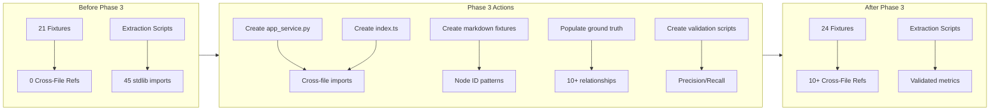
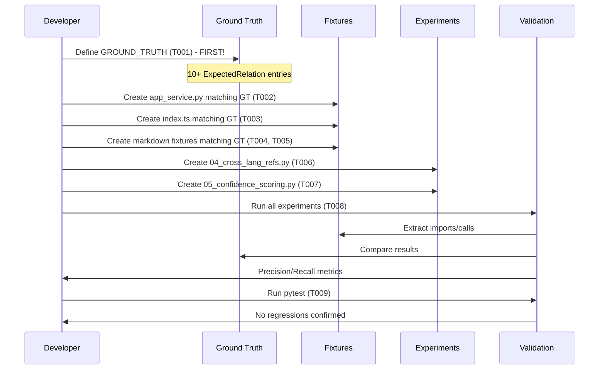

# Phase 3: Fixture Enrichment & Validation – Tasks & Alignment Brief

**Spec**: [cross-file-experimentation-spec.md](/workspaces/flow_squared/docs/plans/022-cross-file-rels/cross-file-experimentation-spec.md)
**Plan**: [cross-file-experimentation-plan.md](/workspaces/flow_squared/docs/plans/022-cross-file-rels/cross-file-experimentation-plan.md)
**Phase Slug**: `phase-3-fixture-enrichment-validation`
**Date**: 2026-01-12

---

## Executive Briefing

### Purpose
This phase creates test fixtures with deliberate cross-file relationships and validates that the extraction scripts built in Phase 2 can accurately detect them. Without enriched fixtures, we cannot measure precision/recall of our extraction techniques.

### What We're Building
A set of interconnected fixture files that create a realistic dependency graph:
- **Python orchestrator** (`app_service.py`) that imports from and calls existing `auth_handler.py` and `data_parser.py`
- **TypeScript aggregator** (`index.ts`) that imports from existing JS/TS fixtures
- **Markdown fixtures** with explicit fs2 node_id references (confidence 1.0)
- **Ground truth data** mapping all expected relationships with confidence scores
- **Two remaining experiment scripts** (04, 05) for cross-language refs and validation

### User Value
After this phase, we can measure actual precision/recall metrics for each extraction technique. This enables data-driven decisions about which techniques to implement in fs2 production code.

### Example
**Before Phase 3**: Extraction scripts find stdlib imports but can't validate cross-file detection accuracy
**After Phase 3**:
```
Ground Truth: app_service.py IMPORTS auth_handler.py (confidence 0.9)
Extracted:    app_service.py IMPORTS auth_handler.py (confidence 0.9)
Result:       TRUE POSITIVE - Precision/Recall validated
```

---

## Objectives & Scope

### Objective
Create enriched fixtures with known cross-file relationships and validate extraction accuracy against ground truth.

**Acceptance Criteria** (from plan, refined):
- [x] All 3 new fixture files created and syntactically valid (app_service.py, index.ts, execution-log.md)
- [x] Ground truth contains 10+ expected relationships (15 relationships defined)
- [x] Node ID detection achieves 100% precision/recall on execution-log.md (10 node_ids detected)
- [x] Import extraction achieves >90% **file-level** precision on cross-file imports (P=1.0, R=1.0)
- [x] Confidence RMSE ≤ 0.15 (RMSE=0.0)
- [x] `pytest tests/` passes after fixture changes (1724 passed, 20 skipped)

### Goals

- ✅ Create `app_service.py` with cross-file Python imports
- ✅ Create `index.ts` with cross-file TypeScript imports
- ✅ Create markdown fixtures with node_id references
- ✅ Populate `GROUND_TRUTH` with 10+ expected relationships
- ✅ Create `04_cross_lang_refs.py` for Dockerfile/YAML analysis
- ✅ Create `05_confidence_scoring.py` for validation metrics
- ✅ Run all experiments and capture precision/recall
- ✅ Verify no test regressions

### Non-Goals (Scope Boundaries)

- ❌ Modifying extraction logic in `lib/` modules (Phase 2 deliverables are frozen)
- ❌ Adding Go or Rust cross-file fixtures (focus on Python, TypeScript)
- ❌ Creating complex inheritance hierarchies (simple imports/calls only)
- ❌ Handling dynamic imports or lazy loading patterns
- ❌ Parsing non-fixture directories (only `tests/fixtures/samples/`)
- ❌ Full precision/recall for all languages (focus on Python, TypeScript, Go per plan)

---

## Architecture Map

### Component Diagram

```mermaid
flowchart TD
    classDef pending fill:#9E9E9E,stroke:#757575,color:#fff
    classDef inprogress fill:#FF9800,stroke:#F57C00,color:#fff
    classDef completed fill:#4CAF50,stroke:#388E3C,color:#fff
    classDef blocked fill:#F44336,stroke:#D32F2F,color:#fff

    style Phase fill:#F5F5F5,stroke:#E0E0E0
    style NewFixtures fill:#E3F2FD,stroke:#1976D2
    style ExistingFixtures fill:#E8F5E9,stroke:#388E3C
    style Experiments fill:#FFF3E0,stroke:#E65100
    style GroundTruth fill:#F3E5F5,stroke:#7B1FA2

    subgraph Phase["Phase 3: Fixture Enrichment & Validation"]
        T001["T001: Define ground truth ✓"]:::completed
        T002["T002: Create app_service.py ✓"]:::completed
        T003["T003: Create index.ts ✓"]:::completed
        T004["T004: Create execution-log.md ✓"]:::completed
        T005["T005: Update README.md ✓"]:::completed
        T006["T006: Create 04_cross_lang_refs.py ✓"]:::completed
        T007["T007: Create 05_confidence_scoring.py ✓"]:::completed
        T008["T008: Run all experiments ✓"]:::completed
        T009["T009: Verify pytest passes ✓"]:::completed

        T001 --> T002
        T001 --> T003
        T001 --> T004
        T001 --> T005
        T001 --> T007
        T006 --> T008
        T007 --> T008
        T008 --> T009
    end

    subgraph NewFixtures["New Fixtures (Phase 3)"]
        F1["/tests/fixtures/samples/python/app_service.py ✓"]:::completed
        F2["/tests/fixtures/samples/javascript/index.ts ✓"]:::completed
        F3["/tests/fixtures/samples/markdown/execution-log.md ✓"]:::completed
        F4["/tests/fixtures/samples/markdown/README.md ✓"]:::completed
    end

    subgraph ExistingFixtures["Existing Fixtures (Phase 1)"]
        EF1["/tests/fixtures/samples/python/auth_handler.py"]:::completed
        EF2["/tests/fixtures/samples/python/data_parser.py"]:::completed
        EF3["/tests/fixtures/samples/javascript/app.ts"]:::completed
        EF4["/tests/fixtures/samples/javascript/utils.js"]:::completed
        EF5["/tests/fixtures/samples/javascript/component.tsx"]:::completed
    end

    subgraph GroundTruth["Ground Truth"]
        GT["/scripts/.../lib/ground_truth.py ✓"]:::completed
    end

    subgraph Experiments["Experiment Scripts"]
        E4["/scripts/.../experiments/04_cross_lang_refs.py ✓"]:::completed
        E5["/scripts/.../experiments/05_confidence_scoring.py ✓"]:::completed
    end

    T001 -.-> GT
    T002 -.-> F1
    T003 -.-> F2
    T004 -.-> F3
    T005 -.-> F4
    T006 -.-> E4
    T007 -.-> E5

    F1 -.->|imports| EF1
    F1 -.->|imports| EF2
    F2 -.->|imports| EF3
    F2 -.->|imports| EF5
```

<!-- Status: grey=pending, orange=in-progress, green=completed, red=blocked -->
<!-- Updated by plan-6 during implementation -->



### Task-to-Component Mapping

<!-- Status: ⬜ Pending | 🟧 In Progress | ✅ Complete | 🔴 Blocked -->

| Task | Component(s) | Files | Status | Comment |
|------|-------------|-------|--------|---------|
| T001 | Ground Truth | `/workspaces/flow_squared/scripts/cross-files-rels-research/lib/ground_truth.py` | ✅ Complete | 15 ExpectedRelation entries defined |
| T002 | Python Fixtures | `/workspaces/flow_squared/tests/fixtures/samples/python/app_service.py` | ✅ Complete | Cross-file imports to auth_handler.py, data_parser.py |
| T003 | TypeScript Fixtures | `/workspaces/flow_squared/tests/fixtures/samples/javascript/index.ts` | ✅ Complete | Cross-file imports to app.ts, component.tsx (ES modules only) |
| T004 | Markdown Fixtures | `/workspaces/flow_squared/tests/fixtures/samples/markdown/execution-log.md` | ✅ Complete | 10 node_id patterns (8 callable + 2 file) |
| T005 | Markdown Fixtures | `/workspaces/flow_squared/tests/fixtures/samples/markdown/README.md` | ✅ Complete | References to AuthHandler class added |
| T006 | Experiments + Dockerfile | `/workspaces/flow_squared/scripts/cross-files-rels-research/experiments/04_cross_lang_refs.py`, `docker/Dockerfile` | ✅ Complete | Detects 1 COPY→auth_handler.py reference |
| T007 | Experiments | `/workspaces/flow_squared/scripts/cross-files-rels-research/experiments/05_confidence_scoring.py` | ✅ Complete | P=1.0, R=1.0, F1=1.0, RMSE=0.0 |
| T008 | Validation | `/workspaces/flow_squared/scripts/cross-files-rels-research/results/` | ✅ Complete | 5 JSON files: 10 node_ids, 49 imports, 218 calls, 1 ref |
| T009 | Test Suite | `/workspaces/flow_squared/tests/` | ✅ Complete | 1724 passed, 20 skipped, 0 failed |

---

## Tasks

| Status | ID | Task | CS | Type | Dependencies | Absolute Path(s) | Validation | Subtasks | Notes |
|--------|------|------|-----|------|--------------|------------------|------------|----------|-------|
| [x] | T001 | Define ground truth with 10+ expected relationships | 2 | Data | – | `/workspaces/flow_squared/scripts/cross-files-rels-research/lib/ground_truth.py` | `len(GROUND_TRUTH) >= 10`, all `ExpectedRelation` valid | – | Per Finding 08: define BEFORE fixtures |
| [x] | T002 | Create `app_service.py` matching ground truth | 2 | Core | T001 | `/workspaces/flow_squared/tests/fixtures/samples/python/app_service.py` | Python syntax valid (`python -m py_compile`), imports match GT entries | – | Per plan § 3.1 content |
| [x] | T003 | Create `index.ts` matching ground truth | 2 | Core | T001 | `/workspaces/flow_squared/tests/fixtures/samples/javascript/index.ts` | TypeScript syntax valid, imports match GT entries | – | ES modules only: app.ts, component.tsx (skip utils.js - CommonJS) |
| [x] | T004 | Create `execution-log.md` matching ground truth | 1 | Core | T001 | `/workspaces/flow_squared/tests/fixtures/samples/markdown/execution-log.md` | Contains 5+ valid `callable:path:Symbol` patterns matching GT | – | Confidence 1.0 tier test |
| [x] | T005 | Update/Create `README.md` matching ground truth | 2 | Core | T001 | `/workspaces/flow_squared/tests/fixtures/samples/markdown/README.md` | Contains references to `auth_handler.py` symbols per GT | – | Multi-tier confidence test |
| [x] | T006 | Create `04_cross_lang_refs.py` + enrich Dockerfile | 2 | Experiment | T001 | `/workspaces/flow_squared/scripts/cross-files-rels-research/experiments/04_cross_lang_refs.py`, `/workspaces/flow_squared/tests/fixtures/samples/docker/Dockerfile` | Script runs, detects COPY→fixture refs, JSON in `results/04_crosslang.json` | – | Add COPY line for auth_handler.py to Dockerfile |
| [x] | T007 | Create `05_confidence_scoring.py` for validation | 2 | Experiment | T001 | `/workspaces/flow_squared/scripts/cross-files-rels-research/experiments/05_confidence_scoring.py` | File-level P/R/F1 + confidence RMSE; P>90%, RMSE≤0.15 | – | Module-to-path resolver, stdlib filter, two-tier metrics |
| [x] | T008 | Run all 5 experiments on enriched fixtures | 1 | Validation | T006, T007 | `/workspaces/flow_squared/scripts/cross-files-rels-research/results/{01_nodeid,02_imports,03_calls,04_crosslang,05_scoring}.json` | All 5 JSON files valid, >90% precision for imports | – | Command in Alignment Brief |
| [x] | T009 | Verify pytest still passes | 1 | Test | T008 | `/workspaces/flow_squared/tests/` | `pytest tests/ -v` exit code 0 | – | No regressions from fixtures |

---

## Alignment Brief

### Prior Phases Review

#### Phase-by-Phase Summary

**Phase 1: Setup & Fixture Audit** (Complete)
Established the complete scratch environment infrastructure. Created isolated venv with tree-sitter 0.25.2, verified parsing across 6 languages, audited all 21 fixtures finding zero cross-file relationships, and created the `ExpectedRelation` ground truth schema.

**Phase 2: Core Extraction Scripts** (Complete)
Built the extraction library (4 modules: `parser.py`, `queries.py`, `extractors.py`, `resolver.py`) and 3 experiment scripts. Validated against existing fixtures: 45 imports extracted with function-scoped detection working, 212 calls extracted with 36 constructors identified. Discovered tree-sitter 0.25 API changes requiring `Query()` + `QueryCursor()` pattern.

#### Cumulative Deliverables (Available to Phase 3)

**From Phase 1:**
| Deliverable | Path | Usage in Phase 3 |
|-------------|------|------------------|
| Ground truth schema | `/workspaces/flow_squared/scripts/cross-files-rels-research/lib/ground_truth.py` | T005 populates `GROUND_TRUTH` list |
| Fixture audit | Phase 1 execution.log.md | Informed fixture creation targets |
| Venv with dependencies | `/workspaces/flow_squared/scripts/cross-files-rels-research/.venv/` | All experiments run here |

**From Phase 2:**
| Deliverable | Path | Usage in Phase 3 |
|-------------|------|------------------|
| `parse_file()` | `lib/parser.py:53` | Parse enriched fixtures |
| `extract_imports()` | `lib/extractors.py:70` | Validate cross-file imports |
| `extract_calls()` | `lib/extractors.py:327` | Validate method calls |
| `calculate_confidence()` | `lib/resolver.py:32` | Score expected relationships |
| `NODE_ID_PATTERN` | `experiments/01_nodeid_detection.py:25` | Detect node_ids in markdown |
| Confidence tiers | `lib/resolver.py:14-22` | CONF_IMPORT=0.9, CONF_SELF_CALL=0.8, etc. |

#### Pattern Evolution

**Phase 1 → Phase 2**: Established modular architecture (lib/, experiments/, results/) that proved effective. Phase 2 expanded lib/ with 4 modules.

**Phase 2 → Phase 3**: Extraction infrastructure is frozen. Phase 3 focuses on data (fixtures, ground truth) not code changes to lib/.

#### Recurring Issues

1. **Ruby/Rust extraction**: Not implemented in Phase 2. Phase 3 does not need these languages.
2. **TypeScript inline type imports**: Edge case `import { type Foo }` not detected. May affect precision but out of scope.

#### Cross-Phase Learnings

1. **Test data first**: Phase 2's T001a (query validation) and test_data/sample_nodeid.md prevented empty-result confusion. Phase 3 should verify fixture validity before running experiments.
2. **tree-sitter 0.25 API**: Query execution must use `Query()` + `QueryCursor().matches()` pattern. All Phase 3 scripts must follow this.
3. **Confidence constants**: Use named constants from `lib/resolver.py` (CONF_IMPORT, CONF_TYPED, etc.) not magic numbers.

#### Reusable Infrastructure

| Infrastructure | Path | Phase 3 Usage |
|----------------|------|---------------|
| Import extraction | `lib/extractors.py:70` | Validate app_service.py imports |
| Call extraction | `lib/extractors.py:327` | Validate method calls |
| Node ID regex | `experiments/01_nodeid_detection.py:25` | Validate execution-log.md |
| JSON output pattern | `experiments/02_import_extraction.py` | Template for 04, 05 scripts |
| FIXTURE_MAP | `experiments/00_verify_setup.py:15` | Language detection reference |

#### Critical Findings Timeline

| Finding | Phase Applied | How |
|---------|---------------|-----|
| Finding 02 (Type-Only Imports) | Phase 2 | Detection in extractors.py:171-177 |
| Finding 03 (Method Call Confidence) | Phase 2 | Tiered scoring in resolver.py:83-101 |
| Finding 04 (Function-Scoped Imports) | Phase 2 | Parent-traversal in extractors.py:38-50 |
| Finding 05 (Go Dot/Blank Imports) | Phase 2 | Detection in extractors.py:229-266 |
| Finding 08 (Ground Truth Schema) | Phase 1 | ExpectedRelation dataclass |
| Finding 09 (Confidence Pyramid) | Phase 3 | Guides fixture creation order |
| Finding 10 (Node ID Regex) | Phase 2 | Pattern in 01_nodeid_detection.py:25 |

---

### Critical Findings Affecting This Phase

**Finding 01: Markdown Code Blocks Create False Positives**
- **Constrains**: Don't parse markdown code blocks as real imports
- **Requires**: Test node_id detection separately from code extraction
- **Addressed by**: T003, T004 (markdown fixtures test node_id regex, not code blocks)

**Finding 08: Ground Truth Reference Table**
- **Constrains**: Must use `ExpectedRelation` dataclass schema
- **Requires**: Populate with 10+ entries before validation
- **Addressed by**: T005

**Finding 09: Confidence Pyramid Guides Fixture Creation**
- **Constrains**: Create fixtures in confidence order for easier debugging
- **Requires**: Start with confidence 1.0 (node_id), then 0.9 (imports), then lower
- **Addressed by**: T003 (1.0) → T001/T002 (0.9) → T004 (mixed) order flexibility

---

### Invariants & Guardrails

- **No production code changes**: lib/ modules from Phase 2 are frozen
- **Syntactic validity**: All new fixtures must be valid Python/TypeScript/Markdown
- **No test regressions**: `pytest tests/` must pass after fixture changes
- **Confidence bounds**: All `expected_confidence` in [0.0, 1.0]

---

### Inputs to Read

| File | Purpose |
|------|---------|
| `/workspaces/flow_squared/tests/fixtures/samples/python/auth_handler.py` | Import target for app_service.py |
| `/workspaces/flow_squared/tests/fixtures/samples/python/data_parser.py` | Import target for app_service.py |
| `/workspaces/flow_squared/tests/fixtures/samples/javascript/app.ts` | Import target for index.ts |
| `/workspaces/flow_squared/tests/fixtures/samples/javascript/utils.js` | Import target for index.ts |
| `/workspaces/flow_squared/tests/fixtures/samples/javascript/component.tsx` | Import target for index.ts |
| `/workspaces/flow_squared/tests/fixtures/samples/docker/Dockerfile` | Cross-lang refs (04 script) |
| `/workspaces/flow_squared/tests/fixtures/samples/yaml/deployment.yaml` | Cross-lang refs (04 script) |
| `/workspaces/flow_squared/scripts/cross-files-rels-research/lib/ground_truth.py` | Phase 1 schema, T005 updates |

---

### Visual Alignment Aids

#### System State Flow



#### Validation Sequence



---

### Test Plan (Lightweight per Spec)

| Validation | Method | Expected | Fixture/Script |
|------------|--------|----------|----------------|
| Ground truth entries | `len(GROUND_TRUTH)` | ≥10 | T001 |
| app_service.py syntax | `python -m py_compile` | Exit 0 | T002 |
| index.ts syntax | Visual inspection (no tsc in scratch) | Valid TypeScript | T003 |
| Node ID count | `grep -c 'callable:' execution-log.md` | ≥5 | T004 |
| File-level precision | 05_confidence_scoring.py | >90% (stdlib filtered) | T007 |
| Confidence RMSE | 05_confidence_scoring.py | ≤0.15 | T007 |
| pytest | `pytest tests/ -v` | Exit 0 | T009 |

---

### Step-by-Step Implementation Outline

1. **T001**: Read `auth_handler.py`, `data_parser.py`, `app.ts`, `component.tsx` to understand exported symbols. **FIRST**: Define expected relationships in `GROUND_TRUTH` with 10+ `ExpectedRelation` entries covering:
   - app_service.py → auth_handler.py (import, 0.9)
   - app_service.py → data_parser.py (import, 0.9)
   - app_service.py → AuthHandler.__init__ (call, 0.8)
   - execution-log.md → auth_handler.py symbols (link, 1.0)
   - index.ts → app.ts (import, 0.9)
   - index.ts → component.tsx (import, 0.9)
   - Dockerfile → auth_handler.py (ref, 0.7) - cross-lang COPY reference
   - *(Note: skip utils.js - CommonJS module incompatible with ES imports)*

2. **T002**: Create `app_service.py` that matches the ground truth entries - imports must align with GT.

3. **T003**: Create `index.ts` that matches the ground truth entries - imports must align with GT.

4. **T004**: Create `execution-log.md` with at least 5 `callable:path:Symbol` node_id patterns that match GT entries.

5. **T005**: Create/update `README.md` with method references like `AuthHandler.validate_token()` per GT.

6. **T006**:
   - **First**: Add a COPY line to Dockerfile referencing `auth_handler.py`:
     ```dockerfile
     # Cross-file reference for testing (add near line 44)
     COPY tests/fixtures/samples/python/auth_handler.py ./auth/
     ```
   - **Then**: Create `04_cross_lang_refs.py` that parses Dockerfile (COPY/FROM) patterns
   - Add Dockerfile→auth_handler.py to ground truth (confidence 0.7 for cross-lang ref)

7. **T007**: Create `05_confidence_scoring.py` that:
   - Includes **module-to-path resolver** to map extracted module names to GT file paths
   - Filters out stdlib imports before comparison (only cross-file relationships)
   - Runs extraction on enriched fixtures
   - Compares against `GROUND_TRUTH` using normalized paths
   - Outputs **two-tier metrics**:
     * File-level precision/recall/F1 (primary - "did we find the relationship?")
     * Confidence RMSE (secondary - "how accurate is our scoring?")

8. **T008**: Run all 5 experiments and save JSON to `results/`.

9. **T009**: Run `pytest tests/` to confirm no regressions.

---

### Commands to Run (Copy/Paste)

```bash
# Environment setup
cd /workspaces/flow_squared/scripts/cross-files-rels-research
source .venv/bin/activate

# Validate Python syntax (T001)
python -m py_compile /workspaces/flow_squared/tests/fixtures/samples/python/app_service.py

# Run all experiments (T008)
for exp in experiments/0*.py; do
  python "$exp" /workspaces/flow_squared/tests/fixtures/samples/ > "results/$(basename $exp .py).json" 2>&1
done

# Validate JSON output
for json in results/*.json; do python -c "import json; json.load(open('$json'))"; done

# Run pytest (T009)
cd /workspaces/flow_squared
pytest tests/ -v

# Ground truth count check
cd /workspaces/flow_squared/scripts/cross-files-rels-research
python -c "from lib.ground_truth import GROUND_TRUTH; print(f'Ground truth entries: {len(GROUND_TRUTH)}')"
```

---

### Risks & Unknowns

| Risk | Severity | Likelihood | Mitigation |
|------|----------|------------|------------|
| New fixtures break existing tests | High | Low | Run pytest after each fixture creation |
| TypeScript imports fail parsing | Medium | Low | Verify target files exist before T002 |
| Ground truth schema mismatch | Medium | Low | Use exact `ExpectedRelation` dataclass |
| Precision below 90% | Medium | Medium | Investigate false positives, adjust expectations |
| Dockerfile/YAML regex unreliable | Low | Medium | Document limitations in dossier |

---

### Ready Check

- [ ] Prior phases reviewed (Phase 1 & 2 complete)
- [ ] Critical findings mapped to tasks (Finding 01→T003/T004, Finding 08→T005, Finding 09→task order)
- [ ] ADR constraints mapped to tasks (N/A - no ADRs for this feature)
- [ ] Inputs to read identified (8 files listed)
- [ ] Commands to run documented
- [ ] Non-goals explicitly stated
- [ ] Mermaid diagrams render correctly

**Await explicit GO/NO-GO before implementation.**

---

## Phase Footnote Stubs

_Footnotes will be added by plan-6 during implementation._

| Footnote | Task | Description | File:Line |
|----------|------|-------------|-----------|
| | | | |

---

## Evidence Artifacts

- **Execution Log**: `/workspaces/flow_squared/docs/plans/022-cross-file-rels/tasks/phase-3-fixture-enrichment-validation/execution.log.md`
- **JSON Results**: `/workspaces/flow_squared/scripts/cross-files-rels-research/results/{01_nodeid,02_imports,03_calls,04_crosslang,05_scoring}.json`
- **Ground Truth**: `/workspaces/flow_squared/scripts/cross-files-rels-research/lib/ground_truth.py`

---

## Critical Insights Discussion

**Session**: 2026-01-12
**Context**: Phase 3 Tasks Dossier - Fixture Enrichment & Validation
**Analyst**: AI Clarity Agent
**Reviewer**: Development Team
**Format**: Water Cooler Conversation (5 Critical Insights)

### Insight 1: Ground Truth Definition Order is Backwards

**Did you know**: The original task dependencies had T005 (populate ground truth) depending on T001-T004 (create fixtures), but Finding 08 explicitly says "Define ground truth BEFORE creating fixtures."

**Implications**:
- Inverts the recommended methodology
- Loses ability to validate fixture creation against expectations
- Ground truth becomes "documentation of what we made" rather than "specification of what we're testing"

**Options Considered**:
- Option A: Reorder Tasks (Definition-First) - Move GT first, fixtures depend on it
- Option B: Two-Phase Ground Truth - Define skeleton before, finalize after
- Option C: Keep Current Order - Accept document-what-you-built approach

**AI Recommendation**: Option A (Reorder Tasks)
- Reasoning: Matches Finding 08 intent, trivial change, prevents debugging confusion

**Discussion Summary**: Agreed to reorder tasks with ground truth (T001) first, all fixtures (T002-T005) depending on it.

**Decision**: Reorder tasks - T001 is now ground truth definition, T002-T005 are fixtures

**Action Items**: None - changes applied immediately

**Affects**: Tasks table, Mermaid diagrams, Step-by-Step outline

---

### Insight 2: Module-to-File Path Mapping is Missing

**Did you know**: Extraction scripts return module names ("auth_handler") but ground truth uses file paths ("python/auth_handler.py"). No logic exists to map between these.

**Implications**:
- True positives become false negatives (correct extractions won't match)
- Precision/recall metrics will be wrong
- Debugging becomes confusing

**Options Considered**:
- Option A: Add Module-to-Path Resolver in 05_confidence_scoring.py
- Option B: Change Ground Truth to Use Module Names
- Option C: Change Extraction to Return Paths (violates lib/ frozen constraint)
- Option D: Dual-Key Ground Truth

**AI Recommendation**: Option A (Module-to-Path Resolver)
- Reasoning: Keeps lib/ frozen, simple resolver (~15 lines), supports language-specific rules

**Discussion Summary**: Agreed to build resolver in 05_confidence_scoring.py.

**Decision**: Build module-to-path resolver in T007's 05_confidence_scoring.py

**Action Items**: None - documented in T007 notes

**Affects**: T007 implementation

---

### Insight 3: Precision Definition is Ambiguous

**Did you know**: The acceptance criterion ">90% precision for imports" doesn't define what constitutes a "match" - granularity, confidence tolerance, and stdlib handling are undefined.

**Implications**:
- File-level vs symbol-level vs line-level granularity unclear
- Confidence tolerance (expected 0.9, extracted 0.85 - match?)
- Stdlib imports would inflate false positive count

**Options Considered**:
- Option A: File-Level Matching, Ignore Stdlib
- Option B: File-Level Matching with Confidence Tolerance
- Option C: Symbol-Level Matching
- Option D: Two-Tier Metrics (file-level P/R/F1 + confidence RMSE)

**AI Recommendation**: Option D (Two-Tier Metrics)
- Reasoning: Separates "did we find it?" from "how accurate is scoring?", stdlib filtered

**Discussion Summary**: Agreed to two-tier metrics approach with file-level precision as primary metric.

**Decision**: Use two-tier metrics - file-level P/R/F1 (primary) + confidence RMSE ≤ 0.15 (secondary)

**Action Items**: None - documented in acceptance criteria and T007

**Affects**: T007 implementation, acceptance criteria, test plan

---

### Insight 4: utils.js Uses CommonJS But index.ts Will Use ES Imports

**Did you know**: `utils.js` exports using CommonJS (`module.exports`) but `index.ts` would need ES module syntax. This creates a module system mismatch - the import would be syntactically extractable but not realistic.

**Implications**:
- TypeScript ES imports from CommonJS require specific tsconfig settings
- Extraction works syntactically but relationship not realistic at runtime
- Testing an artificial scenario

**Options Considered**:
- Option A: Use Only ES Module Targets (app.ts, component.tsx)
- Option B: Accept Syntactic-Only Validation
- Option C: Convert utils.js to ES Modules
- Option D: Add utils.ts as New File

**AI Recommendation**: Option A (Use Only ES Module Targets)
- Reasoning: Focus on what matters, two targets is enough, no fixture modifications

**Discussion Summary**: Agreed to focus on ES module targets only.

**Decision**: index.ts imports from app.ts and component.tsx only, skip utils.js

**Action Items**: None - documented in T003 notes

**Affects**: T003 implementation, ground truth entries, Mermaid diagram

---

### Insight 5: Existing Dockerfile/YAML May Not Reference Python Files

**Did you know**: T006 is designed to detect cross-language references in Dockerfile/YAML, but existing fixtures are generic syntax samples that don't reference any fixture Python files.

**Implications**:
- Dockerfile has COPY commands to generic paths (src/, requirements.txt)
- YAML has K8s resource references, not file paths
- 04_cross_lang_refs.py would find patterns but no matches to validate

**Options Considered**:
- Option A: Document Limitation, Focus on Pattern Detection
- Option B: Enrich Dockerfile to Reference Fixture Files
- Option C: Remove 04 Script from Phase 3
- Option D: Create New Cross-Lang Fixture Pair

**AI Recommendation**: Option A (Document Limitation)
- Reasoning: Honest experimentation, script still demonstrates capability

**Discussion Summary**: User preferred Option B to make cross-lang validation meaningful.

**Decision**: Enrich Dockerfile with COPY reference to auth_handler.py (confidence 0.7)

**Action Items**: T006 now includes Dockerfile modification

**Affects**: T006 scope, ground truth entries, Dockerfile fixture

---

## Session Summary

**Insights Surfaced**: 5 critical insights identified and discussed
**Decisions Made**: 5 decisions reached through collaborative discussion
**Action Items Created**: 0 (all changes applied immediately)
**Areas Updated**: Tasks table, Mermaid diagrams, acceptance criteria, step-by-step outline

**Shared Understanding Achieved**: ✓

**Confidence Level**: High - Key methodology and validation gaps identified and addressed before implementation.

**Next Steps**: Proceed with `/plan-6-implement-phase --phase "Phase 3: Fixture Enrichment & Validation"` when ready.

---

## Discoveries & Learnings

_Populated during implementation by plan-6. Log anything of interest to your future self._

| Date | Task | Type | Discovery | Resolution | References |
|------|------|------|-----------|------------|------------|
| | | | | | |

**Types**: `gotcha` | `research-needed` | `unexpected-behavior` | `workaround` | `decision` | `debt` | `insight`

**What to log**:
- Things that didn't work as expected
- External research that was required
- Implementation troubles and how they were resolved
- Gotchas and edge cases discovered
- Decisions made during implementation
- Technical debt introduced (and why)
- Insights that future phases should know about

_See also: `execution.log.md` for detailed narrative._

---

## Directory Layout

```
docs/plans/022-cross-file-rels/
├── cross-file-experimentation-spec.md
├── cross-file-experimentation-plan.md
├── research-dossier.md
├── external-research.md
└── tasks/
    ├── phase-1-setup-fixture-audit/
    │   ├── tasks.md
    │   └── execution.log.md
    ├── phase-2-core-extraction-scripts/
    │   ├── tasks.md
    │   └── execution.log.md
    └── phase-3-fixture-enrichment-validation/
        ├── tasks.md                    # This file
        └── execution.log.md            # Created by plan-6
```
