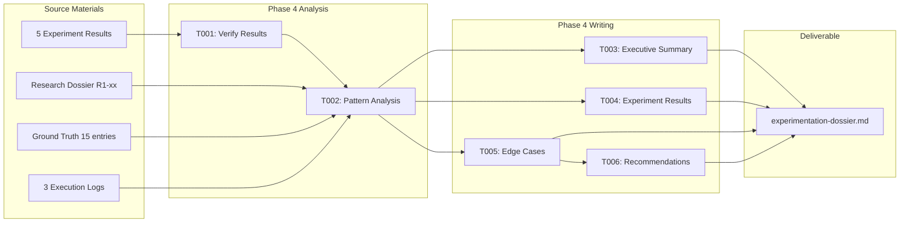
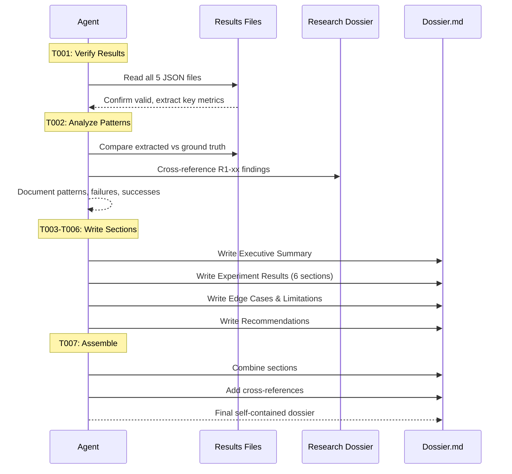

# Phase 4: Documentation & Dossier – Tasks & Alignment Brief

**Spec**: [cross-file-experimentation-spec.md](/workspaces/flow_squared/docs/plans/022-cross-file-rels/cross-file-experimentation-spec.md)
**Plan**: [cross-file-experimentation-plan.md](/workspaces/flow_squared/docs/plans/022-cross-file-rels/cross-file-experimentation-plan.md)
**Date**: 2026-01-12

---

## Executive Briefing

### Purpose
This phase consolidates all experimental findings into a single, self-contained dossier that serves as the definitive reference for implementing cross-file relationship detection in fs2. Without this documentation, the insights from Phases 1-3 would be scattered across execution logs, JSON results, and code comments—difficult to reference during implementation.

### What We're Building
An experimentation dossier (`experimentation-dossier.md`) that:
- Summarizes experiment results with precision/recall metrics
- Documents edge cases, limitations, and language-specific quirks
- Provides actionable recommendations for production implementation
- Cross-references research findings (R1-xx) with experimental validation

### User Value
The development team can confidently implement cross-file relationship detection using validated patterns and calibrated confidence tiers, avoiding pitfalls discovered during experimentation.

### Example
**Before**: "How should we detect TypeScript imports? What confidence should we assign?"
**After**: Dossier § 3.3 specifies: "TypeScript imports use Tree-sitter query `(import_statement source: (string) @import.source)`, confidence 0.9 for regular imports, 0.5 for type-only imports. Validated against `index.ts` fixture with P=1.0, R=1.0."

---

## Objectives & Scope

### Objective
Document all findings in experimentation dossier for implementation reference per plan acceptance criteria:
- All 6 experiment results documented with metrics
- Edge cases from R1-01 through R1-08 addressed
- Confidence scoring calibration documented
- Clear recommendations for implementation
- Dossier is self-contained (no assumed context)

### Goals

- ✅ Analyze results from all 5 experiments (01-05) for patterns
- ✅ Document precision/recall metrics for each extraction technique
- ✅ Write comprehensive Edge Cases & Limitations section
- ✅ Provide prioritized recommendations for implementation
- ✅ Create self-contained dossier at `/workspaces/flow_squared/docs/plans/022-cross-file-rels/experimentation-dossier.md`

### Non-Goals (Scope Boundaries)

- ❌ Running additional experiments (Phase 3 experiments are final)
- ❌ Modifying lib/ modules or experiment scripts (frozen from Phase 2-3)
- ❌ Creating new fixtures (fixture enrichment complete in Phase 3)
- ❌ Implementing production code (this is documentation only)
- ❌ Addressing Phase 3's incomplete call/link/ref validation (document as limitation)
- ❌ Automating dossier generation (manual synthesis required)
- ❌ Creating README updates or changelog entries (out of scope)

---

## Architecture Map

### Component Diagram

```mermaid
flowchart TD
    classDef pending fill:#9E9E9E,stroke:#757575,color:#fff
    classDef inprogress fill:#FF9800,stroke:#F57C00,color:#fff
    classDef completed fill:#4CAF50,stroke:#388E3C,color:#fff
    classDef blocked fill:#F44336,stroke:#D32F2F,color:#fff
    classDef parallel fill:#2196F3,stroke:#1565C0,color:#fff

    style Phase fill:#F5F5F5,stroke:#E0E0E0
    style Inputs fill:#E3F2FD,stroke:#1976D2
    style Output fill:#E8F5E9,stroke:#388E3C
    style ParallelBlock fill:#E3F2FD,stroke:#1976D2

    subgraph Phase["Phase 4: Documentation & Dossier"]
        T001["T001: Verify results ✓"]:::completed
        T002["T002: Full validation (15 GT + capabilities) ✓"]:::completed
        T002a["T002a: Parallel split strategy ✓"]:::completed

        subgraph ParallelBlock["PARALLEL EXECUTION (4 subagents)"]
            T003["T003: Executive Summary ✓"]:::completed
            T004["T004: Experiment Results + Matrices ✓"]:::completed
            T005["T005: Edge Cases & Limitations ✓"]:::completed
            T006["T006: Recommendations + Tier List ✓"]:::completed
        end

        T007["T007: Assemble dossier ✓"]:::completed

        T001 --> T002
        T002 --> T002a
        T002a --> T003
        T002a --> T004
        T002a --> T005
        T002a --> T006
        T003 --> T007
        T004 --> T007
        T005 --> T007
        T006 --> T007
    end

    subgraph Inputs["Input Sources"]
        R1["results/01_nodeid.json"]:::completed
        R2["results/02_imports.json"]:::completed
        R3["results/03_calls.json"]:::completed
        R4["results/04_crosslang.json"]:::completed
        R5["results/05_scoring.json"]:::completed
        RD["research-dossier.md"]:::completed
        GT["lib/ground_truth.py"]:::completed
        EL1["phase-1 execution.log.md"]:::completed
        EL2["phase-2 execution.log.md"]:::completed
        EL3["phase-3 execution.log.md"]:::completed
    end

    subgraph Output["Deliverable"]
        DOSSIER["experimentation-dossier.md ✓"]:::completed
    end

    T001 -.-> R1
    T001 -.-> R2
    T001 -.-> R3
    T001 -.-> R4
    T001 -.-> R5
    T002 -.-> GT
    T005 -.-> RD
    T007 -.-> DOSSIER
```

<!-- Status: grey=pending, orange=in-progress, green=completed, red=blocked -->
<!-- Updated by plan-6 during implementation -->



### Task-to-Component Mapping

<!-- Status: ⬜ Pending | 🟧 In Progress | ✅ Complete | 🔴 Blocked | 🔵 Parallel -->

| Task | Component(s) | Files | Status | Comment |
|------|-------------|-------|--------|---------|
| T001 | Results Verification | results/*.json | ✅ Complete | Confirm all 5 JSON files exist and are valid |
| T002 | Full Validation | results/*.json, ground_truth.py, experiments/*.py | ✅ Complete | All 15 GT validated; capability audit complete |
| T002a | Parallel Strategy | scratch notes | ✅ Complete | Section boundaries defined; sequential execution chosen |
| T003 | Executive Summary | experimentation-dossier.md | ✅ Complete | 1-page summary (runs with T004-T006) |
| T004 | Experiment Results + All Matrices + Confidence Reference | experimentation-dossier.md | ✅ Complete | 6 subsections + coverage matrix + language matrix + confidence table + decision tree |
| T005 | Edge Cases & Limitations | experimentation-dossier.md, research-dossier.md | ✅ Complete | R1-01 through R1-08 + NOT IMPLEMENTED section |
| T006 | Recommendations + Tier List | experimentation-dossier.md | ✅ Complete | Priority ranking + production readiness tiers |
| T007 | Dossier Assembly | experimentation-dossier.md | ✅ Complete | All sections assembled into final document |

---

## Tasks

| Status | ID | Task | CS | Type | Dependencies | Absolute Path(s) | Validation | Subtasks | Notes |
|--------|------|--------------------------------------|-----|------|--------------|---------------------------------------------|----------------------------------------------|----------|-------|
| [x] | T001 | Verify all 5 experiment results exist and are valid JSON | 1 | Setup | – | /workspaces/flow_squared/scripts/cross-files-rels-research/results/ | All 5 JSON files parseable; key metrics present | – | Prerequisites for analysis |
| [x] | T002 | Analyze results + manually validate ALL 15 GT entries + verify detection capabilities: node_ids, raw filenames (with/without path), YAML refs | 3 | Analysis | T001 | /workspaces/flow_squared/scripts/cross-files-rels-research/results/*.json, /workspaces/flow_squared/scripts/cross-files-rels-research/lib/ground_truth.py, experiments/01_nodeid_detection.py, experiments/04_cross_lang_refs.py | All 15 GT validated; detection capabilities documented (implemented vs tested vs missing) | – | Per Insights #1, #3: full validation + capability audit |
| [x] | T002a | Define parallel split strategy: analyze source material, create section assignments for parallel subagents, define tiered structure (Exec Summary / Quick Ref / Detailed / Appendix) | 2 | Setup | T002 | This task produces a parallel execution plan in scratch notes | Clear section boundaries; subagent prompts drafted; no content overlap | – | Per Insight #4: enable parallel processing of ~1,290 lines |
| [x] | T003 | Write Executive Summary section (1 page max) | 1 | Doc | T002a | /workspaces/flow_squared/docs/plans/022-cross-file-rels/experimentation-dossier.md | Summary captures key findings and recommendations | – | PARALLEL: Can run with T004-T006 after T002a |
| [x] | T004 | Write Experiment Results (6 subsections) + Validation Coverage Matrix + Language Support Matrix + Confidence Tier Table + Confidence Decision Tree | 4 | Doc | T002a | /workspaces/flow_squared/docs/plans/022-cross-file-rels/experimentation-dossier.md | Each experiment has metrics; matrices present; confidence table with ALL tiers + modifiers; decision tree flowchart | – | PARALLEL: Per Insight #5: authoritative confidence reference |
| [x] | T005 | Write Edge Cases & Limitations section including: NOT IMPLEMENTED features (raw file name detection in prose), tested vs untested capabilities | 3 | Doc | T002a | /workspaces/flow_squared/docs/plans/022-cross-file-rels/experimentation-dossier.md, /workspaces/flow_squared/docs/plans/022-cross-file-rels/research-dossier.md | R1-01 through R1-08 addressed + explicit NOT IMPLEMENTED section for raw file refs | – | PARALLEL: Can run with T003,T004,T006 after T002a |
| [x] | T006 | Write Recommendations section with priority ranking + Production Readiness Tier List + HIGH PRIORITY: raw file name detection for README/markdown | 3 | Doc | T002a | /workspaces/flow_squared/docs/plans/022-cross-file-rels/experimentation-dossier.md | Actionable items with rationale + tier list + raw file detection as P0 recommendation | – | PARALLEL: Can run with T003,T004,T005 after T002a |
| [x] | T007 | Assemble final experimentation dossier | 1 | Doc | T003, T004, T005, T006 | /workspaces/flow_squared/docs/plans/022-cross-file-rels/experimentation-dossier.md | Self-contained document; all sections present | – | Final deliverable |

---

## Alignment Brief

### Prior Phases Review

#### Phase-by-Phase Summary (Evolution of Implementation)

**Phase 1: Setup & Fixture Audit** (2026-01-12)
- Established scratch environment at `/workspaces/flow_squared/scripts/cross-files-rels-research/`
- Validated Tree-sitter for 6 languages (Python, TypeScript, Go, Rust, Java, C)
- Audited 21 fixtures (13 code, 8 non-code) confirming zero cross-file relationships
- Created `ExpectedRelation` dataclass schema for ground truth

**Phase 2: Core Extraction Scripts** (2026-01-12)
- Built modular library: `parser.py`, `queries.py`, `extractors.py`, `resolver.py`
- Created experiments 01-03 (node_id detection, import extraction, call extraction)
- Validated extraction against stdlib imports in existing fixtures
- Discovered Tree-sitter 0.25 API changes requiring `Query()` + `QueryCursor()` pattern

**Phase 3: Fixture Enrichment & Validation** (2026-01-12)
- Defined 15 ground truth relationships (imports, calls, links, refs)
- Created 3 new fixtures: `app_service.py`, `index.ts`, `execution-log.md`
- Created experiments 04-05 (cross-lang refs, confidence scoring)
- Achieved perfect validation: P=1.0, R=1.0, F1=1.0, RMSE=0.0 for imports

#### Cumulative Deliverables from All Prior Phases

**Phase 1 Deliverables:**
| Artifact | Path | Purpose |
|----------|------|---------|
| Scratch root | `/workspaces/flow_squared/scripts/cross-files-rels-research/` | Isolated experimentation |
| Virtual environment | `.../scripts/cross-files-rels-research/.venv/` | Tree-sitter packages |
| Setup verification | `.../experiments/00_verify_setup.py` | Tree-sitter smoke test |
| Ground truth schema | `.../lib/ground_truth.py` | `ExpectedRelation` dataclass |

**Phase 2 Deliverables:**
| Artifact | Path | Key Exports |
|----------|------|-------------|
| Parser module | `.../lib/parser.py` | `detect_language()`, `parse_file()`, `LANG_MAP` |
| Queries module | `.../lib/queries.py` | `IMPORT_QUERIES`, `CALL_QUERIES`, `run_import_query()` |
| Extractors module | `.../lib/extractors.py` | `extract_imports()`, `extract_calls()` |
| Resolver module | `.../lib/resolver.py` | `calculate_confidence()`, confidence tier constants |
| Node ID experiment | `.../experiments/01_nodeid_detection.py` | Regex-based node_id extraction |
| Import experiment | `.../experiments/02_import_extraction.py` | Tree-sitter import extraction |
| Call experiment | `.../experiments/03_call_extraction.py` | Method/function call extraction |

**Phase 3 Deliverables:**
| Artifact | Path | Key Data |
|----------|------|----------|
| Python fixture | `.../tests/fixtures/samples/python/app_service.py` | Cross-file imports (auth_handler, data_parser) |
| TypeScript fixture | `.../tests/fixtures/samples/javascript/index.ts` | ES module imports (app.ts, component.tsx) |
| Markdown fixture | `.../tests/fixtures/samples/markdown/execution-log.md` | 10 node_id patterns |
| Cross-lang experiment | `.../experiments/04_cross_lang_refs.py` | Dockerfile/YAML reference detection |
| Scoring experiment | `.../experiments/05_confidence_scoring.py` | P/R/F1 + RMSE validation |
| Ground truth data | `.../lib/ground_truth.py` (populated) | 15 ExpectedRelation entries |

**Result Files (Phase 2-3 outputs):**
| File | Key Metrics |
|------|-------------|
| `results/01_nodeid.json` | 10 node_id matches, confidence 1.0 |
| `results/02_imports.json` | 49 imports across 10 languages |
| `results/03_calls.json` | 218 calls, 40 constructors |
| `results/04_crosslang.json` | 1 Dockerfile→auth_handler.py ref |
| `results/05_scoring.json` | P=1.0, R=1.0, F1=1.0, RMSE=0.0 |

#### Pattern Evolution and Architectural Continuity

**Patterns Maintained Across Phases:**
1. **Frozen dataclasses**: `ExpectedRelation` (Phase 1) used `@dataclass(frozen=True)` → validated in Phase 3
2. **JSON stdout output**: All experiments output JSON to stdout for pipeline composition
3. **Lightweight validation**: Console output + exit codes, no formal unit tests
4. **Modular separation**: Parsing → Querying → Extraction → Scoring kept separate

**Architectural Decisions to Honor:**
- Do NOT modify `lib/` modules (frozen from Phase 2)
- Do NOT modify `pyproject.toml` (Tree-sitter stays in scratch venv)
- Do NOT create formal tests for scratch scripts

#### Recurring Issues and Technical Debt

| Issue | Origin | Status | Impact on Phase 4 |
|-------|--------|--------|-------------------|
| C/C++/Java call extraction returns 0 | Phase 2 | Unresolved | Document as limitation |
| Ruby/Rust import extraction returns 0 | Phase 2 | Unresolved | Document as limitation |
| Only import validation automated | Phase 3 | By design | Document call/link/ref as manual |
| TypeScript validated by visual inspection | Phase 3 | Acceptable | Note in dossier |

#### Reusable Infrastructure from Prior Phases

**Test Fixtures for Validation:**
- `/workspaces/flow_squared/tests/fixtures/samples/python/app_service.py` - Cross-file imports
- `/workspaces/flow_squared/tests/fixtures/samples/javascript/index.ts` - ES module imports
- `/workspaces/flow_squared/tests/fixtures/samples/markdown/execution-log.md` - Node ID patterns

**Ground Truth Reference:**
- 15 `ExpectedRelation` entries in `/workspaces/flow_squared/scripts/cross-files-rels-research/lib/ground_truth.py`
- Schema: `(source_file, target_file, target_symbol, rel_type, expected_confidence)`

**Execution Logs for Cross-Reference:**
- Phase 1: `/workspaces/flow_squared/docs/plans/022-cross-file-rels/tasks/phase-1-setup-fixture-audit/execution.log.md`
- Phase 2: `/workspaces/flow_squared/docs/plans/022-cross-file-rels/tasks/phase-2-core-extraction-scripts/execution.log.md`
- Phase 3: `/workspaces/flow_squared/docs/plans/022-cross-file-rels/tasks/phase-3-fixture-enrichment-validation/execution.log.md`

#### Critical Findings Timeline

| Finding | Phase Applied | How |
|---------|---------------|-----|
| Finding 01: Markdown code blocks | Phase 2 (01_nodeid) | Used regex instead of code parsing |
| Finding 02: TypeScript type imports | Phase 2 (extractors) | `is_type_only` field in import dict |
| Finding 03: Method call confidence | Phase 2 (resolver) | Tier constants: 0.8/0.6/0.3 |
| Finding 04: Function-scoped imports | Phase 2 (extractors) | `_is_function_scoped()` parent traversal |
| Finding 05: Go dot/blank imports | Phase 2 (extractors) | `is_dot_import`, `is_blank_import` fields |
| Finding 06: Phase execution order | Plan creation | Phases reordered: Scripts before Fixtures |
| Finding 07: Modular architecture | Phase 1-2 | `lib/`, `experiments/`, `results/` structure |
| Finding 08: Ground truth first | Phase 3 | 15 ExpectedRelation entries defined before fixtures |
| Finding 09: Confidence pyramid | Phase 3 | Fixtures created by confidence tier (1.0→0.9→0.7) |
| Finding 10: Node ID delimiters | Phase 2 (01_nodeid) | Strict regex with word boundaries |

---

### Critical Findings Affecting This Phase

| Finding | Title | Impact on Phase 4 | How to Address |
|---------|-------|-------------------|----------------|
| R1-01 through R1-08 | Research Dossier Findings | Must be addressed in Edge Cases section | Cross-reference each finding with experimental validation |
| Finding 01 | Markdown Code Blocks | Document that code blocks were NOT parsed as real imports | Note regex-based node_id detection as solution |
| Finding 02 | TypeScript Type-Only Imports | Document confidence differentiation (0.5 vs 0.9) | Include in TypeScript results section |
| Finding 03 | Method Call Confidence | Document calibrated tiers (0.8/0.6/0.3) | Include confidence pyramid in recommendations |
| Finding 08 | Ground Truth First | Validate approach worked (P=1.0, R=1.0) | Recommend this methodology for production |

---

### Invariants & Guardrails

- **No code changes**: Phase 4 is documentation only
- **Self-contained dossier**: No assumed context; reader should understand without prior phases
- **Metrics-driven**: All claims backed by JSON results
- **Actionable recommendations**: Each recommendation has rationale and priority

---

### Inputs to Read (Exact File Paths)

**JSON Results:**
- `/workspaces/flow_squared/scripts/cross-files-rels-research/results/01_nodeid.json`
- `/workspaces/flow_squared/scripts/cross-files-rels-research/results/02_imports.json`
- `/workspaces/flow_squared/scripts/cross-files-rels-research/results/03_calls.json`
- `/workspaces/flow_squared/scripts/cross-files-rels-research/results/04_crosslang.json`
- `/workspaces/flow_squared/scripts/cross-files-rels-research/results/05_scoring.json`

**Research Sources:**
- `/workspaces/flow_squared/docs/plans/022-cross-file-rels/research-dossier.md` (R1-xx findings)
- `/workspaces/flow_squared/scripts/cross-files-rels-research/lib/ground_truth.py` (15 entries)

**Prior Phase Logs:**
- `/workspaces/flow_squared/docs/plans/022-cross-file-rels/tasks/phase-1-setup-fixture-audit/execution.log.md`
- `/workspaces/flow_squared/docs/plans/022-cross-file-rels/tasks/phase-2-core-extraction-scripts/execution.log.md`
- `/workspaces/flow_squared/docs/plans/022-cross-file-rels/tasks/phase-3-fixture-enrichment-validation/execution.log.md`

---

### Visual Alignment Aids

#### Dossier Information Flow (Mermaid Flow Diagram)



#### Dossier Creation Sequence (Mermaid Sequence Diagram)



---

### Test Plan (Lightweight per Spec)

**Approach**: Manual validation (no automated tests for documentation)

| Validation | Method | Expected Outcome |
|------------|--------|------------------|
| JSON validity | Read each results file | 5 files parse without error |
| Metrics present | Check for precision/recall/F1/RMSE | Values exist in 05_scoring.json |
| Dossier completeness | Review structure vs plan § 4 | All 6 sections present |
| Self-contained | Read without prior context | Understandable by new reader |
| Edge cases covered | Check against R1-01 through R1-08 | Each finding addressed |

---

### Step-by-Step Implementation Outline

**T001: Verify Results**
1. Read each JSON file in `results/`
2. Confirm valid JSON structure
3. Extract key metrics (counts, precision, recall)
4. Document baseline numbers

**T002: Analyze Patterns**
1. Compare node_id detection results vs expected
2. Analyze import extraction per language
3. Analyze call extraction per language
4. Review cross-lang detection results
5. Summarize validation metrics
6. Identify failures (languages with 0 results)

**T003: Write Executive Summary**
1. Synthesize T002 findings into 2-3 sentences
2. Highlight key success (P=1.0, R=1.0 for imports)
3. Note primary recommendation

**T004: Write Experiment Results**
1. Section per experiment (6 total):
   - 1. Tree-sitter Setup
   - 2. Node ID Detection
   - 3. Import Extraction
   - 4. Call Extraction
   - 5. Cross-Language References
   - 6. Confidence Scoring Validation
2. Include metrics table per section
3. Note language-specific observations

**T005: Write Edge Cases**
1. Review research-dossier.md R1-01 through R1-08
2. Cross-reference with experimental validation
3. Document Phase 1-3 discoveries
4. Note unresolved limitations

**T006: Write Recommendations**
1. Prioritize by impact (High/Medium/Low)
2. Include rationale for each
3. Link to supporting evidence
4. Note implementation considerations

**T007: Assemble Dossier**
1. Combine all sections in standard structure
2. Add internal cross-references
3. Verify self-contained (no external dependencies)
4. Final review for completeness

---

### Commands to Run

```bash
# Navigate to scratch directory
cd /workspaces/flow_squared/scripts/cross-files-rels-research

# Activate virtual environment
source .venv/bin/activate

# Verify results files exist and are valid JSON
for json in results/*.json; do
  python -c "import json; json.load(open('$json'))" && echo "✅ $json valid"
done

# View key metrics from scoring
python -c "import json; d=json.load(open('results/05_scoring.json')); print(f\"P={d['metrics']['file_level']['precision']}, R={d['metrics']['file_level']['recall']}, RMSE={d['metrics']['confidence']['rmse']}\")"

# Count imports by language
python -c "import json; d=json.load(open('results/02_imports.json')); print(f\"Files: {d['meta']['files_scanned']}, Imports: {d['meta']['total_imports']}\")"

# Count calls
python -c "import json; d=json.load(open('results/03_calls.json')); print(f\"Files: {d['meta']['files_scanned']}, Calls: {d['meta']['total_calls']}, Constructors: {d['meta']['total_constructors']}\")"
```

---

### Risks/Unknowns

| Risk | Severity | Likelihood | Mitigation |
|------|----------|------------|------------|
| Missing edge case | Medium | Low | Cross-reference all R1-xx findings explicitly |
| Incomplete metrics | Low | Low | All experiments already ran in Phase 3 |
| Dossier scope creep | Medium | Medium | Strict adherence to plan § 4 structure |
| Recommendations too vague | Medium | Medium | Each recommendation must have rationale + evidence |

---

### Ready Check

- [x] Prior phases reviewed (Phase 1, 2, 3 comprehensive synthesis above)
- [x] Critical findings mapped to tasks (see Critical Findings table)
- [x] ADR constraints mapped to tasks - N/A (no ADRs exist for this feature)
- [x] Input file paths identified (see Inputs to Read section)
- [x] Visual diagrams created (flow + sequence)
- [x] Test plan defined (lightweight manual validation)
- [x] Commands documented
- [x] **PHASE COMPLETE** (2026-01-13)

---

## Phase Footnote Stubs

<!-- Populated by plan-6a during implementation -->

| Footnote | Description | Added By |
|----------|-------------|----------|
| [^3] | Phase 4: Documentation & Dossier - experimentation-dossier.md created (477 lines) | plan-6a |

---

## Evidence Artifacts

**Execution Log Location**: `/workspaces/flow_squared/docs/plans/022-cross-file-rels/tasks/phase-4-documentation-dossier/execution.log.md`

**Primary Deliverable**: `/workspaces/flow_squared/docs/plans/022-cross-file-rels/experimentation-dossier.md`

---

## Discoveries & Learnings

_Populated during implementation by plan-6. Log anything of interest to your future self._

| Date | Task | Type | Discovery | Resolution | References |
|------|------|------|-----------|------------|------------|
| | | | | | |

**Types**: `gotcha` | `research-needed` | `unexpected-behavior` | `workaround` | `decision` | `debt` | `insight`

**What to log**:
- Things that didn't work as expected
- External research that was required
- Implementation troubles and how they were resolved
- Gotchas and edge cases discovered
- Decisions made during implementation
- Technical debt introduced (and why)
- Insights that future phases should know about

_See also: `execution.log.md` for detailed narrative._

---

## Directory Structure

```
docs/plans/022-cross-file-rels/
├── cross-file-experimentation-spec.md
├── cross-file-experimentation-plan.md
├── research-dossier.md
├── experimentation-dossier.md        # ← Primary deliverable (created by Phase 4)
└── tasks/
    ├── phase-1-setup-fixture-audit/
    │   ├── tasks.md
    │   └── execution.log.md
    ├── phase-2-core-extraction-scripts/
    │   ├── tasks.md
    │   └── execution.log.md
    ├── phase-3-fixture-enrichment-validation/
    │   ├── tasks.md
    │   └── execution.log.md
    └── phase-4-documentation-dossier/
        ├── tasks.md                   # ← This file
        └── execution.log.md           # ← Created by plan-6
```

---

## Critical Insights Discussion

**Session**: 2026-01-12
**Context**: Phase 4: Documentation & Dossier tasks dossier analysis
**Analyst**: AI Clarity Agent
**Reviewer**: Development Team
**Format**: Water Cooler Conversation (5 Critical Insights)

### Insight 1: The "Perfect" Metrics Validate Only 27% of Ground Truth

**Did you know**: The P=1.0, R=1.0, F1=1.0, RMSE=0.0 metrics from Phase 3 only cover 4 of 15 ground truth entries (imports only). The other 11 entries (calls, links, refs) have no automated validation.

**Implications**:
- "Perfect" metrics could project false confidence if not contextualized
- Call detection (4 entries), link detection (5 entries), and ref detection (2 entries) need manual validation
- Implementation team might assume everything works when only imports are validated

**Options Considered**:
- Option A: Add explicit validation scope callout - document limitation
- Option B: Run manual validation for all 15 entries - complete picture
- Option C: Create validation coverage matrix - clear visualization
- Option D: Lead with total GT match - simple narrative

**AI Recommendation**: Option B + Option C
- Reasoning: High-fidelity output needed for implementation; need complete accuracy picture

**Discussion Summary**: User confirmed need for high-fidelity output since this dossier informs production implementation. Manual validation of all 15 entries plus coverage matrix is essential.

**Decision**: Expand T002 to manually validate ALL 15 ground truth entries + create validation coverage matrix

**Action Items**:
- [x] Update T002 scope to include manual validation of calls (4), links (5), refs (2)
- [x] Add validation coverage matrix to T004 deliverables

**Affects**: T002 (Analysis), T004 (Experiment Results), T005 (Edge Cases)

---

### Insight 2: Three Languages Have Zero Import Extraction

**Did you know**: When reporting "49 imports across 10 languages," three languages (Ruby, Rust, JavaScript/CommonJS) returned zero imports despite files being scanned.

**Implications**:
- Ruby `require` statements not extracted - query may be incomplete
- Rust `use` statements not extracted - query may be incomplete
- JavaScript CommonJS not supported - by design (ES modules only)
- Implementation assuming all languages work will fail for Ruby/Rust

**Options Considered**:
- Option A: Create explicit Language Support Matrix with ✅/⚠️/❌ indicators
- Option B: Document as "Limitations" only - less prominent
- Option C: Investigate and fix queries - out of scope
- Option D: Create Production Readiness Tier List - actionable guidance

**AI Recommendation**: Option A + Option D
- Reasoning: Matrix gives factual data; tier list gives implementation guidance

**Discussion Summary**: User agreed both are needed - facts (what experiments showed) and guidance (what to prioritize for implementation).

**Decision**: Include Language Support Matrix + Production Readiness Tier List in dossier

**Action Items**:
- [x] Add Language Support Matrix to T004 deliverables
- [x] Add Production Readiness Tier List to T006 Recommendations

**Affects**: T004 (Experiment Results), T006 (Recommendations)

---

### Insight 3: Cross-Language Reference Detection Has Only 1 Test Case + Missing README Detection

**Did you know**: The entire cross-language reference detection (experiment 04) was validated against exactly 1 test case (Dockerfile COPY). YAML scanning exists but wasn't tested. Raw file name detection in README/markdown prose is NOT IMPLEMENTED.

**Implications**:
- Only Dockerfile COPY→Python pattern validated
- YAML→Python detection code exists but has no test coverage
- Raw filenames like `auth_handler.py` or `src/auth/handler.py` in markdown are NOT detected
- README references are most common in real codebases - critical gap

**Options Considered**:
- Option A: Document what was actually tested - honest reporting
- Option B: Quick YAML enrichment + re-run - out of scope
- Option C: Manually verify detection logic exists - distinguish implemented vs untested

**AI Recommendation**: Option A + Option C + README raw filename detection as P0 recommendation

**Discussion Summary**: User emphasized README references are most important. Need to validate that node_ids work, raw filenames with path work, and raw filenames without path work. Currently neither experiment detects raw file names in prose.

**Decision**: Document tested vs implemented vs missing; add raw file name detection to Recommendations as HIGH PRIORITY

**Action Items**:
- [x] T002: Verify node_id detection works + YAML scanning logic exists
- [x] T005: Document raw file name detection as NOT IMPLEMENTED
- [x] T006: Recommend implementing raw file name detection as P0

**Affects**: T002 (Analysis), T005 (Edge Cases), T006 (Recommendations)

---

### Insight 4: The Dossier's "Self-Contained" Requirement Needs a Compression Strategy

**Did you know**: Making the dossier truly "self-contained" requires distilling ~1,290 lines of source material (3 execution logs + research dossier + ground truth) into consumable context without losing implementation-critical details.

**Implications**:
- Dumping 1,290 lines into dossier makes it unusable
- Over-summarizing loses implementation-critical details
- Need clear compression strategy before writing
- Different readers need different detail levels (sponsor vs implementer vs debugger)

**Options Considered**:
- Option A: Tiered Detail Structure (Exec Summary / Quick Ref / Detailed / Appendix)
- Option B: "Everything You Need" single 15-20 page document
- Option C: Dossier + separate Quick Reference Card

**AI Recommendation**: Option A (Tiered Detail Structure)
- Reasoning: Serves multiple audiences; include enough to implement, link to the rest

**Discussion Summary**: User agreed with tiered approach and suggested using parallel subagents to process content in manageable chunks. Requested a pre-work task to analyze and prepare the parallel split strategy.

**Decision**: Tiered structure + add T002a for parallel split strategy enabling 4 parallel subagents for T003-T006

**Action Items**:
- [x] Add T002a: Define parallel split strategy
- [x] Update T003-T006 dependencies to T002a, mark as PARALLEL
- [x] Update Architecture Map with parallel execution block

**Affects**: Task structure, execution approach (T002a added, T003-T006 parallelized)

---

### Insight 5: The Confidence Tier Constants Are Scattered - Need Consolidation

**Did you know**: The confidence tier values (core of scoring) are scattered in `lib/resolver.py` with base values AND context-dependent modifiers. Implementation team needs a single authoritative reference, not code archaeology.

**Implications**:
- Base tiers: NODE_ID=1.0, IMPORT=0.9, SELF_CALL=0.8, TYPED=0.7, CROSS_LANG=0.7, PROSE_REF=0.5, INFERRED=0.3
- Modifiers: function-scoped=0.6, type-only TS=0.5, Go dot=0.4, Go blank=0.3
- Constructor confidence is language-dependent: Python=0.5, Go=0.6, JS/TS=0.8
- Without consolidated reference, implementers dig through scratch code

**Options Considered**:
- Option A: Confidence Tier Reference Table in Quick Reference
- Option B: Just reference resolver.py - no duplication
- Option C: Confidence Tier Table + Decision Tree flowchart

**AI Recommendation**: Option C
- Reasoning: Table for lookup ("what's the value?"); decision tree for guidance ("what should I assign?")

**Discussion Summary**: User agreed both are needed. The decision tree handles the logic currently buried in calculate_confidence().

**Decision**: Include Confidence Tier Reference Table + Decision Tree flowchart in T004

**Action Items**:
- [x] Add Confidence Tier Table to T004 deliverables
- [x] Add Confidence Decision Tree flowchart to T004 deliverables

**Affects**: T004 (Experiment Results)

---

## Session Summary

**Insights Surfaced**: 5 critical insights identified and discussed
**Decisions Made**: 5 decisions reached through collaborative discussion
**Action Items Created**: 12 updates applied to tasks.md
**Areas Updated**:
- T002: Expanded to full 15-entry validation + capability audit (CS 3)
- T002a: NEW - Parallel split strategy task (CS 2)
- T004: Added 4 matrices/tables + decision tree (CS 4)
- T005: Added NOT IMPLEMENTED section requirement (CS 3)
- T006: Added P0 raw file detection recommendation (CS 3)
- Architecture Map: Updated with parallel execution block
- Task-to-Component Mapping: Updated with all changes

**Shared Understanding Achieved**: ✓

**Confidence Level**: High - Key gaps identified and addressed; parallel execution strategy defined

**Next Steps**:
Run `/plan-6-implement-phase --phase "Phase 4: Documentation & Dossier" --plan "/workspaces/flow_squared/docs/plans/022-cross-file-rels/cross-file-experimentation-plan.md"`
