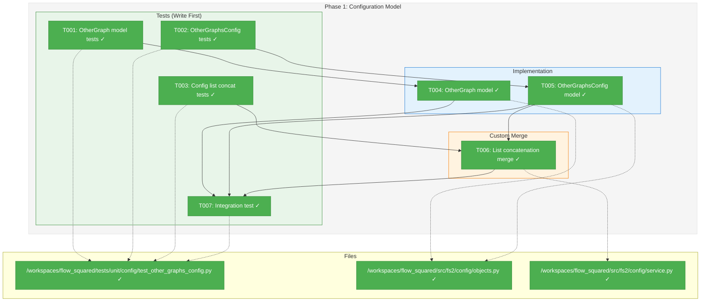
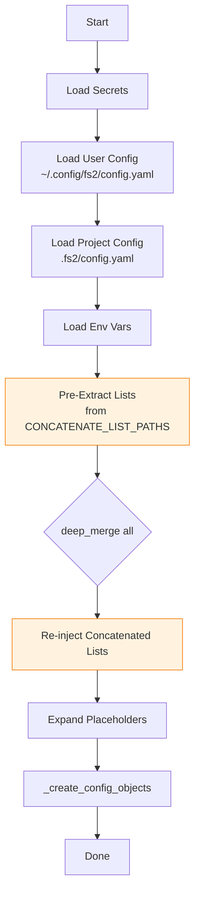
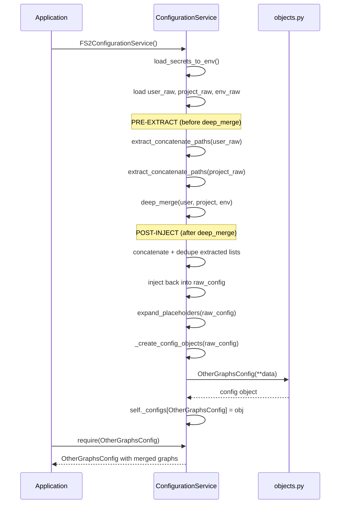

# Phase 1: Configuration Model – Tasks & Alignment Brief

**Spec**: [../../multi-graphs-spec.md](../../multi-graphs-spec.md)
**Plan**: [../../multi-graphs-plan.md](../../multi-graphs-plan.md)
**Date**: 2026-01-13
**Phase Slug**: `phase-1-config-model`

---

## Executive Briefing

### Purpose
This phase establishes the configuration foundation for multi-graph support by adding Pydantic models that allow users to declare additional named graphs in their YAML configuration. Without this, fs2 cannot know which external graphs are available or how to locate them.

### What We're Building
Two new Pydantic configuration models:

1. **`OtherGraph`**: Represents a single external graph with:
   - `name`: Unique identifier for the graph (required, cannot be "default")
   - `path`: File path to the graph pickle file (required)
   - `description`: Human-readable description (optional)
   - `source_url`: URL of the source repository (optional, informational only)

2. **`OtherGraphsConfig`**: Container model with:
   - `graphs`: List of `OtherGraph` configurations
   - `__config_path__ = "other_graphs"` for YAML auto-loading

Plus **custom merge logic** that concatenates graph lists from user and project configs instead of replacing them.

### User Value
Users can configure multiple external reference graphs in their YAML config files. Coding agents will then be able to discover and query these graphs when exploring code patterns from other projects.

### Example

**User config** (`~/.config/fs2/config.yaml`):
```yaml
other_graphs:
  graphs:
    - name: "personal-lib"
      path: "~/projects/personal-lib/.fs2/graph.pickle"
      description: "My personal utilities library"
```

**Project config** (`.fs2/config.yaml`):
```yaml
other_graphs:
  graphs:
    - name: "team-shared"
      path: "/shared/team-lib/.fs2/graph.pickle"
      description: "Team shared components"
      source_url: "https://github.com/team/shared-lib"
```

**Result after merge**: Both graphs are available (3 total: default + personal-lib + team-shared).

---

## Objectives & Scope

### Objective
Implement `OtherGraph` and `OtherGraphsConfig` Pydantic models with validation, registration, and custom merge logic as specified in the plan acceptance criteria.

**Behavior Checklist** (from spec AC1, AC9, AC10):
- [ ] `other_graphs` section recognized in `~/.config/fs2/config.yaml` (user config)
- [ ] `other_graphs` section recognized in `.fs2/config.yaml` (project config)
- [ ] All configured graphs accessible by name after config load
- [ ] User config graphs + project config graphs merged (concatenated, not replaced)
- [ ] Duplicate names resolved (later source wins per name)
- [ ] Path with tilde (`~/...`) stored as-is (expansion happens at access time in Phase 2)

### Goals

- ✅ Create `OtherGraph` Pydantic model with name, path, description, source_url fields
- ✅ Add Pydantic validator rejecting reserved name "default" (per Critical Finding 04)
- ✅ Create `OtherGraphsConfig` container model with `graphs: list[OtherGraph]`
- ✅ Set `__config_path__ = "other_graphs"` for YAML auto-loading
- ✅ Register `OtherGraphsConfig` in `YAML_CONFIG_TYPES`
- ✅ Implement custom list concatenation merge for `other_graphs.graphs` (per Critical Finding 01)
- ✅ Add validation for empty/whitespace names and paths
- ✅ Comprehensive test coverage with TDD approach

### Non-Goals (Scope Boundaries)

- ❌ **Path resolution/expansion** (Phase 2 GraphService handles tilde and relative paths at access time)
- ❌ **File existence validation** (paths are validated when accessed, not when configured)
- ❌ **GraphService caching** (Phase 2)
- ❌ **MCP integration** (Phase 3)
- ❌ **CLI --graph-name option** (Phase 4)
- ❌ **Loading/parsing pickle files** (outside config scope)
- ❌ **Environment variable override for other_graphs** (complex list structure; YAML-only for now)

---

## Architecture Map

### Component Diagram
<!-- Status: grey=pending, orange=in-progress, green=completed, red=blocked -->
<!-- Updated by plan-6 during implementation -->



### Task-to-Component Mapping

<!-- Status: ⬜ Pending | 🟧 In Progress | ✅ Complete | 🔴 Blocked -->

| Task | Component(s) | Files | Status | Comment |
|------|-------------|-------|--------|---------|
| T001 | OtherGraph Tests | test_other_graphs_config.py | ✅ Complete | TDD: 6 tests for OtherGraph model |
| T002 | OtherGraphsConfig Tests | test_other_graphs_config.py | ✅ Complete | TDD: 4 tests for container model |
| T003 | List Concatenation Tests | test_other_graphs_config.py | ✅ Complete | TDD: 6 tests for user + project config merge |
| T004 | OtherGraph Model | objects.py | ✅ Complete | Pydantic model with validators |
| T005 | OtherGraphsConfig Model | objects.py | ✅ Complete | Container model, registered in YAML_CONFIG_TYPES |
| T006 | Custom Merge Logic | service.py | ✅ Complete | Pre-extract/post-inject pattern per Critical Finding 01 |
| T007 | Integration Test | test_other_graphs_config.py | ✅ Complete | 3 integration tests for YAML loading |

---

## Tasks

| Status | ID | Task | CS | Type | Dependencies | Absolute Path(s) | Validation | Subtasks | Notes |
|--------|------|--------------------------------------|-----|------|--------------|------------------|------------|----------|-------|
| [x] | T001 | Write tests for OtherGraph model | 2 | Test | – | /workspaces/flow_squared/tests/unit/config/test_other_graphs_config.py | Tests exist for: valid config, reserved name rejection, optional fields, empty name/path rejection | – | Per Critical Finding 04 |
| [x] | T002 | Write tests for OtherGraphsConfig model | 2 | Test | – | /workspaces/flow_squared/tests/unit/config/test_other_graphs_config.py | Tests exist for: empty list default, multiple graphs, __config_path__ attribute, YAML_CONFIG_TYPES registry | – | – |
| [x] | T003 | Write tests for config list concatenation | 2 | Test | – | /workspaces/flow_squared/tests/unit/config/test_other_graphs_config.py | Tests exist for: user(2)+project(2)=4 graphs, duplicate names resolved (project wins per name), warning logged on shadow | – | Per Critical Finding 01; Per DYK-02: log warning on name collision |
| [x] | T004 | Implement OtherGraph Pydantic model | 2 | Core | T001 | /workspaces/flow_squared/src/fs2/config/objects.py | All T001 tests pass | – | – |
| [x] | T005 | Implement OtherGraphsConfig model + registry | 2 | Core | T002 | /workspaces/flow_squared/src/fs2/config/objects.py | All T002 tests pass; model in YAML_CONFIG_TYPES | – | – |
| [x] | T006 | Implement pre-extract/post-inject list concatenation | 3 | Core | T003, T005 | /workspaces/flow_squared/src/fs2/config/service.py | All T003 tests pass; ERROR logged for invalid graphs; ERROR logged for schema misuse | – | Pre-extract before deep_merge, concatenate+dedupe, re-inject. Per DYK-03: ERROR for validation failures. Per DYK-04: ERROR if other_graphs is list not dict. |
| [x] | T007 | Integration test: load config with other_graphs | 2 | Test | T004, T005, T006 | /workspaces/flow_squared/tests/unit/config/test_other_graphs_config.py | Config loads from YAML files; both user and project graphs accessible | – | Uses tmp_path fixture |

---

## Alignment Brief

### Critical Findings Affecting This Phase

**Critical Finding 01: Config List Concatenation Requires Pre-Extraction**
- **Constraint**: `deep_merge()` in `loaders.py` treats lists as leaf values (overlay wins completely)
- **Impact**: Without custom logic, project config's `other_graphs.graphs` would replace user config's list
- **Root Cause**: By the time `_create_config_objects()` runs, `deep_merge()` has ALREADY clobbered user's list
- **Solution**: Pre-extract lists from specified paths BEFORE `deep_merge()`, then re-inject concatenated result AFTER
- **Approach**: Explicit opt-in via `CONCATENATE_LIST_PATHS = ["other_graphs.graphs"]` - only specified paths concatenate, all other lists retain default overlay-wins behavior
- **Addressed by**: T003 (tests), T006 (implementation)

**Critical Finding 04: Reserved Name "default" Must Be Enforced**
- **Constraint**: Users could configure a graph named "default", causing ambiguity with local graph
- **Impact**: `graph_name="default"` must always refer to `.fs2/graph.pickle`
- **Solution**: Add Pydantic `@field_validator` on `OtherGraph.name` that rejects "default"
- **Addressed by**: T001 (test), T004 (implementation)

### Invariants & Guardrails

1. **Backward Compatibility**: Existing configs without `other_graphs` must continue to work
2. **Empty State Safe**: `OtherGraphsConfig()` returns empty list, not None
3. **Validation on Construction**: Invalid configs fail at load time, not at use time
4. **No Side Effects**: Config models are data-only, no file I/O
5. **Fail Fast with Clear Message** (per DYK-03): If any graph in the list is invalid, log ERROR with specific message identifying the problem graph and what's wrong. Don't silently swallow validation errors at debug level.
6. **Schema Misuse Detection** (per DYK-04): If `other_graphs` is a list instead of dict, log ERROR with helpful message showing correct format. Don't silently ignore.

### Inputs to Read

| File | Purpose |
|------|---------|
| `/workspaces/flow_squared/src/fs2/config/objects.py` | Existing config model patterns (GraphConfig, ScanConfig) |
| `/workspaces/flow_squared/src/fs2/config/service.py` | FS2ConfigurationService._create_config_objects() for merge hook location |
| `/workspaces/flow_squared/src/fs2/config/loaders.py` | deep_merge() implementation to understand list behavior |
| `/workspaces/flow_squared/tests/unit/config/test_graph_config.py` | Test pattern reference |
| `/workspaces/flow_squared/tests/unit/config/test_deep_merge.py` | Merge behavior test patterns |

### Visual Alignment Aids

#### Flow Diagram: Config Loading with Multi-Graph Support



**Pre-Extract Phase Detail:**
```
CONCATENATE_LIST_PATHS = ["other_graphs.graphs"]

For each path in CONCATENATE_LIST_PATHS:
  1. Extract list from user_raw (e.g., user's graphs)
  2. Extract list from project_raw (e.g., project's graphs)
  3. Store both for later

After deep_merge:
  1. Concatenate: user_list + project_list
  2. Deduplicate by name (project wins on collision)
  3. Log WARNING for each shadowed name (per DYK-02)
  4. Inject back into raw_config at the path
```

#### Sequence Diagram: Config Access Flow



### Test Plan (Full TDD per Spec)

#### Test Class: TestOtherGraph

| Test Name | Purpose | Fixture | Expected Output |
|-----------|---------|---------|-----------------|
| `test_valid_graph_config` | Proves basic instantiation works | None | All fields populated correctly |
| `test_reserved_name_default_rejected` | Ensures 'default' cannot be used | None | `ValidationError` with "reserved" |
| `test_optional_fields` | Proves description/source_url optional | None | Graph created with only name+path |
| `test_empty_name_rejected` | Validates name not empty/whitespace | None | `ValidationError` |
| `test_empty_path_rejected` | Validates path not empty/whitespace | None | `ValidationError` |
| `test_name_with_special_chars` | Allows hyphens, underscores | None | Graph created successfully |

#### Test Class: TestOtherGraphsConfig

| Test Name | Purpose | Fixture | Expected Output |
|-----------|---------|---------|-----------------|
| `test_empty_graphs_list_by_default` | Proves default is empty list | None | `graphs == []` |
| `test_config_path_attribute` | Verifies YAML loading path | None | `__config_path__ == "other_graphs"` |
| `test_multiple_graphs` | Container holds multiple graphs | None | All graphs accessible by index |
| `test_in_yaml_config_types` | Verifies registry inclusion | None | `OtherGraphsConfig in YAML_CONFIG_TYPES` |

#### Test Class: TestOtherGraphsConfigMerge

| Test Name | Purpose | Fixture | Expected Output |
|-----------|---------|---------|-----------------|
| `test_user_and_project_graphs_concatenated` | Proves list concatenation | tmp_path, monkeypatch | 4 graphs from 2+2 |
| `test_duplicate_names_project_wins` | Later source wins per name | tmp_path, monkeypatch | Project's version of duplicate name |
| `test_duplicate_names_logs_warning` | Warning logged on shadow | tmp_path, monkeypatch, caplog | Warning message contains shadowed graph name |
| `test_user_only_graphs` | User config without project | tmp_path, monkeypatch | User graphs available |
| `test_project_only_graphs` | Project config without user | tmp_path, monkeypatch | Project graphs available |
| `test_no_other_graphs_section` | Backward compatibility | tmp_path, monkeypatch | Empty OtherGraphsConfig |

#### Test Class: TestOtherGraphsConfigYAMLLoading

| Test Name | Purpose | Fixture | Expected Output |
|-----------|---------|---------|-----------------|
| `test_loads_from_yaml` | End-to-end YAML loading | tmp_path, monkeypatch, clean_config_env | Graphs accessible via require() |
| `test_invalid_graph_logs_error` | Fail fast with clear message (DYK-03) | tmp_path, monkeypatch, caplog | ERROR log with graph name and validation reason |
| `test_list_instead_of_dict_logs_error` | Schema misuse detection (DYK-04) | tmp_path, monkeypatch, caplog | ERROR log with correct format example |

### Step-by-Step Implementation Outline

| Step | Task ID | Action | File(s) |
|------|---------|--------|---------|
| 1 | T001 | Create test file, write `TestOtherGraph` class with 6 failing tests | test_other_graphs_config.py |
| 2 | T002 | Add `TestOtherGraphsConfig` class with 4 failing tests | test_other_graphs_config.py |
| 3 | T003 | Add `TestOtherGraphsConfigMerge` class with 5 failing tests | test_other_graphs_config.py |
| 4 | T004 | Implement `OtherGraph` model with validators | objects.py |
| 5 | – | Verify T001 tests pass | Run pytest |
| 6 | T005 | Implement `OtherGraphsConfig` model, add to YAML_CONFIG_TYPES | objects.py |
| 7 | – | Verify T002 tests pass | Run pytest |
| 8 | T006 | Implement pre-extract/post-inject in `__init__` with `CONCATENATE_LIST_PATHS` | service.py |
| 9 | – | Verify T003 tests pass | Run pytest |
| 10 | T007 | Add `TestOtherGraphsConfigYAMLLoading` integration test | test_other_graphs_config.py |
| 11 | – | Verify all tests pass, check coverage | Run pytest --cov |

### Commands to Run

```bash
# Environment setup (already in devcontainer)
cd /workspaces/flow_squared

# Run specific test file during development
pytest tests/unit/config/test_other_graphs_config.py -v

# Run with coverage
pytest tests/unit/config/test_other_graphs_config.py -v --cov=fs2.config.objects --cov=fs2.config.service --cov-report=term-missing

# Run all config tests to check for regressions
pytest tests/unit/config/ -v

# Type checking
mypy src/fs2/config/objects.py src/fs2/config/service.py

# Linting
ruff check src/fs2/config/objects.py src/fs2/config/service.py
```

### Risks & Unknowns

| Risk | Severity | Mitigation |
|------|----------|------------|
| Custom merge breaks existing config behavior | High | Add regression tests for existing configs first |
| Deep merge hook location unclear | Medium | Research `_create_config_objects` entry point; may need to process raw_config before iteration |
| Pydantic v2 validator syntax differences | Low | Follow existing validator patterns in objects.py |

### Ready Check

- [ ] All inputs read and understood
- [ ] Test file location confirmed (`tests/unit/config/test_other_graphs_config.py`)
- [ ] Objects.py structure understood (YAML_CONFIG_TYPES at end)
- [ ] Service.py `_create_config_objects` understood for merge hook
- [ ] Critical Findings 01 and 04 addressed in task design
- [ ] ADR constraints mapped to tasks (IDs noted in Notes column) - N/A (no ADRs exist)

---

## Phase Footnote Stubs

**NOTE**: This section will be populated during implementation by plan-6a-update-progress.

| Footnote | Task | Description |
|----------|------|-------------|
| | | |

---

## Evidence Artifacts

- **Execution Log**: `./execution.log.md` (created by /plan-6)
- **Test Output**: pytest output captured in execution log
- **Coverage Report**: Coverage percentages for new code

---

## Discoveries & Learnings

_Populated during implementation by plan-6. Log anything of interest to your future self._

| Date | Task | Type | Discovery | Resolution | References |
|------|------|------|-----------|------------|------------|
| | | | | | |

**Types**: `gotcha` | `research-needed` | `unexpected-behavior` | `workaround` | `decision` | `debt` | `insight`

**What to log**:
- Things that didn't work as expected
- External research that was required
- Implementation troubles and how they were resolved
- Gotchas and edge cases discovered
- Decisions made during implementation
- Technical debt introduced (and why)
- Insights that future phases should know about

_See also: `execution.log.md` for detailed narrative._

---

## Directory Layout

```
docs/plans/023-multi-graphs/
├── multi-graphs-spec.md
├── multi-graphs-plan.md
├── research-dossier.md
└── tasks/
    └── phase-1-config-model/
        ├── tasks.md              # This file
        └── execution.log.md      # Created by /plan-6
```

---

## Critical Insights Discussion

**Session**: 2026-01-13
**Context**: Phase 1: Configuration Model tasks dossier analysis
**Analyst**: AI Clarity Agent
**Reviewer**: Development Team
**Format**: Water Cooler Conversation (5 Critical Insights)

### DYK-01: Merge Hook Location Won't Work As Designed

**Did you know**: The custom merge logic planned for `_create_config_objects()` is located AFTER `deep_merge()` has already destroyed the user config's graph list.

**Implications**:
- By the time `_create_config_objects()` runs, `raw_config` only contains project's graphs
- User's list was already overwritten by `deep_merge()` treating lists as scalars
- Implementation would silently "work" but users would only see project graphs

**Options Considered**:
- Option A: Pre-Extract Before Deep Merge - Save lists before merge, re-inject after
- Option B: Create Custom Merge Function - Modify `deep_merge()` with concatenation parameter
- Option C: Load Configs Separately - Refactor `__init__` for explicit merge phases

**AI Recommendation**: Option A (Pre-Extract Before Deep Merge)
- Reasoning: Minimal blast radius, explicit special-case handling, lowest risk

**Discussion Summary**: Workshopped the deep_merge behavior. Confirmed it merges nested dicts but treats lists as atomic values (overlay wins). Decided on explicit opt-in approach with `CONCATENATE_LIST_PATHS` - only specified paths concatenate.

**Decision**: Explicit opt-in pre-extract/post-inject with `CONCATENATE_LIST_PATHS = ["other_graphs.graphs"]`

**Affects**: T006 implementation, flow diagrams, sequence diagrams

---

### DYK-02: Spec Says "Concatenated" but Deduplication Needed

**Did you know**: Spec AC9 says "concatenated" but practical implementation requires deduplication to avoid ambiguous lookups when both configs define the same graph name.

**Implications**:
- Pure concatenation could result in two graphs with same name
- Lookup by name would be ambiguous
- Need clear semantics for name collisions

**Options Considered**:
- Option A: Deduplicate by Name (Project Wins) - Silent replacement
- Option B: Error on Duplicate Names - Hard failure
- Option C: Deduplicate with Warning - Replace + log warning

**AI Recommendation**: Option C (Deduplicate with Warning)
- Reasoning: Clear lookup semantics + visibility into shadowing behavior

**Discussion Summary**: User agreed that silent shadowing is problematic but hard errors too disruptive.

**Decision**: Deduplicate by name (project wins) with WARNING logged for each shadowed graph

**Affects**: T003 tests, T006 implementation

---

### DYK-03: One Invalid Graph Fails Entire Config

**Did you know**: If a user has 5 graphs configured and ONE has an invalid name like "default", Pydantic rejects the ENTIRE `OtherGraphsConfig` and no graphs load. Current code swallows this at debug level.

**Implications**:
- Valid graphs blocked by one typo
- Silent failure - user doesn't know why graphs missing
- Error only surfaces when `require()` called

**Options Considered**:
- Option A: Fail Entire Config (current) - Strict but frustrating
- Option B: Skip Invalid, Load Valid - Graceful but hides errors
- Option C: Skip Invalid + Log Error - Partial state with visibility
- Option D: Fail Fast with Clear Message - Log ERROR immediately with specifics

**AI Recommendation**: Option D (Fail Fast with Clear Message)
- Reasoning: Config errors should be loud; partial state risky; actionable errors

**Discussion Summary**: Agreed that silent debug-level failures are debugging nightmares.

**Decision**: Log ERROR (not debug) with specific message identifying problem graph and validation reason

**Affects**: T006 implementation, Invariants & Guardrails

---

### DYK-04: The `graphs:` Wrapper Might Confuse Users

**Did you know**: Users might write `other_graphs:` with a list directly underneath, but the schema requires `other_graphs.graphs:` wrapper. If they get it wrong, config silently doesn't load.

**Implications**:
- `isinstance(data, dict)` check fails silently for lists
- User wonders why graphs aren't showing up
- No error message to guide them

**Options Considered**:
- Option A: Keep Schema, Add Helpful Error - Detect misuse, log guidance
- Option B: Support Both Formats - Auto-wrap lists
- Option C: Simplify Schema - Remove wrapper entirely

**AI Recommendation**: Option A (Keep Schema, Add Helpful Error)
- Reasoning: Consistency with other configs; extensibility; clear actionable error

**Discussion Summary**: Agreed that consistency matters and helpful errors prevent frustration.

**Decision**: Detect when `other_graphs` is a list (not dict) and log ERROR with correct format example

**Affects**: T006 implementation, Invariants & Guardrails, test plan

---

### DYK-05: T006 Complexity Validation

**Did you know**: With all the DYK additions (warning on shadow, ERROR on invalid, ERROR on schema misuse), T006 has grown in scope. Reassessment confirmed CS-3 is still appropriate.

**Implications**:
- Task notes now serve as mini-spec
- Multiple logging requirements in single task
- Tightly coupled logic (extract, merge, validate, inject)

**Options Considered**:
- Option A: Keep as Single Task (CS-3) - Cohesive implementation
- Option B: Split into T006a/T006b - Smaller focused tasks

**AI Recommendation**: Option A (Keep as Single Task)
- Reasoning: CS-3 appropriate; logic tightly coupled; splitting creates awkward boundaries

**Discussion Summary**: Validated that current structure is appropriate.

**Decision**: Keep T006 as single CS-3 task with detailed notes

**Affects**: No changes - validation of current approach

---

## Session Summary

**Insights Surfaced**: 5 critical insights identified and discussed
**Decisions Made**: 5 decisions reached through collaborative discussion
**Action Items Created**: 0 (all incorporated into existing tasks)
**Areas Updated**:
- Critical Finding 01: Added root cause and explicit opt-in approach
- Flow diagram: Fixed to show PRE-EXTRACT/POST-INJECT timing
- Sequence diagram: Corrected order of operations
- T003, T006: Added validation criteria and notes for DYK findings
- Invariants & Guardrails: Added rules #5 (fail fast) and #6 (schema misuse)
- Test plan: Added 3 new test cases

**Shared Understanding Achieved**: ✓

**Confidence Level**: High - Key architectural issue (merge timing) caught and fixed before implementation

**Next Steps**:
Run `/plan-6-implement-phase --phase 1` to begin implementation with corrected approach

**Notes**:
The most critical catch was DYK-01 - the original flow diagrams showed an impossible sequence where custom merge happened after deep_merge had already clobbered the data. This would have caused implementation to fail or silently produce wrong results.
