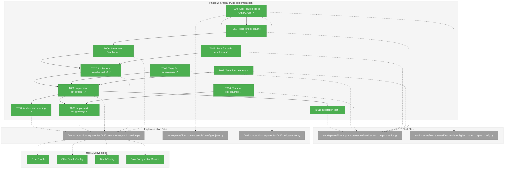
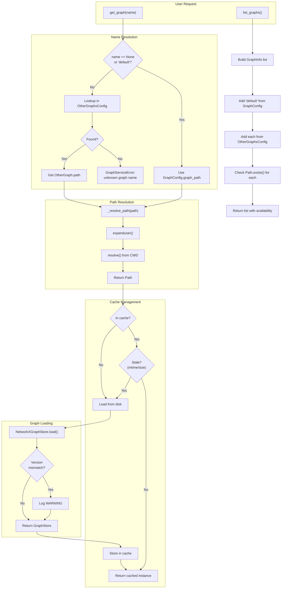
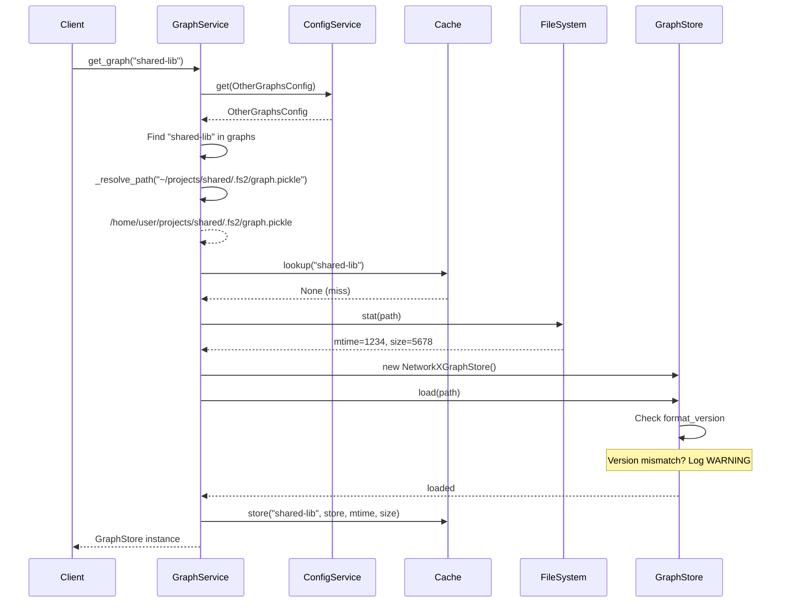

# Phase 2: GraphService Implementation – Tasks & Alignment Brief

**Phase**: Phase 2: GraphService Implementation
**Spec**: [../../multi-graphs-spec.md](../../multi-graphs-spec.md)
**Plan**: [../../multi-graphs-plan.md](../../multi-graphs-plan.md)
**Date**: 2026-01-13

---

## Executive Briefing

### Purpose
This phase creates the `GraphService` class that manages cached access to multiple code graphs. It's the core runtime component enabling agents to query multiple codebases within a single session without repeated file I/O.

### What We're Building
A `GraphService` class that:
- Provides `get_graph(name)` to retrieve named graphs from configuration
- Returns cached `GraphStore` instances with automatic staleness detection
- Resolves paths correctly (absolute, tilde expansion, relative from CWD)
- Lists all available graphs via `list_graphs()` with availability status
- Is thread-safe for concurrent MCP access using RLock

### User Value
Agents can query multiple codebases simultaneously. The cache eliminates redundant file loading, and staleness detection ensures agents always see up-to-date graph data after re-scans.

### Example
**Request**: `service.get_graph("shared-lib")`
**Returns**: Cached `NetworkXGraphStore` loaded from `~/projects/shared/.fs2/graph.pickle`
**Cache Hit**: Same instance returned on subsequent calls (unless file modified)

---

## Objectives & Scope

### Objective
Implement thread-safe GraphService with caching and staleness detection for multi-graph management, as specified in plan acceptance criteria AC2 (default graph access), AC3 (named graph access), AC4 (cache staleness), AC5 (unknown graph error), and AC6 (list_graphs).

### Behavior Checklist
- [ ] `get_graph(None)` and `get_graph("default")` return local project graph
- [ ] `get_graph("name")` returns graph from OtherGraphsConfig by name
- [ ] Cache hit returns same instance (identity check)
- [ ] Modified file (mtime/size change) triggers reload
- [ ] Unknown graph name raises clear error with available names
- [ ] `list_graphs()` returns all graphs with availability status
- [ ] Thread-safe under 10+ concurrent accesses

### Goals

- ✅ Create GraphService class with `get_graph(name)` method
- ✅ Implement thread-safe cache with RLock (per Critical Finding 03)
- ✅ Implement staleness detection via mtime/size comparison
- ✅ Implement path resolution (absolute, tilde, relative)
- ✅ Create GraphInfo dataclass for list_graphs return type
- ✅ Implement list_graphs() checking file existence without loading
- ✅ Add version mismatch warning (per Critical Finding 10)
- ✅ Write comprehensive tests following TDD approach

### Non-Goals (Scope Boundaries)

- ❌ **MCP integration** (Phase 3) – GraphService is a pure service layer; MCP singletons and tool parameters come in Phase 3
- ❌ **CLI integration** (Phase 4) – No `--graph-name` option yet
- ❌ **Remote graph fetching** – source_url is informational only (per spec constraint)
- ❌ **Cross-graph queries** – Each query targets one graph
- ❌ **Modifying NetworkXGraphStore** – GraphService wraps existing GraphStore, doesn't modify it (per Critical Finding 11)
- ❌ **Configuration changes** – Phase 1 delivered all config models needed
- ❌ **Documentation** – Covered in Phase 5

---

## Architecture Map

### Component Diagram
<!-- Status: grey=pending, orange=in-progress, green=completed, red=blocked -->
<!-- Updated by plan-6 during implementation -->



### Task-to-Component Mapping

<!-- Status: ⬜ Pending | 🟧 In Progress | ✅ Complete | 🔴 Blocked -->

| Task | Component(s) | Files | Status | Comment |
|------|-------------|-------|--------|---------|
| T000 | OtherGraph Model + Tests | objects.py, service.py, test_other_graphs_config.py | ✅ Complete | Add _source_dir + validation tests (DYK-02, DYK-04) |
| T001 | Test Suite | /workspaces/flow_squared/tests/unit/services/test_graph_service.py | ✅ Complete | Tests for get_graph() + both error types (DYK-03) |
| T002 | Test Suite | /workspaces/flow_squared/tests/unit/services/test_graph_service.py | ✅ Complete | Tests for staleness: mtime change, size change, unchanged |
| T003 | Test Suite | /workspaces/flow_squared/tests/unit/services/test_graph_service.py | ✅ Complete | Tests for path resolution from config source (DYK-02) |
| T004 | Test Suite | /workspaces/flow_squared/tests/unit/services/test_graph_service.py | ✅ Complete | Tests for list_graphs(): default, configured, unavailable |
| T005 | Test Suite | /workspaces/flow_squared/tests/unit/services/test_graph_service.py | ✅ Complete | Tests for concurrent access; verify single-load (DYK-01) |
| T006 | GraphInfo + Exceptions | /workspaces/flow_squared/src/fs2/core/services/graph_service.py | ✅ Complete | GraphInfo + exception hierarchy (DYK-03) |
| T007 | GraphService | /workspaces/flow_squared/src/fs2/core/services/graph_service.py | ✅ Complete | Path resolution from config source dir (DYK-02) |
| T008 | GraphService | /workspaces/flow_squared/src/fs2/core/services/graph_service.py | ✅ Complete | Core get_graph() with double-checked locking (DYK-01) |
| T009 | GraphService | /workspaces/flow_squared/src/fs2/core/services/graph_service.py | ✅ Complete | list_graphs() checking existence without loading |
| T010 | GraphService | /workspaces/flow_squared/src/fs2/core/services/graph_service.py | ✅ Complete | Version mismatch warning on load (via NetworkXGraphStore) |
| T011 | Integration Test | /workspaces/flow_squared/tests/unit/services/test_graph_service.py | ✅ Complete | End-to-end with real config loading (DYK-04) |

---

## Tasks

| Status | ID | Task | CS | Type | Dependencies | Absolute Path(s) | Validation | Subtasks | Notes |
|--------|-----|------|----|------|--------------|------------------|------------|----------|-------|
| [x] | T000 | Add `_source_dir: Path | None` field to OtherGraph, set during merge, add validation tests | 3 | Setup | – | /workspaces/flow_squared/src/fs2/config/objects.py, /workspaces/flow_squared/src/fs2/config/service.py, /workspaces/flow_squared/tests/unit/config/test_other_graphs_config.py | Field added; merge sets source_dir; **DYK-04: Tests in Phase 1 file validate source_dir is set correctly** | – | **DYK-02 prerequisite + DYK-04 tests** |
| [x] | T001 | Write tests for GraphService.get_graph() (default graph, named graph, cache hit, UnknownGraphError, GraphFileNotFoundError) | 3 | Test | T000 | /workspaces/flow_squared/tests/unit/services/test_graph_service.py | Tests fail initially (RED phase); cover AC2, AC3, AC5; **DYK-03: Test both error types** | – | Per plan task 2.1; **DYK-03** |
| [x] | T002 | Write tests for staleness detection (unchanged file = cache hit, modified mtime = reload, modified size = reload) | 2 | Test | – | /workspaces/flow_squared/tests/unit/services/test_graph_service.py | Tests fail initially; cover AC4 | – | Per plan task 2.2 |
| [x] | T003 | Write tests for path resolution (absolute path, tilde expansion, relative path from config source dir) | 3 | Test | – | /workspaces/flow_squared/tests/unit/services/test_graph_service.py | Tests fail initially; cover Critical Finding 09; **test relative resolves from source dir (DYK-02)** | – | Per plan task 2.3; **DYK-02** |
| [x] | T004 | Write tests for list_graphs() (default + configured graphs, availability status, missing files show available=false) | 2 | Test | – | /workspaces/flow_squared/tests/unit/services/test_graph_service.py | Tests fail initially; cover AC6, Critical Finding 08 | – | Per plan task 2.4 |
| [x] | T005 | Write concurrent access tests (10+ threads calling get_graph() without race conditions) | 3 | Test | – | /workspaces/flow_squared/tests/unit/services/test_graph_service.py | Tests fail initially; cover Critical Finding 03; **verify single-load per DYK-01** | – | Per plan task 2.5 |
| [x] | T006 | Implement GraphInfo dataclass and exception hierarchy (GraphServiceError, UnknownGraphError, GraphFileNotFoundError) | 2 | Core | T001 | /workspaces/flow_squared/src/fs2/core/services/graph_service.py | Dataclass + exceptions created; **DYK-03: Distinct errors for unknown vs missing** | – | Per plan task 2.6; **DYK-03** |
| [x] | T007 | Implement GraphService._resolve_path() handling absolute, tilde, relative paths | 3 | Core | T003, T006 | /workspaces/flow_squared/src/fs2/core/services/graph_service.py | T003 tests pass; uses expanduser().resolve(); **relative paths resolve from config source dir (DYK-02)** | – | Per Critical Finding 09; **DYK-02: Resolve relative from config file location** |
| [x] | T008 | Implement GraphService.get_graph() with RLock cache, staleness detection, error handling | 3 | Core | T001, T002, T005, T007 | /workspaces/flow_squared/src/fs2/core/services/graph_service.py | T001, T002, T005 tests pass; thread-safe; **raise distinct exceptions (DYK-03)** | – | Per Critical Findings 02, 03; **DYK-01, DYK-03** |
| [x] | T009 | Implement GraphService.list_graphs() checking file existence without loading | 2 | Core | T004, T008 | /workspaces/flow_squared/src/fs2/core/services/graph_service.py | T004 tests pass; uses Path.exists() only | – | Per Critical Finding 08 |
| [x] | T010 | Add version mismatch warning when graph format_version differs from current | 1 | Core | T008 | /workspaces/flow_squared/src/fs2/core/services/graph_service.py | Warning logged on version mismatch; graph still loads | – | Per Critical Finding 10 (already in NetworkXGraphStore.load()) |
| [x] | T011 | Integration test: YAML config → FS2ConfigurationService → GraphService → correct path resolution | 2 | Integration | T008 | /workspaces/flow_squared/tests/unit/services/test_graph_service.py | End-to-end test with real config loading; **DYK-04: Validates _source_dir flows through correctly** | – | **DYK-04: Integration layer validation** |

---

## Alignment Brief

### Prior Phases Review

#### Phase 1: Configuration Model (Complete)

##### A. Deliverables Created
| File Path | Description |
|-----------|-------------|
| `/workspaces/flow_squared/src/fs2/config/objects.py` (lines 739-832) | OtherGraph and OtherGraphsConfig Pydantic models |
| `/workspaces/flow_squared/src/fs2/config/service.py` (lines 37-296) | Pre-extract/post-inject merge logic, helper functions |
| `/workspaces/flow_squared/tests/unit/config/test_other_graphs_config.py` | 19 tests across 4 test classes |

**Classes/Functions Created:**

In `objects.py`:
- `OtherGraph` (lines 739-795): Pydantic model with `name`, `path`, `description`, `source_url`
  - `@field_validator("name")`: Rejects empty/whitespace and reserved "default"
  - `@field_validator("path")`: Rejects empty/whitespace
- `OtherGraphsConfig` (lines 798-832): Container with `__config_path__ = "other_graphs"`, `graphs: list[OtherGraph] = []`
- Registered in `YAML_CONFIG_TYPES` (line 919)

In `service.py`:
- `CONCATENATE_LIST_PATHS = ["other_graphs.graphs"]` (line 37)
- `_get_nested_value()`, `_set_nested_value()`, `_delete_nested_value()` helper functions
- `FS2ConfigurationService._extract_and_remove_list()` (lines 216-253)
- `FS2ConfigurationService._concatenate_and_dedupe()` (lines 255-296)

##### B. Lessons Learned
1. **Merge hook location critical**: Original plan placed merge logic in `_create_config_objects()` which was too late - `deep_merge()` had already clobbered user config. Solution: pre-extract/post-inject pattern earlier in `__init__`.
2. **Test monkeypatch target**: Must target `fs2.config.service.get_user_config_dir` not `fs2.config.paths.get_user_config_dir` due to import timing.
3. **TDD approach effective**: Writing tests first caught design issues early.

##### C. Technical Discoveries
1. **`deep_merge()` treats lists as scalars** - Lists are replaced, not merged. This is intentional design.
2. **Import timing matters for monkeypatch** - Functions imported at module level must be patched at their import location.
3. **Schema misuse detection needed** - When user writes `other_graphs: [...]` instead of `other_graphs: { graphs: [...] }`, YAML loads differently.

##### D. Dependencies Exported for Phase 2
| Export | Signature | Notes |
|--------|-----------|-------|
| `OtherGraphsConfig.graphs` | `list[OtherGraph]` | Service reads this to get configured external graphs |
| `OtherGraph.name` | `str` | Used as cache key in GraphService |
| `OtherGraph.path` | `str` | Path to graph file (may need tilde expansion, resolution) |
| Access via `ConfigurationService.require(OtherGraphsConfig)` | Returns `OtherGraphsConfig` | Standard config access pattern |
| `OtherGraph.description`, `source_url` | `str | None` | Available for list_graphs response |

**Access Pattern for Phase 2:**
```python
from fs2.config.objects import OtherGraphsConfig, GraphConfig
config_service = FS2ConfigurationService()
other_graphs_config = config_service.get(OtherGraphsConfig)  # May be None
graph_config = config_service.require(GraphConfig)  # Required for default
if other_graphs_config:
    for graph in other_graphs_config.graphs:
        print(f"Graph {graph.name} at {graph.path}")
```

##### E. Critical Findings Applied
- **Critical Finding 01** (Merge timing): Addressed via pre-extract/post-inject pattern in `service.py` lines 183-208
- **Critical Finding 04** (Reserved name): Addressed via Pydantic validator in `objects.py` lines 773-787

##### F. Incomplete/Blocked Items
None - all 7 tasks completed successfully.

##### G. Test Infrastructure
- Test file: `/workspaces/flow_squared/tests/unit/config/test_other_graphs_config.py`
- 19 tests across 4 classes: TestOtherGraph, TestOtherGraphsConfig, TestOtherGraphsConfigMerge, TestOtherGraphsConfigYAMLLoading
- Uses fixtures: `tmp_path`, `monkeypatch`, `clean_config_env`, `caplog`

**Test Pattern for Config Merge (reusable in Phase 2):**
```python
def test_config_merge(self, tmp_path, monkeypatch, clean_config_env):
    # 1. Create config dirs and files
    user_config_dir = tmp_path / "user_config"
    user_config_dir.mkdir()
    # ... write YAML files

    # 2. Patch paths (IMPORTANT: patch at import location!)
    monkeypatch.chdir(tmp_path)
    monkeypatch.setattr(
        "fs2.config.service.get_user_config_dir", lambda: user_config_dir
    )

    # 3. Exercise
    service = FS2ConfigurationService()
    config = service.get(OtherGraphsConfig)

    # 4. Assert
    assert config is not None
```

##### H. Technical Debt
None identified - Phase 1 was implemented cleanly.

##### I. Architectural Decisions
1. **Explicit opt-in for list concatenation** via `CONCATENATE_LIST_PATHS`
2. **Pre-extract/post-inject pattern** - minimal changes to `deep_merge()`
3. **Validation at construction time** - fail fast with actionable errors
4. **Warning on shadow, not error** - intentional shadowing is valid (DYK-02)
5. **ERROR for validation failures** on OtherGraphsConfig (DYK-03)

##### J. Scope Changes
None - executed as specified. Added schema misuse detection (DYK-04) as enhancement.

##### K. Key Log References
- T006 Completion (`execution.log.md` lines 139-174): Documents 7-phase refactoring
- Phase Summary (`execution.log.md` lines 202-228): Documents all 4 key decisions

---

### Critical Findings Affecting This Phase

| Finding | Title | Constraint/Requirement | Tasks Addressing |
|---------|-------|------------------------|------------------|
| **02** | MCP Singleton Must Become GraphService Cache | Create `GraphService` managing dict of cached graphs; `get_graph_store()` delegates to `service.get_graph(None)` | T008 (cache impl) |
| **03** | Thread Safety Requires RLock | Use `threading.RLock()` for graph cache; fine-grained locking for mutations only | T005 (tests), T008 (impl) |
| **08** | list_graphs Must Check Existence Without Loading | Use `Path.exists()` for availability; return `available: false` for missing | T004 (tests), T009 (impl) |
| **09** | Path Resolution Must Handle Absolute, Tilde, Relative | Normalize at service access time; `_resolve_path()` uses `expanduser().resolve()`; **DYK-02: Relative paths resolve from config source dir** | T000 (prerequisite), T003 (tests), T007 (impl) |
| **10** | Pickle Version Mismatch Should Warn, Not Fail | Compare `metadata.format_version`; log warning if different, continue loading | T010 |
| **11** | NetworkXGraphStore Tests Must Remain Unchanged | Keep storage tests as-is; add new GraphService tests for caching | T001-T005 (separate test file) |

---

### ADR Decision Constraints

No ADRs currently exist for this project.

---

### Invariants & Guardrails

**Thread Safety**:
- All cache mutations must be protected by RLock
- Read operations can occur concurrently after initial load
- **Use double-checked locking pattern** (per DYK-01): Check staleness outside lock (fast path), re-check inside lock before reload to prevent double-load race condition

**Performance**:
- Cache hit must return same instance (identity check in tests)
- `list_graphs()` must NOT load pickle files (existence check only)
- No performance regression for single-graph usage

**Error Handling** (per DYK-03):
- Unknown graph name raises `UnknownGraphError` with list of available names
- Configured but missing file raises `GraphFileNotFoundError` with path and "run fs2 scan" guidance
- Both inherit from `GraphServiceError` for catch-all handling
- Corrupted pickle raises `GraphStoreError` (existing behavior)

---

### Inputs to Read

| File | Purpose |
|------|---------|
| `/workspaces/flow_squared/src/fs2/config/objects.py` (lines 176-197) | GraphConfig for default graph path |
| `/workspaces/flow_squared/src/fs2/config/objects.py` (lines 739-832) | OtherGraph and OtherGraphsConfig from Phase 1 |
| `/workspaces/flow_squared/src/fs2/core/repos/graph_store.py` | GraphStore ABC interface |
| `/workspaces/flow_squared/src/fs2/core/repos/graph_store_impl.py` | NetworkXGraphStore implementation |
| `/workspaces/flow_squared/tests/conftest.py` | Existing fixtures to reuse |

---

### Visual Alignment Aids

#### System Flow Diagram



#### Sequence Diagram (get_graph with cache miss)



---

### Test Plan (Full TDD)

#### Test Classes and Methods

**TestGraphServiceGetGraph** (T001):
| Test Method | Purpose | Fixture | Expected |
|-------------|---------|---------|----------|
| `test_get_default_graph_with_none` | AC2: None returns local graph | `tmp_path`, graph file | Returns GraphStore from GraphConfig.graph_path |
| `test_get_default_graph_with_explicit_default` | AC2: "default" returns same as None | Same | Same instance |
| `test_get_named_graph` | AC3: Named graph lookup | Config with OtherGraphsConfig | Returns correct GraphStore |
| `test_cache_hit_same_instance` | Cache returns identical object | Same | `store1 is store2` |
| `test_unknown_graph_raises_error` | AC5: Unknown name errors | Same | `GraphServiceError` with available names |

**TestGraphServiceStaleness** (T002):
| Test Method | Purpose | Fixture | Expected |
|-------------|---------|---------|----------|
| `test_unchanged_file_returns_cached` | No reload if unchanged | Graph file | Same instance |
| `test_modified_mtime_triggers_reload` | AC4: mtime change reloads | Graph file + touch | Different instance |
| `test_modified_size_triggers_reload` | AC4: size change reloads | Graph file + modify | Different instance |

**TestGraphServicePathResolution** (T003):
| Test Method | Purpose | Fixture | Expected |
|-------------|---------|---------|----------|
| `test_absolute_path_unchanged` | /abs/path stays as-is | Config with absolute | Path matches |
| `test_tilde_expansion` | ~/path expands | Config with ~/path | Expanded correctly |
| `test_relative_path_from_cwd` | ./path resolves from CWD | Config with ./path | Resolved from monkeypatch.chdir |

**TestGraphServiceListGraphs** (T004):
| Test Method | Purpose | Fixture | Expected |
|-------------|---------|---------|----------|
| `test_returns_default_graph` | Default always present | GraphConfig only | "default" in results |
| `test_returns_configured_graphs` | OtherGraphsConfig items listed | With OtherGraphsConfig | All names present |
| `test_missing_file_available_false` | AC6: Missing = available:false | Non-existent path | `available=False` |
| `test_existing_file_available_true` | AC6: Existing = available:true | Existing path | `available=True` |

**TestGraphServiceConcurrency** (T005):
| Test Method | Purpose | Fixture | Expected |
|-------------|---------|---------|----------|
| `test_concurrent_access_no_race` | Thread safety | Graph file | 10 threads, 0 errors |
| `test_concurrent_access_same_instance` | All get same cached | Graph file | All results identical |

#### Fixtures to Create/Reuse

**Reuse from conftest.py**:
- `clean_config_env` - Clear FS2_* env vars
- `test_context` - Pre-wired FakeConfigurationService + FakeLogAdapter

**Create in test file**:
- `graph_service_config` - FakeConfigurationService with GraphConfig + OtherGraphsConfig
- `temp_graph_file` - Creates temporary valid graph pickle
- `create_test_graph` - Factory fixture for creating graph files

---

### Step-by-Step Implementation Outline

1. **T001-T005: Write all tests (RED phase)**
   - Create `/workspaces/flow_squared/tests/unit/services/test_graph_service.py`
   - Write test classes with all test methods
   - All tests should fail (classes/methods don't exist yet)
   - Commit tests

2. **T006: Implement GraphInfo dataclass**
   - Create `/workspaces/flow_squared/src/fs2/core/services/graph_service.py`
   - Define `GraphInfo` with: name, path, description, source_url, available
   - Some T004 tests may start passing (partial)

3. **T007: Implement _resolve_path()**
   - Add `_resolve_path()` method to GraphService
   - Use `Path(path).expanduser().resolve()`
   - T003 tests should pass

4. **T008: Implement get_graph() (GREEN phase)**
   - Add `__init__` accepting ConfigurationService
   - Add `_cache: dict[str, tuple[GraphStore, float, int]]` (store, mtime, size)
   - Add `_lock = threading.RLock()`
   - Implement name resolution (None/"default" → GraphConfig, else → OtherGraphsConfig)
   - Implement cache lookup and staleness check
   - Implement load and cache store
   - T001, T002, T005 tests should pass

5. **T009: Implement list_graphs()**
   - Build list of GraphInfo from GraphConfig + OtherGraphsConfig
   - Use `Path.exists()` for availability (no load)
   - T004 tests should pass

6. **T010: Add version mismatch warning**
   - Check `metadata.format_version` after load
   - Log WARNING if different from current version constant
   - All tests should pass

7. **Refactor and polish**
   - Clean up code
   - Ensure all tests pass
   - Run full test suite for regressions

---

### Commands to Run

```bash
# Environment setup (already done in devcontainer)
# cd /workspaces/flow_squared

# Run Phase 2 tests only (during development)
pytest tests/unit/services/test_graph_service.py -v

# Run with coverage
pytest tests/unit/services/test_graph_service.py -v --cov=fs2.core.services.graph_service --cov-report=term-missing

# Type check
pyright src/fs2/core/services/graph_service.py

# Lint
ruff check src/fs2/core/services/graph_service.py

# Full test suite (regression check)
pytest tests/ -v --ignore=tests/integration

# Run all config tests (ensure no Phase 1 regressions)
pytest tests/unit/config/ -v
```

---

### Risks & Unknowns

| Risk | Severity | Likelihood | Mitigation |
|------|----------|------------|------------|
| RLock deadlock in complex scenarios | High | Low | Use fine-grained locking; pre-check staleness outside lock |
| Concurrent test flakiness | Medium | Medium | Use sufficient sleep/wait; verify with multiple runs |
| Path resolution CWD sensitivity | Medium | Medium | Document behavior; test with explicit chdir |
| Version constant location unclear | Low | Low | Check NetworkXGraphStore for existing FORMAT_VERSION |

---

### Ready Check

- [x] Phase 1 deliverables confirmed available (OtherGraph, OtherGraphsConfig)
- [x] GraphStore ABC interface understood
- [x] Test patterns from Phase 1 reviewed
- [x] Critical Findings 02, 03, 08, 09, 10, 11 mapped to tasks
- [x] Concurrency test approach defined
- [x] No time estimates present (CS scores only)
- [x] ADR constraints mapped to tasks (N/A if no ADRs exist) - **N/A**

---

## Phase Footnote Stubs

_Populated by plan-6a-update-progress during implementation._

| Footnote | Task | Description | Files |
|----------|------|-------------|-------|
| [^3] | T000 | Add _source_dir field to OtherGraph | objects.py, service.py |
| [^4] | T006 | GraphInfo dataclass + exception hierarchy | graph_service.py |
| [^5] | T007-T009 | GraphService core implementation | graph_service.py |
| [^6] | T001-T005, T011 | GraphService test suite | test_graph_service.py |

---

## Evidence Artifacts

Implementation will produce:

- **Execution Log**: `/workspaces/flow_squared/docs/plans/023-multi-graphs/tasks/phase-2-graphservice-impl/execution.log.md`
- **Test Results**: `pytest` output captured in execution log
- **Coverage Report**: Coverage metrics for new code

---

## Discoveries & Learnings

_Populated during implementation by plan-6. Log anything of interest to your future self._

| Date | Task | Type | Discovery | Resolution | References |
|------|------|------|-----------|------------|------------|
| 2026-01-13 | Pre-impl | decision | **DYK-01**: Staleness check outside lock causes double-load race condition | Use double-checked locking pattern: check outside lock (fast path), re-check inside lock before reload | T005, T008 |
| 2026-01-13 | Pre-impl | decision | **DYK-02**: Relative paths resolve from CWD - footgun for user config | Resolve relative paths from config file's source directory; add `_source_dir` to OtherGraph | T000, T003, T007 |
| 2026-01-13 | Pre-impl | decision | **DYK-03**: No distinction between unknown name vs missing file errors | Create distinct exception types: UnknownGraphError, GraphFileNotFoundError (both inherit GraphServiceError) | T001, T006, T008 |
| 2026-01-13 | Pre-impl | decision | **DYK-04**: FakeConfigurationService tests won't catch integration issues | Test both layers: T000 validation tests in Phase 1 file + T011 end-to-end integration test | T000, T011 |
| 2026-01-13 | Pre-impl | decision | **DYK-05**: Cache grows unboundedly (no eviction policy) | YAGNI - document behavior, defer LRU until users report issues; most users have 1-5 graphs | Phase 5 docs should mention cache behavior |

**Types**: `gotcha` | `research-needed` | `unexpected-behavior` | `workaround` | `decision` | `debt` | `insight`

**What to log**:
- Things that didn't work as expected
- External research that was required
- Implementation troubles and how they were resolved
- Gotchas and edge cases discovered
- Decisions made during implementation
- Technical debt introduced (and why)
- Insights that future phases should know about

_See also: `execution.log.md` for detailed narrative._

---

## Directory Layout

```
docs/plans/023-multi-graphs/
├── multi-graphs-spec.md
├── multi-graphs-plan.md
└── tasks/
    ├── phase-1-config-model/
    │   ├── tasks.md                    # Phase 1 dossier (complete)
    │   └── execution.log.md            # Phase 1 implementation log
    └── phase-2-graphservice-impl/
        ├── tasks.md                    # This file
        └── execution.log.md            # Created by plan-6 during implementation
```

---

## Critical Insights Discussion

**Session**: 2026-01-13
**Context**: Phase 2: GraphService Implementation - Tasks & Alignment Brief
**Analyst**: AI Clarity Agent
**Reviewer**: Development Team
**Format**: Water Cooler Conversation (5 Critical Insights)

### Insight 1: Double-Load Race Condition in Staleness Check

**Did you know**: The guidance to "check staleness outside the critical section" creates a race condition where multiple threads could reload the same graph simultaneously.

**Implications**:
- Wasted I/O: Graph loaded multiple times when once would suffice
- Brief inconsistency: Multiple GraphStore instances for same graph
- Performance hit under concurrent load (MCP receives 10 requests = 10 loads)

**Options Considered**:
- Option A: Double-Checked Locking Pattern - check outside lock, re-check inside
- Option B: Always Lock - simple but creates contention
- Option C: Lock-Free with Atomic Replace - complex reasoning

**AI Recommendation**: Option A (Double-Checked Locking)
- Reasoning: Well-known pattern, fast path for hits, single load for misses

**Discussion Summary**: User immediately chose Option A as the correct concurrency pattern.

**Decision**: Use double-checked locking pattern for cache staleness

**Action Items**:
- [x] Update T008 implementation guidance
- [x] Update T005 to verify single-load behavior
- [x] Update Invariants & Guardrails section

**Affects**: T005, T008, Invariants section

---

### Insight 2: Relative Path Resolution CWD Footgun

**Did you know**: Relative paths in `OtherGraphsConfig` resolve from whatever CWD happens to be at service access time, which could be completely different from where the config file was written.

**Implications**:
- User config (~/.config/fs2/) with relative paths essentially broken
- CLI usage from different directories = surprising failures
- No clear error message explaining WHY the path failed

**Options Considered**:
- Option A: Resolve Relative to Config File Location - track source, resolve from there
- Option B: Resolve from Project Root - simpler but odd for user config
- Option C: Require Absolute Paths Only - strict but less flexible
- Option D: Document and Warn - no code change

**AI Recommendation**: Option B (Project Root)
- Reasoning: Predictable, project-portable, MCP-friendly

**Discussion Summary**: User chose Option A for most intuitive UX - paths mean what users expect.

**Decision**: Resolve relative paths from config file's source directory

**Action Items**:
- [x] Add T000 to add `_source_dir` field to OtherGraph
- [x] Update T003 and T007 for source-dir resolution
- [x] Bump CS for T003 and T007

**Affects**: T000 (new), T003, T007, Critical Finding 09

---

### Insight 3: Configured-But-Missing vs Unknown Name Error Distinction

**Did you know**: The error handling doesn't distinguish between two very different failure modes - unknown graph name (typo/not configured) vs configured but missing file (needs scan).

**Implications**:
- Different root causes require different fixes
- Generic "graph not found" is confusing
- Users get wrong guidance for their specific problem

**Options Considered**:
- Option A: Distinct Exception Types - UnknownGraphError, GraphFileNotFoundError
- Option B: Single Exception with Error Code - stringly-typed
- Option C: Different Return Behavior - inconsistent API

**AI Recommendation**: Option A (Distinct Exception Types)
- Reasoning: Pythonic, actionable messages, programmatic handling

**Discussion Summary**: User chose Option A for clear developer experience.

**Decision**: Create distinct exception hierarchy inheriting from GraphServiceError

**Action Items**:
- [x] Update T001 to test both error types
- [x] Update T006 to include exception hierarchy
- [x] Update T008 to raise appropriate exceptions
- [x] Update Invariants & Guardrails error handling section

**Affects**: T001, T006, T008, Error Handling section

---

### Insight 4: Test Coverage Gap - FakeConfigurationService vs Real Config

**Did you know**: All Phase 2 tests use `FakeConfigurationService`, which won't catch integration issues between `GraphService` and the real config loading pipeline from Phase 1.

**Implications**:
- Won't catch `_source_dir` being set incorrectly during merge
- Won't validate placeholder expansion in paths
- Won't test user + project config concatenation end-to-end

**Options Considered**:
- Option A: Add Integration Test with Real Config Loading
- Option B: Keep Unit Tests Only - trust separate testing
- Option C: Add T000 Validation Tests in Phase 1 File
- Option D: Both A and C - complete coverage

**AI Recommendation**: Option D (Both layers)
- Reasoning: T000 modifies Phase 1 files (needs Phase 1 tests), end-to-end validates DYK-02

**Discussion Summary**: User chose Option D for complete coverage with no gaps.

**Decision**: Test both layers - Phase 1 tests for T000 + Phase 2 integration test

**Action Items**:
- [x] Update T000 to include tests in Phase 1 test file
- [x] Add T011 for end-to-end integration test
- [x] Update architecture diagram

**Affects**: T000, T011 (new)

---

### Insight 5: No Cache Eviction Policy - Memory Growth

**Did you know**: The GraphService cache grows unboundedly - every graph accessed stays in memory forever until the process restarts.

**Implications**:
- Each graph could be 10-50MB in memory
- 20 graphs = 200MB-1GB permanently held
- MCP server is long-running with no natural eviction

**Options Considered**:
- Option A: Implement LRU Cache - bounded memory, automatic eviction
- Option B: TTL-Based Expiration - complex timer management
- Option C: Manual Cache Clear Method - simple escape hatch
- Option D: Document and Defer - YAGNI approach

**AI Recommendation**: Option C + D (Manual clear + Document)
- Reasoning: YAGNI for most users (1-5 graphs), simple escape hatch if needed

**Discussion Summary**: User chose Option D - pure YAGNI, don't add complexity until needed.

**Decision**: Document cache behavior, defer eviction policy until users report issues

**Action Items**:
- [x] Add to Discoveries & Learnings as acknowledged decision
- [ ] Phase 5 docs should mention cache behavior

**Affects**: Phase 5 documentation

---

## Session Summary

**Insights Surfaced**: 5 critical insights identified and discussed
**Decisions Made**: 5 decisions reached through collaborative discussion
**Action Items Created**: 12+ task updates applied
**Tasks Added**: T000 (prerequisite), T011 (integration test)
**Tasks Modified**: T001, T003, T005, T006, T007, T008

**Shared Understanding Achieved**: ✓

**Confidence Level**: High - Key concurrency, path resolution, and error handling concerns addressed proactively.

**Next Steps**:
Proceed to `/plan-6-implement-phase --phase 2` when ready.

**Notes**:
- Phase now has 12 tasks (T000-T011) instead of original 10
- DYK-01 through DYK-05 captured in Discoveries table
- All decisions made favored correctness and UX over simplicity
