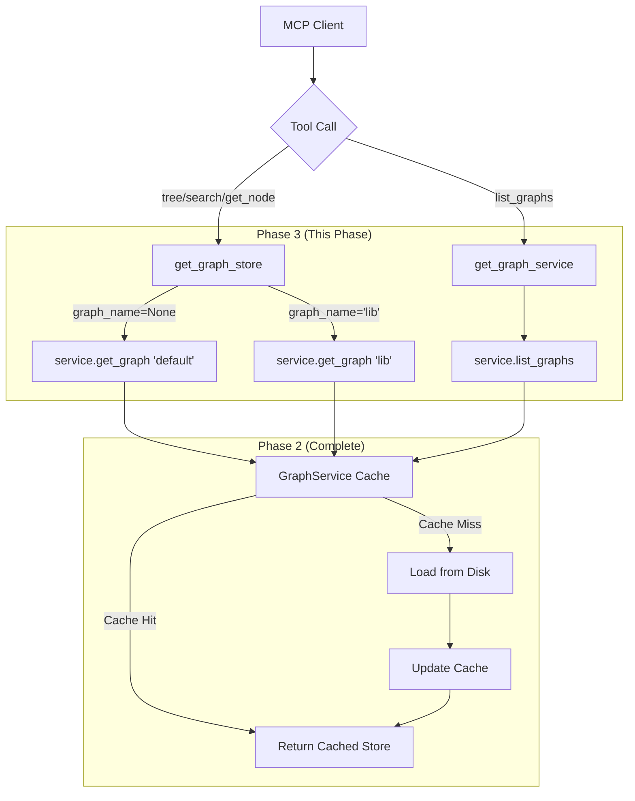
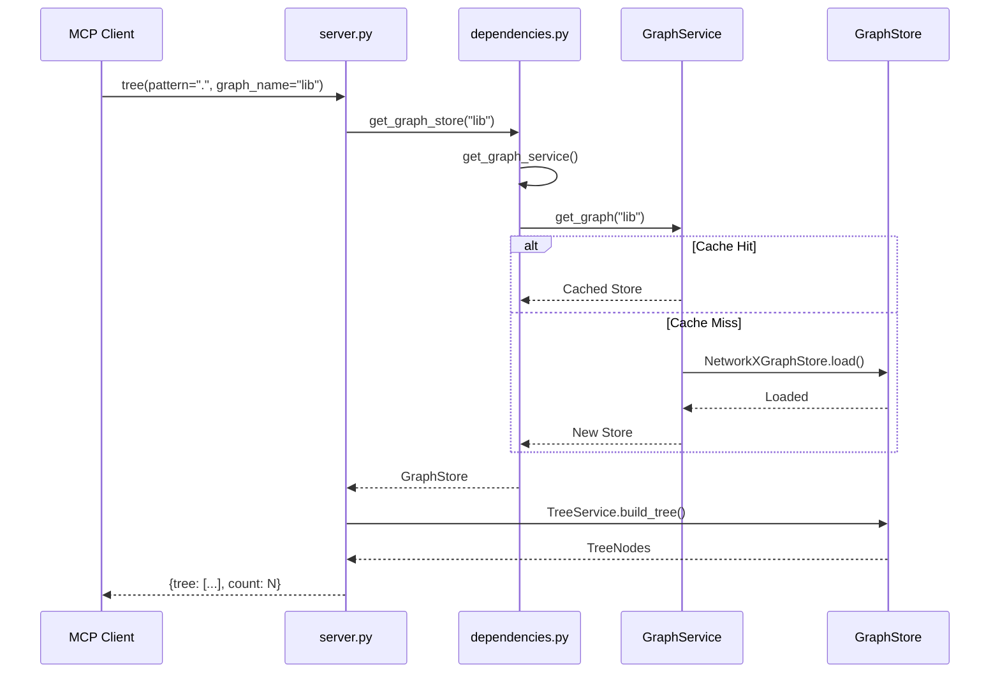

# Phase 3: MCP Integration – Tasks & Alignment Brief

**Spec**: [../../multi-graphs-spec.md](../../multi-graphs-spec.md)
**Plan**: [../../multi-graphs-plan.md](../../multi-graphs-plan.md)
**Date**: 2026-01-13

---

## Executive Briefing

### Purpose
This phase wires the GraphService from Phase 2 into the MCP server layer, enabling agents to query multiple codebases through a single MCP connection. Without this integration, agents can only explore the default project graph.

### What We're Building
MCP integration that:
- Adds `get_graph_service()` lazy singleton to manage multi-graph caching
- Updates `get_graph_store()` to support `graph_name` parameter for backward compatibility
- Adds `graph_name` parameter to `tree`, `search`, and `get_node` MCP tools
- Creates new `list_graphs` MCP tool for graph discovery

### User Value
Agents can discover available graphs via `list_graphs()` and query any configured graph by passing `graph_name` parameter to existing tools. Existing tool calls without `graph_name` continue to work unchanged (default graph).

### Example
```python
# Discover available graphs
>>> list_graphs()
{"graphs": [
  {"name": "default", "path": "/project/.fs2/graph.pickle", "available": true},
  {"name": "shared-lib", "path": "/libs/shared/.fs2/graph.pickle", "available": true}
], "count": 2}

# Query different graphs
>>> tree(pattern=".", graph_name="default")      # Local project
>>> tree(pattern=".", graph_name="shared-lib")   # External library
>>> search(pattern="authenticate", graph_name="shared-lib", mode="text")
```

---

## Objectives & Scope

### Objective
Integrate GraphService with MCP server per plan acceptance criteria AC7, AC8, AC9 (MCP-specific).

**Behavior Checklist**:
- [ ] `list_graphs` returns all configured graphs with availability status
- [ ] `tree/search/get_node` accept optional `graph_name` parameter
- [ ] `graph_name=None` (or omitted) uses default graph (backward compatible)
- [ ] Unknown `graph_name` raises clear error with available names
- [ ] Thread-safe under concurrent MCP tool calls

### Goals

- ✅ Create `get_graph_service()` lazy singleton following existing pattern
- ✅ Update `get_graph_store(graph_name)` to delegate to GraphService
- ✅ Implement `list_graphs` MCP tool returning GraphInfo data
- ✅ Add `graph_name` parameter to `tree`, `search`, `get_node` tools
- ✅ Maintain backward compatibility for all existing tool calls
- ✅ Add test fixtures for multi-graph MCP testing

### Non-Goals

- ❌ CLI integration (Phase 4)
- ❌ Cross-graph queries (each query targets one graph)
- ❌ Graph caching policy changes (use GraphService as-is from Phase 2)
- ❌ Remote graph fetching (source_url is informational only)
- ❌ Scan functionality via MCP (remains hidden per spec)

---

## Architecture Map

### Component Diagram

```mermaid
flowchart TD
    classDef pending fill:#9E9E9E,stroke:#757575,color:#fff
    classDef inprogress fill:#FF9800,stroke:#F57C00,color:#fff
    classDef completed fill:#4CAF50,stroke:#388E3C,color:#fff
    classDef blocked fill:#F44336,stroke:#D32F2F,color:#fff

    style Phase fill:#F5F5F5,stroke:#E0E0E0
    style Deps fill:#F5F5F5,stroke:#E0E0E0
    style Tools fill:#F5F5F5,stroke:#E0E0E0
    style Tests fill:#F5F5F5,stroke:#E0E0E0

    subgraph Phase["Phase 3: MCP Integration"]
        direction TB
        T001["T001: Tests for get_graph_service()"]:::pending
        T002["T002: Tests for list_graphs tool"]:::pending
        T003["T003: Tests for tree with graph_name"]:::pending
        T004["T004: Tests for search with graph_name"]:::pending
        T005["T005: Tests for get_node with graph_name"]:::pending
        T006["T006: Implement get_graph_service()"]:::pending
        T007["T007: Update get_graph_store()"]:::pending
        T008["T008: Implement list_graphs tool"]:::pending
        T009["T009: Add graph_name to tree"]:::pending
        T010["T010: Add graph_name to search"]:::pending
        T011["T011: Add graph_name to get_node"]:::pending
        T012["T012: Add multi-graph fixtures"]:::pending

        T001 --> T006
        T002 --> T008
        T003 --> T009
        T004 --> T010
        T005 --> T011
        T006 --> T007
        T007 --> T008
        T007 --> T009
        T007 --> T010
        T007 --> T011
        T012 --> T002
        T012 --> T003
        T012 --> T004
        T012 --> T005
    end

    subgraph Deps["Dependencies Module"]
        D1["/src/fs2/mcp/dependencies.py"]:::pending
    end

    subgraph Tools["Server Module"]
        S1["/src/fs2/mcp/server.py"]:::pending
    end

    subgraph Tests["Test Files"]
        TF1["/tests/mcp_tests/test_dependencies.py"]:::pending
        TF2["/tests/mcp_tests/test_list_graphs.py"]:::pending
        TF3["/tests/mcp_tests/test_tree_tool.py"]:::pending
        TF4["/tests/mcp_tests/test_search_tool.py"]:::pending
        TF5["/tests/mcp_tests/test_get_node_tool.py"]:::pending
        TF6["/tests/mcp_tests/conftest.py"]:::pending
    end

    T001 -.-> D1
    T001 -.-> TF1
    T002 -.-> TF2
    T003 -.-> TF3
    T004 -.-> TF4
    T005 -.-> TF5
    T006 -.-> D1
    T007 -.-> D1
    T008 -.-> S1
    T009 -.-> S1
    T010 -.-> S1
    T011 -.-> S1
    T012 -.-> TF6
```

<!-- Status: grey=pending, orange=in-progress, green=completed, red=blocked -->
<!-- Updated by plan-6 during implementation -->



### Task-to-Component Mapping

<!-- Status: ⬜ Pending | 🟧 In Progress | ✅ Complete | 🔴 Blocked -->

| Task | Component(s) | Files | Status | Comment |
|------|-------------|-------|--------|---------|
| T001 | Dependency tests | test_dependencies.py | ✅ Complete | Tests for get_graph_service() singleton |
| T002 | list_graphs tests | test_list_graphs.py (NEW) | ✅ Complete | Tests for new MCP tool |
| T003 | tree tests | test_tree_tool.py | ⬜ Pending | Tests for graph_name parameter |
| T004 | search tests | test_search_tool.py | ⬜ Pending | Tests for graph_name parameter |
| T005 | get_node tests | test_get_node_tool.py | ⬜ Pending | Tests for graph_name parameter |
| T006 | GraphService singleton | dependencies.py | ✅ Complete | Implement get_graph_service() |
| T007 | get_graph_store update | dependencies.py | ✅ Complete | Delegate to GraphService |
| T008 | list_graphs tool | server.py | ✅ Complete | New MCP tool implementation |
| T009 | tree tool update | server.py | ⬜ Pending | Add graph_name parameter |
| T010 | search tool update | server.py | ⬜ Pending | Add graph_name parameter |
| T011 | get_node tool update | server.py | ⬜ Pending | Add graph_name parameter |
| T012 | Multi-graph fixtures | conftest.py | ✅ Complete | Test fixtures using FakeGraphService |
| T013 | FakeGraphService | graph_service_fake.py (NEW) | ✅ Complete | Test double for GraphService injection |
| T014 | Error translation helper | server.py | ✅ Complete | translate_graph_error() for consistent MCP errors |
| T015 | E2E cache invalidation | test file (NEW) | ⬜ Pending | Real MCP server staleness validation |

---

## Tasks

| Status | ID | Task | CS | Type | Dependencies | Absolute Path(s) | Validation | Subtasks | Notes |
|--------|-----|------|----|------|--------------|------------------|------------|----------|-------|
| [x] | T001 | Write tests for get_graph_service() singleton | 2 | Test | – | /workspaces/flow_squared/tests/mcp_tests/test_dependencies.py | Tests: singleton behavior, thread safety, returns GraphService, reset_services clears it | – | Per Critical Finding 02 |
| [x] | T002 | Write tests for list_graphs MCP tool | 2 | Test | T012 | /workspaces/flow_squared/tests/mcp_tests/test_list_graphs.py | Tests: returns default+configured, availability status, count field, missing file available=false | – | New test file |
| [x] | T003 | Write tests for tree with graph_name | 2 | Test | T012 | /workspaces/flow_squared/tests/mcp_tests/test_tree_tool.py | Tests: None=default, named graph works, unknown graph error, backward compat | – | Extend existing file; [log#task-t003-t009][^7] |
| [x] | T004 | Write tests for search with graph_name | 2 | Test | T012 | /workspaces/flow_squared/tests/mcp_tests/test_search_tool.py | Tests: None=default, named graph works, results from correct graph | – | Extend existing file; [log#task-t004-t010][^8] |
| [x] | T005 | Write tests for get_node with graph_name | 2 | Test | T012 | /workspaces/flow_squared/tests/mcp_tests/test_get_node_tool.py | Tests: None=default, named graph works, node from correct graph | – | Extend existing file; [log#task-t005-t011][^9] |
| [x] | T006 | Implement get_graph_service() singleton + set_graph_service() | 2 | Core | T001 | /workspaces/flow_squared/src/fs2/mcp/dependencies.py | Tests from T001 pass; follows existing RLock singleton pattern | – | Add _graph_service, get/set/reset; Per DYK-01 |
| [x] | T007 | Update get_graph_store() to ALWAYS delegate to GraphService | 2 | Core | T006 | /workspaces/flow_squared/src/fs2/mcp/dependencies.py | Remove _graph_store path; get_graph_store(name) delegates to service.get_graph() | – | Per DYK-03: Full delegation for staleness |
| [x] | T008 | Implement list_graphs MCP tool | 2 | Core | T002, T007, T014 | /workspaces/flow_squared/src/fs2/mcp/server.py | Tests from T002 pass; FastMCP @mcp.tool() registration | – | Per Critical Finding 08; uses translate_graph_error() |
| [x] | T009 | Add graph_name parameter to tree tool | 2 | Core | T003, T007, T014 | /workspaces/flow_squared/src/fs2/mcp/server.py | Tests from T003 pass; uses get_graph_store(graph_name) | – | Per DYK-02: use translate_graph_error() helper; [log#task-t003-t009][^7] |
| [x] | T010 | Add graph_name parameter to search tool | 2 | Core | T004, T007, T014 | /workspaces/flow_squared/src/fs2/mcp/server.py | Tests from T004 pass; uses get_graph_store(graph_name) | – | Per DYK-02: use translate_graph_error() helper; [log#task-t004-t010][^8] |
| [x] | T011 | Add graph_name parameter to get_node tool | 2 | Core | T005, T007, T014 | /workspaces/flow_squared/src/fs2/mcp/server.py | Tests from T005 pass; uses get_graph_store(graph_name) | – | Per DYK-02: use translate_graph_error() helper; [log#task-t005-t011][^9] |
| [x] | T012 | Add multi-graph test fixtures to conftest.py | 2 | Setup | T013 | /workspaces/flow_squared/tests/mcp_tests/conftest.py | Fixtures: multi_graph_config, fake_graph_service, mcp_client_multi_graph | – | Uses FakeGraphService per DYK-01 |
| [x] | T013 | Create FakeGraphService for test injection | 2 | Setup | – | /workspaces/flow_squared/src/fs2/core/services/graph_service_fake.py | FakeGraphService returns preconfigured stores by name; set_graph_service() injection works | – | Per DYK-01: Proper injection pattern |
| [x] | T014 | Add translate_graph_error() helper to server.py | 2 | Core | – | /workspaces/flow_squared/src/fs2/mcp/server.py | Translates UnknownGraphError, GraphFileNotFoundError to ToolError with helpful messages | – | Per DYK-02: Exception translation |
| [x] | T015 | End-to-end validation: real MCP server cache invalidation | 2 | Integration | T007-T011 | /workspaces/flow_squared/tests/mcp_tests/ | Query graph via MCP → modify code → fs2 scan → query again → verify new content visible | – | Per DYK-03: Prove staleness detection works E2E; [log#task-t015][^10] |

---

## Alignment Brief

### Prior Phases Review

#### Phase-by-Phase Summary

**Phase 1: Configuration Model (2026-01-13)** → Phase 2: GraphService (2026-01-13) → **Phase 3: MCP Integration**

The implementation evolved from configuration foundation to service layer to integration layer:
1. Phase 1 established the data model (`OtherGraph`, `OtherGraphsConfig`) with validation and merge logic
2. Phase 2 built the caching service layer (`GraphService`) with thread safety and staleness detection
3. Phase 3 now wires the service into the MCP server for agent access

#### Phase 1: Configuration Model Summary

**A. Deliverables Created**:
- `/workspaces/flow_squared/src/fs2/config/objects.py`:
  - `OtherGraph` Pydantic model (name, path, description, source_url, _source_dir)
  - `OtherGraphsConfig` container model with `__config_path__ = "other_graphs"`
  - Validators for reserved name "default" and empty name/path
- `/workspaces/flow_squared/src/fs2/config/service.py`:
  - `CONCATENATE_LIST_PATHS` constant for explicit opt-in
  - `_concatenate_and_dedupe()` method for merge with deduplication
  - `_create_other_graphs_config()` for _source_dir injection

**B. Key Lessons**:
- Pre-extract/post-inject pattern for list merge (deep_merge treats lists as scalars)
- Pydantic PrivateAttr cannot be set via constructor - must set after construction
- Monkeypatch targets must be import locations, not source modules

**C. Dependencies Exported**:
```python
from fs2.config.objects import OtherGraph, OtherGraphsConfig
# OtherGraph: name, path, description, source_url, _source_dir
# OtherGraphsConfig: graphs: list[OtherGraph]
```

**D. Test Infrastructure**: 19 tests in `test_other_graphs_config.py`

#### Phase 2: GraphService Implementation Summary

**A. Deliverables Created**:
- `/workspaces/flow_squared/src/fs2/core/services/graph_service.py`:
  - `GraphService` class with thread-safe caching (RLock, double-checked locking)
  - `GraphInfo` frozen dataclass (name, path, description, source_url, available)
  - `GraphServiceError`, `UnknownGraphError`, `GraphFileNotFoundError`
  - `get_graph(name="default")` → returns cached GraphStore
  - `list_graphs()` → returns list[GraphInfo] without loading

**B. Key Lessons**:
- Double-checked locking: check outside lock (fast path), re-check inside lock
- Use `dict.get()` for atomic cache read to avoid TOCTOU race
- NetworkXGraphStore requires ConfigurationService, not individual configs

**C. Dependencies Exported (API for Phase 3)**:
```python
from fs2.core.services.graph_service import (
    GraphService,
    GraphInfo,
    GraphServiceError,
    UnknownGraphError,
    GraphFileNotFoundError,
)

# Usage pattern:
service = GraphService(config=config_service)
store = service.get_graph("default")  # or "shared-lib"
graphs = service.list_graphs()  # Returns GraphInfo list
```

**D. Test Infrastructure**: 27 tests across `test_graph_service.py` and `test_other_graphs_config.py`

#### Cumulative Dependencies for Phase 3

| Phase | What Phase 3 Uses |
|-------|-------------------|
| Phase 1 | `OtherGraphsConfig` for reading configured graphs from config |
| Phase 2 | `GraphService` for cached graph access, `GraphInfo` for list_graphs return |

#### Reusable Test Infrastructure

From Phase 2:
- `create_test_graph_file()` helper for creating valid pickle files
- `FakeConfigurationService` pattern with ScanConfig + GraphConfig

From MCP tests:
- `tree_test_graph_store` fixture pattern (creates temp file for TreeService compatibility)
- `mcp_client` async fixture for protocol-level testing
- `parse_tool_response()` helper for extracting JSON from MCP results

### Critical Findings Affecting This Phase

| Finding | Title | Constraint | Addressed By |
|---------|-------|------------|--------------|
| **02** | MCP Singleton Must Become GraphService Cache | Create `get_graph_service()` singleton; `get_graph_store()` delegates to it | T006, T007 |
| **07** | Existing Services Require No Signature Changes | TreeService, SearchService, GetNodeService already depend on GraphStore ABC - only change composition | T009, T010, T011 |
| **08** | list_graphs Must Check Existence Without Loading | Use `GraphService.list_graphs()` which uses `Path.exists()` | T008 |

### Invariants & Guardrails

- **Thread Safety**: All singleton access via existing RLock pattern
- **Backward Compatibility**: `graph_name=None` (or omitted) MUST behave exactly as before
- **Error Messages**: Unknown graph errors MUST list available graphs

### Inputs to Read

| File | Purpose |
|------|---------|
| `/workspaces/flow_squared/src/fs2/mcp/dependencies.py` | Existing singleton pattern to follow |
| `/workspaces/flow_squared/src/fs2/mcp/server.py` | Existing tool implementations to extend |
| `/workspaces/flow_squared/src/fs2/core/services/graph_service.py` | GraphService API to integrate |
| `/workspaces/flow_squared/tests/mcp_tests/conftest.py` | Existing fixtures to extend |

### Visual Alignment Aids

#### System Flow Diagram



#### Sequence Diagram: tree with graph_name



### Test Plan (Full TDD)

**Mock Usage Policy**: Targeted mocks only
- Reuse: `FakeGraphStore`, `FakeConfigurationService` (existing)
- New: `FakeGraphService` (T013) - returns preconfigured stores by name
- New: Multi-graph fixtures using `set_graph_service()` injection (per DYK-01)

#### Test Classes and Methods

**T001: TestGraphServiceSingleton** (test_dependencies.py)
| Test | Purpose | Expected |
|------|---------|----------|
| `test_graph_service_none_before_first_access` | Singleton is None initially | `_graph_service is None` |
| `test_graph_service_created_on_first_access` | Created when get_graph_service() called | Returns GraphService instance |
| `test_graph_service_cached_singleton` | Same instance returned | `service1 is service2` |
| `test_graph_service_reset_clears_cache` | reset_services() clears it | `_graph_service is None` after reset |
| `test_set_graph_service_injection` | Fake injection works | Returns injected fake |

**T002: TestListGraphsTool** (test_list_graphs.py - NEW)
| Test | Purpose | Expected |
|------|---------|----------|
| `test_returns_default_graph` | Default always present | "default" in names |
| `test_returns_configured_graphs` | Configured graphs listed | "external-lib" in names |
| `test_unavailable_shows_false` | Missing file handled | `available=False` |
| `test_returns_count` | Count field present | `count == len(graphs)` |
| `test_returns_metadata` | Description/source_url | Fields populated |

**T003: TestTreeWithGraphName** (test_tree_tool.py)
| Test | Purpose | Expected |
|------|---------|----------|
| `test_graph_name_none_uses_default` | Backward compatibility | Same as before |
| `test_graph_name_default_explicit` | Explicit "default" works | Same result as None |
| `test_graph_name_named_graph` | Named graph returns content | Different content |
| `test_graph_name_unknown_error` | Unknown graph error | ToolError with available names |

**T004: TestSearchWithGraphName** (test_search_tool.py)
| Test | Purpose | Expected |
|------|---------|----------|
| `test_graph_name_none_uses_default` | Backward compatibility | Same as before |
| `test_graph_name_named_graph` | Named graph returns content | Results from named graph |
| `test_graph_name_unknown_error` | Unknown graph error | ToolError with available names |

**T005: TestGetNodeWithGraphName** (test_get_node_tool.py)
| Test | Purpose | Expected |
|------|---------|----------|
| `test_graph_name_none_uses_default` | Backward compatibility | Same as before |
| `test_graph_name_named_graph` | Named graph returns node | Node from named graph |
| `test_graph_name_unknown_error` | Unknown graph error | ToolError with available names |

**T012: Multi-Graph Fixtures** (conftest.py)
| Fixture | Purpose |
|---------|---------|
| `multi_graph_config` | FakeConfigurationService with OtherGraphsConfig |
| `multi_graph_stores` | Dict of name → FakeGraphStore |
| `mcp_client_multi_graph` | Async client with multi-graph setup |

### Implementation Outline

_Optimized order per DYK-04: Foundation tasks first, then tests, then implementation._

| Step | Task | Description | Phase |
|------|------|-------------|-------|
| 1 | T013 | Create FakeGraphService for test injection | 3a: Foundation |
| 2 | T014 | Create translate_graph_error() helper | 3a: Foundation |
| 3 | T012 | Create multi-graph test fixtures (uses T013) | 3a: Foundation |
| 4 | T001 | Write tests for get_graph_service() singleton | 3b: Tests |
| 5 | T006 | Implement get_graph_service() + set_graph_service() | 3a: Foundation |
| 6 | T007 | Update get_graph_store() to ALWAYS delegate | 3a: Foundation |
| 7 | T002 | Write tests for list_graphs MCP tool | 3b: Tests |
| 8 | T003 | Write tests for tree with graph_name | 3b: Tests |
| 9 | T004 | Write tests for search with graph_name | 3b: Tests |
| 10 | T005 | Write tests for get_node with graph_name | 3b: Tests |
| 11 | T008 | Implement list_graphs tool | 3c: Implementation |
| 12 | T009 | Add graph_name to tree tool | 3c: Implementation |
| 13 | T010 | Add graph_name to search tool | 3c: Implementation |
| 14 | T011 | Add graph_name to get_node tool | 3c: Implementation |
| 15 | T015 | E2E validation with real MCP server | 3d: Validation |

### Commands to Run

```bash
# Environment setup (if needed)
uv sync

# Run existing MCP tests (regression check)
uv run pytest tests/mcp_tests/ -v

# Run specific test files as we go
uv run pytest tests/mcp_tests/test_dependencies.py -v
uv run pytest tests/mcp_tests/test_list_graphs.py -v
uv run pytest tests/mcp_tests/test_tree_tool.py -v
uv run pytest tests/mcp_tests/test_search_tool.py -v
uv run pytest tests/mcp_tests/test_get_node_tool.py -v

# Run all Phase 3 tests
uv run pytest tests/mcp_tests/ tests/unit/services/test_graph_service.py -v

# Type checking
uv run pyright src/fs2/mcp/

# Full regression
uv run pytest tests/ -v --tb=short
```

### Risks/Unknowns

| Risk | Severity | Likelihood | Mitigation |
|------|----------|------------|------------|
| Breaking existing MCP integrations | High | Low | Default graph_name=None preserves behavior; extensive backward compat tests |
| Thread safety in singleton lifecycle | Medium | Low | Follow existing RLock pattern exactly |
| FastMCP tool parameter changes | Medium | Low | Follow existing tool registration pattern |
| Test fixture complexity | Low | Medium | Build on existing fixture patterns |

### Ready Check

- [x] Phase 1 & 2 reviews complete (see Prior Phases Review above)
- [x] Critical Findings mapped to tasks (02→T006/T007, 07→T009/T010/T011, 08→T008)
- [x] ADR constraints mapped to tasks (IDs noted in Notes column) - N/A (no ADRs for this feature)
- [ ] Fixtures designed (T012 pending implementation)
- [ ] Test plan reviewed and approved
- [ ] Implementation order confirmed

**Awaiting GO/NO-GO decision.**

---

## Phase Footnote Stubs

_Populated during implementation by plan-6. Node IDs will be added as files are modified._

| Footnote | Task(s) | Description | Node IDs |
|----------|---------|-------------|----------|
| [^7] | T006, T007 | GraphService singleton in dependencies | (pending) |
| [^8] | T008 | list_graphs MCP tool | (pending) |
| [^9] | T009, T010, T011 | graph_name parameter additions | (pending) |

### Phase 3 Completion Footnotes

[^7]: Phase 3 T003+T009 - tree with graph_name parameter
  - `function:src/fs2/mcp/server.py:tree` - Added graph_name parameter
  - `class:tests/mcp_tests/test_tree_tool.py:TestTreeWithGraphName` - 4 tests

[^8]: Phase 3 T004+T010 - search with graph_name parameter
  - `function:src/fs2/mcp/server.py:search` - Added graph_name parameter
  - `class:tests/mcp_tests/test_search_tool.py:TestSearchWithGraphName` - 4 tests

[^9]: Phase 3 T005+T011 - get_node with graph_name parameter
  - `function:src/fs2/mcp/server.py:get_node` - Added graph_name parameter
  - `class:tests/mcp_tests/test_get_node_tool.py:TestGetNodeWithGraphName` - 5 tests

[^10]: Phase 3 T015 - E2E cache invalidation validation
  - `file:tests/mcp_tests/test_cache_invalidation.py` - 3 E2E tests
  - `method:src/fs2/core/services/tree_service.py:TreeService._ensure_loaded` - Fixed to skip reload if store has content

---

## Evidence Artifacts

**Execution Log Location**: `/workspaces/flow_squared/docs/plans/023-multi-graphs/tasks/phase-3-mcp-integration/execution.log.md`

Log will document:
- TDD RED-GREEN-REFACTOR cycles for each task
- Test outputs and pass/fail status
- Implementation decisions and deviations
- Any gotchas or discoveries during implementation

---

## Discoveries & Learnings

_Populated during implementation by plan-6. Log anything of interest to your future self._

| Date | Task | Type | Discovery | Resolution | References |
|------|------|------|-----------|------------|------------|
| 2026-01-13 | T006, T012, T013 | decision | DYK-01: set_graph_store() injection pattern breaks when get_graph_store() delegates to GraphService - existing tests would bypass injected fakes | Create FakeGraphService with set_graph_service() for proper test injection; Option A chosen over backward-compat hack | /didyouknow session |
| 2026-01-13 | T008-T011, T014 | decision | DYK-02: MCP tools only catch GraphNotFoundError/GraphStoreError but GraphService raises UnknownGraphError/GraphFileNotFoundError - unhandled exceptions leak to client | Create translate_graph_error() helper in server.py; all tools use it for consistent error translation | /didyouknow session |
| 2026-01-13 | T007, T015 | decision | DYK-03: get_graph_store() must fully delegate to GraphService (not maintain separate _graph_store singleton) to ensure staleness detection works for E2E validation | Remove _graph_store production path entirely; add T015 for real MCP server cache invalidation test | /didyouknow session |
| 2026-01-13 | All | insight | DYK-04: Implementation order matters - T013/T014 (foundation) must come before tests (T001-T005) which must come before implementation (T008-T011) | Reordered Implementation Outline into 4 phases: Foundation → Tests → Implementation → Validation | /didyouknow session |

**Types**: `gotcha` | `research-needed` | `unexpected-behavior` | `workaround` | `decision` | `debt` | `insight`

**What to log**:
- Things that didn't work as expected
- External research that was required
- Implementation troubles and how they were resolved
- Gotchas and edge cases discovered
- Decisions made during implementation
- Technical debt introduced (and why)
- Insights that future phases should know about

_See also: `execution.log.md` for detailed narrative._

---

## Directory Structure

```
docs/plans/023-multi-graphs/
├── multi-graphs-spec.md
├── multi-graphs-plan.md
├── reviews/
│   ├── review.phase-2-graphservice-impl.md
│   └── fix-tasks.phase-2-graphservice-impl.md
└── tasks/
    ├── phase-1-config-model/
    │   ├── tasks.md
    │   └── execution.log.md
    ├── phase-2-graphservice-impl/
    │   ├── tasks.md
    │   └── execution.log.md
    └── phase-3-mcp-integration/
        ├── tasks.md              # This file
        └── execution.log.md      # Created by plan-6
```

---

## Critical Insights Discussion

**Session**: 2026-01-13
**Context**: Phase 3: MCP Integration - Tasks & Alignment Brief
**Analyst**: AI Clarity Agent
**Reviewer**: Development Team
**Format**: Water Cooler Conversation (5 Critical Insights)

### Insight 1: Test Injection Pattern Incompatibility

**Did you know**: The current `set_graph_store()` injection pattern breaks when `get_graph_store()` delegates to GraphService - existing tests would bypass injected fakes entirely.

**Implications**:
- All 50+ existing MCP tests using `set_graph_store()` would break
- FakeGraphStore injection becomes ineffective for multi-graph tests
- Need fundamentally different injection strategy

**Options Considered**:
- Option A: Create FakeGraphService with set_graph_service() - proper injection
- Option B: Smart conditional delegation - backward compat hack
- Option C: GraphService accepts injected stores - mutates production class
- Option D: Config-level injection with real pickle files - slower tests

**AI Recommendation**: Option A (FakeGraphService)
- Reasoning: Clean separation, follows existing patterns, no conditional logic hacks

**Discussion Summary**: User agreed Option B was a bad idea - do it properly with Option A.

**Decision**: Create FakeGraphService with set_graph_service() injection pattern

**Action Items**:
- [x] Added T013: Create FakeGraphService
- [x] Updated T006 to include set_graph_service()
- [x] Updated T012 to depend on T013

**Affects**: T006, T012, T013

---

### Insight 2: Exception Translation Gap

**Did you know**: MCP tools only catch `GraphNotFoundError` and `GraphStoreError`, but GraphService raises `UnknownGraphError` and `GraphFileNotFoundError` which would leak as unhandled exceptions.

**Implications**:
- User typos in graph_name cause ugly Python tracebacks
- Rich error messages (with available names list) get lost
- Poor user experience for MCP clients

**Options Considered**:
- Option A: Add exception handling to each tool - repetitive
- Option B: Create translate_graph_error() helper - DRY, explicit
- Option C: Decorator for error translation - magic, harder to debug
- Option D: Catch at get_graph_store() level - mixing concerns

**AI Recommendation**: Option B (translate_graph_error() helper)
- Reasoning: Single place to maintain error messages, follows existing pattern

**Discussion Summary**: User agreed - Option B is the right approach.

**Decision**: Create translate_graph_error() helper in server.py

**Action Items**:
- [x] Added T014: translate_graph_error() helper
- [x] Updated T008-T011 to use the helper

**Affects**: T008, T009, T010, T011, T014

---

### Insight 3: API Signature Change (Non-Issue)

**Did you know**: Changing `get_graph_store()` from zero arguments to `get_graph_store(graph_name=None)` is technically a breaking API change.

**Implications**:
- Semantic change even though API-compatible
- Code assuming "always returns same object" might be surprised

**Options Considered**:
- Option A: Keep unchanged, add new function - two functions
- Option B: Add parameter - single function, clear API
- Option C: Replace with get_graph_service() only - more invasive

**AI Recommendation**: Option B (Add parameter)
- Reasoning: API stays familiar, default behavior unchanged

**Discussion Summary**: User confirmed this is internal API we control - no backward compat needed.

**Decision**: Option B - add graph_name parameter, no special handling needed

**Action Items**: None - T007 already covers this

**Affects**: T007

---

### Insight 4: Full Delegation Required for E2E Validation

**Did you know**: For the end-of-phase cache invalidation test to work, `get_graph_store()` must FULLY delegate to GraphService (not maintain separate `_graph_store` singleton).

**Implications**:
- If old `_graph_store` path is hit, staleness detection bypassed
- E2E validation (query → modify → scan → query) would fail
- Need real MCP server test at end of phase

**Options Considered**:
- Option A: Full delegation, remove _graph_store path - clean
- Option B: Conditional delegation - two code paths, confusing

**AI Recommendation**: Option A (Full delegation)
- Reasoning: DYK-01 solved test injection, single code path is cleaner

**Discussion Summary**: User agreed with Option A and requested real MCP server E2E test.

**Decision**: Full delegation + E2E validation test with real MCP server

**Action Items**:
- [x] Updated T007 to "ALWAYS delegate"
- [x] Added T015: E2E validation with real MCP server

**Affects**: T007, T015

---

### Insight 5: Implementation Order Optimization

**Did you know**: The current task order creates a potential bottleneck - T013/T014 (foundation tasks) should come before tests.

**Implications**:
- Can't write multi-graph tests until fixtures exist
- Can't implement tools until error helper exists
- Context-switching if order not optimized

**Options Considered**:
- Option A: Reorder Implementation Outline - clear roadmap
- Option B: Renumber tasks - significant churn
- Option C: Keep as-is, trust dependencies - misleading outline

**AI Recommendation**: Option A (Reorder Implementation Outline)
- Reasoning: Clear execution roadmap, minimal churn, dependencies stay correct

**Discussion Summary**: User agreed - reorder the outline.

**Decision**: Reorder Implementation Outline into 4 phases: Foundation → Tests → Implementation → Validation

**Action Items**:
- [x] Reordered Implementation Outline section

**Affects**: Implementation Outline section

---

## Session Summary

**Insights Surfaced**: 5 critical insights identified and discussed
**Decisions Made**: 5 decisions reached through collaborative discussion
**Action Items Created**: 3 new tasks added (T013, T014, T015)
**Areas Updated**: Tasks table, Task-to-Component Mapping, Implementation Outline, Discoveries table

**Shared Understanding Achieved**: ✓

**Confidence Level**: High - Key architectural decisions made, implementation path clear

**Next Steps**:
Proceed with `/plan-6-implement-phase --phase "Phase 3: MCP Integration"` following the optimized Implementation Outline order.

**Notes**:
- Phase 3 now has 15 tasks (T001-T015) vs original 12
- Foundation tasks (T013, T014) are critical path
- E2E validation (T015) provides confidence that cache invalidation works end-to-end
