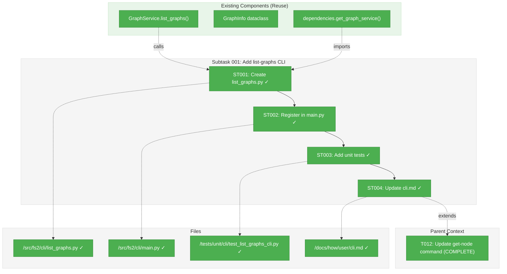
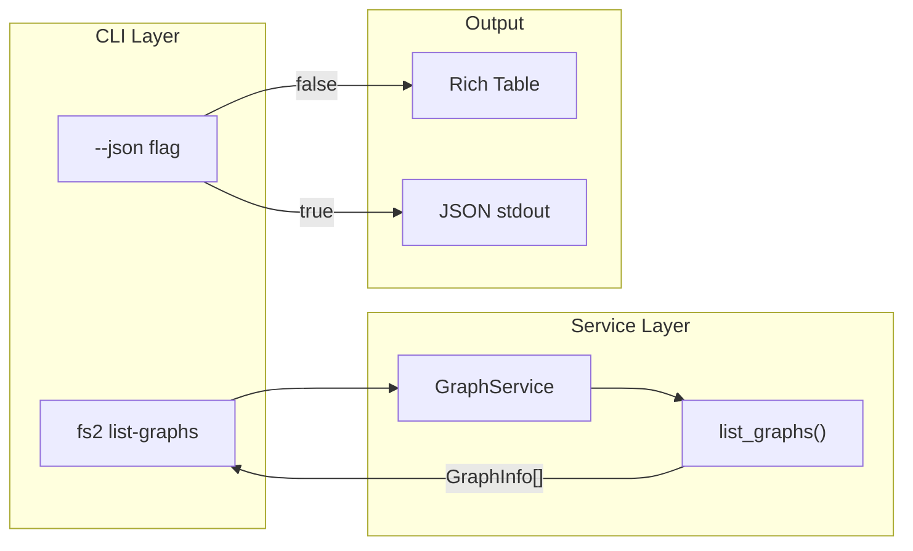
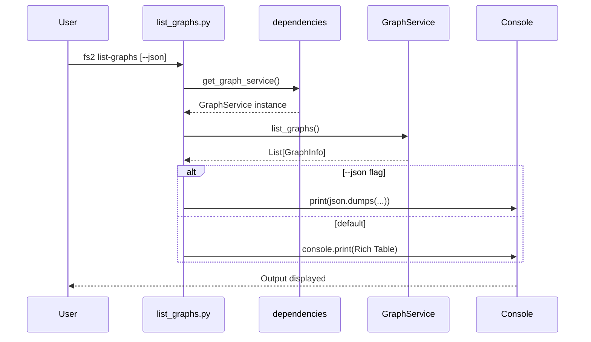

# Subtask 001: Add list-graphs CLI Command

**Parent Plan:** [View Plan](../../multi-graphs-plan.md)
**Parent Phase:** Phase 4: CLI Integration
**Parent Task(s):** [T012: Update get-node command composition root](./tasks.md#task-t012)
**Plan Task Reference:** [Task 4.12 in Plan](../../multi-graphs-plan.md#phase-4-cli-integration)

**Why This Subtask:**
CLI parity gap discovered during Phase 5 documentation work: MCP has `list_graphs()` tool for discovering available graphs, but CLI has no equivalent command. Users cannot list configured graphs from the command line without this feature. This is a CLI implementation task, not documentation.

**Created:** 2026-01-14
**Requested By:** Development Team (CLI parity gap identified during documentation)

---

## Executive Briefing

### Purpose
This subtask adds an `fs2 list-graphs` CLI command that provides parity with the MCP `list_graphs()` tool. Users can discover available graphs (default + configured external graphs) directly from the command line, improving CLI usability and debuggability.

### What We're Building
A new CLI command that:
- Lists all configured graphs with name, path, availability status
- Supports `--json` flag for machine-readable output
- Uses Rich table formatting for human-readable default output
- Reuses existing `GraphService.list_graphs()` method

### Unblocks
- CLI parity with MCP tools (MCP has `list_graphs()`, CLI should have equivalent)
- Improves user experience when debugging configuration issues
- Completes the multi-graph feature surface area

### Example
**CLI Output (default)**:
```
                    Available Graphs
┏━━━━━━━━━━━━━━━┳━━━━━━━━┳━━━━━━━━━━━━━━━━━━━━━━━━━━━━━━┳━━━━━━━━━━━━━━━━━━━━━┓
┃ Name          ┃ Status ┃ Path                         ┃ Description         ┃
┡━━━━━━━━━━━━━━━╇━━━━━━━━╇━━━━━━━━━━━━━━━━━━━━━━━━━━━━━━╇━━━━━━━━━━━━━━━━━━━━━┩
│ default       │   ✓    │ /project/.fs2/graph.pickle   │ Local project graph │
│ shared-lib    │   ✓    │ /libs/.fs2/graph.pickle      │ Shared library      │
└───────────────┴────────┴──────────────────────────────┴─────────────────────┘

Total: 2 graph(s)
```

**JSON Output (`--json`)**:
```json
{"docs": [{"name": "default", "path": "...", "available": true, ...}], "count": 2}
```

---

## Objectives & Scope

### Objective
Add `fs2 list-graphs` CLI command to provide command-line discovery of available graphs, matching the MCP `list_graphs()` tool capability.

### Goals

- ✅ Create `src/fs2/cli/list_graphs.py` with command implementation
- ✅ Register command in `main.py` (not guarded by require_init)
- ✅ Support `--json` flag for machine-readable output
- ✅ Use Rich table for default human-readable output
- ✅ Reuse `GraphService.list_graphs()` for core logic
- ✅ Add unit tests for command registration and output
- ✅ Update cli.md documentation with new command

### Non-Goals

- ❌ Interactive filtering or selection (simple list only)
- ❌ Graph modification commands (add/remove graphs via CLI)
- ❌ Performance optimization (already efficient via GraphService)
- ❌ Cross-graph summary statistics
- ❌ `source_url` column in table output (keep 4 columns for cleaner display; use `--json` for complete data)

---

## Architecture Map

### Component Diagram
<!-- Status: grey=pending, orange=in-progress, green=completed, red=blocked -->
<!-- Updated by plan-6 during implementation -->



### Task-to-Component Mapping

<!-- Status: ⬜ Pending | 🟧 In Progress | ✅ Complete | 🔴 Blocked -->

| Task | Component(s) | Files | Status | Comment |
|------|-------------|-------|--------|---------|
| ST001 | CLI Command | /workspaces/flow_squared/src/fs2/cli/list_graphs.py | ✅ Complete | Main command implementation |
| ST002 | Command Registration | /workspaces/flow_squared/src/fs2/cli/main.py | ✅ Complete | Register without require_init guard |
| ST003 | Unit Tests | /workspaces/flow_squared/tests/unit/cli/test_list_graphs_cli.py | ✅ Complete | Test command behavior |
| ST004 | Documentation | /workspaces/flow_squared/docs/how/user/cli.md, /workspaces/flow_squared/docs/how/user/multi-graphs.md | ✅ Complete | Document new command in both guides |

---

## Tasks

| Status | ID    | Task                                    | CS | Type  | Dependencies | Absolute Path(s)                                                | Validation                                  | Subtasks | Notes                               |
|--------|-------|----------------------------------------|----|----- -|--------------|----------------------------------------------------------------|---------------------------------------------|----------|-------------------------------------|
| [x]    | ST001 | Create list_graphs.py CLI module       | 2  | Core  | –            | /workspaces/flow_squared/src/fs2/cli/list_graphs.py            | Module imports; function callable           | –        | Follow tree.py patterns             |
| [x]    | ST002 | Register list-graphs command in main.py| 1  | Setup | ST001        | /workspaces/flow_squared/src/fs2/cli/main.py                   | `fs2 list-graphs --help` works              | –        | Not guarded (like init, doctor)     |
| [x]    | ST003 | Write unit tests                       | 2  | Test  | ST001        | /workspaces/flow_squared/tests/unit/cli/test_list_graphs_cli.py| All tests pass; covers JSON + table output  | –        | Follow test_tree_cli.py patterns    |
| [x]    | ST004 | Update cli.md and multi-graphs.md      | 1  | Doc   | ST002        | /workspaces/flow_squared/docs/how/user/cli.md, multi-graphs.md | Command documented in both guides           | –        | Extends Phase 4 + Phase 5 docs      |

---

## Alignment Brief

### Objective Recap

**Phase 4 Goal**: Add --graph-name CLI option with mutual exclusivity validation.
**Subtask Goal**: Fill CLI gap discovered during documentation—add `list-graphs` command for CLI parity with MCP.

### Parent Phase Acceptance Criteria Affected

From Phase 4 spec:
- [ ] CLI documentation complete for multi-graph features

This subtask extends that criterion by adding a missing CLI command that was documented in MCP but not available in CLI.

### Critical Findings Affecting This Subtask

- **CF08 (list_graphs must check existence without loading)**: Already implemented in GraphService—reuse this logic
- **CF06 (6+ command composition roots)**: Follow established pattern; use `get_graph_service()` from dependencies

### Invariants & Guardrails

- Must follow existing CLI patterns (tree.py, get_node.py)
- Must use `GraphService.list_graphs()` for core logic (no duplication)
- Must support `--json` for scripting (consistent with other commands)
- Must NOT be guarded by `require_init` (diagnostic command)
- Exit code 0 on success, 1 on configuration error

### Inputs to Read

| File | Purpose |
|------|---------|
| `/workspaces/flow_squared/src/fs2/core/services/graph_service.py` | GraphService.list_graphs() signature and GraphInfo dataclass |
| `/workspaces/flow_squared/src/fs2/cli/tree.py` | Pattern for CLI command structure |
| `/workspaces/flow_squared/src/fs2/cli/main.py` | Command registration pattern |
| `/workspaces/flow_squared/src/fs2/core/dependencies.py` | get_graph_service() singleton |
| `/workspaces/flow_squared/tests/unit/cli/test_main.py` | Test patterns for CLI commands |

### Visual Alignment Aids

#### Command Flow Diagram



#### Sequence Diagram



### Test Plan

| Test | Type | Expected Result |
|------|------|-----------------|
| Command registration | Unit | `list-graphs` appears in app.registered_commands |
| Help output | Unit | `--help` shows usage and `--json` option |
| Default output format | Unit | Rich table with columns: Name, Status, Path, Description |
| JSON output format | Unit | Valid JSON with `docs` and `count` fields |
| Missing config handling | Unit | Error message with exit code 1 |
| Multi-graph config | Integration | Shows default + configured graphs |

### Step-by-Step Implementation Outline

1. **ST001**: Create `src/fs2/cli/list_graphs.py`
   - Import `get_graph_service` from `fs2.core.dependencies`
   - Define `list_graphs(ctx, json_output)` function
   - Implement Rich table output for default mode
   - Implement JSON output for `--json` mode
   - **Critical**: Wrap `get_graph_service()` call in try/except for both `MissingConfigurationError` AND `FileNotFoundError` (service init fails before command code runs):
     ```python
     try:
         service = get_graph_service()
         graph_infos = service.list_graphs()
     except (MissingConfigurationError, FileNotFoundError):
         console.print("[red]No fs2 configuration found.[/red]")
         console.print("Run [bold]fs2 init[/bold] to initialize.")
         raise typer.Exit(code=1)
     ```

2. **ST002**: Register command in `main.py`
   - Add import: `from fs2.cli.list_graphs import list_graphs`
   - Register command: `app.command(name="list-graphs")(list_graphs)`
   - Place in "Commands that always work" section (not guarded)

3. **ST003**: Create unit tests
   - Test command registration
   - Test help output
   - Test JSON output format
   - Test table output format
   - Test error handling for missing config
   - **Critical**: Add MCP contract parity test:
     ```python
     def test_json_output_matches_mcp_contract():
         """JSON output must match MCP list_graphs() structure exactly."""
         result = runner.invoke(app, ["list-graphs", "--json"])
         data = json.loads(result.stdout)

         assert "docs" in data
         assert "count" in data
         for doc in data["docs"]:
             # All 5 GraphInfo fields required in exact structure
             assert set(doc.keys()) == {"name", "path", "description", "source_url", "available"}
     ```

4. **ST004**: Update cli.md AND multi-graphs.md
   - **cli.md**: Add `list-graphs` to Commands section, document `--json` flag, add example output
   - **multi-graphs.md**: Add "Discovering Available Graphs" subsection to CLI Usage:
     ```markdown
     ### Discovering Available Graphs
     ```bash
     # List all configured graphs with availability status
     fs2 list-graphs

     # JSON output for scripting
     fs2 list-graphs --json
     ```
     ```

### Commands to Run

```bash
# After implementation, test command
fs2 list-graphs
fs2 list-graphs --help
fs2 list-graphs --json

# Run unit tests
uv run pytest tests/unit/cli/test_list_graphs_cli.py -v

# Verify registration
uv run python -c "from fs2.cli.main import app; print([c.name for c in app.registered_commands])"

# Rebuild docs
just doc-build
```

### Risks/Unknowns

| Risk | Severity | Mitigation |
|------|----------|------------|
| GraphService not available in CLI context | Low | Use existing dependencies.get_graph_service() pattern |
| Rich table rendering issues in CI | Low | Use `--json` in CI tests |
| Config not loaded in uninitialized project | Medium | Don't guard with require_init; handle error gracefully |

### Ready Check

- [x] Parent Phase 4 tasks complete (T000-T012)
- [x] GraphService.list_graphs() implemented and tested
- [x] CLI patterns understood (tree.py, main.py reviewed)
- [x] Test patterns understood (test_main.py reviewed)
- [x] Implementation plan complete from subagent research
- [ ] Human GO received for implementation

---

## Phase Footnote Stubs

_Footnotes will be added by plan-6 during implementation._

| ID | Task(s) | FlowSpace Node IDs | Description |
|----|---------|-------------------|-------------|
| | | | |

---

## Evidence Artifacts

### Execution Log Location
`/workspaces/flow_squared/docs/plans/023-multi-graphs/tasks/phase-4-cli-integration/001-subtask-add-list-graphs-cli-command.execution.log.md`

### Supporting Files
- Created: `src/fs2/cli/list_graphs.py`
- Modified: `src/fs2/cli/main.py`
- Created: `tests/unit/cli/test_list_graphs_cli.py`
- Modified: `docs/how/user/cli.md`

---

## Discoveries & Learnings

_Populated during implementation by plan-6. Log anything of interest to your future self._

| Date | Task | Type | Discovery | Resolution | References |
|------|------|------|-----------|------------|------------|
| | | | | | |

**Types**: `gotcha` | `research-needed` | `unexpected-behavior` | `workaround` | `decision` | `debt` | `insight`

**What to log**:
- Things that didn't work as expected
- External research that was required
- Implementation troubles and how they were resolved
- Gotchas and edge cases discovered
- Decisions made during implementation
- Technical debt introduced (and why)
- Insights that future phases should know about

_See also: `execution.log.md` for detailed narrative._

---

## After Subtask Completion

**This subtask resolves a blocker for:**
- Parent Task: [T012: Update get-node command composition root](./tasks.md#task-t012)
- Plan Task: [4.12: Update get-node command](../../multi-graphs-plan.md#phase-4-cli-integration)

**When all ST### tasks complete:**

1. **Record completion** in parent execution log:
   ```
   ### Subtask 001-subtask-add-list-graphs-cli-command Complete

   Resolved: Added `fs2 list-graphs` CLI command for graph discovery
   See detailed log: [subtask execution log](./001-subtask-add-list-graphs-cli-command.execution.log.md)
   ```

2. **Update parent task** (if it was blocked):
   - Open: [`tasks.md`](./tasks.md)
   - Find: T012
   - Update Status: Already `[x]` complete
   - Update Notes: Add "Subtask 001 complete - list-graphs command added"

3. **Resume parent phase work:**
   ```bash
   # No more tasks in Phase 4 - subtask completes the feature
   ```

**Quick Links:**
- [Parent Dossier](./tasks.md)
- [Parent Plan](../../multi-graphs-plan.md)
- [Parent Execution Log](./execution.log.md)

---

## Directory Layout After Implementation

```
docs/plans/023-multi-graphs/
├── multi-graphs-spec.md
├── multi-graphs-plan.md
└── tasks/
    └── phase-4-cli-integration/
        ├── tasks.md
        ├── execution.log.md
        ├── 001-subtask-add-list-graphs-cli-command.md           # This file
        └── 001-subtask-add-list-graphs-cli-command.execution.log.md  # Created by plan-6
```

---

## Critical Insights Discussion

**Session**: 2026-01-14
**Context**: Subtask 001 - Add list-graphs CLI Command (pre-implementation review)
**Analyst**: AI Clarity Agent
**Reviewer**: Development Team
**Format**: Water Cooler Conversation (5 Critical Insights)

### Insight 1: Phase Type Mismatch Creates Tracking Confusion

**Did you know**: The subtask was originally placed in Phase 5 (Documentation) despite being code implementation work.

**Implications**:
- Phase 5 was marked complete but would have incomplete work
- Code implementation in a "Documentation" phase causes tracking confusion
- Future audits would question why code exists in a doc phase

**Options Considered**:
- Option A: Keep as Documentation Subtask - no changes needed
- Option B: Reclassify Phase 5 title - accurate naming
- Option C: Create as Phase 6 - clean separation but overhead

**AI Recommendation**: Option B (Reclassify Phase 5)
- Reasoning: Honest naming about what happened during documentation work

**Discussion Summary**:
User clarified the subtask was intended for Phase 4 (CLI Integration), not Phase 5. This was a placement error, not a naming issue.

**Decision**: Move subtask from Phase 5 to Phase 4 (CLI Integration)

**Action Items**:
- [x] Move subtask file to phase-4-cli-integration/
- [x] Update plan's Subtasks Registry
- [x] Update parent task references

**Affects**: Subtask location, plan registry, phase linkage

---

### Insight 2: No-Config Behavior Has a Hidden Failure Path

**Did you know**: Running `fs2 list-graphs` without config fails during `get_graph_service()` initialization, before command code executes.

**Implications**:
- Exception raised in service creation, not command handler
- Need to catch both `MissingConfigurationError` AND `FileNotFoundError`
- Command's try/except may never execute if not positioned correctly

**Options Considered**:
- Option A: Wrap get_graph_service() in try/except - catches actual failure point
- Option B: Check config exists before service call - duplicates logic
- Option C: Add fallback mode to GraphService - scope creep

**AI Recommendation**: Option A
- Reasoning: Simple, catches failure at actual point, matches other CLI commands

**Discussion Summary**:
User agreed with Option A. Implementation guidance updated with explicit try/except pattern.

**Decision**: Wrap `get_graph_service()` call in try/except for both exception types

**Action Items**:
- [x] Update ST001 implementation outline with explicit pattern
- [x] Include code example in subtask dossier

**Affects**: ST001 implementation guidance

---

### Insight 3: JSON Output Must Match MCP Exactly

**Did you know**: The CLI `--json` output must have identical structure to MCP `list_graphs()` for scripting parity.

**Implications**:
- Must include all 5 GraphInfo fields: name, path, description, source_url, available
- Must use same `dataclasses.asdict()` pattern as MCP
- Scripts consuming both CLI and MCP output expect identical structure

**Options Considered**:
- Option A: Reuse MCP's serialization pattern - guaranteed parity
- Option B: Extract shared function - true DRY but scope creep
- Option C: Document contract, add validation test - regression protection

**AI Recommendation**: Option A + C Combined
- Reasoning: Same pattern for implementation parity, test for regression protection

**Discussion Summary**:
User agreed with combined approach. Added explicit MCP contract test to ST003.

**Decision**: Use `dataclasses.asdict()` pattern + add MCP contract parity test

**Action Items**:
- [x] Add MCP contract test to ST003 implementation outline
- [x] Include test code example validating all 5 fields

**Affects**: ST001 implementation, ST003 tests

---

### Insight 4: Documentation Update Scope Is Too Narrow

**Did you know**: ST004 only mentioned cli.md, but multi-graphs.md (the comprehensive guide) also needs the new command for discoverability.

**Implications**:
- Users reading multi-graphs.md won't discover the discovery command
- CLI Usage section documents --graph-name but would miss list-graphs
- Incomplete documentation in the primary user guide

**Options Considered**:
- Option A: Expand ST004 scope to both files - complete docs
- Option B: Create separate ST005 - clear boundaries but overhead
- Option C: Leave as-is - rely on cross-references

**AI Recommendation**: Option A
- Reasoning: Trivial extra work, keeps documentation complete

**Discussion Summary**:
User agreed with Option A. ST004 scope expanded to include multi-graphs.md.

**Decision**: Expand ST004 to update both cli.md and multi-graphs.md

**Action Items**:
- [x] Update ST004 task description
- [x] Update Task-to-Component Mapping table
- [x] Update Tasks table with new scope

**Affects**: ST004 scope, documentation completeness

---

### Insight 5: Rich Table Output Missing source_url Column

**Did you know**: GraphInfo has 5 fields but the table example only shows 4 columns, omitting source_url.

**Implications**:
- source_url helps identify external graph origins
- However, URLs can be long and cause table wrapping
- JSON output has complete data for scripting needs

**Options Considered**:
- Option A: Add source_url column (5 total) - complete information
- Option B: Keep 4 columns - cleaner display, use --json for full data
- Option C: Conditional column based on terminal width - complex
- Option D: Show only when non-empty - inconsistent output

**AI Recommendation**: Option B
- Reasoning: Cleaner display for human glance; --json for complete data

**Discussion Summary**:
User agreed with Option B. Table keeps 4 columns; source_url available via --json.

**Decision**: Keep 4 columns (Name, Status, Path, Description), omit source_url from table

**Action Items**:
- [x] Add explicit Non-Goal for source_url column

**Affects**: ST001 table implementation, Non-Goals section

---

## Session Summary

**Insights Surfaced**: 5 critical insights identified and discussed
**Decisions Made**: 5 decisions reached through collaborative discussion
**Action Items Created**: 0 remaining (all completed during session)
**Areas Updated**:
- Subtask moved from Phase 5 to Phase 4
- ST001: Added explicit error handling pattern
- ST003: Added MCP contract parity test
- ST004: Expanded scope to include multi-graphs.md
- Non-Goals: Added source_url column exclusion

**Shared Understanding Achieved**: ✓

**Confidence Level**: High - Key implementation details clarified, edge cases addressed

**Next Steps**:
Await human GO, then proceed with `/plan-6-implement-phase --subtask 001-subtask-add-list-graphs-cli-command`

**Notes**:
Session improved subtask quality significantly by addressing hidden failure paths, ensuring MCP parity, and expanding documentation scope.
