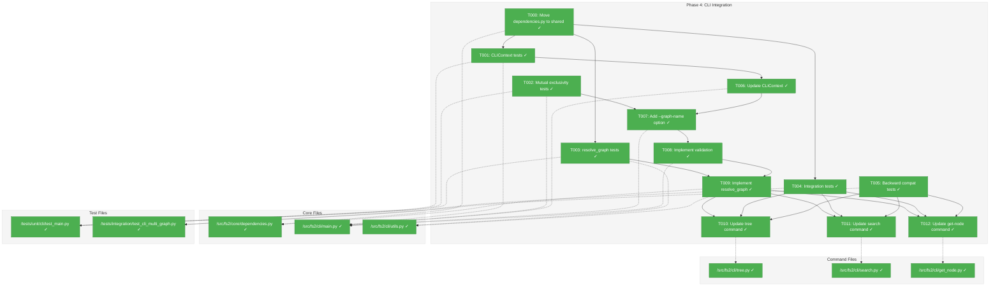
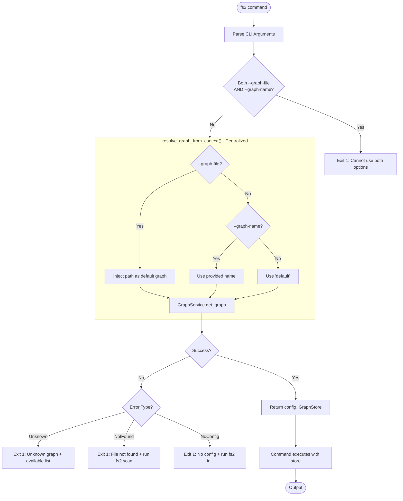
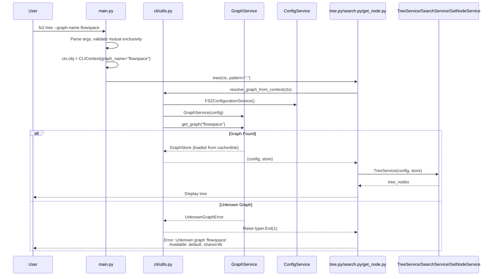

# Phase 4: CLI Integration – Tasks & Alignment Brief

**Spec**: [../../multi-graphs-spec.md](../../multi-graphs-spec.md)
**Plan**: [../../multi-graphs-plan.md](../../multi-graphs-plan.md)
**Date**: 2026-01-14
**Phase Slug**: phase-4-cli-integration

---

## Executive Briefing

### Purpose
This phase adds the `--graph-name` CLI option, enabling users to query external codebases from the command line. Without this, CLI users are limited to MCP-only access for multi-graph functionality, while `--graph-file` only supports one-off path overrides without the caching and configuration benefits of named graphs.

### What We're Building
A `--graph-name` global CLI option that:
- Accepts a configured graph name (e.g., "flowspace", "shared-lib")
- Is mutually exclusive with `--graph-file` (clear error if both provided)
- Routes queries through GraphService for caching and staleness detection
- Works with `tree`, `search`, and `get-node` commands

### User Value
Users can query any configured external graph from the command line with a simple option, benefiting from the same caching and configuration management as MCP users. This enables workflows like:
- `fs2 tree --graph-name flowspace` - Explore external codebase structure
- `fs2 search "pattern" --graph-name shared-lib` - Search in library code
- `fs2 get-node "class:..." --graph-name flowspace` - Get node from external graph

### Example
**Before**: Users must manually specify full paths or only use MCP
```bash
fs2 tree --graph-file /long/path/to/external/.fs2/graph.pickle
```

**After**: Users reference configured graphs by name
```bash
fs2 tree --graph-name flowspace
```

---

## Objectives & Scope

### Objective
Implement the `--graph-name` CLI option as specified in AC7, with mutual exclusivity validation per Critical Finding 05.

### Behavior Checklist (from Plan)
- [ ] BC1: `--graph-name` option available on all graph-consuming commands
- [ ] BC2: Mutual exclusivity with `--graph-file` enforced with clear error
- [ ] BC3: Unknown graph name raises clear error (leverages GraphService exceptions)
- [ ] BC4: Backward compatible - all commands work without `--graph-name`
- [ ] BC5: Help text documents the option

### Goals

- ✅ Add `graph_name` field to CLIContext dataclass
- ✅ Add `--graph-name` option to main() callback
- ✅ Implement mutual exclusivity validation with `--graph-file`
- ✅ Create shared `resolve_graph_from_context()` utility
- ✅ Update tree, search, get-node composition roots
- ✅ Write integration and backward compatibility tests

### Non-Goals (Scope Boundaries)

- ❌ Adding graph_name to `scan` command (scan always targets local project)
- ❌ Adding graph_name to `watch` command (watch monitors local project)
- ❌ Adding graph_name to `doctor` command (diagnoses local config)
- ❌ MCP integration (completed in Phase 3)
- ❌ Tab completion for graph names (future enhancement)
- ❌ `fs2 list-graphs` CLI command (could be added but not in spec)
- ❌ Caching in CLI (CLI is stateless; GraphService provides caching benefit via config)

---

## Architecture Map

### Component Diagram
<!-- Status: grey=pending, orange=in-progress, green=completed, red=blocked -->
<!-- Updated by plan-6 during implementation -->



### Task-to-Component Mapping

<!-- Status: ⬜ Pending | 🟧 In Progress | ✅ Complete | 🔴 Blocked -->

| Task | Component(s) | Files | Status | Comment |
|------|-------------|-------|--------|---------|
| T000 | Shared Dependencies | /src/fs2/core/dependencies.py (new), /src/fs2/mcp/server.py, tests/mcp_tests/*.py | ✅ Complete | Refactor: Move dependencies to shared location (per DYK-02) |
| T001 | CLIContext Model | /src/fs2/cli/main.py, /tests/unit/cli/test_main.py | ✅ Complete | RED: 4 tests for graph_name field |
| T002 | Validation Logic | /src/fs2/cli/main.py, /tests/unit/cli/test_main.py | ✅ Complete | RED: 4 tests for mutual exclusivity |
| T003 | Graph Resolution | /src/fs2/cli/utils.py, /tests/unit/cli/test_main.py | ✅ Complete | RED: 5 tests for resolve_graph_from_context |
| T004 | CLI Commands | /tests/integration/test_cli_multi_graph.py | ✅ Complete | RED: 4 integration tests written |
| T005 | Backward Compat | /tests/integration/test_cli_multi_graph.py | ✅ Complete | RED: 4 backward compat tests written |
| T006 | CLIContext Model | /src/fs2/cli/main.py | ✅ Complete | GREEN: Added graph_name field |
| T007 | CLI Options | /src/fs2/cli/main.py | ✅ Complete | GREEN: Added --graph-name to main() callback |
| T008 | Validation | /src/fs2/cli/main.py | ✅ Complete | GREEN: Mutual exclusivity check implemented |
| T009 | Graph Resolution | /src/fs2/cli/utils.py, /src/fs2/core/dependencies.py | ✅ Complete | GREEN: resolve_graph_from_context() with centralized error handling (per DYK-01, DYK-02, DYK-04) |
| T010 | Tree Command | /src/fs2/cli/tree.py | ✅ Complete | GREEN: Uses GraphStore from resolve_graph_from_context() (per DYK-01) |
| T011 | Search Command | /src/fs2/cli/search.py | ✅ Complete | GREEN: Uses GraphStore from resolve_graph_from_context() (per DYK-01) |
| T012 | Get-node Command | /src/fs2/cli/get_node.py | ✅ Complete | GREEN: Uses GraphStore from resolve_graph_from_context() (per DYK-01) |

---

## Tasks

| Status | ID | Task | CS | Type | Dependencies | Absolute Path(s) | Validation | Subtasks | Notes |
|--------|------|-----------------------------------|-----|------|--------------|-------------------------------|--------------------------------|----------|----------------------|
| [x] | T000 | Move dependencies.py to fs2/core/dependencies.py (shared location) | 2 | Foundation | – | /workspaces/flow_squared/src/fs2/mcp/dependencies.py → /workspaces/flow_squared/src/fs2/core/dependencies.py, /workspaces/flow_squared/src/fs2/mcp/server.py, /workspaces/flow_squared/tests/mcp_tests/*.py | All MCP tests pass, imports updated | – | Per DYK-02, DYK-05: Foundation task, runs FIRST before TDD cycle |
| [x] | T001 | Write tests for CLIContext with graph_name field | 1 | Test | T000 | /workspaces/flow_squared/tests/unit/cli/test_main.py | Field exists, defaults to None | – | RED: 4 tests written, all fail |
| [x] | T002 | Write tests for mutual exclusivity validation | 2 | Test | T001 | /workspaces/flow_squared/tests/unit/cli/test_main.py | Both options = error, either alone = ok | – | RED: 4 tests written, 1 fails as expected |
| [x] | T003 | Write tests for resolve_graph_from_context() | 2 | Test | T000 | /workspaces/flow_squared/tests/unit/cli/test_main.py | Tests: success paths + error cases (unknown graph, missing file, missing config) with actionable messages | – | RED: 5 tests written, all fail (import error) |
| [x] | T004 | Write integration tests for CLI commands with --graph-name | 2 | Test | T001, T002, T003 | /workspaces/flow_squared/tests/integration/test_cli_multi_graph.py | tree, search, get-node with --graph-name succeed | – | RED: 4 tests written, all fail (option doesn't exist) |
| [x] | T005 | Write backward compatibility tests | 2 | Test | T004 | /workspaces/flow_squared/tests/integration/test_cli_multi_graph.py | All commands work without --graph-name | – | RED: 4 tests written, 1 passes |
| [x] | T006 | Update CLIContext dataclass with graph_name field | 1 | Core | T001 | /workspaces/flow_squared/src/fs2/cli/main.py | Tests from T001 pass | – | GREEN: 4/4 tests pass |
| [x] | T007 | Add --graph-name option to main() callback | 2 | Core | T006 | /workspaces/flow_squared/src/fs2/cli/main.py | Option registered with help text | – | log#task-t007 [^11] |
| [x] | T008 | Implement mutual exclusivity validation | 2 | Core | T002, T007 | /workspaces/flow_squared/src/fs2/cli/main.py | Tests from T002 pass | – | log#task-t008 [^11] |
| [x] | T009 | Implement resolve_graph_from_context() utility | 3 | Core | T000, T003, T008 | /workspaces/flow_squared/src/fs2/cli/utils.py | Returns (config, GraphStore) OR raises typer.Exit(1) with actionable error; tests from T003 pass | – | log#task-t009 [^11] |
| [x] | T010 | Update tree command composition root | 2 | Core | T009 | /workspaces/flow_squared/src/fs2/cli/tree.py | Uses resolved graph, tests from T004 pass | – | log#task-t010 [^11] |
| [x] | T011 | Update search command composition root | 2 | Core | T009 | /workspaces/flow_squared/src/fs2/cli/search.py | Uses resolved graph, tests from T004 pass | – | log#task-t011 [^11] |
| [x] | T012 | Update get-node command composition root | 2 | Core | T009 | /workspaces/flow_squared/src/fs2/cli/get_node.py | Uses resolved graph, tests from T004 pass | [001](./001-subtask-add-list-graphs-cli-command.md) | log#task-t012 [^11] |

---

## Alignment Brief

### Prior Phases Review

#### Phase-by-Phase Summary

**Phase 1 (Configuration Model) → Phase 2 (GraphService) → Phase 3 (MCP Integration)**

The multi-graphs feature evolved across three phases building a complete foundation:

1. **Phase 1** established the configuration foundation with `OtherGraph` and `OtherGraphsConfig` Pydantic models, including the reserved "default" name validation and custom list merge logic for user+project configs.

2. **Phase 2** created `GraphService` with thread-safe caching, staleness detection, and path resolution (absolute/tilde/relative). The `_source_dir` PrivateAttr was added to track config file origin for relative path resolution.

3. **Phase 3** integrated GraphService with MCP tools, adding `list_graphs` tool and `graph_name` parameter to tree/search/get_node. Created `FakeGraphService` for testing and established error translation patterns.

#### Cumulative Deliverables from All Prior Phases

**Phase 1 Exports**:
- `OtherGraph` model (`/workspaces/flow_squared/src/fs2/config/objects.py:740-801`)
- `OtherGraphsConfig` model (`/workspaces/flow_squared/src/fs2/config/objects.py:804-838`)
- `_concatenate_and_dedupe()` merge logic (`/workspaces/flow_squared/src/fs2/config/service.py:271-326`)
- `_source_dir` PrivateAttr for path resolution context

**Phase 2 Exports**:
- `GraphService` class (`/workspaces/flow_squared/src/fs2/core/services/graph_service.py:153-396`)
- `GraphInfo` dataclass (`/workspaces/flow_squared/src/fs2/core/services/graph_service.py:114-133`)
- `GraphServiceError`, `UnknownGraphError`, `GraphFileNotFoundError` exceptions
- `_resolve_path()` method for path normalization
- Double-checked locking pattern for thread-safe caching

**Phase 3 Exports**:
- `get_graph_service()` singleton (`/workspaces/flow_squared/src/fs2/mcp/dependencies.py:126-145`)
- `get_graph_store(graph_name)` updated signature (`/workspaces/flow_squared/src/fs2/mcp/dependencies.py:85-113`)
- `FakeGraphService` test double (`/workspaces/flow_squared/src/fs2/core/services/graph_service_fake.py`)
- `translate_graph_error()` helper (`/workspaces/flow_squared/src/fs2/mcp/server.py`)
- Error handling patterns for MCP tools

#### Pattern Evolution and Architectural Continuity

| Pattern | Phase 1 | Phase 2 | Phase 3 | Phase 4 (This Phase) |
|---------|---------|---------|---------|----------------------|
| Config Access | `config.require(OtherGraphsConfig)` | Same | Same | Same |
| Graph Resolution | N/A | `GraphService.get_graph(name)` | Via `get_graph_store(name)` | Via `resolve_graph_from_context()` → `GraphService.get_graph()` (per DYK-01) |
| Error Types | N/A | `UnknownGraphError`, `GraphFileNotFoundError` | Translated to `ToolError` | Translated to Typer error |
| Path Resolution | `_source_dir` tracking | `_resolve_path()` | Uses GraphService | Uses GraphService (even for --graph-file per DYK-01) |

#### Cross-Phase Learnings

1. **CLI is Stateless, MCP is Stateful**: Unlike MCP where GraphService caching provides performance benefits, CLI commands create fresh services per invocation. CLI gains configuration convenience but not caching.

2. **Error Translation Pattern**: Phase 3 established `translate_graph_error()` in server.py. Phase 4 should follow similar pattern - catch `GraphServiceError` and convert to `typer.BadParameter` or exit with error message.

3. **Composition Root Pattern (Updated per DYK-01)**: All CLI commands will use a unified pattern:
   ```python
   # resolve_graph_from_context() handles ALL cases via GraphService
   config, graph_store = resolve_graph_from_context(ctx)
   # graph_store is pre-loaded, ready to use
   service = TreeService(config=config, graph_store=graph_store)
   ```
   Per DYK-01: Both `--graph-file` and `--graph-name` route through GraphService for consistency with MCP.

4. **TreeService Reload Bug (Phase 3)**: Discovered that TreeService's `_ensure_loaded()` would overwrite external graph content. Fixed by checking `len(get_all_nodes()) > 0`. This fix means CLI can safely use pre-loaded stores from GraphService.

#### Reusable Test Infrastructure from Prior Phases

| Asset | Location | Use in Phase 4 |
|-------|----------|----------------|
| `FakeGraphService` | `/workspaces/flow_squared/src/fs2/core/services/graph_service_fake.py` | Mock graph resolution in unit tests |
| `FakeConfigurationService` | `/workspaces/flow_squared/src/fs2/config/service.py` | Configure test scenarios |
| `create_test_graph_file()` | Phase 2/3 test helpers | Create temp graphs for integration tests |
| `CliRunner` | pytest-typer | CLI command testing |
| Fixture graph | `/workspaces/flow_squared/tests/fixtures/fixture_graph.pkl` | Real graph for integration tests |

#### Critical Findings Timeline

| Finding | Phase Applied | How It Affects Phase 4 |
|---------|---------------|------------------------|
| 01: Config List Concatenation | Phase 1 | Graphs from user+project configs available |
| 02: MCP Singleton → GraphService | Phase 2, 3 | Use `GraphService` for resolution in CLI |
| 03: RLock for Thread Safety | Phase 2 | CLI is single-threaded; not directly relevant |
| 04: Reserved Name "default" | Phase 1 | CLI can use "default" as alias for local graph |
| **05: Mutual Exclusivity** | **Phase 4** | **Core requirement for this phase** |
| **06: 6+ Composition Roots** | **Phase 4** | **Extract resolve_graph_from_context()** |
| 07: Services Need No Changes | Phase 3 | CLI services unchanged; only composition roots |
| 08: list_graphs Fast | Phase 3 | N/A for CLI (no list-graphs command) |
| 12: Backward Compatibility | **Phase 4** | **All commands must work without --graph-name** |

### Critical Findings Affecting This Phase

**Critical Finding 05: Mutual Exclusivity of --graph-name and --graph-file**
- **Constraint**: Both options cannot be provided simultaneously
- **Required**: Validate in `main()` callback before composition roots
- **Error**: `typer.BadParameter` with clear message
- **Tasks Addressing**: T002, T008

**Critical Finding 06: 6+ Command Composition Roots Need Consistent Changes**
- **Constraint**: tree, search, get-node (and potentially others) need same graph resolution logic
- **Required**: Extract `resolve_graph_from_context()` utility
- **Pattern**: Returns absolute path or raises on unknown graph name
- **Tasks Addressing**: T003, T009, T010, T011, T012

**Critical Finding 07: Existing Services Require No Signature Changes**
- **Implication**: TreeService, SearchService, GetNodeService work unchanged
- **Action**: Only composition roots change; pass resolved GraphStore
- **Tasks Addressing**: T010, T011, T012

**Critical Finding 12: Backward Compatibility Must Be Verified**
- **Constraint**: All commands without `--graph-name` must work as before
- **Required**: Integration tests for all affected commands
- **Tasks Addressing**: T005

### Invariants & Guardrails

1. **Mutual Exclusivity**: `--graph-file` and `--graph-name` cannot both be provided
2. **Reserved Name**: "default" resolves to local project graph
3. **Error Messages**: All errors must be clear and actionable (per DYK-04)
4. **Exit Codes**: Follow existing pattern (0=success, 1=user error, 2=system error)

### Error Message Specification (DYK-04)

All error messages handled centrally in `resolve_graph_from_context()`. Each must be **clear** (what went wrong) and **actionable** (how to fix it).

| Error Case | Exit Code | Message Format |
|------------|-----------|----------------|
| Unknown graph name | 1 | `Error: Unknown graph '{name}'.\n  Available graphs: {comma-separated list}\n  Configure graphs in .fs2/config.yaml under 'other_graphs'.` |
| Graph file not found | 1 | `Error: Graph file not found for '{name}' at: {resolved_path}\n  Run 'fs2 scan' in the target project to create the graph.` |
| Missing config (with --graph-name) | 1 | `Error: No configuration found.\n  Run 'fs2 init' first, then configure graphs in .fs2/config.yaml.` |
| Both options provided | 1 | `Error: Cannot use both --graph-file and --graph-name.\n  Use --graph-file for one-off paths, or --graph-name for configured graphs.` |

**Implementation**: Use Rich console to stderr with `[red]Error:[/red]` prefix for consistency with existing CLI error style.

### Inputs to Read

| File | Purpose |
|------|---------|
| `/workspaces/flow_squared/src/fs2/cli/main.py` | CLIContext and main() callback |
| `/workspaces/flow_squared/src/fs2/cli/tree.py` | Composition root pattern, lines 163-179 |
| `/workspaces/flow_squared/src/fs2/cli/search.py` | Composition root pattern, lines 174-206 |
| `/workspaces/flow_squared/src/fs2/cli/get_node.py` | Composition root pattern, lines 61-74 |
| `/workspaces/flow_squared/src/fs2/cli/utils.py` | Add resolve_graph_from_context() here |
| `/workspaces/flow_squared/src/fs2/core/services/graph_service.py` | GraphService API for resolution |
| `/workspaces/flow_squared/src/fs2/mcp/server.py` | translate_graph_error() pattern |

### Visual Alignment Aids

#### Flow Diagram: CLI Graph Resolution



#### Sequence Diagram: CLI with --graph-name



### Test Plan (TDD Approach)

#### Unit Tests (/tests/unit/cli/test_main.py)

| Test Class | Test Method | Purpose | Fixtures |
|------------|-------------|---------|----------|
| `TestCLIContextGraphName` | `test_graph_name_field_exists` | Verify field added | None |
| `TestCLIContextGraphName` | `test_graph_name_defaults_to_none` | Verify default | None |
| `TestMutualExclusivity` | `test_both_options_raises_error` | Per CF05 | CliRunner |
| `TestMutualExclusivity` | `test_only_graph_file_works` | Backward compat | tmp_graph_file |
| `TestMutualExclusivity` | `test_only_graph_name_works` | New feature | configured_graph |
| `TestMutualExclusivity` | `test_neither_option_uses_default` | Backward compat | default_graph |
| `TestResolveGraphFromContext` | `test_graph_file_returns_path_directly` | Pass-through | tmp_graph_file |
| `TestResolveGraphFromContext` | `test_graph_name_resolves_via_service` | Uses GraphService | FakeGraphService |
| `TestResolveGraphFromContext` | `test_unknown_graph_name_raises_exit` | Error handling | FakeGraphService |
| `TestResolveGraphFromContext` | `test_default_returns_config_graph_path` | Default behavior | FakeConfigService |

#### Integration Tests (/tests/integration/test_cli_multi_graph.py)

| Test Class | Test Method | Purpose | Fixtures |
|------------|-------------|---------|----------|
| `TestCLIMultiGraph` | `test_tree_with_graph_name` | E2E tree | tmp_config, tmp_graphs |
| `TestCLIMultiGraph` | `test_search_with_graph_name` | E2E search | tmp_config, tmp_graphs |
| `TestCLIMultiGraph` | `test_get_node_with_graph_name` | E2E get-node | tmp_config, tmp_graphs |
| `TestCLIMultiGraph` | `test_unknown_graph_name_error` | Error message | tmp_config |
| `TestBackwardCompatibility` | `test_tree_without_graph_options` | BC check | default_graph |
| `TestBackwardCompatibility` | `test_search_without_graph_options` | BC check | default_graph |
| `TestBackwardCompatibility` | `test_get_node_without_graph_options` | BC check | default_graph |
| `TestBackwardCompatibility` | `test_tree_with_graph_file_only` | BC check | tmp_graph_file |

### Step-by-Step Implementation Outline

| Step | Task ID | Action | Validation |
|------|---------|--------|------------|
| 1 | T000 | Move dependencies.py to fs2/core/dependencies.py | All MCP tests pass, imports updated |
| 2 | T001 | Write 2 tests for CLIContext.graph_name | Tests fail (RED) |
| 3 | T002 | Write 4 tests for mutual exclusivity | Tests fail (RED) |
| 4 | T003 | Write 4 tests for resolve_graph_from_context | Tests fail (RED) |
| 5 | T004 | Write 4 integration tests for --graph-name | Tests fail (RED) |
| 6 | T005 | Write 4 backward compatibility tests | Tests fail (RED) |
| 7 | T006 | Add graph_name field to CLIContext | T001 tests pass |
| 8 | T007 | Add --graph-name option to main() | Option visible in --help |
| 9 | T008 | Implement mutual exclusivity validation | T002 tests pass |
| 10 | T009 | Implement resolve_graph_from_context() | T003 tests pass |
| 11 | T010 | Update tree composition root | T004 tree test passes |
| 12 | T011 | Update search composition root | T004 search test passes |
| 13 | T012 | Update get-node composition root | T004 get-node test passes, T005 all pass |

### Commands to Run

```bash
# Environment setup (from devcontainer, already configured)
cd /workspaces/flow_squared

# Run all tests
pytest tests/unit/cli/test_main.py -v
pytest tests/integration/test_cli_multi_graph.py -v

# Run specific test class
pytest tests/unit/cli/test_main.py::TestMutualExclusivity -v

# Type checking
pyright src/fs2/cli/

# Linting
ruff check src/fs2/cli/

# Manual testing
fs2 tree --help                     # Verify --graph-name in help
fs2 tree --graph-name flowspace     # Test named graph
fs2 tree --graph-file /tmp/g.pkl --graph-name x  # Test mutual exclusivity error
```

### Risks & Unknowns

| Risk | Severity | Mitigation |
|------|----------|------------|
| CLI tests may be slower than unit tests | Low | Keep unit tests focused; minimize integration tests |
| CliRunner may not capture all error states | Medium | Use exit code assertions + output pattern matching |
| GraphService not designed for CLI use | Low | CLI creates fresh GraphService per invocation (no caching, but config benefit) |

### Ready Check

- [x] Prior phases (1, 2, 3) complete and understood
- [x] All 13 tasks have clear acceptance criteria (T000-T012, refined via DYK session)
- [x] Test plan covers all behavior checklist items
- [x] Error handling patterns established (DYK-04: centralized in resolve_graph_from_context)
- [x] Critical findings mapped to tasks (CF05→T002,T008; CF06→T003,T009; CF07→T010-T012; CF12→T005)
- [x] DYK session completed (5 insights captured, architecture refined)

**Awaiting GO/NO-GO approval before implementation.**

---

## Phase Footnote Stubs

<!-- Populated by plan-6a-update-progress during implementation -->

| Footnote | Description | FlowSpace Node IDs |
|----------|-------------|-------------------|
| | | |

[^11]: Phase 4 completion - CLI multi-graph integration
  - `file:src/fs2/cli/main.py` - Added --graph-name option, mutual exclusivity
  - `function:src/fs2/cli/utils.py:resolve_graph_from_context` - Graph resolution utility
  - `file:src/fs2/cli/tree.py` - Updated composition root
  - `file:src/fs2/cli/search.py` - Updated composition root
  - `file:src/fs2/cli/get_node.py` - Updated composition root
  - `file:src/fs2/core/dependencies.py` - Shared DI container (created)
  - `file:tests/unit/cli/test_main.py` - Unit tests (created)
  - `file:tests/integration/test_cli_multi_graph.py` - Integration tests (created)

---

## Evidence Artifacts

**Execution Log**: `./execution.log.md` (created by plan-6 during implementation)

**Supporting Files** (created as needed):
- Test fixtures in `/workspaces/flow_squared/tests/integration/fixtures/` if needed
- Temporary configs created via `tmp_path` pytest fixture

---

## Discoveries & Learnings

_Populated during implementation by plan-6. Log anything of interest to your future self._

| Date | Task | Type | Discovery | Resolution | References |
|------|------|------|-----------|------------|------------|
| | | | | | |

**Types**: `gotcha` | `research-needed` | `unexpected-behavior` | `workaround` | `decision` | `debt` | `insight`

**What to log**:
- Things that didn't work as expected
- External research that was required
- Implementation troubles and how they were resolved
- Gotchas and edge cases discovered
- Decisions made during implementation
- Technical debt introduced (and why)
- Insights that future phases should know about

_See also: `execution.log.md` for detailed narrative._

---

## DYK Session (2026-01-14)

Critical insights surfaced during `/didyouknow` review before implementation.

### DYK-01: resolve_graph_from_context() Return Type

**Issue**: Should the utility return a path (string) or a loaded GraphStore?

**Options**:
- A: Return Path - CLI creates GraphStore itself
- B: Return tuple (path, source) - CLI knows which option was used
- C: Always use GraphService - CLI uses same pattern as MCP

**Decision**: **C** - "we should always follow the same behaviors"

**Rationale**: GraphService provides consistent caching, staleness detection, and error handling. CLI should use the same infrastructure as MCP for consistency.

**Updates**: T003, T009, T010-T012 notes; Pattern Evolution table; Cross-Phase Learnings

---

### DYK-02: CLI Test Infrastructure Gap

**Issue**: FakeGraphService injection pattern from MCP won't work for CLI tests (CLI creates fresh services in each command).

**Investigation**: Parallel subagents reviewed MCP tests and dependencies.py. Found that `fs2.mcp.dependencies` is NOT MCP-specific - it's a general-purpose DI container that CLI could also use.

**Options**:
- A: Use fs2.mcp.dependencies as-is (import from mcp package)
- B: Move to shared location (fs2/core/dependencies.py)
- C: Use now, refactor later

**Decision**: **B** - "plan to do it properly now, thoroughly test"

**Rationale**: CLI importing from `mcp` package creates wrong dependency direction. Move to `fs2/core/` so both MCP and CLI can use it.

**Updates**: Added T000 (foundation task); T001, T003, T004, T009 dependencies; Architecture diagram

---

### DYK-03: CLI Singleton Behavior

**Issue**: Singletons in CLI vs MCP behave differently. CLI is per-process (stateless), MCP is long-lived (stateful with caching).

**Options**:
- A: No action - this is a non-issue (CLI creates fresh each invocation, no caching needed)
- B: Document the difference

**Decision**: **A** - This is a non-issue

**Rationale**: CLI doesn't need caching since it's a short-lived process. GraphService still provides value for graph resolution logic and error handling.

**Updates**: None required

---

### DYK-04: Error Message UX

**Issue**: Different error experiences for --graph-file (file not found) vs --graph-name (unknown name, or file not found for known name).

**Options**:
- A: Direct passthrough - let underlying services raise their own errors
- B: CLI error translation - catch and re-format in each command
- C: Handle in resolve_graph_from_context() - centralized error formatting

**Decision**: **C** - "remember all errors must be clear and actionable"

**Rationale**: Centralized error handling ensures consistent UX. All errors should include: what went wrong, why, and how to fix it.

**Updates**: Added Error Message Specification section; T003, T009 notes; flow diagram

---

### DYK-05: Task Ordering

**Issue**: T000 is a foundation/refactor task that moves dependencies.py. Should it run before the TDD cycle, or be integrated into it?

**Options**:
- A: T000 first (foundation), then TDD cycle (T001-T005 RED, T006-T012 GREEN)
- B: Import stubs to allow tests to be written before move
- C: Keep current ordering (TDD first)

**Decision**: **A**

**Rationale**: T000 is a pure refactor with no behavior change. Running it first establishes the foundation that all other tasks depend on. All existing MCP tests validate the move was correct.

**Updates**: T000 type changed from "Refactor" to "Foundation"; Step-by-Step Implementation Outline updated

---

### DYK Session Summary

| ID | Topic | Decision | Impact |
|----|-------|----------|--------|
| DYK-01 | Return type | Use GraphService | T003, T009, T010-T012 |
| DYK-02 | Test infrastructure | Move dependencies.py | Added T000 |
| DYK-03 | Singleton behavior | Non-issue | None |
| DYK-04 | Error UX | Centralize in resolve_graph_from_context | T003, T009, spec |
| DYK-05 | Task ordering | T000 first | Execution order |

**Key Architectural Decisions**:
1. CLI uses same DI pattern as MCP (shared `fs2/core/dependencies.py`)
2. GraphService handles all graph resolution (not direct path manipulation)
3. Error messages are centralized with actionable guidance
4. Foundation task (T000) runs before TDD cycle

---

## Directory Layout

```
docs/plans/023-multi-graphs/
├── multi-graphs-spec.md
├── multi-graphs-plan.md
└── tasks/
    ├── phase-1-config-model/
    │   ├── tasks.md
    │   └── execution.log.md
    ├── phase-2-graphservice-impl/
    │   ├── tasks.md
    │   └── execution.log.md
    ├── phase-3-mcp-integration/
    │   ├── tasks.md
    │   └── execution.log.md
    └── phase-4-cli-integration/       # THIS PHASE
        ├── tasks.md                    # This file
        └── execution.log.md            # Created by plan-6
```
