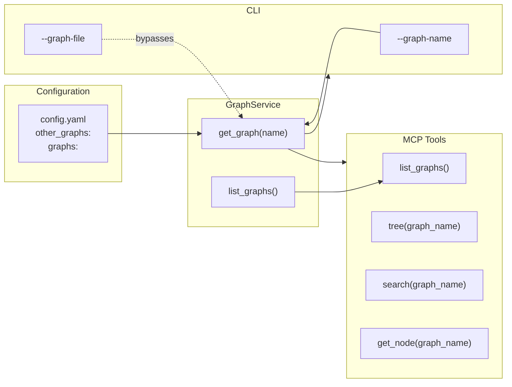
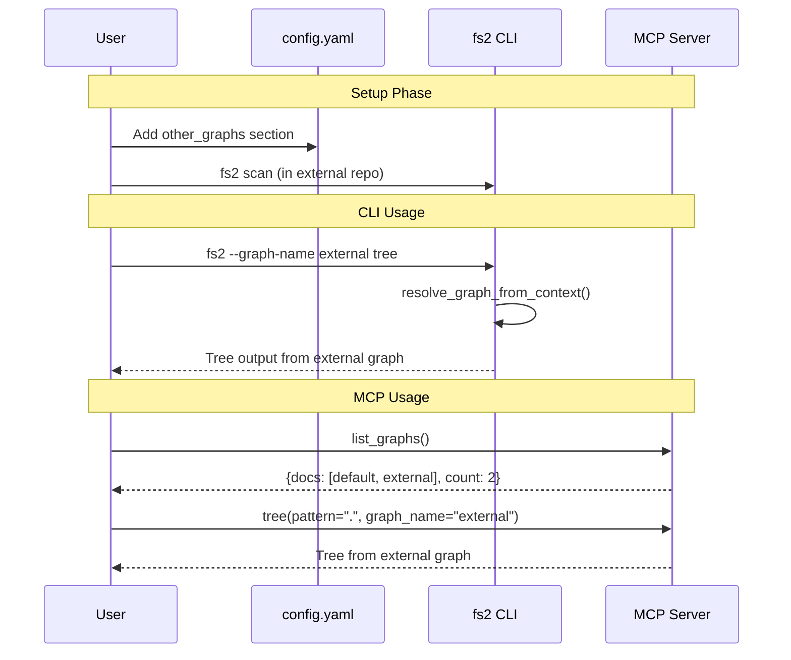

# Phase 5: Documentation – Tasks & Alignment Brief

**Phase**: Phase 5: Documentation
**Slug**: phase-5-documentation
**Spec**: [../../multi-graphs-spec.md](../../multi-graphs-spec.md)
**Plan**: [../../multi-graphs-plan.md](../../multi-graphs-plan.md)
**Date**: 2026-01-14
**Testing Approach**: Lightweight (documentation phase)

---

## Executive Briefing

### Purpose
This phase documents the multi-graph feature for users and AI agents, completing the feature implementation. Without proper documentation, users cannot discover or effectively use the multi-graph capability that Phases 1-4 implemented.

### What We're Building
Comprehensive documentation for the multi-graph feature:
- A new user guide (`multi-graphs.md`) covering configuration, CLI, and MCP usage
- Registry entry enabling MCP agents to discover the documentation
- Cross-references from existing guides (CLI, MCP, configuration)
- README.md update highlighting the capability

### User Value
Users and AI agents can discover, understand, and effectively use multi-graph support:
- Configure external graphs via YAML
- Query multiple codebases from CLI using `--graph-name`
- Use `list_graphs()` and `graph_name` parameter in MCP tools
- Troubleshoot common issues with clear guidance

### Example
**Before**: User discovers `--graph-name` option via `--help` but has no guidance on configuration or usage patterns.

**After**: User runs `docs_get(id="multi-graphs")` via MCP or reads the guide and immediately understands:
```yaml
# .fs2/config.yaml
other_graphs:
  graphs:
    - name: shared-lib
      path: ~/projects/shared/.fs2/graph.pickle
      description: Shared utility library
```
```bash
fs2 --graph-name shared-lib tree
```

---

## Objectives & Scope

### Objective
Document the multi-graph feature following the hybrid approach (human docs + MCP delivery), ensuring all acceptance criteria from the spec are discoverable.

**Behavior Checklist** (from spec AC11):
- [ ] README.md mentions multi-graph capability
- [ ] Dedicated guide covers config + CLI + MCP usage
- [ ] Registry entry enables MCP discovery
- [ ] Cross-references link to multi-graphs.md

### Goals

- ✅ Create comprehensive `docs/how/user/multi-graphs.md` guide
- ✅ Add registry entry for MCP `docs_get(id="multi-graphs")`
- ✅ Update README.md features section with brief mention
- ✅ Add cross-reference from configuration-guide.md
- ✅ Add cross-reference from cli.md (document `--graph-name` option)
- ✅ Add cross-reference from mcp-server-guide.md (document `list_graphs` tool)
- ✅ Verify doc-build succeeds and MCP discovery works

### Non-Goals (Scope Boundaries)

- ❌ Detailed API reference (code is self-documenting via docstrings)
- ❌ Video tutorials or screencasts
- ❌ Internationalization/translation
- ❌ Architecture diagrams (covered in plan.md, not user docs)
- ❌ Changelog entries (separate process)
- ❌ Marketing copy or promotional content

---

## Architecture Map

### Component Diagram

```mermaid
flowchart TD
    classDef pending fill:#9E9E9E,stroke:#757575,color:#fff
    classDef inprogress fill:#FF9800,stroke:#F57C00,color:#fff
    classDef completed fill:#4CAF50,stroke:#388E3C,color:#fff
    classDef blocked fill:#F44336,stroke:#D32F2F,color:#fff

    style Phase fill:#F5F5F5,stroke:#E0E0E0
    style Files fill:#F5F5F5,stroke:#E0E0E0

    subgraph Phase["Phase 5: Documentation"]
        T001["T001: Survey docs ✓"]:::completed
        T002["T002: Update README ✓"]:::completed
        T003["T003: Create multi-graphs.md ✓"]:::completed
        T004["T004: Add registry entry ✓"]:::completed
        T005["T005: Update cli.md ✓"]:::completed
        T006["T006: Update mcp-server-guide.md ✓"]:::completed
        T007["T007: Update configuration-guide.md ✓"]:::completed
        T008["T008: Run doc-build and verify ✓"]:::completed

        T001 --> T002 & T003
        T003 --> T004
        T004 --> T008
        T001 --> T005 & T006 & T007
        T005 --> T008
        T006 --> T008
        T007 --> T008
    end

    subgraph Files["Files"]
        F1["/workspaces/flow_squared/README.md"]:::completed
        F2["/workspaces/flow_squared/docs/how/user/multi-graphs.md"]:::completed
        F3["/workspaces/flow_squared/docs/how/user/registry.yaml"]:::completed
        F4["/workspaces/flow_squared/docs/how/user/cli.md"]:::completed
        F5["/workspaces/flow_squared/docs/how/user/mcp-server-guide.md"]:::completed
        F6["/workspaces/flow_squared/docs/how/user/configuration-guide.md"]:::completed
    end

    T002 -.-> F1
    T003 -.-> F2
    T004 -.-> F3
    T005 -.-> F4
    T006 -.-> F5
    T007 -.-> F6
```

<!-- Status: grey=pending, orange=in-progress, green=completed, red=blocked -->
<!-- Updated by plan-6 during implementation -->



### Task-to-Component Mapping

<!-- Status: ⬜ Pending | 🟧 In Progress | ✅ Complete | 🔴 Blocked -->

| Task | Component(s) | Files | Status | Comment |
|------|-------------|-------|--------|---------|
| T001 | Survey | All docs/how/user/*.md | ✅ Complete | Identified integration points |
| T002 | README | /workspaces/flow_squared/README.md | ✅ Complete | Added Multi-Graph guide entry |
| T003 | Guide | /workspaces/flow_squared/docs/how/user/multi-graphs.md | ✅ Complete | Main deliverable created |
| T004 | Registry | /workspaces/flow_squared/docs/how/user/registry.yaml | ✅ Complete | MCP discovery enabled |
| T005 | CLI Docs | /workspaces/flow_squared/docs/how/user/cli.md | ✅ Complete | --graph-name documented |
| T006 | MCP Docs | /workspaces/flow_squared/docs/how/user/mcp-server-guide.md | ✅ Complete | list_graphs and graph_name documented |
| T007 | Config Docs | /workspaces/flow_squared/docs/how/user/configuration-guide.md | ✅ Complete | other_graphs section added |
| T008 | Verification | Build system | ✅ Complete | doc-build passed, MCP discovery verified |

---

## Tasks

| Status | ID | Task | CS | Type | Dependencies | Absolute Path(s) | Validation | Subtasks | Notes |
|--------|------|------|-----|------|--------------|------------------|------------|----------|-------|
| [x] | T001 | Survey existing docs for integration points | 1 | Setup | – | /workspaces/flow_squared/docs/how/user/ | List files needing cross-refs documented | – | Identify cli.md, mcp-server-guide.md, configuration-guide.md sections |
| [x] | T002 | Update README.md with multi-graph mention | 1 | Doc | T001 | /workspaces/flow_squared/README.md | README.md mentions multi-graph in features section; link to guide | – | Brief addition to Guides table or new section |
| [x] | T003 | Create docs/how/user/multi-graphs.md | 2 | Doc | T001 | /workspaces/flow_squared/docs/how/user/multi-graphs.md | Complete guide covering config, CLI, MCP usage with examples | – | Primary deliverable |
| [x] | T004 | Add registry.yaml entry for multi-graphs | 1 | Doc | T003 | /workspaces/flow_squared/docs/how/user/registry.yaml | Entry added with id, title, summary, category, tags, path | – | Enables MCP docs_get(id="multi-graphs") |
| [x] | T005 | Update cli.md with --graph-name documentation | 1 | Doc | T001 | /workspaces/flow_squared/docs/how/user/cli.md | --graph-name option documented in Global Options section | – | Add after --graph-file section |
| [x] | T006 | Update mcp-server-guide.md with list_graphs tool and graph_name parameter | 2 | Doc | T001 | /workspaces/flow_squared/docs/how/user/mcp-server-guide.md | list_graphs tool documented; graph_name param on tree/search/get_node documented | – | Add to Available Tools section |
| [x] | T007 | Update configuration-guide.md with other_graphs reference | 1 | Doc | T001 | /workspaces/flow_squared/docs/how/user/configuration-guide.md | Cross-reference to multi-graphs.md added; brief mention of other_graphs section | – | Add to Configuration File Locations or new section |
| [x] | T008 | Run doc-build and verify MCP discovery | 1 | Integration | T003, T004 | /workspaces/flow_squared/ | `just doc-build` succeeds; `docs_get(id="multi-graphs")` returns content via MCP | – | Final verification |

---

## Alignment Brief

### Prior Phases Review

#### Cross-Phase Synthesis

**Phase Evolution Summary**:
1. **Phase 1 (Configuration Model)**: Established `OtherGraph` and `OtherGraphsConfig` Pydantic models with reserved name validation and custom list merge. Created the YAML schema that docs must explain.
2. **Phase 2 (GraphService)**: Built thread-safe `GraphService` with caching and staleness detection. Established error types (`UnknownGraphError`, `GraphFileNotFoundError`) that docs must reference for troubleshooting.
3. **Phase 3 (MCP Integration)**: Added `list_graphs()` tool and `graph_name` parameter to tree/search/get_node. These are the MCP features to document.
4. **Phase 4 (CLI Integration)**: Added `--graph-name` CLI option with mutual exclusivity. This is the CLI feature to document.

**Cumulative Deliverables Available**:

| Phase | Key Components | Docs Must Cover |
|-------|----------------|-----------------|
| Phase 1 | `OtherGraph`, `OtherGraphsConfig` | YAML schema, field descriptions |
| Phase 2 | `GraphService`, error types | Error messages, troubleshooting |
| Phase 3 | `list_graphs()`, `graph_name` param | MCP tool usage, examples |
| Phase 4 | `--graph-name`, `resolve_graph_from_context()` | CLI option, mutual exclusivity |

**Pattern Evolution**:
- Configuration follows existing patterns in `configuration-guide.md`
- CLI follows existing patterns in `cli.md` (Global Options section)
- MCP follows existing patterns in `mcp-server-guide.md` (Available Tools table)

**Reusable Documentation Patterns**:
- YAML code blocks with comments explaining each field
- Example commands with expected output
- Troubleshooting tables (Error → Cause → Solution)
- Cross-reference links to related guides

**Critical Findings Affecting Documentation**:
- **CF04 (Reserved name "default")**: Must document that "default" cannot be used as a graph name
- **CF05 (Mutual exclusivity)**: Must document that --graph-file and --graph-name cannot both be used
- **CF09 (Path resolution)**: Must document absolute, tilde (~), and relative path handling
- **DYK-04 (Actionable errors)**: Error messages include graph names and hints; docs should explain

### Invariants & Guardrails

- Documentation must be accurate to implemented behavior
- No time estimates in docs (focus on what, not when)
- Examples must be tested/verified
- Cross-references must use relative paths that work both in GitHub and locally

### Inputs to Read

| File | Purpose |
|------|---------|
| `/workspaces/flow_squared/src/fs2/config/objects.py` (lines 740-838) | OtherGraph, OtherGraphsConfig field definitions |
| `/workspaces/flow_squared/src/fs2/core/services/graph_service.py` | GraphService API, error types |
| `/workspaces/flow_squared/src/fs2/cli/main.py` (lines 62-97) | --graph-name option, mutual exclusivity |
| `/workspaces/flow_squared/src/fs2/mcp/server.py` | list_graphs tool, graph_name parameter |
| `/workspaces/flow_squared/docs/how/user/registry.yaml` | Existing registry format |
| `/workspaces/flow_squared/docs/how/user/configuration-guide.md` | Existing config doc patterns |
| `/workspaces/flow_squared/docs/how/user/cli.md` | Existing CLI doc patterns |
| `/workspaces/flow_squared/docs/how/user/mcp-server-guide.md` | Existing MCP doc patterns |

### Visual Alignment Aids

#### Feature Flow Diagram



#### User Journey Sequence



### Test Plan

This is a documentation phase with lightweight testing:

| Test | Method | Expected Result |
|------|--------|-----------------|
| multi-graphs.md renders | Visual inspection | Markdown renders correctly on GitHub |
| Registry entry valid | `just doc-build` | No YAML errors |
| MCP discovery works | `docs_get(id="multi-graphs")` via MCP | Returns full document content |
| Cross-refs work | Click links in GitHub UI | All links resolve |
| Examples valid | Run example commands | Commands work as documented |

### Step-by-Step Implementation Outline

1. **T001 (Survey)**: Read existing docs to understand patterns and identify exact insertion points
2. **T002 (README)**: Add brief multi-graph mention to README.md Guides table
3. **T003 (Main Guide)**: Create comprehensive multi-graphs.md with:
   - Overview and motivation
   - YAML configuration with field descriptions
   - CLI usage with --graph-name examples
   - MCP usage with list_graphs() and graph_name examples
   - Path resolution rules
   - Troubleshooting section
4. **T004 (Registry)**: Add entry to registry.yaml matching existing format
5. **T005 (CLI Docs)**: Add --graph-name to Global Options in cli.md
6. **T006 (MCP Docs)**: Add list_graphs tool and graph_name param to mcp-server-guide.md
7. **T007 (Config Docs)**: Add cross-reference to configuration-guide.md
8. **T008 (Verify)**: Run doc-build, test MCP discovery, verify links

### Commands to Run

```bash
# Survey docs structure
ls -la docs/how/user/

# After writing docs, build and verify
just doc-build

# Test MCP discovery (requires running MCP server)
# In Claude Code: docs_get(id="multi-graphs")

# Verify markdown renders
# Open multi-graphs.md in GitHub or VS Code preview
```

### Risks/Unknowns

| Risk | Severity | Mitigation |
|------|----------|------------|
| Inconsistent terminology | Low | Review existing docs for terminology patterns |
| Broken cross-references | Low | Test all links after writing |
| Registry YAML syntax error | Low | Validate with doc-build |
| Examples don't match implementation | Medium | Test examples against actual code |

### Ready Check

- [x] Phase 1-4 implementation complete (verified by plan progress tracking)
- [x] Existing documentation patterns understood (survey complete)
- [x] Registry format understood (registry.yaml read)
- [x] Critical findings that affect docs identified (CF04, CF05, CF09)
- [ ] ADR constraints mapped to tasks - N/A (no ADRs exist)

---

## Content Outline for multi-graphs.md

```markdown
# Multi-Graph Configuration Guide

## Overview
- What multi-graph support enables
- Use cases (local project + external libraries, monorepo navigation)

## Prerequisites: Scanning External Repositories

**IMPORTANT**: Before adding an external graph to your config, you must first
scan that repository to create its graph file. There are two approaches:

### Approach A: Initialize fs2 in the External Repository (Recommended)
```bash
# Navigate to the external repository
cd /path/to/shared-library

# Initialize fs2 locally
fs2 init

# Scan the repository (creates .fs2/graph.pickle)
fs2 scan

# Optional: faster scan without AI enrichment
fs2 scan --no-smart-content --no-embeddings
```

The graph file is created at `/path/to/shared-library/.fs2/graph.pickle`.
Reference this path in your `other_graphs` config.

### Approach B: Scan from Your Project with --scan-path
```bash
# From your main project directory
cd /path/to/my-project

# Scan external directory and save to custom location
fs2 scan \
  --scan-path /path/to/shared-library \
  --graph-file .fs2/graphs/shared-lib.pickle

# Or using relative path
fs2 scan \
  --scan-path ../shared-library \
  --graph-file .fs2/graphs/shared-lib.pickle
```

This creates a graph file within your project at `.fs2/graphs/shared-lib.pickle`.

### Which Approach to Choose?

| Approach | Best For | Graph Location |
|----------|----------|----------------|
| **A: Init in external repo** | Shared team repos, frequently updated | In external repo's `.fs2/` |
| **B: --scan-path** | Third-party code, one-off scans | In your project's `.fs2/graphs/` |

**Key difference**: With Approach A, the external repo "owns" its graph and can
update it independently. With Approach B, you control when to rescan.

## Configuration

### YAML Schema
- `other_graphs` section structure
- `OtherGraph` fields: name, path, description, source_url
- Reserved name "default" (cannot be used)

### Example Configuration
```yaml
other_graphs:
  graphs:
    # External repo with its own fs2 setup (Approach A)
    - name: shared-lib
      path: ~/projects/shared/.fs2/graph.pickle
      description: Shared utility library
      source_url: https://github.com/org/shared

    # Scanned into local project (Approach B)
    - name: vendor-sdk
      path: .fs2/graphs/vendor-sdk.pickle
      description: Vendor SDK (scanned locally)
```

### Path Resolution
- Absolute paths: used as-is
- Tilde paths: `~` expanded to home directory
- Relative paths: resolved from config file directory

## CLI Usage

### --graph-name Option
- Global option (before command)
- Mutually exclusive with --graph-file

### Examples
```bash
# Query external graph
fs2 --graph-name shared-lib tree
fs2 --graph-name shared-lib search "config"

# Default graph (no option needed)
fs2 tree
```

## MCP Usage

### Discovering Available Graphs
```python
list_graphs()
# Returns: {"docs": [...], "count": N}
```

### Querying Specific Graphs
```python
tree(pattern=".", graph_name="shared-lib")
search(pattern="config", graph_name="shared-lib")
get_node(node_id="...", graph_name="shared-lib")
```

### Default Behavior
- `graph_name=None` uses default (local) graph
- `graph_name="default"` explicitly uses local graph

## Complete End-to-End Example

```bash
# Step 1: Scan the external repository (once)
cd /path/to/django-cache-library
fs2 init
fs2 scan --no-smart-content  # Fast scan without AI

# Step 2: Back in your main project, add to config
cd /path/to/my-project
# Edit .fs2/config.yaml to add:
#   other_graphs:
#     graphs:
#       - name: cache-lib
#         path: /path/to/django-cache-library/.fs2/graph.pickle
#         description: Django cache utilities

# Step 3: Use the external graph
fs2 --graph-name cache-lib tree
fs2 --graph-name cache-lib search "redis"
```

## Troubleshooting

| Error | Cause | Solution |
|-------|-------|----------|
| Unknown graph name | Graph not in config | Check `other_graphs.graphs` in config.yaml |
| Graph file not found | Path doesn't exist | Run `fs2 scan` in target repository first |
| Cannot use both | --graph-file and --graph-name together | Use only one option |
| "default" is reserved | Used "default" as graph name | Choose a different name |
```

---

## Phase Footnote Stubs

_Footnotes will be added by plan-6 during implementation._

| ID | Task(s) | FlowSpace Node IDs | Description |
|----|---------|-------------------|-------------|
| | | | |

---

## Evidence Artifacts

### Execution Log Location
`/workspaces/flow_squared/docs/plans/023-multi-graphs/tasks/phase-5-documentation/execution.log.md`

### Supporting Files
- Created: `docs/how/user/multi-graphs.md`
- Modified: `README.md`, `cli.md`, `mcp-server-guide.md`, `configuration-guide.md`, `registry.yaml`

---

## Discoveries & Learnings

_Populated during implementation by plan-6. Log anything of interest to your future self._

| Date | Task | Type | Discovery | Resolution | References |
|------|------|------|-----------|------------|------------|
| | | | | | |

**Types**: `gotcha` | `research-needed` | `unexpected-behavior` | `workaround` | `decision` | `debt` | `insight`

**What to log**:
- Things that didn't work as expected
- External research that was required
- Implementation troubles and how they were resolved
- Gotchas and edge cases discovered
- Decisions made during implementation
- Technical debt introduced (and why)
- Insights that future phases should know about

_See also: `execution.log.md` for detailed narrative._

---

## Directory Layout

```
docs/plans/023-multi-graphs/
├── multi-graphs-spec.md
├── multi-graphs-plan.md
└── tasks/
    ├── phase-1-configuration-model/
    │   └── (no formal tasks.md - predates system)
    ├── phase-2-graphservice-implementation/
    │   └── (no formal tasks.md - predates system)
    ├── phase-3-mcp-integration/
    │   ├── tasks.md
    │   └── execution.log.md
    ├── phase-4-cli-integration/
    │   ├── tasks.md
    │   └── execution.log.md
    └── phase-5-documentation/
        ├── tasks.md           # This file
        └── execution.log.md   # Created by plan-6
```
