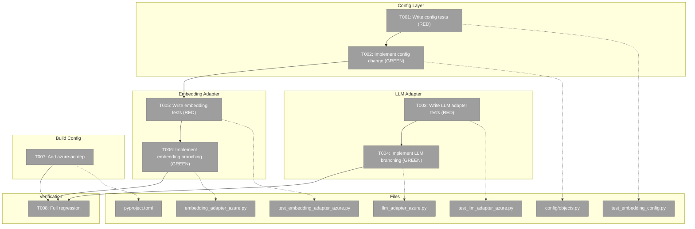
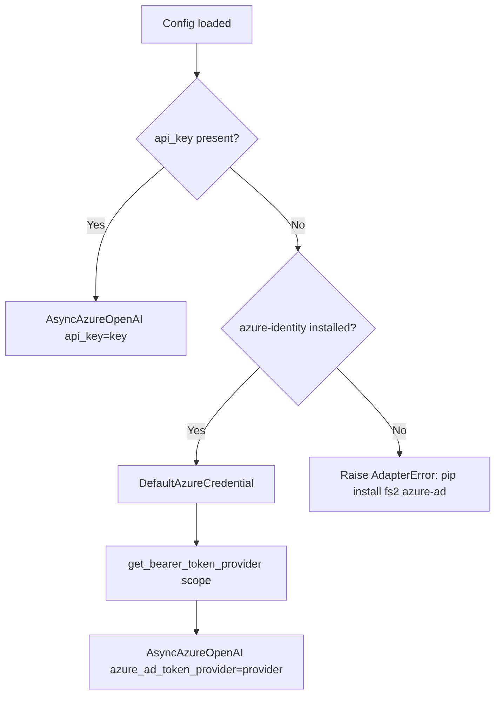
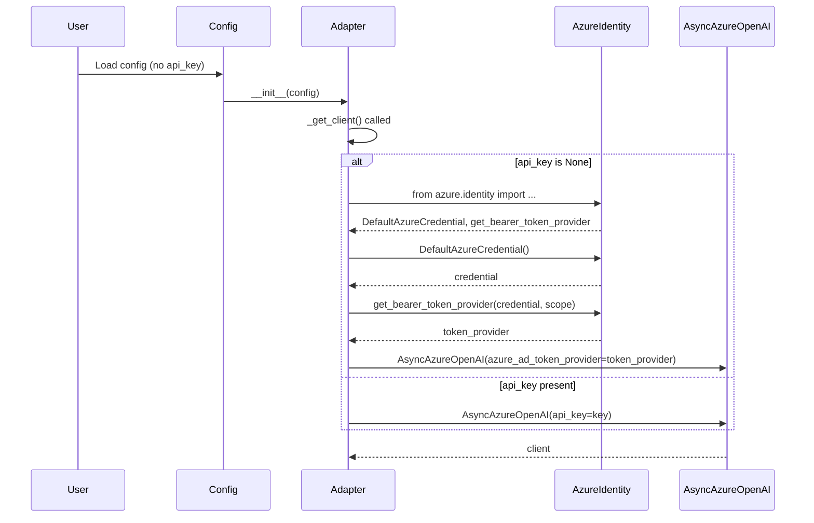

# Implementation (Single Phase) – Tasks & Alignment Brief

**Spec**: [az-login-spec.md](../../az-login-spec.md)
**Plan**: [az-login-plan.md](../../az-login-plan.md)
**Workshop**: [az-login-changes.md](../../workshops/az-login-changes.md)
**Date**: 2026-02-13

---

## Executive Briefing

### Purpose

This phase adds Azure AD credential support to fs2's Azure OpenAI adapters. When
API keys are disabled by Azure tenant policy, users who `az login` need fs2 to
automatically use their Azure AD token — without any API key in config.

### What We're Building

Branching logic in two `_get_client()` methods (LLM and embedding adapters) that:
- Detects whether an API key is configured
- If key present: uses it (existing behavior, unchanged)
- If key absent: lazy-imports `azure-identity`, creates a `DefaultAzureCredential`,
  wraps it with `get_bearer_token_provider`, and passes the token provider to
  `AsyncAzureOpenAI` instead of an API key

Plus: making `AzureEmbeddingConfig.api_key` optional, adding an `azure-ad` optional
dependency group, and providing actionable errors when `azure-identity` is missing.

### User Value

Users on restricted Azure tenants can run `fs2 scan --embed` with just `az login` —
no API key needed. Users with API keys see zero behavior change.

### Example

**Before (key-based — unchanged):**
```yaml
embedding:
  azure:
    endpoint: https://myresource.openai.azure.com
    api_key: ${AZURE_EMBEDDING_API_KEY}
```

**After (Azure AD — just remove api_key):**
```yaml
embedding:
  azure:
    endpoint: https://myresource.openai.azure.com
    # no api_key → uses az login / DefaultAzureCredential
```

---

## Objectives & Scope

### Objective

Implement Azure AD credential support via `DefaultAzureCredential` when no API key
is configured, maintaining full backward compatibility with key-based auth.

### Goals

- ✅ `AzureEmbeddingConfig.api_key` accepts `None` (type: `str | None = None`)
- ✅ LLM adapter `_get_client()` branches: key → use key, no key → use Azure AD
- ✅ Embedding adapter `_get_client()` same branching pattern
- ✅ Actionable `ImportError` when `azure-identity` not installed
- ✅ `api_key` and `azure_ad_token_provider` never both passed to `AsyncAzureOpenAI`
- ✅ `pyproject.toml` has `azure-ad` optional dependency group
- ✅ All existing tests pass without modification
- ✅ Full TDD: tests written first (RED), then implementation (GREEN)

### Non-Goals

- ❌ Async `DefaultAzureCredential` (sync is sufficient for batch workloads)
- ❌ Managed Identity testing (works via credential chain, not our use case)
- ❌ Sharing token provider across adapters (YAGNI)
- ❌ Service principal configuration (works automatically, no fs2 changes)
- ❌ New config fields, flags, or auth mode settings
- ❌ Updating bundled `configuration-guide.md` (nice-to-have, not in scope)
- ❌ Updating embedding adapter init error message (Finding 12, nice-to-have)

---

## Pre-Implementation Audit

### Summary

| File | Action | Origin | Modified By | Recommendation |
|------|--------|--------|-------------|----------------|
| `src/fs2/config/objects.py` | Modify | Plan 002 | Plans 023, 025 | keep-as-is |
| `src/fs2/core/adapters/llm_adapter_azure.py` | Modify | Plan 007 | Plans 017, 023 | keep-as-is |
| `src/fs2/core/adapters/embedding_adapter_azure.py` | Modify | Plan 009 | Plan 023 | keep-as-is |
| `pyproject.toml` | Modify | Plan 002 | Plans 020, 023 | keep-as-is |
| `tests/unit/config/test_embedding_config.py` | Modify | Plan 009 | Plan 023 | keep-as-is |
| `tests/unit/adapters/test_llm_adapter_azure.py` | Modify | Plan 007 | Plans 017, 023 | keep-as-is |
| `tests/unit/adapters/test_embedding_adapter_azure.py` | Modify | Plan 009 | Plan 023 | keep-as-is |

### Compliance Check

No HIGH violations found. One medium note:

| Severity | File | Rule | Note | Mitigation |
|----------|------|------|------|------------|
| MEDIUM | `config/objects.py` | R6.4 | Config schema change should update bundled docs | Deferred — spec says "No documentation". Nice-to-have in future. |

All files clear for modification. No architecture violations. No external plan conflicts.

---

## Requirements Traceability

### Coverage Matrix

| AC | Description | Flow Summary | Files in Flow | Tasks | Status |
|----|-------------|-------------|---------------|-------|--------|
| AC1 | api_key present → key-based auth | LLM/Embed adapters pass api_key to AsyncAzureOpenAI | llm_adapter_azure.py, embedding_adapter_azure.py | T003, T005 (test key-present branch) | ✅ Complete — existing behavior preserved by if/else |
| AC2 | api_key absent + azure-identity → Azure AD | _get_client() else branch: lazy-import → DefaultAzureCredential → token_provider | objects.py, llm_adapter_azure.py, embedding_adapter_azure.py, pyproject.toml | T001→T002, T003→T004, T005→T006, T007 | ✅ Complete |
| AC3 | api_key absent + no azure-identity → error | _get_client() catches ImportError → LLMAdapterError/EmbeddingAdapterError | llm_adapter_azure.py, embedding_adapter_azure.py, exceptions.py | T003→T004, T005→T006 | ✅ Complete |
| AC4 | AzureEmbeddingConfig.api_key accepts None | api_key: str → str \| None = None, validator updated | objects.py, test_embedding_config.py | T001→T002 | ✅ Complete |
| AC5 | pyproject.toml azure-ad optional dep | Add azure-ad group with azure-identity>=1.18.0,<2 | pyproject.toml | T007 | ✅ Complete |
| AC6 | All existing tests pass | No changes to existing tests; all use api_key="test-key" | all test files | T008 | ✅ Complete |
| AC7 | api_key / azure_ad_token_provider mutually exclusive | if/else branching in _get_client() — never both | llm_adapter_azure.py, embedding_adapter_azure.py | T003→T004, T005→T006 | ✅ Complete |

### Gaps Found

No gaps — all acceptance criteria have complete file coverage.

### Orphan Files

None. All task files map to acceptance criteria.

---

## Architecture Map

### Component Diagram

<!-- Status: grey=pending, orange=in-progress, green=completed, red=blocked -->
<!-- Updated by plan-6 during implementation -->



### Task-to-Component Mapping

<!-- Status: ⬜ Pending | 🟧 In Progress | ✅ Complete | 🔴 Blocked -->

| Task | Component(s) | Files | Status | Comment |
|------|-------------|-------|--------|---------|
| T001 | Config Tests | test_embedding_config.py | ⬜ Pending | TDD RED: 3 tests for api_key=None |
| T002 | Config Model | objects.py | ⬜ Pending | TDD GREEN: api_key optional + validator |
| T003 | LLM Tests | test_llm_adapter_azure.py | ⬜ Pending | TDD RED: 3 tests for Azure AD branch |
| T004 | LLM Adapter | llm_adapter_azure.py | ⬜ Pending | TDD GREEN: _get_client() branching |
| T005 | Embedding Tests | test_embedding_adapter_azure.py | ⬜ Pending | TDD RED: 3 tests for Azure AD branch |
| T006 | Embedding Adapter | embedding_adapter_azure.py | ⬜ Pending | TDD GREEN: _get_client() branching |
| T007 | Build Config | pyproject.toml | ⬜ Pending | Add azure-ad optional dep group |
| T008 | Verification | (all) | ⬜ Pending | Run full suite, verify zero regressions |

---

## Tasks

| Status | ID | Task | CS | Type | Dependencies | Absolute Path(s) | Validation | Subtasks | Notes |
|--------|----|------|----|------|--------------|-------------------|------------|----------|-------|
| [ ] | T001 | Write tests for `AzureEmbeddingConfig` accepting `api_key=None` | 1 | Test | – | /Users/jak/github/fs2-az-login/tests/unit/config/test_embedding_config.py | 3 new tests: (1) defaults to None when omitted, (2) explicit None accepted, (3) empty string still rejected. All FAIL (RED). | – | AC4 |
| [ ] | T002 | Make `AzureEmbeddingConfig.api_key` optional (`str \| None = None`) and update validator | 1 | Core | T001 | /Users/jak/github/fs2-az-login/src/fs2/config/objects.py | T001 tests pass (GREEN). Existing config tests still pass. | – | AC4. Validator: `if v is not None and not v.strip()` |
| [ ] | T003 | Write tests for LLM adapter `_get_client()` Azure AD branch | 2 | Test | – | /Users/jak/github/fs2-az-login/tests/unit/adapters/test_llm_adapter_azure.py | 3 new tests: (1) no key + azure-identity → uses token provider, (2) no key + no azure-identity → raises LLMAdapterError with install message, (3) key present → passes api_key only. All FAIL (RED). | – | AC2, AC3, AC7 |
| [ ] | T004 | Implement LLM adapter `_get_client()` branching | 1 | Core | T003 | /Users/jak/github/fs2-az-login/src/fs2/core/adapters/llm_adapter_azure.py | T003 tests pass (GREEN). Scope: `https://cognitiveservices.azure.com/.default`. | – | AC2, AC3, AC7. Per Finding 07: hardcode scope. |
| [ ] | T005 | Write tests for Embedding adapter `_get_client()` Azure AD branch | 2 | Test | T002 | /Users/jak/github/fs2-az-login/tests/unit/adapters/test_embedding_adapter_azure.py | 3 new tests: same pattern as T003 but with `EmbeddingAdapterError`. All FAIL (RED). | – | AC2, AC3, AC7. Requires T002 for api_key=None config. |
| [ ] | T006 | Implement Embedding adapter `_get_client()` branching | 1 | Core | T005 | /Users/jak/github/fs2-az-login/src/fs2/core/adapters/embedding_adapter_azure.py | T005 tests pass (GREEN). Same scope and pattern as T004. | – | AC2, AC3, AC7 |
| [ ] | T007 | Add `azure-ad` optional dependency group to `pyproject.toml` | 1 | Config | – | /Users/jak/github/fs2-az-login/pyproject.toml | `azure-ad = ["azure-identity>=1.18.0,<2"]` group present in `[project.optional-dependencies]`. | – | AC5 |
| [ ] | T008 | Run full test suite — verify zero regressions | 1 | Verify | T002, T004, T006, T007 | – | `pytest tests/ -v` passes 100%. All existing tests unchanged and passing. All new tests passing. | – | AC1, AC6 |

---

## Alignment Brief

### Critical Findings Affecting This Phase

| # | Finding | Impact | Addressed By |
|---|---------|--------|-------------|
| 01 | `_get_client()` in both adapters is isolated lazy-init — safe to branch | Critical | T004, T006 |
| 02 | `api_key` and `azure_ad_token_provider` are mutually exclusive in SDK | Critical | T004, T006 (if/else branching) |
| 03 | `azure-identity` is NOT a dependency — must lazy-import | Critical | T004, T006 (try/except ImportError) |
| 04 | `LLMConfig.api_key` is already `str \| None = None` — no change needed | High | – (no action) |
| 05 | `AzureEmbeddingConfig.api_key` is `str` (required) — needs change | High | T001, T002 |
| 06 | Sync `DefaultAzureCredential` works with `AsyncAzureOpenAI` | High | T004, T006 (use sync credential) |
| 07 | Correct scope is `https://cognitiveservices.azure.com/.default` | High | T004, T006 (hardcode) |
| 08 | Pin `azure-identity>=1.18.0,<2` for `get_bearer_token_provider` | High | T007 |

### Invariants & Guardrails

- **Mutual exclusivity**: `api_key` and `azure_ad_token_provider` are never both passed to `AsyncAzureOpenAI`.
- **Backward compatibility**: All existing tests pass without modification. Any config with `api_key` set continues to work identically.
- **Lazy import**: `azure-identity` is only imported inside `_get_client()` when needed (no top-level import).
- **Error actionability**: ImportError wraps in domain error with `pip install fs2[azure-ad]` message.

### Inputs to Read

| File | Lines | What to Check |
|------|-------|---------------|
| `src/fs2/config/objects.py` | 444-488 | AzureEmbeddingConfig current definition |
| `src/fs2/core/adapters/llm_adapter_azure.py` | 98-113 | Current `_get_client()` |
| `src/fs2/core/adapters/embedding_adapter_azure.py` | 76-88 | Current `_get_client()` |
| `pyproject.toml` | 28-34 | Current `[project.optional-dependencies]` |
| `workshops/az-login-changes.md` | all | Exact before/after for every change |

### Flow Diagram



### Sequence Diagram



### Test Plan (Full TDD, Targeted Mocks)

#### T001 Tests — Config (3 tests, no mocks)

| Test | What It Proves | Expected |
|------|---------------|----------|
| `test_given_no_api_key_when_constructed_then_defaults_to_none` | api_key defaults to None when omitted | `config.api_key is None` |
| `test_given_explicit_none_api_key_when_constructed_then_accepts` | Explicit None is accepted | No ValidationError |
| `test_given_empty_string_api_key_when_constructed_then_rejects` | Empty string still rejected | ValidationError with "api_key" |

#### T003 Tests — LLM Adapter (3 tests, mock azure.identity)

| Test | What It Proves | Mock Strategy | Expected |
|------|---------------|--------------|----------|
| `test_given_no_api_key_and_azure_identity_when_get_client_then_uses_token_provider` | Azure AD path works | `patch.dict("sys.modules", {"azure": ..., "azure.identity": ...})` | AsyncAzureOpenAI called with `azure_ad_token_provider`, NOT `api_key` |
| `test_given_no_api_key_and_no_azure_identity_when_get_client_then_raises_error` | ImportError handled | Mock import to raise ImportError | LLMAdapterError with "pip install fs2[azure-ad]" |
| `test_given_api_key_when_get_client_then_uses_key_not_token_provider` | Mutual exclusivity | No azure.identity mock needed | `api_key` passed, no `azure_ad_token_provider` |

#### T005 Tests — Embedding Adapter (3 tests, same mock pattern)

Same as T003 but with `EmbeddingAdapterError` and `AzureEmbeddingConfig(endpoint=..., api_key=None)`.

### Step-by-Step Implementation Outline

1. **T001**: Add `TestAzureEmbeddingConfigOptionalApiKey` class to `test_embedding_config.py` with 3 tests. Run → all 3 FAIL (RED).
2. **T002**: In `objects.py`, change `api_key: str` → `api_key: str | None = None`. Update validator to accept None. Run T001 tests → all 3 PASS (GREEN). Run existing tests → all pass.
3. **T003**: Add `TestAzureAdapterAzureADAuth` class to `test_llm_adapter_azure.py` with 3 tests. Run → all 3 FAIL (RED).
4. **T004**: In `llm_adapter_azure.py`, replace `_get_client()` with if/else branching per workshop. Run T003 tests → all 3 PASS (GREEN).
5. **T005**: Add `TestAzureEmbeddingAdapterAzureADAuth` class to `test_embedding_adapter_azure.py` with 3 tests. Run → all 3 FAIL (RED).
6. **T006**: In `embedding_adapter_azure.py`, replace `_get_client()` with same branching. Run T005 tests → all 3 PASS (GREEN).
7. **T007**: In `pyproject.toml`, add `azure-ad` optional dep group before `dev`.
8. **T008**: Run `pytest tests/ -v`. All tests pass. Zero regressions.

### Commands to Run

```bash
# Run specific test file (during TDD cycles)
pytest tests/unit/config/test_embedding_config.py -v -k "OptionalApiKey"
pytest tests/unit/adapters/test_llm_adapter_azure.py -v -k "AzureADAuth"
pytest tests/unit/adapters/test_embedding_adapter_azure.py -v -k "AzureADAuth"

# Run full suite (T008 verification)
pytest tests/ -v

# Lint check
ruff check src/ tests/

# Type hint sanity (if mypy configured)
# mypy src/fs2/config/objects.py src/fs2/core/adapters/
```

### Risks

| Risk | Likelihood | Impact | Mitigation |
|------|------------|--------|------------|
| Mocking `sys.modules` for azure-identity import tests is fragile | Medium | Low | Well-established pattern; consistent approach in both test files |
| Existing tests break due to config model change | Low | High | `AzureEmbeddingConfig` change is additive (None default); existing tests always pass `api_key="test-key"` |
| `DefaultAzureCredential` scope string wrong | Low | High | Hardcode `https://cognitiveservices.azure.com/.default` per external research |
| Validator logic error (accepts empty or rejects None) | Medium | Medium | T001 tests guard both cases explicitly |

### Ready Check

- [x] All files identified and audited
- [x] All ACs have complete file coverage (requirements flow: 7/7)
- [x] No architecture violations
- [x] Test plan covers all branches (key-present, key-absent+installed, key-absent+not-installed)
- [x] Workshop has exact before/after code for every change
- [x] Critical findings mapped to tasks
- [ ] **GO / NO-GO** — awaiting approval

---

## Phase Footnote Stubs

| Footnote | Task | Summary | FlowSpace Node IDs |
|----------|------|---------|-------------------|
| [^1] | T002 | Made AzureEmbeddingConfig.api_key optional | `file:src/fs2/config/objects.py` |
| [^2] | T004 | Added Azure AD auth branch to LLM adapter | `callable:src/fs2/core/adapters/llm_adapter_azure.py:AzureOpenAIAdapter._get_client` |
| [^3] | T006 | Added Azure AD auth branch to Embedding adapter | `callable:src/fs2/core/adapters/embedding_adapter_azure.py:AzureEmbeddingAdapter._get_client` |
| [^4] | T007 | Added azure-ad optional dependency group | `file:pyproject.toml` |

---

## Evidence Artifacts

- **Execution log**: `implementation-single-phase/execution.log.md` (created by plan-6)
- **Test output**: Captured in execution log per TDD cycle (RED → GREEN)

---

## Discoveries & Learnings

_Populated during implementation by plan-6. Log anything of interest to your future self._

| Date | Task | Type | Discovery | Resolution | References |
|------|------|------|-----------|------------|------------|
| | | | | | |

**Types**: `gotcha` | `research-needed` | `unexpected-behavior` | `workaround` | `decision` | `debt` | `insight`

**What to log**:
- Things that didn't work as expected
- External research that was required
- Implementation troubles and how they were resolved
- Gotchas and edge cases discovered
- Decisions made during implementation
- Technical debt introduced (and why)
- Insights that future phases should know about

_See also: `execution.log.md` for detailed narrative._

---

## Directory Layout

```
docs/plans/024-az-login/
├── az-login-plan.md
├── az-login-spec.md
├── research-dossier.md
├── workshops/
│   └── az-login-changes.md
├── external-research/
│   ├── azure-identity-version-compat.md
│   └── async-credential-behavior.md
└── tasks/
    └── implementation-single-phase/
        ├── tasks.md              ← this file
        ├── tasks.fltplan.md      ← generated by /plan-5b
        └── execution.log.md     ← created by /plan-6
```
