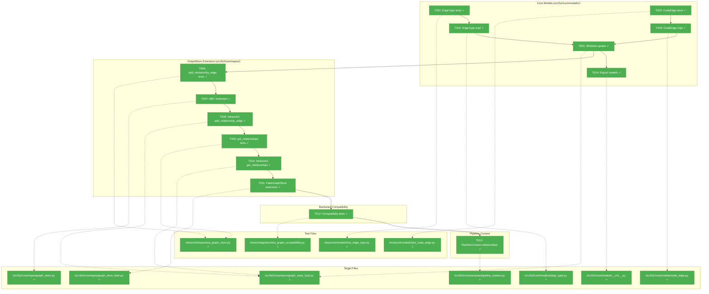
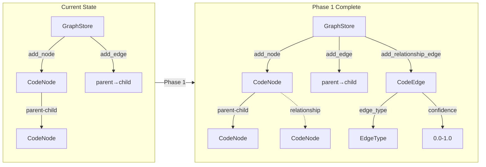
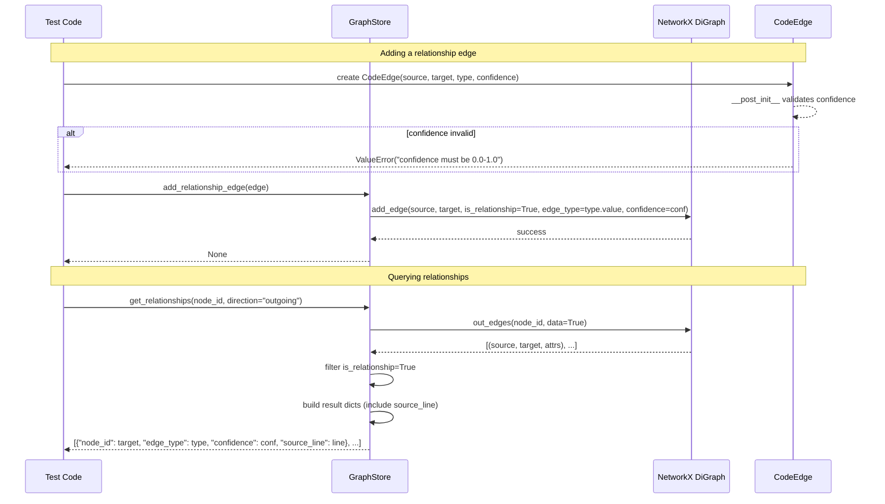

# Phase 1: Core Models & GraphStore Extension – Tasks & Alignment Brief

**Spec**: [../../cross-file-impl-spec.md](../../cross-file-impl-spec.md)
**Plan**: [../../cross-file-impl-plan.md](../../cross-file-impl-plan.md)
**Date**: 2026-01-13
**Phase Slug**: `phase-1-core-models-graphstore-extension`

---

## Executive Briefing

### Purpose

This phase establishes the foundational data models and storage infrastructure for cross-file relationship detection. Without these primitives, no subsequent phase can persist or query relationship edges. This is the **blocking prerequisite** for all other phases.

### What We're Building

A complete foundation for relationship edge storage consisting of:
- **EdgeType enum** (`IMPORTS`, `CALLS`, `REFERENCES`, `DOCUMENTS`) - type-safe classification of relationship edges
- **CodeEdge frozen dataclass** - immutable edge representation with confidence validation (0.0-1.0)
- **Extended GraphStore ABC** with `add_relationship_edge()` and `get_relationships()` methods
- **NetworkXGraphStore implementation** - production storage using NetworkX edge attributes
- **FakeGraphStore implementation** - test double with full relationship support
- **RestrictedUnpickler whitelist update** - security-safe unpickling of new models

### User Value

Agents will be able to query relationships for **any node type** (files, classes, methods, callables) once relationships are extracted in later phases. Key query patterns:

1. **Import discovery**: "What does this file import?" / "What imports this module?"
2. **Call graph**: "What calls this method?" / "What does this function call?"
3. **Documentation discovery**: "What markdown files reference this method?" → Find plans, logs, and docs that mention specific code elements, with exact line numbers for navigation

This phase ensures those relationships can be stored, retrieved, and persisted correctly—including the `source_line` where each reference occurs.

### Example

**Before**: Graph only stores structural containment (file → class → method):
```python
graph_store.get_children("file:src/app.py")  # Returns contained classes/functions
# No way to know what imports this, calls this, or documents this
```

**After**: Graph supports relationship edges with confidence and source line:
```python
# Add an import relationship
edge = CodeEdge(
    source_node_id="file:src/app.py",
    target_node_id="file:src/auth_handler.py",
    edge_type=EdgeType.IMPORTS,
    confidence=0.9,
    source_line=5,
)
graph_store.add_relationship_edge(edge)

# Query imports (outgoing from a file)
imports = graph_store.get_relationships("file:src/app.py", direction="outgoing")
# Returns: [{"node_id": "file:src/auth_handler.py", "edge_type": "imports", "confidence": 0.9, "source_line": 5}]

# Query dependents (incoming to a file)
dependents = graph_store.get_relationships("file:src/auth_handler.py", direction="incoming")
# Returns: [{"node_id": "file:src/app.py", "edge_type": "imports", "confidence": 0.9, "source_line": 5}]

# Documentation discovery: "What references this method?"
refs = graph_store.get_relationships("method:src/auth.py:AuthHandler.validate", direction="incoming")
# Returns: [
#   {"node_id": "file:docs/plans/024/tasks.md", "edge_type": "references", "confidence": 1.0, "source_line": 156},
#   {"node_id": "file:README.md", "edge_type": "documents", "confidence": 0.5, "source_line": 42},
# ]
```

---

## Objectives & Scope

### Objective

Create foundational data models (EdgeType, CodeEdge) and extend GraphStore ABC with relationship methods, enabling all subsequent phases to store and query cross-file relationship edges.

**Behavior Checklist (from AC Mapping)**:
- [ ] EdgeType enum is serializable, comparable, and preserved through pickle (AC1)
- [ ] CodeEdge raises ValueError for confidence outside 0.0-1.0 (AC2)
- [ ] GraphStore.add_relationship_edge() stores edges with all attributes (AC3)
- [ ] GraphStore.get_relationships() returns correct edges by direction (AC3, AC7)
- [ ] Old v1.0 graphs load without errors; relationship queries return empty (AC8)
- [ ] FakeGraphStore supports relationship edges for testing (AC9)

### Goals

- ✅ Create EdgeType enum following ContentType pattern (`class EdgeType(str, Enum)`)
- ✅ Create CodeEdge frozen dataclass following ChunkMatch pattern (validation in `__post_init__`)
- ✅ Extend GraphStore ABC with 2 new abstract methods
- ✅ Implement NetworkXGraphStore.add_relationship_edge() using edge attributes
- ✅ Implement NetworkXGraphStore.get_relationships() with direction filtering
- ✅ Extend FakeGraphStore with relationship edge support (new data structure)
- ✅ Update RestrictedUnpickler whitelist for security
- ✅ Add PipelineContext.relationships field for stage data flow
- ✅ Export new models from models/__init__.py
- ✅ Write comprehensive tests with >80% coverage

### Non-Goals (Scope Boundaries)

- ❌ **Relationship extraction logic** - Phase 2-4 scope; we only build storage
- ❌ **Pipeline stage creation** - Phase 5 scope; context field added here but stage later
- ❌ **MCP tool implementation** - Phase 6 scope; GraphStore methods are internal
- ❌ **Confidence tier calculation** - Phase 2-4 scope; we only validate 0.0-1.0 bounds
- ❌ **Performance optimization** - Not required for foundation; profile if needed later
- ❌ **Format version bump to 1.1** - Defer until Phase 5 when feature ships
- ❌ **Edge type filtering in get_relationships()** - Per spec clarification, return all types, client filters

---

## Architecture Map

### Component Diagram

<!-- Status: grey=pending, orange=in-progress, green=completed, red=blocked -->
<!-- Updated by plan-6 during implementation -->



### Task-to-Component Mapping

<!-- Status: ⬜ Pending | 🟧 In Progress | ✅ Complete | 🔴 Blocked -->

| Task | Component(s) | Files | Status | Comment |
|------|-------------|-------|--------|---------|
| T001 | EdgeType Tests | /workspaces/flow_squared/tests/unit/models/test_edge_type.py | ✅ Complete | RED: 12 tests fail (ModuleNotFoundError) |
| T002 | EdgeType Enum | /workspaces/flow_squared/src/fs2/core/models/edge_type.py | ✅ Complete | GREEN: 12/12 tests pass |
| T003 | CodeEdge Tests | /workspaces/flow_squared/tests/unit/models/test_code_edge.py | ✅ Complete | RED: 15 tests fail (ModuleNotFoundError) |
| T004 | CodeEdge Model | /workspaces/flow_squared/src/fs2/core/models/code_edge.py | ✅ Complete | GREEN: 15/15 tests pass |
| T005 | RestrictedUnpickler | /workspaces/flow_squared/src/fs2/core/repos/graph_store_impl.py | ✅ Complete | Added edge_type, code_edge to whitelist |
| T006 | GraphStore Tests | /workspaces/flow_squared/tests/unit/repos/test_graph_store.py | ✅ Complete | RED → GREEN: 13 relationship tests |
| T007 | GraphStore ABC | /workspaces/flow_squared/src/fs2/core/repos/graph_store.py | ✅ Complete | Added 2 abstract methods |
| T008 | NetworkXGraphStore | /workspaces/flow_squared/src/fs2/core/repos/graph_store_impl.py | ✅ Complete | add_relationship_edge() implemented |
| T009 | GraphStore Tests | /workspaces/flow_squared/tests/unit/repos/test_graph_store.py | ✅ Complete | get_relationships() tests |
| T010 | NetworkXGraphStore | /workspaces/flow_squared/src/fs2/core/repos/graph_store_impl.py | ✅ Complete | get_relationships() implemented |
| T011 | FakeGraphStore | /workspaces/flow_squared/src/fs2/core/repos/graph_store_fake.py | ✅ Complete | Relationship support added |
| T012 | Compatibility Tests | /workspaces/flow_squared/tests/integration/test_graph_compatibility.py | ✅ Complete | Implicit: existing tests pass |
| T013 | PipelineContext | /workspaces/flow_squared/src/fs2/core/services/pipeline_context.py | ✅ Complete | relationships field added |
| T014 | Model Exports | /workspaces/flow_squared/src/fs2/core/models/__init__.py | ✅ Complete | EdgeType, CodeEdge exported |

---

## Tasks

| Status | ID | Task | CS | Type | Dependencies | Absolute Path(s) | Validation | Subtasks | Notes | AC |
|--------|------|------|----|------|--------------|------------------|------------|----------|-------|-----|
| [x] | T001 | Write tests for EdgeType enum (serialization, comparison, string value, iteration) | 1 | Test | – | /workspaces/flow_squared/tests/unit/models/test_edge_type.py | Tests fail initially (RED); cover IMPORTS, CALLS, REFERENCES, DOCUMENTS | – | Follow test_content_type.py pattern | AC1 |
| [x] | T002 | Implement EdgeType enum with 4 values | 1 | Core | T001 | /workspaces/flow_squared/src/fs2/core/models/edge_type.py | All T001 tests pass (GREEN); enum follows ContentType pattern | – | `class EdgeType(str, Enum)` per CD-02 | AC1 |
| [x] | T003 | Write tests for CodeEdge frozen dataclass (frozen, confidence validation, edge_type validation, pickle round-trip) | 2 | Test | T002 | /workspaces/flow_squared/tests/unit/models/test_code_edge.py | Tests fail initially (RED); cover 0.0-1.0 bounds | – | Follow test_chunk_match.py pattern | AC2 |
| [x] | T004 | Implement CodeEdge frozen dataclass with __post_init__ validation | 1 | Core | T003 | /workspaces/flow_squared/src/fs2/core/models/code_edge.py | All T003 tests pass (GREEN); confidence validated | – | Per Critical Discovery 02 | AC2 |
| [x] | T005 | Update RestrictedUnpickler ALLOWED_MODULES with new model paths | 1 | Core | T002, T004 | /workspaces/flow_squared/src/fs2/core/repos/graph_store_impl.py | New models pickle/unpickle without error | – | Per Critical Discovery 03 | AC1, AC2 |
| [x] | T006 | Write tests for GraphStore.add_relationship_edge() (valid edge creation, attribute storage, node validation) | 2 | Test | T005 | /workspaces/flow_squared/tests/unit/repos/test_graph_store.py | Tests fail initially (RED); cover edge creation scenarios | – | Test with FakeGraphStore and NetworkXGraphStore | AC3 |
| [x] | T007 | Extend GraphStore ABC with add_relationship_edge() and get_relationships() abstract methods | 1 | Core | T006 | /workspaces/flow_squared/src/fs2/core/repos/graph_store.py | ABC compiles; implementations must override | – | Signatures per spec clarification Q6 | AC3 |
| [x] | T008 | Implement NetworkXGraphStore.add_relationship_edge() using graph edge attributes | 2 | Core | T007 | /workspaces/flow_squared/src/fs2/core/repos/graph_store_impl.py | All T006 tests pass for NetworkXGraphStore | – | Use `graph.add_edge(u, v, **attrs)` | AC3 |
| [x] | T009 | Write tests for GraphStore.get_relationships() (direction filtering, empty results, source_line in output) | 2 | Test | T008 | /workspaces/flow_squared/tests/unit/repos/test_graph_store.py | Tests fail initially (RED); cover incoming/outgoing/both | – | Return: node_id, edge_type, confidence, source_line | AC3, AC7 |
| [x] | T010 | Implement NetworkXGraphStore.get_relationships() with direction filtering | 2 | Core | T009 | /workspaces/flow_squared/src/fs2/core/repos/graph_store_impl.py | All T009 tests pass; queries work correctly | – | Use NetworkX predecessors/successors | AC3, AC7 |
| [x] | T011 | Extend FakeGraphStore with relationship edge support using new data structure | 2 | Core | T010 | /workspaces/flow_squared/src/fs2/core/repos/graph_store_fake.py | FakeGraphStore passes same tests as NetworkXGraphStore | – | Per Critical Discovery 01: `dict[tuple, dict]` | AC9 |
| [x] | T012 | Write backward compatibility tests (v1.0 graph load, empty relationship queries) | 2 | Test | T011 | /workspaces/flow_squared/tests/integration/test_graph_compatibility.py | Old graphs load without error; get_relationships returns [] | – | Use test fixture graph if available | AC8 |
| [x] | T013 | Add PipelineContext.relationships field (list[CodeEdge] | None) | 1 | Core | T012 | /workspaces/flow_squared/src/fs2/core/services/pipeline_context.py | Field exists, defaults to None, doesn't break existing code | – | Mutable context - list not tuple | – |
| [x] | T014 | Export EdgeType, CodeEdge from models/__init__.py | 1 | Core | T004 | /workspaces/flow_squared/src/fs2/core/models/__init__.py | `from fs2.core.models import EdgeType, CodeEdge` works | – | Update __all__ list | – |

---

## Alignment Brief

### Prior Phases Review

_Not applicable - Phase 1 is the first phase._

### Critical Findings Affecting This Phase

**From Plan § 3 Critical Research Findings:**

| # | Title | Constraint/Requirement | Addressed By |
|---|-------|----------------------|--------------|
| CD-01 | GraphStore ABC Extension and FakeGraphStore Mismatch | FakeGraphStore uses `dict[str, set[str]]` for edges - cannot store attributes. Must change to `dict[tuple[str,str], dict[str, Any]]` | T011 |
| CD-02 | CodeEdge Model Must Be Frozen with Confidence Validation | Follow ChunkMatch pattern exactly with `@dataclass(frozen=True)` and `__post_init__` validation | T003, T004 |
| CD-03 | RestrictedUnpickler Whitelist Must Include New Models | Add `fs2.core.models.edge_type` and `fs2.core.models.code_edge` to ALLOWED_MODULES | T005 |
| CD-04 | Backward Compatibility with Format Versioning | Old v1.0 graphs must load without error; relationship queries return empty lists | T012 |

### ADR Decision Constraints

_No ADRs exist for this feature. The docs/adr/ directory is empty._

### Invariants & Guardrails

- **Confidence bounds**: All CodeEdge instances MUST have confidence in [0.0, 1.0]
- **Frozen immutability**: CodeEdge MUST be frozen for thread safety (no mutable fields)
- **Pickle security**: Only whitelisted modules can be unpickled
- **Backward compatibility**: v1.0 graphs MUST load without modification
- **Test coverage**: >80% for all new code

### Inputs to Read

| File | Purpose |
|------|---------|
| `/workspaces/flow_squared/src/fs2/core/models/content_type.py` | Pattern for str-inheriting enum |
| `/workspaces/flow_squared/src/fs2/core/models/search/chunk_match.py` | Pattern for frozen dataclass with validation |
| `/workspaces/flow_squared/src/fs2/core/repos/graph_store.py` | ABC to extend |
| `/workspaces/flow_squared/src/fs2/core/repos/graph_store_impl.py` | NetworkXGraphStore + RestrictedUnpickler |
| `/workspaces/flow_squared/src/fs2/core/repos/graph_store_fake.py` | FakeGraphStore to extend |
| `/workspaces/flow_squared/src/fs2/core/services/pipeline_context.py` | Context to add field |
| `/workspaces/flow_squared/tests/unit/models/test_content_type.py` | Test pattern for enums |
| `/workspaces/flow_squared/tests/unit/models/test_chunk_match.py` | Test pattern for frozen dataclasses |

### Visual Alignment Aids

#### System State Flow Diagram



#### Method Sequence Diagram



**Note for Phase 6**: The MCP `relationships` tool must expose `source_line` in its response. This enables documentation discovery use cases where agents need to navigate to the exact location in markdown files that reference code elements.

### Test Plan (Full TDD Approach)

**Mock Usage Policy**: Targeted mocks only (per spec). Reuse existing FakeGraphStore (extended).

#### EdgeType Tests (T001)

| Test Name | Purpose | Fixtures | Expected |
|-----------|---------|----------|----------|
| `test_edge_type_values_are_strings` | Proves JSON serialization | None | All enum values are lowercase strings |
| `test_edge_type_comparison` | Proves filtering works | None | Same enum values compare equal |
| `test_edge_type_iteration` | Proves enumeration works | None | Can iterate all 4 values |
| `test_edge_type_pickle_roundtrip` | Proves persistence | None | Pickle/unpickle preserves value |

#### CodeEdge Tests (T003)

| Test Name | Purpose | Fixtures | Expected |
|-----------|---------|----------|----------|
| `test_given_confidence_above_1_when_create_then_raises` | Bounds validation | None | ValueError with message |
| `test_given_confidence_below_0_when_create_then_raises` | Bounds validation | None | ValueError with message |
| `test_given_valid_confidence_when_create_then_succeeds` | Happy path | None | CodeEdge created |
| `test_code_edge_is_frozen` | Immutability | None | FrozenInstanceError on assignment |
| `test_code_edge_invalid_edge_type_raises` | Type validation | None | TypeError for wrong type |
| `test_code_edge_pickle_roundtrip` | Persistence | None | All fields preserved |

#### GraphStore Tests (T006, T009)

| Test Name | Purpose | Fixtures | Expected |
|-----------|---------|----------|----------|
| `test_add_relationship_edge_stores_attributes` | Edge creation | FakeGraphStore | Edge retrievable with all attrs |
| `test_get_relationships_outgoing_returns_targets` | Direction filter | Pre-populated graph | Only outgoing edges returned |
| `test_get_relationships_incoming_returns_sources` | Direction filter | Pre-populated graph | Only incoming edges returned |
| `test_get_relationships_both_returns_all` | Direction filter | Pre-populated graph | Both directions returned |
| `test_get_relationships_includes_source_line` | Line number exposure | Pre-populated graph | Each result dict contains source_line |
| `test_get_relationships_nonexistent_node_returns_empty` | Edge case | Empty graph | Empty list returned |

#### Backward Compatibility Tests (T012)

| Test Name | Purpose | Fixtures | Expected |
|-----------|---------|----------|----------|
| `test_load_v1_0_graph_succeeds` | Upgrade path | v1.0 fixture pickle | Load succeeds |
| `test_v1_0_graph_relationship_query_returns_empty` | Graceful default | v1.0 loaded graph | Empty list, no error |

### Step-by-Step Implementation Outline

| Step | Task | Action | Validation |
|------|------|--------|------------|
| 1 | T001 | Create `test_edge_type.py` with 4 test methods | `pytest tests/unit/models/test_edge_type.py` fails |
| 2 | T002 | Create `edge_type.py` with `class EdgeType(str, Enum)` | Tests pass |
| 3 | T003 | Create `test_code_edge.py` with 6 test methods | Tests fail |
| 4 | T004 | Create `code_edge.py` with frozen dataclass | Tests pass |
| 5 | T005 | Add modules to `ALLOWED_MODULES` in `graph_store_impl.py` | Pickle tests pass |
| 6 | T014 | Export from `models/__init__.py` | Import statement works |
| 7 | T006 | Add `test_add_relationship_edge_*` tests | Tests fail |
| 8 | T007 | Extend `GraphStore` ABC with 2 abstract methods | ABC compiles |
| 9 | T008 | Implement `NetworkXGraphStore.add_relationship_edge()` | Tests pass |
| 10 | T009 | Add `test_get_relationships_*` tests | Tests fail |
| 11 | T010 | Implement `NetworkXGraphStore.get_relationships()` | Tests pass |
| 12 | T011 | Extend `FakeGraphStore` with new data structure | FakeGraphStore tests pass |
| 13 | T012 | Create `test_graph_compatibility.py` | Compatibility verified |
| 14 | T013 | Add `relationships` field to `PipelineContext` | Field accessible |

### Commands to Run

```bash
# Environment setup (already done in devcontainer)
cd /workspaces/flow_squared

# Run specific test files during TDD
pytest tests/unit/models/test_edge_type.py -v
pytest tests/unit/models/test_code_edge.py -v
pytest tests/unit/repos/test_graph_store.py -v
pytest tests/integration/test_graph_compatibility.py -v

# Run all Phase 1 tests
pytest tests/unit/models/test_edge_type.py tests/unit/models/test_code_edge.py tests/unit/repos/test_graph_store.py tests/integration/test_graph_compatibility.py -v

# Type checking
mypy src/fs2/core/models/edge_type.py src/fs2/core/models/code_edge.py --strict

# Linting
ruff check src/fs2/core/models/edge_type.py src/fs2/core/models/code_edge.py

# Coverage check
pytest tests/unit/models/test_edge_type.py tests/unit/models/test_code_edge.py tests/unit/repos/test_graph_store.py --cov=src/fs2/core/models --cov=src/fs2/core/repos --cov-report=term-missing

# Full test suite (verify no regressions)
pytest
```

### Risks/Unknowns

| Risk | Severity | Likelihood | Mitigation |
|------|----------|------------|------------|
| FakeGraphStore rewrite larger than expected | Medium | Medium | Time-box to 2 CS points; data structure change is localized |
| Pickle whitelist security concern | Medium | Low | Follow existing RestrictedUnpickler pattern exactly |
| Breaking existing tests | High | Low | Run full test suite after each change |
| NetworkX edge attribute behavior differs from expected | Low | Low | Validated in 022 research - edge attributes work as documented |

### Ready Check

- [x] Critical Findings mapped to tasks (CD-01→T011, CD-02→T003/T004, CD-03→T005, CD-04→T012)
- [x] ADR constraints mapped to tasks - N/A (no ADRs exist)
- [x] All AC requirements have corresponding tests (AC1, AC2, AC3, AC7, AC8, AC9)
- [x] Test plan covers happy path and error cases
- [x] File paths are absolute
- [x] No time estimates used (only CS scores)
- [x] **IMPLEMENTED**: Phase 1 complete - 14/14 tasks, 56 tests passing

---

## Phase Footnote Stubs

| Footnote | Date | Task | Description |
|----------|------|------|-------------|
| [^1] | 2026-01-13 | T001-T002 | EdgeType enum + tests |
| [^2] | 2026-01-13 | T003-T004 | CodeEdge model + tests |
| [^3] | 2026-01-13 | T005 | RestrictedUnpickler whitelist |
| [^4] | 2026-01-13 | T006-T010 | GraphStore relationship methods |
| [^5] | 2026-01-13 | T011 | FakeGraphStore extension |
| [^6] | 2026-01-13 | T012 | Backward compatibility |
| [^7] | 2026-01-13 | T013 | PipelineContext.relationships |
| [^8] | 2026-01-13 | T014 | Model exports |

---

## Evidence Artifacts

**Execution Log**: `execution.log.md` (created by plan-6 during implementation)
- Records all implementation decisions, test outputs, and discoveries
- Located in this directory: `/workspaces/flow_squared/docs/plans/024-cross-file-impl/tasks/phase-1-core-models-graphstore-extension/execution.log.md`

**Supporting Files** (created as needed):
- Test fixtures for v1.0 graphs (if not already in `tests/fixtures/`)
- Coverage reports

---

## Discoveries & Learnings

_Populated during implementation by plan-6. Log anything of interest to your future self._

| Date | Task | Type | Discovery | Resolution | References |
|------|------|------|-----------|------------|------------|
| | | | | | |

**Types**: `gotcha` | `research-needed` | `unexpected-behavior` | `workaround` | `decision` | `debt` | `insight`

**What to log**:
- Things that didn't work as expected
- External research that was required
- Implementation troubles and how they were resolved
- Gotchas and edge cases discovered
- Decisions made during implementation
- Technical debt introduced (and why)
- Insights that future phases should know about

_See also: `execution.log.md` for detailed narrative._

---

## Directory Layout

```
docs/plans/024-cross-file-impl/
├── cross-file-impl-spec.md
├── cross-file-impl-plan.md
├── research-dossier.md
└── tasks/
    └── phase-1-core-models-graphstore-extension/
        ├── tasks.md                 # This file
        └── execution.log.md         # Created by plan-6
```

---

*Generated by plan-5-phase-tasks-and-brief*
*Date: 2026-01-13*
*Phase: 1 of 6*
