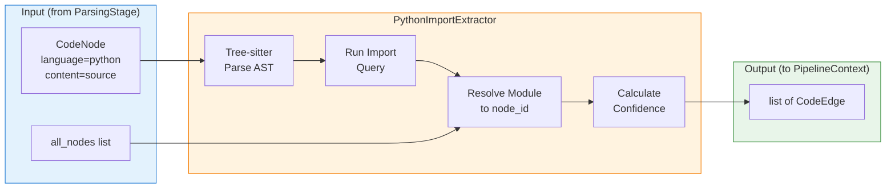
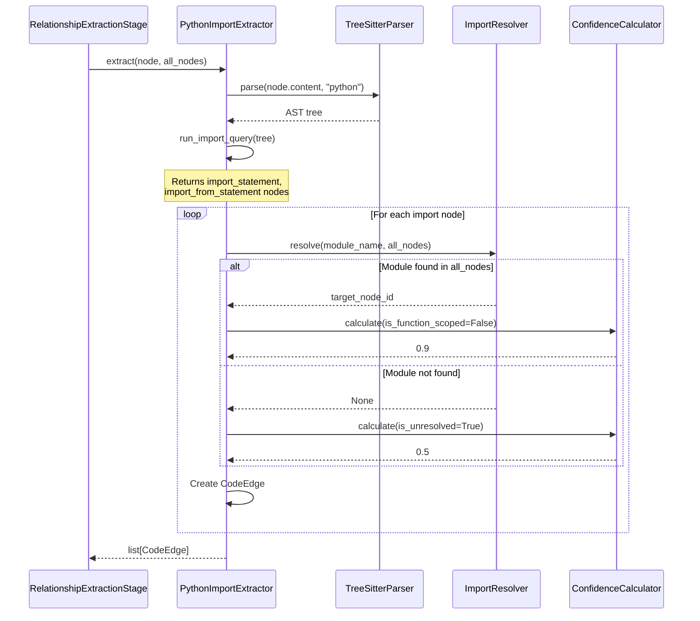

# Phase 2: Python Import Extraction – Tasks & Alignment Brief

**Spec**: [../cross-file-impl-spec.md](../../cross-file-impl-spec.md)
**Plan**: [../cross-file-impl-plan.md](../../cross-file-impl-plan.md)
**Date**: 2026-01-13
**Phase Slug**: `phase-2-python-import-extraction`

---

## Executive Briefing

### Purpose

This phase implements Python import extraction using Tree-sitter AST analysis to detect cross-file import relationships. It creates the foundational `RelationshipExtractionService` ABC and `PythonImportExtractor` implementation that Phase 4 (TypeScript & Go) will extend. Without this, the graph cannot answer "What does this Python file import?" or "What imports this Python module?"

### What We're Building

A two-tier extraction architecture:
1. **RelationshipExtractionService** - ABC defining the extraction contract: `extract(node, all_nodes) -> list[CodeEdge]`
2. **PythonImportExtractor** - Language-specific implementation using Tree-sitter queries for:
   - `import X` statements
   - `from X import Y, Z` statements
   - Relative imports (`.module`, `..package`)
   - Function-scoped imports (with reduced confidence)
3. **Import path resolver** - Converts Python module names to file node_ids
4. **Confidence scoring** - Per research dossier tiers (0.9 top-level, 0.6 function-scoped, etc.)

### User Value

Agents can query Python import relationships:
- "What modules does `src/app.py` import?" → Returns file node_ids with 0.9 confidence
- "What files import `auth_handler`?" → Find all dependents

### Example

**Input**: `src/fs2/cli/scan.py` content includes:
```python
from fs2.core.services.scan_pipeline import ScanPipeline
from fs2.config.objects import ScanConfig
import typer
```

**Output**: Three `CodeEdge` objects:
```python
CodeEdge(
    source_node_id="file:src/fs2/cli/scan.py",
    target_node_id="file:src/fs2/core/services/scan_pipeline.py",
    edge_type=EdgeType.IMPORTS,
    confidence=0.9,
    source_line=3,
    resolution_rule="from_import_resolved"
)
# ... similar for ScanConfig and typer (typer unresolved → lower confidence)
```

---

## Objectives & Scope

### Objective

Implement Python import extraction with 95%+ accuracy using Tree-sitter queries, per AC4 in the plan: "Python file with `from auth_handler import AuthHandler` creates edge with confidence >= 0.85."

### Behavior Checklist

- [ ] `from X import Y` creates IMPORTS edge to resolved file
- [ ] `import X` creates IMPORTS edge to resolved file
- [ ] Relative imports (`.module`) resolve relative to source file
- [ ] Function-scoped imports get confidence 0.6 (not 0.9)
- [ ] Unresolved imports still create edges (with lower confidence)
- [ ] Multiple imports from same statement create multiple edges

### Goals

- ✅ Create `RelationshipExtractionService` ABC with `extract()` method
- ✅ Implement `PythonImportExtractor` using validated Tree-sitter queries from 022
- ✅ Build import path resolver to convert Python modules to file node_ids
- ✅ Apply confidence tiers: 0.9 (top-level), 0.6 (function-scoped), 0.5 (unresolved)
- ✅ Create `FakeRelationshipExtractionService` for testing
- ✅ Integration test with real Python fixtures from test suite

### Non-Goals (Scope Boundaries)

- ❌ TypeScript/Go extraction (Phase 4)
- ❌ Pipeline integration (Phase 5) - only building the extractor
- ❌ Call extraction (deferred - only imports in this phase)
- ❌ Star imports (`from X import *`) - document as known limitation
- ❌ Dynamic imports (`importlib.import_module()`) - static analysis only
- ❌ Namespace package resolution - document as limitation
- ❌ Performance optimization for large files - defer if needed
- ❌ Type-only imports handling (Python doesn't have these unlike TypeScript)

---

## Architecture Map

### Component Diagram

```mermaid
flowchart TD
    classDef pending fill:#9E9E9E,stroke:#757575,color:#fff
    classDef inprogress fill:#FF9800,stroke:#F57C00,color:#fff
    classDef completed fill:#4CAF50,stroke:#388E3C,color:#fff
    classDef blocked fill:#F44336,stroke:#D32F2F,color:#fff

    style Phase fill:#F5F5F5,stroke:#E0E0E0
    style Core fill:#E3F2FD,stroke:#1976D2
    style Tests fill:#E8F5E9,stroke:#388E3C
    style Research fill:#FFF3E0,stroke:#F57C00

    subgraph Phase["Phase 2: Python Import Extraction"]
        T001["T001: Tests for RelationshipExtractionService ABC"]:::pending
        T002["T002: Implement ABC"]:::pending
        T003["T003: Tests for PythonImportExtractor"]:::pending
        T004["T004: Implement PythonImportExtractor"]:::pending
        T005["T005: Tests for import path resolver"]:::pending
        T006["T006: Implement import path resolver"]:::pending
        T007["T007: Tests for confidence scoring"]:::pending
        T008["T008: Implement confidence calculator"]:::pending
        T009["T009: Tests for FakeRelationshipExtractionService"]:::pending
        T010["T010: Implement FakeRelationshipExtractionService"]:::pending
        T011["T011: Integration tests with fixtures"]:::pending
        T012["T012: Export service from __init__.py"]:::pending

        T001 --> T002
        T002 --> T003
        T003 --> T004
        T004 --> T005
        T005 --> T006
        T006 --> T007
        T007 --> T008
        T008 --> T009
        T009 --> T010
        T010 --> T011
        T011 --> T012
    end

    subgraph Core["Core Components"]
        ABC["/src/fs2/core/services/relationship_extraction/relationship_extraction_service.py"]:::pending
        PY["/src/fs2/core/services/relationship_extraction/python_import_extractor.py"]:::pending
        RES["/src/fs2/core/services/relationship_extraction/import_resolver.py"]:::pending
        CONF["/src/fs2/core/services/relationship_extraction/confidence.py"]:::pending
        FAKE["/src/fs2/core/services/relationship_extraction/relationship_extraction_service_fake.py"]:::pending
        INIT["/src/fs2/core/services/relationship_extraction/__init__.py"]:::pending
    end

    subgraph Tests["Test Files"]
        T_ABC["/tests/unit/services/relationship_extraction/test_relationship_extraction_service.py"]:::pending
        T_PY["/tests/unit/services/relationship_extraction/test_python_import_extractor.py"]:::pending
        T_RES["/tests/unit/services/relationship_extraction/test_import_resolver.py"]:::pending
        T_CONF["/tests/unit/services/relationship_extraction/test_confidence.py"]:::pending
        T_FAKE["/tests/unit/services/relationship_extraction/test_relationship_extraction_service_fake.py"]:::pending
        T_INT["/tests/integration/test_python_import_extraction.py"]:::pending
    end

    subgraph Research["022 Research (Reference)"]
        R_Q["lib/queries.py"]:::completed
        R_E["lib/extractors.py"]:::completed
        R_R["lib/resolver.py"]:::completed
    end

    T001 -.-> T_ABC
    T002 -.-> ABC
    T003 -.-> T_PY
    T004 -.-> PY
    T005 -.-> T_RES
    T006 -.-> RES
    T007 -.-> T_CONF
    T008 -.-> CONF
    T009 -.-> T_FAKE
    T010 -.-> FAKE
    T011 -.-> T_INT
    T012 -.-> INIT

    PY -.-> R_Q
    PY -.-> R_E
    CONF -.-> R_R
```

<!-- Status: grey=pending, orange=in-progress, green=completed, red=blocked -->
<!-- Updated by plan-6 during implementation -->



### Task-to-Component Mapping

<!-- Status: ⬜ Pending | 🟧 In Progress | ✅ Complete | 🔴 Blocked -->

| Task | Component(s) | Files | Status | Comment |
|------|-------------|-------|--------|---------|
| T001 | ABC Tests | `/workspaces/flow_squared/tests/unit/services/relationship_extraction/test_relationship_extraction_service.py` | ⬜ Pending | Define contract via tests first |
| T002 | ABC | `/workspaces/flow_squared/src/fs2/core/services/relationship_extraction/relationship_extraction_service.py` | ⬜ Pending | Abstract base with `extract()` method |
| T003 | Extractor Tests | `/workspaces/flow_squared/tests/unit/services/relationship_extraction/test_python_import_extractor.py` | ⬜ Pending | Python-specific extraction tests |
| T004 | Python Extractor | `/workspaces/flow_squared/src/fs2/core/services/relationship_extraction/python_import_extractor.py` | ⬜ Pending | Tree-sitter query implementation |
| T005 | Resolver Tests | `/workspaces/flow_squared/tests/unit/services/relationship_extraction/test_import_resolver.py` | ⬜ Pending | Module name to node_id resolution |
| T006 | Import Resolver | `/workspaces/flow_squared/src/fs2/core/services/relationship_extraction/import_resolver.py` | ⬜ Pending | Python path resolution logic |
| T007 | Confidence Tests | `/workspaces/flow_squared/tests/unit/services/relationship_extraction/test_confidence.py` | ⬜ Pending | Tier validation tests |
| T008 | Confidence | `/workspaces/flow_squared/src/fs2/core/services/relationship_extraction/confidence.py` | ⬜ Pending | Scoring calculator |
| T009 | Fake Tests | `/workspaces/flow_squared/tests/unit/services/relationship_extraction/test_relationship_extraction_service_fake.py` | ⬜ Pending | Verify fake follows contract |
| T010 | Fake Service | `/workspaces/flow_squared/src/fs2/core/services/relationship_extraction/relationship_extraction_service_fake.py` | ⬜ Pending | Test double with call history |
| T011 | Integration | `/workspaces/flow_squared/tests/integration/test_python_import_extraction.py` | ⬜ Pending | End-to-end with real fixtures |
| T012 | Exports | `/workspaces/flow_squared/src/fs2/core/services/relationship_extraction/__init__.py` | ⬜ Pending | Public API exports |

---

## Tasks

| Status | ID | Task | CS | Type | Dependencies | Absolute Path(s) | Validation | Subtasks | Notes |
|--------|------|------|-----|------|--------------|------------------|------------|----------|-------|
| [ ] | T001 | Write tests for RelationshipExtractionService ABC interface | 2 | Test | – | `/workspaces/flow_squared/tests/unit/services/relationship_extraction/test_relationship_extraction_service.py` | Tests fail with ModuleNotFoundError | – | ABC contract tests |
| [ ] | T002 | Implement RelationshipExtractionService ABC | 1 | Core | T001 | `/workspaces/flow_squared/src/fs2/core/services/relationship_extraction/relationship_extraction_service.py` | T001 tests pass; ABC importable | – | `extract(node, all_nodes) -> list[CodeEdge]` |
| [ ] | T003 | Write tests for PythonImportExtractor | 3 | Test | T002 | `/workspaces/flow_squared/tests/unit/services/relationship_extraction/test_python_import_extractor.py` | Tests fail on unimplemented extractor | – | Cover: from X, import X, relative, function-scoped |
| [ ] | T004 | Implement PythonImportExtractor with Tree-sitter queries | 3 | Core | T003 | `/workspaces/flow_squared/src/fs2/core/services/relationship_extraction/python_import_extractor.py` | T003 tests pass; uses 022 queries | – | Port from `scripts/cross-files-rels-research/lib/extractors.py` |
| [ ] | T005 | Write tests for import path resolver | 2 | Test | T004 | `/workspaces/flow_squared/tests/unit/services/relationship_extraction/test_import_resolver.py` | Tests cover: same-directory, relative, absolute, not found | – | Module name → file node_id |
| [ ] | T006 | Implement import path resolver | 2 | Core | T005 | `/workspaces/flow_squared/src/fs2/core/services/relationship_extraction/import_resolver.py` | T005 tests pass; resolves Python imports | – | Handle dotted names, relative paths |
| [ ] | T007 | Write tests for confidence scoring | 2 | Test | T006 | `/workspaces/flow_squared/tests/unit/services/relationship_extraction/test_confidence.py` | Tests cover: 0.9 (top-level), 0.6 (scoped), 0.5 (unresolved) | – | Per research dossier tiers |
| [ ] | T008 | Implement confidence calculator | 1 | Core | T007 | `/workspaces/flow_squared/src/fs2/core/services/relationship_extraction/confidence.py` | T007 tests pass | – | Port from `scripts/cross-files-rels-research/lib/resolver.py` |
| [ ] | T009 | Write tests for FakeRelationshipExtractionService | 2 | Test | T008 | `/workspaces/flow_squared/tests/unit/services/relationship_extraction/test_relationship_extraction_service_fake.py` | Tests verify call history, preset results, error simulation | – | Follow FakeGraphStore pattern |
| [ ] | T010 | Implement FakeRelationshipExtractionService | 2 | Core | T009 | `/workspaces/flow_squared/src/fs2/core/services/relationship_extraction/relationship_extraction_service_fake.py` | T009 tests pass | – | `set_relationships()`, `simulate_error_for` |
| [ ] | T011 | Integration test with real Python fixtures | 2 | Integration | T010 | `/workspaces/flow_squared/tests/integration/test_python_import_extraction.py` | AC4 validated: auth_handler import detected with confidence >= 0.85 | – | Use `tests/fixtures/samples/python/` |
| [ ] | T012 | Export services from relationship_extraction/__init__.py | 1 | Setup | T011 | `/workspaces/flow_squared/src/fs2/core/services/relationship_extraction/__init__.py` | Can import RelationshipExtractionService, PythonImportExtractor | – | Public API |

---

## Alignment Brief

### Prior Phase Review

#### Phase 1: Core Models & GraphStore Extension (COMPLETE)

**Summary**: Phase 1 established the complete foundation for cross-file relationship storage with 56 new tests across 3 new files and ~300 lines of production code.

**A. Deliverables Created**

| Component | File | Purpose |
|-----------|------|---------|
| EdgeType enum | `/workspaces/flow_squared/src/fs2/core/models/edge_type.py` | 4 values: IMPORTS, CALLS, REFERENCES, DOCUMENTS |
| CodeEdge model | `/workspaces/flow_squared/src/fs2/core/models/code_edge.py` | Frozen dataclass with confidence validation |
| GraphStore ABC extension | `/workspaces/flow_squared/src/fs2/core/repos/graph_store.py:185-241` | `add_relationship_edge()`, `get_relationships()` |
| NetworkXGraphStore impl | `/workspaces/flow_squared/src/fs2/core/repos/graph_store_impl.py:402-474` | Edge attributes with `is_relationship=True` |
| FakeGraphStore impl | `/workspaces/flow_squared/src/fs2/core/repos/graph_store_fake.py:294-388` | `_relationship_edges` dict |
| PipelineContext field | `/workspaces/flow_squared/src/fs2/core/services/pipeline_context.py:115-119` | `relationships: list[CodeEdge] | None` |

**B. Key APIs Available to Phase 2**

```python
from fs2.core.models import EdgeType, CodeEdge

# Create edge (Phase 2 extractors produce these)
edge = CodeEdge(
    source_node_id="file:src/app.py",
    target_node_id="file:src/auth.py",
    edge_type=EdgeType.IMPORTS,
    confidence=0.9,       # Validated: 0.0-1.0
    source_line=5,
    resolution_rule="from_import_resolved"
)

# PipelineContext field ready for Phase 5 integration
context.relationships: list[CodeEdge] | None  # Set by extraction stage

# GraphStore methods ready for Phase 5 persistence
graph_store.add_relationship_edge(edge)
graph_store.get_relationships(node_id, direction="both")
```

**C. Patterns Established**

1. **String Enum Pattern**: `EdgeType(str, Enum)` for JSON serialization - reuse for any new enums
2. **Frozen Dataclass with Validation**: `@dataclass(frozen=True)` + `__post_init__` - use for immutable models
3. **Edge Discrimination**: `is_relationship=True` attribute separates relationship edges from structural edges
4. **Return Format**: `get_relationships()` returns `list[dict]` for MCP passthrough

**D. Technical Discoveries**

1. **Lazy Initialization**: FakeGraphStore uses `hasattr()` check for `_relationship_edges` - Phase 2 fake should avoid this pattern
2. **String Conversion**: EdgeType must be `str(edge.edge_type)` when storing in NetworkX
3. **TYPE_CHECKING Import**: CodeEdge import uses TYPE_CHECKING to avoid circular imports

**E. Test Infrastructure**

- 12 tests in `test_edge_type.py`
- 15 tests in `test_code_edge.py`
- 13 tests in `test_graph_store.py` (relationship edge tests)
- All use Purpose/Quality/AC documentation pattern

**F. Key Log References**

| Decision | Log Section |
|----------|-------------|
| EdgeType pattern choice | [execution.log.md#task-t002-edgetype-implementation](execution.log.md#task-t002-edgetype-implementation) |
| Confidence validation | [execution.log.md#task-t004-codeedge-implementation](execution.log.md#task-t004-codeedge-implementation) |
| GraphStore extension | [execution.log.md#task-t006-t011-graphstore-extension-batch](execution.log.md#task-t006-t011-graphstore-extension-batch) |

---

### Critical Findings Affecting This Phase

| Finding | ID | What It Constrains | Tasks Addressing |
|---------|----|--------------------|------------------|
| Tree-sitter Query + QueryCursor Pattern | PS-04 | Must use Query + QueryCursor API, not deprecated matches() | T003, T004 |
| Confidence Scoring Tiers | CD-05 | 0.9 for top-level, 0.6 for function-scoped imports | T007, T008 |
| Function-Scope Detection | PL-02 | Walk `node.parent` chain for scope detection | T004 |
| Stage Pattern | CD-07 | RelationshipExtractionService follows stage pattern (name property, process method) for Phase 5 compatibility | T002 |

---

### ADR Decision Constraints

_No ADRs currently affect this phase._

---

### Invariants & Guardrails

1. **Confidence bounds**: All edges must have confidence in [0.0, 1.0] - enforced by CodeEdge validation
2. **Node existence**: Extractor receives `all_nodes` list for resolution - must check node_id membership
3. **Language isolation**: PythonImportExtractor only processes nodes with `language="python"`
4. **Content requirement**: Skip nodes without `content` field (can't parse AST)

---

### Inputs to Read (Exact File Paths)

| File | Purpose |
|------|---------|
| `/workspaces/flow_squared/scripts/cross-files-rels-research/lib/queries.py` | Tree-sitter query patterns for Python |
| `/workspaces/flow_squared/scripts/cross-files-rels-research/lib/extractors.py` | Python import extraction logic |
| `/workspaces/flow_squared/scripts/cross-files-rels-research/lib/resolver.py` | Confidence scoring tiers |
| `/workspaces/flow_squared/src/fs2/core/models/edge_type.py` | EdgeType enum (Phase 1 output) |
| `/workspaces/flow_squared/src/fs2/core/models/code_edge.py` | CodeEdge model (Phase 1 output) |
| `/workspaces/flow_squared/src/fs2/core/adapters/ast_parser_impl.py` | TreeSitterParser for reference |
| `/workspaces/flow_squared/tests/fixtures/samples/python/` | Test fixtures with imports |

---

### Visual Alignment Aids

#### Data Flow Diagram



#### Sequence Diagram



---

### Test Plan (Full TDD)

#### Unit Tests

| Test File | Test Name | Purpose | Fixture | Expected Output |
|-----------|-----------|---------|---------|-----------------|
| `test_relationship_extraction_service.py` | `test_abc_cannot_be_instantiated` | ABC contract | None | TypeError |
| `test_relationship_extraction_service.py` | `test_abc_requires_extract_method` | Contract enforcement | Mock | Method exists |
| `test_python_import_extractor.py` | `test_from_import_creates_edge` | `from X import Y` | Simple Python | 1 edge, confidence >= 0.85 |
| `test_python_import_extractor.py` | `test_import_statement_creates_edge` | `import X` | Simple Python | 1 edge, confidence >= 0.85 |
| `test_python_import_extractor.py` | `test_relative_import_resolved` | `from .module import X` | Package structure | Edge to sibling file |
| `test_python_import_extractor.py` | `test_function_scoped_import_lower_confidence` | Import inside def | Nested import | Confidence = 0.6 |
| `test_python_import_extractor.py` | `test_unresolved_import_still_creates_edge` | External package | `import numpy` | Edge with confidence 0.5 |
| `test_python_import_extractor.py` | `test_multiple_imports_creates_multiple_edges` | Multiple from-import | `from X import A, B, C` | 3 edges |
| `test_python_import_extractor.py` | `test_non_python_node_returns_empty` | Language filter | TypeScript node | Empty list |
| `test_python_import_extractor.py` | `test_node_without_content_returns_empty` | Content guard | Empty content | Empty list |
| `test_import_resolver.py` | `test_resolve_dotted_name` | `foo.bar` → `foo/bar.py` | Node list | Correct node_id |
| `test_import_resolver.py` | `test_resolve_relative_single_dot` | `.sibling` → sibling.py | Package nodes | Sibling node_id |
| `test_import_resolver.py` | `test_resolve_relative_double_dot` | `..parent` → parent.py | Package nodes | Parent node_id |
| `test_import_resolver.py` | `test_not_found_returns_none` | Unknown module | Empty nodes | None |
| `test_confidence.py` | `test_top_level_import_confidence` | Base case | None | 0.9 |
| `test_confidence.py` | `test_function_scoped_confidence` | Reduced confidence | is_function_scoped=True | 0.6 |
| `test_confidence.py` | `test_unresolved_confidence` | Lowest tier | is_unresolved=True | 0.5 |
| `test_relationship_extraction_service_fake.py` | `test_fake_records_calls` | Call history | None | call_history populated |
| `test_relationship_extraction_service_fake.py` | `test_fake_returns_preset_edges` | Configurable results | preset edges | Same edges returned |
| `test_relationship_extraction_service_fake.py` | `test_fake_error_simulation` | Error testing | simulate_error_for | Raises error |

#### Integration Tests

| Test File | Test Name | Purpose | Fixture | Expected Output |
|-----------|-----------|---------|---------|-----------------|
| `test_python_import_extraction.py` | `test_app_service_imports_detected` | AC4 validation | `tests/fixtures/samples/python/app_service.py` | auth_handler edge with >= 0.85 |
| `test_python_import_extraction.py` | `test_import_extraction_with_real_graph` | Full roundtrip | Multiple Python files | Edges created, queryable |

---

### Step-by-Step Implementation Outline

1. **T001-T002: RelationshipExtractionService ABC**
   - Create `src/fs2/core/services/relationship_extraction/` directory
   - Write test for ABC instantiation failure
   - Implement ABC with `@abstractmethod extract(node, all_nodes) -> list[CodeEdge]`

2. **T003-T004: PythonImportExtractor**
   - Write tests for each import pattern (from, import, relative)
   - Port Tree-sitter queries from `lib/queries.py`
   - Port extraction logic from `lib/extractors.py`
   - Use `node.parent` traversal for function-scope detection

3. **T005-T006: Import Path Resolver**
   - Write tests for module name → node_id resolution
   - Handle dotted names: `foo.bar.baz` → `foo/bar/baz.py` or `foo/bar/baz/__init__.py`
   - Handle relative imports with source file context

4. **T007-T008: Confidence Scoring**
   - Write tests for each tier from research dossier
   - Port logic from `lib/resolver.py`
   - Constants: CONF_IMPORT=0.9, CONF_TYPED=0.6, CONF_UNRESOLVED=0.5

5. **T009-T010: FakeRelationshipExtractionService**
   - Write tests following FakeGraphStore pattern
   - Implement call_history, set_relationships(), simulate_error_for

6. **T011: Integration Test**
   - Use real Python fixtures
   - Validate AC4: auth_handler import detected

7. **T012: Exports**
   - Add `__init__.py` with public exports
   - Verify importable from `fs2.core.services.relationship_extraction`

---

### Commands to Run

```bash
# Create test directory structure
mkdir -p tests/unit/services/relationship_extraction

# Run specific phase tests
pytest tests/unit/services/relationship_extraction/ -v

# Run integration tests
pytest tests/integration/test_python_import_extraction.py -v

# Run all tests (regression check)
pytest tests/ -v

# Type check new code
mypy src/fs2/core/services/relationship_extraction/

# Lint check
ruff check src/fs2/core/services/relationship_extraction/
```

---

### Risks & Unknowns

| Risk | Severity | Likelihood | Mitigation |
|------|----------|------------|------------|
| Tree-sitter API differences from 022 research | Medium | Low | Pin tree-sitter version; test immediately |
| Relative import resolution complexity | Medium | Medium | Start with simple cases; document edge cases as limitations |
| Performance on large files with many imports | Low | Low | Defer optimization; monitor during integration |
| Namespace package handling | Low | Medium | Document as known limitation; skip __init__.py-less packages |

---

### Ready Check

- [ ] Phase 1 deliverables accessible (EdgeType, CodeEdge, GraphStore extensions)
- [ ] Research files readable (`lib/queries.py`, `lib/extractors.py`, `lib/resolver.py`)
- [ ] Test fixtures exist (`tests/fixtures/samples/python/`)
- [ ] Tree-sitter + tree-sitter-language-pack installed
- [ ] ADR constraints mapped to tasks (N/A - no ADRs exist)

**⏸ Await explicit GO/NO-GO from human sponsor before implementation.**

---

## Phase Footnote Stubs

_Populated by plan-6 during implementation._

| Footnote | Task(s) | Files | FlowSpace IDs |
|----------|---------|-------|---------------|
| | | | |

---

## Evidence Artifacts

| Artifact | Location | Purpose |
|----------|----------|---------|
| Execution Log | `docs/plans/024-cross-file-impl/tasks/phase-2-python-import-extraction/execution.log.md` | TDD narrative |
| Test Results | `pytest --tb=short` output | Pass/fail evidence |
| Coverage Report | `pytest --cov=src/fs2/core/services/relationship_extraction` | >80% target |

---

## Discoveries & Learnings

_Populated during implementation by plan-6. Log anything of interest to your future self._

| Date | Task | Type | Discovery | Resolution | References |
|------|------|------|-----------|------------|------------|
| | | | | | |

**Types**: `gotcha` | `research-needed` | `unexpected-behavior` | `workaround` | `decision` | `debt` | `insight`

**What to log**:
- Things that didn't work as expected
- External research that was required
- Implementation troubles and how they were resolved
- Gotchas and edge cases discovered
- Decisions made during implementation
- Technical debt introduced (and why)
- Insights that future phases should know about

_See also: `execution.log.md` for detailed narrative._

---

## Directory Layout

```
docs/plans/024-cross-file-impl/
├── cross-file-impl-spec.md
├── cross-file-impl-plan.md
├── research-dossier.md
└── tasks/
    ├── phase-1-core-models-graphstore-extension/
    │   ├── tasks.md
    │   └── execution.log.md
    └── phase-2-python-import-extraction/
        ├── tasks.md                    # This file
        └── execution.log.md            # Created by plan-6
```

---

*Generated*: 2026-01-13
*Phase*: 2 of 6
*Status*: AWAITING GO
