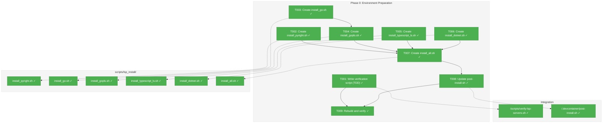
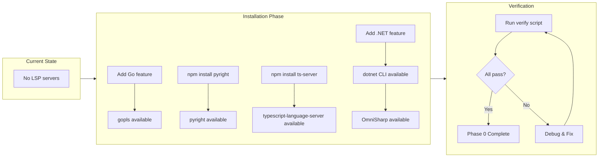
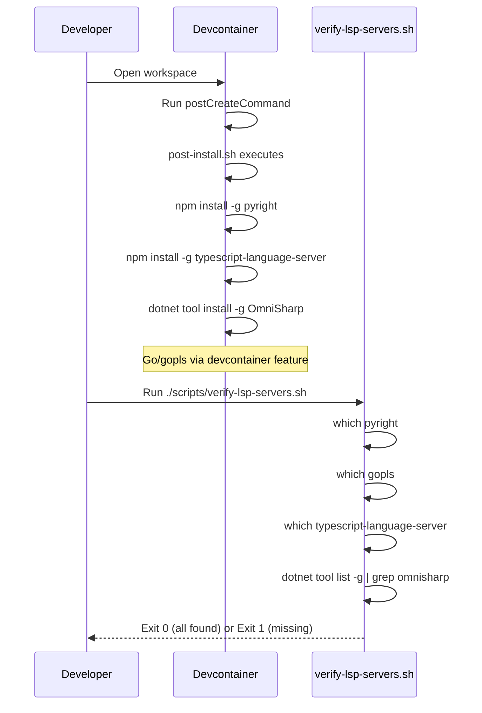

# Phase 0: Environment Preparation – Tasks & Alignment Brief

**Spec**: [../../lsp-integration-spec.md](../../lsp-integration-spec.md)
**Plan**: [../../lsp-integration-plan.md](../../lsp-integration-plan.md)
**Date**: 2026-01-14

---

## Executive Briefing

### Purpose
This phase installs and verifies all four LSP (Language Server Protocol) servers required for development and testing of the LSP integration feature. Without these servers installed in the devcontainer, we cannot run integration tests with real language servers.

### What We're Building
Portable LSP installation scripts (not tied to devcontainer features) that install:
- **Pyright** (Python language server) for Python type analysis
- **gopls** (Go language server) for Go code intelligence
- **typescript-language-server** for TypeScript/JavaScript support
- **.NET SDK** (runtime for C# Roslyn LSP - auto-downloaded by SolidLSP)

Plus a verification script that confirms all servers/runtimes are correctly installed.

**Architecture**: Individual install scripts in `scripts/lsp_install/` with an `install_all.sh` orchestrator. This approach is portable and works in any environment (devcontainers, CI, bare metal, Docker).

> **Note**: We do NOT install OmniSharp. Serena/SolidLSP uses Microsoft.CodeAnalysis.LanguageServer (Roslyn LSP) which is auto-downloaded at runtime. OmniSharp is deprecated in Serena with documented issues ("problems with finding references").

### User Value
Developers get a complete LSP development environment out-of-the-box when opening the devcontainer. No manual setup required. CI/CD can reuse the same environment guarantees.

### Example
**Before**: Developer opens devcontainer → `which pyright` returns "not found" → cannot run LSP tests
**After**: Developer opens devcontainer → `which pyright` returns `/home/vscode/.local/bin/pyright` → all LSP tests work

---

## Objectives & Scope

### Objective
Install and verify all 4 LSP servers in the devcontainer, enabling integration tests with real servers.

**Behavior Checklist** (from plan acceptance criteria):
- [x] All 4 LSP servers available via `which` command
- [x] Verification script passes in devcontainer
- [x] Servers persist across container rebuilds (via post-install.sh)
- [ ] CI workflow can validate server availability (out of scope - see Non-Goals)

### Goals

- ✅ Create `scripts/lsp_install/` directory with portable install scripts
- ✅ Create `install_pyright.sh` - Pyright via npm
- ✅ Create `install_go.sh` - Go toolchain (prerequisite for gopls)
- ✅ Create `install_gopls.sh` - gopls via Go toolchain
- ✅ Create `install_typescript_ls.sh` - typescript-language-server via npm
- ✅ Create `install_dotnet.sh` - .NET SDK (runtime for Roslyn LSP)
- ✅ Create `install_all.sh` - orchestrator that calls all install scripts
- ✅ Create verification script to validate all installations
- ✅ Integrate `install_all.sh` into devcontainer postCreateCommand

### Non-Goals

- ❌ Configure LSP server settings (Phase 3)
- ❌ Test LSP server functionality (Phase 3+)
- ❌ Add LSP servers for languages beyond the 4 tested (40+ supported via SolidLSP, but only 4 tested)
- ❌ Auto-installation logic for users outside devcontainer (user responsibility per spec)
- ❌ CI/CD workflow setup (out of scope - will be addressed separately with Docker)
- ❌ LSP adapter code (Phase 2+)

---

## Architecture Map

### Component Diagram
<!-- Status: grey=pending, orange=in-progress, green=completed, red=blocked -->
<!-- Updated by plan-6 during implementation -->



### Task-to-Component Mapping

<!-- Status: ⬜ Pending | 🟧 In Progress | ✅ Complete | 🔴 Blocked -->

| Task | Component(s) | Files | Status | Comment |
|------|-------------|-------|--------|---------|
| T001 | Verification Script | /scripts/verify-lsp-servers.sh | ✅ Complete | TDD: RED state confirmed |
| T002 | Pyright Install | /scripts/lsp_install/install_pyright.sh | ✅ Complete | npm install -g pyright |
| T003 | Go Install | /scripts/lsp_install/install_go.sh | ✅ Complete | Install Go toolchain (prerequisite for gopls) |
| T004 | gopls Install | /scripts/lsp_install/install_gopls.sh | ✅ Complete | go install gopls; calls install_go.sh first |
| T005 | TypeScript LS Install | /scripts/lsp_install/install_typescript_ls.sh | ✅ Complete | npm install -g typescript-language-server typescript |
| T006 | .NET SDK Install | /scripts/lsp_install/install_dotnet.sh | ✅ Complete | Install .NET SDK for Roslyn LSP runtime |
| T007 | Orchestrator | /scripts/lsp_install/install_all.sh | ✅ Complete | Calls all individual install scripts |
| T008 | Integration | /.devcontainer/post-install.sh | ✅ Complete | Call install_all.sh from post-install |
| T009 | Verification | All | ✅ Complete | All 5 LSP checks pass (TDD GREEN) |

---

## Tasks

| Status | ID | Task | CS | Type | Dependencies | Absolute Path(s) | Validation | Subtasks | Notes |
|--------|------|------|----|------|--------------|------------------|------------|----------|-------|
| [x] | T001 | Write verification script that checks 3 LSP servers + Go + .NET | 1 | Test | – | /workspaces/flow_squared/scripts/verify-lsp-servers.sh | Script runs but fails (servers not yet installed) | – | TDD: test first |
| [x] | T002 | Create install_pyright.sh script | 1 | Setup | – | /workspaces/flow_squared/scripts/lsp_install/install_pyright.sh | Script installs pyright via npm | – | Portable |
| [x] | T003 | Create install_go.sh script | 2 | Setup | – | /workspaces/flow_squared/scripts/lsp_install/install_go.sh | Script installs Go toolchain | – | Uses official Go install script |
| [x] | T004 | Create install_gopls.sh script | 1 | Setup | T003 | /workspaces/flow_squared/scripts/lsp_install/install_gopls.sh | Script installs gopls; calls install_go.sh first | – | Depends on Go |
| [x] | T005 | Create install_typescript_ls.sh script | 1 | Setup | – | /workspaces/flow_squared/scripts/lsp_install/install_typescript_ls.sh | Script installs typescript-language-server via npm | – | Also installs typescript |
| [x] | T006 | Create install_dotnet.sh script | 2 | Setup | – | /workspaces/flow_squared/scripts/lsp_install/install_dotnet.sh | Script installs .NET SDK | – | Uses Microsoft install script |
| [x] | T007 | Create install_all.sh orchestrator | 1 | Setup | T002, T003, T004, T005, T006 | /workspaces/flow_squared/scripts/lsp_install/install_all.sh | Script calls all individual installers | – | Single entry point |
| [x] | T008 | Update post-install.sh to call install_all.sh | 1 | Integration | T007 | /workspaces/flow_squared/.devcontainer/post-install.sh | post-install.sh calls install_all.sh | – | Devcontainer integration |
| [x] | T009 | Rebuild devcontainer and run verification script | 2 | Integration | T001, T008 | /workspaces/flow_squared/scripts/verify-lsp-servers.sh | Script exits 0, all servers/runtimes found | – | Final validation |

---

## Alignment Brief

### Prior Phases Review

**Not applicable** - Phase 0 is the first phase; no prior phases to review.

### Critical Findings Affecting This Phase

**No critical findings directly affect Phase 0.** This phase is purely environment setup.

However, the following findings inform why we need these specific servers:
- **High Discovery 04 (Actionable Error Messages)**: The error messages for missing servers will reference the exact install commands we establish in this phase.
- **Medium Discovery 10 (Initialization Wait)**: Understanding that these servers need time to start will be relevant when testing, but not for installation.

### ADR Decision Constraints

**Not applicable** - No ADRs exist that constrain this phase.

### Invariants & Guardrails

- **No Secrets**: LSP servers don't require any credentials or secrets
- **Reproducibility**: All installations must be idempotent (can run multiple times safely)
- **Version Pinning**: Consider pinning versions to avoid surprise breakage, but not strictly required for devcontainer

### Inputs to Read

| File | Purpose |
|------|---------|
| `/workspaces/flow_squared/.devcontainer/devcontainer.json` | Understand current features, add new ones |
| `/workspaces/flow_squared/.devcontainer/Dockerfile` | Understand where to add npm global installs |
| `/workspaces/flow_squared/.devcontainer/post-install.sh` | Add OmniSharp installation |
| `/workspaces/flow_squared/.devcontainer/compose.yml` | Understand container build context |

### Visual Alignment: Flow Diagram



### Visual Alignment: Sequence Diagram



### Test Plan (Verification Script Approach)

Since Phase 0 is environment setup (not code), we use a **verification script** approach rather than traditional TDD:

| Test ID | Test Name | Purpose | Expected Result |
|---------|-----------|---------|-----------------|
| V001 | Pyright availability | Verify pyright is installed and executable | `which pyright` returns path |
| V002 | gopls availability | Verify gopls is installed and executable | `which gopls` returns path |
| V003 | typescript-language-server availability | Verify ts-server is installed and executable | `which typescript-language-server` returns path |
| V004 | .NET SDK availability | Verify .NET SDK is installed (Roslyn LSP runtime) | `dotnet --version` returns version |
| V005 | Version output | Verify servers respond to version flags | Each server outputs version without error |

**Fixtures**: None required (checking installed binaries)

**Expected Outputs**:
```
Verifying LSP servers and runtimes...
✓ Pyright: /home/vscode/.local/bin/pyright (version X.Y.Z)
✓ gopls: /home/vscode/go/bin/gopls (version X.Y.Z)
✓ typescript-language-server: /home/vscode/.npm-global/bin/typescript-language-server (version X.Y.Z)
✓ .NET SDK: X.Y.Z (Roslyn LSP runtime - SolidLSP auto-downloads LSP server)
All LSP servers and runtimes verified!
```

### Step-by-Step Implementation Outline

| Step | Task | Actions | Files |
|------|------|---------|-------|
| 1 | T001 | Create verification script that runs all checks; expect failures initially | /workspaces/flow_squared/scripts/verify-lsp-servers.sh |
| 2 | T002 | Create install_pyright.sh with npm install -g pyright | /workspaces/flow_squared/scripts/lsp_install/install_pyright.sh |
| 3 | T003 | Create install_go.sh using official Go install script | /workspaces/flow_squared/scripts/lsp_install/install_go.sh |
| 4 | T004 | Create install_gopls.sh (calls install_go.sh first) | /workspaces/flow_squared/scripts/lsp_install/install_gopls.sh |
| 5 | T005 | Create install_typescript_ls.sh with npm install | /workspaces/flow_squared/scripts/lsp_install/install_typescript_ls.sh |
| 6 | T006 | Create install_dotnet.sh using Microsoft install script | /workspaces/flow_squared/scripts/lsp_install/install_dotnet.sh |
| 7 | T007 | Create install_all.sh orchestrator | /workspaces/flow_squared/scripts/lsp_install/install_all.sh |
| 8 | T008 | Update post-install.sh to call install_all.sh | /workspaces/flow_squared/.devcontainer/post-install.sh |
| 9 | T009 | Rebuild devcontainer and run verification script | All files |

### Commands to Run

```bash
# ============================================
# STEP 1: Create directory structure
# ============================================
mkdir -p /workspaces/flow_squared/scripts/lsp_install

# ============================================
# STEP 2: Create verification script (T001) - TDD: RED
# ============================================
cat > /workspaces/flow_squared/scripts/verify-lsp-servers.sh << 'EOF'
#!/bin/bash
# verify-lsp-servers.sh - Verify all LSP servers and runtimes are installed
# Portable: Works in devcontainers, CI, bare metal, Docker
# Exit: 0 if all found, 1 if any missing

echo "Verifying LSP servers and runtimes..."
MISSING=0

# Check Pyright (Python)
if command -v pyright &> /dev/null; then
    VERSION=$(pyright --version 2>&1 || echo "version check failed")
    echo "✓ Pyright: $(which pyright) ($VERSION)"
else
    echo "✗ Pyright not found - run: scripts/lsp_install/install_pyright.sh"
    MISSING=1
fi

# Check Go (prerequisite for gopls)
if command -v go &> /dev/null; then
    VERSION=$(go version 2>&1 || echo "version check failed")
    echo "✓ Go: $(which go) ($VERSION)"
else
    echo "✗ Go not found - run: scripts/lsp_install/install_go.sh"
    MISSING=1
fi

# Check gopls (Go LSP)
if command -v gopls &> /dev/null; then
    VERSION=$(gopls version 2>&1 | head -1 || echo "version check failed")
    echo "✓ gopls: $(which gopls) ($VERSION)"
else
    echo "✗ gopls not found - run: scripts/lsp_install/install_gopls.sh"
    MISSING=1
fi

# Check typescript-language-server (TypeScript)
if command -v typescript-language-server &> /dev/null; then
    VERSION=$(typescript-language-server --version 2>&1 || echo "version check failed")
    echo "✓ typescript-language-server: $(which typescript-language-server) ($VERSION)"
else
    echo "✗ typescript-language-server not found - run: scripts/lsp_install/install_typescript_ls.sh"
    MISSING=1
fi

# Check .NET SDK (C# Roslyn LSP runtime - SolidLSP auto-downloads the LSP server)
if command -v dotnet &> /dev/null; then
    VERSION=$(dotnet --version 2>&1 || echo "version check failed")
    echo "✓ .NET SDK: $VERSION (Roslyn LSP runtime)"
else
    echo "✗ .NET SDK not found - run: scripts/lsp_install/install_dotnet.sh"
    MISSING=1
fi

if [ $MISSING -eq 1 ]; then
    echo ""
    echo "Some LSP servers/runtimes are missing. Run: scripts/lsp_install/install_all.sh"
    exit 1
fi

echo ""
echo "All LSP servers and runtimes verified!"
exit 0
EOF
chmod +x /workspaces/flow_squared/scripts/verify-lsp-servers.sh

# ============================================
# STEP 3: Create install_pyright.sh (T002)
# ============================================
cat > /workspaces/flow_squared/scripts/lsp_install/install_pyright.sh << 'EOF'
#!/bin/bash
# install_pyright.sh - Install Pyright (Python LSP)
# Requires: Node.js/npm in PATH
set -e
echo "Installing Pyright..."
npm install -g pyright
echo "✓ Pyright installed: $(which pyright)"
EOF
chmod +x /workspaces/flow_squared/scripts/lsp_install/install_pyright.sh

# ============================================
# STEP 4: Create install_go.sh (T003)
# ============================================
cat > /workspaces/flow_squared/scripts/lsp_install/install_go.sh << 'EOF'
#!/bin/bash
# install_go.sh - Install Go toolchain (prerequisite for gopls)
set -e

# Skip if Go is already installed
if command -v go &> /dev/null; then
    echo "✓ Go already installed: $(go version)"
    exit 0
fi

echo "Installing Go..."

# Detect architecture
ARCH=$(uname -m)
case $ARCH in
    x86_64) GOARCH="amd64" ;;
    aarch64|arm64) GOARCH="arm64" ;;
    *) echo "Unsupported architecture: $ARCH"; exit 1 ;;
esac

# Detect OS
OS=$(uname -s | tr '[:upper:]' '[:lower:]')

# Download and install latest Go
GO_VERSION="1.22.0"  # Pin to known good version
TARBALL="go${GO_VERSION}.${OS}-${GOARCH}.tar.gz"
curl -fsSL "https://go.dev/dl/${TARBALL}" -o "/tmp/${TARBALL}"
sudo rm -rf /usr/local/go
sudo tar -C /usr/local -xzf "/tmp/${TARBALL}"
rm "/tmp/${TARBALL}"

# Add to PATH for current session
export PATH=$PATH:/usr/local/go/bin
export GOPATH=$HOME/go
export PATH=$PATH:$GOPATH/bin

echo "✓ Go installed: $(go version)"
echo ""
echo "Add to your shell profile:"
echo '  export PATH=$PATH:/usr/local/go/bin'
echo '  export GOPATH=$HOME/go'
echo '  export PATH=$PATH:$GOPATH/bin'
EOF
chmod +x /workspaces/flow_squared/scripts/lsp_install/install_go.sh

# ============================================
# STEP 5: Create install_gopls.sh (T004)
# ============================================
cat > /workspaces/flow_squared/scripts/lsp_install/install_gopls.sh << 'EOF'
#!/bin/bash
# install_gopls.sh - Install gopls (Go LSP)
# Automatically installs Go if not present
set -e

SCRIPT_DIR="$(cd "$(dirname "${BASH_SOURCE[0]}")" && pwd)"

# Ensure Go is installed first
"$SCRIPT_DIR/install_go.sh"

# Source Go paths if needed
export PATH=$PATH:/usr/local/go/bin
export GOPATH=${GOPATH:-$HOME/go}
export PATH=$PATH:$GOPATH/bin

echo "Installing gopls..."
go install golang.org/x/tools/gopls@latest
echo "✓ gopls installed: $(which gopls || echo '$GOPATH/bin/gopls')"
EOF
chmod +x /workspaces/flow_squared/scripts/lsp_install/install_gopls.sh

# ============================================
# STEP 6: Create install_typescript_ls.sh (T005)
# ============================================
cat > /workspaces/flow_squared/scripts/lsp_install/install_typescript_ls.sh << 'EOF'
#!/bin/bash
# install_typescript_ls.sh - Install TypeScript Language Server
# Requires: Node.js/npm in PATH
set -e
echo "Installing typescript-language-server..."
npm install -g typescript typescript-language-server
echo "✓ typescript-language-server installed: $(which typescript-language-server)"
EOF
chmod +x /workspaces/flow_squared/scripts/lsp_install/install_typescript_ls.sh

# ============================================
# STEP 7: Create install_dotnet.sh (T006)
# ============================================
cat > /workspaces/flow_squared/scripts/lsp_install/install_dotnet.sh << 'EOF'
#!/bin/bash
# install_dotnet.sh - Install .NET SDK (runtime for Roslyn LSP)
# SolidLSP auto-downloads Microsoft.CodeAnalysis.LanguageServer at runtime
set -e
echo "Installing .NET SDK..."

# Use Microsoft's official install script
curl -fsSL https://dot.net/v1/dotnet-install.sh | bash -s -- --channel LTS

# Add to PATH for current session
export DOTNET_ROOT="$HOME/.dotnet"
export PATH="$PATH:$DOTNET_ROOT:$DOTNET_ROOT/tools"

echo "✓ .NET SDK installed: $(dotnet --version)"
echo ""
echo "Add to your shell profile:"
echo '  export DOTNET_ROOT="$HOME/.dotnet"'
echo '  export PATH="$PATH:$DOTNET_ROOT:$DOTNET_ROOT/tools"'
EOF
chmod +x /workspaces/flow_squared/scripts/lsp_install/install_dotnet.sh

# ============================================
# STEP 8: Create install_all.sh (T007)
# ============================================
cat > /workspaces/flow_squared/scripts/lsp_install/install_all.sh << 'EOF'
#!/bin/bash
# install_all.sh - Install all LSP servers and runtimes
# Portable: Works in devcontainers, CI, bare metal, Docker
set -e

SCRIPT_DIR="$(cd "$(dirname "${BASH_SOURCE[0]}")" && pwd)"

echo "========================================"
echo "Installing all LSP servers and runtimes"
echo "========================================"
echo ""

# Install runtimes first
"$SCRIPT_DIR/install_go.sh"
echo ""

"$SCRIPT_DIR/install_dotnet.sh"
echo ""

# Install LSP servers
"$SCRIPT_DIR/install_pyright.sh"
echo ""

"$SCRIPT_DIR/install_typescript_ls.sh"
echo ""

"$SCRIPT_DIR/install_gopls.sh"
echo ""

echo "========================================"
echo "All LSP servers installed!"
echo "Run scripts/verify-lsp-servers.sh to verify"
echo "========================================"
EOF
chmod +x /workspaces/flow_squared/scripts/lsp_install/install_all.sh

# ============================================
# STEP 9: Update post-install.sh (T008)
# ============================================
# Add this line to .devcontainer/post-install.sh:
# /workspaces/flow_squared/scripts/lsp_install/install_all.sh

# ============================================
# STEP 10: Rebuild and verify (T009)
# ============================================
# Rebuild devcontainer, then:
/workspaces/flow_squared/scripts/verify-lsp-servers.sh
```

### Risks/Unknowns

| Risk | Severity | Likelihood | Mitigation |
|------|----------|------------|------------|
| Go not in PATH for gopls install | Medium | Medium | Scripts require Go pre-installed; document prerequisite |
| npm not in PATH | Medium | Low | Node.js already in devcontainer; scripts check prerequisites |
| .NET install script requires curl | Low | Low | curl standard on most systems; document prerequisite |
| PATH not updated after .NET install | Medium | Medium | Script outputs PATH instructions; add to shell profile |
| Scripts not executable | Low | Low | Commands include chmod +x; scripts self-document |

### Ready Check

Before proceeding to implementation, verify:

- [x] Plan file exists and Phase 0 is defined
- [x] Current devcontainer.json read and understood
- [x] Current Dockerfile read and understood
- [x] Current post-install.sh read and understood
- [x] No ADR constraints apply to this phase
- [x] No critical findings affect this phase
- [x] Verification script approach defined
- [x] Installation commands documented for all 4 servers
- [ ] **Awaiting GO from human sponsor**

---

## Phase Footnote Stubs

<!-- Footnotes will be added by plan-6 during implementation -->
<!-- Format: [^N]: <description> | <file:line> | <decision rationale> -->

| Footnote | Description | File:Line | Decision/Rationale |
|----------|-------------|-----------|-------------------|
| | | | |

---

## Evidence Artifacts

**Execution Log**: `./execution.log.md` (created by plan-6 during implementation)

**Supporting Files**:
- Verification script: `/workspaces/flow_squared/scripts/verify-lsp-servers.sh`
- Install scripts directory: `/workspaces/flow_squared/scripts/lsp_install/`
  - `install_go.sh` - Go toolchain (prerequisite for gopls)
  - `install_dotnet.sh` - .NET SDK (Roslyn LSP runtime)
  - `install_pyright.sh` - Pyright (Python LSP)
  - `install_gopls.sh` - gopls (Go LSP)
  - `install_typescript_ls.sh` - TypeScript Language Server
  - `install_all.sh` - Orchestrator
- Modified post-install: `/workspaces/flow_squared/.devcontainer/post-install.sh`

---

## Discoveries & Learnings

_Populated during implementation by plan-6. Log anything of interest to your future self._

| Date | Task | Type | Discovery | Resolution | References |
|------|------|------|-----------|------------|------------|
| | | | | | |

**Types**: `gotcha` | `research-needed` | `unexpected-behavior` | `workaround` | `decision` | `debt` | `insight`

**What to log**:
- Things that didn't work as expected
- External research that was required
- Implementation troubles and how they were resolved
- Gotchas and edge cases discovered
- Decisions made during implementation
- Technical debt introduced (and why)
- Insights that future phases should know about

_See also: `execution.log.md` for detailed narrative._

---

## Directory Layout

```
docs/plans/025-lsp-research/
├── lsp-integration-spec.md
├── lsp-integration-plan.md
├── research-dossier.md
├── external-research-*.md
└── tasks/
    └── phase-0-environment-preparation/
        ├── tasks.md              # This file
        └── execution.log.md      # Created by plan-6 during implementation

scripts/
├── verify-lsp-servers.sh         # Verification script
└── lsp_install/                  # Portable LSP install scripts
    ├── install_go.sh             # Go toolchain
    ├── install_dotnet.sh         # .NET SDK
    ├── install_pyright.sh        # Python LSP
    ├── install_gopls.sh          # Go LSP (calls install_go.sh)
    ├── install_typescript_ls.sh  # TypeScript LSP
    └── install_all.sh            # Orchestrator
```

---

**Status**: ✅ COMPLETE
**Completed**: 2026-01-14
**Next Step**: Run `/plan-7-code-review --phase "Phase 0: Environment Preparation"` for code review

---

## Critical Insights Discussion

**Session**: 2026-01-14
**Context**: Phase 0: Environment Preparation Tasks v1.0
**Analyst**: AI Clarity Agent
**Reviewer**: Development Team
**Format**: Water Cooler Conversation (5 Critical Insights)

### Insight 1: OmniSharp Is Legacy Technology

**Did you know**: Microsoft deprecated OmniSharp in favor of the Roslyn LSP, and Serena/SolidLSP already uses Microsoft.CodeAnalysis.LanguageServer (not OmniSharp) as the default for C#.

**Implications**:
- OmniSharp is marked as "experimental" in Serena with documented issues ("problems with finding references")
- SolidLSP auto-downloads Roslyn LSP from NuGet at runtime
- We only need .NET SDK installed, not OmniSharp

**Options Considered**:
- Option A: Remove OmniSharp, just install .NET SDK (SELECTED)
- Option B: Install OmniSharp as originally planned
- Option C: Install csharp-ls (community alternative)
- Option D: Defer C# support entirely

**AI Recommendation**: Option A - Remove OmniSharp
- Reasoning: Follows Serena's actual architecture; SolidLSP auto-manages the Roslyn LSP

**Discussion Summary**: Research into Serena's codebase revealed they explicitly mark OmniSharp as experimental with known issues. The default CSHARP language uses Microsoft.CodeAnalysis.LanguageServer which is auto-downloaded.

**Decision**: Remove OmniSharp; install .NET SDK only; let SolidLSP auto-download Roslyn LSP

**Action Items**:
- [x] Remove T005 (OmniSharp installation)
- [x] Update T003 to ".NET SDK (Roslyn LSP runtime)"
- [x] Update verification script to check .NET, not OmniSharp

**Affects**: Tasks T003, T005, verification script

---

### Insight 2: Container Image Bloat

**Did you know**: Adding Go and .NET SDK features would add ~1-1.5GB to the container image, significantly increasing rebuild time for all developers.

**Implications**:
- Current container: ~3.3GB
- Estimated after changes: ~4.5-5GB
- Every rebuild takes longer
- New developer onboarding slower

**Options Considered**:
- Option A: Accept the bloat (SELECTED)
- Option B: Use Alpine/slim base images
- Option C: Lazy/on-demand installation
- Option D: Split into optional features

**AI Recommendation**: Option A - Accept the bloat
- Reasoning: Dev environment prioritizes functionality; LSP is core feature; one-time rebuild cost

**Discussion Summary**: The size increase was acknowledged as acceptable for a development environment where functionality trumps size optimization.

**Decision**: Accept container image bloat; proceed with full installations

**Action Items**: None

**Affects**: No changes needed

---

### Insight 3: Verification Script Runs Manually

**Did you know**: The verification script was designed as a manual step, meaning installation failures could go unnoticed until Phase 3 integration tests fail.

**Implications**:
- Developer might forget to run verification
- Problems discovered late
- Extra debugging time

**Options Considered**:
- Option A: Add verification to postCreateCommand (fail fast)
- Option B: Add verification with warning only
- Option C: Keep manual verification (SELECTED)
- Option D: VS Code task + notification

**AI Recommendation**: Option A - Fail fast
- Reasoning: Immediate feedback; impossible to miss; guarantees working environment

**Discussion Summary**: User pointed out that integration tests will fail anyway if servers are missing - that's the real safety net. The verification script is a convenience for debugging, not a critical gate.

**Decision**: Keep manual verification; integration tests are the real gate

**Action Items**: None

**Affects**: No changes needed

---

### Insight 4: Use Portable Scripts Instead of Devcontainer Features

**Did you know**: Using devcontainer features would tie the installation to the devcontainer environment, making it non-portable to CI, bare metal, or other Docker setups.

**Implications**:
- Devcontainer features are opaque and version-locked
- Can't reuse installation logic elsewhere
- Debugging feature issues is difficult

**Options Considered**:
- Option A: Use devcontainer features (original plan)
- Option B: Create portable install scripts (SELECTED)
- Option C: Hybrid approach
- Option D: Document manual installation

**AI Recommendation**: User-initiated change
- Reasoning: Portability is valuable; scripts work anywhere; transparent and debuggable

**Discussion Summary**: User requested portable scripts instead of devcontainer features, noting the installation might be needed outside devcontainers.

**Decision**: Create `scripts/lsp_install/` with individual install scripts and `install_all.sh` orchestrator

**Action Items**:
- [x] Create `scripts/lsp_install/` directory
- [x] Create individual install scripts for each LSP/runtime
- [x] Create `install_all.sh` orchestrator
- [x] Call `install_all.sh` from post-install.sh

**Affects**: Complete restructure of Phase 0 tasks (5 → 8 tasks)

---

### Insight 5: gopls Requires Go Toolchain Pre-installed

**Did you know**: The `install_gopls.sh` script would fail because Go isn't installed by default in the devcontainer, and the script assumed Go was already present.

**Implications**:
- `go install` command fails without Go toolchain
- Hidden dependency not documented
- Non-portable to environments without Go

**Options Considered**:
- Option A: Add Go installation to install_gopls.sh
- Option B: Create separate install_go.sh script (SELECTED)
- Option C: Require Go as prerequisite, document it
- Option D: Add Go to Dockerfile only

**AI Recommendation**: Option B - Create install_go.sh
- Reasoning: Consistency with install_dotnet.sh pattern; portable; reusable

**Discussion Summary**: Creating a separate install_go.sh maintains the pattern established with install_dotnet.sh and keeps scripts self-contained.

**Decision**: Create `install_go.sh`; have `install_gopls.sh` call it first

**Action Items**:
- [x] Add T003 for install_go.sh
- [x] Update T004 (install_gopls.sh) to depend on T003
- [x] Renumber tasks to T001-T009
- [x] Update install_all.sh to call install_go.sh before install_gopls.sh

**Affects**: Tasks T003-T009, Architecture Map, verification script

---

## Session Summary

**Insights Surfaced**: 5 critical insights identified and discussed
**Decisions Made**: 5 decisions reached through collaborative discussion
**Action Items Created**: 15+ updates applied throughout session
**Areas Updated**:
- Tasks restructured from 5 to 9 tasks
- Switched from devcontainer features to portable scripts
- Removed OmniSharp in favor of .NET SDK + SolidLSP auto-download
- Added Go toolchain installation
- Updated verification script to check Go and .NET

**Shared Understanding Achieved**: ✓

**Confidence Level**: High - All critical issues addressed; portable, maintainable approach

**Next Steps**:
- Review final tasks.md
- Run `/plan-6-implement-phase --phase "Phase 0: Environment Preparation"` to implement

**Notes**:
- The switch to portable scripts makes the installation reusable across environments
- Serena research revealed OmniSharp is deprecated; following their architecture
- 9 tasks now provide clear, granular implementation steps
