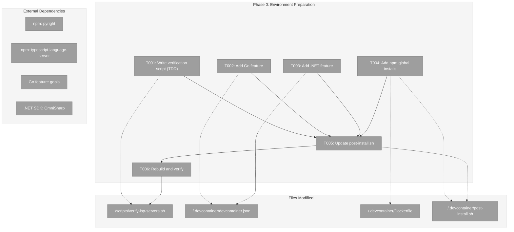
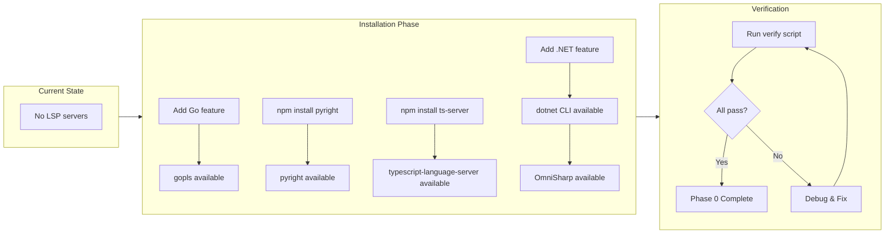
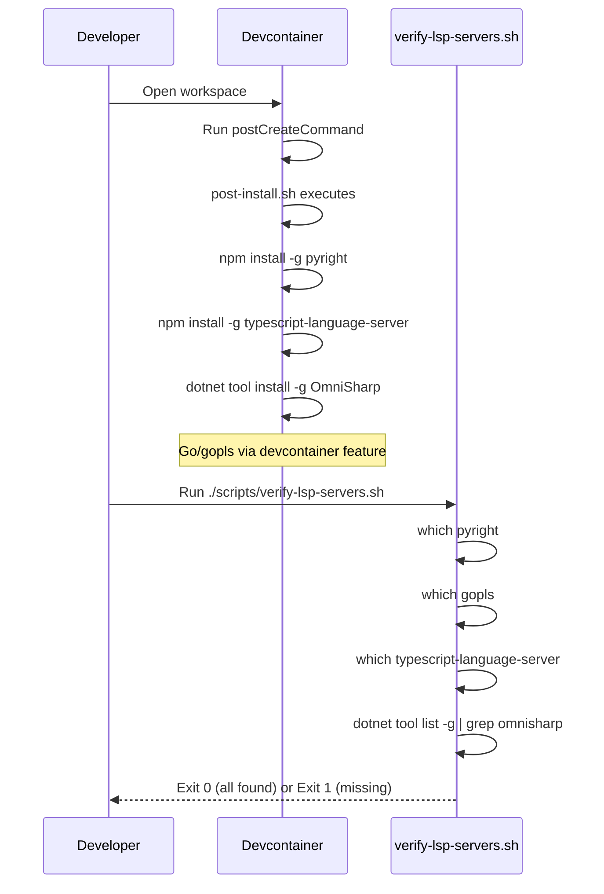

# Phase 0: Environment Preparation – Tasks & Alignment Brief

**Spec**: [../../lsp-integration-spec.md](../../lsp-integration-spec.md)
**Plan**: [../../lsp-integration-plan.md](../../lsp-integration-plan.md)
**Date**: 2026-01-14

---

## Executive Briefing

### Purpose
This phase installs and verifies all four LSP (Language Server Protocol) servers required for development and testing of the LSP integration feature. Without these servers installed in the devcontainer, we cannot run integration tests with real language servers.

### What We're Building
A devcontainer environment that includes:
- **Pyright** (Python language server) for Python type analysis
- **gopls** (Go language server) for Go code intelligence
- **typescript-language-server** for TypeScript/JavaScript support
- **OmniSharp** (C# language server) for C# code analysis

Plus a verification script that confirms all servers are correctly installed and accessible.

### User Value
Developers get a complete LSP development environment out-of-the-box when opening the devcontainer. No manual setup required. CI/CD can reuse the same environment guarantees.

### Example
**Before**: Developer opens devcontainer → `which pyright` returns "not found" → cannot run LSP tests
**After**: Developer opens devcontainer → `which pyright` returns `/home/vscode/.local/bin/pyright` → all LSP tests work

---

## Objectives & Scope

### Objective
Install and verify all 4 LSP servers in the devcontainer, enabling integration tests with real servers.

**Behavior Checklist** (from plan acceptance criteria):
- [ ] All 4 LSP servers available via `which` command
- [ ] Verification script passes in devcontainer
- [ ] Servers persist across container rebuilds
- [ ] CI workflow can validate server availability

### Goals

- ✅ Install Pyright via npm global install
- ✅ Install gopls via Go toolchain
- ✅ Install typescript-language-server via npm global install
- ✅ Install OmniSharp via .NET global tools
- ✅ Create verification script to validate all installations
- ✅ Integrate installation into devcontainer postCreateCommand

### Non-Goals

- ❌ Configure LSP server settings (Phase 3)
- ❌ Test LSP server functionality (Phase 3+)
- ❌ Add LSP servers for languages beyond the 4 tested (40+ supported via SolidLSP, but only 4 tested)
- ❌ Auto-installation logic for users outside devcontainer (user responsibility per spec)
- ❌ CI/CD workflow setup (out of scope - will be addressed separately with Docker)
- ❌ LSP adapter code (Phase 2+)

---

## Architecture Map

### Component Diagram
<!-- Status: grey=pending, orange=in-progress, green=completed, red=blocked -->
<!-- Updated by plan-6 during implementation -->



### Task-to-Component Mapping

<!-- Status: ⬜ Pending | 🟧 In Progress | ✅ Complete | 🔴 Blocked -->

| Task | Component(s) | Files | Status | Comment |
|------|-------------|-------|--------|---------|
| T001 | Verification Script | /scripts/verify-lsp-servers.sh | ⬜ Pending | TDD: write test script first, expect it to fail |
| T002 | Devcontainer Features | /.devcontainer/devcontainer.json | ⬜ Pending | Add Go devcontainer feature for gopls |
| T003 | Devcontainer Features | /.devcontainer/devcontainer.json | ⬜ Pending | Add .NET devcontainer feature for OmniSharp |
| T004 | Dockerfile npm | /.devcontainer/Dockerfile, post-install.sh | ⬜ Pending | Install pyright and typescript-language-server via npm |
| T005 | Post-install Script | /.devcontainer/post-install.sh | ⬜ Pending | Wire up OmniSharp dotnet tool install |
| T006 | Verification | All | ⬜ Pending | Rebuild container and run verification script |

---

## Tasks

| Status | ID | Task | CS | Type | Dependencies | Absolute Path(s) | Validation | Subtasks | Notes |
|--------|------|------|----|------|--------------|------------------|------------|----------|-------|
| [ ] | T001 | Write verification script that checks all 4 LSP servers | 1 | Test | – | /workspaces/flow_squared/scripts/verify-lsp-servers.sh | Script runs but fails (servers not yet installed) | – | TDD: test first; maps to plan task 0.5 |
| [ ] | T002 | Add Go devcontainer feature for gopls | 1 | Setup | – | /workspaces/flow_squared/.devcontainer/devcontainer.json | Feature added to features section | – | Maps to plan task 0.2; Go feature includes gopls |
| [ ] | T003 | Add .NET SDK devcontainer feature for OmniSharp | 1 | Setup | – | /workspaces/flow_squared/.devcontainer/devcontainer.json | Feature added to features section | – | Maps to plan task 0.4; Required for dotnet tools |
| [ ] | T004 | Add npm global installs for Pyright and typescript-language-server | 2 | Setup | – | /workspaces/flow_squared/.devcontainer/Dockerfile, /workspaces/flow_squared/.devcontainer/post-install.sh | npm install commands added | – | Maps to plan tasks 0.1, 0.3; Both via npm |
| [ ] | T005 | Update post-install.sh to install OmniSharp via dotnet tool | 1 | Setup | T003 | /workspaces/flow_squared/.devcontainer/post-install.sh | OmniSharp install command added | – | Maps to plan task 0.4; Requires .NET SDK |
| [ ] | T006 | Rebuild devcontainer and run verification script | 2 | Integration | T001, T002, T003, T004, T005 | /workspaces/flow_squared/scripts/verify-lsp-servers.sh | Script exits 0, all servers found | – | Maps to plan task 0.6; Final validation |

---

## Alignment Brief

### Prior Phases Review

**Not applicable** - Phase 0 is the first phase; no prior phases to review.

### Critical Findings Affecting This Phase

**No critical findings directly affect Phase 0.** This phase is purely environment setup.

However, the following findings inform why we need these specific servers:
- **High Discovery 04 (Actionable Error Messages)**: The error messages for missing servers will reference the exact install commands we establish in this phase.
- **Medium Discovery 10 (Initialization Wait)**: Understanding that these servers need time to start will be relevant when testing, but not for installation.

### ADR Decision Constraints

**Not applicable** - No ADRs exist that constrain this phase.

### Invariants & Guardrails

- **No Secrets**: LSP servers don't require any credentials or secrets
- **Reproducibility**: All installations must be idempotent (can run multiple times safely)
- **Version Pinning**: Consider pinning versions to avoid surprise breakage, but not strictly required for devcontainer

### Inputs to Read

| File | Purpose |
|------|---------|
| `/workspaces/flow_squared/.devcontainer/devcontainer.json` | Understand current features, add new ones |
| `/workspaces/flow_squared/.devcontainer/Dockerfile` | Understand where to add npm global installs |
| `/workspaces/flow_squared/.devcontainer/post-install.sh` | Add OmniSharp installation |
| `/workspaces/flow_squared/.devcontainer/compose.yml` | Understand container build context |

### Visual Alignment: Flow Diagram



### Visual Alignment: Sequence Diagram



### Test Plan (Verification Script Approach)

Since Phase 0 is environment setup (not code), we use a **verification script** approach rather than traditional TDD:

| Test ID | Test Name | Purpose | Expected Result |
|---------|-----------|---------|-----------------|
| V001 | Pyright availability | Verify pyright is installed and executable | `which pyright` returns path |
| V002 | gopls availability | Verify gopls is installed and executable | `which gopls` returns path |
| V003 | typescript-language-server availability | Verify ts-server is installed and executable | `which typescript-language-server` returns path |
| V004 | OmniSharp availability | Verify OmniSharp is installed | `dotnet tool list -g` shows omnisharp |
| V005 | Version output | Verify servers respond to version flags | Each server outputs version without error |

**Fixtures**: None required (checking installed binaries)

**Expected Outputs**:
```
Verifying LSP servers...
✓ Pyright: /home/vscode/.local/bin/pyright (version X.Y.Z)
✓ gopls: /home/vscode/go/bin/gopls (version X.Y.Z)
✓ typescript-language-server: /home/vscode/.npm-global/bin/typescript-language-server (version X.Y.Z)
✓ OmniSharp: installed via dotnet tools
All LSP servers verified!
```

### Step-by-Step Implementation Outline

| Step | Task | Actions | Files |
|------|------|---------|-------|
| 1 | T001 | Create verification script that runs all checks; expect failures initially | /workspaces/flow_squared/scripts/verify-lsp-servers.sh |
| 2 | T002 | Add `ghcr.io/devcontainers/features/go:1` feature to devcontainer.json | /workspaces/flow_squared/.devcontainer/devcontainer.json |
| 3 | T003 | Add `ghcr.io/devcontainers/features/dotnet:2` feature to devcontainer.json | /workspaces/flow_squared/.devcontainer/devcontainer.json |
| 4 | T004 | Add npm global installs for pyright and typescript-language-server to Dockerfile or post-install.sh | /workspaces/flow_squared/.devcontainer/Dockerfile, /workspaces/flow_squared/.devcontainer/post-install.sh |
| 5 | T005 | Add `dotnet tool install -g OmniSharp` to post-install.sh | /workspaces/flow_squared/.devcontainer/post-install.sh |
| 6 | T006 | Rebuild devcontainer and run verification script | All files |

### Commands to Run

```bash
# ============================================
# STEP 1: Create and test verification script (T001)
# ============================================

# Create the verification script
cat > /workspaces/flow_squared/scripts/verify-lsp-servers.sh << 'EOF'
#!/bin/bash
# verify-lsp-servers.sh
# Purpose: Verify all LSP servers are installed and accessible
# Quality: Prevents CI failures from missing servers
# Exit: 0 if all found, 1 if any missing

set -e

echo "Verifying LSP servers..."
MISSING=0

# Check Pyright (Python)
if command -v pyright &> /dev/null; then
    VERSION=$(pyright --version 2>&1 || echo "version check failed")
    echo "✓ Pyright: $(which pyright) ($VERSION)"
else
    echo "✗ Pyright not found"
    MISSING=1
fi

# Check gopls (Go)
if command -v gopls &> /dev/null; then
    VERSION=$(gopls version 2>&1 | head -1 || echo "version check failed")
    echo "✓ gopls: $(which gopls) ($VERSION)"
else
    echo "✗ gopls not found"
    MISSING=1
fi

# Check typescript-language-server (TypeScript)
if command -v typescript-language-server &> /dev/null; then
    VERSION=$(typescript-language-server --version 2>&1 || echo "version check failed")
    echo "✓ typescript-language-server: $(which typescript-language-server) ($VERSION)"
else
    echo "✗ typescript-language-server not found"
    MISSING=1
fi

# Check OmniSharp (C#)
if dotnet tool list -g 2>/dev/null | grep -qi omnisharp; then
    echo "✓ OmniSharp: installed via dotnet tools"
else
    echo "✗ OmniSharp not found"
    MISSING=1
fi

if [ $MISSING -eq 1 ]; then
    echo ""
    echo "Some LSP servers are missing. See above for details."
    exit 1
fi

echo ""
echo "All LSP servers verified!"
exit 0
EOF

chmod +x /workspaces/flow_squared/scripts/verify-lsp-servers.sh

# Run it to confirm failures (TDD: RED)
/workspaces/flow_squared/scripts/verify-lsp-servers.sh || echo "Expected: Script fails (servers not yet installed)"

# ============================================
# STEP 2-5: Modify devcontainer files
# ============================================

# After modifying devcontainer.json, Dockerfile, post-install.sh:
# Review changes before rebuild
cat /workspaces/flow_squared/.devcontainer/devcontainer.json
cat /workspaces/flow_squared/.devcontainer/post-install.sh

# ============================================
# STEP 6: Rebuild and verify (T006)
# ============================================

# Rebuild devcontainer (run this from VS Code or:)
# devcontainer rebuild

# After rebuild, verify all servers
/workspaces/flow_squared/scripts/verify-lsp-servers.sh

# Expected output:
# Verifying LSP servers...
# ✓ Pyright: /path/to/pyright (version X.Y.Z)
# ✓ gopls: /path/to/gopls (version X.Y.Z)
# ✓ typescript-language-server: /path/to/ts-server (version X.Y.Z)
# ✓ OmniSharp: installed via dotnet tools
# All LSP servers verified!

# ============================================
# ADDITIONAL VERIFICATION COMMANDS
# ============================================

# Individual server checks
which pyright && pyright --version
which gopls && gopls version
which typescript-language-server && typescript-language-server --version
dotnet tool list -g | grep -i omnisharp

# Verify devcontainer features loaded
echo "Checking Go installation..."
go version

echo "Checking .NET installation..."
dotnet --version
```

### Risks/Unknowns

| Risk | Severity | Likelihood | Mitigation |
|------|----------|------------|------------|
| OmniSharp requires .NET SDK version compatibility | Medium | Low | Use latest .NET feature version; document minimum version |
| npm global install path issues | Low | Medium | Ensure PATH includes npm global bin directory |
| Devcontainer feature conflicts | Low | Low | Test feature combinations; order matters |
| Large container image size | Low | Medium | Accept for development; optimize later if needed |

### Ready Check

Before proceeding to implementation, verify:

- [x] Plan file exists and Phase 0 is defined
- [x] Current devcontainer.json read and understood
- [x] Current Dockerfile read and understood
- [x] Current post-install.sh read and understood
- [x] No ADR constraints apply to this phase
- [x] No critical findings affect this phase
- [x] Verification script approach defined
- [x] Installation commands documented for all 4 servers
- [ ] **Awaiting GO from human sponsor**

---

## Phase Footnote Stubs

<!-- Footnotes will be added by plan-6 during implementation -->
<!-- Format: [^N]: <description> | <file:line> | <decision rationale> -->

| Footnote | Description | File:Line | Decision/Rationale |
|----------|-------------|-----------|-------------------|
| | | | |

---

## Evidence Artifacts

**Execution Log**: `./execution.log.md` (created by plan-6 during implementation)

**Supporting Files**:
- Verification script: `/workspaces/flow_squared/scripts/verify-lsp-servers.sh`
- Modified devcontainer: `/workspaces/flow_squared/.devcontainer/devcontainer.json`
- Modified Dockerfile: `/workspaces/flow_squared/.devcontainer/Dockerfile`
- Modified post-install: `/workspaces/flow_squared/.devcontainer/post-install.sh`

---

## Discoveries & Learnings

_Populated during implementation by plan-6. Log anything of interest to your future self._

| Date | Task | Type | Discovery | Resolution | References |
|------|------|------|-----------|------------|------------|
| | | | | | |

**Types**: `gotcha` | `research-needed` | `unexpected-behavior` | `workaround` | `decision` | `debt` | `insight`

**What to log**:
- Things that didn't work as expected
- External research that was required
- Implementation troubles and how they were resolved
- Gotchas and edge cases discovered
- Decisions made during implementation
- Technical debt introduced (and why)
- Insights that future phases should know about

_See also: `execution.log.md` for detailed narrative._

---

## Directory Layout

```
docs/plans/025-lsp-research/
├── lsp-integration-spec.md
├── lsp-integration-plan.md
├── research-dossier.md
├── external-research-*.md
└── tasks/
    └── phase-0-environment-preparation/
        ├── tasks.md              # This file
        └── execution.log.md      # Created by plan-6 during implementation
```

---

**Status**: AWAITING GO
**Next Step**: Run `/plan-6-implement-phase --phase "Phase 0: Environment Preparation"` after human approval

---
