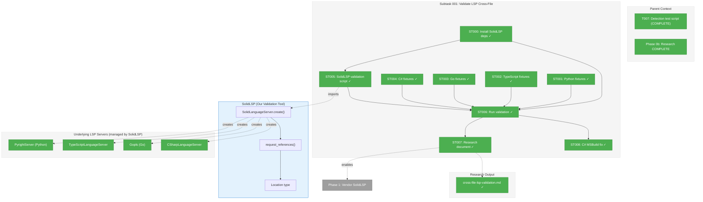
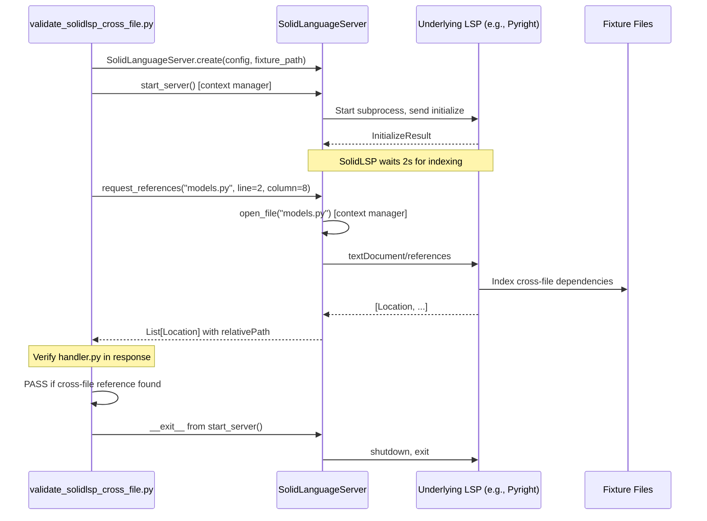
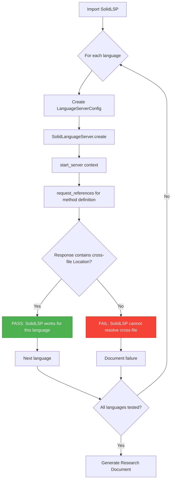

# Subtask 001: Validate LSP Cross-File Reference Resolution via SolidLSP

**Parent Plan:** [View Plan](../../lsp-integration-plan.md)
**Parent Phase:** Phase 0b: Multi-Project Research
**Parent Task(s):** [T007: Write detection test script](./tasks.md#task-t007) (extends validation scope)
**Plan Task Reference:** [Phase 0b in Plan](../../lsp-integration-plan.md#phase-0b-multi-project-research)

**Why This Subtask:**
Phase 0b validated project root detection, but did NOT validate the core capability we need: **LSP servers resolving cross-file method calls**. Before vendoring SolidLSP, we must validate that SolidLSP itself can actually find cross-file references. This subtask uses SolidLSP directly to prove it works.

**Created:** 2026-01-15
**Requested By:** Development Team (critical gap identified during Phase 0b review)

---

## Executive Briefing

### Purpose
This subtask validates SolidLSP as the **tool we're considering vendoring** by using it to query cross-file references. We're not testing raw LSP servers in isolation - we're testing SolidLSP's ability to orchestrate them.

### What We're Building
1. **Extended test fixtures** with cross-file **method calls** for Python, TypeScript, Go, and C#
2. **SolidLSP validation script** that:
   - Imports and uses SolidLSP directly from `scratch/serena/src/solidlsp/`
   - Creates `SolidLanguageServer` instances for each language
   - Opens fixture files and queries `request_references()` for method definitions
   - Verifies cross-file locations are returned
3. **Research document** confirming SolidLSP capabilities as foundation for Phase 1+

### Why This Matters (Corrected Approach)
- **We're validating SolidLSP, not raw LSP servers**: SolidLSP handles all JSON-RPC complexity, language server lifecycle, and protocol framing
- **SolidLSP auto-downloads Roslyn for C#**: We don't need manual setup - SolidLSP's `CSharpLanguageServer` handles this
- **Tree-sitter limitation**: Can find `from auth import Auth` but CANNOT resolve `auth.validate()` to `auth.py:Auth.validate()`
- **SolidLSP capability**: Uses underlying LSP servers with type inference for method call resolution with 1.0 confidence
- **Gating decision**: If SolidLSP validation fails, we should NOT proceed with vendoring

### What We Are NOT Doing
- **NOT writing JSON-RPC clients**: SolidLSP abstracts this away
- **NOT managing LSP server processes manually**: SolidLSP handles subprocess management
- **NOT implementing LSP protocol framing**: SolidLSP's `lsp_protocol_handler` does this

### Unblocks
- **Phase 1**: Confidence to proceed with SolidLSP vendoring
- **Phase 3**: Ground truth fixtures ready for `SolidLspAdapter` testing
- **Phase 4**: Multi-language LSP support validated upfront via SolidLSP

### Example

**Fixture (Python):**
```python
# models.py
class User:
    def validate(self) -> bool:
        return True

# handler.py
from models import User

def authenticate():
    user = User()
    return user.validate()  # <-- SolidLSP should find this calls models.py:User.validate
```

**SolidLSP Query (using validation script):**
```python
from solidlsp import SolidLanguageServer
from solidlsp.ls_config import Language, LanguageServerConfig

config = LanguageServerConfig(code_language=Language.PYTHON)
ls = SolidLanguageServer.create(config, repository_root_path=fixture_path)

with ls.start_server():
    # Query references for User.validate method at line 3, column 8 in models.py
    refs = ls.request_references("packages/auth/models.py", line=2, column=8)
    # Expected: refs contains Location pointing to handler.py line 6
```

**Expected Response:**
```python
[
    Location(
        uri="file:///fixtures/python/handler.py",
        range={"start": {"line": 6, "character": 11}, ...},
        relativePath="packages/auth/handler.py"
    )
]
```

---

## Objectives & Scope

### Objective
Validate that SolidLSP can resolve cross-file method calls for Python, TypeScript, Go, and C# using its unified API. Document capabilities as foundation of truth for Phase 1+ decisions.

### Goals

- Create fixtures with deliberate cross-file **method calls** for all 4 languages
- Use SolidLSP's `SolidLanguageServer.create()` factory to instantiate language servers
- Call `request_references()` for method definitions
- Verify responses include cross-file caller locations
- Document SolidLSP response format and its `Location` type
- Create ground truth for Phase 3 `SolidLspAdapter` testing

### Non-Goals

- Manual JSON-RPC implementation (SolidLSP handles this)
- LSP server process management (SolidLSP handles this)
- Protocol framing complexity (SolidLSP handles this)
- Import extraction (Tree-sitter already does this well)
- Performance optimization
- CI/CD integration

---

## Architecture Map

### Component Diagram
<!-- Status: grey=pending, orange=in-progress, green=completed, red=blocked -->
<!-- Updated by plan-6 during implementation -->



### Task-to-Component Mapping

<!-- Status: Pending | In Progress | Complete | Blocked -->

| Task | Component(s) | Files | Status | Comment |
|------|-------------|-------|--------|---------|
| ST000 | SolidLSP Dependencies | `scratch/serena/` | ✅ Complete | Install sensai-utils, pydantic, etc. via `uv sync` |
| ST001 | Python Fixture | `tests/fixtures/lsp/python_multi_project/` | ✅ Complete | Add models.py with method, handler.py with cross-file call |
| ST002 | TypeScript Fixture | `tests/fixtures/lsp/typescript_multi_project/` | ✅ Complete | Add utils.ts with function, index.tsx with cross-file call |
| ST003 | Go Fixture | `tests/fixtures/lsp/go_project/` | ✅ Complete | Add internal/auth with function, main.go with cross-file call |
| ST004 | C# Fixture | `tests/fixtures/lsp/csharp_multi_project/` | ✅ Complete | Add Models.cs with method, Program.cs with cross-file call |
| ST005 | SolidLSP Script | `scripts/lsp/validate_solidlsp_cross_file.py` | ✅ Complete | Uses SolidLSP API directly |
| ST006 | Validation Run | (execution) | ✅ Complete (4/4) | TypeScript needs both files opened |
| ST007 | Research Doc | `cross-file-lsp-validation.md` | ✅ Complete | Foundation of truth for Phase 1+ |
| ST008 | C# MSBuild Fix | `csharp_language_server.py` | ✅ Complete | Accept .NET 9+, pass DOTNET_ROOT env vars |

---

## Tasks

| Status | ID | Task | CS | Type | Dependencies | Absolute Path(s) | Validation | Subtasks | Notes |
|--------|-----|------|----|------|--------------|------------------|------------|----------|-------|
| [x] | ST000 | Install SolidLSP dependencies | 1 | Setup | - | `/workspaces/flow_squared/scratch/serena/` | `python -c "from solidlsp import SolidLanguageServer"` succeeds | - | Required: sensai-utils, pydantic, etc. |
| [x] | ST001 | Create Python fixtures with cross-file method calls | 1 | Setup | - | `/workspaces/flow_squared/tests/fixtures/lsp/python_multi_project/packages/auth/models.py`, `.../handler.py` | models.py has `User.validate()` method; handler.py calls `user.validate()` | - | Method call, not just import |
| [x] | ST002 | Create TypeScript fixtures with cross-file function calls | 1 | Setup | - | `/workspaces/flow_squared/tests/fixtures/lsp/typescript_multi_project/packages/client/utils.ts`, `.../index.tsx` | utils.ts has `formatDate()` function; index.tsx calls it | - | Function call across files |
| [x] | ST003 | Create Go fixtures with cross-file function calls | 1 | Setup | - | `/workspaces/flow_squared/tests/fixtures/lsp/go_project/internal/auth/auth.go`, `.../cmd/server/main.go` | auth.go has `Validate()` function; main.go calls it | - | Go package import + call |
| [x] | ST004 | Create C# fixtures with cross-file method calls | 1 | Setup | - | `/workspaces/flow_squared/tests/fixtures/lsp/csharp_multi_project/src/Api/Models.cs`, `.../Program.cs` | Models.cs has `User.Validate()` method; Program.cs calls it | - | C# class method call |
| [x] | ST005 | Write SolidLSP validation script | 3 | Core | ST000-ST004 | `/workspaces/flow_squared/scripts/lsp/validate_solidlsp_cross_file.py` | Script imports SolidLSP, creates servers, queries references successfully | - | Uses SolidLSP API; **LSP uses 0-indexed positions** [^3] |
| [x] | ST006 | Run SolidLSP validation against all fixtures | 2 | Test | ST000-ST005 | (execution) | 4/4 languages return cross-file references | - | TypeScript needs both files opened [^4] |
| [x] | ST007 | Create SolidLSP validation research document | 2 | Doc | ST006 | `/workspaces/flow_squared/docs/plans/025-lsp-research/tasks/phase-0b-multi-project-research/cross-file-lsp-validation.md` | Document captures: SolidLSP capabilities, Location format, ground truth | - | Foundation of truth [^5] |
| [x] | ST008 | Fix C# MSBuild environment issue | 2 | Fix | ST006 | `/workspaces/flow_squared/scratch/serena/src/solidlsp/language_servers/csharp_language_server.py` | C# validation passes (4/4 languages) | - | Accept .NET 9+, pass DOTNET_ROOT env [^6] |

---

## Alignment Brief

### Prior Phase Context

#### Phase 0: Environment Preparation (COMPLETE)

LSP servers installed and verified (SolidLSP will use these):

| Server | Version | Path | Status |
|--------|---------|------|--------|
| Pyright | 1.1.408 | `~/.npm-global/bin/pyright` | Installed |
| gopls | v0.21.0 | `~/go/bin/gopls` | Installed |
| typescript-language-server | 5.1.3 | `~/.npm-global/bin/typescript-language-server` | Installed |
| .NET SDK | 10.0.102 | `~/.dotnet/dotnet` | Installed (Roslyn auto-downloads via SolidLSP) |

#### Phase 0b: Multi-Project Research (COMPLETE)

**Deliverables Available:**
- Project root detection: `scripts/lsp/detect_project_root.py`
- Language enum: `scripts/lsp/language.py`
- Test fixtures (minimal): `tests/fixtures/lsp/`

**Gap Identified:** Fixtures have no cross-file method calls; SolidLSP not tested.

#### SolidLSP Available at:
- Location: `/workspaces/flow_squared/scratch/serena/src/solidlsp/`
- Main Entry: `solidlsp.SolidLanguageServer`
- Config: `solidlsp.ls_config.Language`, `solidlsp.ls_config.LanguageServerConfig`

### Critical Findings Affecting This Subtask

| Finding | Impact | Action |
|---------|--------|--------|
| SolidLSP requires Python deps installed | Import fails without `sensai-utils` | Run `uv sync` in scratch/serena first (ST000) |
| SolidLSP handles LSP complexity | No manual JSON-RPC needed | Use `SolidLanguageServer.create()` |
| `request_references()` returns `List[Location]` | Standard interface for all languages | Parse `Location.relativePath` for cross-file check |
| SolidLSP waits 2s for cross-file indexing | Built-in wait for LS initialization | No manual sleep needed |
| C# auto-downloads Roslyn + .NET runtime | ~100MB download on first run | SolidLSP's `RuntimeDependency` system handles this |
| TypeScript auto-downloads TS + LSP | npm packages downloaded | SolidLSP handles this |
| Downloads cached to `~/.solidlsp/` | Subsequent runs are fast | No action needed |
| Pyright uses `python -m pyright.langserver` | Not raw `pyright` binary | SolidLSP handles this |

### ADR Decision Constraints

No ADRs currently affect this subtask.

### Invariants & Guardrails

- **Use SolidLSP directly**: Import from `scratch.serena.src.solidlsp` - that's what we're validating
- **Test cross-file METHOD CALLS**: Not imports (Tree-sitter does that)
- **Use `start_server()` context manager**: Ensures proper lifecycle management
- **Document failures**: If SolidLSP doesn't work, that's critical information for vendoring decision

### Inputs to Read

| File | Purpose |
|------|---------|
| `/workspaces/flow_squared/scratch/serena/src/solidlsp/ls.py` | Main `SolidLanguageServer` class with `request_references()` |
| `/workspaces/flow_squared/scratch/serena/src/solidlsp/ls_config.py` | `Language` enum and `LanguageServerConfig` |
| `/workspaces/flow_squared/scratch/serena/src/solidlsp/ls_types.py` | `Location` type definition |

### Visual Alignment Aids

#### Sequence Diagram: SolidLSP Cross-File Query



#### Flow Diagram: Validation Process



### Test Plan (Validation Approach)

| Test | Purpose | Fixture | Expected Output |
|------|---------|---------|-----------------|
| `test_python_cross_file_refs` | Validate PyrightServer finds method calls | `python_multi_project/` | handler.py call site returned in references |
| `test_typescript_cross_file_refs` | Validate TypeScriptLanguageServer finds function calls | `typescript_multi_project/` | index.tsx call site returned in references |
| `test_go_cross_file_refs` | Validate Gopls finds function calls | `go_project/` | main.go call site returned in references |
| `test_csharp_cross_file_refs` | Validate CSharpLanguageServer finds method calls | `csharp_multi_project/` | Program.cs call site returned in references |

### Implementation Outline

| Step | Task | Files | Validation |
|------|------|-------|------------|
| 0 | Install SolidLSP dependencies | `scratch/serena/` | `uv sync` succeeds; `from solidlsp import SolidLanguageServer` works |
| 1 | Add models.py to Python fixture | `tests/fixtures/lsp/python_multi_project/packages/auth/models.py` | Has `User` class with `validate()` method |
| 2 | Update handler.py to call method | `tests/fixtures/lsp/python_multi_project/packages/auth/handler.py` | Imports User, calls `user.validate()` |
| 3 | Add utils.ts to TypeScript fixture | `tests/fixtures/lsp/typescript_multi_project/packages/client/utils.ts` | Has exported `formatDate()` function |
| 4 | Update index.tsx to call function | `tests/fixtures/lsp/typescript_multi_project/packages/client/index.tsx` | Imports and calls `formatDate()` |
| 5 | Add auth.go to Go fixture | `tests/fixtures/lsp/go_project/internal/auth/auth.go` | Has exported `Validate()` function |
| 6 | Update main.go to call function | `tests/fixtures/lsp/go_project/cmd/server/main.go` | Imports package, calls `auth.Validate()` |
| 7 | Add Models.cs to C# fixture | `tests/fixtures/lsp/csharp_multi_project/src/Api/Models.cs` | Has `User` class with `Validate()` method |
| 8 | Update Program.cs to call method | `tests/fixtures/lsp/csharp_multi_project/src/Api/Program.cs` | Creates User, calls `user.Validate()` |
| 9 | Write SolidLSP validation script | `scripts/lsp/validate_solidlsp_cross_file.py` | Imports SolidLSP, iterates languages, queries refs |
| 10 | Run validation | Execute script | All 4 languages pass; SolidLSP auto-downloads Roslyn for C# |
| 11 | Create research document | `cross-file-lsp-validation.md` | Document complete |

### Commands to Run (Copy/Paste)

```bash
# Verify LSP servers are installed (Phase 0 prerequisite)
/workspaces/flow_squared/scripts/verify-lsp-servers.sh

# ST000: Install SolidLSP dependencies (REQUIRED FIRST)
cd /workspaces/flow_squared/scratch/serena && uv sync
# This installs: sensai-utils, pydantic, requests, mcp, flask, psutil, etc.

# Verify SolidLSP is importable (after ST000)
python -c "import sys; sys.path.insert(0, '/workspaces/flow_squared/scratch/serena/src'); from solidlsp import SolidLanguageServer; print('SolidLSP import OK')"

# ST001-ST004: Verify fixtures have cross-file calls
grep -r "validate" tests/fixtures/lsp/python_multi_project/ || echo "Add method calls"
grep -r "formatDate" tests/fixtures/lsp/typescript_multi_project/ || echo "Add function calls"

# ST005: Verify validation script exists
ls scripts/lsp/validate_solidlsp_cross_file.py

# ST006: Run SolidLSP validation (add scratch/serena/src to PYTHONPATH)
# NOTE: SolidLSP will auto-download Roslyn LSP for C# on first run (~100MB)
PYTHONPATH=/workspaces/flow_squared/scratch/serena/src:$PYTHONPATH python scripts/lsp/validate_solidlsp_cross_file.py

# Expected: All 4 languages pass, exit code 0
# C# first run may take longer due to Roslyn download
```

### Risks & Unknowns

| Risk | Likelihood | Impact | Mitigation |
|------|------------|--------|------------|
| SolidLSP requires additional dependencies | Medium | Medium | Check serena's requirements.txt, install as needed |
| Different Python path requirements | Medium | Low | Set PYTHONPATH to include scratch/serena/src |
| C# auto-download of Roslyn may fail | Low | Medium | SolidLSP's CSharpLanguageServer handles this; check network |
| SolidLSP internal API changes | Low | Low | We're using public `create()` and `request_references()` |
| Fixture paths must be absolute | Medium | Low | Use `os.path.abspath()` when creating servers |

### Ready Check

Before executing this subtask with `/plan-6-implement-phase --subtask 001-subtask-validate-lsp-cross-file`:

- [ ] Phase 0 LSP servers installed (`/scripts/verify-lsp-servers.sh` exits 0)
- [ ] Phase 0b fixtures exist at `/tests/fixtures/lsp/`
- [ ] SolidLSP dependencies installed (`cd scratch/serena && uv sync`)
- [ ] SolidLSP is importable (`python -c "from solidlsp import SolidLanguageServer"` succeeds)
- [ ] Understand SolidLSP's `SolidLanguageServer.create()` and `request_references()` API
- [ ] Network available for auto-download of Roslyn (~100MB for C#)

---

## Phase Footnote Stubs

_Populated by plan-6 during implementation. Links task completion to plan changes._

| ID | Task | Change | Commit |
|----|------|--------|--------|
| [^3] | ST005 | SolidLSP validation script | - |
| [^4] | ST006 | Validation run - TypeScript indexing discovery | - |
| [^5] | ST007 | Research document created | - |
| [^6] | ST008 | C# MSBuild fix - DOTNET_ROOT env vars | - |

[^3]: ST005 - Created SolidLSP validation script
  - `function:scripts/lsp/validate_solidlsp_cross_file.py:validate_python`
  - `function:scripts/lsp/validate_solidlsp_cross_file.py:validate_typescript`
  - `function:scripts/lsp/validate_solidlsp_cross_file.py:validate_go`
  - `function:scripts/lsp/validate_solidlsp_cross_file.py:validate_csharp`

[^4]: ST006 - Validation discoveries
  - TypeScript LSP requires opening both files before query
  - Added `pyright>=1.1.400` to fs2 pyproject.toml

[^5]: ST007 - Research document
  - `file:docs/plans/025-lsp-research/tasks/phase-0b-multi-project-research/cross-file-lsp-validation.md`

[^6]: ST008 - C# MSBuild fix
  - `method:scratch/serena/src/solidlsp/language_servers/csharp_language_server.py:CSharpLanguageServer._ensure_dotnet_runtime` - Accept .NET 9+
  - `method:scratch/serena/src/solidlsp/language_servers/csharp_language_server.py:CSharpLanguageServer.__init__` - Pass DOTNET_ROOT env vars

---

## Evidence Artifacts

**Execution Log:** `001-subtask-validate-lsp-cross-file.execution.log.md`

**Expected Artifacts:**
- Extended fixtures in `tests/fixtures/lsp/` (4 languages with cross-file calls)
- SolidLSP validation script at `scripts/lsp/validate_solidlsp_cross_file.py`
- Research document at `cross-file-lsp-validation.md`
- SolidLSP `Location` response samples embedded in research doc

---

## Discoveries & Learnings

_Populated during implementation by plan-6. Log anything of interest to your future self._

| Date | Task | Type | Discovery | Resolution | References |
|------|------|------|-----------|------------|------------|
| 2026-01-15 | ST006 | insight | SolidLSP has mixed dependency model | Document for users | RuntimeDependency in common.py |
| 2026-01-15 | ST006 | gotcha | Phase 0 scripts not in post-install.sh | Need to fix devcontainer | scripts/lsp_install/ |
| 2026-01-15 | ST006 | gotcha | Pyright needs pip install in project venv | Added to pyproject.toml | pyright_server.py:37 |
| 2026-01-15 | ST006 | gotcha | TypeScript LSP needs both files opened | Open referencing file before query | validate_solidlsp_cross_file.py |
| 2026-01-15 | ST008 | gotcha | C# version check too strict (.NET 9 only) | Accept .NET 9+ | csharp_language_server.py:291 |
| 2026-01-15 | ST008 | gotcha | Roslyn needs DOTNET_ROOT for MSBuild | Pass env to ProcessLaunchInfo | csharp_language_server.py:235-242 |

**Types**: `gotcha` | `research-needed` | `unexpected-behavior` | `workaround` | `decision` | `debt` | `insight`

**What to log**:
- SolidLSP API quirks discovered
- `Location` type fields and their meanings
- Any language server that doesn't work via SolidLSP
- Required dependencies beyond base installation
- Timing/wait requirements beyond SolidLSP's built-in waits

_See also: `execution.log.md` for detailed narrative._

---

## After Subtask Completion

**This subtask validates SolidLSP for:**
- Phase 1: Vendor SolidLSP Core (confidence to proceed - **it actually works**)
- Phase 3: SolidLspAdapter Implementation (ground truth ready, API understood)
- Phase 4: Multi-Language LSP Support (all 4 languages validated via SolidLSP)

**When all ST### tasks complete:**

1. **Record completion** in parent execution log:
   ```
   ### Subtask 001-subtask-validate-lsp-cross-file Complete

   Resolved: SolidLSP cross-file reference resolution validated for Python, TypeScript, Go, C#
   SolidLanguageServer.request_references() successfully returns cross-file Locations
   Research document: cross-file-lsp-validation.md
   See detailed log: [subtask execution log](./001-subtask-validate-lsp-cross-file.execution.log.md)
   ```

2. **Update Phase 0b status** (if not already complete):
   - Phase 0b was already COMPLETE; this subtask extends validation

3. **Resume main plan work:**
   ```bash
   # Proceed to Phase 1 with confidence
   /plan-6-implement-phase --phase "Phase 1: Vendor SolidLSP Core" \
     --plan "/workspaces/flow_squared/docs/plans/025-lsp-research/lsp-integration-plan.md"
   ```

**Quick Links:**
- [Parent Dossier](./tasks.md)
- [Parent Plan](../../lsp-integration-plan.md)
- [Parent Execution Log](./execution.log.md)

---

## Directory Layout

After this subtask completes:

```
docs/plans/025-lsp-research/tasks/phase-0b-multi-project-research/
├── tasks.md                                      # Parent dossier
├── execution.log.md                              # Parent log
├── research-results.md                           # Phase 0b research results
├── 001-subtask-validate-lsp-cross-file.md        # This subtask dossier
├── 001-subtask-validate-lsp-cross-file.execution.log.md  # Subtask log
└── cross-file-lsp-validation.md                  # Research output document

tests/fixtures/lsp/
├── python_multi_project/
│   └── packages/auth/
│       ├── __init__.py       # Package init
│       ├── models.py         # NEW: User class with validate() method
│       └── handler.py        # UPDATED: calls user.validate()
├── typescript_multi_project/
│   └── packages/client/
│       ├── utils.ts          # NEW: formatDate() function
│       ├── types.ts          # NEW: Type definitions
│       └── index.tsx         # UPDATED: calls formatDate()
├── go_project/
│   ├── go.mod                # Existing
│   ├── cmd/server/
│   │   └── main.go           # UPDATED: calls auth.Validate()
│   └── internal/auth/        # NEW: Auth package
│       └── auth.go           # NEW: Validate() function
└── csharp_multi_project/
    └── src/Api/
        ├── Api.csproj        # Existing
        ├── Models.cs         # NEW: User class with Validate() method
        └── Program.cs        # UPDATED: calls user.Validate()

scripts/lsp/
├── __init__.py               # Existing
├── language.py               # Existing
├── detect_project_root.py    # Existing
├── test_detection.py         # Existing
├── validate_solidlsp_cross_file.py  # NEW: SolidLSP validation script
└── README.md                 # Existing
```

---

## Fixture Code Examples

### Python Fixture

**models.py:**
```python
"""User model with validation method."""

class User:
    """User entity with validation logic."""

    def __init__(self, username: str) -> None:
        self.username = username

    def validate(self) -> bool:
        """Validate user credentials.

        SolidLSP should find references to this method from handler.py.
        """
        return len(self.username) > 0
```

**handler.py:**
```python
"""Authentication handler using User model."""
from .models import User

def authenticate(username: str) -> bool:
    """Authenticate a user.

    Creates User instance and calls validate() method.
    SolidLSP should detect this cross-file method call.
    """
    user = User(username)
    return user.validate()  # <-- Cross-file method call
```

### TypeScript Fixture

**utils.ts:**
```typescript
/**
 * Format a date for display.
 * SolidLSP should find references to this function from index.tsx.
 */
export function formatDate(date: Date): string {
    return date.toISOString().split('T')[0];
}
```

**index.tsx:**
```typescript
import { formatDate } from './utils';

export function DateDisplay({ date }: { date: Date }) {
    // Cross-file function call - SolidLSP should detect this
    const formatted = formatDate(date);
    return <span>{formatted}</span>;
}
```

### Go Fixture

**internal/auth/auth.go:**
```go
// Package auth provides authentication utilities.
package auth

// Validate checks if credentials are valid.
// SolidLSP should find references to this function from main.go.
func Validate(username string) bool {
    return len(username) > 0
}
```

**cmd/server/main.go:**
```go
package main

import (
    "fmt"
    "github.com/example/goproject/internal/auth"
)

func main() {
    // Cross-file function call - SolidLSP should detect this
    isValid := auth.Validate("testuser")
    fmt.Printf("Valid: %v\n", isValid)
}
```

### C# Fixture

**Models.cs:**
```csharp
namespace Api.Models;

/// <summary>
/// User model with validation logic.
/// SolidLSP should find references to Validate() from Program.cs.
/// </summary>
public class User
{
    public string Username { get; set; } = "";

    public bool Validate()
    {
        return !string.IsNullOrEmpty(Username);
    }
}
```

**Program.cs:**
```csharp
using Api.Models;

// Cross-file method call - SolidLSP should detect this
var user = new User { Username = "testuser" };
var isValid = user.Validate();
Console.WriteLine($"Valid: {isValid}");
```

---

## SolidLSP Validation Script Outline

**File:** `scripts/lsp/validate_solidlsp_cross_file.py`

```python
#!/usr/bin/env python3
"""
Validate SolidLSP cross-file reference resolution.

This script imports SolidLSP directly from scratch/serena/src/solidlsp/
and validates that it can find cross-file method call references
for Python, TypeScript, Go, and C#.
"""
import sys
from pathlib import Path
from contextlib import contextmanager
from typing import Iterator

# Add SolidLSP to path
SOLIDLSP_PATH = Path(__file__).parent.parent.parent / "scratch" / "serena" / "src"
sys.path.insert(0, str(SOLIDLSP_PATH))

from solidlsp import SolidLanguageServer
from solidlsp.ls_config import Language, LanguageServerConfig

# Fixture base path
FIXTURES_PATH = Path(__file__).parent.parent.parent / "tests" / "fixtures" / "lsp"


@contextmanager
def language_server(language: Language, repo_path: Path) -> Iterator[SolidLanguageServer]:
    """Context manager for SolidLSP lifecycle (start/stop)."""
    config = LanguageServerConfig(code_language=language)
    ls = SolidLanguageServer.create(config, str(repo_path.absolute()))
    ls.start()
    try:
        yield ls
    finally:
        ls.stop()


def validate_python() -> bool:
    """Validate Python cross-file references via PyrightServer."""
    fixture_path = FIXTURES_PATH / "python_multi_project"

    with language_server(Language.PYTHON, fixture_path) as ls:
        # Query references for User.validate method
        # Line/column are 0-indexed in LSP - UPDATE AFTER FIXTURES CREATED
        refs = ls.request_references(
            "packages/auth/models.py",
            line=8,  # 0-indexed: def validate(self) -> bool:
            column=8
        )

        # Check if handler.py is in the references
        for ref in refs:
            if "handler.py" in (ref.get("relativePath") or ""):
                print("  [PASS] Python: Found cross-file reference in handler.py")
                return True

        print("  [FAIL] Python: No cross-file reference found")
        return False


def validate_typescript() -> bool:
    """Validate TypeScript cross-file references via TypeScriptLanguageServer."""
    fixture_path = FIXTURES_PATH / "typescript_multi_project"

    with language_server(Language.TYPESCRIPT, fixture_path) as ls:
        # UPDATE line/column AFTER FIXTURES CREATED (0-indexed)
        refs = ls.request_references(
            "packages/client/utils.ts",
            line=5,  # 0-indexed: export function formatDate
            column=16
        )

        for ref in refs:
            if "index.tsx" in (ref.get("relativePath") or ""):
                print("  [PASS] TypeScript: Found cross-file reference in index.tsx")
                return True

        print("  [FAIL] TypeScript: No cross-file reference found")
        return False


def validate_go() -> bool:
    """Validate Go cross-file references via Gopls."""
    fixture_path = FIXTURES_PATH / "go_project"

    with language_server(Language.GO, fixture_path) as ls:
        # UPDATE line/column AFTER FIXTURES CREATED (0-indexed)
        refs = ls.request_references(
            "internal/auth/auth.go",
            line=6,  # 0-indexed: func Validate
            column=5
        )

        for ref in refs:
            if "main.go" in (ref.get("relativePath") or ""):
                print("  [PASS] Go: Found cross-file reference in main.go")
                return True

        print("  [FAIL] Go: No cross-file reference found")
        return False


def validate_csharp() -> bool:
    """Validate C# cross-file references via CSharpLanguageServer."""
    fixture_path = FIXTURES_PATH / "csharp_multi_project"

    with language_server(Language.CSHARP, fixture_path) as ls:
        # UPDATE line/column AFTER FIXTURES CREATED (0-indexed)
        refs = ls.request_references(
            "src/Api/Models.cs",
            line=10,  # 0-indexed: public bool Validate()
            column=16
        )

        for ref in refs:
            if "Program.cs" in (ref.get("relativePath") or ""):
                print("  [PASS] C#: Found cross-file reference in Program.cs")
                return True

        print("  [FAIL] C#: No cross-file reference found")
        return False


def main() -> int:
    """Run all validations and return exit code."""
    print("SolidLSP Cross-File Reference Validation")
    print("=" * 50)

    results = {
        "Python": validate_python(),
        "TypeScript": validate_typescript(),
        "Go": validate_go(),
        "C#": validate_csharp(),
    }

    print()
    print("Summary")
    print("-" * 50)

    all_passed = True
    for lang, passed in results.items():
        status = "PASS" if passed else "FAIL"
        print(f"  {lang}: {status}")
        if not passed:
            all_passed = False

    return 0 if all_passed else 1


if __name__ == "__main__":
    sys.exit(main())
```

---

## SolidLSP API Reference

Key classes and methods used in this validation:

### `solidlsp.SolidLanguageServer`

Factory method:
```python
@classmethod
def create(
    cls,
    config: LanguageServerConfig,
    repository_root_path: str,
    timeout: float | None = None,
    solidlsp_settings: SolidLSPSettings | None = None,
) -> "SolidLanguageServer"
```

Lifecycle methods (use these, NOT `start_server()`):
```python
def start(self) -> None    # Start the language server
def stop(self) -> None     # Stop the language server
```

Our wrapper context manager pattern:
```python
@contextmanager
def language_server(language: Language, repo_path: Path) -> Iterator[SolidLanguageServer]:
    config = LanguageServerConfig(code_language=language)
    ls = SolidLanguageServer.create(config, str(repo_path.absolute()))
    ls.start()
    try:
        yield ls
    finally:
        ls.stop()
```

Reference query (what we're testing):
```python
def request_references(
    self,
    relative_file_path: str,
    line: int,      # 0-indexed!
    column: int     # 0-indexed!
) -> list[ls_types.Location]
```

### `solidlsp.ls_config.Language`

Enum values we're using:
- `Language.PYTHON` - Uses `PyrightServer`
- `Language.TYPESCRIPT` - Uses `TypeScriptLanguageServer`
- `Language.GO` - Uses `Gopls`
- `Language.CSHARP` - Uses `CSharpLanguageServer`

### `solidlsp.ls_config.LanguageServerConfig`

Minimal configuration:
```python
@dataclass
class LanguageServerConfig:
    code_language: Language
    trace_lsp_communication: bool = False
    start_independent_lsp_process: bool = True
    ignored_paths: list[str] = field(default_factory=list)
    encoding: str = "utf-8"
```

### `solidlsp.ls_types.Location`

Response type from `request_references()`:
```python
class Location(TypedDict):
    uri: str                # file:// URI
    range: Range            # {start: Position, end: Position}
    absolutePath: str       # Absolute filesystem path
    relativePath: str       # Path relative to repository root
```
