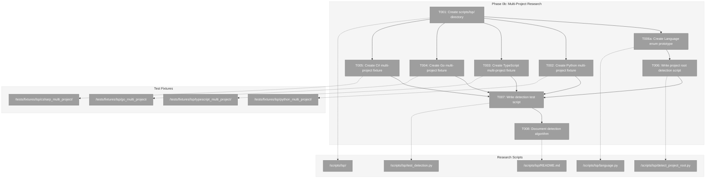
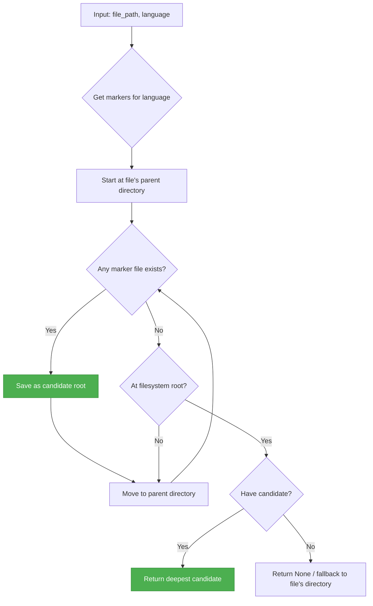
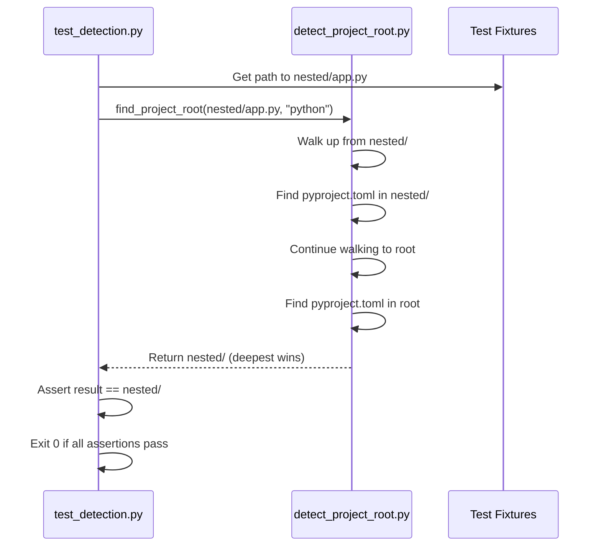

# Phase 0b: Multi-Project Research – Tasks & Alignment Brief

**Spec**: [../lsp-integration-spec.md](../lsp-integration-spec.md)
**Plan**: [../lsp-integration-plan.md](../lsp-integration-plan.md)
**Date**: 2026-01-14
**Status**: NOT STARTED

---

## Executive Briefing

### Purpose
This phase researches and validates the project root detection algorithm needed for LSP servers to work correctly. LSP servers require the correct `rootUri` to understand workspace boundaries for cross-file analysis—sending the wrong root breaks symbol resolution across files.

### What We're Building
Research scripts in `scripts/lsp/` that:
- Detect project root directories using language-specific marker files
- Implement the "deepest wins" algorithm for nested project structures
- Validate detection against multi-project test fixtures for all 4 target languages

### User Value
When users have nested projects (e.g., a Python monorepo containing multiple packages), the LSP adapter will automatically detect the correct project boundary for each file, enabling accurate cross-file symbol resolution.

### Example
**Nested Structure**:
```
workspace/
├── pyproject.toml          # Root project
└── packages/
    └── auth/
        ├── pyproject.toml  # Nested project (auth package)
        └── handler.py      # File being analyzed
```

**Detection Result**:
- For `handler.py`, the "deepest wins" algorithm finds `packages/auth/` (not `workspace/`)
- LSP server receives `rootUri: packages/auth/` for accurate local symbol resolution

---

## Objectives & Scope

### Objective
Research and validate the project root detection strategy via experimental scripts before production implementation in Phase 3.

### Goals

- ✅ Create scripts/lsp/ directory for research experiments
- ✅ Build multi-project test fixtures for Python, TypeScript, Go, C#
- ✅ Implement project root detection script with marker file support
- ✅ Validate "deepest wins" algorithm against nested project structures
- ✅ Document detection algorithm in README.md
- ✅ **Validate Serena patterns** for Phase 3 adoption (Language enum, boundary constraint)

### Non-Goals

- ❌ Production *location* (code stays in `scripts/lsp/` — Phase 3 cherry-picks to `src/fs2/`)
- ❌ Integration with scan pipeline (defer to Phase 8)
- ❌ LSP server communication (research detection algorithm only)
- ❌ Performance optimization (research phase uses simple iteration)
- ❌ Edge case handling for exotic project structures (monorepo, Bazel, etc.)

**Note (Insight 4)**: Code will be written with **production quality** (type hints, docstrings, error handling) even though it lives in `scripts/lsp/`. Phase 3 will cherry-pick to `src/fs2/core/utils/project_root.py`.

### Serena Patterns to Validate

Based on research in `/docs/plans/025-lsp-research/research/serena-architecture-research.md`, this phase validates these patterns before Phase 3 adoption:

| Pattern | Serena Source | Validation Goal | If Successful |
|---------|---------------|-----------------|---------------|
| **Language Enum** | `solidlsp/ls_config.py:29-430` | `Language(str, Enum)` with `markers` property and `from_extension()` | Adopt for `ScannerAdapterFactory` in Phase 3 |
| **Boundary Constraint** | `serena/cli.py:40-72` | `ancestors(current, boundary)` generator stops at workspace_root | Adopt for sandboxed environments |
| **First-Match Priority** | Implicit in list order | Document and test marker priority at same directory level | Explicit documentation |

**Why Validate Now**:
- Phase 3 depends on these patterns for `SolidLspAdapter`
- Discovering issues now is cheaper than during integration
- Production-quality code written once, cherry-picked later

---

## Architecture Map

### Component Diagram
<!-- Status: grey=pending, orange=in-progress, green=completed, red=blocked -->
<!-- Updated by plan-6 during implementation -->



### Task-to-Component Mapping

<!-- Status: ⬜ Pending | 🟧 In Progress | ✅ Complete | 🔴 Blocked -->

| Task | Component(s) | Files | Status | Comment |
|------|-------------|-------|--------|---------|
| T001 | Research Directory | `/workspaces/flow_squared/scripts/lsp/` | ⬜ Pending | Create directory structure for LSP research scripts |
| T002 | Python Fixture | `/workspaces/flow_squared/tests/fixtures/lsp/python_multi_project/` | ⬜ Pending | Nested pyproject.toml structure |
| T003 | TypeScript Fixture | `/workspaces/flow_squared/tests/fixtures/lsp/typescript_multi_project/` | ⬜ Pending | Nested tsconfig.json structure |
| T004 | Go Fixture | `/workspaces/flow_squared/tests/fixtures/lsp/go_multi_project/` | ⬜ Pending | Nested go.mod structure |
| T005 | C# Fixture | `/workspaces/flow_squared/tests/fixtures/lsp/csharp_multi_project/` | ⬜ Pending | Nested .csproj structure |
| T006 | Detection Script | `/workspaces/flow_squared/scripts/lsp/detect_project_root.py` | ⬜ Pending | Core "deepest wins" algorithm |
| T006a | Language Enum | `/workspaces/flow_squared/scripts/lsp/language.py` | ⬜ Pending | Validates Serena enum pattern for Phase 3 |
| T007 | Test Script | `/workspaces/flow_squared/scripts/lsp/test_detection.py` | ⬜ Pending | Validate detection + boundary + priority |
| T008 | Documentation | `/workspaces/flow_squared/scripts/lsp/README.md` | ⬜ Pending | Algorithm description and usage |

---

## Tasks

| Status | ID | Task | CS | Type | Dependencies | Absolute Path(s) | Validation | Subtasks | Notes |
|--------|-----|------|----|------|--------------|------------------|------------|----------|-------|
| [ ] | T001 | Create scripts/lsp/ directory with __init__.py | 1 | Setup | – | `/workspaces/flow_squared/scripts/lsp/`, `/workspaces/flow_squared/scripts/lsp/__init__.py` | `ls scripts/lsp/__init__.py` returns path | – | Foundation for research scripts |
| [ ] | T002 | Create Python multi-project test fixture with nested pyproject.toml | 2 | Setup | T001 | `/workspaces/flow_squared/tests/fixtures/lsp/python_multi_project/` | Fixture has root + nested pyproject.toml files | – | Per Discovery 11 markers |
| [ ] | T003 | Create TypeScript multi-project test fixture with nested tsconfig.json | 2 | Setup | T001 | `/workspaces/flow_squared/tests/fixtures/lsp/typescript_multi_project/` | Fixture has root + nested tsconfig.json files | – | Also test package.json fallback |
| [ ] | T004 | Create Go multi-project test fixture with nested go.mod | 2 | Setup | T001 | `/workspaces/flow_squared/tests/fixtures/lsp/go_multi_project/` | Fixture has root + nested go.mod files | – | Go modules are always explicit |
| [ ] | T005 | Create C# multi-project test fixture with nested .csproj | 2 | Setup | T001 | `/workspaces/flow_squared/tests/fixtures/lsp/csharp_multi_project/` | Fixture has root + nested .csproj files | – | Also test .sln at root |
| [ ] | T006 | Write project root detection script (detect_project_root.py) | 2 | Core | T001, T006a | `/workspaces/flow_squared/scripts/lsp/detect_project_root.py` | Script defines find_project_root() and detect_project_root_auto() with workspace_root fallback; always returns Path (never None); **production quality** (type hints, docstrings) | – | Per Discovery 11 + Insights 1,2,4 |
| [ ] | T006a | Create Language enum prototype (language.py) | 2 | Core | T001 | `/workspaces/flow_squared/scripts/lsp/language.py` | Enum defines PYTHON, TYPESCRIPT, GO, CSHARP with markers property and from_extension() classmethod; **production quality** | – | Validates Serena pattern for Phase 3 |
| [ ] | T007 | Write detection test script (test_detection.py) | 2 | Test | T002, T003, T004, T005, T006, T006a | `/workspaces/flow_squared/scripts/lsp/test_detection.py` | Script passes for all 4 languages + boundary + priority tests, exits 0 | – | Validates "deepest wins" + Serena patterns |
| [ ] | T008 | Document detection algorithm in README.md | 1 | Doc | T007 | `/workspaces/flow_squared/scripts/lsp/README.md` | README explains marker files, algorithm, edge cases | – | User-facing documentation |

---

## Alignment Brief

### Prior Phases Review

#### Phase 0: Environment Preparation (COMPLETE - 2026-01-14)

**A. Deliverables Created**:
| Deliverable | Absolute Path | Purpose |
|-------------|---------------|---------|
| Verification Script | `/workspaces/flow_squared/scripts/verify-lsp-servers.sh` | TDD test script that validates all LSP servers/runtimes |
| Pyright Installer | `/workspaces/flow_squared/scripts/lsp_install/install_pyright.sh` | Python LSP via npm |
| Go Installer | `/workspaces/flow_squared/scripts/lsp_install/install_go.sh` | Go toolchain (prerequisite for gopls) |
| gopls Installer | `/workspaces/flow_squared/scripts/lsp_install/install_gopls.sh` | Go LSP; calls install_go.sh first |
| TypeScript LS Installer | `/workspaces/flow_squared/scripts/lsp_install/install_typescript_ls.sh` | TypeScript LSP via npm |
| .NET SDK Installer | `/workspaces/flow_squared/scripts/lsp_install/install_dotnet.sh` | .NET SDK (Roslyn LSP runtime) |
| Orchestrator | `/workspaces/flow_squared/scripts/lsp_install/install_all.sh` | Master script calling all installers |
| Post-Install Integration | `/workspaces/flow_squared/.devcontainer/post-install.sh` | Modified to call install_all.sh and export PATH |

**B. Lessons Learned**:
- OmniSharp removed in favor of .NET SDK only (Roslyn LSP auto-downloads)
- Portable scripts created instead of devcontainer features for reusability
- Go toolchain must be installed explicitly before gopls
- TDD approach (verification script first) provided immediate feedback

**C. Technical Discoveries**:
- Pyright command is `pyright`, not `pyright-langserver`
- Go installs to `/usr/local/go/bin/go`, gopls to `~/go/bin/gopls`
- .NET SDK installs to `~/.dotnet` with separate DOTNET_ROOT
- Architecture detection needed for Go installer (amd64 vs arm64)

**D. Dependencies Exported for Phase 0b**:
| Server | Version | Path | Used By |
|--------|---------|------|---------|
| Pyright | 1.1.408 | `~/.npm-global/bin/pyright` | Phase 3 (Pyright integration) |
| gopls | v0.21.0 | `~/go/bin/gopls` | Phase 4 (Multi-language) |
| typescript-language-server | 5.1.3 | `~/.npm-global/bin/typescript-language-server` | Phase 4 (Multi-language) |
| .NET SDK | 10.0.102 | `~/.dotnet/dotnet` | Phase 4 (Roslyn auto-download) |

**E. Critical Findings Applied**:
- Insight 1: OmniSharp deprecated → .NET SDK only (Roslyn LSP auto-downloads)
- Insight 4: Portable scripts → `scripts/lsp_install/` structure
- Insight 5: Go prerequisite → `install_go.sh` created

**F. Incomplete/Blocked Items**:
- CI workflow validation (out of scope - deferred to separate Docker/CI effort)
- Container rebuild verification (assumed working via post-install.sh)

**G. Test Infrastructure**:
- `/workspaces/flow_squared/scripts/verify-lsp-servers.sh` serves as environment verification

**H. Technical Debt**:
- Only Go is version-pinned (1.22.0); others install latest
- PATH exports only in post-install.sh, not .bashrc

**I. Architectural Decisions**:
- Pattern: Individual `install_<component>.sh` + `install_all.sh` orchestrator
- Pattern: Idempotent installations (check if exists before installing)
- Pattern: Dependency chaining (`install_gopls.sh` calls `install_go.sh`)

**J. Scope Changes**:
- OmniSharp removed (deprecated in Serena)
- Devcontainer features replaced with portable scripts
- 5 tasks expanded to 9 tasks

**K. Key Log References**:
- T001 TDD RED state: `/workspaces/flow_squared/docs/plans/025-lsp-research/tasks/phase-0-environment-preparation/execution.log.md` lines 9-39
- T009 TDD GREEN state: Same file, lines 160-213
- Phase Summary: Same file, lines 215-266

### Critical Findings Affecting This Phase

#### Medium Discovery 11: Project Root Detection
**Impact**: Medium
**Sources**: [Phase 0b research, external-research-4]
**Problem**: LSP servers need correct rootUri for workspace boundary
**Solution**: "Deepest wins" algorithm with marker file detection

**Marker Files by Language**:
| Language | Marker Files (Priority Order) |
|----------|-------------------------------|
| Python | `pyproject.toml`, `setup.py`, `setup.cfg` |
| Go | `go.mod` |
| TypeScript | `tsconfig.json`, `package.json` |
| C# | `.csproj`, `.sln` |

**Action Required**: Research and validate algorithm before adapter implementation
**Affects**: This phase (0b), Phase 3 (SolidLspAdapter)

### ADR Decision Constraints

No ADRs currently exist that affect this phase. (docs/adr/ is empty)

### Invariants & Guardrails

- **No LSP server communication**: This phase researches detection algorithm only
- **No production code**: All scripts in `scripts/lsp/` are research/validation only
- **All fixtures must be minimal**: Just enough structure to test detection, no complex code

### Inputs to Read

| File | Purpose |
|------|---------|
| `/workspaces/flow_squared/docs/plans/025-lsp-research/lsp-integration-plan.md` | Phase 0b task definitions |
| `/workspaces/flow_squared/docs/plans/025-lsp-research/lsp-integration-spec.md` | Overall requirements |
| `/workspaces/flow_squared/docs/plans/025-lsp-research/research/serena-architecture-research.md` | Serena patterns to validate |
| Phase 0 execution log (referenced above) | Server availability confirmation |

### Visual Alignment Aids

#### Flow Diagram: Detection Algorithm



#### Sequence Diagram: Detection Validation



### Test Plan (TDD Approach)

| Test | Purpose | Fixture | Expected Output |
|------|---------|---------|-----------------|
| `test_python_nested_detection` | Python "deepest wins" | `python_multi_project/` | Inner pyproject.toml wins |
| `test_python_flat_detection` | Single-level Python | `python_multi_project/` | Root pyproject.toml |
| `test_python_no_marker` | No marker found | `python_multi_project/src/` | Returns None or fallback |
| `test_typescript_tsconfig_wins` | tsconfig.json priority | `typescript_multi_project/` | Inner tsconfig.json |
| `test_typescript_packagejson_fallback` | package.json fallback | `typescript_multi_project/` | Uses package.json when no tsconfig |
| `test_go_gomod_detection` | Go module detection | `go_multi_project/` | Inner go.mod |
| `test_csharp_csproj_detection` | .csproj detection | `csharp_multi_project/` | Inner .csproj |
| `test_csharp_sln_fallback` | .sln at root | `csharp_multi_project/` | .sln wins when no inner .csproj |
| `test_auto_detection_python` | Auto-detect .py → python | `python_multi_project/` | Infers language, finds correct root |
| `test_auto_detection_typescript` | Auto-detect .ts → typescript | `typescript_multi_project/` | Infers language, finds correct root |
| `test_auto_detection_unknown_ext` | Unknown extension handling | Any | Returns workspace_root or file's parent |
| `test_fallback_to_workspace_root` | No marker, workspace_root provided | `/tmp/` (dynamic) | Returns workspace_root; uses genuinely marker-free path |
| `test_fallback_to_file_parent` | No marker, no workspace_root | `/tmp/` (dynamic) | Returns file's parent directory; uses genuinely marker-free path |
| `test_unsupported_extension` | Unknown extension like `.xyz` | `/tmp/` (dynamic) | Returns workspace_root or file's parent (no crash) |
| `test_typescript_both_markers_same_dir` | tsconfig.json AND package.json in same dir | `typescript_multi_project/` | tsconfig.json wins (first in list) |
| `test_csharp_both_markers_same_dir` | .csproj AND .sln in same dir | `csharp_multi_project/` | .csproj wins (first in list) |
| `test_boundary_constraint_stops_at_root` | workspace_root prevents walking beyond | `/tmp/` (dynamic) | Search stops at workspace_root, doesn't find markers above |
| `test_language_enum_markers_property` | Language.PYTHON.markers returns list | N/A (unit test) | Returns `["pyproject.toml", "setup.py", "setup.cfg"]` |
| `test_language_enum_from_extension` | Language.from_extension(".py") | N/A (unit test) | Returns Language.PYTHON |
| `test_language_enum_unknown_extension` | Language.from_extension(".xyz") | N/A (unit test) | Returns None |

### Step-by-Step Implementation Outline

1. **T001**: Create `scripts/lsp/` directory with `__init__.py`
2. **T002-T005**: Create test fixtures (can be parallel)
   - Each fixture has: root marker, nested directory with marker, source file in nested
3. **T006a**: Create `language.py` with Language enum (Serena pattern validation):
   - `Language(str, Enum)` with PYTHON, TYPESCRIPT, GO, CSHARP values
   - `markers` property returning list of marker files (priority order)
   - `from_extension(ext: str)` classmethod for extension → language lookup
   - `EXTENSION_MAP` dict for reverse lookup (`.py` → `Language.PYTHON`)
   - Production quality: type hints, docstrings, `__all__` export
4. **T006**: Implement `detect_project_root.py` with:
   - Import `Language` enum from `language.py`
   - `ancestors(current, boundary)` generator (Serena pattern) for bounded traversal
   - `find_project_root(file_path: Path, language: Language, workspace_root: Path | None = None) -> Path`
   - `detect_project_root_auto(file_path: Path, workspace_root: Path | None = None) -> Path`
   - Walk up from file using `ancestors()`, save deepest marker hit
   - Fallback chain: marker found → marker's dir, else workspace_root → workspace_root, else → file's parent
5. **T007**: Write `test_detection.py` that:
   - Imports `Language` from `language.py`
   - Imports `find_project_root` and `detect_project_root_auto` from `detect_project_root.py`
   - **Language enum tests**: markers property, from_extension(), unknown extension
   - **Fixture tests**: Each fixture scenario (static fixtures in `tests/fixtures/lsp/`)
   - **Boundary tests**: workspace_root prevents walking beyond boundary
   - **Edge case tests**: Dynamic temp directories for no-marker scenarios
   - **Priority tests**: First-in-list marker wins at same directory level
   - Prints PASS/FAIL for each test
   - Exits 0 if all pass, 1 if any fail
6. **T008**: Write `README.md` documenting:
   - Algorithm description ("deepest wins")
   - Extension → language mapping table
   - Supported languages and markers with **priority order** (first in list = highest priority)
   - Marker priority behavior: "when multiple markers exist at same level, first match wins"
   - `detect_project_root_auto()` vs `find_project_root()` usage
   - Fallback behavior (workspace_root → file's parent)
   - Edge cases and limitations
   - Usage examples for Phase 3 integration

### Commands to Run (Copy/Paste)

```bash
# T001: Verify directory exists
ls -la /workspaces/flow_squared/scripts/lsp/

# T002-T005: Verify fixtures exist
ls -la /workspaces/flow_squared/tests/fixtures/lsp/python_multi_project/
ls -la /workspaces/flow_squared/tests/fixtures/lsp/typescript_multi_project/
ls -la /workspaces/flow_squared/tests/fixtures/lsp/go_multi_project/
ls -la /workspaces/flow_squared/tests/fixtures/lsp/csharp_multi_project/

# T006a: Verify Language enum exists and is valid Python
python -c "from scripts.lsp.language import Language; print(f'PYTHON markers: {Language.PYTHON.markers}')"

# T006: Verify detection script exists and is valid Python
python -c "from scripts.lsp.detect_project_root import find_project_root, detect_project_root_auto; print('Import OK')"

# T007: Run detection tests (includes Language enum + boundary + priority tests)
python /workspaces/flow_squared/scripts/lsp/test_detection.py
# Expected: All tests pass, exit code 0

# T008: Verify README exists and has content
cat /workspaces/flow_squared/scripts/lsp/README.md | head -30

# Verify LSP servers still available (from Phase 0)
/workspaces/flow_squared/scripts/verify-lsp-servers.sh
```

### Risks/Unknowns

| Risk | Severity | Likelihood | Mitigation |
|------|----------|------------|------------|
| Detection algorithm too simple for monorepos | Medium | Low | Document as out of scope; revisit if needed |
| Marker priority unclear for TypeScript | Low | Medium | ✅ RESOLVED: First in list wins; tsconfig.json > package.json (Insight 3) |
| C# .sln vs .csproj ambiguity | Low | Low | ✅ RESOLVED: First in list wins; .csproj > .sln (Insight 3) |
| Edge case: no marker found anywhere | Low | Low | ✅ RESOLVED: Fallback to workspace_root, then file's parent (Insight 2) |

### Ready Check

- [ ] Phase 0 execution log reviewed
- [ ] Critical Discovery 11 understood and will be addressed
- [ ] Marker files for all 4 languages documented
- [ ] ADR constraints mapped to tasks (IDs noted in Notes column) - N/A (no ADRs exist)
- [ ] Test fixtures structure clear
- [ ] "Deepest wins" algorithm understood
- [ ] Commands to run verified
- [ ] Serena research reviewed (`/docs/plans/025-lsp-research/research/serena-architecture-research.md`)
- [ ] Language enum pattern understood (T006a)

---

## Phase Footnote Stubs

_To be populated by plan-6 during implementation._

| Footnote | Description | Added By | Date |
|----------|-------------|----------|------|
| | | | |

---

## Evidence Artifacts

**Execution Log Location**: `/workspaces/flow_squared/docs/plans/025-lsp-research/tasks/phase-0b-multi-project-research/execution.log.md`

**Supporting Files**:
- Test detection output (stdout capture)
- Any issues encountered and resolutions

---

## Discoveries & Learnings

_Populated during implementation by plan-6. Log anything of interest to your future self._

| Date | Task | Type | Discovery | Resolution | References |
|------|------|------|-----------|------------|------------|
| | | | | | |

**Types**: `gotcha` | `research-needed` | `unexpected-behavior` | `workaround` | `decision` | `debt` | `insight`

**What to log**:
- Things that didn't work as expected
- External research that was required
- Implementation troubles and how they were resolved
- Gotchas and edge cases discovered
- Decisions made during implementation
- Technical debt introduced (and why)
- Insights that future phases should know about

_See also: `execution.log.md` for detailed narrative._

---

## Directory Layout

```
docs/plans/025-lsp-research/
├── lsp-integration-plan.md
├── lsp-integration-spec.md
└── tasks/
    ├── phase-0-environment-preparation/
    │   ├── tasks.md
    │   └── execution.log.md
    └── phase-0b-multi-project-research/
        ├── tasks.md           # This file
        └── execution.log.md   # Created by plan-6
```

---

## Test Fixture Structures

### Python Multi-Project Fixture
```
tests/fixtures/lsp/python_multi_project/
├── pyproject.toml              # Root marker
├── src/
│   └── main.py                 # File at root level
└── packages/
    └── auth/
        ├── pyproject.toml      # Nested marker (should win)
        └── handler.py          # Target file for detection
```

### TypeScript Multi-Project Fixture
```
tests/fixtures/lsp/typescript_multi_project/
├── package.json                # Root fallback marker
├── tsconfig.json               # Root primary marker
├── src/
│   └── index.ts                # File at root level
├── packages/
│   └── api/
│       ├── tsconfig.json       # Nested marker (should win)
│       └── handler.ts          # Target file for detection
└── both_markers/
    ├── tsconfig.json           # Primary marker (wins - first in list)
    ├── package.json            # Secondary marker (loses)
    └── dual.ts                 # Target file for priority test
```

### Go Multi-Project Fixture
```
tests/fixtures/lsp/go_multi_project/
├── go.mod                      # Root marker
├── main.go                     # File at root level
└── internal/
    └── auth/
        ├── go.mod              # Nested marker (should win)
        └── handler.go          # Target file for detection
```

### C# Multi-Project Fixture
```
tests/fixtures/lsp/csharp_multi_project/
├── Solution.sln                # Root .sln marker
├── Program.cs                  # File at root level
├── src/
│   └── Auth/
│       ├── Auth.csproj         # Nested marker (should win)
│       └── Handler.cs          # Target file for detection
└── both_markers/
    ├── Both.csproj             # Primary marker (wins - first in list)
    ├── Both.sln                # Secondary marker (loses)
    └── Dual.cs                 # Target file for priority test
```

---

**Next Step**: Run `/plan-6-implement-phase --phase "Phase 0b: Multi-Project Research"` after approval.

---

## Critical Insights Discussion

**Session**: 2026-01-14
**Context**: Phase 0b: Multi-Project Research Tasks & Alignment Brief
**Analyst**: AI Clarity Agent
**Reviewer**: Development Team
**Format**: Water Cooler Conversation (5 Critical Insights)

### Insight 1: Language Detection is a Hidden Prerequisite

**Did you know**: `find_project_root(file_path, language)` requires knowing the language BEFORE detecting project root, but language detection wasn't addressed in Phase 0b.

**Implications**:
- Phase 3 would need to create its own language detection
- Duplicated effort if not solved now
- API would be awkward without unified function

**Options Considered**:
- Option A: Add Language Detection to Phase 0b (expand scope)
- Option B: Document as Phase 3 Prerequisite
- Option C: Create Unified Detection Function — `detect_project_root_auto(file_path)`

**AI Recommendation**: Option C (Unified Detection Function)
- Reasoning: Clean single-import API for Phase 3; extension→language mapping is unavoidable work

**Decision**: Add `detect_project_root_auto(file_path)` that infers language from extension

**Action Items**:
- [x] Add extension→language mapping to `detect_project_root.py`
- [x] Create wrapper function `detect_project_root_auto(file_path) -> Path`
- [x] Update test script to validate auto-detection

**Affects**: T006, T007, T008

---

### Insight 2: "No Marker Found" Has Undefined Production Behavior

**Did you know**: When no marker file is found anywhere, the spec said "Return None" but LSP servers require a concrete `rootUri` and cannot accept null.

**Implications**:
- Phase 3 would have undefined behavior
- Files in `/tmp/` or outside projects would fail
- LSP initialization would crash

**Options Considered**:
- Option A: Return File's Parent Directory
- Option B: Return None, Let Caller Decide
- Option C: Explicit Fallback Parameter
- Option D: Walk Up to First "Reasonable" Boundary
- Option E: Return Scanner's Working Directory (PWD) — User suggested

**AI Recommendation**: Option C initially, then Option E per user input
- Reasoning: Aligns with user intent (scan invoked from project root), bounded scope, deterministic

**Decision**: Add `workspace_root` parameter; fallback chain: marker → workspace_root → file's parent

**Action Items**:
- [x] Add `workspace_root: Path | None = None` parameter to both functions
- [x] Implement fallback chain
- [x] Add tests for fallback behavior

**Affects**: T006, T007, T008

---

### Insight 3: Marker Priority Within Same Directory is Undefined

**Did you know**: When a directory contains MULTIPLE marker files (e.g., both `tsconfig.json` and `package.json`), the algorithm didn't specify which takes precedence.

**Implications**:
- Ambiguous behavior for TypeScript projects
- Ambiguous behavior for C# projects (.csproj vs .sln)
- Could return wrong project root

**Options Considered**:
- Option A: First Match Wins (List Order)
- Option B: Most Specific Marker Wins
- Option C: Document and Test Current Behavior

**AI Recommendation**: Option A + C
- Reasoning: Already implicit in list order; just make it explicit and tested

**Decision**: First match wins (list order) + document and test the behavior

**Action Items**:
- [x] Document marker priority order in README
- [x] Add fixture test cases with both markers at same level
- [x] Update TypeScript and C# fixtures with `both_markers/` subdirectory

**Affects**: T003, T005, T007, T008

---

### Insight 4: Research Scripts Will Become Production Code

**Did you know**: Non-Goals said "No production code" but `find_project_root()` will be directly imported by Phase 3's SolidLspAdapter.

**Implications**:
- Writing "research quality" code creates immediate tech debt
- Phase 3 would need to rewrite or import low-quality code
- Wasted effort if we write it twice

**Options Considered**:
- Option A: Write Production-Quality in scripts/lsp/, Move Later
- Option B: Write Directly in src/fs2/ Now
- Option C: Keep Research Quality, Rewrite in Phase 3

**AI Recommendation**: Option A
- Reasoning: Write once, clear research phase boundary, easy cherry-pick later

**Decision**: Write production-quality code (type hints, docstrings) in `scripts/lsp/`, cherry-pick to `src/fs2/` in Phase 3

**Action Items**:
- [x] Update Non-Goals to clarify "research location, production quality"
- [x] Update T006 validation to require production quality

**Affects**: T006, T008, Phase 3 integration

---

### Insight 5: Fixture Edge Cases Miss Critical "No Project" Scenarios

**Did you know**: All fixtures assume files ARE inside projects with markers, but real-world usage includes files completely outside any project structure.

**Implications**:
- Files in `/tmp/` not tested
- Unsupported extensions not tested
- Would discover edge cases in production

**Options Considered**:
- Option A: Add "No Project" Fixture
- Option B: Programmatic Edge Case Tests (dynamic temp directories)
- Option C: Document as Known Limitation
- Option D: Both A and B

**AI Recommendation**: Option B
- Reasoning: Fallback tests already exist, just ensure they use genuinely marker-free paths

**Decision**: Programmatic edge case tests using `/tmp/` (no new fixture needed)

**Action Items**:
- [x] Update fallback tests to use genuinely marker-free paths
- [x] Add test for unsupported extension (`.xyz`)

**Affects**: T007

---

## Session Summary

**Insights Surfaced**: 5 critical insights identified and discussed
**Decisions Made**: 5 decisions reached through collaborative discussion
**Action Items Created**: 15+ updates applied to tasks.md
**Areas Updated**:
- Non-Goals section (clarified production quality vs location)
- Tasks table (T006 validation criteria expanded)
- Test Plan (added 6 new test cases)
- Step-by-step outline (expanded T006, T007, T008)
- Fixture structures (added `both_markers/` to TypeScript and C#)
- Risks table (3 risks marked RESOLVED)

**Shared Understanding Achieved**: ✓

**Confidence Level**: High — Key edge cases identified and addressed before implementation.

**Next Steps**: Proceed to `/plan-6-implement-phase --phase "Phase 0b: Multi-Project Research"` with confidence.
