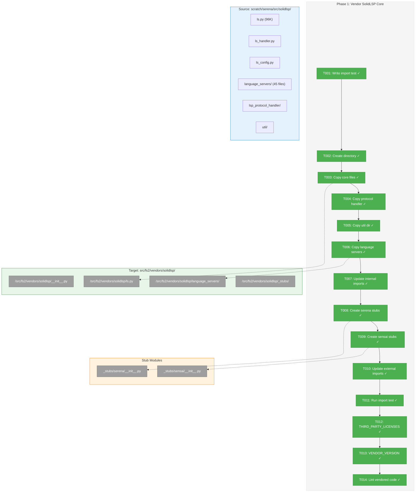
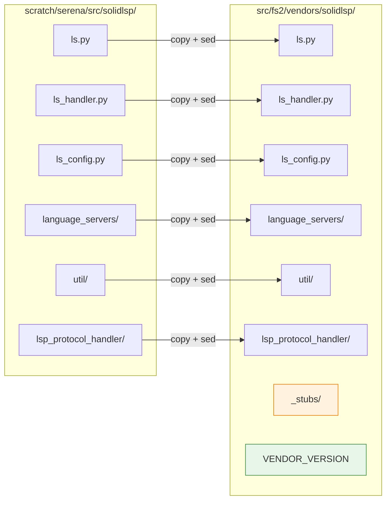
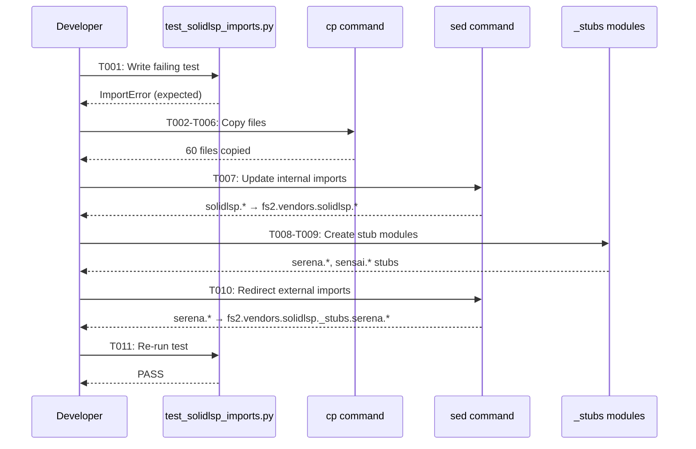

# Phase 1: Vendor SolidLSP Core – Tasks & Alignment Brief

**Spec**: [../../lsp-integration-spec.md](../../lsp-integration-spec.md)
**Plan**: [../../lsp-integration-plan.md](../../lsp-integration-plan.md)
**Date**: 2026-01-15

---

## Executive Briefing

### Purpose
This phase copies SolidLSP (~25K LOC, 60 files) from the Serena repository into fs2's vendor directory, establishing the foundation for LSP-based cross-file reference resolution. The vendored code becomes fs2's property, enabling deep integration and customization.

### What We're Building
A vendored copy of SolidLSP in `src/fs2/vendors/solidlsp/` that:
- Has all import paths updated from `solidlsp.*` to `fs2.vendors.solidlsp.*`
- Stubs out Serena-specific dependencies (`serena.*`, `sensai.*`)
- Preserves C# fixes from Phase 0b research (DOTNET_ROOT env vars, .NET 9+ support)
- Includes proper MIT license attribution
- Tracks upstream commit for future maintenance

### User Value
After this phase, `from fs2.vendors.solidlsp.ls import SolidLanguageServer` will work, enabling Phase 2-4 to build the adapter layer that gives agents accurate cross-file method call resolution.

### Example
**Before**: External dependency on Serena repo at `scratch/serena/src/solidlsp/`
**After**: Self-contained vendored code at `src/fs2/vendors/solidlsp/` with clean imports:
```python
from fs2.vendors.solidlsp.ls import SolidLanguageServer
from fs2.vendors.solidlsp.ls_config import Language, LanguageServerConfig
```

---

## Objectives & Scope

### Objective
Copy SolidLSP files to `src/fs2/vendors/solidlsp/` with import paths updated and external dependencies stubbed.

**Behavior Checklist** (from plan acceptance criteria):
- [ ] AC01: All SolidLSP files (~25K LOC) copied to `src/fs2/vendors/solidlsp/`
- [ ] AC02: `THIRD_PARTY_LICENSES` includes MIT license with Oraios AI and Microsoft
- [ ] AC03: `python -c "from fs2.vendors.solidlsp.ls import SolidLanguageServer"` succeeds

### Goals

- ✅ Create `src/fs2/vendors/solidlsp/` directory structure
- ✅ Copy all 60 SolidLSP Python files
- ✅ Update all internal imports: `solidlsp.*` → `fs2.vendors.solidlsp.*`
- ✅ Stub out `serena.*` and `sensai.*` external dependencies
- ✅ Preserve C# fixes from Phase 0b (critical for .NET SDK discovery)
- ✅ Create `THIRD_PARTY_LICENSES` with proper attribution
- ✅ Create `VENDOR_VERSION` file tracking upstream commit
- ✅ Pass import verification test

### Non-Goals

- ❌ Modifying SolidLSP logic (just copy and adapt imports)
- ❌ Adding tests for SolidLSP functionality (defer to Phase 3 adapter tests)
- ❌ Creating the LspAdapter ABC (Phase 2)
- ❌ Integrating with fs2's ConfigurationService (Phase 3)
- ❌ Performance optimization or code cleanup of vendored code
- ❌ Supporting additional languages beyond what SolidLSP already supports
- ❌ Removing "unused" code from SolidLSP (keep complete for flexibility)

---

## Architecture Map

### Component Diagram
<!-- Status: grey=pending, orange=in-progress, green=completed, red=blocked -->
<!-- Updated by plan-6 during implementation -->



### Task-to-Component Mapping

<!-- Status: ⬜ Pending | 🟧 In Progress | ✅ Complete | 🔴 Blocked -->

| Task | Component(s) | Files | Status | Comment |
|------|-------------|-------|--------|---------|
| T001 | Test Suite | /tests/unit/vendors/test_solidlsp_imports.py | ✅ Complete | TDD: write failing test first |
| T002 | Directory | /src/fs2/vendors/solidlsp/ | ✅ Complete | Create vendor directory structure |
| T003 | Core | /src/fs2/vendors/solidlsp/*.py | ✅ Complete | Copy 9 core Python files (~12K LOC) |
| T004 | Protocol | /src/fs2/vendors/solidlsp/lsp_protocol_handler/ | ✅ Complete | Copy LSP protocol subdirectory |
| T005 | Utils | /src/fs2/vendors/solidlsp/util/ | ✅ Complete | Copy utility subdirectory |
| T006 | Languages | /src/fs2/vendors/solidlsp/language_servers/ | ✅ Complete | Copy 45+ language server configs (~13K LOC) |
| T007 | Imports | All vendored .py files | ✅ Complete | sed: solidlsp.* → fs2.vendors.solidlsp.* |
| T008 | Stubs | /src/fs2/vendors/solidlsp/_stubs/serena/ | ✅ Complete | Stub serena.text_utils, serena.util |
| T009 | Stubs | /src/fs2/vendors/solidlsp/_stubs/sensai/ | ✅ Complete | Stub sensai.util.string, pickle, logging |
| T010 | Imports | All vendored .py files | ✅ Complete | Redirect serena/sensai to _stubs |
| T011 | Test | /tests/unit/vendors/test_solidlsp_imports.py | ✅ Complete | TDD: verify test passes |
| T012 | License | /THIRD_PARTY_LICENSES | ✅ Complete | MIT attribution for Oraios AI, Microsoft |
| T013 | Tracking | /src/fs2/vendors/solidlsp/VENDOR_VERSION | ✅ Complete | Record upstream commit SHA |
| T014 | Quality | All vendored .py files | ✅ Complete | Run ruff check, suppress lint rules as needed |

---

## Tasks

| Status | ID | Task | CS | Type | Dependencies | Absolute Path(s) | Validation | Subtasks | Notes |
|--------|-----|------|-----|------|--------------|------------------|------------|----------|-------|
| [x] | T001 | Write import verification test (must fail initially) | 1 | Test | – | /workspaces/flow_squared/tests/unit/vendors/test_solidlsp_imports.py | Test exists with 5 test cases (imports, language configs, no serena imports, C# fixes, **smoke test for instantiation**), fails with ImportError | – | TDD: RED |
| [x] | T002 | Create vendors/solidlsp/ directory with __init__.py | 1 | Setup | T001 | /workspaces/flow_squared/src/fs2/vendors/solidlsp/__init__.py | Directory exists, __init__.py has docstring | – | |
| [x] | T003 | Copy SolidLSP core files (9 files, ~12K LOC) | 2 | Core | T002 | /workspaces/flow_squared/src/fs2/vendors/solidlsp/ls.py, ls_handler.py, ls_config.py, ls_types.py, ls_request.py, ls_exceptions.py, ls_utils.py, settings.py | All 9 files present, byte count matches source | – | ls.py is 96KB |
| [x] | T004 | Copy lsp_protocol_handler/ subdirectory | 1 | Core | T003 | /workspaces/flow_squared/src/fs2/vendors/solidlsp/lsp_protocol_handler/ | Directory exists with all Python files | – | |
| [x] | T005 | Copy util/ subdirectory (cache, subprocess, zip) | 1 | Core | T003 | /workspaces/flow_squared/src/fs2/vendors/solidlsp/util/ | Directory exists with cache.py, subprocess_util.py, zip.py | – | |
| [x] | T006 | Copy language_servers/ directory (45+ files, ~13K LOC) | 2 | Core | T005 | /workspaces/flow_squared/src/fs2/vendors/solidlsp/language_servers/ | All language server files present; csharp_language_server.py has C# fixes | – | PRESERVE Phase 0b C# fixes |
| [x] | T007 | Update internal import paths: solidlsp.* → fs2.vendors.solidlsp.* | 2 | Core | T006 | All .py files under /workspaces/flow_squared/src/fs2/vendors/solidlsp/ | (1) `grep -r "from solidlsp" src/fs2/vendors/` returns 0; (2) `grep -r "solidlsp" src/fs2/vendors/ \| grep -v fs2.vendors` returns 0 or only comments | – | Per Discovery 09; verify no string-based dynamic imports missed |
| [x] | T008 | Create stub modules for serena.* imports | 2 | Core | T007 | /workspaces/flow_squared/src/fs2/vendors/solidlsp/_stubs/__init__.py, _stubs/serena/__init__.py, _stubs/serena/text_utils.py, _stubs/serena/util/__init__.py, _stubs/serena/util/file_system.py | All 5 files exist; stub exports: MatchedConsecutiveLines, match_path | – | **FIRST**: Verify usage via grep (see Stub Verification section) |
| [x] | T009 | Create stub modules for sensai.* imports | 2 | Core | T008 | /workspaces/flow_squared/src/fs2/vendors/solidlsp/_stubs/sensai/__init__.py, _stubs/sensai/util/__init__.py, _stubs/sensai/util/string.py, _stubs/sensai/util/pickle.py, _stubs/sensai/util/logging.py | All 5 files exist; stub exports: ToStringMixin, dump_pickle, load_pickle, getstate, LogTime | – | **FIRST**: Verify usage via grep (see Stub Verification section) |
| [x] | T010 | Update external imports to use _stubs | 2 | Core | T009 | All .py files under /workspaces/flow_squared/src/fs2/vendors/solidlsp/ | `grep -r "from serena\|from sensai" src/fs2/vendors/` returns 0 matches | – | |
| [x] | T011 | Verify import test passes | 1 | Test | T010 | /workspaces/flow_squared/tests/unit/vendors/test_solidlsp_imports.py | All 5 tests pass including smoke test for instantiation | – | TDD: GREEN |
| [x] | T012 | Create THIRD_PARTY_LICENSES file | 1 | Doc | T011 | /workspaces/flow_squared/THIRD_PARTY_LICENSES | File contains MIT license text, Oraios AI credit, Microsoft credit | – | AC02 |
| [x] | T013 | Create VENDOR_VERSION file | 1 | Doc | T011 | /workspaces/flow_squared/src/fs2/vendors/solidlsp/VENDOR_VERSION | Contains upstream_repo URL, commit SHA b7142cb..., vendored_date | – | |
| [x] | T014 | Run lint on vendored code, add ruff exclusions as needed | 2 | Quality | T013 | /workspaces/flow_squared/pyproject.toml (ruff config), vendored code | `ruff check src/fs2/vendors/solidlsp/ --select=E,F` passes or has documented exclusions | – | |

---

## Alignment Brief

### Critical Findings Affecting This Phase

**🚨 Critical Discovery 01: Stdout Isolation Required** (affects Phase 3, but noted here)
- Problem: Any stdout output during LSP import breaks JSON-RPC communication
- Impact on Phase 1: No action needed - this is an adapter concern. Vendored code can have print statements; the adapter will handle suppression.

**Medium Discovery 09: Import Path Changes** (PRIMARY concern for this phase)
- Problem: Vendored SolidLSP needs import path modifications
- Solution: Systematic sed transformation + verification test
- Implementation:
  ```bash
  # Transform internal imports
  find src/fs2/vendors/solidlsp -name "*.py" -exec sed -i 's/from solidlsp\./from fs2.vendors.solidlsp./g' {} \;
  find src/fs2/vendors/solidlsp -name "*.py" -exec sed -i 's/import solidlsp\./import fs2.vendors.solidlsp./g' {} \;
  ```
- Verification: `grep -r "from solidlsp" src/fs2/vendors/` returns 0 matches

### Phase 0b Learnings (Must Preserve)

**C# MSBuild Fix** - CRITICAL to preserve in `csharp_language_server.py`:
1. Lines 237-244: Pass `DOTNET_ROOT`, `DOTNET_HOST_PATH`, `DOTNET_MSBUILD_SDK_RESOLVER_CLI_DIR` env vars
2. Lines 294-298: Accept .NET 9+ (not just .NET 9 exactly)
3. Lines 444-448: Same .NET 9+ check in fallback method

**Verification** after vendoring:
```bash
# Ensure C# fixes are preserved
grep -n "DOTNET_ROOT" src/fs2/vendors/solidlsp/language_servers/csharp_language_server.py
# Should find env dict with DOTNET_ROOT
grep -n "range(9, 20)" src/fs2/vendors/solidlsp/language_servers/csharp_language_server.py
# Should find .NET 9+ version check
```

### External Dependencies to Stub

| Original Import | Stub Location | Exports Needed |
|-----------------|---------------|----------------|
| `serena.text_utils.MatchedConsecutiveLines` | `_stubs/serena/text_utils.py` | `MatchedConsecutiveLines` class (empty class) |
| `serena.util.file_system.match_path` | `_stubs/serena/util/file_system.py` | `match_path` function (return True) |
| `sensai.util.string.ToStringMixin` | `_stubs/sensai/util/string.py` | `ToStringMixin` class (no-op mixin) |
| `sensai.util.pickle.dump_pickle` | `_stubs/sensai/util/pickle.py` | `dump_pickle(obj, path)` (use stdlib pickle) |
| `sensai.util.pickle.load_pickle` | `_stubs/sensai/util/pickle.py` | `load_pickle(path)` (use stdlib pickle) |
| `sensai.util.pickle.getstate` | `_stubs/sensai/util/pickle.py` | `getstate(obj)` (return obj.__dict__) |
| `sensai.util.logging.LogTime` | `_stubs/sensai/util/logging.py` | `LogTime` context manager (no-op timing) |

### Stub Verification (BEFORE Creating Stubs)

**Rationale**: Minimal no-op stubs could cause silent bugs if the external functions are actually used for real logic. Verify usage before implementing.

**Run these commands BEFORE T008/T009 to understand how each import is used:**

```bash
# Serena imports - check usage patterns
grep -rn "MatchedConsecutiveLines" scratch/serena/src/solidlsp/ --include="*.py"
grep -rn "match_path" scratch/serena/src/solidlsp/ --include="*.py"

# Sensai imports - check usage patterns
grep -rn "ToStringMixin" scratch/serena/src/solidlsp/ --include="*.py"
grep -rn "dump_pickle\|load_pickle" scratch/serena/src/solidlsp/ --include="*.py"
grep -rn "getstate" scratch/serena/src/solidlsp/ --include="*.py"
grep -rn "LogTime" scratch/serena/src/solidlsp/ --include="*.py"
```

**Decision Tree for Each Import:**
1. **Only in type hints / unused** → Safe no-op stub
2. **Used but return value ignored** → Safe no-op stub
3. **Return value used for logic** → Needs functional implementation
4. **Used for side effects (logging, persistence)** → Use stdlib equivalents

**Document findings in Discoveries table before proceeding.**

### Invariants & Guardrails

- **No functional changes to SolidLSP core**: Vendored code must behave identically to source, **except for stubbed external dependencies** which use minimal compatible implementations
- **Complete copy**: Don't selectively copy files - all 60 files needed for language support
- **Preserve modifications**: C# fixes from Phase 0b MUST be preserved
- **Import isolation**: No `serena.*` or `sensai.*` imports in final code

### Inputs to Read

| File | Purpose |
|------|---------|
| `/workspaces/flow_squared/scratch/serena/src/solidlsp/` | Source directory to copy |
| `/workspaces/flow_squared/docs/plans/025-lsp-research/tasks/phase-0b-multi-project-research/cross-file-lsp-validation.md` | C# fix details |

### Visual Alignment: Copy Flow Diagram



### Visual Alignment: Import Transformation Sequence



### Test Plan (TDD - Tests First)

**Test File**: `/workspaces/flow_squared/tests/unit/vendors/test_solidlsp_imports.py`

| Test Name | Purpose | Expected Initial State | Expected Final State |
|-----------|---------|----------------------|---------------------|
| `test_given_vendored_solidlsp_when_importing_core_then_succeeds` | Verify core imports work | FAIL (ImportError) | PASS |
| `test_given_vendored_solidlsp_when_importing_language_configs_then_succeeds` | Verify language server imports | FAIL (ImportError) | PASS |
| `test_given_vendored_solidlsp_when_checking_no_serena_imports_then_clean` | Verify no serena.* imports remain | FAIL (grep finds matches) | PASS |
| `test_given_vendored_solidlsp_when_checking_csharp_fixes_then_preserved` | Verify C# DOTNET_ROOT fix present | N/A (file check) | PASS |
| `test_given_vendored_solidlsp_when_instantiating_then_stubs_compatible` | **Smoke test**: verify stubs work at runtime | FAIL (AttributeError/TypeError) | PASS |

### Step-by-Step Implementation Outline

1. **T001**: Write `test_solidlsp_imports.py` with failing imports → Verify test fails with ImportError
2. **T002**: Create `src/fs2/vendors/solidlsp/` with `__init__.py` → Directory exists
3. **T003**: Copy core files (ls.py, ls_handler.py, etc.) → 9 files present
4. **T004**: Copy `lsp_protocol_handler/` directory → Subdirectory exists
5. **T005**: Copy `util/` directory → Subdirectory exists
6. **T006**: Copy `language_servers/` directory → 45+ files present, verify C# fixes exist
7. **T007**: Run sed to update internal imports → No `from solidlsp` matches
8. **T008**: Create `_stubs/serena/` modules → Stub files exist
9. **T009**: Create `_stubs/sensai/` modules → Stub files exist
10. **T010**: Update imports to use stubs → No `from serena` or `from sensai` matches
11. **T011**: Re-run import test → Test passes
12. **T012**: Create THIRD_PARTY_LICENSES → File exists with proper attribution
13. **T013**: Create VENDOR_VERSION → File exists with commit SHA
14. **T014**: Run ruff lint → Clean or documented exclusions

### Commands to Run

```bash
# Setup: Ensure clean state
rm -rf src/fs2/vendors/solidlsp/ 2>/dev/null || true

# T001: Write and run failing test (TDD RED)
pytest tests/unit/vendors/test_solidlsp_imports.py -v 2>&1 | head -20
# Expected: FAIL with ImportError

# T002: Create directory structure
mkdir -p src/fs2/vendors/solidlsp/

# T003-T006: Copy files (one command)
cp -r scratch/serena/src/solidlsp/* src/fs2/vendors/solidlsp/
rm -rf src/fs2/vendors/solidlsp/__pycache__ src/fs2/vendors/solidlsp/**/__pycache__

# Verify C# fixes preserved
grep -n "DOTNET_ROOT" src/fs2/vendors/solidlsp/language_servers/csharp_language_server.py

# T007: Update internal imports
find src/fs2/vendors/solidlsp -name "*.py" -exec sed -i 's/from solidlsp\./from fs2.vendors.solidlsp./g' {} \;
find src/fs2/vendors/solidlsp -name "*.py" -exec sed -i 's/import solidlsp\./import fs2.vendors.solidlsp./g' {} \;

# Verify no solidlsp imports remain
grep -r "from solidlsp\." src/fs2/vendors/solidlsp/ || echo "✓ No internal solidlsp imports"
grep -r "import solidlsp\." src/fs2/vendors/solidlsp/ || echo "✓ No internal solidlsp imports"

# T008-T010: Create stubs and update external imports
# (implementation details in T008-T010 tasks)

# T011: Re-run test (TDD GREEN)
pytest tests/unit/vendors/test_solidlsp_imports.py -v
# Expected: PASS

# T012: Verify THIRD_PARTY_LICENSES
cat THIRD_PARTY_LICENSES | head -30

# T013: Verify VENDOR_VERSION
cat src/fs2/vendors/solidlsp/VENDOR_VERSION

# T014: Lint check
ruff check src/fs2/vendors/solidlsp/ --select=E,F 2>&1 | head -30
```

### Risks & Unknowns

| Risk | Severity | Likelihood | Mitigation |
|------|----------|------------|------------|
| Hidden dependencies in SolidLSP | Medium | Low | Run imports after each stub; add stubs as needed |
| C# fixes lost during copy | High | Low | Verify with grep immediately after copy |
| Import path conflicts | Medium | Low | Test imports in isolation before full test |
| Circular imports in stubs | Low | Low | Keep stubs minimal; lazy imports if needed |

### Ready Check

- [ ] Plan file (`lsp-integration-plan.md`) reviewed for Phase 1 tasks
- [ ] Critical Discovery 09 (Import Path Changes) understood
- [ ] Phase 0b C# fixes documented and verification commands ready
- [ ] Source directory (`scratch/serena/src/solidlsp/`) accessible
- [ ] Test file location confirmed (`tests/unit/vendors/`)
- [ ] ADR constraints mapped to tasks (IDs noted in Notes column) - N/A (no ADRs exist)

---

## Phase Footnote Stubs

_Populated during implementation by plan-6. Footnote tags are added here after code changes._

| Footnote | Task | Description | FlowSpace Node IDs |
|----------|------|-------------|-------------------|
| [^7] | T001-T006 | Vendored SolidLSP (~25K LOC, 60 files) | `file:src/fs2/vendors/solidlsp/__init__.py`, `file:src/fs2/vendors/solidlsp/ls.py`, `file:src/fs2/vendors/solidlsp/ls_handler.py`, `file:src/fs2/vendors/solidlsp/ls_config.py`, 42 language server files, 4 protocol handler files, 3 util files |
| [^8] | T008 | Stub modules for serena.* dependencies | `class:src/fs2/vendors/solidlsp/_stubs/serena/text_utils.py:MatchedConsecutiveLines`, `function:src/fs2/vendors/solidlsp/_stubs/serena/util/file_system.py:match_path` |
| [^9] | T009 | Stub modules for sensai.* dependencies | `class:src/fs2/vendors/solidlsp/_stubs/sensai/util/string.py:ToStringMixin`, `function:src/fs2/vendors/solidlsp/_stubs/sensai/util/pickle.py:dump_pickle`, `function:src/fs2/vendors/solidlsp/_stubs/sensai/util/pickle.py:load_pickle`, `function:src/fs2/vendors/solidlsp/_stubs/sensai/util/pickle.py:getstate`, `class:src/fs2/vendors/solidlsp/_stubs/sensai/util/logging.py:LogTime` |
| [^10] | T001, T011 | Import verification test (5 tests) | `function:tests/unit/vendors/test_solidlsp_imports.py:test_given_vendored_solidlsp_when_importing_core_then_succeeds`, `function:tests/unit/vendors/test_solidlsp_imports.py:test_given_vendored_solidlsp_when_importing_language_configs_then_succeeds`, `function:tests/unit/vendors/test_solidlsp_imports.py:test_given_vendored_solidlsp_when_checking_no_serena_imports_then_clean`, `function:tests/unit/vendors/test_solidlsp_imports.py:test_given_vendored_solidlsp_when_checking_csharp_fixes_then_preserved`, `function:tests/unit/vendors/test_solidlsp_imports.py:test_given_vendored_solidlsp_when_instantiating_then_stubs_compatible` |
| [^11] | T012-T014 | Dependencies and configuration | `file:pyproject.toml`, `file:THIRD_PARTY_LICENSES`, `file:src/fs2/vendors/solidlsp/VENDOR_VERSION` |

---

## Evidence Artifacts

**Execution Log**: `./execution.log.md` (created by plan-6 during implementation)

**Supporting Files**:
- Test file: `/workspaces/flow_squared/tests/unit/vendors/test_solidlsp_imports.py`
- Vendored code: `/workspaces/flow_squared/src/fs2/vendors/solidlsp/`
- License file: `/workspaces/flow_squared/THIRD_PARTY_LICENSES`
- Version tracking: `/workspaces/flow_squared/src/fs2/vendors/solidlsp/VENDOR_VERSION`

---

## Discoveries & Learnings

_Populated during implementation by plan-6. Log anything of interest to your future self._

| Date | Task | Type | Discovery | Resolution | References |
|------|------|------|-----------|------------|------------|
| 2026-01-16 | T001 | gotcha | Test class names must match actual SolidLSP exports (e.g., `SolidLanguageServerHandler` not `LspHandler`, `Gopls` not `GoplsServer`) | Read source code to find actual exported names | execution.log.md#T001 |
| 2026-01-16 | T011 | gotcha | `LanguageServerConfig.__init__()` uses `code_language=` parameter, not `language=` | Fixed smoke test constructor argument | execution.log.md#T011 |
| 2026-01-16 | T007 | gotcha | Initial sed missed `from solidlsp import` pattern (only caught `from solidlsp.`) | Ran additional sed pass for both patterns | execution.log.md#T007 |
| 2026-01-16 | T011 | decision | Added `psutil>=5.9.0` and `overrides>=7.0.0` as required dependencies for SolidLSP | Added to pyproject.toml | pyproject.toml:12-14 |
| 2026-01-16 | T008-T009 | insight | Stub implementations need to be functional, not just no-ops: `MatchedConsecutiveLines.from_file_contents()` is called with real logic, `match_path()` does gitignore matching | Implemented functional stubs using stdlib (dataclasses, pathspec, pickle) | _stubs/serena/text_utils.py |
| 2026-01-16 | T014 | decision | Exempted vendored code from all lint rules (`"src/fs2/vendors/*" = ["ALL"]`) to avoid modifying third-party code | Added per-file-ignores in pyproject.toml | pyproject.toml:63 |

**Types**: `gotcha` | `research-needed` | `unexpected-behavior` | `workaround` | `decision` | `debt` | `insight`

**What to log**:
- Things that didn't work as expected
- External research that was required
- Implementation troubles and how they were resolved
- Gotchas and edge cases discovered
- Decisions made during implementation
- Technical debt introduced (and why)
- Insights that future phases should know about

_See also: `execution.log.md` for detailed narrative._

---

## Directory Layout

```
docs/plans/025-lsp-research/
├── lsp-integration-plan.md
├── lsp-integration-spec.md
└── tasks/
    ├── phase-0b-multi-project-research/
    │   ├── tasks.md
    │   ├── execution.log.md
    │   └── cross-file-lsp-validation.md
    └── phase-1-vendor-solidlsp-core/
        ├── tasks.md              # This file
        └── execution.log.md      # Created by plan-6
```

**Target Structure After Phase 1**:
```
src/fs2/vendors/
└── solidlsp/
    ├── __init__.py
    ├── ls.py
    ├── ls_handler.py
    ├── ls_config.py
    ├── ls_types.py
    ├── ls_request.py
    ├── ls_exceptions.py
    ├── ls_utils.py
    ├── settings.py
    ├── VENDOR_VERSION
    ├── _stubs/
    │   ├── __init__.py
    │   ├── serena/
    │   │   ├── __init__.py
    │   │   ├── text_utils.py
    │   │   └── util/
    │   │       ├── __init__.py
    │   │       └── file_system.py
    │   └── sensai/
    │       ├── __init__.py
    │       └── util/
    │           ├── __init__.py
    │           ├── string.py
    │           ├── pickle.py
    │           └── logging.py
    ├── lsp_protocol_handler/
    │   └── ...
    ├── util/
    │   ├── __init__.py
    │   ├── cache.py
    │   ├── subprocess_util.py
    │   └── zip.py
    └── language_servers/
        ├── __init__.py
        ├── common.py
        ├── pyright_server.py
        ├── gopls.py
        ├── typescript_language_server.py
        ├── csharp_language_server.py  # C# fixes preserved
        └── ... (40+ more language configs)
```

---

## Reference Information

### Upstream Tracking
- **Repository**: https://github.com/oraios/serena
- **Commit SHA**: b7142cbfd4ee18701e59c27c9e058ed20f8cd125
- **Vendored Date**: 2026-01-15

### Source File Statistics
| Component | Files | Approx LOC |
|-----------|-------|------------|
| Core (root .py files) | 9 | ~12,000 |
| Language Servers | 45+ | ~13,000 |
| Utilities | 3 | ~500 |
| LSP Protocol Handler | 3+ | ~1,000 |
| **Total** | **60** | **~25,000** |

---

## Critical Insights Discussion

**Session**: 2026-01-16
**Context**: Phase 1: Vendor SolidLSP Core - Tasks & Alignment Brief
**Analyst**: AI Clarity Agent
**Reviewer**: Development Team
**Format**: Water Cooler Conversation (5 Critical Insights)

### Insight 1: Stub Module Strategy Could Silently Break Real Functionality

**Did you know**: Minimal no-op stubs could cause silent bugs if the external functions are actually used for real logic.

**Implications**:
- `match_path()` returning `True` always could skip important filtering
- `LogTime` as no-op could miss timeout tracking
- `ToStringMixin` could affect caching or debugging

**Options Considered**:
- Option A: Verify Before Stubbing - grep to understand usage first
- Option B: Stub Minimally, Fix Failures - fast start, fix what breaks
- Option C: Create Functional Stubs From Day 1 - most correct but more work

**AI Recommendation**: Option A (Verify Before Stubbing)
- Reasoning: Low effort grep, prevents silent bugs, documents findings

**Decision**: Add verification step before creating stub modules

**Action Items**:
- [x] Add verification grep commands to T008 and T009 notes
- [x] Add "Stub Verification" section with decision tree

**Affects**: Tasks T008, T009

---

### Insight 2: Missing `__init__.py` Files Could Cause Import Failures

**Did you know**: The stub directory structure requires 6+ `__init__.py` files not explicitly listed in task validation.

**Implications**:
- Python requires `__init__.py` in every package directory
- Missing files cause `ModuleNotFoundError`
- Obvious but easy to forget

**Options Considered**:
- Option A: Add Explicit __init__.py Files to Tasks - clear contract
- Option B: Assume Implementation Will Create Them - trust implementer
- Option C: Use Single-File Stubs with sys.path Manipulation - hacky

**AI Recommendation**: Option A (Add Explicit __init__.py Files)
- Reasoning: Prevents "obvious" mistakes that waste debugging time

**Decision**: Update T008/T009 to explicitly list all required `__init__.py` files

**Action Items**:
- [x] Update T008 Absolute Path(s) to include all 5 files
- [x] Update T009 Absolute Path(s) to include all 5 files
- [x] Update validation to "All 5 files exist"

**Affects**: Tasks T008, T009

---

### Insight 3: sed Import Transformation Has Edge Cases

**Did you know**: The sed-based import transformation could miss string-based dynamic imports like `importlib.import_module("solidlsp.something")`.

**Implications**:
- Import test passes but runtime fails
- String literals not caught by pattern
- Edge cases hard to debug

**Options Considered**:
- Option A: Add Verification Step for Edge Cases - grep after sed
- Option B: Trust sed and Fix Forward - faster but risky
- Option C: Use AST-based Transformation - most accurate but overkill

**AI Recommendation**: Option A (Add Verification Step)
- Reasoning: Simple grep catches string-based imports

**Decision**: Add post-transformation verification grep to T007

**Action Items**:
- [x] Update T007 validation to include `grep -r "solidlsp" | grep -v fs2.vendors`

**Affects**: Task T007

---

### Insight 4: TDD Import Test Only Checks Import Success, Not Runtime Behavior

**Did you know**: Import verification test could pass even if vendored code fails at runtime due to stub incompatibilities.

**Implications**:
- `assert SolidLanguageServer is not None` doesn't test instantiation
- Stub issues only discovered in Phase 3
- Delayed feedback

**Options Considered**:
- Option A: Add Smoke Test for Basic Instantiation - fast feedback
- Option B: Keep Import-Only Test, Defer to Phase 3 - simpler Phase 1
- Option C: Full Integration Test in Phase 1 - scope creep

**AI Recommendation**: Option A (Add Smoke Test)
- Reasoning: Catches stub issues before Phase 3, minimal scope creep

**Decision**: Add smoke test for instantiation to verify stubs are compatible

**Action Items**:
- [x] Add smoke test to Test Plan table
- [x] Update T001 to require 5 test cases including smoke test
- [x] Update T011 validation to "All 5 tests pass"

**Affects**: Tasks T001, T011, Test Plan

---

### Insight 5: "No Functional Changes" Invariant Contradicts Stub Implementation

**Did you know**: The invariant says code must behave identically, but stubs ARE functional changes.

**Implications**:
- Confusion about what's allowed
- Implementer might think exact behavior required
- Reviewer might reject stubs

**Options Considered**:
- Option A: Clarify the Invariant - add stub exception
- Option B: Remove the Invariant - no contradiction but loses intent
- Option C: Split Into Two Invariants - precise but verbose

**AI Recommendation**: Option A (Clarify the Invariant)
- Reasoning: Keeps intent, acknowledges reality, prevents confusion

**Decision**: Clarify invariant with explicit exception for stubbed dependencies

**Action Items**:
- [x] Update invariant text to include stub exception

**Affects**: Invariants & Guardrails section

---

## Session Summary

**Insights Surfaced**: 5 critical insights identified and discussed
**Decisions Made**: 5 decisions reached through collaborative discussion
**Action Items Created**: 12 updates applied
**Areas Updated**:
- T001: Added smoke test requirement
- T007: Added edge case verification grep
- T008: Added explicit __init__.py files, verification step
- T009: Added explicit __init__.py files, verification step
- T011: Updated validation for 5 tests
- Test Plan: Added smoke test row
- Stub Verification: New section added
- Invariants: Clarified stub exception

**Shared Understanding Achieved**: ✓

**Confidence Level**: High - All 5 insights addressed with concrete updates to tasks.md

**Next Steps**: Proceed with `/plan-6-implement-phase` when ready
