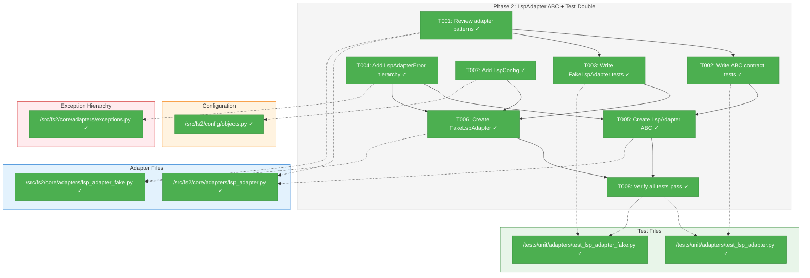
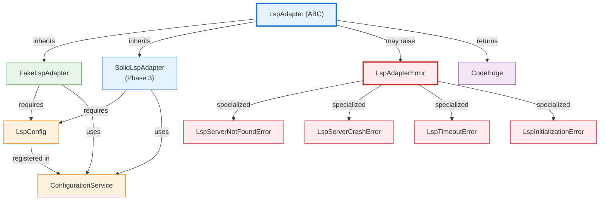
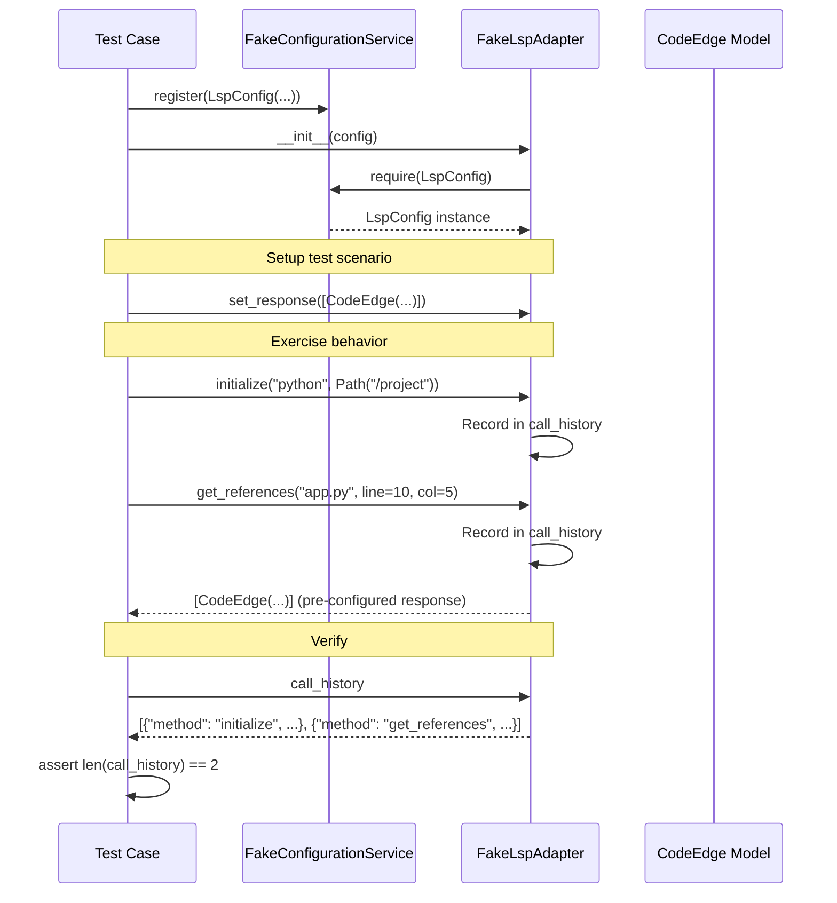

# Phase 2: Create LspAdapter ABC + First Implementation – Tasks & Alignment Brief

**Spec**: [../../lsp-integration-spec.md](../../lsp-integration-spec.md)  
**Plan**: [../../lsp-integration-plan.md](../../lsp-integration-plan.md)  
**Date**: 2026-01-16

---

## Executive Briefing

### Purpose
This phase creates the `LspAdapter` ABC interface that defines how fs2 interacts with Language Server Protocol servers for cross-file reference resolution. It establishes the contract that all LSP implementations (SolidLSP, custom adapters) must fulfill, following fs2's adapter pattern.

### What We're Building
A complete adapter interface package consisting of:
- **LspAdapter ABC** with language-agnostic methods (`initialize`, `shutdown`, `get_references`, `get_definition`, `is_ready`)
- **FakeLspAdapter** test double with call_history tracking for isolated testing
- **LspAdapterError hierarchy** with actionable error messages (NotFound, Crash, Timeout, Initialization)
- **LspConfig** for server configuration (timeout, memory limits, etc.)

### User Value
After this phase, service layer code can depend on the `LspAdapter` interface without coupling to any specific LSP implementation. Tests can use `FakeLspAdapter` to verify behavior without starting real language servers, enabling fast, reliable TDD workflows.

### Example
**Before**: No LSP integration capability
**After**: Service layer can inject any LSP adapter:
```python
# In service layer
def __init__(self, config: ConfigurationService, lsp: LspAdapter):
    self._lsp = lsp

def analyze_file(self, file_path: Path) -> list[CodeEdge]:
    if self._lsp.is_ready():
        return self._lsp.get_references(file_path, line=10, column=5)
    return []  # Graceful degradation

# In tests
fake_lsp = FakeLspAdapter(config)
fake_lsp.set_response([CodeEdge(...)])
service = AnalyzerService(config, lsp=fake_lsp)
assert len(fake_lsp.call_history) == 1
```

---

## Objectives & Scope

### Objective
Create the `LspAdapter` ABC interface and exception hierarchy following fs2 adapter patterns.

**Behavior Checklist** (from plan acceptance criteria):
- [ ] AC04: `LspAdapter` ABC defines language-agnostic interface returning `CodeEdge` only
- [ ] AC06: `FakeLspAdapter` inherits from ABC with `call_history` tracking
- [ ] AC07: Adapter raises `LspAdapterError` hierarchy (NotFound, Crash, Timeout, Initialization)

### Goals

- ✅ Define `LspAdapter` ABC with 5 core methods (initialize, shutdown, get_references, get_definition, is_ready)
- ✅ Create `FakeLspAdapter` test double following fs2 fake pattern (call_history, set_response, set_error)
- ✅ Add `LspAdapterError` hierarchy to `exceptions.py` with actionable messages
- ✅ Create `LspConfig` in `config/objects.py` for adapter configuration
- ✅ Write ABC contract tests verifying interface correctness
- ✅ Write FakeLspAdapter tests demonstrating test double usage
- ✅ Follow fs2 adapter naming conventions (`lsp_adapter.py`, `lsp_adapter_fake.py`)

### Non-Goals

- ❌ Implementing SolidLspAdapter (Phase 3)
- ❌ Starting real LSP servers (Phase 3 integration tests)
- ❌ Project root detection algorithm (handled in Phase 0b, used in Phase 3)
- ❌ Stdout isolation or process tree cleanup (Phase 3 implementation details)
- ❌ Multi-language support (Phase 4)
- ❌ Service layer integration (Phase 5)
- ❌ Performance optimization or caching
- ❌ Language-specific configuration (focus on generic LspConfig first)

---

## Architecture Map

### Component Diagram
<!-- Status: grey=pending, orange=in-progress, green=completed, red=blocked -->
<!-- Updated by plan-6 during implementation -->



### Task-to-Component Mapping

<!-- Status: ⬜ Pending | 🟧 In Progress | ✅ Complete | 🔴 Blocked -->

| Task | Component(s) | Files | Status | Comment |
|------|-------------|-------|--------|---------|
| T001 | Adapter Pattern Review | sample_adapter*.py, exceptions.py | ✅ Complete | Understand fs2 patterns before creating LSP variants |
| T002 | ABC Contract Tests | test_lsp_adapter.py | ✅ Complete | TDD: Define interface through tests first |
| T003 | Fake Adapter Tests | test_lsp_adapter_fake.py | ✅ Complete | TDD: Test double behavior specification |
| T004 | Exception Hierarchy | exceptions.py | ✅ Complete | Add LSP-specific errors with actionable messages |
| T005 | LspAdapter ABC | lsp_adapter.py | ✅ Complete | Implement ABC to satisfy contract tests |
| T006 | FakeLspAdapter | lsp_adapter_fake.py | ✅ Complete | Implement test double following fs2 fake pattern |
| T007 | LspConfig | config/objects.py | ✅ Complete | Configuration object for LSP adapter settings |
| T008 | Test Verification | All test files | ✅ Complete | Ensure all Phase 2 tests pass (TDD green) |

---

## Tasks

| Status | ID   | Task | CS | Type | Dependencies | Absolute Path(s) | Validation | Subtasks | Notes |
|--------|------|------|----|------|--------------|------------------|------------|----------|-------|
| [x] | T001 | Review existing adapter patterns in fs2 | 1 | Setup | – | /workspaces/flow_squared/src/fs2/core/adapters/sample_adapter.py, /workspaces/flow_squared/src/fs2/core/adapters/sample_adapter_fake.py, /workspaces/flow_squared/src/fs2/core/adapters/exceptions.py | Documented key patterns: ABC structure, ConfigurationService injection, call_history, exception translation | – | Foundation for LspAdapter design |
| [x] | T002 | Write ABC contract tests for LspAdapter interface | 2 | Test | T001 | /workspaces/flow_squared/tests/unit/adapters/test_lsp_adapter.py | Tests fail with ImportError (LspAdapter doesn't exist yet) | – | TDD RED: Define expected interface |
| [x] | T003 | Write FakeLspAdapter behavioral tests | 2 | Test | T001 | /workspaces/flow_squared/tests/unit/adapters/test_lsp_adapter_fake.py | Tests fail with ImportError (FakeLspAdapter doesn't exist yet) | – | TDD RED: Specify test double behavior |
| [x] | T004 | Add LspAdapterError hierarchy to exceptions.py | 2 | Core | – | /workspaces/flow_squared/src/fs2/core/adapters/exceptions.py | All 5 error classes importable with actionable messages | – | Per Discovery 04, 12 |
| [x] | T005 | Create LspAdapter ABC interface | 2 | Core | T002, T004 | /workspaces/flow_squared/src/fs2/core/adapters/lsp_adapter.py | ABC contract tests pass, mypy --strict clean | – | Per Discovery 05 naming |
| [x] | T006 | Create FakeLspAdapter test double | 2 | Core | T003, T004, T005, T007 | /workspaces/flow_squared/src/fs2/core/adapters/lsp_adapter_fake.py | FakeLspAdapter tests pass, inherits from ABC | – | Per Discovery 08 pattern |
| [x] | T007 | Add LspConfig to config/objects.py | 1 | Core | – | /workspaces/flow_squared/src/fs2/config/objects.py | LspConfig importable, follows BaseModel pattern | – | Timeout, memory limits, etc. |
| [x] | T008 | Verify all Phase 2 tests pass | 1 | Integration | T005, T006 | /workspaces/flow_squared/tests/unit/adapters/test_lsp_adapter.py, /workspaces/flow_squared/tests/unit/adapters/test_lsp_adapter_fake.py | All tests green, ruff + mypy clean | – | TDD GREEN: All acceptance criteria met |

---

## Alignment Brief

### Prior Phases Review

#### Phase 1: Vendor SolidLSP Core (COMPLETE)

**A. Deliverables Created**:
- Vendored SolidLSP (~25K LOC, 60 files) at `/workspaces/flow_squared/src/fs2/vendors/solidlsp/`
- All imports transformed: `solidlsp.*` → `fs2.vendors.solidlsp.*` (309 transformations)
- Stubs for external dependencies: `_stubs/serena/*` and `_stubs/sensai/*` (10 stub files)
- Import verification test: `tests/unit/vendors/test_solidlsp_imports.py` (5 tests)
- License attribution: `THIRD_PARTY_LICENSES` (MIT, Oraios AI + Microsoft)
- Version tracking: `src/fs2/vendors/solidlsp/VENDOR_VERSION`
- Dependencies added: `psutil>=5.9.0`, `overrides>=7.0.0`

**B. Key SolidLSP API Discovered**:
```python
# Primary entry point
SolidLanguageServer.create(
    config: LanguageServerConfig,
    repository_root_path: str,
    timeout: float | None = None,
    solidlsp_settings: SolidLSPSettings | None = None
) -> SolidLanguageServer

# Query methods (relative paths, 0-indexed line/column)
request_definition(relative_file_path: str, line: int, column: int) -> list[ls_types.Location]
request_references(relative_file_path: str, line: int, column: int) -> list[ls_types.Location]
request_document_symbols(relative_file_path: str, ...) -> DocumentSymbols
request_workspace_symbol(query: str) -> list[UnifiedSymbolInformation] | None
```

**C. Critical Gotchas for Phase 2**:
- **Relative file paths**: All methods expect paths relative to `repository_root_path`
- **0-indexed coordinates**: `line` and `column` are 0-indexed (unlike editor displays)
- **Parameter name**: Constructor uses `code_language=`, not `language=`
- **ABC inheritance**: `SolidLanguageServer` is itself an ABC
- **C# environment variables**: DOTNET_ROOT must be set (preserved from Phase 0b)

**D. Dependencies Exported to Phase 2**:
- `SolidLanguageServer` (main class to wrap in Phase 3)
- `Language` enum (Python, TypeScript, Go, CSharp, etc.)
- `LanguageServerConfig` dataclass
- `Position`, `Range`, `Location` types (for response translation)
- `UnifiedSymbolInformation` (symbol representation)

**E. Lessons Learned**:
- sed transformations work cleanly for bulk import changes (309 successful edits)
- Stub verification via grep before creation prevents silent bugs
- Test names matter: initial test used wrong class names, caught in TDD RED phase
- Dependencies discovered at import time: psutil/overrides not in original requirements
- Lint exclusion via `"src/fs2/vendors/*" = ["ALL"]` avoids per-file suppressions

**F. Technical Debt**:
- `MatchedConsecutiveLines` is fully implemented (146 lines), not a minimal stub—may diverge from upstream
- No automated vendor sync mechanism for pulling upstream changes
- `lsp_types.py` is 217KB—too large for manual review/modification

**G. Architectural Continuity**:
- **Vendor isolation**: All vendor code under `src/fs2/vendors/` with namespace protection
- **Stub convention**: Internal stubs use `_stubs/` prefix (not exported from package)
- **Lint policy**: Third-party code excluded from fs2 lint rules
- **Complete vendoring**: All 60 files copied to support full language matrix

---

### Critical Findings Affecting This Phase

#### Discovery 04: Actionable Error Messages (High Impact)
**Problem**: Generic errors provide no recovery path  
**Solution**: Create `LspAdapterError` hierarchy with platform-specific install commands
```python
class LspServerNotFoundError(LspAdapterError):
    def __init__(self, server_name: str, install_commands: dict[str, str]):
        system = platform.system()
        cmd = install_commands.get(system, install_commands.get('default'))
        super().__init__(f"'{server_name}' not found. Install with:\n  {cmd}")
```
**Affects**: T004 (exception hierarchy), T005 (ABC docstrings), T006 (FakeLspAdapter error simulation)

#### Discovery 05: Adapter Naming Convention (High Impact)
**Pattern**: fs2 uses specific naming convention for adapter files
- ABC: `{name}_adapter.py`
- Implementation: `{name}_adapter_{impl}.py`
- Fake: `{name}_adapter_fake.py`

**Action Required**: Follow convention exactly:
```
/src/fs2/core/adapters/lsp_adapter.py          # ABC (this phase)
/src/fs2/core/adapters/lsp_adapter_fake.py     # Test double (this phase)
/src/fs2/core/adapters/lsp_adapter_solidlsp.py # SolidLSP wrapper (Phase 3)
```
**Affects**: T005 (ABC file location), T006 (fake file location)

#### Discovery 06: ConfigurationService Injection (High Impact)
**Pattern**: Adapters receive ConfigurationService registry, call `require()` internally
```python
class FakeLspAdapter(LspAdapter):
    def __init__(self, config: "ConfigurationService"):
        self._lsp_config = config.require(LspConfig)
```
**Action Required**: No concept leakage—composition root doesn't know adapter configs  
**Affects**: T005 (ABC constructor signature), T006 (FakeLspAdapter constructor), T007 (LspConfig definition)

#### Discovery 08: Test Double Pattern (High Impact)
**Pattern**: Fakes over mocks; fakes inherit from ABC with call_history

**DYK-1 Enhancement**: Use method-specific response setters (not single `set_response()`)
```python
class FakeLspAdapter(LspAdapter):
    def __init__(self, config: "ConfigurationService"):
        self.call_history: list[dict[str, Any]] = []
        self._definition_response: list[CodeEdge] | None = None
        self._references_response: list[CodeEdge] | None = None
        self._error: Exception | None = None

    def set_definition_response(self, edges: list[CodeEdge]) -> None:
        """Configure response for get_definition() calls."""
        self._definition_response = edges

    def set_references_response(self, edges: list[CodeEdge]) -> None:
        """Configure response for get_references() calls."""
        self._references_response = edges

    def set_error(self, error: Exception) -> None:
        """Configure error to raise on next call (any method)."""
        self._error = error
```
**Action Required**: Create `FakeLspAdapter` with method-specific setters (DYK-1 decision)  
**Affects**: T003 (test specification), T006 (FakeLspAdapter implementation)

#### Discovery 12: Exception Hierarchy (Medium Impact)
**Pattern**: Domain exceptions in `exceptions.py` with recovery instructions
```python
class LspAdapterError(AdapterError):
    """Base LSP error."""

class LspServerNotFoundError(LspAdapterError):
    """Server binary not found."""

class LspServerCrashError(LspAdapterError):
    """Server process crashed."""

class LspTimeoutError(LspAdapterError):
    """Operation timed out."""

class LspInitializationError(LspAdapterError):
    """Server initialization failed."""
```
**Action Required**: Add to existing `exceptions.py` following pattern  
**Affects**: T004 (exception implementation)

---

### ADR Decision Constraints

**No ADRs exist** for this feature at this time. If architectural decisions are made during Phase 2, they should be documented via `/plan-3a-adr` command.

---

### Invariants & Guardrails

**Interface Contracts**:
- `LspAdapter.get_references()` and `get_definition()` MUST return `list[CodeEdge]`, never SolidLSP types
- All edges MUST have `confidence=1.0` (LSP provides definitive answers)
- All edges MUST set `resolution_rule` to identify LSP method (e.g., `"lsp:references"`)
- `initialize()` MUST be idempotent (safe to call multiple times)
- `shutdown()` MUST be idempotent (safe to call even if not initialized)

**Error Handling**:
- All exceptions MUST inherit from `LspAdapterError`
- All error messages MUST include actionable recovery instructions
- `LspServerNotFoundError` MUST include platform-specific install command

**Type Safety**:
- ABC MUST use `TYPE_CHECKING` guard for ConfigurationService import (avoid circular deps)
- All methods MUST have complete type annotations
- Code MUST pass `mypy --strict`

**Testing**:
- FakeLspAdapter MUST track all method calls in `call_history`
- Tests MUST use `FakeConfigurationService`, not production config
- Tests MUST verify behavior, not implementation details

---

### Inputs to Read

| File | Purpose | Key Elements |
|------|---------|--------------|
| `/workspaces/flow_squared/src/fs2/core/adapters/sample_adapter.py` | Canonical ABC pattern | Abstract methods, docstrings, type annotations |
| `/workspaces/flow_squared/src/fs2/core/adapters/sample_adapter_fake.py` | Canonical fake pattern | `__init__` with ConfigurationService, call_history, set_response, set_error |
| `/workspaces/flow_squared/src/fs2/core/adapters/exceptions.py` | Exception hierarchy pattern | AdapterError, specific subclasses, actionable messages |
| `/workspaces/flow_squared/src/fs2/config/objects.py` | Config pattern | BaseModel, `__config_path__`, defaults, YAML examples |
| `/workspaces/flow_squared/src/fs2/core/models/code_edge.py` | Edge structure | EdgeType, confidence, resolution_rule, validation |
| `/workspaces/flow_squared/src/fs2/vendors/solidlsp/ls.py` | SolidLSP API | Method signatures (reference only, not wrapping yet) |

---

### Visual Alignment: System Architecture



**Phase 2 Scope** (green boxes): LspAdapter ABC, FakeLspAdapter, LspConfig, Exception hierarchy  
**Phase 3 Scope** (dashed boxes): SolidLspAdapter implementation

---

### Visual Alignment: Sequence Diagram (Test Usage)



**Key Flow**:
1. Test creates `FakeConfigurationService` with `LspConfig`
2. `FakeLspAdapter` receives `ConfigurationService`, calls `require(LspConfig)` internally
3. Test configures responses via `set_response()`
4. Test exercises adapter methods
5. Test verifies behavior via `call_history`

---

### Test Plan (Full TDD Approach)

#### 1. ABC Contract Tests (`test_lsp_adapter.py`)

**Purpose**: Define the expected LspAdapter interface through tests

**Tests** (write first, expect failures):
```python
class TestLspAdapterABC:
    def test_given_lsp_adapter_when_checking_inheritance_then_is_abc(self):
        """AC04: LspAdapter is an ABC."""
        from abc import ABC
        from fs2.core.adapters.lsp_adapter import LspAdapter
        assert issubclass(LspAdapter, ABC)

    def test_given_lsp_adapter_when_checking_methods_then_has_required_interface(self):
        """AC04: LspAdapter defines language-agnostic interface."""
        from fs2.core.adapters.lsp_adapter import LspAdapter
        assert hasattr(LspAdapter, 'initialize')
        assert hasattr(LspAdapter, 'shutdown')
        assert hasattr(LspAdapter, 'get_references')
        assert hasattr(LspAdapter, 'get_definition')
        assert hasattr(LspAdapter, 'is_ready')

    def test_given_lsp_adapter_when_checking_return_types_then_returns_code_edge_list(self):
        """AC04: Interface returns CodeEdge instances only."""
        from inspect import signature
        from fs2.core.adapters.lsp_adapter import LspAdapter
        
        sig_refs = signature(LspAdapter.get_references)
        sig_def = signature(LspAdapter.get_definition)
        
        # Both should return list[CodeEdge]
        assert 'CodeEdge' in str(sig_refs.return_annotation)
        assert 'CodeEdge' in str(sig_def.return_annotation)

    def test_given_lsp_adapter_when_checking_constructor_then_accepts_config_service(self):
        """Per Discovery 06: Constructor receives ConfigurationService."""
        from inspect import signature
        from fs2.core.adapters.lsp_adapter import LspAdapter
        
        # ABC itself may not define __init__, but implementations must follow pattern
        # This test documents the expected constructor signature
        # Implementations tested in test_lsp_adapter_fake.py
```

**Expected Outcome**: All tests fail with `ImportError: cannot import name 'LspAdapter'`

---

#### 2. FakeLspAdapter Behavioral Tests (`test_lsp_adapter_fake.py`)

**Purpose**: Specify test double behavior for service layer testing

**Tests** (write first, expect failures):
```python
class TestFakeLspAdapter:
    def test_given_fake_adapter_when_initialized_then_receives_config_service(self):
        """Per Discovery 06: Receives ConfigurationService, calls require() internally."""
        from fs2.core.adapters.lsp_adapter_fake import FakeLspAdapter
        from fs2.config.objects import LspConfig
        from fs2.config.service import FakeConfigurationService
        
        config = FakeConfigurationService(LspConfig(timeout_seconds=10.0))
        adapter = FakeLspAdapter(config)
        
        # Should not raise MissingConfigurationError
        assert adapter is not None

    def test_given_fake_adapter_when_set_references_response_then_returns_for_get_references(self):
        """AC06: FakeLspAdapter supports method-specific response setters (DYK-1)."""
        from fs2.core.adapters.lsp_adapter_fake import FakeLspAdapter
        from fs2.core.models.code_edge import CodeEdge, EdgeType
        from fs2.config.objects import LspConfig
        from fs2.config.service import FakeConfigurationService
        
        config = FakeConfigurationService(LspConfig())
        adapter = FakeLspAdapter(config)
        
        refs = [CodeEdge(
            source_node_id="file:app.py",
            target_node_id="file:lib.py",
            edge_type=EdgeType.REFERENCES,
            confidence=1.0,
            resolution_rule="lsp:references"
        )]
        adapter.set_references_response(refs)
        
        result = adapter.get_references("app.py", line=10, column=5)
        
        assert result == refs

    def test_given_fake_adapter_when_set_definition_response_then_returns_for_get_definition(self):
        """AC06: Method-specific setters allow independent response configuration (DYK-1)."""
        from fs2.core.adapters.lsp_adapter_fake import FakeLspAdapter
        from fs2.core.models.code_edge import CodeEdge, EdgeType
        from fs2.config.objects import LspConfig
        from fs2.config.service import FakeConfigurationService
        
        config = FakeConfigurationService(LspConfig())
        adapter = FakeLspAdapter(config)
        
        definition = [CodeEdge(
            source_node_id="file:app.py",
            target_node_id="file:base.py",
            edge_type=EdgeType.CALLS,
            confidence=1.0,
            resolution_rule="lsp:definition"
        )]
        refs = [CodeEdge(
            source_node_id="file:other.py",
            target_node_id="file:app.py",
            edge_type=EdgeType.REFERENCES,
            confidence=1.0,
            resolution_rule="lsp:references"
        )]
        adapter.set_definition_response(definition)
        adapter.set_references_response(refs)
        
        # Each method returns its own configured response
        assert adapter.get_definition("app.py", line=10, column=5) == definition
        assert adapter.get_references("app.py", line=10, column=5) == refs

    def test_given_fake_adapter_when_called_then_records_call_history(self):
        """AC06: FakeLspAdapter tracks all method calls."""
        from fs2.core.adapters.lsp_adapter_fake import FakeLspAdapter
        from fs2.config.objects import LspConfig
        from fs2.config.service import FakeConfigurationService
        from pathlib import Path
        
        config = FakeConfigurationService(LspConfig())
        adapter = FakeLspAdapter(config)
        adapter.set_response([])
        
        adapter.initialize("python", Path("/project"))
        adapter.get_references("app.py", line=10, column=5)
        adapter.shutdown()
        
        assert len(adapter.call_history) == 3
        assert adapter.call_history[0]['method'] == 'initialize'
        assert adapter.call_history[1]['method'] == 'get_references'
        assert adapter.call_history[2]['method'] == 'shutdown'

    def test_given_fake_adapter_when_set_error_then_raises_on_call(self):
        """Per Discovery 08: Fake supports error simulation."""
        from fs2.core.adapters.lsp_adapter_fake import FakeLspAdapter
        from fs2.core.adapters.exceptions import LspTimeoutError
        from fs2.config.objects import LspConfig
        from fs2.config.service import FakeConfigurationService
        import pytest
        
        config = FakeConfigurationService(LspConfig())
        adapter = FakeLspAdapter(config)
        
        adapter.set_error(LspTimeoutError("Simulated timeout"))
        
        with pytest.raises(LspTimeoutError, match="Simulated timeout"):
            adapter.get_references("app.py", line=10, column=5)

    def test_given_fake_adapter_when_is_ready_then_returns_configured_state(self):
        """is_ready() should be controllable for testing initialization failures."""
        from fs2.core.adapters.lsp_adapter_fake import FakeLspAdapter
        from fs2.config.objects import LspConfig
        from fs2.config.service import FakeConfigurationService
        from pathlib import Path
        
        config = FakeConfigurationService(LspConfig())
        adapter = FakeLspAdapter(config)
        
        # Default: not ready until initialized
        assert adapter.is_ready() is False
        
        # After initialize: ready
        adapter.initialize("python", Path("/project"))
        assert adapter.is_ready() is True
        
        # After shutdown: not ready
        adapter.shutdown()
        assert adapter.is_ready() is False
```

**Expected Outcome**: All tests fail with `ImportError: cannot import name 'FakeLspAdapter'`

---

#### 3. Exception Hierarchy Tests (integrated into above tests)

**Non-Happy-Path Coverage**:
- [ ] `LspServerNotFoundError` includes install command for current platform
- [ ] `LspServerCrashError` includes server name and exit code
- [ ] `LspTimeoutError` includes operation and timeout value
- [ ] `LspInitializationError` includes root cause

**Example**:
```python
def test_given_server_not_found_error_when_created_then_includes_install_command(self):
    """Per Discovery 04: Actionable error messages."""
    from fs2.core.adapters.exceptions import LspServerNotFoundError
    import platform
    
    install_cmds = {
        'Linux': 'npm install -g pyright',
        'Darwin': 'brew install pyright',
        'Windows': 'npm install -g pyright',
    }
    
    error = LspServerNotFoundError('pyright', install_cmds)
    
    # Should include platform-appropriate install command
    current_platform = platform.system()
    assert install_cmds[current_platform] in str(error)
```

---

### Step-by-Step Implementation Outline

**Mapped 1:1 to tasks**:

1. **T001: Review Adapter Patterns** (Setup)
   - Read `sample_adapter.py` → Note ABC structure, abstract methods, docstrings
   - Read `sample_adapter_fake.py` → Note ConfigurationService injection, call_history, set_response/set_error
   - Read `exceptions.py` → Note AdapterError hierarchy, actionable messages
   - Document key patterns in alignment brief (already captured above)

2. **T002: Write ABC Contract Tests** (TDD RED)
   - Create `tests/unit/adapters/test_lsp_adapter.py`
   - Write 4 tests (ABC inheritance, required methods, return types, constructor pattern)
   - Run tests → Expect `ImportError: cannot import name 'LspAdapter'` (RED phase)

3. **T003: Write FakeLspAdapter Tests** (TDD RED)
   - Create `tests/unit/adapters/test_lsp_adapter_fake.py`
   - Write 5 tests (config injection, set_response, call_history, set_error, is_ready)
   - Run tests → Expect `ImportError: cannot import name 'FakeLspAdapter'` (RED phase)

4. **T004: Add LspAdapterError Hierarchy** (Foundation)
   - Edit `src/fs2/core/adapters/exceptions.py`
   - Add 5 exception classes (base + 4 specific)
   - Each exception includes actionable recovery message (per Discovery 04)
   - `LspServerNotFoundError` accepts install_commands dict, selects by platform
   - Import test: `python -c "from fs2.core.adapters.exceptions import LspServerNotFoundError"`

5. **T005: Create LspAdapter ABC** (TDD GREEN for T002)
   - Create `src/fs2/core/adapters/lsp_adapter.py`
   - Define 5 abstract methods: `initialize`, `shutdown`, `get_references`, `get_definition`, `is_ready`
   - Constructor signature: `def __init__(self, config: "ConfigurationService")`
   - Return type: `list[CodeEdge]` for query methods
   - Use `TYPE_CHECKING` guard for ConfigurationService import
   - Run T002 tests → Expect all pass (GREEN phase)

6. **T006: Create FakeLspAdapter** (TDD GREEN for T003)
   - Create `src/fs2/core/adapters/lsp_adapter_fake.py`
   - Inherit from `LspAdapter`
   - `__init__`: Receive ConfigurationService, call `config.require(LspConfig)`
   - Add `call_history: list[dict[str, Any]]` attribute
   - Add `set_response(edges: list[CodeEdge])` method
   - Add `set_error(error: Exception)` method
   - Implement all 5 ABC methods (record calls, return configured responses/errors)
   - Run T003 tests → Expect all pass (GREEN phase)

7. **T007: Add LspConfig** (Support)
   - Edit `src/fs2/config/objects.py`
   - Add `LspConfig` dataclass following BaseModel pattern
   - Fields: `timeout_seconds: float = 30.0`, `enable_logging: bool = False`
   - **DYK-4**: Removed `max_memory_mb` (unused by SolidLSP); `language`/`project_root` are initialize() params, not config
   - Set `__config_path__ = "lsp"`
   - Add YAML example in docstring
   - Import test: `python -c "from fs2.config.objects import LspConfig; print(LspConfig())"`

8. **T008: Verify All Tests Pass** (Integration)
   - Run all Phase 2 tests: `pytest tests/unit/adapters/test_lsp_adapter*.py -v`
   - Expect: All tests pass (GREEN phase complete)
   - Run linters: `ruff check src/fs2/core/adapters/lsp_adapter*.py`
   - Run type checker: `mypy src/fs2/core/adapters/lsp_adapter*.py --strict`
   - Expect: No errors (quality gates pass)

---

### Commands to Run

```bash
# ========================================
# T001: Review Adapter Patterns
# ========================================
# Read canonical examples
cat src/fs2/core/adapters/sample_adapter.py
cat src/fs2/core/adapters/sample_adapter_fake.py
cat src/fs2/core/adapters/exceptions.py | head -100

# ========================================
# T002: Write ABC Contract Tests
# ========================================
# Create test file
mkdir -p tests/unit/adapters
touch tests/unit/adapters/test_lsp_adapter.py
# (Write tests following examples above)

# Run tests (expect RED - ImportError)
pytest tests/unit/adapters/test_lsp_adapter.py -v
# Expected: ImportError: cannot import name 'LspAdapter'

# ========================================
# T003: Write FakeLspAdapter Tests
# ========================================
# Create test file
touch tests/unit/adapters/test_lsp_adapter_fake.py
# (Write tests following examples above)

# Run tests (expect RED - ImportError)
pytest tests/unit/adapters/test_lsp_adapter_fake.py -v
# Expected: ImportError: cannot import name 'FakeLspAdapter'

# ========================================
# T004: Add LspAdapterError Hierarchy
# ========================================
# Edit exceptions.py (add classes following Discovery 04, 12)

# Verify imports work
python -c "from fs2.core.adapters.exceptions import LspAdapterError, LspServerNotFoundError, LspServerCrashError, LspTimeoutError, LspInitializationError; print('✓ All LSP exceptions importable')"

# Test actionable message (Discovery 04)
python -c "
from fs2.core.adapters.exceptions import LspServerNotFoundError
err = LspServerNotFoundError('pyright', {'Linux': 'npm install -g pyright'})
print(err)
"
# Expected: Error message includes install command

# ========================================
# T005: Create LspAdapter ABC
# ========================================
# Create ABC file (follow sample_adapter.py pattern)
touch src/fs2/core/adapters/lsp_adapter.py
# (Implement ABC with 5 abstract methods)

# Verify ABC contract
python -c "
from abc import ABC
from fs2.core.adapters.lsp_adapter import LspAdapter
assert issubclass(LspAdapter, ABC)
print('✓ LspAdapter is an ABC')
"

# Run ABC contract tests (expect GREEN)
pytest tests/unit/adapters/test_lsp_adapter.py -v
# Expected: All tests pass

# Type check
mypy src/fs2/core/adapters/lsp_adapter.py --strict
# Expected: Success: no issues found

# ========================================
# T006: Create FakeLspAdapter
# ========================================
# Create fake adapter file (follow sample_adapter_fake.py pattern)
touch src/fs2/core/adapters/lsp_adapter_fake.py
# (Implement following Discovery 08 pattern)

# Verify inheritance
python -c "
from fs2.core.adapters.lsp_adapter import LspAdapter
from fs2.core.adapters.lsp_adapter_fake import FakeLspAdapter
assert issubclass(FakeLspAdapter, LspAdapter)
print('✓ FakeLspAdapter inherits from ABC')
"

# Run fake adapter tests (expect GREEN)
pytest tests/unit/adapters/test_lsp_adapter_fake.py -v
# Expected: All tests pass

# Type check
mypy src/fs2/core/adapters/lsp_adapter_fake.py --strict
# Expected: Success: no issues found

# ========================================
# T007: Add LspConfig
# ========================================
# Edit config/objects.py (add LspConfig following SampleAdapterConfig pattern)

# Verify config
python -c "
from fs2.config.objects import LspConfig
cfg = LspConfig(timeout_seconds=10.0)
print(f'✓ LspConfig created: timeout={cfg.timeout_seconds}')
"

# ========================================
# T008: Verify All Tests Pass
# ========================================
# Run all Phase 2 tests together
pytest tests/unit/adapters/test_lsp_adapter*.py -v
# Expected: All tests pass (GREEN)

# Lint all new adapter code
ruff check src/fs2/core/adapters/lsp_adapter*.py
# Expected: All checks passed

# Type check all new adapter code
mypy src/fs2/core/adapters/lsp_adapter*.py --strict
# Expected: Success: no issues found

# ========================================
# Verification Summary
# ========================================
# Count created files
ls -1 src/fs2/core/adapters/lsp_adapter*.py
# Expected: lsp_adapter.py, lsp_adapter_fake.py

ls -1 tests/unit/adapters/test_lsp_adapter*.py
# Expected: test_lsp_adapter.py, test_lsp_adapter_fake.py

# Verify LspConfig added
grep -n "class LspConfig" src/fs2/config/objects.py
# Expected: Line number with class definition

# Verify exception hierarchy
grep -n "class Lsp.*Error" src/fs2/core/adapters/exceptions.py
# Expected: 5 lines (LspAdapterError + 4 subclasses)
```

---

### Risks/Unknowns

| Risk | Severity | Mitigation |
|------|----------|------------|
| **Interface design mismatch with SolidLSP** | High | Review Phase 1's exported API surface before finalizing ABC methods; keep interface minimal (5 methods only) |
| **ConfigurationService circular import** | Medium | Use `TYPE_CHECKING` guard as demonstrated in `sample_adapter.py` |
| **Exception messages not actionable enough** | Medium | Each error type tested with example message verification; follow Discovery 04 pattern exactly |
| **FakeLspAdapter missing test behaviors** | Medium | Compare against `sample_adapter_fake.py` comprehensively; ensure call_history captures all params |
| **Type annotations incomplete** | Low | Run `mypy --strict` on all files; address all errors before T008 completion |

---

### Ready Check

**Prerequisites** (verify before starting):
- [x] Phase 1 complete (SolidLSP vendored, imports verified)
- [x] Phase 1 Review complete (API surface understood)
- [x] Critical Findings reviewed (Discoveries 04, 05, 06, 08, 12 understood)
- [x] Adapter pattern examples reviewed (`sample_adapter*.py`)
- [ ] ADR constraints mapped to tasks (N/A - no ADRs exist)

**Completion Criteria** (verify before moving to Phase 3):
- [ ] AC04: `LspAdapter` ABC defines language-agnostic interface returning `CodeEdge` only
- [ ] AC06: `FakeLspAdapter` inherits from ABC with `call_history` tracking
- [ ] AC07: Adapter raises `LspAdapterError` hierarchy (NotFound, Crash, Timeout, Initialization)
- [ ] All error messages include actionable fix instructions
- [ ] Tests pass with `FakeLspAdapter`
- [ ] All Phase 2 tests green
- [ ] `ruff check` and `mypy --strict` pass

---

## Phase Footnote Stubs

This section links to footnotes added to the main plan document's § 12 Change Footnotes Ledger.

**[^12]: Phase 2 - LspAdapter ABC and Exceptions (8/8 tasks)**
- `class:src/fs2/core/adapters/lsp_adapter.py:LspAdapter` - ABC with initialize, shutdown, get_references, get_definition, is_ready
- `class:src/fs2/core/adapters/lsp_adapter_fake.py:FakeLspAdapter` - Test double with call_history, method-specific setters (DYK-1)
- `class:src/fs2/core/adapters/exceptions.py:LspAdapterError` - Base LSP exception
- `class:src/fs2/core/adapters/exceptions.py:LspServerNotFoundError` - Platform-specific install commands
- `class:src/fs2/core/adapters/exceptions.py:LspServerCrashError` - Exit code tracking
- `class:src/fs2/core/adapters/exceptions.py:LspTimeoutError` - Timeout tracking
- `class:src/fs2/core/adapters/exceptions.py:LspInitializationError` - Root cause tracking
- `class:src/fs2/config/objects.py:LspConfig` - timeout_seconds, enable_logging
- `function:tests/unit/adapters/test_lsp_adapter.py:*` - 7 ABC contract tests
- `function:tests/unit/adapters/test_lsp_adapter_fake.py:*` - 8 FakeLspAdapter tests

---

## Evidence Artifacts

**Implementation Log**: `/workspaces/flow_squared/docs/plans/025-lsp-research/tasks/phase-2-lsp-adapter-abc/execution.log.md`

This execution log will capture:
- TDD RED → GREEN progression for each task
- Decisions made during ABC interface design
- Any deviations from the sample_adapter pattern and why
- Type annotation challenges and resolutions
- Test coverage analysis

**Supporting Artifacts**:
- Test output logs (pytest -v runs)
- Type checker output (mypy --strict)
- Linter output (ruff check)

---

## Discoveries & Learnings

_Populated during implementation by plan-6. Log anything of interest to your future self._

| Date | Task | Type | Discovery | Resolution | References |
|------|------|------|-----------|------------|------------|
| | | | | | |

**Types**: `gotcha` | `research-needed` | `unexpected-behavior` | `workaround` | `decision` | `debt` | `insight`

**What to log**:
- Things that didn't work as expected
- External research that was required
- Implementation troubles and how they were resolved
- Gotchas and edge cases discovered
- Decisions made during implementation
- Technical debt introduced (and why)
- Insights that future phases should know about

_See also: `execution.log.md` for detailed narrative._

---

## Directory Layout

```
docs/plans/025-lsp-research/
  ├── lsp-integration-spec.md
  ├── lsp-integration-plan.md
  └── tasks/
      ├── phase-1-vendor-solidlsp-core/
      │   ├── tasks.md
      │   └── execution.log.md
      └── phase-2-lsp-adapter-abc/
          ├── tasks.md                  # This file
          └── execution.log.md          # Created by plan-6 during implementation
```

**Next Command**: `/plan-6-implement-phase --phase "Phase 2: Create LspAdapter ABC + First Implementation" --plan "/workspaces/flow_squared/docs/plans/025-lsp-research/lsp-integration-plan.md"`

---

**END OF PHASE 2 TASKS & ALIGNMENT BRIEF**

---

## Critical Insights Discussion

**Session**: 2026-01-16 03:52 UTC
**Context**: Phase 2 LspAdapter ABC Tasks Dossier
**Analyst**: AI Clarity Agent
**Reviewer**: Development Team
**Format**: Water Cooler Conversation (5 Critical Insights)

### Insight 1: FakeLspAdapter Single Response Problem (DYK-1)

**Did you know**: The single `set_response()` method returns the same response for both `get_references()` and `get_definition()`, preventing tests from distinguishing between the two methods.

**Implications**:
- Service layer tests can't verify they're calling the right method
- Phase 3/4 tests involving both methods get confused
- Pattern breaks for "find definition, then find references" scenarios

**Options Considered**:
- Option A: Method-Specific Setters - Add `set_definition_response()` and `set_references_response()`
- Option B: Response Queue with Method Filtering - Single setter, method name as key
- Option C: Callback-Based Responses - Full control via function
- Option D: Keep Single Response - Defer problem

**AI Recommendation**: Option A - Method-Specific Setters
- Reasoning: Explicit > clever, matches call_history tracking, self-documenting API

**Discussion Summary**: Immediate agreement that explicit method-specific setters align with fs2's philosophy and are simple to implement.

**Decision**: Add `set_definition_response()` and `set_references_response()` methods

**Action Items**: None (integrated into T003/T006)

**Affects**: T003 (tests), T006 (FakeLspAdapter implementation), Discovery 08 pattern

---

### Insight 2: FakeConfigurationService Import Path Wrong (DYK-2)

**Did you know**: Test examples imported `from tests.helpers.fake_config import FakeConfigurationService` but the actual class lives at `fs2.config.service`.

**Implications**:
- Tests would fail with ModuleNotFoundError
- Copy-paste from dossier wouldn't work
- Time wasted debugging import paths

**Options Considered**:
- Option A: Fix Import Paths - Use correct `fs2.config.service` path
- Option B: Create Wrapper Module - Add re-export for convenience
- Option C: Leave As-Is - Fix during implementation

**AI Recommendation**: Option A - Fix Import Paths
- Reasoning: Accuracy matters, class already exists, no extra files

**Discussion Summary**: Quick fix to use the correct import path across all 6 instances.

**Decision**: Updated all imports to `from fs2.config.service import FakeConfigurationService`

**Action Items**: None (completed)

**Affects**: All test examples in Test Plan section

---

### Insight 3: resolution_rule Convention Already Documented (DYK-3)

**Did you know**: The `lsp:*` prefix convention for `resolution_rule` is already explicitly documented in the Invariants & Guardrails section as a MUST requirement.

**Implications**:
- No production code currently sets non-default values
- Phase 2 sets the precedent for this field
- Convention is enforced through documentation, not code

**Options Considered**:
- Option A: Document lsp:* Convention - Already done
- Option B: Defer to Examples - Just implement as written
- Option C: Add ResolutionMethod Enum - Full type safety

**AI Recommendation**: Option B - Defer to Examples
- Reasoning: Convention already documented at line 346, examples reinforce it

**Discussion Summary**: Subagent confirmed the convention is explicitly stated. No action needed.

**Decision**: Proceed with existing documentation (no changes needed)

**Action Items**: None

**Affects**: N/A

---

### Insight 4: LspConfig Missing/Has Wrong Fields for SolidLSP (DYK-4)

**Did you know**: LspConfig had `max_memory_mb` (unused by SolidLSP) while the critical `language` and `project_root` are provided via `initialize()` parameters, not config.

**Implications**:
- `max_memory_mb` is unused by SolidLSP - misleading field
- `language` and `project_root` are per-call params (initialize), not adapter config
- ABC signature is actually correct - config is for adapter tuning

**Options Considered**:
- Option A: Fix Config to Match SolidLSP - Add all SolidLSP fields
- Option B: Keep Minimal, ABC Carries Data - Drop unused field, keep ABC params
- Option C: Add All Fields for Forward Compatibility

**AI Recommendation**: Option B - Keep Minimal, ABC Carries Data
- Reasoning: ABC signature correct, config is for tuning, remove unused field

**Discussion Summary**: Research confirmed SolidLSP's `create()` needs `code_language` and `repository_root_path` as parameters, not config. The ABC's `initialize(language, project_root)` provides these correctly.

**Decision**: Remove `max_memory_mb`, keep `timeout_seconds` and `enable_logging`

**Action Items**: None (T007 updated)

**Affects**: T007 (LspConfig definition)

---

### Insight 5: Missing Path Import in Test Examples (DYK-5)

**Did you know**: Some test examples use `Path("/project")` but don't include `from pathlib import Path` in their imports.

**Implications**:
- Copy-paste would fail with NameError
- Minor documentation gap

**Options Considered**:
- Option A: Add Missing Import - Complete examples
- Option B: Use String Paths - Simpler but less type-safe

**AI Recommendation**: Option A - Add Missing Import
- Reasoning: ABC likely uses Path for type safety, one-liner fix

**Discussion Summary**: Quick fix to add the import.

**Decision**: Added `from pathlib import Path` to affected test

**Action Items**: None (completed)

**Affects**: Test Plan section

---

## Session Summary

**Insights Surfaced**: 5 critical insights identified and discussed
**Decisions Made**: 5 decisions reached
**Action Items Created**: 0 (all integrated into existing tasks)
**Areas Updated**:
- Discovery 08: Method-specific response setters pattern
- Test examples: Corrected FakeConfigurationService imports (6 instances)
- T007: Removed unused `max_memory_mb`, added DYK-4 note
- Test examples: Added missing Path import

**Shared Understanding Achieved**: ✓

**Confidence Level**: High - Key gaps identified and fixed before implementation

**Next Steps**:
Run `/plan-6-implement-phase --phase "Phase 2"` to begin implementation

**Notes**:
- SolidLSP config research valuable for Phase 3 planning
- DYK-4 confirms ABC signature design is correct
- All test examples now copy-paste ready
