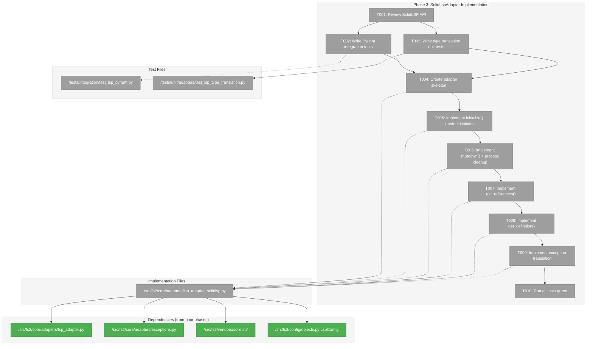
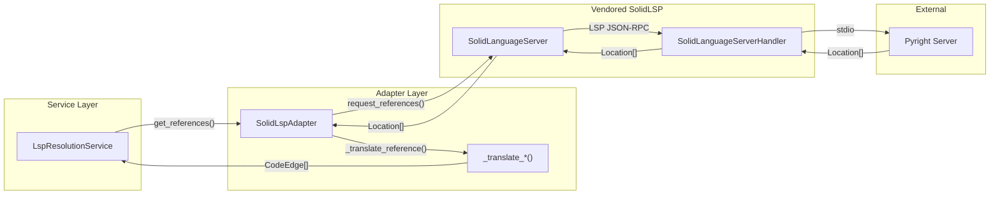
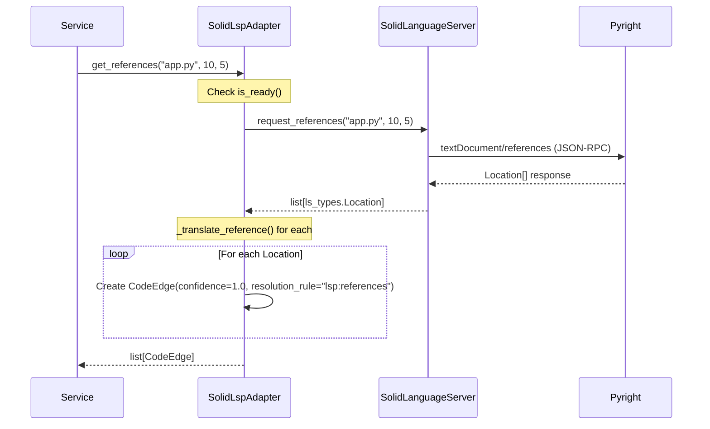

# Phase 3: SolidLspAdapter Implementation – Tasks & Alignment Brief

**Spec**: [../lsp-integration-spec.md](../lsp-integration-spec.md)
**Plan**: [../lsp-integration-plan.md](../lsp-integration-plan.md)
**Date**: 2026-01-16

---

## Executive Briefing

### Purpose
This phase implements `SolidLspAdapter`, the concrete adapter wrapping the vendored SolidLSP library. It bridges the gap between fs2's clean domain model (`CodeEdge`) and SolidLSP's LSP-specific types, enabling cross-file reference resolution with full type inference.

### What We're Building
A `SolidLspAdapter` class in `src/fs2/core/adapters/lsp_adapter_solidlsp.py` that:
- Implements the `LspAdapter` ABC created in Phase 2
- Wraps vendored SolidLSP from Phase 1 (`fs2.vendors.solidlsp`)
- Translates LSP `Location` responses to `CodeEdge` domain objects
- ~~Handles stdout isolation (Critical Discovery 01) to prevent JSON-RPC corruption~~ **DYK-1: Fail-fast pre-check instead**
- ~~Implements process tree cleanup (Critical Discovery 02) for graceful shutdown~~ **DYK-2: Delegate to vendored SolidLSP**

### User Value
Agents can now query "what calls this function?" and receive precise, type-aware answers. Unlike Tree-sitter heuristics (0.3-0.5 confidence), LSP provides definitive answers (1.0 confidence) because it understands the full type graph.

### Example
**Query**: `adapter.get_references("lib.py", line=1, column=5)`  
**Before (Tree-sitter)**: `[CodeEdge(confidence=0.3, ...)]` — might miss indirect calls  
**After (LSP)**: `[CodeEdge(confidence=1.0, resolution_rule="lsp:references", ...)]` — all references found

---

## Objectives & Scope

### Objective
Implement `SolidLspAdapter` wrapping vendored SolidLSP with Pyright integration, satisfying acceptance criteria AC05, AC08-AC10, AC17.

### Behavior Checklist (from plan)
- [ ] AC05: `SolidLspAdapter` wraps SolidLSP with exception translation
- [ ] AC08: LSP `textDocument/references` → `CodeEdge` with `EdgeType.REFERENCES`
- [ ] AC09: LSP `textDocument/definition` → `CodeEdge` with appropriate EdgeType
- [ ] AC10: All LSP-derived edges have `confidence=1.0` and `resolution_rule="lsp:{method}"`
- [ ] AC17: Integration tests pass with real Pyright server

### Goals

- ✅ Create `SolidLspAdapter` inheriting `LspAdapter` ABC
- ~~✅ Implement stdout isolation for SolidLSP imports (Critical Discovery 01)~~ **DYK-1: Pre-check instead**
- ~~✅ Implement process tree cleanup with psutil (Critical Discovery 02)~~ **DYK-2: Delegate**
- ✅ Translate `ls_types.Location` → `CodeEdge` at adapter boundary
- ✅ Handle all error cases with domain exceptions
- ✅ Integration tests with real Pyright server

### Non-Goals (Scope Boundaries)

- ❌ Multi-language support (Phase 4) — this phase focuses on Python/Pyright only
- ❌ TypeScript/Go/C# integration tests (Phase 4)
- ❌ Pipeline integration (Phase 8)
- ❌ Memory monitoring optimization (Discovery 14 — optional, defer)
- ❌ Parallel server startup (Discovery 13 — Phase 4 optimization)
- ❌ Caching of LSP responses (not needed yet)

---

## Architecture Map

### Component Diagram
<!-- Status: grey=pending, orange=in-progress, green=completed, red=blocked -->
<!-- Updated by plan-6 during implementation -->



### Task-to-Component Mapping

<!-- Status: ⬜ Pending | 🟧 In Progress | ✅ Complete | 🔴 Blocked -->

| Task | Component(s) | Files | Status | Comment |
|------|-------------|-------|--------|---------|
| T001 | SolidLSP API Review | /src/fs2/vendors/solidlsp/ls.py | ⬜ Pending | Understand request_definition, request_references signatures |
| T002 | Pyright Integration Tests | /tests/integration/test_lsp_pyright.py | ⬜ Pending | TDD RED: real Pyright server |
| T003 | Type Translation Tests | /tests/unit/adapters/test_lsp_type_translation.py | ⬜ Pending | TDD RED: Location → CodeEdge |
| T004 | Adapter Skeleton | /src/fs2/core/adapters/lsp_adapter_solidlsp.py | ⬜ Pending | Inherits LspAdapter, receives ConfigurationService |
| T005 | initialize() | /src/fs2/core/adapters/lsp_adapter_solidlsp.py | ⬜ Pending | Per Critical Discovery 01: stdout isolation |
| T006 | shutdown() | /src/fs2/core/adapters/lsp_adapter_solidlsp.py | ⬜ Pending | Per Critical Discovery 02: process tree cleanup |
| T007 | get_references() | /src/fs2/core/adapters/lsp_adapter_solidlsp.py | ⬜ Pending | Returns CodeEdge with confidence=1.0 |
| T008 | get_definition() | /src/fs2/core/adapters/lsp_adapter_solidlsp.py | ⬜ Pending | Returns CodeEdge with CALLS EdgeType |
| T009 | Exception Translation | /src/fs2/core/adapters/lsp_adapter_solidlsp.py | ⬜ Pending | SolidLSP exceptions → domain exceptions |
| T010 | Final Validation | All Phase 3 files | ⬜ Pending | TDD GREEN: all tests pass |

---

## Tasks

| Status | ID | Task | CS | Type | Dependencies | Absolute Path(s) | Validation | Subtasks | Notes |
|--------|------|------|-----|------|--------------|------------------|------------|----------|-------|
| [ ] | T001 | Review SolidLSP API and document key methods | 1 | Setup | – | /workspaces/flow_squared/src/fs2/vendors/solidlsp/ls.py | Key methods documented in execution log | – | Focus: SolidLanguageServer.create(), request_definition(), request_references() |
| [ ] | T002 | Write Pyright integration tests (TDD RED) | 2 | Test | T001 | /workspaces/flow_squared/tests/integration/test_lsp_pyright.py | Tests fail with ImportError (module not found) | – | Per AC17: Skip if Pyright not installed |
| [ ] | T003 | Write type translation unit tests (TDD RED) | 2 | Test | T001 | /workspaces/flow_squared/tests/unit/adapters/test_lsp_type_translation.py | Tests fail with ImportError | – | Test _translate_reference(), _translate_definition() |
| [ ] | T004 | Create SolidLspAdapter skeleton with __init__ | 2 | Core | T002, T003 | /workspaces/flow_squared/src/fs2/core/adapters/lsp_adapter_solidlsp.py | Class inherits LspAdapter, receives ConfigurationService | – | Per Discovery 06: config.require(LspConfig) internally |
| [ ] | T005 | Implement initialize() with server pre-check | 2 | Core | T004 | /workspaces/flow_squared/src/fs2/core/adapters/lsp_adapter_solidlsp.py | Server starts, is_ready() returns True, fail-fast if server missing | – | DYK-1: No stdout suppression needed; pre-check server exists before SolidLSP call |
| [ ] | T006 | Implement shutdown() delegating to SolidLSP | 1 | Core | T005 | /workspaces/flow_squared/src/fs2/core/adapters/lsp_adapter_solidlsp.py | All child processes terminated, is_ready() returns False | – | DYK-2: Vendored code has full psutil cleanup; just delegate |
| [ ] | T007 | Implement get_references() with type translation | 3 | Core | T006 | /workspaces/flow_squared/src/fs2/core/adapters/lsp_adapter_solidlsp.py | Returns CodeEdge list with confidence=1.0, resolution_rule="lsp:references" | – | Per AC08, Discovery 07; DYK-4: No extra wait; DYK-5: construct node_id → lookup in graph → create edge only if exists |
| [ ] | T008 | Implement get_definition() with type translation | 2 | Core | T007 | /workspaces/flow_squared/src/fs2/core/adapters/lsp_adapter_solidlsp.py | Returns CodeEdge with EdgeType.CALLS, resolution_rule="lsp:definition" | – | Per AC09, Discovery 07; DYK-5: node_id format from scripts/cross-files-rels-research/lib/resolver.py |
| [ ] | T009 | Implement exception translation at boundary | 2 | Core | T008 | /workspaces/flow_squared/src/fs2/core/adapters/lsp_adapter_solidlsp.py | SolidLSP errors → LspAdapterError subclasses | – | Per AC05: actionable messages |
| [ ] | T010 | Run all tests and validate quality gates | 1 | Validation | T009 | All Phase 3 files | pytest passes, ruff clean, mypy --strict clean | – | TDD GREEN |

---

## Alignment Brief

### Prior Phases Review

#### Phase 1: Vendor SolidLSP Core (COMPLETE 2026-01-16)

**Deliverables Created**:
- `/workspaces/flow_squared/src/fs2/vendors/solidlsp/` — 60 files, ~25K LOC vendored
- Key modules: `ls.py` (SolidLanguageServer), `ls_handler.py` (SolidLanguageServerHandler), `ls_config.py` (Language, LanguageServerConfig), `ls_types.py` (Position, Range, Location)
- `/workspaces/flow_squared/src/fs2/vendors/solidlsp/_stubs/` — Stub modules for serena.*, sensai.* dependencies
- `/workspaces/flow_squared/tests/unit/vendors/test_solidlsp_imports.py` — 5 import verification tests
- `/workspaces/flow_squared/THIRD_PARTY_LICENSES` — MIT attribution
- `/workspaces/flow_squared/src/fs2/vendors/solidlsp/VENDOR_VERSION` — Upstream commit b7142cb

**Dependencies Exported (used by Phase 3)**:
- `fs2.vendors.solidlsp.ls.SolidLanguageServer` — Main server class
- `fs2.vendors.solidlsp.ls_config.Language` — Language enum
- `fs2.vendors.solidlsp.ls_config.LanguageServerConfig` — Config dataclass
- `fs2.vendors.solidlsp.ls_types.Location` — Location TypedDict with uri, range, absolutePath, relativePath
- `fs2.vendors.solidlsp.ls_types.Position`, `Range` — Position types

**Lessons Learned**:
- Stubs need functional implementations (MatchedConsecutiveLines has real logic)
- Class names differ from expected: `SolidLanguageServerHandler` not `LspHandler`
- Constructor uses `code_language=` not `language=` in LanguageServerConfig
- Import transform needed two sed passes (missed `from solidlsp import` pattern initially)

**Technical Discoveries**:
- 309 import statements required transformation
- psutil + overrides dependencies added to pyproject.toml
- Lint exclusion added for vendors/* in pyproject.toml

**Test Infrastructure**:
- `TestSolidLspVendorImports` with 5 tests verifying imports work

#### Phase 2: LspAdapter ABC and Exceptions (COMPLETE 2026-01-16)

**Deliverables Created**:
- `/workspaces/flow_squared/src/fs2/core/adapters/lsp_adapter.py` — LspAdapter ABC (~160 lines)
- `/workspaces/flow_squared/src/fs2/core/adapters/lsp_adapter_fake.py` — FakeLspAdapter test double (~220 lines)
- `/workspaces/flow_squared/src/fs2/core/adapters/exceptions.py` — Added 5 LSP exceptions (~150 lines)
- `/workspaces/flow_squared/src/fs2/config/objects.py` — Added LspConfig class
- `/workspaces/flow_squared/tests/unit/adapters/test_lsp_adapter.py` — 7 ABC contract tests
- `/workspaces/flow_squared/tests/unit/adapters/test_lsp_adapter_fake.py` — 8 FakeLspAdapter tests

**Dependencies Exported (used by Phase 3)**:
- `LspAdapter` ABC — inherit from this
- `LspAdapterError`, `LspServerNotFoundError`, `LspServerCrashError`, `LspTimeoutError`, `LspInitializationError` — raise on failures
- `LspConfig` — access via `config.require(LspConfig)`

**LspAdapter ABC Signatures**:
```python
class LspAdapter(ABC):
    @abstractmethod
    def __init__(self, config: "ConfigurationService") -> None: ...
    @abstractmethod
    def initialize(self, language: str, project_root: Path) -> None: ...
    @abstractmethod
    def shutdown(self) -> None: ...
    @abstractmethod
    def get_references(self, file_path: str, line: int, column: int) -> list[CodeEdge]: ...
    @abstractmethod
    def get_definition(self, file_path: str, line: int, column: int) -> list[CodeEdge]: ...
    @abstractmethod
    def is_ready(self) -> bool: ...
```

**Lessons Learned**:
- Method-specific response setters (DYK-1): use `set_definition_response()`, `set_references_response()` not single `set_response()`
- Minimal LspConfig (DYK-4): language and project_root are `initialize()` params, not config
- ABC uses `...` body not `pass`
- TYPE_CHECKING guard required for ConfigurationService import

**Architectural Decisions**:
- Confidence=1.0 invariant: LSP provides definitive answers
- `resolution_rule` identification: Edges tagged with `"lsp:references"` or `"lsp:definition"`

**Test Infrastructure**:
- 15 tests total (7 ABC contract + 8 FakeLspAdapter)
- All use `FakeConfigurationService` from `fs2.config.service`

### Critical Findings Affecting This Phase

| Finding | Impact | Constraints | Addressed By |
|---------|--------|-------------|--------------|
| **Critical Discovery 01: Stdout Isolation** | ~~Critical~~ **Resolved** | ~~All SolidLSP imports must suppress stdout~~ **DYK-1: Fail-fast if server missing; no suppression needed** | T005 |
| **Critical Discovery 02: Process Tree Cleanup** | ~~Critical~~ **Resolved** | ~~Use psutil for recursive child termination~~ **DYK-2: Vendored SolidLSP already implements full cleanup; delegate** | T006 |
| **Critical Discovery 03: Graceful Degradation** | Critical | LSP errors must not crash scan | T009 |
| **Discovery 05: Naming Convention** | High | File named `lsp_adapter_solidlsp.py` | T004 |
| **Discovery 06: ConfigurationService Injection** | High | Constructor receives ConfigurationService, calls require() internally | T004 |
| **Discovery 07: CodeEdge Mapping** | ~~High~~ **Resolved** | ~~references→REFERENCES (1.0), definition→CALLS (1.0)~~ **DYK-3: CALLS confirmed for definition; add `resolution_rule="lsp:definition"` to distinguish** | T007, T008 |
| **Discovery 10: Initialization Wait** | ~~Medium~~ **Resolved** | ~~Some servers need indexing time before cross-file refs~~ **DYK-4: SolidLSP has internal `_has_waited_for_cross_file_references` flag; no adapter-level wait needed** | T007 |
| **Discovery 11: Node ID Correlation** | **New (DYK-5)** | **LSP must construct node_ids matching tree-sitter format: `{category}:{rel_path}:{qualified_name}`. Lookup in graph before creating edge. Use patterns from `scripts/cross-files-rels-research/lib/resolver.py`** | T007, T008 |

### Invariants & Guardrails

- All LSP edges MUST have `confidence=1.0`
- All edges MUST set `resolution_rule` with `lsp:` prefix
- `initialize()` and `shutdown()` MUST be idempotent
- No SolidLSP types may leak through the adapter boundary (only CodeEdge returned)
- Exception messages MUST be actionable (include fix instructions)

### Inputs to Read

| File | Purpose |
|------|---------|
| `/workspaces/flow_squared/src/fs2/core/adapters/lsp_adapter.py` | ABC to implement |
| `/workspaces/flow_squared/src/fs2/core/adapters/exceptions.py` | Exception classes to raise |
| `/workspaces/flow_squared/src/fs2/vendors/solidlsp/ls.py` | SolidLanguageServer API |
| `/workspaces/flow_squared/src/fs2/vendors/solidlsp/ls_types.py` | Location, Position, Range types |
| `/workspaces/flow_squared/src/fs2/vendors/solidlsp/ls_config.py` | Language enum, LanguageServerConfig |
| `/workspaces/flow_squared/src/fs2/core/models/code_edge.py` | CodeEdge domain model |
| `/workspaces/flow_squared/src/fs2/core/models/edge_type.py` | EdgeType enum |

### Visual Alignment Aids

#### System Flow Diagram



#### Sequence Diagram: get_references() Flow



### Test Plan (Full TDD)

#### Integration Tests (test_lsp_pyright.py)

| Test | Purpose | Fixture | Expected |
|------|---------|---------|----------|
| `test_given_python_project_when_get_references_then_returns_code_edges` | AC17 | python_project (tmp_path) | CodeEdge list with confidence=1.0 |
| `test_given_python_project_when_get_definition_then_returns_code_edge` | AC09 | python_project | CodeEdge with EdgeType.CALLS |
| `test_given_uninitialized_adapter_when_get_references_then_raises_error` | Error handling | config_service | RuntimeError |
| `test_given_adapter_when_shutdown_then_is_ready_false` | Lifecycle | config_service | is_ready() returns False |

#### Unit Tests (test_lsp_type_translation.py)

| Test | Purpose | Input | Expected |
|------|---------|-------|----------|
| `test_given_lsp_location_when_translating_reference_then_creates_code_edge` | AC08 | Location dict | CodeEdge(edge_type=REFERENCES) |
| `test_given_lsp_location_when_translating_definition_then_creates_code_edge` | AC09 | Location dict | CodeEdge(edge_type=CALLS) |
| `test_given_translation_when_creating_edge_then_confidence_is_1_0` | AC10 | Any Location | confidence=1.0 |
| `test_given_translation_when_creating_edge_then_resolution_rule_has_prefix` | AC10 | Any Location | resolution_rule starts with "lsp:" |
| `test_given_empty_response_when_translating_then_returns_empty_list` | Edge case | [] | [] |

### Step-by-Step Implementation Outline

1. **T001**: Read `ls.py` lines 620-750. Document `request_definition()`, `request_references()` signatures. Note `SolidLanguageServer.create()` factory method.

2. **T002**: Create integration test file with `@pytest.mark.skipif(not shutil.which('pyright'))`. Create `python_project` fixture. Write tests that will fail with ImportError.

3. **T003**: Create unit test file. Write tests for `_translate_reference()` and `_translate_definition()` helper functions. Tests fail with ImportError.

4. **T004**: Create `lsp_adapter_solidlsp.py`. Inherit `LspAdapter`. Implement `__init__()` with `config.require(LspConfig)`. Stub all abstract methods with `raise NotImplementedError`.

5. **T005**: Implement `initialize()`:
   - Pre-check: verify server binary exists (e.g., `shutil.which('pyright')`)
   - If missing: raise `LspServerNotFoundError` with platform-specific install command (fail-fast, no stdout pollution)
   - Create `LanguageServerConfig(code_language=Language(language))`
   - Call `SolidLanguageServer.create(config, project_root, timeout)`
   - Set `_is_ready = True`
   - Note: No stdout suppression needed per DYK-1 decision

6. **T006**: Implement `shutdown()`:
   - Guard: if not ready, return immediately (idempotent)
   - Call `self._server.shutdown()` — vendored code handles psutil cleanup (DYK-2)
   - Set `_is_ready = False`

7. **T007**: Implement `get_references()`:
   - Guard: if not ready, raise RuntimeError
   - Call `_server.request_references(file_path, line, column)`
   - Translate each `Location` to `CodeEdge` with `_translate_reference()`
   - Return list

8. **T008**: Implement `get_definition()`:
   - Similar to get_references but use `request_definition()`
   - Use `EdgeType.CALLS` and `resolution_rule="lsp:definition"`

9. **T009**: Wrap all SolidLSP calls in try/except:
   - `SolidLSPException` → `LspInitializationError` or `LspServerCrashError`
   - `TimeoutError` → `LspTimeoutError`
   - `FileNotFoundError` → `LspServerNotFoundError` with platform-specific install

10. **T010**: Run full test suite. Verify ruff clean, mypy --strict clean.

### Commands to Run

```bash
# Run unit tests for type translation
pytest tests/unit/adapters/test_lsp_type_translation.py -v

# Run Pyright integration tests (requires Pyright installed)
pytest tests/integration/test_lsp_pyright.py -v

# Run all Phase 3 tests
pytest tests/unit/adapters/test_lsp_type_translation.py tests/integration/test_lsp_pyright.py -v

# Verify Pyright available
which pyright-langserver && echo "✓ Pyright available"

# Lint SolidLspAdapter implementation
ruff check src/fs2/core/adapters/lsp_adapter_solidlsp.py

# Type check
mypy src/fs2/core/adapters/lsp_adapter_solidlsp.py --strict

# Run full test suite (no regressions)
pytest tests/unit/ -v
```

### Risks/Unknowns

| Risk | Severity | Likelihood | Mitigation |
|------|----------|------------|------------|
| Pyright not available in test environment | High | Low | Phase 0 verified; skip if missing |
| SolidLSP API differs from Phase 0b validation | Medium | Low | T001 reviews API first |
| Stdout isolation breaks logging | Medium | Medium | Use stderr for all logging |
| Process tree cleanup incomplete | Medium | Low | Two-tier shutdown (terminate then kill) |

### Ready Check

- [ ] Prior phases reviewed and understood
- [ ] Critical findings mapped to tasks
- [ ] SolidLSP API understood (request_definition, request_references)
- [ ] Test plan covers all acceptance criteria
- [ ] Commands validated to work in environment
- [ ] ADR constraints mapped to tasks — N/A (no ADRs)

**GO / NO-GO**: Awaiting human approval

---

## Phase Footnote Stubs

_Populated by plan-6a-update-progress after implementation._

| Footnote | Node IDs | Description |
|----------|----------|-------------|
| | | |

---

## Evidence Artifacts

Implementation will create:
- `/workspaces/flow_squared/docs/plans/025-lsp-research/tasks/phase-3-solidlspadapter-implementation/execution.log.md` — Full execution history
- Test output captured in execution log

---

## Discoveries & Learnings

_Populated during implementation by plan-6. Log anything of interest to your future self._

| Date | Task | Type | Discovery | Resolution | References |
|------|------|------|-----------|------------|------------|
| | | | | | |

**Types**: `gotcha` | `research-needed` | `unexpected-behavior` | `workaround` | `decision` | `debt` | `insight`

**What to log**:
- Things that didn't work as expected
- External research that was required
- Implementation troubles and how they were resolved
- Gotchas and edge cases discovered
- Decisions made during implementation
- Technical debt introduced (and why)
- Insights that future phases should know about

_See also: `execution.log.md` for detailed narrative._

---

## Directory Layout

```
docs/plans/025-lsp-research/
├── lsp-integration-spec.md
├── lsp-integration-plan.md
└── tasks/
    ├── phase-0-environment-preparation/
    │   └── tasks.md
    ├── phase-0b-multi-project-research/
    │   └── tasks.md
    ├── phase-1-vendor-solidlsp-core/
    │   ├── tasks.md
    │   └── execution.log.md
    ├── phase-2-lsp-adapter-abc/
    │   ├── tasks.md
    │   └── execution.log.md
    └── phase-3-solidlspadapter-implementation/
        ├── tasks.md              # ← This file
        └── execution.log.md      # ← Created by /plan-6
```

---

## Critical Insights Discussion (DYK Session)

**Session**: 2026-01-16 23:17 UTC
**Context**: Phase 3 SolidLspAdapter Implementation Tasks
**Analyst**: AI Clarity Agent
**Reviewer**: Development Team
**Format**: Water Cooler Conversation (5 Critical Insights)

### Insight 1: Stdout Isolation Not Needed (DYK-1)

**Did you know**: SolidLSP's `print()` statements are in installation code paths (nixd_ls.py, lua_ls.py), not import-time. Phase 0 pre-installed all LSP servers, so those paths never execute.

**Implications**:
- stdout isolation was planned for a non-existent problem
- fs2 uses MCPLoggingConfig to route logging to stderr (logging-routing, not stream suppression)
- No contextlib.redirect_stdout usage exists in fs2

**Options Considered**:
- Option A: Fail-fast if server missing — pre-check with `shutil.which()`
- Option B: Keep stdout isolation — suppress anyway for safety
- Option C: Remove isolation entirely — trust Phase 0 installed everything

**AI Recommendation**: Option A - Fail Fast
- Reasoning: Pre-check server exists before SolidLSP call; raise `LspServerNotFoundError` if missing

**Decision**: Option A — Fail-fast pre-check instead of stdout suppression

**Action Items**:
- [x] Updated T005: "stdout isolation" → "server pre-check" (CS-3 → CS-2)

**Affects**: T005

---

### Insight 2: Process Cleanup Already Implemented (DYK-2)

**Did you know**: Vendored SolidLSP at `ls_handler.py:267-297` already has full `_signal_process_tree()` implementation using `psutil.Process.children(recursive=True)`.

**Implications**:
- Three-tier shutdown already exists: LSP request → terminate → kill
- No need to write custom psutil logic
- Just call `self._server.shutdown()` to delegate

**Options Considered**:
- Option A: Delegate to SolidLSP shutdown — just call the existing method
- Option B: Wrap with additional cleanup — belt-and-suspenders
- Option C: Implement from scratch — ignore vendored implementation

**AI Recommendation**: Option A - Delegate
- Reasoning: Vendored code is battle-tested; duplicating adds maintenance burden

**Decision**: Option A — Delegate to vendored SolidLSP cleanup

**Action Items**:
- [x] Updated T006: "process tree cleanup" → "delegating to SolidLSP" (CS-2 → CS-1)

**Affects**: T006

---

### Insight 3: EdgeType.CALLS Mapping is Intentional (DYK-3)

**Did you know**: Using `textDocument/definition` returns WHERE the target is defined, but the semantic RELATIONSHIP from the call-site is a "call" — not a "reference".

**Implications**:
- CALLS is semantically correct for call-site → definition
- REFERENCES is for text-pattern matches (all usages)
- `resolution_rule="lsp:definition"` distinguishes from text-based REFERENCES

**Options Considered**:
- Option A: Keep CALLS per plan — add resolution_rule to distinguish
- Option B: Use REFERENCES — technically LSP returns "where defined"
- Option C: New edge type — e.g., EdgeType.RESOLVED_TO

**AI Recommendation**: Option A - Keep CALLS
- Reasoning: Semantic meaning is "call", resolution_rule clarifies provenance

**Decision**: Option A — CALLS with `resolution_rule="lsp:definition"`

**Action Items**:
- [x] Updated Discovery 07 in Critical Findings table

**Affects**: T007, T008

---

### Insight 4: Cross-File Wait Already Handled (DYK-4)

**Did you know**: SolidLSP has internal `_has_waited_for_cross_file_references` flag that guards a one-time wait before cross-file queries.

**Implications**:
- Adding adapter-level delays would cause double-wait
- SolidLSP handles indexing delay internally
- `LspConfig.timeout_seconds` (default 30s) handles overall timeout

**Options Considered**:
- Option A: Trust SolidLSP internal wait — no adapter-level delay
- Option B: Add configurable adapter-level wait — flexibility but risks 2× delay
- Option C: Probe-based readiness — complex, unnecessary

**AI Recommendation**: Option A - Trust SolidLSP
- Reasoning: Internal wait mechanism already exists; our timeout config handles edge cases

**Decision**: Option A — Trust SolidLSP internal wait

**Action Items**:
- [x] Updated Discovery 10 as Resolved
- [x] Updated T007 notes

**Affects**: T007

---

### Insight 5: Node ID Correlation is Critical (DYK-5)

**Did you know**: LSP locations must be translated to fully-qualified node_ids matching tree-sitter's format (`{category}:{rel_path}:{qualified_name}`) to create edges between existing nodes.

**Implications**:
- LSP should NEVER create nodes — only edges between tree-sitter nodes
- Must construct node_id, lookup in graph, create edge only if both exist
- Existing research in `scripts/cross-files-rels-research/lib/resolver.py` has patterns
- Supports method→method, class→method, markdown→code references

**Options Considered**:
- Option A: File-level edges only — simple `file:{path}` for both
- Option B: Leverage existing research — use resolver.py patterns + graph lookup
- Option C: Full LSP symbol resolution — extra documentSymbol call per target

**AI Recommendation**: Option B - Leverage Existing Research
- Reasoning: Research already done; graph lookup ensures correlation; graceful degradation if node not found

**Decision**: Option B — Construct node_id → lookup in graph → create edge only if exists

**Action Items**:
- [x] Added Discovery 11: Node ID Correlation to Critical Findings table
- [x] Updated T007 and T008 notes with DYK-5 reference

**Affects**: T007, T008

---

## Session Summary

**Insights Surfaced**: 5 critical insights identified and discussed
**Decisions Made**: 5 decisions reached through collaborative discussion
**Action Items Created**: 8 task updates completed during session
**CS Reduction**: 3 points total (T005: CS-3→CS-2, T006: CS-2→CS-1)

**Areas Updated**:
- T005, T006, T007, T008 task descriptions and notes
- Critical Findings table (5 entries resolved/added)
- Executive Briefing (removed obsolete goals)

**Shared Understanding Achieved**: ✓

**Confidence Level**: High — Key complexities identified and simplified. Existing research leveraged.

**Next Steps**:
- Proceed to `/plan-6-implement-phase --phase "Phase 3"` with clarified requirements
- Implementation will be simpler: delegation over reimplementation, lookup over creation

**Notes**:
- Total session simplified Phase 3 significantly
- Node ID correlation pattern is the most impactful insight — ensures LSP edges connect to tree-sitter nodes
- Research at `scripts/cross-files-rels-research/` should be referenced during implementation
