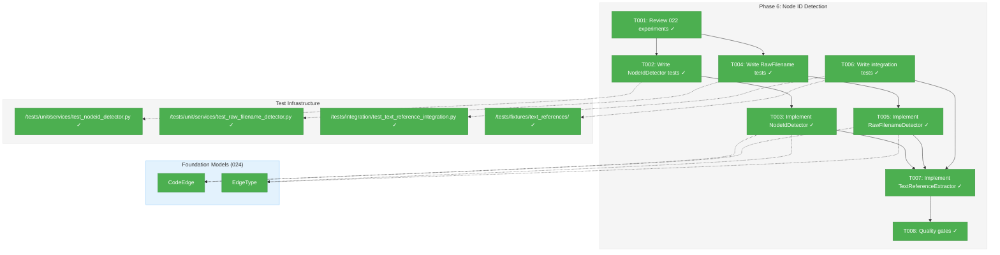
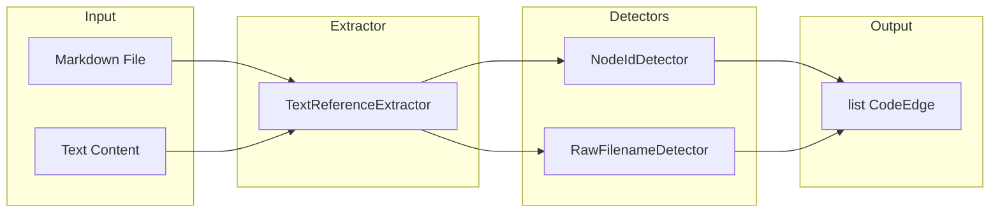
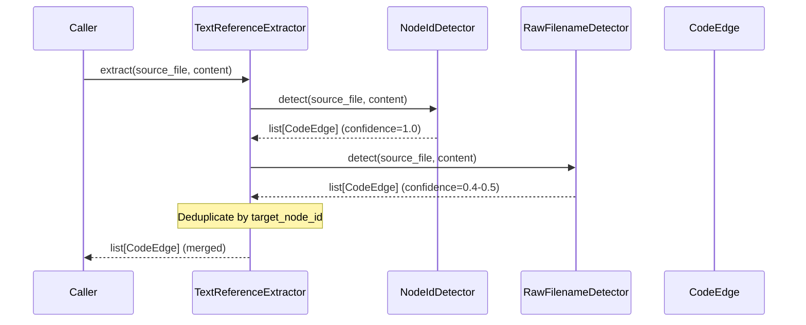

# Phase 6: Node ID and Filename Detection – Tasks & Alignment Brief

**Spec**: [../lsp-integration-spec.md](../lsp-integration-spec.md)
**Plan**: [../lsp-integration-plan.md](../lsp-integration-plan.md)
**Date**: 2026-01-20

---

## Executive Briefing

### Purpose
This phase implements detection of explicit fs2 node_id patterns (e.g., `callable:src/calc.py:Calculator.add`) and raw filenames (e.g., `auth_handler.py`) in text files. This enables agents to discover cross-file relationships documented in markdown, READMEs, and execution logs without requiring LSP or Tree-sitter parsing.

### What We're Building
Two detectors for text-based relationship extraction:
1. **NodeIdDetector**: Finds explicit node_id patterns (confidence 1.0)
2. **RawFilenameDetector**: Finds raw filename mentions (confidence 0.4-0.5)

Both output `CodeEdge` instances using the foundation models from 024 Phase 1.

### User Value
When agents query "what references this function?", they get results from:
- Code imports (Tree-sitter) — already implemented
- Type-aware calls (LSP) — Phases 2-4 
- **Documentation mentions (this phase)** — READMEs, execution logs, plan files

### Example
**Input** (markdown file):
```markdown
See `callable:src/calc.py:Calculator.add` for the implementation.
Check `auth_handler.py` for authentication logic.
```

**Output** (CodeEdge instances):
```python
CodeEdge(
    source_node_id="file:README.md",
    target_node_id="callable:src/calc.py:Calculator.add",
    edge_type=EdgeType.REFERENCES,
    confidence=1.0,
    source_line=1,
    resolution_rule="nodeid:explicit"
)
CodeEdge(
    source_node_id="file:README.md",
    target_node_id="file:auth_handler.py",
    edge_type=EdgeType.DOCUMENTS,
    confidence=0.5,  # backtick quoted
    source_line=2,
    resolution_rule="filename:backtick"
)
```

---

## Objectives & Scope

### Objective
Implement node_id and filename detection as specified in plan § Phase 6, using patterns validated in 022 experiments (`scripts/cross-files-rels-research/experiments/01_nodeid_detection.py`).

### Behavior Checklist
- [ ] Detect patterns: `file:`, `callable:`, `type:`, `class:`, `method:` prefixes
- [ ] Confidence 1.0 for explicit node_id patterns
- [ ] Confidence 0.5 for backtick-quoted filenames
- [ ] Confidence 0.4 for bare inline filenames
- [ ] Return `CodeEdge` instances (not custom types)
- [ ] Skip binary files and non-text content

### Goals

- ✅ Port NodeIdDetector from 022 experiment (`01_nodeid_detection.py`)
- ✅ Port RawFilenameDetector from 022 experiment
- ✅ Create TextReferenceExtractor combining both detectors
- ✅ Write comprehensive TDD test suites
- ✅ Integration tests with markdown fixtures

### Non-Goals

- ❌ Symbol-level resolution (file-level node_ids only, per DYK-5)
- ❌ URL detection/filtering beyond basic heuristics
- ❌ Tree-sitter integration (pure regex/string matching)
- ❌ Performance optimization (defer to Phase 8 if needed)
- ❌ Target validation against graph (Phase 8 per Insight 5)
- ❌ Pipeline integration (Phase 8 scope)

---

## Architecture Map

### Component Diagram
<!-- Status: grey=pending, orange=in-progress, green=completed, red=blocked -->
<!-- Updated by plan-6 during implementation -->



### Task-to-Component Mapping

<!-- Status: ⬜ Pending | 🟧 In Progress | ✅ Complete | 🔴 Blocked -->

| Task | Component(s) | Files | Status | Comment |
|------|-------------|-------|--------|---------|
| T001 | Research Review | `/scripts/cross-files-rels-research/` | ✅ Complete | Understand regex patterns before porting |
| T002 | NodeIdDetector Tests | `/tests/unit/services/test_nodeid_detector.py` | ✅ Complete | TDD: write failing tests first |
| T003 | NodeIdDetector | `/src/fs2/core/services/relationship_extraction/nodeid_detector.py` | ✅ Complete | Port regex from 022, return CodeEdge |
| T004 | RawFilename Tests | `/tests/unit/services/test_raw_filename_detector.py` | ✅ Complete | TDD: write failing tests first |
| T005 | RawFilenameDetector | `/src/fs2/core/services/relationship_extraction/raw_filename_detector.py` | ✅ Complete | Port regex from 022, confidence tiers |
| T006 | Integration Tests | `/tests/integration/test_text_reference_integration.py` | ✅ Complete | Markdown fixtures with known patterns |
| T007 | TextReferenceExtractor | `/src/fs2/core/services/relationship_extraction/text_reference_extractor.py` | ✅ Complete | Combines both detectors |
| T008 | Quality Gates | All Phase 6 files | ⬜ Pending | ruff, mypy --strict, coverage |

---

## Tasks

| Status | ID | Task | CS | Type | Dependencies | Absolute Path(s) | Validation | Subtasks | Notes |
|--------|------|------|-----|------|--------------|------------------|------------|----------|-------|
| [x] | T001 | Review 022 experiments to understand regex patterns | 1 | Setup | – | `/workspaces/flow_squared/scripts/cross-files-rels-research/experiments/01_nodeid_detection.py`, `/workspaces/flow_squared/scripts/cross-files-rels-research/test_data/sample_nodeid.md` | Documented in brief | – | Port patterns, not reimplementing |
| [x] | T002 | Write failing tests for NodeIdDetector | 2 | Test | T001 | `/workspaces/flow_squared/tests/unit/services/test_nodeid_detector.py` | Tests fail with ImportError/AttributeError | – | Cover: file:, callable:, class:, method:, type: |
| [x] | T003 | Implement NodeIdDetector class | 2 | Core | T002 | `/workspaces/flow_squared/src/fs2/core/services/relationship_extraction/nodeid_detector.py`, `/workspaces/flow_squared/src/fs2/core/services/relationship_extraction/__init__.py` | All T002 tests pass | – | Return list[CodeEdge], confidence=1.0 |
| [x] | T004 | Write failing tests for RawFilenameDetector | 2 | Test | T001 | `/workspaces/flow_squared/tests/unit/services/test_raw_filename_detector.py` | Tests fail with ImportError/AttributeError | – | Cover: backtick (0.5), bare (0.4), extensions, **URL filtering** (DYK-6) |
| [x] | T005 | Implement RawFilenameDetector class | 2 | Core | T004 | `/workspaces/flow_squared/src/fs2/core/services/relationship_extraction/raw_filename_detector.py` | All T004 tests pass | – | EdgeType.DOCUMENTS, confidence tiers, **URL pre-filter** (DYK-6) |
| [x] | T006 | Write integration tests with markdown fixtures | 2 | Test | T003, T005 | `/workspaces/flow_squared/tests/integration/test_text_reference_integration.py`, `/workspaces/flow_squared/tests/fixtures/text_references/` | Tests fail initially | – | Use sample_nodeid.md as fixture |
| [x] | T007 | Implement TextReferenceExtractor combining detectors | 2 | Core | T003, T005, T006 | `/workspaces/flow_squared/src/fs2/core/services/relationship_extraction/text_reference_extractor.py` | All T006 tests pass | – | Dedup by (source, target, source_line) tuple to preserve all mentions (DYK-7) |
| [x] | T008 | Run quality gates: ruff, mypy --strict, coverage | 1 | QA | T007 | All Phase 6 files | ruff clean, mypy clean, coverage >80% | – | – |

---

## Alignment Brief

### Prior Phases Review

#### Phase-by-Phase Summary

**Phase 0: Environment Preparation** (COMPLETE 2026-01-14)
- LSP servers installed: Pyright 1.1.408, gopls v0.21.0, tsserver 5.1.3, .NET 10.0.102
- Verification script at `/workspaces/flow_squared/scripts/verify-lsp-servers.sh`
- Portable install scripts at `/workspaces/flow_squared/scripts/lsp_install/`
- **Relevance to Phase 6**: None direct; LSP infrastructure not used for text detection

**Phase 0b: Multi-Project Research** (COMPLETE 2026-01-15)
- Validated SolidLSP cross-file resolution for 4 languages
- "Deepest wins" project root detection algorithm
- C# MSBuild fix (DOTNET_ROOT env vars)
- TypeScript quirk: requires all files opened
- **Relevance to Phase 6**: Project root detection may be reused for relative path resolution

**Phase 1: Vendor SolidLSP Core** (COMPLETE 2026-01-16)
- Vendored ~25K LOC to `/workspaces/flow_squared/src/fs2/vendors/solidlsp/`
- Import path transformation: `solidlsp.*` → `fs2.vendors.solidlsp.*`
- Functional stubs for serena/sensai dependencies
- 5 import verification tests passing
- **Relevance to Phase 6**: None direct; SolidLSP not used for text detection

**Phase 2: LspAdapter ABC and Exceptions** (COMPLETE 2026-01-16)
- `LspAdapter` ABC with 5 methods
- `FakeLspAdapter` with call_history, method-specific setters
- Exception hierarchy: `LspAdapterError`, `LspServerNotFoundError`, `LspServerCrashError`, `LspTimeoutError`, `LspInitializationError`
- `LspConfig` in ConfigurationService
- 15 tests passing (7 ABC + 8 Fake)
- **Relevance to Phase 6**: None direct; detectors don't use LSP

**Phase 3: SolidLspAdapter Implementation** (CODE REVIEW FIXES REQUIRED)
- `SolidLspAdapter` (~500 LOC) wrapping vendored SolidLSP
- DYK-1: Pre-check server with `shutil.which()`
- DYK-2: Delegate shutdown to SolidLSP psutil cleanup
- DYK-3: `EdgeType.CALLS` for definitions, `EdgeType.REFERENCES` for references
- DYK-5: node_id format `file:{rel_path}` (file-level only)
- 4 blocking issues from code review (SEC-001, SEC-002, COR-001, COR-002)
- 31 tests passing
- **Relevance to Phase 6**: 
  - DYK-5 (node_id format) must be matched by NodeIdDetector
  - Use same `EdgeType.REFERENCES` for explicit node_ids
  - Use `EdgeType.DOCUMENTS` for raw filenames

**Phase 4: Multi-Language LSP Support** (COMPLETE 2026-01-19)
- Integration tests for gopls, TypeScript, Roslyn
- Zero per-language branching achieved
- TypeScript LSP quirk (returns import location)
- Demo script at `/workspaces/flow_squared/scripts/lsp_demo_extract.py`
- 28 integration tests (14 pass, 14 skip)
- **Relevance to Phase 6**: None direct; text detection language-agnostic

#### Cumulative Deliverables Available

| Phase | Component | Path | Available for Phase 6 |
|-------|-----------|------|----------------------|
| 024-P1 | CodeEdge | `/src/fs2/core/models/code_edge.py` | ✅ Return type |
| 024-P1 | EdgeType | `/src/fs2/core/models/edge_type.py` | ✅ REFERENCES, DOCUMENTS |
| 022 | NodeId regex | `/scripts/cross-files-rels-research/experiments/01_nodeid_detection.py` | ✅ Port patterns |
| 022 | Test fixture | `/scripts/cross-files-rels-research/test_data/sample_nodeid.md` | ✅ Reuse |
| P3 | DYK-5 | node_id format | ✅ Match format |

#### Reusable Test Infrastructure

- **Fixtures**: `/scripts/cross-files-rels-research/test_data/sample_nodeid.md` — valid node_id patterns
- **Patterns**: `/scripts/cross-files-rels-research/experiments/01_nodeid_detection.py` — validated regex
- **Model Tests**: `/tests/unit/models/test_code_edge.py`, `/tests/unit/models/test_edge_type.py`

---

### Critical Findings Affecting This Phase

**Insight 5: Node ID References Can Create Edges to Non-Existent Nodes**
- **Impact**: NodeIdDetector creates 1.0 confidence edges even if target doesn't exist
- **Decision**: Validate target exists, filter out edges with non-existent targets
- **Addressed in**: Phase 8 (pipeline integration), not this phase
- **Phase 6 action**: Just detect and return edges; validation is Phase 8 scope

**DYK-5: node_id Format (Phase 3) — CLARIFIED**
- **LSP creates**: `file:{rel_path}` only (file-level, per Phase 3 design)
- **NodeIdDetector detects**: ALL 5 patterns `(file|callable|type|class|method):path(:symbol)?`
- **Why the difference**: LSP outputs file-level nodes, but documentation/logs may reference fuller node_id formats from AST parsing, tests, or other subsystems
- **Addressed by**: T003 (port 022 regex that matches all 5 prefixes)

**DYK-6: URL False Positives (didyouknow session 2026-01-20)**
- **Problem**: 022 experiment regex matches `github.c` from `github.com` URLs
- **Impact**: ~5-10% noise rate from documentation with URLs
- **Decision**: Pre-filter URLs before filename detection
- **Addressed by**: T004 (URL test cases), T005 (URL pre-filter implementation)

**DYK-7: Deduplication Strategy (didyouknow session 2026-01-20)**
- **Problem**: Naive "dedup by target_node_id" loses multiple mentions of same file
- **Example**: `auth.py` mentioned on lines 10 and 50 → only one edge survives
- **Decision**: Dedup by `(source_node_id, target_node_id, source_line)` tuple
- **Addressed by**: T007 (TextReferenceExtractor deduplication logic)

---

### ADR Decision Constraints

No ADRs currently reference this phase.

---

### Invariants & Guardrails

1. **Confidence bounds**: 0.0 ≤ confidence ≤ 1.0 (enforced by CodeEdge.__post_init__)
2. **EdgeType usage**:
   - `EdgeType.REFERENCES` for explicit node_id patterns (confidence 1.0)
   - `EdgeType.DOCUMENTS` for raw filenames (confidence 0.4-0.5)
3. **node_id format**: Match patterns `(file|callable|type|class|method):path(:symbol)?`
4. **resolution_rule tagging**: All edges tagged with `nodeid:explicit` or `filename:{type}`

---

### Inputs to Read

| File | Purpose |
|------|---------|
| `/workspaces/flow_squared/scripts/cross-files-rels-research/experiments/01_nodeid_detection.py` | Regex patterns to port |
| `/workspaces/flow_squared/scripts/cross-files-rels-research/test_data/sample_nodeid.md` | Test fixture |
| `/workspaces/flow_squared/src/fs2/core/models/code_edge.py` | Return type |
| `/workspaces/flow_squared/src/fs2/core/models/edge_type.py` | EdgeType enum |
| `/workspaces/flow_squared/docs/plans/025-lsp-research/lsp-integration-plan.md` § Phase 6 | Task definitions |

---

### Visual Alignment Aids

#### System Flow Diagram



#### Detection Sequence



---

### Test Plan (TDD)

#### NodeIdDetector Tests (`test_nodeid_detector.py`)

| Test | Purpose | Fixture | Expected |
|------|---------|---------|----------|
| `test_given_explicit_file_nodeid_when_detect_then_confidence_1_0` | file: prefix | `file:src/app.py` | confidence=1.0, EdgeType.REFERENCES |
| `test_given_explicit_callable_nodeid_when_detect_then_returns_edge` | callable: prefix | `callable:src/calc.py:add` | target_node_id extracted |
| `test_given_explicit_class_nodeid_when_detect_then_returns_edge` | class: prefix | `class:src/models.py:User` | target_node_id extracted |
| `test_given_explicit_method_nodeid_when_detect_then_returns_edge` | method: prefix | `method:src/auth.py:Auth.login` | target_node_id extracted |
| `test_given_explicit_type_nodeid_when_detect_then_returns_edge` | type: prefix | `type:src/types.py:Config` | target_node_id extracted |
| `test_given_no_nodeid_when_detect_then_returns_empty_list` | No matches | Plain text | [] |
| `test_given_url_when_detect_then_not_matched` | URL filtering | `https://example.com` | [] |
| `test_given_multiple_nodeids_when_detect_then_returns_all` | Multiple | Two patterns | 2 edges |

#### RawFilenameDetector Tests (`test_raw_filename_detector.py`)

| Test | Purpose | Fixture | Expected |
|------|---------|---------|----------|
| `test_given_backtick_filename_when_detect_then_confidence_0_5` | Quoted | `` `auth.py` `` | confidence=0.5 |
| `test_given_bare_filename_when_detect_then_confidence_0_4` | Bare | `auth.py` | confidence=0.4 |
| `test_given_nested_path_filename_when_detect_then_extracts` | Path | `src/auth/handler.py` | file:src/auth/handler.py |
| `test_given_typescript_extension_when_detect_then_matches` | .tsx | `Component.tsx` | matches |
| `test_given_unknown_extension_when_detect_then_no_match` | .xyz | `file.xyz` | [] |
| `test_given_already_matched_nodeid_when_detect_then_skips` | Dedup | `file:auth.py` | not double-matched |
| `test_given_url_with_filename_when_detect_then_skips` | URL filter | `github.com/file.py` | [] |
| `test_given_https_url_when_detect_then_skips` | URL filter (DYK-6) | `https://example.com/repo.git` | [] |
| `test_given_domain_like_filename_when_detect_then_skips` | URL filter (DYK-6) | `github.com` → no `github.c` | [] |

#### Integration Tests (`test_text_reference_integration.py`)

| Test | Purpose | Fixture |
|------|---------|---------|
| `test_given_sample_nodeid_md_when_extract_then_finds_all_patterns` | Full fixture | sample_nodeid.md |
| `test_given_execution_log_when_extract_then_finds_references` | Real-world | execution.log.md style |
| `test_given_readme_when_extract_then_finds_filenames` | README | README.md style |

---

### Step-by-Step Implementation Outline

1. **T001**: Read `/scripts/cross-files-rels-research/experiments/01_nodeid_detection.py`
   - Note `NODE_ID_PATTERN` regex: `r'\b(file|callable|type|class|method):[\w./]+(?::[\w.]+)?\b'`
   - Note `RAW_FILENAME_PATTERN` regex for extensions
   - Note confidence tiers (1.0, 0.5, 0.4)

2. **T002**: Create `/tests/unit/services/test_nodeid_detector.py`
   - Import (will fail): `from fs2.core.services.relationship_extraction.nodeid_detector import NodeIdDetector`
   - Write 8+ test cases per Test Plan
   - Run: `pytest tests/unit/services/test_nodeid_detector.py -v` → RED

3. **T003**: Create `/src/fs2/core/services/relationship_extraction/nodeid_detector.py`
   - Create directory: `mkdir -p src/fs2/core/services/relationship_extraction`
   - Create `__init__.py` with exports
   - Implement `NodeIdDetector.detect(source_file: str, content: str) -> list[CodeEdge]`
   - Run: `pytest tests/unit/services/test_nodeid_detector.py -v` → GREEN

4. **T004**: Create `/tests/unit/services/test_raw_filename_detector.py`
   - Similar structure to T002
   - Run: `pytest tests/unit/services/test_raw_filename_detector.py -v` → RED

5. **T005**: Create `/src/fs2/core/services/relationship_extraction/raw_filename_detector.py`
   - Implement `RawFilenameDetector.detect(source_file: str, content: str) -> list[CodeEdge]`
   - Run: `pytest tests/unit/services/test_raw_filename_detector.py -v` → GREEN

6. **T006**: Create integration tests and fixtures
   - Copy `sample_nodeid.md` to `/tests/fixtures/text_references/`
   - Create `/tests/integration/test_text_reference_integration.py`
   - Run: → RED

7. **T007**: Create `/src/fs2/core/services/relationship_extraction/text_reference_extractor.py`
   - Combine both detectors
   - Deduplicate by target_node_id (explicit node_ids take precedence)
   - Run: → GREEN

8. **T008**: Quality gates
   - `ruff check src/fs2/core/services/relationship_extraction/`
   - `mypy src/fs2/core/services/relationship_extraction/ --strict`
   - `pytest --cov=src/fs2/core/services/relationship_extraction --cov-report=term-missing`

---

### Commands to Run

```bash
# Create directory structure
mkdir -p /workspaces/flow_squared/src/fs2/core/services/relationship_extraction
mkdir -p /workspaces/flow_squared/tests/fixtures/text_references

# Copy fixture
cp /workspaces/flow_squared/scripts/cross-files-rels-research/test_data/sample_nodeid.md \
   /workspaces/flow_squared/tests/fixtures/text_references/

# Run unit tests (Phase 6)
pytest tests/unit/services/test_nodeid_detector.py -v
pytest tests/unit/services/test_raw_filename_detector.py -v

# Run integration tests
pytest tests/integration/test_text_reference_integration.py -v

# Run all Phase 6 tests
pytest tests/unit/services/test_nodeid*.py tests/unit/services/test_raw_filename*.py tests/integration/test_text_reference*.py -v

# Lint
ruff check src/fs2/core/services/relationship_extraction/

# Type check
mypy src/fs2/core/services/relationship_extraction/ --strict

# Coverage
pytest tests/unit/services/test_nodeid*.py tests/unit/services/test_raw_filename*.py --cov=src/fs2/core/services/relationship_extraction --cov-report=term-missing
```

---

### Risks/Unknowns

| Risk | Severity | Likelihood | Mitigation |
|------|----------|------------|------------|
| False positives from raw filename detection | Low | High | Use low confidence (0.4-0.5) to signal uncertainty |
| Node ID pattern conflicts with URLs | Low | Low | Require exact pattern match with word boundaries |
| Performance on large markdown files | Low | Low | Defer optimization to Phase 8 if needed |
| Regex complexity | Low | Low | Port validated patterns from 022, don't reinvent |

---

### Ready Check

- [ ] 022 experiment patterns reviewed and documented
- [ ] CodeEdge and EdgeType models understood
- [ ] Test file structure planned
- [ ] Implementation directory structure planned
- [ ] DYK-5 node_id format understood
- [ ] ADR constraints mapped to tasks (N/A - no ADRs)
- [ ] Human GO received

**Awaiting explicit GO/NO-GO before implementation.**

---

## Phase Footnote Stubs

| Footnote | Task | Description | Node IDs |
|----------|------|-------------|----------|
| | | | |

_Populated by plan-6 during implementation._

---

## Evidence Artifacts

- **Execution log**: `/workspaces/flow_squared/docs/plans/025-lsp-research/tasks/phase-6-node-id-detection/execution.log.md` ✅
- **Test results**: 35/35 tests passing (31 unit + 4 integration)
- **Coverage report**: 99% (73/74 statements covered)
- **Quality gates**: ruff ✅, mypy --strict ✅, coverage ✅

---

## Discoveries & Learnings

_Populated during implementation by plan-6. Log anything of interest to your future self._

| Date | Task | Type | Discovery | Resolution | References |
|------|------|------|-----------|------------|------------|
| 2026-01-20 | T005 | gotcha | Regex alternation matches shortest first - "Component.tsx" matched as "Component.ts" | Ordered longer extensions (tsx, jsx, hpp) before shorter ones (ts, js, cpp) in pattern | execution.log.md#task-t005 |

**Types**: `gotcha` | `research-needed` | `unexpected-behavior` | `workaround` | `decision` | `debt` | `insight`

**What to log**:
- Things that didn't work as expected
- External research that was required
- Implementation troubles and how they were resolved
- Gotchas and edge cases discovered
- Decisions made during implementation
- Technical debt introduced (and why)
- Insights that future phases should know about

_See also: `execution.log.md` for detailed narrative._

---

## Directory Layout

```
docs/plans/025-lsp-research/
├── lsp-integration-plan.md
├── lsp-integration-spec.md
└── tasks/
    └── phase-6-node-id-detection/
        ├── tasks.md              # This file
        └── execution.log.md      # Created by plan-6
```

**Implementation files created by this phase:**
```
src/fs2/core/services/relationship_extraction/
├── __init__.py
├── nodeid_detector.py
├── raw_filename_detector.py
└── text_reference_extractor.py

tests/unit/services/
├── test_nodeid_detector.py
└── test_raw_filename_detector.py

tests/integration/
└── test_text_reference_integration.py

tests/fixtures/text_references/
└── sample_nodeid.md
```

---

## Critical Insights Discussion

**Session**: 2026-01-20 08:30 UTC
**Context**: Phase 6 Node ID Detection Tasks & Alignment Brief
**Analyst**: AI Clarity Agent
**Reviewer**: Development Team
**Format**: Water Cooler Conversation (5 Critical Insights)

### Insight 1: URL False Positives Will Contaminate Your Graph

**Did you know**: The 022 experiment regex has a confirmed bug that matches `github.c` from URLs like `https://github.com/repo`.

**Implications**:
- ~5-10% noise rate in documentation-heavy projects
- False edges created to non-existent files
- Agent queries return garbage results

**Options Considered**:
- Option A: Pre-Filter URLs Before Filename Detection - Simple URL regex check before matching
- Option B: Negative Lookahead in Filename Regex - Complex regex with TLD exclusions
- Option C: Accept False Positives, Let Phase 8 Validate - Defer to target validation

**AI Recommendation**: Option A - Pre-Filter URLs
- Reasoning: Simple fix (~10 lines), proven problem from 022 evidence, clear separation of concerns

**Discussion Summary**: Accepted without debate. URL filtering added to T004 and T005.

**Decision**: Pre-filter URLs before filename detection

**Action Items**:
- [x] Add DYK-6 documenting the issue and decision
- [x] Add URL filtering to T005 notes
- [x] Add URL test cases to T004 notes

**Affects**: T004, T005

---

### Insight 2: DYK-5 Note Is Misleading About node_id Format

**Did you know**: The dossier claims "node_id format `file:{rel_path}` (file-level only)" but the regex must match all 5 prefixes: file, callable, class, method, type.

**Implications**:
- DYK-5 was Phase 3 LSP-specific (what LSP *creates*)
- Phase 6 must *detect* all 5 patterns from documentation
- Potential confusion during implementation

**Options Considered**:
- Option A: Clarify DYK-5 in the Dossier - Explain creation vs detection
- Option B: Restrict Detection to file: Only - Simpler but wrong
- Option C: Leave As-Is - Trust implementer

**AI Recommendation**: Option A - Clarify DYK-5
- Reasoning: 30-second fix prevents future confusion

**Discussion Summary**: User chose Option C to leave as-is, trusting the implementer.

**Decision**: Leave DYK-5 as-is (Option C)

**Action Items**: None

**Affects**: None

---

### Insight 3: Services Directory Doesn't Exist Yet

**Did you know**: Phase 6 plans to create files in `/src/fs2/core/services/relationship_extraction/` but this directory doesn't exist, and there's a specific `__init__.py` pattern to follow.

**Implications**:
- T003 must create directory structure first
- `__init__.py` pattern must match existing services (search/, embedding/, smart_content/)
- Parent services/__init__.py needs updating after

**Options Considered**:
- Option A: Add Directory Setup to T003 Notes - Explicit documentation
- Option B: Create Separate T002.5 Setup Task - Over-engineering
- Option C: Assume Implementer Knows - Risky

**AI Recommendation**: Option A - Add to T003
- Reasoning: Pattern established, explicit is better

**Discussion Summary**: User chose Option C to trust the implementer.

**Decision**: Leave task as-is (Option C)

**Action Items**: None

**Affects**: None

---

### Insight 4: Deduplication Logic Is More Complex Than It Looks

**Did you know**: Naive "dedup by target_node_id" loses multiple mentions of the same file on different lines.

**Implications**:
- Same file mentioned on lines 10 and 50 → only one edge survives
- Agents can't see all places a file is mentioned
- Navigation becomes incomplete

**Options Considered**:
- Option A: Deduplicate by (source, target, source_line) Tuple - Preserve all mentions
- Option B: Deduplicate by (source, target) Only, Keep First - Simpler but loses data
- Option C: No Deduplication, Let Phase 8 Handle - Defers complexity

**AI Recommendation**: Option A - Full tuple key
- Reasoning: Preserves complete reference tracking for agent queries

**Discussion Summary**: Accepted. Deduplication strategy documented as DYK-7.

**Decision**: Deduplicate by (source, target, source_line) tuple

**Action Items**:
- [x] Add DYK-7 documenting the decision
- [x] Update T007 notes with deduplication strategy

**Affects**: T007

---

### Insight 5: Phase 3 Has 4 Blocking Code Review Issues Still Pending

**Did you know**: Phase 3 (SolidLspAdapter) has 4 unresolved blocking issues (SEC-001, SEC-002, COR-001, COR-002) that could theoretically affect Phase 6.

**Implications**:
- Phase 3 issues are specific to URI handling (not Phase 6 scope)
- Phase 6 works with relative paths from markdown content
- The vulnerabilities don't directly apply

**Options Considered**:
- Option A: Acknowledge and Proceed - Note context, don't block
- Option B: Fix Phase 3 First - Delays Phase 6 unnecessarily
- Option C: Add Path Validation to Phase 6 - Possibly over-engineering

**AI Recommendation**: Option A - Acknowledge and Proceed
- Reasoning: Phase 6 is architecturally independent from Phase 3's URI handling

**Discussion Summary**: Accepted. Phase 6 proceeds independently.

**Decision**: Acknowledge Phase 3 issues, proceed with Phase 6 independently

**Action Items**: None

**Affects**: None (informational)

---

## Session Summary

**Insights Surfaced**: 5 critical insights identified and discussed
**Decisions Made**: 5 decisions reached through collaborative discussion
**Action Items Created**: 4 completed during session
**Areas Updated**:
- DYK-6: URL false positive handling (T004, T005)
- DYK-7: Deduplication strategy (T007)

**Shared Understanding Achieved**: ✓

**Confidence Level**: High - Ready to proceed with implementation

**Next Steps**:
- Run `/plan-6-implement-phase --phase "Phase 6"` to begin implementation
- Or run `/plan-7-code-review` if desired before implementation

**Notes**:
- Phase 3 blocking issues remain separate concern
- All 8 Phase 6 tasks ready for TDD implementation
