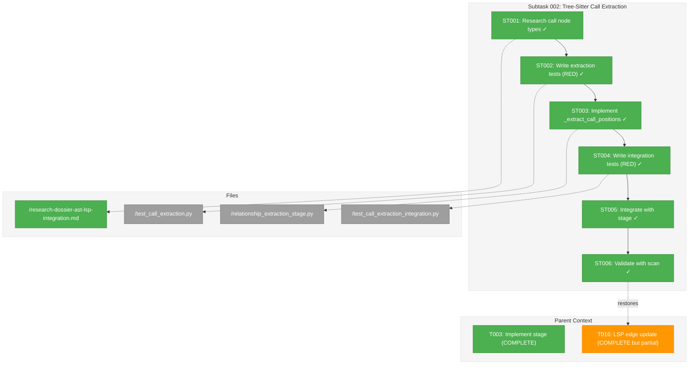
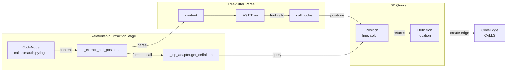
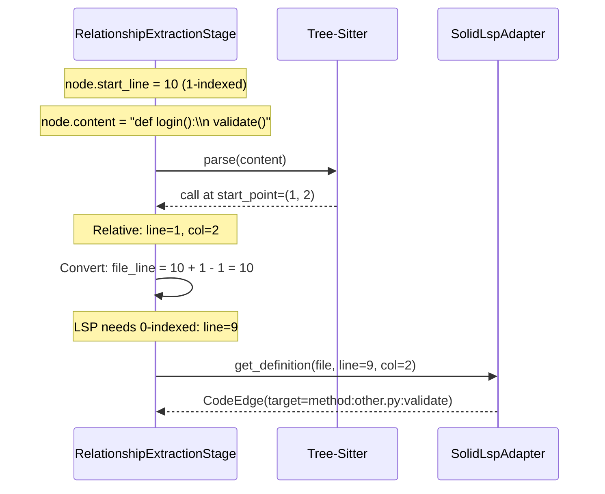

# Subtask 001: Tree-Sitter Call Expression Extraction for LSP Integration

**Parent Plan:** [View Plan](../../lsp-integration-plan.md)  
**Parent Phase:** Phase 8: Pipeline Integration  
**Parent Task(s):** [T003: Implement RelationshipExtractionStage](../tasks.md#task-t003), [T016: Update LSP adapter](../tasks.md#task-t016)  
**Plan Task Reference:** [Task 8.3 and 8.16 in Plan](../../lsp-integration-plan.md#phase-8-pipeline-integration)

**Why This Subtask:**  
The current LSP `get_definition` approach was fundamentally flawed—it scanned every line at fixed column positions (4,8,12,16,20,24,28,32), generating 100K+ useless queries. 99%+ returned None because random positions don't contain call expressions. The fix requires extracting call expression positions from tree-sitter AST and querying LSP only at those precise locations.

**Created:** 2026-01-23  
**Requested By:** Development Team (code review finding)

---

## Executive Briefing

### Purpose
This subtask implements proper "what do I call" detection by extracting call expression positions from tree-sitter AST and querying LSP `get_definition` only at those precise locations. This replaces the removed naive line-scanning approach with a correct implementation that reduces LSP queries from ~100K+ to ~1K-2K per scan.

### What We're Building
A call expression extractor that:
- Re-parses callable node content using tree-sitter to find `call` (Python) / `call_expression` (TS/JS/Go) nodes
- Extracts exact (line, column) positions from tree-sitter `start_point`
- Queries LSP `get_definition` only at those call site positions
- Creates `EdgeType.CALLS` edges pointing to definitions
- Complements existing `get_references` (who calls me) with `get_definition` (what do I call)

### Unblocks
- **Full bidirectional call graph**: Currently only "who calls me" works; this adds "what do I call"
- **Accurate method→method edges**: Proper symbol-level resolution for outgoing calls
- **Performance**: Reduces LSP queries from O(lines × 8) to O(call_sites) per function

### Example
**Before (removed approach)**:
```python
# For function with 50 lines: 50 × 8 = 400 queries
for line in range(start, end):
    for col in [4, 8, 12, 16, 20, 24, 28, 32]:
        lsp.get_definition(file, line, col)  # 99%+ return None
```

**After (this subtask)**:
```python
# Extract calls from AST: find ~5-10 actual call sites
call_positions = extract_call_positions(node.content, "python")
# [(5, 12), (7, 8), (15, 20)]  # Exact positions where foo() appears

for line, col in call_positions:
    lsp.get_definition(file, line, col)  # Each returns meaningful result
```

---

## Objectives & Scope

### Objective
Implement tree-sitter call expression extraction to enable accurate LSP `get_definition` queries, restoring the "what do I call" direction of call graph construction.

### Goals

- ✅ Implement `_extract_call_positions(content, language)` utility
- ✅ Support **4 main languages** with full LSP test coverage:
  - **Python** (`call` node type)
  - **TypeScript/JavaScript** (`call_expression` node type)  
  - **Go** (`call_expression` node type)
  - **C#** (`invocation_expression` node type)
- ✅ Handle **method/attribute calls** across all languages (query at method name, not receiver)
- ✅ Integrate with RelationshipExtractionStage to query LSP at call sites
- ✅ Create `EdgeType.CALLS` edges with `resolution_rule="lsp:definition"`
- ✅ Add comprehensive unit tests for call extraction
- ✅ Add integration tests validating outgoing call detection
- ✅ Document approach in code comments for future maintainers

### Non-Goals

- ❌ Re-parse content in RelationshipExtractionStage (parse once in ParsingStage)
- ❌ Extract calls for non-callable nodes (already filtered)
- ❌ Handle macro expansions or dynamic calls (AST-visible only)
- ❌ Performance optimization with caching (defer to profiling)
- ❌ Handle Terraform `function_call` (out of Phase 8 scope)
- ❌ Support all 48 CODE_LANGUAGES (focus on 4 with LSP test fixtures)

---

## Architecture Decision: Store call_sites on CodeNode

**Decision**: Add `call_sites: tuple[tuple[int, int], ...] | None` to CodeNode (DYK Session 2026-01-23)

**Rationale**: 
- AST is already parsed in ParsingStage - don't re-parse
- Follows existing pattern for chunk-level data (like `embedding_chunk_offsets`)
- RelationshipExtractionStage just reads pre-computed positions

**Implementation**:
1. ParsingStage extracts call positions during AST traversal
2. Stores as `call_sites=((line1, col1), (line2, col2), ...)` on CodeNode
3. RelationshipExtractionStage reads `node.call_sites` and queries LSP

**Affected Files**:
- `src/fs2/core/models/code_node.py` - Added `call_sites` field ✅
- `src/fs2/core/adapters/ast_parser_impl.py` - Extract calls during parsing (TODO)
- `src/fs2/core/services/stages/relationship_extraction_stage.py` - Read `node.call_sites` (TODO)

---

## Cross-Language Call Extraction Reference

### Call Node Types by Language

| Language | Call Node Type | Method Access Node | Example |
|----------|---------------|-------------------|---------|
| **Python** | `call` | `attribute` | `obj.method()` |
| **TypeScript/JS** | `call_expression` | `member_expression` | `obj.method()` |
| **Go** | `call_expression` | `selector_expression` | `pkg.Func()` |
| **C#** | `invocation_expression` | `member_access_expression` | `obj.Method()` |

### Method Position Extraction by Language

For each language, we need to extract the **method name position** (not the receiver):

**Python:**
```python
# Code: auth.login("user")
# Tree-sitter structure:
# call
#   └─ attribute         <- callee child
#        ├─ identifier "auth"    @ col 0 (receiver)
#        └─ identifier "login"   @ col 5 (method) ← QUERY HERE
```

**TypeScript/JavaScript:**
```typescript
// Code: auth.login("user")
// Tree-sitter structure:
// call_expression
//   └─ member_expression    <- function child
//        ├─ identifier "auth"     @ col 0 (object)
//        └─ property_identifier "login" @ col 5 (property) ← QUERY HERE
```

**Go:**
```go
// Code: auth.Login("user")
// Tree-sitter structure:
// call_expression
//   └─ selector_expression  <- function child
//        ├─ identifier "auth"    @ col 0 (operand)
//        └─ field_identifier "Login" @ col 5 (field) ← QUERY HERE
```

**C#:**
```csharp
// Code: auth.Login("user")
// Tree-sitter structure:
// invocation_expression
//   └─ member_access_expression  <- function child
//        ├─ identifier "auth"    @ col 0 (expression)
//        └─ identifier "Login"   @ col 5 (name) ← QUERY HERE
```

### Implementation Strategy

```python
CALL_TYPES = {
    "python": "call",
    "typescript": "call_expression",
    "javascript": "call_expression",
    "tsx": "call_expression",
    "go": "call_expression",
    "c_sharp": "invocation_expression",
}

METHOD_ACCESS_TYPES = {
    "python": "attribute",
    "typescript": "member_expression",
    "javascript": "member_expression",
    "tsx": "member_expression",
    "go": "selector_expression",
    "c_sharp": "member_access_expression",
}

def get_query_position(call_node, language: str) -> tuple[int, int]:
    """Get position to query LSP for a call node.
    
    For method calls (obj.method()), returns method name position.
    For simple calls (func()), returns function name position.
    """
    callee = call_node.child_by_field_name("function")  # varies by language
    
    method_type = METHOD_ACCESS_TYPES.get(language)
    if callee and method_type and callee.type == method_type:
        # Method call: get rightmost identifier (the method name)
        for child in reversed(callee.named_children):
            if "identifier" in child.type:
                return (child.start_point[0], child.start_point[1])
    
    # Simple call or fallback: use call start
    return (call_node.start_point[0], call_node.start_point[1])
```

### Stdlib/External Package Filtering (ST005)

When creating edges from LSP `get_definition` responses, filter out calls to stdlib/external packages. This is **language-specific**:

```python
STDLIB_PATTERNS = {
    "python": ["typeshed", "site-packages", ".pyenv", "/python3."],
    "typescript": ["node_modules", "@types/", "typescript/lib/"],
    "javascript": ["node_modules", "@types/"],
    "tsx": ["node_modules", "@types/", "typescript/lib/"],
    "go": ["/go/src/", "pkg/mod/", "GOROOT"],
    "c_sharp": [".nuget", "dotnet/shared", "Program Files"],
}

def is_stdlib_target(target_path: str, language: str) -> bool:
    """Check if LSP definition target is stdlib/external package."""
    patterns = STDLIB_PATTERNS.get(language, [])
    return any(pattern in target_path for pattern in patterns)

# In ST005 integration:
for line, col in node.call_sites:
    edges = lsp.get_definition(file_path, line, col)
    for edge in edges:
        target_path = edge.target_node_id.split(":")[1]
        if is_stdlib_target(target_path, node.language):
            continue  # Skip stdlib calls
        # ... create edge
```

---

## Architecture Map

### Component Diagram
<!-- Status: grey=pending, orange=in-progress, green=completed, red=blocked -->
<!-- Updated by plan-6 during implementation -->



### Task-to-Component Mapping

<!-- Status: ⬜ Pending | 🟧 In Progress | ✅ Complete | 🔴 Blocked -->

| Task | Component(s) | Files | Status | Comment |
|------|-------------|-------|--------|---------|
| ST001 | Research | research-dossier-ast-lsp-integration.md | ✅ Complete | Already documented in dossier |
| ST002 | Unit Tests | test_call_extraction.py | ✅ Complete | TDD RED - 16 tests fail with ImportError |
| ST003 | Extraction Utility | relationship_extraction_stage.py | ✅ Complete | TDD GREEN - 17/17 tests pass |
| ST004 | Integration Tests | test_call_extraction_integration.py | ✅ Complete | TDD RED - 2/3 fail as expected |
| ST005 | Stage Integration | relationship_extraction_stage.py | ✅ Complete | TDD GREEN - 3/3 integration tests pass |
| ST006 | Validation | fs2 scan | ✅ Complete | 12 CALLS edges, 5 cross-file, no warnings |

---

## Tasks

| Status | ID | Task | CS | Type | Dependencies | Absolute Path(s) | Validation | Subtasks | Notes |
|--------|------|------|-----|------|--------------|------------------|------------|----------|-------|
| [x] | ST001 | Document tree-sitter call node types per language | 1 | Research | – | /workspaces/flow_squared/docs/plans/025-lsp-research/research-dossier-ast-lsp-integration.md | Dossier contains call types | – | ✅ Already complete in research dossier |
| [x] | ST002 | Write failing unit tests for `_extract_call_positions()` | 2 | Test | ST001 | /workspaces/flow_squared/tests/unit/services/stages/test_call_extraction.py | Tests fail with ImportError or NotImplemented | – | ✅ TDD RED; 17 tests created |
| [x] | ST003 | Implement `_extract_call_positions(content, language)` | 2 | Core | ST002 | /workspaces/flow_squared/src/fs2/core/services/stages/relationship_extraction_stage.py | ST002 tests pass | – | ✅ TDD GREEN; 17/17 tests pass |
| [x] | ST004 | Write failing integration tests for outgoing call detection | 2 | Test | ST003 | /workspaces/flow_squared/tests/integration/test_call_extraction_integration.py | Tests fail with no edges or wrong edges | – | ✅ TDD RED; 3 tests created |
| [x] | ST005 | Integrate call extraction with `_extract_lsp_relationships()` | 2 | Core | ST003, ST004 | /workspaces/flow_squared/src/fs2/core/services/stages/relationship_extraction_stage.py | ST004 tests pass; `get_definition` called at call sites | – | ✅ TDD GREEN; 3/3 integration tests pass |
| [x] | ST006 | Run `fs2 scan` and validate outgoing call edges created | 1 | QA | ST005 | tests/fixtures/lsp/python_multi_project | Script shows CALLS edges; no excessive warnings | – | ✅ 12 CALLS edges, 5 cross-file |

---

## Alignment Brief

### Objective Recap

**Parent Phase Goal**: Integrate RelationshipExtractionStage into scan pipeline with symbol-level resolution.

**This Subtask's Contribution**: Restore the "what do I call" direction of call graph construction by:
1. Extracting call expression positions from tree-sitter AST
2. Querying LSP `get_definition` only at those positions
3. Creating `method:X → method:Y` edges for outgoing calls

### Critical Findings Affecting This Subtask

**From Research Dossier (CD-01)**: Call Expressions Are Already Parsed But Discarded
- **Constraint**: Tree-sitter parses call expressions but they're filtered out by category
- **Implication**: We need to re-parse content specifically to find calls
- **Addressed by**: ST003 (implements extraction utility)

**From Research Dossier (CD-02)**: Position Conversion Is Straightforward
- **Constraint**: Both tree-sitter and LSP use 0-indexed positions
- **Implication**: Minimal conversion needed (just add node.start_line offset)
- **Addressed by**: ST005 (handles position conversion)

**From Plan (DYK-8)**: LSP get_definition Must Be Called at Call-Site Positions
- **Constraint**: Querying at `def foo():` returns nothing—need to query at `bar()` call expressions
- **Addressed by**: ST003, ST005 (extract and query at call sites)

### ADR Decision Constraints

**Updated by DYK Session 2026-01-23**: Pivoted from Option B to Option A.

Decision to use **Option A (store call_sites on CodeNode)** is now binding:
- `call_sites` field added to CodeNode model ✅
- ParsingStage extracts calls during AST traversal (no re-parsing)
- RelationshipExtractionStage reads pre-computed positions

### Pre-Existing Test Fixtures

**Note**: 4 tests in `test_symbol_level_resolution.py` were failing BEFORE our changes:
- Tests use `set_definition_response()` but code calls `get_references()`
- These tests are testing the exact feature we're implementing
- **Decision**: Fix as part of this subtask - when we implement `get_definition` at call sites, these tests should pass
- This validates our implementation matches the original design intent
- Lazy evaluation only for callable nodes

### Invariants & Guardrails

**Inherited from Parent Phase**:
- LSP edges `confidence=1.0`
- All edges MUST have `resolution_rule` with source prefix (`lsp:definition`)
- Errors collected, not raised; scan continues
- Symbol-level node IDs when possible

**Subtask-Specific**:
- Only extract calls for `node.category in ("callable", "method", "function")`
- Tree-sitter parser must match node's `language` field
- Position conversion: `lsp_line = (node.start_line - 1) + relative_line` where:
  - `node.start_line` is 1-indexed (CodeNode convention)
  - `relative_line` is 0-indexed (tree-sitter convention)
  - `lsp_line` is 0-indexed (LSP convention)
  - Example: If node starts at line 10 (1-indexed) and call is at relative line 2 (0-indexed),
    then `lsp_line = (10 - 1) + 2 = 11` (0-indexed, which is line 12 in the file)

### Inputs to Read

| File | Purpose |
|------|---------|
| `/workspaces/flow_squared/docs/plans/025-lsp-research/research-dossier-ast-lsp-integration.md` | Full research on AST+LSP integration |
| `/workspaces/flow_squared/src/fs2/core/services/stages/relationship_extraction_stage.py` | Current stage implementation (lines 230-285) |
| `/workspaces/flow_squared/src/fs2/core/adapters/ast_parser_impl.py` | Tree-sitter usage patterns (lines 560-680) |
| `/workspaces/flow_squared/tests/integration/test_lsp_integration.py` | Existing LSP test patterns |

### Visual Alignment Aids

#### Call Extraction Flow



#### Position Conversion Sequence



### Test Plan (TDD Approach)

**Unit Tests (test_call_extraction.py)**:

| Test | Purpose | Fixture | Expected Output |
|------|---------|---------|-----------------|
| `test_given_python_code_when_extract_then_finds_call` | Basic Python | `"def f():\n  foo()"` | `[(1, 2)]` |
| `test_given_nested_calls_when_extract_then_finds_all` | Multiple calls | `"foo(bar(baz()))"` | 3 positions |
| `test_given_method_call_when_extract_then_finds_method_position` | Method call | `"self.helper()"` | Position at "helper", not "self" |
| `test_given_attribute_call_when_extract_then_finds_method_position` | Attribute call | `"obj.method()"` | Position at "method", not "obj" |
| `test_given_chained_calls_when_extract_then_finds_each` | Chain | `"a().b().c()"` | 3 positions |
| `test_given_typescript_when_extract_then_finds_call_expression` | TypeScript | `"foo()"` | 1 position |
| `test_given_go_when_extract_then_finds_call_expression` | Go | `"fmt.Println(x)"` | Position at "Println" |
| `test_given_no_calls_when_extract_then_returns_empty` | No calls | `"x = 1"` | `[]` |
| `test_given_unknown_language_when_extract_then_returns_empty` | Unknown | language="unknown" | `[]` |

**Critical: Method Position Extraction**

For attribute/method calls, we must query LSP at the **method name position**, not the receiver:

```python
# Code: auth.login("user")
#       ^--- col 0 (receiver "auth") - resolves to variable assignment ❌
#            ^--- col 5 (method "login") - resolves to method definition ✅

# Tree-sitter attribute node structure:
# attribute
#   ├─ identifier "auth"   @ col 0
#   └─ identifier "login"  @ col 5  <-- query here!
```

**Integration Tests (test_call_extraction_integration.py)**:

| Test | Purpose | Fixture | Expected Output |
|------|---------|---------|-----------------|
| `test_given_python_call_when_scan_then_creates_calls_edge` | E2E Python | python_multi_project | `EdgeType.CALLS` edge exists |
| `test_given_cross_file_call_when_scan_then_resolves_definition` | Cross-file | Caller → Callee | Edge points to correct method |
| `test_given_call_chain_when_scan_then_creates_all_edges` | A→B→C | Chain fixture | 2 CALLS edges |
| `test_given_lsp_unavailable_when_extract_then_graceful_skip` | Degradation | No LSP | No CALLS edges, no error |

### Step-by-Step Implementation Outline

1. **ST001** (✅ Complete): Research documented in `research-dossier-ast-lsp-integration.md`
   - Call types: Python=`call`, TS/JS/Go=`call_expression`
   - Position: `node.start_point` = (row, column) 0-indexed

2. **ST002**: Write failing unit tests
   - Create `/tests/unit/stages/test_call_extraction.py`
   - Test `_extract_call_positions(content, language)` for Python, TS, Go
   - **Critical**: Test that method calls return method name position, not receiver position
   - Tests should fail with `AttributeError` or `NotImplementedError`

3. **ST003**: Implement `_extract_call_positions()`
   - Add method to `RelationshipExtractionStage`
   - Use `tree_sitter_language_pack.get_parser(language)`
   - Traverse AST recursively, collect positions for `call`/`call_expression`
   - **For attribute calls**: Extract method name position (rightmost identifier), not receiver
   - Return `list[tuple[int, int]]` (line, column both 0-indexed)

4. **ST004**: Write failing integration tests
   - Create `/tests/integration/test_call_extraction_integration.py`
   - Test that `get_definition` creates CALLS edges
   - **Test method calls resolve to method definition**, not variable assignment
   - Use existing python_multi_project fixtures

5. **ST005**: Integrate with `_extract_lsp_relationships()`
   - After existing `get_references` code (line 273)
   - Extract call positions from `node.content`
   - For each position, compute file-level line: `lsp_line = (node.start_line - 1) + rel_line`
   - Query `lsp.get_definition(file, lsp_line, col)` (already 0-indexed)
   - Upgrade edges to symbol-level

6. **ST006**: Validate with real scan
   - Run `fs2 scan .` on codebase
   - Verify no excessive warnings
   - Run validation script to confirm CALLS edges

### Commands to Run

```bash
# Run unit tests for call extraction
pytest tests/unit/stages/test_call_extraction.py -v

# Run integration tests
pytest tests/integration/test_call_extraction_integration.py -v

# Run all LSP tests
pytest tests/ -k "lsp" -v

# Type check
mypy src/fs2/core/services/stages/relationship_extraction_stage.py --strict

# Lint
ruff check src/fs2/core/services/stages/relationship_extraction_stage.py

# Validation scan (small fixture)
cd tests/fixtures/lsp/python_multi_project && fs2 scan .

# Full codebase scan (use with caution)
fs2 scan . 2>&1 | head -100
```

### Risks & Unknowns

| Risk | Likelihood | Impact | Mitigation |
|------|------------|--------|------------|
| Tree-sitter parser initialization overhead | Low | Medium | Parser is already initialized in ParsingStage; reuse same language |
| Some languages have different call node types | Medium | Low | Document in code; extend CALL_TYPES set as needed |
| Position conversion off-by-one errors | Medium | High | Comprehensive unit tests with boundary cases |
| LSP server returns None for valid calls | Low | Low | Already handled; log debug, continue |

### Ready Check

- [ ] Research dossier reviewed and understood
- [ ] Call node types confirmed: Python=`call`, TS/JS/Go=`call_expression`
- [ ] Position conversion formula verified: `file_line = node.start_line + rel_line - 1`
- [ ] Test fixtures available (python_multi_project, etc.)
- [ ] LSP servers installed (Pyright, typescript-language-server, gopls)
- [ ] All unit and integration tests discoverable

**When all boxes checked**: Run `/plan-6-implement-phase --subtask 001-subtask-tree-sitter-call-extraction --plan /workspaces/flow_squared/docs/plans/025-lsp-research/lsp-integration-plan.md --phase "Phase 8: Pipeline Integration"`

---

## Phase Footnote Stubs

_Reserved for plan-6 to add implementation footnotes._

| Footnote | Date | Task | Note |
|----------|------|------|------|
| | | | |

---

## Evidence Artifacts

### Execution Log

- **Path**: `001-subtask-tree-sitter-call-extraction.execution.log.md`
- **Purpose**: Detailed narrative of implementation progress
- **Created by**: plan-6 during implementation

### Test Files

- `/workspaces/flow_squared/tests/unit/stages/test_call_extraction.py`
- `/workspaces/flow_squared/tests/integration/test_call_extraction_integration.py`

### Modified Files

- `/workspaces/flow_squared/src/fs2/core/services/stages/relationship_extraction_stage.py`

---

## Discoveries & Learnings

_Populated during implementation by plan-6. Log anything of interest to your future self._

| Date | Task | Type | Discovery | Resolution | References |
|------|------|------|-----------|------------|------------|
| | | | | | |

**Types**: `gotcha` | `research-needed` | `unexpected-behavior` | `workaround` | `decision` | `debt` | `insight`

**What to log**:
- Things that didn't work as expected
- External research that was required
- Implementation troubles and how they were resolved
- Gotchas and edge cases discovered
- Decisions made during implementation
- Technical debt introduced (and why)
- Insights that future phases should know about

_See also: `execution.log.md` for detailed narrative._

---

## After Subtask Completion

**This subtask resolves a blocker for:**
- Parent Task: [T016: Update LSP adapter for symbol-level edges](../tasks.md#task-t016)
- Plan Task: [Task 8.16 in Plan](../../lsp-integration-plan.md#phase-8-pipeline-integration)

**When all ST### tasks complete:**

1. **Record completion** in parent execution log:
   ```
   ### Subtask 001-subtask-tree-sitter-call-extraction Complete

   Resolved: Implemented tree-sitter call expression extraction for accurate LSP get_definition queries
   See detailed log: [subtask execution log](./001-subtask-tree-sitter-call-extraction.execution.log.md)
   ```

2. **Update parent task** (if it was blocked):
   - Open: [`tasks.md`](../tasks.md)
   - Find: T016 (already marked complete but partial)
   - Update Notes: Add "Subtask 002 complete - full bidirectional call graph"

3. **Resume parent phase work:**
   ```bash
   /plan-6-implement-phase --phase "Phase 8: Pipeline Integration" \
     --plan "/workspaces/flow_squared/docs/plans/025-lsp-research/lsp-integration-plan.md"
   ```
   (Note: NO `--subtask` flag to resume main phase)

**Quick Links:**
- 📋 [Parent Dossier](../tasks.md)
- 📄 [Parent Plan](../../lsp-integration-plan.md)
- 📊 [Parent Execution Log](../execution.log.md)
- 📚 [Research Dossier](../../research-dossier-ast-lsp-integration.md)

---

## Directory Structure After Subtask

```
docs/plans/025-lsp-research/tasks/phase-8-pipeline-integration/
├── tasks.md                                          # Parent dossier
├── execution.log.md                                  # Parent execution log
├── 001-subtask-tree-sitter-call-extraction.md        # This file
└── 001-subtask-tree-sitter-call-extraction.execution.log.md  # Created by plan-6
```

---

## Critical Insights Discussion

**Session**: 2026-01-23 23:05 UTC
**Context**: Subtask 001 - Tree-Sitter Call Expression Extraction for LSP Integration
**Analyst**: AI Clarity Agent
**Reviewer**: Development Team
**Format**: Water Cooler Conversation (5 Critical Insights)

### Insight 1: Position Conversion Formula is WRONG

**Did you know**: The formula `file_line = node.start_line + rel_line - 1` was incorrect, and there was an existing bug in `relationship_extraction_stage.py:270` passing 1-indexed lines to LSP.

**Implications**:
- All LSP queries were off by one line
- `get_references` was querying wrong positions
- New `get_definition` would inherit same bug

**Options Considered**:
- Option A: Fix in subtask, add to tasks - Separate fixes, clear ownership
- Option B: Fix both bugs together - Clean up existing before adding new

**AI Recommendation**: Option B - Fix both bugs together

**Discussion Summary**:
POC confirmed the approach works when positions are correct (4 cross-file, 7 same-file resolved). Fixed existing bug immediately.

**Decision**: Fix existing `get_references` bug at line 270, use correct formula throughout

**Action Items**:
- [x] Fix `relationship_extraction_stage.py:270` to use `node.start_line - 1`
- [x] Update subtask dossier with correct formula

**Affects**: ST005 implementation, all position conversion code

---

### Insight 2: Method Calls Resolve to Variable, Not Method

**Did you know**: For `auth.login()`, querying at column 0 (`auth`) resolves to the variable assignment, not the `login()` method definition. You must query at the method name position (after the dot).

**Implications**:
- Simple "query at call start" misses method definitions
- Need to extract method name position from attribute/member access nodes
- Different languages have different AST structures for this

**Options Considered**:
- Option A: Query receiver only - Simpler but incomplete
- Option B: Query method name position - Complete resolution, more complex

**AI Recommendation**: Option B - Query method name position

**Discussion Summary**:
User confirmed all cross-file rels must show up in graph. Added cross-language reference showing node types and extraction patterns for Python, TypeScript, Go, C#.

**Decision**: Extract method name position (not receiver) for attribute/member calls

**Action Items**:
- [x] Add cross-language call extraction reference to subtask
- [x] Document method access node types per language

**Affects**: ST003 implementation, test fixtures

---

### Insight 3: Parser Initialization - Direct Import vs Dependency Injection

**Did you know**: The original plan assumed re-parsing content in RelationshipExtractionStage, but AST is ALREADY parsed in ParsingStage. Re-parsing wastes resources.

**Implications**:
- Original Option B (re-parse on-demand) is inefficient
- Call positions should be extracted once during parsing
- Requires adding storage to CodeNode model

**Options Considered**:
- Option A: Add `call_sites` field to CodeNode - Parse once, read many
- Option B: Re-parse on demand - Original plan, simpler but wasteful

**AI Recommendation**: Option A - Add `call_sites` to CodeNode

**Discussion Summary**:
User corrected approach: "The AST is ALREADY PARSED. We should just be iterating through things already stored as nodes." Pivoted to Option A.

**Decision**: Store `call_sites: tuple[tuple[int, int], ...] | None` on CodeNode

**Action Items**:
- [x] Add `call_sites` field to CodeNode model
- [x] Update `create_callable()` factory method
- [x] Update subtask Architecture Decision section

**Affects**: CodeNode model, ParsingStage, RelationshipExtractionStage

---

### Insight 4: Stdlib Filtering Not In Subtask

**Did you know**: The POC filters out stdlib/external package targets (typeshed, site-packages, node_modules, etc.) but the subtask didn't mention this. Without it, we'd create edges to stdlib that clutter the graph.

**Implications**:
- Need language-specific filtering patterns
- Can't detect stdlib at parse time; must filter at query time
- Different languages have different stdlib paths

**Options Considered**:
- Option A: Filter at query time in ST005 - Check target path when LSP returns
- Option B: Post-process in GraphService - Separate concern, but late

**AI Recommendation**: Option A - Filter at query time in ST005

**Discussion Summary**:
User noted this is cross-language. Added STDLIB_PATTERNS dict with paths for Python, TypeScript/JS, Go, C#.

**Decision**: Filter stdlib at query time with language-specific patterns

**Action Items**:
- [x] Add stdlib filtering reference to subtask dossier
- [x] Include patterns for all 4 supported languages

**Affects**: ST005 implementation

---

### Insight 5: Pre-Existing Failing Tests in test_symbol_level_resolution.py

**Did you know**: There are 4 failing tests in `test_symbol_level_resolution.py` that use `set_definition_response()` but the code only calls `get_references()`. These tests are testing exactly what we're about to implement!

**Implications**:
- Tests exist for the feature we're building
- When we implement `get_definition` at call sites, they should pass
- Tests validate our implementation matches original design intent

**Options Considered**:
- Option A: Fix tests as part of this subtask - Tests are for this feature
- Option B: Skip/ignore for now - Mark xfail, fix later

**AI Recommendation**: Option A - Fix tests as part of this subtask

**Discussion Summary**:
User chose Option A. Tests will be addressed when implementing ST005.

**Decision**: Include pre-existing tests in ST005 validation - they should pass when implementation complete

**Action Items**:
- [x] Document pre-existing test state in ADR section
- [ ] Verify tests pass after ST005 implementation

**Affects**: ST005 validation criteria

---

## Session Summary

**Insights Surfaced**: 5 critical insights identified and discussed
**Decisions Made**: 5 decisions reached through collaborative discussion
**Action Items Created**: 10 follow-up items (8 completed immediately)
**Areas Updated**:
- CodeNode model (`call_sites` field added)
- `relationship_extraction_stage.py:270` (bug fixed)
- Subtask dossier (multiple sections updated)

**Shared Understanding Achieved**: ✓

**Confidence Level**: High - POC validates approach, architecture decisions made, cross-language patterns documented

**Next Steps**:
1. Run `/plan-6-implement-phase --subtask 001-subtask-tree-sitter-call-extraction` to implement
2. ST002-ST006 follow TDD approach
3. Pre-existing tests should pass after ST005

**Notes**:
- Position conversion is critical - always remember 1-indexed CodeNode vs 0-indexed LSP
- Method call resolution requires querying at method name, not receiver
- Stdlib filtering is language-specific - use STDLIB_PATTERNS dict
