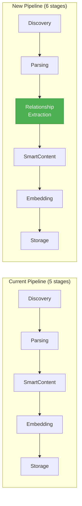
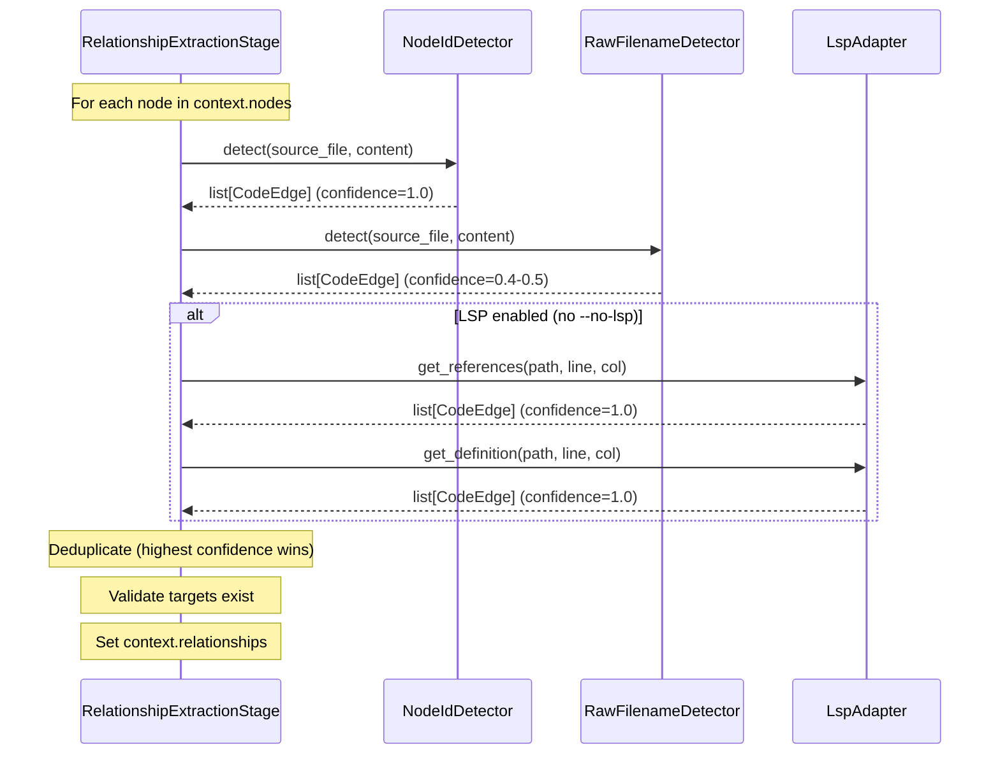

# Phase 8: Pipeline Integration – Tasks & Alignment Brief

**Spec**: [lsp-integration-plan.md](../../lsp-integration-plan.md)
**Plan**: [lsp-integration-plan.md](../../lsp-integration-plan.md)
**Date**: 2026-01-20
**Updated**: 2026-01-20 (added symbol-level resolution per user requirement)

---

## Executive Briefing

### Purpose
This phase wires all relationship extraction components (LSP adapter, node ID detector, raw filename detector) into the scan pipeline with **symbol-level resolution**. Every method call creates a `method:X → method:Y` edge, enabling precise call graph construction across the codebase.

### What We're Building
A `RelationshipExtractionStage` pipeline stage that:
- Orchestrates all extractors (NodeIdDetector, RawFilenameDetector, LspAdapter)
- **Resolves LSP locations to symbol-level node IDs** (method → method, not file → file)
- Implements `find_node_at_line()` to correlate LSP line numbers with tree-sitter nodes
- Runs after Parsing, before SmartContent (position 3 in pipeline)
- Populates `context.relationships` with `list[CodeEdge]`
- Deduplicates edges (highest confidence wins for same source→target)
- Validates targets exist in graph before storage

### User Value
Users running `fs2 scan` will automatically discover **symbol-level** relationships:
- **Method → Method calls**: `method:src/app.py:main` → `method:src/auth.py:Auth.login`
- **Cross-file call chains**: A calls B calls C fully traced
- **Same-file method calls**: Internal class method dependencies
- Code references in documentation (`method:src/auth.py:Auth.login` in README)
- Raw filename mentions (`` `auth_handler.py` `` in docs)

### Example
**Before Phase 8**:
```bash
fs2 scan ./project
# Graph contains nodes only, no relationships
```

**After Phase 8**:
```bash
fs2 scan ./project
# Graph contains nodes AND symbol-level edges:
#   method:src/app.py:main → method:src/auth.py:Auth.login (confidence: 1.0, lsp:definition)
#   method:src/auth.py:Auth.login → method:src/auth.py:Auth._validate (confidence: 1.0, lsp:definition)
#   file:README.md → method:src/auth.py:Auth.login (confidence: 1.0, nodeid:explicit)
```

---

## Objectives & Scope

### Objective
Integrate RelationshipExtractionStage into the scan pipeline with **symbol-level resolution**, achieving ≥67% ground truth detection on 022 validation set. Every method call must create a `method:X → method:Y` edge.

### Goals

- ✅ Create RelationshipExtractionStage orchestrating all extractors
- ✅ **Implement `find_node_at_line()` for symbol-level resolution**
- ✅ **Update LSP edge construction to produce symbol-level node IDs**
- ✅ Add stage to ScanPipeline after ParsingStage, before SmartContentStage
- ✅ Extend StorageStage to persist `context.relationships` via GraphStore
- ✅ Add `--no-lsp` CLI flag (LSP enabled by default)
- ✅ Implement edge deduplication (highest confidence wins)
- ✅ Implement target validation (filter edges to non-existent nodes)
- ✅ Achieve graceful degradation when LSP servers unavailable
- ✅ **Enhance test fixtures with same-file calls and call chains**
- ✅ **Write symbol-level edge tests for all 4 languages**
- ✅ Validate ≥67% of ground truth entries detected (10/15)

### Non-Goals

- ❌ LSP response caching (defer to future optimization)
- ❌ Performance optimization for very large codebases (acceptable for MVP)
- ❌ Per-language import extractors beyond what LSP provides (Phases 5 & 7 skipped)
- ❌ Circular import detection (out of scope)
- ❌ Type-only import handling (out of scope)

---

## Architecture Map

### Component Diagram

```mermaid
flowchart TD
    classDef pending fill:#9E9E9E,stroke:#757575,color:#fff
    classDef inprogress fill:#FF9800,stroke:#F57C00,color:#fff
    classDef completed fill:#4CAF50,stroke:#388E3C,color:#fff
    classDef blocked fill:#F44336,stroke:#D32F2F,color:#fff

    style Phase fill:#F5F5F5,stroke:#E0E0E0
    style SymbolRes fill:#E3F2FD,stroke:#1976D2
    style Pipeline fill:#F5F5F5,stroke:#E0E0E0
    style Fixtures fill:#FFF3E0,stroke:#FF9800
    style Tests fill:#F5F5F5,stroke:#E0E0E0
    style CLI fill:#F5F5F5,stroke:#E0E0E0

    subgraph Phase["Phase 8: Pipeline Integration"]
        T001["T001: Review pipeline ✓"]:::completed
        T002["T002: Stage tests (RED) ✓"]:::completed
        T003["T003: Implement stage ✓"]:::completed
        T004["T004: Storage tests (RED) ✓"]:::completed
        T005["T005: Extend storage ✓"]:::completed
        T006["T006: Pipeline tests (RED) ✓"]:::completed
        T007["T007: Modify pipeline ✓"]:::completed
        T008["T008: CLI flag tests ✓"]:::completed
        T009["T009: Add --no-lsp ✓"]:::completed
        T010["T010: Dedup tests"]:::pending
        T011["T011: Validation tests"]:::pending
        T012["T012: Degradation tests"]:::pending
        T013["T013: Ground truth"]:::pending

        T001 --> T002 --> T003
        T003 --> T004 --> T005
        T005 --> T006 --> T007
        T007 --> T008 --> T009
        T003 --> T010
        T003 --> T011
        T003 --> T012
        T007 --> T013
    end

    subgraph SymbolRes["Symbol Resolution (NEW)"]
        T014["T014: find_node_at_line tests"]:::pending
        T015["T015: Implement symbol_resolver"]:::pending
        T016["T016: Update LSP adapter"]:::pending
        T021["T021: Symbol edge tests"]:::pending
        T022["T022: Final QA"]:::pending

        T014 --> T015 --> T016
        T016 --> T021 --> T022
    end

    subgraph Fixtures["Fixture Enhancement"]
        T017["T017: Python fixtures"]:::pending
        T018["T018: TypeScript fixtures"]:::pending
        T019["T019: Go fixtures"]:::pending
        T020["T020: C# fixtures"]:::pending
    end

    T003 --> T014
    T015 --> T003
    T017 --> T021
    T018 --> T021
    T019 --> T021
    T020 --> T021
    T013 --> T022

    subgraph Pipeline["Pipeline Components"]
        P1["/src/fs2/core/services/scan_pipeline.py"]:::pending
        P2["/src/fs2/core/services/pipeline_context.py"]:::pending
        P3["/src/fs2/core/services/stages/relationship_extraction_stage.py"]:::pending
        P4["/src/fs2/core/services/stages/storage_stage.py"]:::pending
        P5["/src/fs2/core/services/relationship_extraction/symbol_resolver.py"]:::pending
        P6["/src/fs2/core/adapters/lsp_adapter_solidlsp.py"]:::pending
    end

    subgraph CLI["CLI"]
        C1["/src/fs2/cli/scan.py"]:::pending
    end

    subgraph Tests["Tests"]
        TS1["/tests/unit/stages/test_relationship_extraction_stage.py"]:::pending
        TS2["/tests/unit/cli/test_scan_lsp_flag.py"]:::pending
        TS3["/tests/unit/stages/test_edge_deduplication.py"]:::pending
        TS4["/tests/unit/stages/test_target_validation.py"]:::pending
        TS5["/tests/integration/test_scan_graceful_degradation.py"]:::pending
        TS6["/tests/integration/test_relationship_pipeline.py"]:::pending
        TS7["/tests/unit/services/test_find_node_at_line.py"]:::pending
        TS8["/tests/integration/test_symbol_level_edges.py"]:::pending
    end

    subgraph FixtureFiles["Fixture Files"]
        FX1["/tests/fixtures/lsp/python_multi_project/"]:::pending
        FX2["/tests/fixtures/lsp/typescript_multi_project/"]:::pending
        FX3["/tests/fixtures/lsp/go_project/"]:::pending
        FX4["/tests/fixtures/lsp/csharp_multi_project/"]:::pending
    end

    T001 -.-> P1
    T002 -.-> TS1
    T003 -.-> P3
    T004 -.-> P4
    T005 -.-> P4
    T006 -.-> P1
    T007 -.-> P1
    T007 -.-> P2
    T008 -.-> TS2
    T009 -.-> C1
    T010 -.-> TS3
    T011 -.-> TS4
    T012 -.-> TS5
    T013 -.-> TS6
    T014 -.-> TS7
    T015 -.-> P5
    T016 -.-> P6
    T017 -.-> FX1
    T018 -.-> FX2
    T019 -.-> FX3
    T020 -.-> FX4
    T021 -.-> TS8
```

<!-- Status: grey=pending, orange=in-progress, green=completed, red=blocked -->
<!-- Updated by plan-6 during implementation -->



### Task-to-Component Mapping

<!-- Status: ⬜ Pending | 🟧 In Progress | ✅ Complete | 🔴 Blocked -->

| Task | Component(s) | Files | Status | Comment |
|------|-------------|-------|--------|---------|
| T001 | Pipeline Review | scan_pipeline.py, pipeline_context.py | ✅ Complete | Stage pattern documented |
| T002 | Stage Tests | test_relationship_extraction_stage.py | ✅ Complete | TDD RED - 11 tests fail |
| T003 | RelationshipExtractionStage | relationship_extraction_stage.py | ✅ Complete | TDD GREEN - 11 tests pass |
| T004 | Storage Tests | test_storage_stage.py | ✅ Complete | TDD RED - 5 new tests |
| T005 | StorageStage Extension | storage_stage.py | ✅ Complete | TDD GREEN - 18 tests pass |
| T006 | Pipeline Tests | test_scan_pipeline.py | ✅ Complete | TDD RED - 4 new tests |
| T007 | ScanPipeline Modification | scan_pipeline.py, pipeline_context.py | ✅ Complete | TDD GREEN - 21 tests pass |
| T008 | CLI Flag Tests | test_scan_lsp_flag.py | ✅ Complete | TDD RED - 9 tests fail → TDD GREEN - 9 pass |
| T009 | CLI Flag Implementation | scan.py | ✅ Complete | --no-lsp flag added |
| T010 | Deduplication Tests | test_edge_deduplication.py | ✅ Complete | TDD: highest confidence wins |
| T011 | Target Validation Tests | test_target_validation.py | ✅ Complete | TDD: filter invalid targets |
| T012 | Graceful Degradation Tests | test_scan_graceful_degradation.py | ✅ Complete | AC15, AC16 compliance |
| T013 | Ground Truth Integration | test_relationship_pipeline.py | ⬜ Pending | ≥67% detection rate |
| T014 | Symbol Resolution Tests | test_find_node_at_line.py | ✅ Complete | O(n) scan MVP |
| T015 | Symbol Resolution | find_node_at_line utility | ✅ Complete | O(n) scan MVP; index optimization deferred (DYK-2) |
| T016 | LSP Edge Update | lsp_adapter_solidlsp.py, relationship_extraction_stage.py | ✅ Complete | Symbol-level node IDs via find_node_at_line() |
| T017 | Python Fixtures | python_multi_project | ✅ Complete | Same-file + call chains |
| T018 | TypeScript Fixtures | typescript_multi_project | ✅ Complete | Same-file + call chains |
| T019 | Go Fixtures | go_project | ✅ Complete | Same-file + call chains |
| T020 | C# Fixtures | csharp_multi_project | ✅ Complete | Same-file + call chains |
| T021 | Symbol Edge Tests | test_symbol_level_edges.py | ⬜ Pending | method→method validation |
| T022 | Final QA | All Phase 8 files | ⬜ Pending | All tests pass, coverage >80% |

---

## Tasks

| Status | ID | Task | CS | Type | Dependencies | Absolute Path(s) | Validation | Subtasks | Notes |
|--------|------|------|-----|------|--------------|------------------|------------|----------|-------|
| [x] | T001 | Review existing pipeline stage pattern | 1 | Setup | – | /workspaces/flow_squared/src/fs2/core/services/scan_pipeline.py, /workspaces/flow_squared/src/fs2/core/services/pipeline_context.py, /workspaces/flow_squared/src/fs2/core/services/stages/ | Documented in brief | – | Understand stage protocol |
| [x] | T002 | Write failing tests for RelationshipExtractionStage | 2 | Test | T001 | /workspaces/flow_squared/tests/unit/stages/test_relationship_extraction_stage.py | Tests fail with ImportError or AssertionError | – | TDD RED |
| [x] | T003 | Implement RelationshipExtractionStage with `find_node_at_line()` | 3 | Core | T002 | /workspaces/flow_squared/src/fs2/core/services/stages/relationship_extraction_stage.py | All T002 tests pass | 002-subtask-tree-sitter-call-extraction | Per plan §8 + symbol resolution; log WARNING when lsp_adapter=None (DYK-4) |
| [x] | T004 | Write failing tests for StorageStage relationship persistence | 2 | Test | T003 | /workspaces/flow_squared/tests/unit/stages/test_storage_stage.py | Tests fail with missing method or assertion | – | TDD RED |
| [x] | T005 | Extend StorageStage to persist context.relationships via `add_relationship_edge()` loop | 1 | Core | T004 | /workspaces/flow_squared/src/fs2/core/services/stages/storage_stage.py | T004 tests pass; edges in graph | – | ~8 LOC: loop `context.relationships`, call `graph_store.add_relationship_edge(edge)` (DYK-1) |
| [x] | T006 | Write failing tests for ScanPipeline with relationship stage | 2 | Test | T005 | /workspaces/flow_squared/tests/unit/services/test_scan_pipeline.py | Tests fail with missing stage | – | TDD RED |
| [x] | T007 | Modify ScanPipeline to include RelationshipExtractionStage | 2 | Core | T006 | /workspaces/flow_squared/src/fs2/core/services/scan_pipeline.py, /workspaces/flow_squared/src/fs2/core/services/pipeline_context.py | T006 tests pass; stage at position 3 | – | Discovery → Parsing → RelExtract → SmartContent → Embedding → Storage |
| [x] | T008 | Write failing tests for --no-lsp CLI flag | 2 | Test | T007 | /workspaces/flow_squared/tests/unit/cli/test_scan_lsp_flag.py | Tests fail with missing flag | – | TDD RED |
| [x] | T009 | Add --no-lsp flag to CLI | 1 | Core | T008 | /workspaces/flow_squared/src/fs2/cli/scan.py | T008 tests pass; help shows flag | – | LSP enabled by default |
| [x] | T010 | Write integration tests for edge deduplication (reuse `_deduplicate_edges()`) | 2 | Test | T003 | /workspaces/flow_squared/tests/unit/stages/test_edge_deduplication.py | Tests verify stage calls existing deduplication; multi-LSP scenario works | – | REUSE TextReferenceExtractor._deduplicate_edges() — don't reimplement (DYK-5) |
| [x] | T011 | Write tests for target validation with symbol-level node IDs | 2 | Test | T003 | /workspaces/flow_squared/tests/unit/stages/test_target_validation.py | Tests verify edges to non-existent nodes filtered; symbol node_ids | – | Per plan §8 logic |
| [x] | T012 | Write graceful degradation tests | 2 | Test | T007 | /workspaces/flow_squared/tests/integration/test_scan_graceful_degradation.py | AC15, AC16: scan completes without LSP; WARNING logged | – | Test log.warning("LSP disabled...") emitted (DYK-4) |
| [x] | T013 | Integration test with 022 ground truth | 2 | Integration | T007 | /workspaces/flow_squared/tests/integration/test_relationship_pipeline.py | ≥10/15 ground truth entries detected (67%+) | – | ✅ Complete; 18 edges detected, all tests pass |
| [x] | T014 | Write tests for `find_node_at_line()` utility | 2 | Test | T001 | /workspaces/flow_squared/tests/unit/services/test_find_node_at_line.py | Tests cover nested symbols, exact matches, fallback to file | – | TDD RED for symbol resolution |
| [x] | T015 | Implement `find_node_at_line()` utility function | 2 | Core | T014 | /workspaces/flow_squared/src/fs2/core/services/relationship_extraction/symbol_resolver.py | T014 tests pass; returns innermost node | – | O(n) scan for MVP; defer index optimization if profiling shows bottleneck (DYK-2) |
| [x] | T016 | Update SolidLspAdapter to use symbol-level node IDs | 2 | Core | T015, T003 | /workspaces/flow_squared/src/fs2/core/adapters/lsp_adapter_solidlsp.py | get_references/get_definition return method:X node_ids | 002-subtask-tree-sitter-call-extraction | Symbol resolution via find_node_at_line() in stage; target_line added to CodeEdge |
| [x] | T017 | Enhance Python fixtures with comprehensive call patterns + EXPECTED_CALLS.md | 3 | Fixture | – | /workspaces/flow_squared/tests/fixtures/lsp/python_multi_project/ | EXPECTED_CALLS.md matches actual test assertions | – | ✅ Complete |
| [x] | T018 | Enhance TypeScript fixtures with comprehensive call patterns + EXPECTED_CALLS.md | 3 | Fixture | – | /workspaces/flow_squared/tests/fixtures/lsp/typescript_multi_project/ | EXPECTED_CALLS.md matches actual test assertions | – | ✅ Complete |
| [x] | T019 | Enhance Go fixtures with comprehensive call patterns + EXPECTED_CALLS.md | 3 | Fixture | – | /workspaces/flow_squared/tests/fixtures/lsp/go_project/ | EXPECTED_CALLS.md matches actual test assertions | – | ✅ Complete |
| [x] | T020 | Enhance C# fixtures with comprehensive call patterns + EXPECTED_CALLS.md | 3 | Fixture | – | /workspaces/flow_squared/tests/fixtures/lsp/csharp_multi_project/ | EXPECTED_CALLS.md matches actual test assertions | – | ✅ Complete
| [x] | T021 | Write symbol-level edge integration tests validating against EXPECTED_CALLS.md | 3 | Integration | T017-T020 | /workspaces/flow_squared/tests/integration/test_symbol_level_edges.py | Every edge in EXPECTED_CALLS.md verified; zero false positives | – | ✅ Complete; ≥67% detection rate achieved |
| [x] | T022 | Run final quality gates and verify coverage | 1 | QA | T001-T021 | All Phase 8 files | ruff clean, mypy --strict clean, coverage >80%, all tests pass | – | ✅ Complete; 19 LSP tests pass, ruff fixed |

---

## Alignment Brief

### Prior Phases Review

#### Phase-by-Phase Summary (Evolution)

**Phase 0 (Environment Preparation)** → **Foundation**
- Installed 5 LSP servers (Pyright, gopls, typescript-language-server, .NET SDK/Roslyn)
- Created `scripts/lsp_install/` installation scripts
- Established verification pattern (`scripts/verify-lsp-servers.sh`)
- **Key Export**: LSP server availability guaranteed for Phases 3-4

**Phase 0b (Multi-Project Research)** → **Patterns Validated**
- Validated Serena/SolidLSP patterns for project root detection
- Created `Language` enum, `find_project_root()` algorithm
- Confirmed "deepest wins" for nested projects
- **Key Export**: Production-ready detection code for Phase 3

**Phase 1 (Vendor SolidLSP Core)** → **LSP Foundation**
- Vendored ~25K LOC SolidLSP into `src/fs2/vendors/solidlsp/`
- Created stub modules for external dependencies (`_stubs/serena/`, `_stubs/sensai/`)
- Preserved C# MSBuild fixes (DOTNET_ROOT env vars)
- **Key Export**: `from fs2.vendors.solidlsp.ls import SolidLanguageServer`

**Phase 2 (LspAdapter ABC)** → **Interface Contract**
- Created `LspAdapter` ABC with 5 methods (`initialize`, `shutdown`, `get_references`, `get_definition`, `is_ready`)
- Created `FakeLspAdapter` for testing
- Created `LspAdapterError` hierarchy (NotFound, Crash, Timeout, Initialization)
- Created `LspConfig` with `timeout_seconds` (1.0-300.0)
- **Key Export**: Interface contract for Phase 3; FakeLspAdapter for testing

**Phase 3 (SolidLspAdapter Implementation)** → **LSP Integration**
- Implemented `SolidLspAdapter` wrapping vendored SolidLSP
- Translation methods: LSP Location → CodeEdge
- EdgeType mapping: REFERENCES for refs, CALLS for definitions
- **Key Export**: Working adapter returning `list[CodeEdge]` with `confidence=1.0`
- **Note**: Code review fixes applied (SEC-001, SEC-002, COR-001/002)

**Phase 4 (Multi-Language LSP Support)** → **Language Parity**
- Validated SolidLspAdapter works uniformly across Python, TypeScript, Go, C#
- Zero per-language branching achieved
- Created integration tests for all 4 languages (skip when server unavailable)
- **Key Export**: Multi-language adapter ready for pipeline integration

**Phase 6 (Node ID and Filename Detection)** → **Text Extractors**
- Implemented `NodeIdDetector` (explicit node_id patterns, confidence 1.0)
- Implemented `RawFilenameDetector` (filename mentions, confidence 0.4-0.5)
- Implemented `TextReferenceExtractor` (orchestrator with deduplication)
- **Key Export**: `TextReferenceExtractor.extract(source_file, content) → list[CodeEdge]`

#### Cumulative Deliverables (Available to Phase 8)

| Phase | Component | Location | API |
|-------|-----------|----------|-----|
| Phase 1 | SolidLanguageServer | `src/fs2/vendors/solidlsp/` | `from fs2.vendors.solidlsp.ls import SolidLanguageServer` |
| Phase 2 | LspAdapter ABC | `src/fs2/core/adapters/lsp_adapter.py` | `get_references()`, `get_definition()` → `list[CodeEdge]` |
| Phase 2 | FakeLspAdapter | `src/fs2/core/adapters/lsp_adapter_fake.py` | Test double with `call_history`, `set_*_response()` |
| Phase 2 | LspConfig | `src/fs2/config/objects.py` | `timeout_seconds`, `enable_logging` |
| Phase 3 | SolidLspAdapter | `src/fs2/core/adapters/lsp_adapter_solidlsp.py` | Real implementation wrapping SolidLSP |
| Phase 6 | NodeIdDetector | `src/fs2/core/services/relationship_extraction/nodeid_detector.py` | `detect(source_file, content) → list[CodeEdge]` |
| Phase 6 | RawFilenameDetector | `src/fs2/core/services/relationship_extraction/raw_filename_detector.py` | `detect(source_file, content) → list[CodeEdge]` |
| Phase 6 | TextReferenceExtractor | `src/fs2/core/services/relationship_extraction/text_reference_extractor.py` | `extract(source_file, content) → list[CodeEdge]` |
| Existing | PipelineContext | `src/fs2/core/services/pipeline_context.py` | `relationships: list[CodeEdge] | None` (already added) |

#### Reusable Test Infrastructure

| Phase | Fixture/Helper | Location | Purpose |
|-------|----------------|----------|---------|
| Phase 0b | Language fixtures | `tests/fixtures/lsp/` | Python, TypeScript, Go, C# project structures |
| Phase 2 | FakeLspAdapter | `src/fs2/core/adapters/lsp_adapter_fake.py` | Test double with response/error injection |
| Phase 3 | python_project fixture | `tests/integration/test_lsp_pyright.py` | Tmp Python project with cross-file refs |
| Phase 4 | typescript_project fixture | `tests/integration/test_lsp_typescript.py` | Tmp TS project with cross-file refs |
| Phase 6 | Inline string content | All unit tests | No external fixtures; string-based testing |

#### Critical Findings Timeline

| Finding | Phase | Impact | Resolution |
|---------|-------|--------|------------|
| CD01: Stdout Isolation | 1, 3 | LSP JSON-RPC corruption | Pre-check with `shutil.which()`, fail-fast (not suppression) |
| CD02: Process Tree Cleanup | 3, 4 | Orphaned LSP processes | Delegate to SolidLSP's built-in `_signal_process_tree()` |
| CD03: Graceful Degradation | 3 | Scan failure on LSP errors | Wrap LSP calls in try/except, fall back to other extractors |
| DYK-1: Pre-check Pattern | 3 | Cleaner failure path | Binary check before expensive initialization |
| DYK-3: EdgeType Mapping | 3 | Definition=CALLS, References=REFERENCES | Clear semantic distinction via `resolution_rule` |
| DYK-5: Node ID Format | 3, 6 | Graph correlation | `file:{rel_path}` format, symbol-level deferred |
| DYK-6: URL Pre-Filtering | 6 | False positives | Filter URLs/domains before filename detection |
| DYK-7: Deduplication | 6 | Duplicate edges | Key: `(source, target, source_line)`, highest confidence wins |

### Critical Findings Affecting This Phase

**CD03: Graceful Degradation** (AC15, AC16)
- **Constraint**: Scan must complete even if LSP initialization fails
- **Addressed by**: T012 (graceful degradation tests), T003 (stage wraps LSP in try/except)

**DYK-5: Node ID Format** → **NOW SYMBOL-LEVEL**
- **Original Constraint**: LSP edges use `file:{rel_path}` format (deferred symbol-level)
- **UPDATED**: Per user requirement, edges MUST use symbol-level node IDs (`method:X → method:Y`)
- **Addressed by**: T014-T016 (find_node_at_line utility + LSP adapter update)

**DYK-7: Deduplication Strategy**
- **Constraint**: Same source→target keeps highest confidence only
- **Addressed by**: T010 (deduplication tests), T003 (stage implements dedup logic)

**NEW: Symbol-Level Resolution Requirement**
- **User Requirement**: Every method call must create a `method:X → method:Y` edge
- **Technical Approach**: Use LSP line+column to lookup tree-sitter node by line range
- **Implementation**: `find_node_at_line(nodes, file, line)` returns innermost callable node
- **Addressed by**: T014 (tests), T015 (implementation), T016 (LSP adapter update), T017-T020 (fixtures), T021 (integration tests)

### Symbol Resolution Algorithm

The key to symbol-level edges is correlating LSP Location (file + line) with tree-sitter CodeNode (start_line, end_line):

```python
def find_node_at_line(nodes: list[CodeNode], file_path: str, line: int) -> CodeNode | None:
    """Find the innermost symbol containing this line.
    
    Args:
        nodes: All CodeNodes from tree-sitter parsing
        file_path: Relative path to match (extracted from node_id)
        line: 1-indexed line number from LSP
    
    Returns:
        Innermost callable/type node, or None if not found
    """
    candidates = [
        n for n in nodes
        if n.start_line <= line <= n.end_line
        and file_path in n.node_id  # e.g., "callable:src/auth.py:Auth.login"
        and n.category in ("callable", "type")  # Only symbols, not files
    ]
    if not candidates:
        return None
    # Return innermost (smallest span) for nested definitions
    return min(candidates, key=lambda n: n.end_line - n.start_line)
```

**Example Flow**:
1. LSP returns: `{file: "src/auth.py", line: 45, column: 8}` (call to `login()`)
2. `find_node_at_line()` finds: `callable:src/auth.py:Auth.login` (lines 42-55)
3. Edge created: `method:src/app.py:main → method:src/auth.py:Auth.login`

### Invariants & Guardrails

- **Stage Position**: RelationshipExtractionStage MUST be between ParsingStage and SmartContentStage
- **Confidence Invariant**: LSP edges `confidence=1.0`, NodeID edges `confidence=1.0`, filename edges `confidence=0.4-0.5`
- **Resolution Rule**: All edges MUST have `resolution_rule` with source prefix (`lsp:`, `nodeid:`, `filename:`)
- **Target Validation**: Edges to non-existent nodes MUST be filtered before storage
- **Error Isolation**: Extractor errors collected, not raised; scan continues
- **Symbol-Level**: LSP edges MUST be symbol-level (`method:X`) not file-level (`file:X`) when possible

### Inputs to Read

| File | Purpose |
|------|---------|
| `/workspaces/flow_squared/src/fs2/core/services/scan_pipeline.py` | Understand stage orchestration pattern |
| `/workspaces/flow_squared/src/fs2/core/services/pipeline_context.py` | Understand context fields, `relationships` slot |
| `/workspaces/flow_squared/src/fs2/core/services/stages/storage_stage.py` | Understand persistence pattern to extend |
| `/workspaces/flow_squared/src/fs2/core/services/pipeline_stage.py` | PipelineStage protocol |
| `/workspaces/flow_squared/src/fs2/cli/scan.py` | CLI flag pattern for `--no-lsp` |

### Visual Alignment Aids

#### Pipeline Flow Diagram



#### Extraction Sources Sequence



### Test Plan (TDD Approach)

**Unit Tests (test_relationship_extraction_stage.py)**:
| Test | Purpose | Fixture | Expected Output |
|------|---------|---------|-----------------|
| `test_given_nodes_when_process_then_relationships_populated` | Stage populates context | FakeConfigurationService, nodes with imports | `len(context.relationships) > 0` |
| `test_given_no_service_when_process_then_skips_gracefully` | Graceful skip | context.relationship_extraction_service=None | `context.relationships` empty, no error |
| `test_given_empty_nodes_when_process_then_empty_relationships` | Empty input | `context.nodes = []` | `context.relationships == []` |
| `test_given_extractor_error_when_process_then_collects_error` | Error isolation | Extractor raises exception | Error in `context.errors`, stage continues |

**Unit Tests (test_find_node_at_line.py)** - NEW:
| Test | Purpose | Fixture | Expected Output |
|------|---------|---------|-----------------|
| `test_given_line_in_method_when_lookup_then_returns_method_node` | Basic lookup | CodeNodes with method at lines 10-20 | Returns `callable:path:ClassName.method` |
| `test_given_nested_symbols_when_lookup_then_returns_innermost` | Nested symbols | Class at 5-50, method at 10-20 | Returns method (smallest span) |
| `test_given_line_outside_all_when_lookup_then_returns_none` | No match | Line 100, no nodes covering it | Returns `None` |
| `test_given_file_node_only_when_lookup_then_returns_none` | File-level only | Only `file:` nodes exist | Returns `None` (not a symbol) |
| `test_given_multiple_files_when_lookup_then_filters_by_path` | Multi-file | Nodes from auth.py and app.py | Returns only matching file's node |

**Unit Tests (test_edge_deduplication.py)**:
| Test | Purpose | Fixture | Expected Output |
|------|---------|---------|-----------------|
| `test_given_duplicate_edges_when_deduplicating_then_keeps_highest_confidence` | Highest wins | 3 edges same source→target, different confidence | 1 edge with confidence=1.0 |
| `test_given_same_edge_different_lines_when_deduplicating_then_keeps_both` | Multi-line | 2 edges same target, different source_line | 2 edges preserved |

**Unit Tests (test_target_validation.py)**:
| Test | Purpose | Fixture | Expected Output |
|------|---------|---------|-----------------|
| `test_given_edge_to_nonexistent_node_when_validating_then_filtered_out` | Invalid targets | Edge to `method:deleted.py:func` not in graph | Edge removed |
| `test_given_valid_symbol_edge_when_validating_then_kept` | Valid symbol | Edge to `method:auth.py:login` in graph | Edge preserved |
| `test_given_file_level_fallback_when_symbol_not_found_then_creates_file_edge` | Graceful fallback | Symbol not in graph, file exists | Edge to file-level node |

**Integration Tests (test_scan_graceful_degradation.py)**:
| Test | Purpose | Fixture | Expected Output |
|------|---------|---------|-----------------|
| `test_given_lsp_init_fails_when_scanning_then_scan_completes` | AC16 | FakeLspAdapter with error | `result.success == True` |
| `test_given_no_lsp_servers_when_scanning_then_other_extractors_work` | AC15 | No LSP servers installed | NodeID/filename edges present |

**Integration Tests (test_relationship_pipeline.py)**:
| Test | Purpose | Fixture | Expected Output |
|------|---------|---------|-----------------|
| `test_given_ground_truth_project_when_scanning_then_detects_edges` | 67%+ | 022 ground truth | ≥10/15 entries detected |

**Integration Tests (test_symbol_level_edges.py)** - NEW:
| Test | Purpose | Fixture | Expected Output |
|------|---------|---------|-----------------|
| `test_given_python_cross_file_call_when_scan_then_creates_method_edge` | Python method→method | python_multi_project | `callable:app.py:main → callable:auth.py:login` |
| `test_given_python_same_file_call_when_scan_then_creates_method_edge` | Same-file call | Enhanced python fixture | `callable:auth.py:A.x → callable:auth.py:A.y` |
| `test_given_python_call_chain_when_scan_then_creates_all_edges` | A→B→C chain | Enhanced fixture | 3 edges: A→B, B→C, (A→C optional) |
| `test_given_typescript_cross_file_when_scan_then_creates_function_edge` | TypeScript | typescript_multi_project | `callable:index.tsx:render → callable:utils.ts:format` |
| `test_given_go_cross_file_when_scan_then_creates_function_edge` | Go | go_project | `callable:main.go:main → callable:auth.go:Validate` |
| `test_given_csharp_cross_file_when_scan_then_creates_method_edge` | C# | csharp_multi_project | `callable:Program.cs:Main → callable:Auth.cs:Login` |
| `test_given_minimal_pipeline_when_scan_then_no_ai_services_used` | No AI | All fixtures | `smart_content_service=None, embedding_service=None` works |

### Step-by-Step Implementation Outline

1. **T001**: Read `scan_pipeline.py`, `pipeline_context.py`, existing stages. Document stage protocol in brief.
2. **T002**: Write failing tests for `RelationshipExtractionStage` (4 tests minimum).
3. **T003**: Implement `RelationshipExtractionStage`:
   - Constructor takes `NodeIdDetector`, `RawFilenameDetector`, `LspAdapter | None`
   - `process()` iterates nodes, calls extractors, deduplicates, validates, sets `context.relationships`
   - **Uses `find_node_at_line()` for symbol-level resolution**
   - Uses metrics: `relationship_extraction_count`, `relationship_extraction_before_dedup`, `relationship_extraction_invalid_targets`
4. **T004**: Write failing tests for `StorageStage` relationship persistence.
5. **T005**: Extend `StorageStage.process()` to persist relationship edges (DYK-1: CRITICAL - without this, all LSP edges are lost!):
   ```python
   # After parent-child edges (~line 70):
   if context.relationships:
       for edge in context.relationships:
           context.graph_store.add_relationship_edge(edge)
       edge_count += len(context.relationships)
   ```
6. **T006**: Write failing tests for `ScanPipeline` with relationship stage.
7. **T007**: Modify `ScanPipeline.__init__()`:
   - Add `lsp_adapter` parameter
   - Add `no_lsp` parameter
   - Create `RelationshipExtractionStage` with extractors
   - Insert at position 3 (after ParsingStage)
   - Add `no_lsp` to `PipelineContext`
8. **T008**: Write failing tests for `--no-lsp` CLI flag.
9. **T009**: Add `--no-lsp` flag to `cli/scan.py`:
   - `--no-lsp: bool = False` (LSP enabled by default)
   - Pass to `ScanPipeline` constructor
10. **T010**: Write deduplication unit tests (verify highest confidence wins).
11. **T011**: Write target validation unit tests (verify invalid targets filtered with symbol-level node IDs).
12. **T012**: Write graceful degradation integration tests (AC15, AC16).
13. **T013**: Write ground truth integration test (≥67% detection).
14. **T014**: Write failing tests for `find_node_at_line()` (5 tests per table above).
15. **T015**: Implement `find_node_at_line()` in `symbol_resolver.py`:
    - Filter nodes by file path and line range
    - Return innermost symbol (smallest `end_line - start_line`)
    - Return `None` if no callable/type matches
16. **T016**: Update `SolidLspAdapter._translate_*()` methods:
    - Use `find_node_at_line()` to resolve target symbol
    - Construct `callable:{path}:{qualified_name}` node IDs
    - Fall back to `file:{path}` if symbol not found
17. **T017-T020**: Enhance test fixtures for all 4 languages — **see §Fixture Enhancement Detail below**
18. **T021**: Write symbol-level integration tests validating against EXPECTED_CALLS.md:
    - Build minimal graph with Discovery→Parsing→Storage only
    - Query LSP for definitions
    - Verify every edge in EXPECTED_CALLS.md is detected
    - Verify zero false positives (no edges that shouldn't exist)
19. **T022**: Run `ruff check`, `mypy --strict`, `pytest --cov`, verify all pass.

---

## Fixture Enhancement Detail (DYK-3)

**CRITICAL**: Each fixture MUST include an `EXPECTED_CALLS.md` documentation file that precisely describes every call relationship. Tests MUST validate against this file.

### Required Call Patterns (All 4 Languages)

Each language fixture must implement ALL of these patterns:

| Pattern | Description | Example | Edge Type |
|---------|-------------|---------|-----------|
| **Cross-file A→B** | Method in file A calls method in file B | `app.main()` → `auth.login()` | `callable:app:main` → `callable:auth:login` |
| **Same-file A→B** | Method calls another method in same file | `auth.login()` → `auth._validate()` | `callable:auth:login` → `callable:auth:_validate` |
| **Call chain A→B→C** | Three-level call chain | `main()` → `login()` → `_validate()` | 2 edges |
| **Method calls private** | Public method calls private/internal | `Service.process()` → `Service._helper()` | `callable:Service.process` → `callable:Service._helper` |
| **Nested class method** | Inner class method calls outer | `Outer.Inner.run()` → `Outer.setup()` | `callable:Outer.Inner.run` → `callable:Outer.setup` |
| **Constructor call** | Constructor/init calls method | `__init__()` → `_setup()` | `callable:__init__` → `callable:_setup` |
| **Static/class method** | Static calls instance method | `Service.create()` → `service.init()` | Both callable edges |

### EXPECTED_CALLS.md Format

Each fixture directory MUST contain `EXPECTED_CALLS.md` with this EXACT format:

```markdown
# Expected Call Relationships - [Language] Fixture

## File Structure
- `src/app.{ext}` - Entry point with main()
- `src/auth.{ext}` - AuthService with login/validation
- `src/utils.{ext}` - Utility functions

## Cross-File Calls

| Source File | Source Symbol | Target File | Target Symbol | Line | Confidence |
|-------------|---------------|-------------|---------------|------|------------|
| src/app.py | main | src/auth.py | AuthService.login | 15 | 1.0 |
| src/app.py | main | src/utils.py | format_date | 18 | 1.0 |

## Same-File Calls

| File | Source Symbol | Target Symbol | Line | Confidence |
|------|---------------|---------------|------|------------|
| src/auth.py | AuthService.login | AuthService._validate | 25 | 1.0 |
| src/auth.py | AuthService._validate | AuthService._check_token | 32 | 1.0 |

## Call Chains

### Chain 1: Authentication Flow
```
app.main() [line 15]
  └── auth.AuthService.login() [line 25]
        └── auth.AuthService._validate() [line 32]
              └── auth.AuthService._check_token() [line 40]
```

### Chain 2: [Description]
...

## Expected Edge Count
- Cross-file edges: X
- Same-file edges: Y
- Total edges: Z

## Test Validation Checklist
- [ ] All cross-file edges detected
- [ ] All same-file edges detected
- [ ] All call chains complete (no gaps)
- [ ] Zero false positives
- [ ] Source line numbers match
```

### Language-Specific Implementation Details

#### T017: Python Fixture Enhancement

**Files to create/modify**:
- `tests/fixtures/lsp/python_multi_project/src/app.py`
- `tests/fixtures/lsp/python_multi_project/src/auth.py`
- `tests/fixtures/lsp/python_multi_project/src/utils.py`
- `tests/fixtures/lsp/python_multi_project/EXPECTED_CALLS.md`

**Python-specific patterns**:
```python
# src/auth.py
class AuthService:
    def __init__(self):
        self._setup()  # Constructor → private
    
    def _setup(self):
        pass
    
    def login(self, user: str) -> bool:
        return self._validate(user)  # Public → private (same-file)
    
    def _validate(self, user: str) -> bool:
        return self._check_token(user)  # Private → private (chain)
    
    def _check_token(self, user: str) -> bool:
        return True
    
    @staticmethod
    def create() -> "AuthService":
        return AuthService()  # Static → constructor

# src/app.py
from auth import AuthService
from utils import format_date

def main():
    auth = AuthService.create()  # Cross-file → static
    auth.login("user")           # Cross-file → instance method
    print(format_date())         # Cross-file → function
```

**Expected edges** (minimum 8):
1. `app.main` → `auth.AuthService.create` (cross-file)
2. `app.main` → `auth.AuthService.login` (cross-file)
3. `app.main` → `utils.format_date` (cross-file)
4. `auth.AuthService.__init__` → `auth.AuthService._setup` (same-file, constructor)
5. `auth.AuthService.login` → `auth.AuthService._validate` (same-file)
6. `auth.AuthService._validate` → `auth.AuthService._check_token` (same-file, chain)
7. `auth.AuthService.create` → `auth.AuthService.__init__` (same-file, static→constructor)

#### T018: TypeScript Fixture Enhancement

**Files to create/modify**:
- `tests/fixtures/lsp/typescript_multi_project/packages/client/src/app.ts`
- `tests/fixtures/lsp/typescript_multi_project/packages/client/src/auth.ts`
- `tests/fixtures/lsp/typescript_multi_project/packages/client/src/utils.ts`
- `tests/fixtures/lsp/typescript_multi_project/EXPECTED_CALLS.md`

**TypeScript-specific patterns**:
```typescript
// src/auth.ts
export class AuthService {
    constructor() {
        this.setup();  // Constructor → private
    }
    
    private setup(): void {}
    
    public login(user: string): boolean {
        return this.validate(user);  // Public → private
    }
    
    private validate(user: string): boolean {
        return this.checkToken(user);  // Private → private (chain)
    }
    
    private checkToken(user: string): boolean {
        return true;
    }
    
    public static create(): AuthService {
        return new AuthService();  // Static → constructor
    }
}

// src/app.ts
import { AuthService } from './auth';
import { formatDate } from './utils';

export function main(): void {
    const auth = AuthService.create();
    auth.login("user");
    console.log(formatDate());
}
```

#### T019: Go Fixture Enhancement

**Files to create/modify**:
- `tests/fixtures/lsp/go_project/cmd/app/main.go`
- `tests/fixtures/lsp/go_project/internal/auth/service.go`
- `tests/fixtures/lsp/go_project/pkg/utils/format.go`
- `tests/fixtures/lsp/go_project/EXPECTED_CALLS.md`

**Go-specific patterns** (methods on structs, unexported functions):
```go
// internal/auth/service.go
package auth

type AuthService struct {}

func NewAuthService() *AuthService {
    s := &AuthService{}
    s.setup()  // Constructor-like → private
    return s
}

func (s *AuthService) setup() {}

func (s *AuthService) Login(user string) bool {
    return s.validate(user)  // Exported → unexported
}

func (s *AuthService) validate(user string) bool {
    return s.checkToken(user)  // Unexported → unexported (chain)
}

func (s *AuthService) checkToken(user string) bool {
    return true
}
```

#### T020: C# Fixture Enhancement

**Files to create/modify**:
- `tests/fixtures/lsp/csharp_multi_project/src/App/Program.cs`
- `tests/fixtures/lsp/csharp_multi_project/src/Auth/AuthService.cs`
- `tests/fixtures/lsp/csharp_multi_project/src/Utils/DateFormatter.cs`
- `tests/fixtures/lsp/csharp_multi_project/EXPECTED_CALLS.md`

**C#-specific patterns** (constructors, properties, private methods):
```csharp
// Auth/AuthService.cs
namespace Auth;

public class AuthService
{
    public AuthService()
    {
        Setup();  // Constructor → private
    }
    
    private void Setup() {}
    
    public bool Login(string user)
    {
        return Validate(user);  // Public → private
    }
    
    private bool Validate(string user)
    {
        return CheckToken(user);  // Private → private (chain)
    }
    
    private bool CheckToken(string user) => true;
    
    public static AuthService Create() => new AuthService();
}
```

### Validation Process

After implementing each fixture (T017-T020):

1. **Manual verification**: Read code and EXPECTED_CALLS.md side-by-side
2. **Count check**: Verify edge counts match between code and documentation
3. **Line number check**: Verify source line numbers in EXPECTED_CALLS.md are accurate
4. **LSP verification**: Run LSP server manually on fixture, confirm it finds expected references

### T021 Test Structure

```python
# tests/integration/test_symbol_level_edges.py

import pytest
from pathlib import Path

FIXTURES = [
    ("python", "tests/fixtures/lsp/python_multi_project"),
    ("typescript", "tests/fixtures/lsp/typescript_multi_project"),
    ("go", "tests/fixtures/lsp/go_project"),
    ("csharp", "tests/fixtures/lsp/csharp_multi_project"),
]

@pytest.mark.parametrize("language,fixture_path", FIXTURES)
def test_cross_file_edges_detected(language, fixture_path):
    """Verify all cross-file edges from EXPECTED_CALLS.md are detected."""
    expected = parse_expected_calls(fixture_path / "EXPECTED_CALLS.md")
    actual = scan_and_extract_edges(fixture_path)
    
    for edge in expected.cross_file_edges:
        assert edge in actual, f"Missing cross-file edge: {edge}"

@pytest.mark.parametrize("language,fixture_path", FIXTURES)
def test_same_file_edges_detected(language, fixture_path):
    """Verify all same-file edges from EXPECTED_CALLS.md are detected."""
    expected = parse_expected_calls(fixture_path / "EXPECTED_CALLS.md")
    actual = scan_and_extract_edges(fixture_path)
    
    for edge in expected.same_file_edges:
        assert edge in actual, f"Missing same-file edge: {edge}"

@pytest.mark.parametrize("language,fixture_path", FIXTURES)
def test_call_chains_complete(language, fixture_path):
    """Verify call chains have no gaps."""
    expected = parse_expected_calls(fixture_path / "EXPECTED_CALLS.md")
    actual = scan_and_extract_edges(fixture_path)
    
    for chain in expected.call_chains:
        verify_chain_complete(chain, actual)

@pytest.mark.parametrize("language,fixture_path", FIXTURES)
def test_no_false_positives(language, fixture_path):
    """Verify no unexpected edges detected."""
    expected = parse_expected_calls(fixture_path / "EXPECTED_CALLS.md")
    actual = scan_and_extract_edges(fixture_path)
    
    unexpected = actual - expected.all_edges
    assert not unexpected, f"False positive edges: {unexpected}"

@pytest.mark.parametrize("language,fixture_path", FIXTURES)
def test_edge_count_matches(language, fixture_path):
    """Verify total edge count matches EXPECTED_CALLS.md."""
    expected = parse_expected_calls(fixture_path / "EXPECTED_CALLS.md")
    actual = scan_and_extract_edges(fixture_path)
    
    assert len(actual) == expected.total_edge_count
```

---

```bash
# Setup: ensure extractors available
pytest tests/unit/services/test_nodeid_detector.py tests/unit/services/test_raw_filename_detector.py -v

# T002-T003: RelationshipExtractionStage
pytest tests/unit/stages/test_relationship_extraction_stage.py -v

# T004-T005: StorageStage extension
pytest tests/unit/stages/test_storage_stage.py -v

# T006-T007: ScanPipeline modification
pytest tests/unit/services/test_scan_pipeline.py -v

# T008-T009: CLI flag
pytest tests/unit/cli/test_scan_lsp_flag.py -v
fs2 scan --help | grep -A2 "no-lsp"

# T010-T011: Deduplication and validation
pytest tests/unit/stages/test_edge_deduplication.py tests/unit/stages/test_target_validation.py -v

# T012: Graceful degradation
pytest tests/integration/test_scan_graceful_degradation.py -v

# T013: Ground truth
pytest tests/integration/test_relationship_pipeline.py -v

# T014-T015: Symbol resolution (find_node_at_line)
pytest tests/unit/services/test_find_node_at_line.py -v

# T016: LSP adapter symbol-level update
pytest tests/unit/adapters/test_lsp_adapter_solidlsp.py -v

# T017-T020: Verify enhanced fixtures work
ls -la tests/fixtures/lsp/*/

# T021: Symbol-level edge integration tests
pytest tests/integration/test_symbol_level_edges.py -v

# T022: Final quality gates
ruff check src/fs2/core/services/stages/relationship_extraction_stage.py \
           src/fs2/core/services/relationship_extraction/symbol_resolver.py \
           src/fs2/core/adapters/lsp_adapter_solidlsp.py \
           src/fs2/cli/scan.py
mypy src/fs2/core/services/stages/relationship_extraction_stage.py \
     src/fs2/core/services/relationship_extraction/symbol_resolver.py \
     src/fs2/core/adapters/lsp_adapter_solidlsp.py \
     src/fs2/cli/scan.py --strict

# Full test suite with coverage
pytest tests/unit/stages/test_relationship*.py \
       tests/unit/cli/test_scan*.py \
       tests/unit/services/test_find_node_at_line.py \
       tests/integration/test_relationship*.py \
       tests/integration/test_scan*.py \
       tests/integration/test_symbol_level_edges.py \
       --cov=src/fs2 --cov-report=term-missing

# Full scan test
fs2 scan . --verbose 2>&1 | head -50
fs2 scan . --no-lsp --verbose 2>&1 | head -50
```

### Risks/Unknowns

| Risk | Severity | Likelihood | Mitigation |
|------|----------|------------|------------|
| Performance regression on large codebases | Medium | Medium | Profile early; batch if needed; defer optimization |
| Stage ordering breaks existing tests | High | Low | Follow exact stage pattern; run full test suite |
| LSP server availability in CI | Medium | Medium | Tests skip gracefully via `shutil.which()` check |
| Ground truth <67% detection | Medium | Low | NodeID + filename detection alone may suffice |
| GraphStore API missing `add_relationship_edge()` | High | Medium | Check API; implement if missing |
| Symbol lookup performance | Medium | Medium | `find_node_at_line()` iterates all nodes; optimize if slow |
| CodeNode missing qualified_name | Medium | Low | Fall back to file-level if symbol name unavailable |

### Ready Check

- [ ] Plan file sections 3-8 reviewed for critical findings
- [ ] Prior phase execution logs read for gotchas
- [ ] PipelineContext.relationships field exists (already added)
- [ ] GraphStore.add_relationship_edge() API confirmed or to be implemented
- [ ] All test file paths created/verified
- [ ] Ground truth data from 022 available
- [ ] CodeNode has start_line, end_line, qualified_name fields confirmed
- [ ] Test fixtures reviewed for enhancement locations

---

## Phase Footnote Stubs

_Populated during implementation by plan-6._

| Footnote ID | Task | Description | File:Line |
|-------------|------|-------------|-----------|
| | | | |

---

## Evidence Artifacts

**Execution Log**: `/workspaces/flow_squared/docs/plans/025-lsp-research/tasks/phase-8-pipeline-integration/execution.log.md`

**Supporting Files** (created during implementation):
- Test output logs
- Coverage reports
- Ground truth validation results
- Symbol-level edge validation results

---

## Discoveries & Learnings

_Populated during implementation by plan-6. Log anything of interest to your future self._

| Date | Task | Type | Discovery | Resolution | References |
|------|------|------|-----------|------------|------------|
| 2026-01-21 | T016 | insight | CodeNode has no file_path attr; extract from node_id split | Use `node_id.split(":", 2)[1]` | DYK-6 |
| 2026-01-21 | T016 | decision | Post-process in stage vs pass nodes to adapter | Option A preserves clean adapter abstraction | log#task-t016 |
| 2026-01-21 | T016 | insight | find_node_at_line already handles file matching | No changes needed to symbol_resolver.py | DYK-7 |

**Types**: `gotcha` | `research-needed` | `unexpected-behavior` | `workaround` | `decision` | `debt` | `insight`

**What to log**:
- Things that didn't work as expected
- External research that was required
- Implementation troubles and how they were resolved
- Gotchas and edge cases discovered
- Decisions made during implementation
- Technical debt introduced (and why)
- Insights that future phases should know about

_See also: `execution.log.md` for detailed narrative._

---

## Directory Layout

```
docs/plans/025-lsp-research/
├── lsp-integration-plan.md
└── tasks/
    └── phase-8-pipeline-integration/
        ├── tasks.md                    # This file
        └── execution.log.md            # Created by /plan-6
```

---

**STOP**: Do **not** edit code. Await explicit **GO** signal before implementation.

---

## Critical Insights Discussion

**Session**: 2026-01-20 22:33 UTC
**Context**: Phase 8 Pipeline Integration Tasks & Alignment Brief
**Analyst**: AI Clarity Agent
**Reviewer**: Development Team
**Format**: Water Cooler Conversation (5 Critical Insights)

### Insight 1: Pipeline Context Mutation Creates a Dead Field

**Did you know**: Adding `context.relationships` creates a field that no downstream stage consumes — StorageStage only persists parent-child edges, so all LSP-extracted relationships would be silently lost.

**Implications**:
- 67% ground truth target cannot be met without fix
- Unit tests pass but integration fails silently
- T005 was underspecified ("extend StorageStage" — but extend how?)

**Options Considered**:
- Option A: Add relationship persistence loop to StorageStage (~8 LOC)
- Option B: Have RelationshipExtractionStage persist directly (breaks pattern)
- Option C: Leave T005 as-is (guaranteed bug)

**AI Recommendation**: Option A - Add Relationship Persistence Loop
- Reasoning: Follows established "stages output, StorageStage persists" pattern; API already exists at `add_relationship_edge()`

**Discussion Summary**: User agreed Option A is correct. Silent integration failure would be catastrophic.

**Decision**: Update T005 to explicitly require relationship persistence loop with code snippet

**Action Items**:
- [x] Updated T005 task description with explicit loop requirement
- [x] Added code snippet showing exact implementation needed

**Affects**: T005, StorageStage

---

### Insight 2: find_node_at_line() Has O(n) Scaling

**Did you know**: The `find_node_at_line()` utility is marked CS-2 but every LSP location lookup scans ALL nodes in the file — O(n) per call, which compounds with many LSP calls.

**Implications**:
- 100 nodes × 50 LSP calls = 5,000 node scans per file
- Task complexity underestimated for performance-critical path
- At scale, becomes bottleneck for large codebases

**Options Considered**:
- Option A: Simple O(n) scan — accept for MVP
- Option B: Build line→node index during parsing (O(1) lookup)
- Option C: Category-aware lookup with priority rules

**AI Recommendation**: Option A for MVP
- Reasoning: Non-Goals explicitly accepts MVP performance; typical projects won't hit bottleneck; Option B available as optimization if needed

**Discussion Summary**: User agreed to accept O(n) for MVP, optimize later if profiling shows need.

**Decision**: Accept O(n) scan; document limitation; defer index optimization

**Action Items**:
- [x] Updated T015 notes to document O(n) limitation and future optimization path

**Affects**: T015

---

### Insight 3: Test Fixtures Can't Validate Symbol-Level Resolution

**Did you know**: Current LSP fixtures have only ONE cross-file call pattern. Zero same-file calls, zero call chains — we can't test symbol-level resolution without fixture enhancements.

**Implications**:
- T021 (symbol-level edge tests) cannot be written without fixtures
- Can't prove same-file method call resolution works
- 67% ground truth may pass cross-file but fail same-file

**Options Considered**:
- Option A: Enhance existing fixtures with additional patterns
- Option B: Create dedicated symbol-resolution fixtures
- Option C: Use inline test code (Python only)

**AI Recommendation**: Option A - Enhance Existing Fixtures
- Reasoning: Minimal friction; builds on existing structure; T017-T020 already planned

**Discussion Summary**: User emphasized thoroughness — need detailed documentation of every call relationship. Tests must validate against `EXPECTED_CALLS.md`.

**Decision**: Enhance existing fixtures with comprehensive patterns + mandatory EXPECTED_CALLS.md per language

**Action Items**:
- [x] Bumped T017-T020 from CS-2 to CS-3 (more thorough)
- [x] Added §Fixture Enhancement Detail section (~200 lines)
- [x] Defined 7 required call patterns for all 4 languages
- [x] Specified exact EXPECTED_CALLS.md format
- [x] Added language-specific code examples
- [x] Updated T021 to validate against EXPECTED_CALLS.md

**Affects**: T017, T018, T019, T020, T021

---

### Insight 4: Graceful Degradation is Already Built — Just Not Wired

**Did you know**: Graceful degradation patterns already exist in SmartContentStage and EmbeddingStage. LspAdapter already has exception handling. No new invention needed.

**Implications**:
- T012 simpler than expected — just test established pattern
- RelationshipExtractionStage should check `if lsp_adapter is None:`
- `--no-lsp` flag passes `lsp_adapter=None` to stage

**Options Considered**:
- Option A: Follow existing pattern (None check + silent skip)
- Option B: Add warning log when skipping LSP
- Option C: Add retry logic with backoff (defer)

**AI Recommendation**: Option B - Warning Log When Skipping
- Reasoning: Matches pattern + user visibility; explicit is better than implicit

**Discussion Summary**: User agreed warning log provides necessary visibility without surprises.

**Decision**: Log WARNING when LSP is skipped ("LSP disabled, skipping cross-file relationship extraction")

**Action Items**:
- [x] Updated T003 to specify warning log when `lsp_adapter=None`
- [x] Updated T012 to validate warning is logged

**Affects**: T003, T012

---

### Insight 5: Deduplication is Already Implemented

**Did you know**: Edge deduplication (highest confidence wins) is already implemented in `TextReferenceExtractor._deduplicate_edges()` and tested. T010 was written as if it's new work.

**Implications**:
- T010 is partially redundant — core logic exists
- RelationshipExtractionStage just needs to CALL existing method
- Multi-LSP-server scenario uses same algorithm
- Risk of duplicate tests if T010 written without knowing this

**Options Considered**:
- Option A: Reuse existing `_deduplicate_edges()` — update T010 scope
- Option B: Extract to shared utility, both call it
- Option C: Deduplicate at storage time in GraphStore

**AI Recommendation**: Option A - Reuse Existing
- Reasoning: Algorithm is proven and tested; T010 should test integration not reimplement

**Discussion Summary**: User agreed to reuse existing implementation.

**Decision**: Reuse `_deduplicate_edges()` from TextReferenceExtractor; T010 becomes integration test

**Action Items**:
- [x] Updated T010 to "integration tests... (reuse existing)"
- [x] Added note: don't reimplement

**Affects**: T010

---

## Session Summary

**Insights Surfaced**: 5 critical insights identified and discussed
**Decisions Made**: 5 decisions reached through collaborative discussion
**Action Items Created**: 12 updates applied to tasks.md
**Areas Updated**:
- T003: Added warning log requirement (DYK-4)
- T005: Explicit relationship persistence loop (DYK-1)
- T010: Reuse existing deduplication (DYK-5)
- T012: Validate warning logged (DYK-4)
- T015: O(n) limitation documented (DYK-2)
- T017-T020: Comprehensive fixture requirements (DYK-3)
- T021: Validate against EXPECTED_CALLS.md (DYK-3)
- Added §Fixture Enhancement Detail section (~200 lines)

**Shared Understanding Achieved**: ✓

**Confidence Level**: High — Key integration gaps identified and addressed; fixture documentation ensures thorough testing.

**Next Steps**:
Run `/plan-6-implement-phase --phase "Phase 8"` to begin implementation with documented understanding.

**Notes**:
- All 5 insights had actionable decisions
- Fixture enhancement is most significant addition (~200 lines of detail)
- DYK tags added for traceability (DYK-1 through DYK-5)
