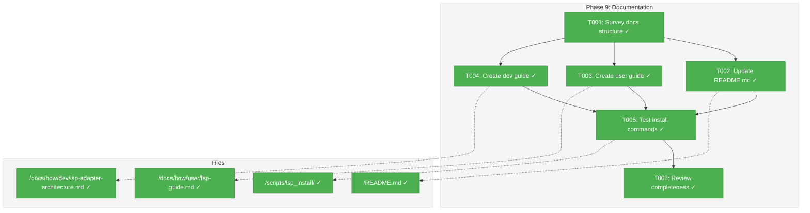
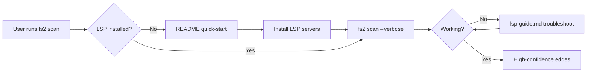
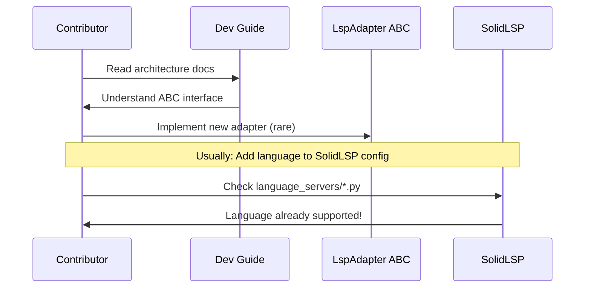

# Phase 9: Documentation – Tasks & Alignment Brief

**Spec**: [../lsp-integration-spec.md](../../lsp-integration-spec.md)
**Plan**: [../lsp-integration-plan.md](../../lsp-integration-plan.md)
**Date**: 2026-01-21

---

## Executive Briefing

### Purpose
This phase creates user and developer documentation for the LSP integration feature, enabling users to install LSP servers, troubleshoot issues, and contributors to extend adapter support for new languages.

### What We're Building
Three documentation artifacts:
1. **README.md section** — Quick-start for users enabling LSP
2. **User guide** (`docs/how/user/lsp-guide.md`) — Installation, troubleshooting, supported languages
3. **Developer guide** (`docs/how/dev/lsp-adapter-architecture.md`) — Architecture, extension points, testing

### User Value
Users can follow clear instructions to enable high-confidence cross-file analysis. Contributors can extend fs2 to support additional languages without reverse-engineering the codebase.

### Example
**Before**: User runs `fs2 scan` and wonders why cross-file method calls aren't resolved.
**After**: README shows install commands, user runs `pip install pyright`, and scan now reports "LSP: 18 call edges detected" with 1.0 confidence.

---

## Objectives & Scope

### Objective
Document LSP integration for users and contributors per plan acceptance criteria:
- README.md updated with getting-started section
- All docs created and complete
- Install commands tested and working
- Target audience can follow guides successfully

### Goals

- ✅ Update README.md with LSP quick-start section
- ✅ Create user guide with installation, troubleshooting, language support
- ✅ Create developer guide with architecture, extension, testing
- ✅ Test all install commands on fresh environment
- ✅ Cross-reference from CLI help and existing docs

### Non-Goals (Scope Boundaries)

- ❌ CI/CD setup for LSP servers (deferred per Insight 4 in plan)
- ❌ Automated installer (users install manually per design)
- ❌ Video tutorials or interactive guides
- ❌ Per-language deep-dive documentation (1 guide covers all)
- ❌ Marketing/promotional content
- ❌ MCP tool documentation for relationships (024 scope, not implemented)

---

## Architecture Map

### Component Diagram
<!-- Status: grey=pending, orange=in-progress, green=completed, red=blocked -->
<!-- Updated by plan-6 during implementation -->



### Task-to-Component Mapping

<!-- Status: ⬜ Pending | 🟧 In Progress | ✅ Complete | 🔴 Blocked -->

| Task | Component(s) | Files | Status | Comment |
|------|-------------|-------|--------|---------|
| T001 | Docs Survey | /docs/how/user/, /docs/how/dev/ | ✅ Complete | Understand existing structure before adding |
| T002 | README.md | /README.md | ✅ Complete | Add LSP Integration section after Installation |
| T003 | User Guide | /docs/how/user/lsp-guide.md | ✅ Complete | Primary user-facing documentation |
| T004 | Dev Guide | /docs/how/dev/lsp-adapter-architecture.md | ✅ Complete | Architecture and extension guide |
| T005 | Install Commands | /scripts/lsp_install/*.sh | ✅ Complete | Verify all commands work in fresh env |
| T006 | Review | All docs | ✅ Complete | Cross-check completeness against plan |

---

## Tasks

| Status | ID | Task | CS | Type | Dependencies | Absolute Path(s) | Validation | Subtasks | Notes |
|--------|------|------|----|------|--------------|------------------|------------|----------|-------|
| [x] | T001 | Survey existing docs/how/ structure | 1 | Setup | – | /workspaces/flow_squared/docs/how/user/, /workspaces/flow_squared/docs/how/dev/ | Structure documented in brief | – | Understand conventions before writing |
| [x] | T002 | Update README.md with LSP quick-start section | 2 | Doc | T001 | /workspaces/flow_squared/README.md | Section appears after Installation, links to guide | – | Use plan template; add to Guides table |
| [x] | T003 | Create docs/how/user/lsp-guide.md | 2 | Doc | T001 | /workspaces/flow_squared/docs/how/user/lsp-guide.md | File exists with all sections: Install, Enable, Verify, Troubleshoot, Languages | – | 40+ languages via SolidLSP |
| [x] | T004 | Create docs/how/dev/lsp-adapter-architecture.md | 2 | Doc | T001 | /workspaces/flow_squared/docs/how/dev/lsp-adapter-architecture.md | File exists: Architecture diagram, ABC interface, extension steps, testing | – | Include Mermaid diagrams |
| [x] | T005 | Test all install commands in fresh environment | 2 | Validation | T002, T003, T004 | /workspaces/flow_squared/scripts/lsp_install/*.sh | Commands succeed; versions verified | – | Run in clean devcontainer |
| [x] | T006 | Review documentation for completeness | 1 | Review | T005 | All docs created | All checklist items satisfied; cross-refs valid | – | Final validation |

---

## Alignment Brief

### Prior Phases Review

This is Phase 9, the final phase. Here is the cumulative context from all prior phases:

#### Phase 0: Environment Preparation (Complete 2026-01-14)
**Deliverables**: LSP server installation scripts
- `/scripts/lsp_install/install_pyright.sh` — Python LSP via npm
- `/scripts/lsp_install/install_gopls.sh` — Go LSP (depends on install_go.sh)
- `/scripts/lsp_install/install_typescript_ls.sh` — TypeScript LSP
- `/scripts/lsp_install/install_dotnet.sh` — .NET SDK for Roslyn
- `/scripts/lsp_install/install_all.sh` — Master orchestrator
- `/scripts/verify-lsp-servers.sh` — Verification script

**Key Learning**: Portable scripts over devcontainer features for CI/Docker/bare metal reuse.

#### Phase 0b: Multi-Project Research (Complete 2026-01-15)
**Deliverables**: Project root detection algorithm
- `/scripts/lsp/detect_project_root.py` — "Deepest wins" algorithm
- 4 test fixtures in `/tests/fixtures/lsp/`
- 31 tests passing

**Key Learning**: Marker files (pyproject.toml, tsconfig.json, go.mod, .csproj) determine project boundaries.

#### Phase 1: Vendor SolidLSP Core (Complete 2026-01-16)
**Deliverables**: ~25K LOC vendored to `/src/fs2/vendors/solidlsp/`
- 60 files including 45+ language server configs
- Stub modules for serena.* and sensai.* dependencies
- Import verification tests (5 tests)
- `THIRD_PARTY_LICENSES` and `VENDOR_VERSION` tracking

**Key Learning**: SolidLSP supports 40+ languages automatically; C# uses Roslyn (auto-downloaded), not OmniSharp.

#### Phase 2: LspAdapter ABC and Exceptions (Complete 2026-01-16)
**Deliverables**: Adapter interface layer
- `LspAdapter` ABC with 5 methods (initialize, shutdown, get_references, get_definition, is_ready)
- `FakeLspAdapter` test double
- `LspAdapterError` hierarchy (NotFound, Crash, Timeout, Initialization)
- `LspConfig` pydantic model
- 15 unit tests

**Key Learning**: Actionable error messages with platform-specific install commands (Discovery 04).

#### Phase 3: SolidLspAdapter Implementation (Complete with review fixes 2026-01-19)
**Deliverables**: Production adapter
- `SolidLspAdapter` wrapping vendored SolidLSP (~500 LOC)
- 7 Pyright integration tests + 9 unit tests
- Type translation helpers (_translate_reference, _translate_definition, _location_to_node_id)

**Key Learnings**:
- Pre-check server binary with `shutil.which()` before invoking SolidLSP
- SolidLSP handles process tree cleanup internally
- `get_definition()` maps to EdgeType.CALLS (call site → definition)

#### Phase 4: Multi-Language LSP Support (Complete 2026-01-20)
**Deliverables**: 4-language test coverage
- `/tests/integration/test_lsp_gopls.py` — 7 tests (skip when not installed)
- `/tests/integration/test_lsp_typescript.py` — 7 tests (passing)
- `/tests/integration/test_lsp_roslyn.py` — 7 tests (skip when not installed)

**Key Learning**: Zero per-language branching achieved — SolidLSP abstracts all differences.

#### Phase 5 & 7: SKIPPED
**Reason**: LSP resolves call sites directly; import enumeration redundant.

#### Phase 6: Node ID and Filename Detection (Complete 2026-01-20)
**Deliverables**: Text reference extraction
- `NodeIdDetector` — explicit `file:`, `method:`, etc. patterns (confidence 1.0)
- `RawFilenameDetector` — bare/backtick filenames (confidence 0.4-0.5)
- `TextReferenceExtractor` — orchestrator with deduplication
- 35 tests, 99% coverage

**Key Learnings**:
- URL pre-filtering critical (5-10% false positive rate otherwise)
- Regex ordering: longest extensions first (tsx before ts)
- Per-line deduplication preserves multi-mention edges

#### Phase 8: Pipeline Integration (Complete 2026-01-21)
**Deliverables**: LSP wired into scan pipeline
- `RelationshipExtractionStage` — orchestrates extractors + LSP
- `StorageStage` extension — persists relationship edges
- `--no-lsp` CLI flag for graceful degradation
- `find_node_at_line()` symbol resolver
- `CodeEdge.target_line` field
- 19 LSP-related tests passing; 22/22 tasks complete

**Key Learnings**:
- LSP adapter MUST be explicitly initialized in CLI
- Storage loop required or edges silently lost
- Symbol resolution: O(n) MVP acceptable for <100 files
- Graceful degradation: text extraction fallback always works

### Critical Findings Affecting This Phase

No blocking critical findings — documentation phase is additive.

**Relevant context from prior phases**:
- **Discovery 01 (Stdout Isolation)**: Not relevant for docs
- **Discovery 04 (Actionable Errors)**: Document error messages and recovery steps in troubleshooting
- **Insight 4 (CI/CD)**: Explicitly out of scope — mention limitation in docs

### ADR Decision Constraints

No ADRs affect this phase.

### Invariants & Guardrails

- All code examples must be copy-pasteable and work
- Install commands must match scripts in `/scripts/lsp_install/`
- No marketing language — focus on technical accuracy
- Cross-references must use relative paths

### Inputs to Read

| File | Purpose |
|------|---------|
| `/workspaces/flow_squared/README.md` | Understand current structure for insertion point |
| `/workspaces/flow_squared/docs/how/user/scanning.md` | Example user guide format |
| `/workspaces/flow_squared/docs/how/dev/adding-services-adapters.md` | Example dev guide format |
| `/workspaces/flow_squared/docs/plans/025-lsp-research/lsp-integration-plan.md` lines 1774-1826 | README template from plan |
| `/workspaces/flow_squared/scripts/lsp_install/*.sh` | Actual install commands to document |

### Visual Alignment Aids

#### Documentation Flow (User Journey)



#### Contributor Extension Flow



### Test Plan

**Documentation-specific validation** (no code tests):

| ID | Test | Method | Expected Outcome |
|----|------|--------|------------------|
| V1 | README install commands | Manual execution | All 4 LSP servers install successfully |
| V2 | fs2 scan with LSP | Manual execution | "LSP: N call edges" in verbose output |
| V3 | Troubleshooting steps | Simulate failure | Steps resolve common issues |
| V4 | Dev guide extension steps | Code review | Steps are accurate and sufficient |
| V5 | Cross-references | Link check | All relative links resolve |
| V6 | Code examples | Copy-paste | Examples execute without error |

### Step-by-Step Implementation Outline

1. **T001**: Survey existing docs
   - Read `/docs/how/user/scanning.md` for format conventions
   - Read `/docs/how/dev/adding-services-adapters.md` for dev guide patterns
   - Note TOC structure, code block formatting, cross-reference style

2. **T002**: Update README.md
   - Insert LSP section after "Installation" (line ~66-68)
   - Add "LSP Integration" row to Guides table (line ~70-77)
   - Use plan template (lines 1774-1813) with adjustments:
     - Update install commands to match actual scripts
     - Remove OmniSharp reference (Roslyn is default)
     - Add `--verbose` verification step

3. **T003**: Create user guide
   - Structure: Overview → Installation → Enable → Verify → Troubleshoot → Supported Languages
   - Installation: Per-language sections with exact commands from scripts
   - Troubleshooting: Common errors with resolution (server not found, timeout, crash)
   - Languages: List 40+ with status (tested: Python, TypeScript, Go, C#; untested: others)

4. **T004**: Create dev guide
   - Structure: Overview → Architecture → ABC Interface → Testing → Extension
   - Architecture: Mermaid diagram showing LspAdapter → SolidLspAdapter → SolidLSP → LSP servers
   - ABC: Document 5 methods with signatures and contracts
   - Testing: Link to test files, explain TDD approach
   - Extension: Usually just check if SolidLSP supports the language already

5. **T005**: Test install commands
   - Use fresh devcontainer or `docker run -it python:3.12-slim`
   - Execute each install script
   - Verify with `/scripts/verify-lsp-servers.sh`
   - Update docs if any commands changed

6. **T006**: Review completeness
   - Check all plan acceptance criteria
   - Verify cross-references
   - Ensure no broken links

### Commands to Run

```bash
# Check existing docs structure
ls -la docs/how/user/ docs/how/dev/

# View current README structure
head -100 README.md

# View install scripts for accurate commands
cat scripts/lsp_install/install_pyright.sh
cat scripts/lsp_install/install_gopls.sh
cat scripts/lsp_install/install_typescript_ls.sh
cat scripts/lsp_install/install_dotnet.sh

# Verify LSP servers (after install)
./scripts/verify-lsp-servers.sh

# Test scan with LSP
fs2 scan . --verbose 2>&1 | grep -i lsp

# Validate markdown links (if available)
# npx markdown-link-check README.md docs/how/user/lsp-guide.md
```

### Risks / Unknowns

| Risk | Severity | Mitigation |
|------|----------|------------|
| Install commands outdated | Low | T005 validates in fresh env |
| SolidLSP supports more languages than tested | Low | Document as "supported but untested" |
| Roslyn auto-download behavior undocumented | Medium | Test and document in troubleshooting |
| User confusion between OmniSharp and Roslyn | Medium | Explicitly state "Roslyn (not OmniSharp)" |

### Ready Check

- [ ] Prior phases review complete (synthesized above)
- [ ] Inputs identified (README, existing guides, plan template, scripts)
- [ ] Visual aids created (flow diagrams)
- [ ] Test plan defined (6 validation checks)
- [ ] Risks identified and mitigated
- [ ] ADR constraints mapped to tasks (N/A - no ADRs)

---

## Phase Footnote Stubs

<!-- Populated by plan-6 during implementation -->

| Footnote | Phase | Description | References |
|----------|-------|-------------|------------|
| | | | |

---

## Evidence Artifacts

**Execution log**: `./execution.log.md` (created by plan-6)

**Supporting files** (if needed):
- Screenshots of LSP working
- Fresh environment test logs

---

## Discoveries & Learnings

_Populated during implementation by plan-6. Log anything of interest to your future self._

| Date | Task | Type | Discovery | Resolution | References |
|------|------|------|-----------|------------|------------|
| | | | | | |

**Types**: `gotcha` | `research-needed` | `unexpected-behavior` | `workaround` | `decision` | `debt` | `insight`

**What to log**:
- Things that didn't work as expected
- External research that was required
- Implementation troubles and how they were resolved
- Gotchas and edge cases discovered
- Decisions made during implementation
- Technical debt introduced (and why)
- Insights that future phases should know about

_See also: `execution.log.md` for detailed narrative._

---

## Directory Layout

```
docs/plans/025-lsp-research/
  ├── lsp-integration-plan.md
  ├── lsp-integration-spec.md
  └── tasks/
      ├── phase-0-environment-preparation/
      ├── phase-0b-multi-project-research/
      ├── phase-1-vendor-solidlsp-core/
      ├── phase-2-lsp-adapter-abc/
      ├── phase-3-solidlspadapter-implementation/
      ├── phase-4-multi-language-lsp-support/
      ├── phase-6-node-id-detection/
      ├── phase-8-pipeline-integration/
      └── phase-9-documentation/
          ├── tasks.md              # This file
          └── execution.log.md      # Created by plan-6
```
