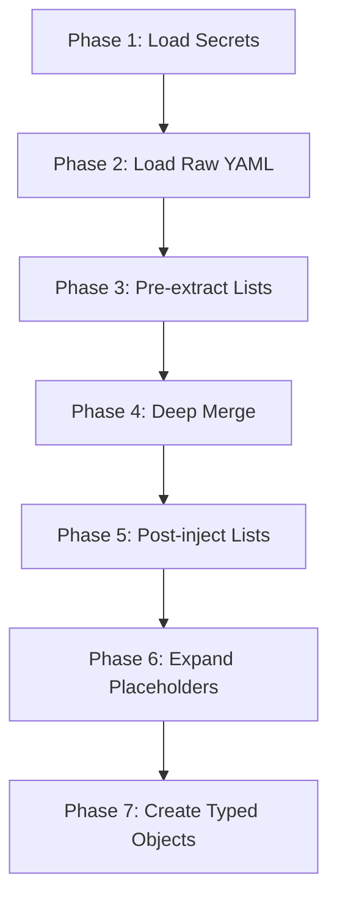

# Research Report: Streamlit Web UI for fs2 Configuration and Graph Management

**Generated**: 2026-01-15
**Research Query**: "Web UI based in Streamlit for browsing repos, running queries, and especially setup/configuration process"
**Mode**: Plan-Associated
**Location**: `docs/plans/026-web/research-dossier.md`
**FlowSpace**: Available
**Findings**: 65+ findings from 7 parallel subagents

---

## Executive Summary

### What It Does
fs2 is a code intelligence tool with CLI and MCP interfaces. The proposed web UI will provide a user-friendly Streamlit interface for configuration management, graph browsing, and query execution.

### Business Purpose
First-time users struggle with complex YAML configuration (LLM providers, embeddings, multi-graph setup). A web UI with wizards and live validation will dramatically reduce onboarding friction and configuration errors.

### Key Insights
1. **Configuration is multi-source with 7-phase loading** - User YAML → Project YAML → Environment Variables → Secret files, with placeholder expansion and list concatenation
2. **Doctor command already validates configuration** - Existing validation logic can be reused for web UI diagnostics
3. **Clean Architecture enables easy adapter swapping** - ConsoleAdapter pattern means web UI can implement a StreamlitDisplayAdapter following existing patterns

### Quick Stats
- **Config Sections**: 8 typed Pydantic models (LLM, Embedding, Graph, Scan, SmartContent, Search, Watch, OtherGraphs)
- **CLI Commands**: 8 main commands (init, scan, tree, search, get-node, list-graphs, mcp, doctor)
- **Services**: GraphService, TreeService, SearchService, EmbeddingService, SmartContentService, LLMService
- **Prior Learnings**: 15 critical discoveries from previous implementations
- **Test Coverage**: Comprehensive with fake adapters, CLI runner tests, integration tests

---

## How Configuration Currently Works

### Entry Points for Configuration

| Entry Point | Type | Location | Purpose |
|------------|------|----------|---------|
| `fs2 init` | CLI | `src/fs2/cli/init.py` | Creates `.fs2/config.yaml` and `~/.config/fs2/config.yaml` |
| `fs2 doctor` | CLI | `src/fs2/cli/doctor.py` | Validates and displays configuration health |
| `FS2ConfigurationService` | Service | `src/fs2/config/service.py` | Loads and merges all config sources |

### Configuration Loading Pipeline (7 Phases)



**Phase Details**:
1. **Load Secrets**: `secrets.env` files loaded into `os.environ` (user → project → .env)
2. **Load Raw YAML**: Read from `~/.config/fs2/config.yaml` and `.fs2/config.yaml`
3. **Pre-extract Lists**: Pull lists from `CONCATENATE_LIST_PATHS` (e.g., `other_graphs.graphs`)
4. **Deep Merge**: User → Project → Env vars (later wins)
5. **Post-inject Lists**: Concatenate lists with deduplication (project shadows user with warning)
6. **Expand Placeholders**: Replace `${VAR}` with `os.environ[VAR]`
7. **Create Typed Objects**: Instantiate Pydantic models from `YAML_CONFIG_TYPES`

### Configuration File Locations

| File | Purpose | Priority |
|------|---------|----------|
| `~/.config/fs2/config.yaml` | User global settings | Lowest |
| `~/.config/fs2/secrets.env` | User secrets | Low |
| `./.fs2/config.yaml` | Project settings | Medium |
| `./.fs2/secrets.env` | Project secrets | High |
| `./.env` | Working directory secrets | Highest |

### Environment Variable Pattern
```
FS2_{SECTION}__{FIELD}=value
FS2_LLM__PROVIDER=azure
FS2_EMBEDDING__BATCH_SIZE=32
```

---

## Configuration Contracts (All Sections)

### LLM Configuration (`llm:`)
```yaml
llm:
  provider: azure  # Required: azure | openai | fake
  api_key: ${AZURE_OPENAI_API_KEY}  # Must use ${VAR} syntax
  base_url: https://instance.openai.azure.com/  # Required for azure
  azure_deployment_name: gpt-4  # Required for azure
  azure_api_version: "2024-12-01-preview"  # Required for azure
  model: gpt-4  # Optional, for logging
  temperature: 0.1  # Default: 0.1
  max_tokens: 1024  # Default: 1024
  timeout: 30  # Range: 1-120 seconds
```

**Validation Rules**:
- `api_key`: Rejects literal `sk-*` prefix (OpenAI format); must use `${ENV_VAR}` placeholders
- `timeout`: Must be 1-120 seconds
- When `provider=azure`: `base_url`, `azure_deployment_name`, and `azure_api_version` are required

### Embedding Configuration (`embedding:`)
```yaml
embedding:
  mode: azure  # azure | openai_compatible | fake
  dimensions: 1024  # Must be > 0
  batch_size: 16  # Range: 1-2048 (Azure API limit)
  max_concurrent_batches: 1  # Must be >= 1
  max_retries: 3
  base_delay: 2.0  # Must be > 0
  max_delay: 60.0  # Must be >= base_delay

  # Per-content-type chunking
  code:
    max_tokens: 4000
    overlap_tokens: 50
  documentation:
    max_tokens: 4000
    overlap_tokens: 120
  smart_content:
    max_tokens: 8000
    overlap_tokens: 0

  azure:
    endpoint: https://resource.openai.azure.com/
    api_key: ${FS2_AZURE_EMBEDDING_API_KEY}
    deployment_name: text-embedding-3-small
    api_version: "2024-02-01"
```

### Multi-Graph Configuration (`other_graphs:`)
```yaml
other_graphs:
  graphs:
    - name: shared-lib  # Required, unique, not "default" (reserved)
      path: ~/projects/shared/.fs2/graph.pickle  # Supports ~, absolute, relative
      description: Shared utilities
      source_url: https://github.com/org/shared
```

**Path Resolution**:
- Absolute paths: Used as-is
- Tilde paths (`~/...`): Expanded via `Path.expanduser()`
- Relative paths: Resolved from config file's directory (`_source_dir`)

### Scan Configuration (`scan:`)
```yaml
scan:
  scan_paths:
    - ./src
    - ./lib
  max_file_size_kb: 500  # Must be > 0
  respect_gitignore: true
  follow_symlinks: false
  sample_lines_for_large_files: 1000
```

### Smart Content Configuration (`smart_content:`)
```yaml
smart_content:
  max_workers: 50  # Must be >= 1
  max_input_tokens: 50000  # Must be >= 1
  token_limits:
    file: 200
    type: 200
    callable: 150
    section: 150
    block: 150
    definition: 150
    statement: 100
    expression: 100
    other: 100
```

### Search Configuration (`search:`)
```yaml
search:
  default_limit: 20  # Must be >= 1
  min_similarity: 0.25  # Range: 0.0-1.0
  regex_timeout: 2.0  # Must be > 0
  parent_penalty: 0.25  # Range: 0.0-1.0
```

### Graph Configuration (`graph:`)
```yaml
graph:
  graph_path: ".fs2/graph.pickle"  # Default path
```

---

## Architecture & Design Patterns

### PS-01: Adapter Pattern with ABC Interfaces

**Convention**:
- **ABC Definition**: `{name}_adapter.py` (e.g., `console_adapter.py`)
- **Implementation**: `{name}_adapter_{impl}.py` (e.g., `console_adapter_rich.py`)
- **Fake for Testing**: `{name}_adapter_fake.py`

**Key Characteristics**:
- No external SDK types leak into services
- Constructor receives `ConfigurationService` registry
- Adapter calls `config.require(SpecificConfig)` internally
- Implementations return domain types, raise domain exceptions only

**For Web UI**: Create `DisplayAdapter` ABC with `StreamlitDisplayAdapter` implementation.

### PS-02: Configuration Registry Pattern

Services receive the full `ConfigurationService` registry, not individual configs:

```python
class MyService:
    def __init__(self, config: ConfigurationService):
        self._llm_config = config.require(LLMConfig)  # Raises if missing
        self._embedding_config = config.get(EmbeddingConfig)  # Returns None if missing
```

### PS-03: Domain Exception Hierarchy

```
AdapterError (base)
├── AuthenticationError
├── AdapterConnectionError
├── GraphStoreError
│   ├── UnknownGraphError
│   └── GraphFileNotFoundError
├── LLMAdapterError
│   ├── LLMAuthenticationError
│   ├── LLMRateLimitError
│   └── LLMContentFilterError
└── EmbeddingAdapterError
    └── EmbeddingRateLimitError (with retry_after metadata)
```

**Error Message Pattern**: "What happened → How to fix it"

### PS-04: Pydantic Configuration Models

```python
class EmbeddingConfig(BaseModel):
    __config_path__: ClassVar[str] = "embedding"  # YAML path for auto-loading

    batch_size: int = 16

    @field_validator("batch_size")
    @classmethod
    def validate_batch_size(cls, v: int) -> int:
        if v < 1 or v > 2048:
            raise ValueError("batch_size must be 1-2048 (Azure API limit)")
        return v
```

### PS-05: ConsoleAdapter Methods (to replicate in Streamlit)

| Console Method | Streamlit Equivalent |
|----------------|---------------------|
| `print_success(msg)` | `st.success(msg)` |
| `print_error(msg)` | `st.error(msg)` |
| `print_warning(msg)` | `st.warning(msg)` |
| `print_info(msg)` | `st.info(msg)` |
| `stage_banner(title)` | `st.header(title)` |
| `panel(content, title)` | `st.expander(title)` |
| `print_progress(msg)` | `st.progress()` / `st.info()` |

### PS-06: Thread-Safe Caching with Staleness Detection

GraphService uses double-checked locking with mtime/size staleness detection:

```python
def get_graph(self, name: str = "default") -> GraphStore:
    path = self._get_graph_path(name)

    if not self._is_stale(name, path):
        return self._cache[name].store

    with self._lock:
        if not self._is_stale(name, path):
            return self._cache[name].store
        return self._load_graph(name, path)
```

---

## Key Services and Dependencies

### Service Dependency Flow

```
FS2ConfigurationService
    │
    ├─► GraphService ─► NetworkXGraphStore
    │       │
    │       └─► get_graph(name) → GraphStore
    │
    ├─► TreeService ─► GraphStore
    │       │
    │       └─► build_tree(pattern, max_depth) → list[TreeNode]
    │
    ├─► SearchService ─► GraphStore + EmbeddingAdapter
    │       │
    │       └─► search(pattern, mode) → SearchEnvelope
    │
    ├─► EmbeddingService ─► EmbeddingAdapter + TokenCounter
    │       │
    │       └─► process_batch(nodes) → dict[str, CodeNode]
    │
    ├─► SmartContentService ─► LLMService + TemplateService
    │       │
    │       └─► generate_smart_content(nodes) → list[CodeNode]
    │
    └─► ScanPipeline ─► All above services
            │
            └─► run() → ScanSummary
```

### Adapter Factories

```python
# LLM
def create_llm_adapter(config: ConfigurationService) -> LLMAdapter:
    llm_config = config.require(LLMConfig)
    if llm_config.provider == "azure":
        return AzureOpenAIAdapter(config)
    elif llm_config.provider == "openai":
        return OpenAIAdapter(config)
    else:
        return FakeLLMAdapter()

# Embedding
def create_embedding_adapter_from_config(config: ConfigurationService) -> EmbeddingAdapter | None:
    embedding_config = config.get(EmbeddingConfig)
    if embedding_config is None:
        return None
    if embedding_config.mode == "azure":
        return AzureEmbeddingAdapter(config)
    elif embedding_config.mode == "fake":
        return FakeEmbeddingAdapter(embedding_config.dimensions)
    return None
```

---

## Prior Learnings (From Previous Implementations)

### PL-01: Config Loading Must Never Mutate Global State
**Source**: `docs/plans/017-doctor/tasks/phase-1-implementation/tasks.md`
**Type**: gotcha

**What They Found**:
> `load_secrets_to_env()` mutates global `os.environ` when called, causing test pollution and side effects.

**How They Resolved**:
> Use `dotenv_values()` read-only function instead; never call `load_secrets_to_env()` in doctor command.

**Action for Web UI**:
Create a **read-only config inspection API** that doesn't modify `os.environ`. Web UI must display config state without side effects.

---

### PL-02: Deep Merge Doesn't Track Source Attribution
**Source**: `docs/plans/017-doctor/tasks/phase-1-implementation/tasks.md`
**Type**: unexpected-behavior

**What They Found**:
> When merging configs from multiple sources, the merge operation loses track of which value came from which source.

**How They Resolved**:
> Load configs separately and compare values manually to identify which source won each key.

**Action for Web UI**:
Config UI must show **(value, source)** pairs - "This value came from project config, overriding user config". Essential for user trust.

---

### PL-03: Git Detection False-Positives on Worktrees
**Source**: `docs/plans/017-doctor/tasks/phase-1-implementation/tasks.md`
**Type**: gotcha

**What They Found**:
> Checking `Path(".git").is_dir()` returns False for git worktrees and submodules where `.git` is a file, not a directory.

**How They Resolved**:
> Use `Path(".git").exists()` instead to handle both files and directories.

**Action for Web UI**:
Always use `.exists()` for git detection, not `.is_dir()`.

---

### PL-04: CLI Guard Ordering - Mkdir Must Come After Guard
**Source**: `docs/plans/017-doctor/tasks/phase-1-implementation/tasks.md`
**Type**: unexpected-behavior

**What They Found**:
> The `scan` command creates `.fs2/` directory via `graph_path.parent.mkdir()` before checking if the project is initialized.

**How They Resolved**:
> Ensure guard decorator runs FIRST before any directory creation.

**Action for Web UI**:
Setup wizard must prevent accidental initialization in wrong directory.

---

### PL-05: Typer Callbacks Block --help Display
**Source**: `docs/plans/017-doctor/tasks/phase-1-implementation/tasks.md`
**Type**: gotcha

**What They Found**:
> If CLI guard is implemented as a Typer callback, it runs for ALL command invocations including `--help`, blocking help output.

**How They Resolved**:
> Use `@require_init` decorator on individual commands instead of global callback.

**Action for Web UI**:
CLI pattern: Always use decorators for guards, not callbacks.

---

### PL-06: CLI vs MCP Singletons Behave Differently
**Source**: `docs/plans/023-multi-graphs/tasks/phase-4-cli-integration/tasks.md`
**Type**: insight

**What They Found**:
> MCP tools get stateful singletons with caching (long-lived process). CLI gets fresh instances per invocation (short-lived).

**How They Resolved**:
> CLI creates fresh GraphService per command invocation; no caching benefit but consistent error handling.

**Action for Web UI**:
Streamlit sessions should reload config each time (stateless per request). Don't optimize for caching in stateless contexts.

---

### PL-07: Error Message UX Must Be Centralized
**Source**: `docs/plans/023-multi-graphs/tasks/phase-4-cli-integration/tasks.md`
**Type**: decision

**What They Found**:
> Different error paths produce different messages if handled separately.

**How They Resolved**:
> Centralize all error handling in one utility (`resolve_graph_from_context()`). Each error includes: what went wrong, why, and how to fix it.

**Action for Web UI**:
Create unified error display component. All config errors follow format: **Problem → Cause → Fix**.

---

### PL-08: Mutual Exclusivity Needs Clear Error Messages
**Source**: `docs/plans/023-multi-graphs/tasks/phase-4-cli-integration/tasks.md`
**Type**: decision

**What They Found**:
> When two options are mutually exclusive (`--graph-file` and `--graph-name`), users need VERY clear message about which to use and why.

**How They Resolved**:
> Error message format: "Cannot use both X and Y. Use X for one-off paths, Y for configured graphs."

**Action for Web UI**:
Validation errors should include not just "invalid" but rationale for the constraint.

---

### PL-09: Placeholder Expansion Has Two-Stage Validation
**Source**: `docs/plans/002-project-skele/tasks/phase-1-configuration-system/tasks.md`
**Type**: research-needed

**What They Found**:
> Pydantic `@field_validator` runs BEFORE `@model_validator`. Field validator sees `${VAR}` placeholder, model validator expands it, but need re-validation after expansion.

**How They Resolved**:
> Two-stage validation with shared `_is_literal_secret()` helper. Field validator allows placeholders, model validator re-validates after expansion.

**Action for Web UI**:
Show THREE states in config UI: (1) `${VAR}` placeholder, (2) resolved actual-value, (3) `${MISSING}` unresolved error.

---

### PL-10: Environment Variable Prefix Must Use Uppercase with Delimiter
**Source**: `docs/plans/002-project-skele/tasks/phase-1-configuration-system/tasks.md`
**Type**: gotcha

**What They Found**:
> Pydantic-settings env prefix is case-sensitive and delimiter matters.

**How They Resolved**:
> Configure `env_prefix='FS2_'` and `env_nested_delimiter='__'` in SettingsConfigDict.

**Action for Web UI**:
Config UI should show exact env var names with proper casing/delimiter. Example: `FS2_AZURE__OPENAI__API_KEY`.

---

### PL-11: Literal Secret Detection Has Field-Level Scope
**Source**: `docs/plans/002-project-skele/tasks/phase-1-configuration-system/tasks.md`
**Type**: insight

**What They Found**:
> Security validator `@field_validator('api_key')` is field-scoped. A 100-char string in `endpoint` field passes, but same length in `api_key` field fails.

**How They Resolved**:
> Only apply secret detection to actual secret-bearing fields (api_key, etc).

**Action for Web UI**:
Config UI secret detection should follow field-level rules, not blanket length checks.

---

### PL-12: Monkeypatch Environment Must Happen AFTER .env Load
**Source**: `docs/plans/002-project-skele/tasks/phase-1-configuration-system/tasks.md`
**Type**: gotcha

**What They Found**:
> `.env` file is loaded at module import time. If test uses `monkeypatch.setenv()` later, the timing depends on precedence rules.

**How They Resolved**:
> Load `.env` at import with `override=False`, which allows test's `monkeypatch.setenv()` to win.

**Action for Web UI**:
If implementing config UI in tests, use fixture to clear all `FS2_*` env vars before each test.

---

### PL-13: Example Config Location Creates Clarity Issue
**Source**: `docs/plans/002-project-skele/tasks/phase-1-configuration-system/tasks.md`
**Type**: unexpected-behavior

**What They Found**:
> Placing example config at `.fs2/config.yaml.example` creates a real `.fs2/` directory that looks like actual config location.

**How They Resolved**:
> Add `.gitignore` rules: ignore `config.yaml`, don't ignore `config.yaml.example`.

**Action for Web UI**:
Setup wizard should guide users: "Copy this template, customize it, save to `.fs2/config.yaml`".

---

### PL-14: Multi-Graph Config Requires Path Resolution Context
**Source**: `docs/plans/023-multi-graphs/tasks/phase-1-config-model/tasks.md`
**Type**: insight

**What They Found**:
> When resolving paths in configs, must track which config file the path came from, because relative paths resolve differently from user's home vs project root.

**How They Resolved**:
> Add `_source_dir` PrivateAttr to track config origin, use in path resolution logic.

**Action for Web UI**:
Config UI showing graph paths must know: is this a relative path? Relative to where?

---

### PL-15: Doctor Command Pattern = Diagnostic + Wizard Modes
**Source**: `docs/plans/017-doctor/doctor-spec.md`
**Type**: insight

**What They Found**:
> Users need to understand their configuration state before they can troubleshoot. A setup wizard would be the preventative version.

**How They Resolved**:
> Doctor shows current state; wizard guides initial setup. Both follow same validation rules.

**Action for Web UI**:
Design config UI with **two modes**: "Doctor Mode" (diagnostic, read-only) and "Wizard Mode" (setup, interactive).

---

## Prior Learnings Summary

| ID | Type | Source Plan | Key Insight | Action |
|----|------|-------------|-------------|--------|
| PL-01 | gotcha | 017-doctor | Config loading mutates os.environ | Use read-only inspection API |
| PL-02 | unexpected | 017-doctor | Merge loses source attribution | Show (value, source) pairs |
| PL-03 | gotcha | 017-doctor | .git can be file not dir | Use .exists() not .is_dir() |
| PL-04 | unexpected | 017-doctor | Mkdir before guard runs | Guard must run first |
| PL-05 | gotcha | 017-doctor | Callback blocks --help | Use decorators for guards |
| PL-06 | insight | 023-multi-graphs | CLI vs MCP singleton diff | Reload config per request |
| PL-07 | decision | 023-multi-graphs | Error messages inconsistent | Centralize error handling |
| PL-08 | decision | 023-multi-graphs | Mutex validation unclear | Include rationale in errors |
| PL-09 | research | 002-project-skele | Two-stage placeholder expansion | Show 3 states: placeholder/resolved/error |
| PL-10 | gotcha | 002-project-skele | Env var naming rules | Show exact env var names |
| PL-11 | insight | 002-project-skele | Secret detection is field-scoped | Only check secret fields |
| PL-12 | gotcha | 002-project-skele | .env load timing | Clear FS2_* in test fixtures |
| PL-13 | unexpected | 002-project-skele | Example config creates .fs2/ | Guide user to copy template |
| PL-14 | insight | 023-multi-graphs | Relative path resolution context | Track _source_dir for paths |
| PL-15 | insight | 017-doctor | Doctor vs Wizard modes | Implement both modes in UI |

---

## Testing Patterns for Web UI

### QT-01: Fixture-Based Test Architecture
Use `TestContext` fixture with pre-configured fakes:
```python
def test_context():
    config = FakeConfigurationService(LogAdapterConfig(min_level="DEBUG"))
    return TestContext(config=config, logger=FakeLogAdapter(config))
```

### QT-02: Fake Test Doubles (Not Mocks)
Implement test doubles as real interface implementations:
```python
class FakeGraphStore(GraphStore):
    def __init__(self, config):
        self._nodes = {}
        self._call_history = []  # Track calls for assertions
        self.simulate_error_for = set()  # Inject errors
```

### QT-03: CLI Testing with CliRunner
```python
from typer.testing import CliRunner
runner = CliRunner()

def test_scan_success(simple_project, monkeypatch):
    monkeypatch.chdir(simple_project)
    monkeypatch.setenv("NO_COLOR", "1")
    result = runner.invoke(app, ["scan"])
    assert result.exit_code == 0
```

### QT-04: Session-Scoped Real Graph Fixtures
Pre-scan real Python/Go/Java code once per test session for realistic integration tests.

---

## Modification Considerations

### Safe to Implement
1. **New `fs2 web` CLI command** - Follows existing command pattern
2. **StreamlitDisplayAdapter** - Implements existing ABC
3. **UIConfig Pydantic model** - Follows config object pattern
4. **Config inspection API** - Read-only, no side effects
5. **Backup service** - New functionality, no conflicts

### Modify with Caution
1. **FS2ConfigurationService** - Core to everything; add read-only methods only
2. **Doctor validation logic** - Reuse but don't modify for web
3. **Graph path resolution** - Complex relative path handling

### Danger Zones
1. **`load_secrets_to_env()`** - Never call from web UI (mutates global state)
2. **Config file writes without backup** - Must implement backup system first
3. **Singleton services** - Streamlit sessions need isolation

---

## Recommended Web UI Architecture

### Proposed Directory Structure
```
src/fs2/
├── web/                          # New web UI module
│   ├── __init__.py
│   ├── app.py                    # Streamlit main app
│   ├── pages/
│   │   ├── 1_Dashboard.py        # Home with doctor output
│   │   ├── 2_Graphs.py           # Graph browser
│   │   ├── 3_Configuration.py    # Configuration editor
│   │   ├── 4_Setup_Wizard.py     # Setup wizards
│   │   └── 5_Search.py           # Search/tree interface
│   ├── components/
│   │   ├── config_editor.py      # YAML editor with validation
│   │   ├── doctor_panel.py       # Doctor output display
│   │   ├── graph_card.py         # Graph info cards
│   │   ├── wizard_steps.py       # Wizard step components
│   │   └── source_badge.py       # Config source attribution
│   └── services/
│       ├── config_inspector.py   # Read-only config inspection
│       ├── backup_service.py     # Config backup management
│       └── test_connection.py    # Provider connectivity tests
├── cli/
│   └── web.py                    # New `fs2 web` command
└── config/
    └── objects.py                # Add UIConfig model
```

### Key Services to Create

#### ConfigInspectorService
Read-only config analysis with source attribution:
```python
class ConfigInspectorService:
    def inspect(self) -> ConfigInspection:
        """Return config values with their sources, without mutating os.environ."""
        user_raw = self._load_yaml_readonly(get_user_config_dir() / "config.yaml")
        project_raw = self._load_yaml_readonly(get_project_config_dir() / "config.yaml")
        env_raw = self._parse_env_vars_readonly()

        return ConfigInspection(
            user=user_raw,
            project=project_raw,
            env=env_raw,
            merged=self._compute_merged(user_raw, project_raw, env_raw),
            attribution=self._compute_attribution(user_raw, project_raw, env_raw),
        )
```

#### ConfigBackupService
Manages timestamped backups:
```python
class ConfigBackupService:
    def backup(self, config_path: Path) -> Path:
        """Create timestamped backup before editing."""
        backup_dir = Path.home() / ".config" / "fs2" / "config_bak"
        backup_dir.mkdir(parents=True, exist_ok=True)

        timestamp = datetime.now().strftime("%Y%m%d_%H%M%S")
        backup_path = backup_dir / f"{config_path.name}.{timestamp}.bak"
        shutil.copy2(config_path, backup_path)
        return backup_path

    def list_backups(self) -> list[BackupInfo]:
        """List all available backups with timestamps."""
        ...

    def restore(self, backup_path: Path, target_path: Path) -> None:
        """Restore a specific backup."""
        ...
```

#### TestConnectionService
Validates provider credentials:
```python
class TestConnectionService:
    async def test_llm(self, config: LLMConfig) -> ConnectionTestResult:
        """Test LLM provider connectivity."""
        try:
            adapter = create_llm_adapter_from_config(config)
            response = await adapter.generate("Hello", max_tokens=5)
            return ConnectionTestResult(success=True, latency_ms=response.latency_ms)
        except LLMAuthenticationError as e:
            return ConnectionTestResult(success=False, error="Invalid credentials")
        except Exception as e:
            return ConnectionTestResult(success=False, error=str(e))

    async def test_embedding(self, config: EmbeddingConfig) -> ConnectionTestResult:
        """Test embedding provider connectivity."""
        ...
```

### CLI Command
```python
# src/fs2/cli/web.py
import typer
import subprocess
import webbrowser
from pathlib import Path

@app.command()
def web(
    port: int = typer.Option(8501, help="Server port"),
    host: str = typer.Option("localhost", help="Server host"),
    no_browser: bool = typer.Option(False, help="Don't open browser"),
) -> None:
    """Launch Streamlit web UI for fs2 configuration and exploration."""
    app_path = Path(__file__).parent.parent / "web" / "app.py"

    cmd = [
        "streamlit", "run", str(app_path),
        "--server.port", str(port),
        "--server.address", host,
    ]

    process = subprocess.Popen(cmd)

    if not no_browser:
        webbrowser.open(f"http://{host}:{port}")

    try:
        process.wait()
    except KeyboardInterrupt:
        process.terminate()
```

### UIConfig Model
```python
# Add to src/fs2/config/objects.py
class UIConfig(BaseModel):
    """Configuration for Streamlit web UI."""
    __config_path__: ClassVar[str] = "ui"

    port: int = 8501
    host: str = "localhost"
    theme: Literal["light", "dark", "auto"] = "auto"
    show_advanced: bool = False

    @field_validator("port")
    @classmethod
    def validate_port(cls, v: int) -> int:
        if v < 1024 or v > 65535:
            raise ValueError("port must be 1024-65535")
        return v
```

---

## User Requirements Mapping

| Requirement | Implementation |
|-------------|----------------|
| `fs2 web` launches Streamlit and opens browser | CLI command with subprocess + webbrowser |
| See all graphs (default + other_graphs) | GraphService.list_graphs() + card display |
| Add existing repo with .fs2 | Path input → validate .fs2/config.yaml exists → add to other_graphs |
| Add new path (run fs2 init) | Path input → subprocess fs2 init → add to other_graphs |
| Distinguish REPO vs standalone graph | Check if graph path has sibling config.yaml |
| Edit repo config (scan_paths, etc.) | ConfigEditor component for .fs2/config.yaml |
| Update ~/.config/fs2/config.yaml | ConfigEditor with backup before save |
| Setup wizards (Azure LLM, OpenAI, etc.) | Multi-step wizard forms with validation |
| Test connection buttons | TestConnectionService with async tests |
| Show doctor output after every turn | DoctorPanel component using doctor validation |
| Config editor with field documentation | YAML editor with field-level help from docs |
| Show which file is being edited | Copyable path badge at top of editor |
| Save with backup | ConfigBackupService.backup() before write |
| Show composed/final config | ConfigInspectorService.merged view |
| Secrets show as "present" not value | Mask API keys, show "[SET]" or "[MISSING]" |

---

## External Research Opportunities

### Research Opportunity 1: Streamlit Best Practices for Configuration UIs

**Why Needed**: Building production-quality config editors with validation, undo, and backup requires patterns not obvious from Streamlit docs.

**Ready-to-use prompt**:
```
/deepresearch "Best practices for building configuration management UIs in Streamlit 2024-2025:
- Form validation with real-time feedback
- YAML editor components with syntax highlighting
- Undo/redo state management
- File backup strategies
- Session state for multi-page apps
- Authentication if needed
Context: Building config UI for Python CLI tool with Pydantic models"
```

**Results location**: Save results to `docs/plans/026-web/external-research/streamlit-config-ui.md`

---

### Research Opportunity 2: Secure Secret Handling in Web UIs

**Why Needed**: Config contains API keys that must be handled securely (display masked, save to env files, never log).

**Ready-to-use prompt**:
```
/deepresearch "Secure secret/credential handling in Streamlit web applications:
- Masking sensitive fields in forms
- Secure storage patterns (environment files vs keyring)
- Preventing accidental logging of secrets
- Best practices for API key input forms
Context: Configuration UI where users enter Azure/OpenAI API keys"
```

**Results location**: Save results to `docs/plans/026-web/external-research/secret-handling.md`

---

## Implementation Roadmap

### Phase 1: Foundation
- Create `src/fs2/web/` directory structure
- Add `UIConfig` to config objects
- Implement `ConfigInspectorService` (read-only)
- Create basic Streamlit app skeleton
- Add `fs2 web` CLI command

### Phase 2: Doctor Integration
- Port doctor validation to web display
- Create `DoctorPanel` component
- Show config health on dashboard

### Phase 3: Configuration Editor
- Implement YAML editor with validation
- Add source attribution display
- Create backup service
- Implement save with backup
- Show file path being edited

### Phase 4: Setup Wizards
- Azure LLM wizard
- OpenAI wizard (LLM + embeddings)
- Azure embedding wizard
- Test connection buttons

### Phase 5: Graph Management
- Graph list with availability status
- Add existing repo (has .fs2)
- Initialize new repo (run fs2 init)
- Edit repo config.yaml
- Distinguish REPO vs standalone

### Phase 6: Search/Browse
- Tree explorer with pattern input
- Search interface (text/regex/semantic)
- Node inspector with source display

---

## Next Steps

1. **Run external research** (optional): Execute `/deepresearch` prompts above for Streamlit patterns
2. **Create specification**: Run `/plan-1b-specify "Streamlit web UI for fs2 configuration and graph management"`
3. **Architect the solution**: Run `/plan-3-architect` to create phased implementation plan

---

**Research Complete**: 2026-01-15
**Report Location**: `docs/plans/026-web/research-dossier.md`
