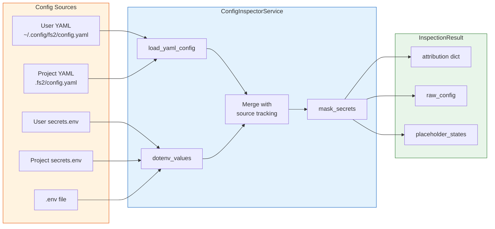
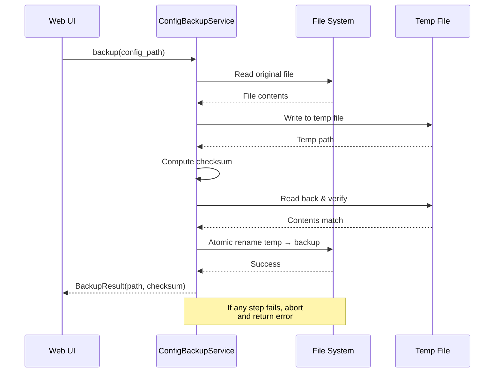

# Phase 1: Foundation – Tasks & Alignment Brief

**Spec**: [../../web-spec.md](../../web-spec.md)
**Plan**: [../../web-plan.md](../../web-plan.md)
**Date**: 2026-01-15
**Phase Slug**: `phase-1-foundation`

---

## Executive Briefing

### Purpose
This phase establishes the foundational infrastructure for the fs2 Hub web UI. It delivers the core services that all subsequent phases depend on: read-only configuration inspection with source attribution, atomic backup operations, and the `fs2 web` CLI command to launch Streamlit.

### What We're Building
Three critical components form the foundation:

1. **ConfigInspectorService** - A read-only service that:
   - Loads user and project YAML configs without modifying `os.environ`
   - Uses `dotenv_values()` (NOT `load_dotenv()`) to read secrets safely
   - Tracks which config file each value came from (source attribution)
   - Detects placeholder states (`${VAR}` resolved/unresolved/missing)
   - Masks secrets showing `[SET]` instead of actual values

2. **ConfigBackupService** - An atomic backup service that:
   - Creates timestamped backups before any config modification
   - Uses temp file + atomic rename pattern for reliability
   - Verifies backup integrity after creation

3. **CLI Command & Skeleton** - The entry point:
   - `fs2 web` command with `--port` and `--no-browser` options
   - Basic Streamlit `app.py` with sidebar navigation structure

### User Value
Without this foundation, the web UI cannot:
- Display configuration without accidentally mutating environment variables (PL-01)
- Show where each setting value came from (source attribution)
- Safely save configuration changes with rollback capability
- Even be launched by users

### Example

**Before (CLI only)**:
```bash
$ fs2 doctor        # Shows config health, but mutates os.environ
$ cat ~/.config/fs2/config.yaml  # Raw YAML, no source attribution
```

**After (Web UI)**:
```python
# ConfigInspectorService usage
inspector = ConfigInspectorService(
    user_path=Path("~/.config/fs2/config.yaml"),
    project_path=Path(".fs2/config.yaml"),
    secrets_paths=[Path(".env"), Path(".fs2/secrets.env")]
)
result = inspector.inspect()

# Result shows source attribution
print(result.attribution["llm.timeout"])
# ConfigValue(value=60, source="project", override_chain=[("user", 30)])

# Secrets are masked
print(result.attribution["llm.api_key"])
# ConfigValue(value="[SET]", source="env", is_secret=True)
```

---

## Objectives & Scope

### Objective
Implement foundational infrastructure as specified in Phase 1 of the plan: ConfigInspectorService, ConfigBackupService, CLI command, and Streamlit skeleton. All services must follow Full TDD with Targeted Fakes pattern.

### Goals

- ✅ Create `src/fs2/web/` directory structure with pages, components, services subdirectories
- ✅ Implement ConfigInspectorService that never mutates `os.environ` (AC-16)
- ✅ Implement source attribution tracking (AC-02 partial)
- ✅ Implement placeholder state detection (AC-03 partial)
- ✅ Implement secret masking showing `[SET]` (AC-15 partial)
- ✅ Implement ConfigBackupService with atomic backup pattern (AC-05 partial)
- ✅ Implement `fs2 web` CLI command with port and no-browser options (AC-13, AC-14)
- ✅ Create Streamlit app.py skeleton with sidebar navigation
- ✅ Add UIConfig model to config objects
- ✅ Create FakeConfigInspectorService and FakeConfigBackupService for testing

### Non-Goals

- ❌ Doctor panel integration (Phase 2)
- ❌ Configuration editor UI (Phase 3)
- ❌ Setup wizards (Phase 4)
- ❌ Graph management features (Phase 5)
- ❌ Tree browser or search UI (Phase 6)
- ❌ User documentation (Phase 7)
- ❌ Streamlit page content beyond skeleton structure
- ❌ Integration tests (unit tests only in Phase 1)
- ❌ CSS/styling customization
- ❌ Connection testing for providers (Phase 4 - TestConnectionService)

---

## Architecture Map

### Component Diagram

```mermaid
flowchart TD
    classDef pending fill:#9E9E9E,stroke:#757575,color:#fff
    classDef inprogress fill:#FF9800,stroke:#F57C00,color:#fff
    classDef completed fill:#4CAF50,stroke:#388E3C,color:#fff
    classDef blocked fill:#F44336,stroke:#D32F2F,color:#fff

    style Core fill:#E3F2FD,stroke:#1565C0
    style Fakes fill:#FFF3E0,stroke:#E65100
    style CLI fill:#E8F5E9,stroke:#2E7D32
    style Tests fill:#F3E5F5,stroke:#7B1FA2

    subgraph Core["Core Services"]
        T001["T001: Create directory structure ✓"]:::completed
        T002["T002: ConfigInspectorService tests ✓"]:::completed
        T003["T003: ConfigInspectorService impl ✓"]:::completed
        T004["T004: ConfigBackupService tests ✓"]:::completed
        T005["T005: ConfigBackupService impl ✓"]:::completed
        T006["T006: UIConfig model ✓"]:::completed

        T001 --> T002
        T002 --> T003
        T004 --> T005
        T001 --> T004
    end

    subgraph Fakes["Service Fakes"]
        T007["T007: FakeConfigInspector tests ✓"]:::completed
        T008["T008: FakeConfigInspector impl ✓"]:::completed
        T009["T009: FakeConfigBackup tests ✓"]:::completed
        T010["T010: FakeConfigBackup impl ✓"]:::completed

        T003 --> T007
        T007 --> T008
        T005 --> T009
        T009 --> T010
    end

    subgraph CLI["CLI & App"]
        T011["T011: CLI command tests ✓"]:::completed
        T012["T012: CLI command impl ✓"]:::completed
        T013["T013: Streamlit skeleton ✓"]:::completed

        T001 --> T011
        T011 --> T012
        T012 --> T013
    end

    subgraph Tests["Test Files"]
        F1["/tests/unit/web/services/test_config_inspector.py ✓"]:::completed
        F2["/tests/unit/web/services/test_config_backup.py ✓"]:::completed
        F3["/tests/unit/web/services/test_config_inspector_fake.py ✓"]:::completed
        F4["/tests/unit/web/services/test_config_backup_fake.py ✓"]:::completed
        F5["/tests/unit/cli/test_web_cli.py ✓"]:::completed
    end

    subgraph Impl["Implementation Files"]
        F6["/src/fs2/web/services/config_inspector.py ✓"]:::completed
        F7["/src/fs2/web/services/config_backup.py ✓"]:::completed
        F8["/src/fs2/web/services/config_inspector_fake.py ✓"]:::completed
        F9["/src/fs2/web/services/config_backup_fake.py ✓"]:::completed
        F10["/src/fs2/cli/web.py ✓"]:::completed
        F11["/src/fs2/web/app.py ✓"]:::completed
        F12["/src/fs2/config/objects.py ✓"]:::completed
    end

    T002 -.-> F1
    T003 -.-> F6
    T004 -.-> F2
    T005 -.-> F7
    T006 -.-> F12
    T007 -.-> F3
    T008 -.-> F8
    T009 -.-> F4
    T010 -.-> F9
    T011 -.-> F5
    T012 -.-> F10
    T013 -.-> F11
```

<!-- Status: grey=pending, orange=in-progress, green=completed, red=blocked -->
<!-- Updated by plan-6 during implementation -->



### Task-to-Component Mapping

<!-- Status: ⬜ Pending | 🟧 In Progress | ✅ Complete | 🔴 Blocked -->

| Task | Component(s) | Files | Status | Comment |
|------|-------------|-------|--------|---------|
| T001 | Directory Structure | `/src/fs2/web/`, `/tests/unit/web/` | ✅ Complete | Foundation for all other tasks |
| T002 | ConfigInspectorService Tests | `test_config_inspector.py` | ✅ Complete | TDD: RED phase verified |
| T003 | ConfigInspectorService | `config_inspector.py` | ✅ Complete | 22 tests passing |
| T004 | ConfigBackupService Tests | `test_config_backup.py` | ✅ Complete | TDD: RED phase verified |
| T005 | ConfigBackupService | `config_backup.py` | ✅ Complete | 19 tests passing |
| T006 | UIConfig Model | `objects.py` | ✅ Complete | port=8501, host=localhost, theme |
| T007 | FakeConfigInspector Tests | `test_config_inspector_fake.py` | ✅ Complete | 10 tests |
| T008 | FakeConfigInspectorService | `config_inspector_fake.py` | ✅ Complete | call_history, set_result, simulate_error |
| T009 | FakeConfigBackup Tests | `test_config_backup_fake.py` | ✅ Complete | 12 tests |
| T010 | FakeConfigBackupService | `config_backup_fake.py` | ✅ Complete | call_history, set_result, simulate_error |
| T011 | CLI Command Tests | `test_web_cli.py` | ✅ Complete | 9 tests |
| T012 | CLI Command | `web.py` | ✅ Complete | `fs2 web --help` works |
| T013 | Streamlit Skeleton | `app.py` | ✅ Complete | Sidebar with 4 page placeholders |

---

## Tasks

| Status | ID | Task | CS | Type | Dependencies | Absolute Path(s) | Validation | Subtasks | Notes |
|--------|------|------|-----|------|--------------|------------------|------------|----------|-------|
| [x] | T001 | Create web module directory structure with `__init__.py` files | 1 | Setup | – | `/workspaces/flow_squared/src/fs2/web/`, `/workspaces/flow_squared/src/fs2/web/services/`, `/workspaces/flow_squared/src/fs2/web/pages/`, `/workspaces/flow_squared/src/fs2/web/components/`, `/workspaces/flow_squared/tests/unit/web/`, `/workspaces/flow_squared/tests/unit/web/services/` | All directories exist with `__init__.py` | – | Enables imports [^7] |
| [x] | T002 | Write comprehensive tests for ConfigInspectorService (RED phase) | 2 | Test | T001 | `/workspaces/flow_squared/tests/unit/web/services/test_config_inspector.py` | Tests fail because implementation doesn't exist; covers: read-only behavior, source attribution, placeholder detection, secret masking | – | Per Critical Discovery 01 - verify os.environ unchanged [^1] |
| [x] | T003 | Implement ConfigInspectorService using `dotenv_values()` only | 3 | Core | T002 | `/workspaces/flow_squared/src/fs2/web/services/config_inspector.py`, `/workspaces/flow_squared/src/fs2/web/services/__init__.py` | All T002 tests pass; never imports `load_secrets_to_env`; os.environ unchanged after inspect() | – | Per Critical Discovery 01, 02, 03 [^2] |
| [x] | T004 | Write comprehensive tests for ConfigBackupService (RED phase) | 2 | Test | T001 | `/workspaces/flow_squared/tests/unit/web/services/test_config_backup.py` | Tests fail because implementation doesn't exist; covers: atomic backup, integrity verification, permission errors, disk full handling | – | Per Critical Discovery 05 [^3] |
| [x] | T005 | Implement ConfigBackupService with atomic temp-file-then-rename pattern | 2 | Core | T004 | `/workspaces/flow_squared/src/fs2/web/services/config_backup.py` | All T004 tests pass; uses tempfile + atomic rename; verifies backup integrity | – | Per Critical Discovery 05 [^4] |
| [x] | T006 | Add UIConfig Pydantic model to config objects | 1 | Core | – | `/workspaces/flow_squared/src/fs2/config/objects.py` | UIConfig with `port: int = 8501`, `host: str = "localhost"`, `theme: str | None = None` fields | – | Simple config model [^10] |
| [x] | T007 | Write tests for FakeConfigInspectorService following call_history pattern | 1 | Test | T003 | `/workspaces/flow_squared/tests/unit/web/services/test_config_inspector_fake.py` | Tests verify fake tracks calls, supports simulate_error, follows fs2 fake pattern | – | Pattern: FakeLogAdapter [^5] |
| [x] | T008 | Implement FakeConfigInspectorService with call_history and simulate_error | 1 | Core | T007 | `/workspaces/flow_squared/src/fs2/web/services/config_inspector_fake.py` | All T007 tests pass; usable in Phase 2+ tests | – | Follow FakeLogAdapter pattern [^5] |
| [x] | T009 | Write tests for FakeConfigBackupService following fs2 fake pattern | 1 | Test | T005 | `/workspaces/flow_squared/tests/unit/web/services/test_config_backup_fake.py` | Tests verify fake tracks backup operations, supports simulate_error | – | Pattern: FakeLogAdapter [^6] |
| [x] | T010 | Implement FakeConfigBackupService with call_history and simulate_error | 1 | Core | T009 | `/workspaces/flow_squared/src/fs2/web/services/config_backup_fake.py` | All T009 tests pass; usable in Phase 3+ tests | – | Follow FakeLogAdapter pattern [^6] |
| [x] | T011 | Write tests for `fs2 web` CLI command | 1 | Test | T001 | `/workspaces/flow_squared/tests/unit/cli/test_web_cli.py` | Tests cover: port option, host option, no-browser flag, help output | – | [^8] |
| [x] | T012 | Implement `fs2 web` CLI command using subprocess.Popen for Streamlit | 2 | Core | T011 | `/workspaces/flow_squared/src/fs2/cli/web.py`, `/workspaces/flow_squared/src/fs2/cli/main.py` | All T011 tests pass; CLI launches Streamlit; `fs2 web --help` works | – | Add to main.py app [^8] |
| [x] | T013 | Create Streamlit app.py skeleton with sidebar navigation and page routing | 2 | Core | T012 | `/workspaces/flow_squared/src/fs2/web/app.py`, `/workspaces/flow_squared/src/fs2/web/pages/` | App loads without error; sidebar shows navigation; page placeholders exist | – | Per Critical Discovery 06 - session isolation [^9] |

---

## Alignment Brief

### Critical Findings Affecting This Phase

| # | Finding | Constraint/Requirement | Tasks Addressing |
|---|---------|----------------------|------------------|
| 01 | ConfigInspectorService is Critical Path | Must use `dotenv_values()` (read-only), never `load_dotenv()` | T002, T003 |
| 02 | Secret Exposure Prevention | Implement `mask_secret()` showing `[SET]` not values | T002, T003 |
| 03 | Source Attribution | Track `(value, source, override_chain)` for each config key | T002, T003 |
| 05 | Backup-Before-Save Transaction | Temp file → verify → atomic rename pattern | T004, T005 |
| 06 | Session Isolation | No module-level service instances; use `st.session_state` with `fs2_web_*` prefix | T013 |
| 08 | Test Pollution Prevention | Use `autouse=True` fixtures to clear `FS2_*` env vars | T002, T004 |
| 09 | **[NEW]** Snapshot-Before-Validate | Pydantic model validators mutate input dict; must snapshot raw values BEFORE validation to preserve source attribution; invalidate snapshot on config save | T002, T003, T005 |

### ADR Decision Constraints

No ADRs exist for this feature. ADR seeds identified in spec but not yet formalized:
- ADR-001 (seed): Config Inspection Architecture
- ADR-002 (seed): Secret Masking Strategy
- ADR-003 (seed): Streamlit Page Organization

### Invariants & Guardrails

| Invariant | Enforcement |
|-----------|-------------|
| `os.environ` never mutated by web UI | Unit test: capture environ before, assert unchanged after |
| No import of `load_secrets_to_env` | Static grep check in CI |
| Secrets never appear in logs | Logging sanitization (future); test with spy logger |
| All api_key fields masked | Unit test: assert `[SET]` in output for all secret fields |

### Inputs to Read

| File | Purpose |
|------|---------|
| `/workspaces/flow_squared/src/fs2/config/loaders.py` | Reference `dotenv_values()` usage pattern |
| `/workspaces/flow_squared/src/fs2/config/service.py` | Understand existing config loading (DO NOT reuse for web) |
| `/workspaces/flow_squared/src/fs2/core/adapters/log_adapter_fake.py` | Pattern for fake services |
| `/workspaces/flow_squared/src/fs2/cli/doctor.py` | Reference config discovery functions |
| `/workspaces/flow_squared/src/fs2/config/paths.py` | `get_user_config_dir()`, `get_project_config_dir()` |

### Visual Alignment Aids

#### Service Flow Diagram



#### Backup Service Sequence



### Test Plan (Full TDD with Targeted Fakes)

#### ConfigInspectorService Tests

| Test Name | Rationale | Fixtures | Expected Output |
|-----------|-----------|----------|-----------------|
| `test_inspect_does_not_mutate_environ` | AC-16: Never mutate os.environ | `tmp_path`, `monkeypatch` | `assert os.environ == original_env` |
| `test_source_attribution_tracks_override` | AC-02: Show where values come from | User + Project config files | `attribution["key"].source == "project"` |
| `test_placeholder_detected_when_not_set` | AC-03: Show placeholder states | Config with `${MISSING_VAR}` | `placeholder_states["key"] == "unresolved"` |
| `test_placeholder_resolved_when_env_set` | AC-03: Show resolved state | Config + matching env | `placeholder_states["key"] == "resolved"` |
| `test_secrets_masked_as_set` | AC-15: Mask secret values | Config with api_key | `attribution["api_key"].value == "[SET]"` |
| `test_placeholder_shown_literally` | AC-15: Show placeholder syntax | Config with `${VAR}` | `value == "${VAR}"` (not masked) |
| `test_handles_missing_user_config` | Error handling | No user config file | Graceful fallback, no crash |
| `test_handles_invalid_yaml` | Error handling | Malformed YAML | Returns validation error |

#### ConfigBackupService Tests

| Test Name | Rationale | Fixtures | Expected Output |
|-----------|-----------|----------|-----------------|
| `test_backup_creates_timestamped_file` | AC-05: Backup before save | Config file in `tmp_path` | Backup file exists at expected path |
| `test_backup_uses_atomic_rename` | Data integrity | Mock filesystem | No partial writes |
| `test_backup_verifies_integrity` | Data integrity | Config file | Checksum matches original |
| `test_backup_fails_on_permission_error` | Error handling | Read-only directory | Returns error, does not crash |
| `test_backup_fails_gracefully_on_disk_full` | Error handling | Full disk simulation | Returns error with fix suggestion |

#### Fake Service Tests

| Test Name | Rationale | Expected Output |
|-----------|-----------|-----------------|
| `test_fake_inspector_tracks_calls` | Fake pattern | `call_history` populated |
| `test_fake_inspector_simulate_error` | Fake pattern | Raises configured exception |
| `test_fake_backup_tracks_operations` | Fake pattern | Backup calls recorded |

### Step-by-Step Implementation Outline

1. **T001: Directory Structure** (Setup)
   - Create `/src/fs2/web/` with `__init__.py`
   - Create subdirectories: `services/`, `pages/`, `components/`
   - Create `/tests/unit/web/` with `services/` subdirectory
   - Add `__init__.py` to all directories

2. **T002-T003: ConfigInspectorService** (TDD Pair)
   - Write test file with `@pytest.fixture(autouse=True)` to clear `FS2_*` env vars
   - Write all test cases (RED - they will fail)
   - Implement `ConfigInspectorService` class
   - Run tests until all pass (GREEN)
   - Refactor if needed

3. **T004-T005: ConfigBackupService** (TDD Pair)
   - Write test file with backup scenarios
   - Write all test cases (RED)
   - Implement `ConfigBackupService` class
   - Run tests until all pass (GREEN)

4. **T006: UIConfig** (Simple Addition)
   - Add `UIConfig` class to `objects.py`
   - Follows existing pattern (e.g., `ScanConfig`)

5. **T007-T010: Fake Services** (TDD Pairs)
   - Write fake service tests
   - Implement fakes following `FakeLogAdapter` pattern

6. **T011-T012: CLI Command** (TDD Pair)
   - Write CLI tests with `CliRunner`
   - Implement `web.py` command
   - Register in `main.py`

7. **T013: Streamlit Skeleton** (UI Foundation)
   - Create `app.py` with page config
   - Add sidebar with navigation placeholders
   - Create empty page files (`1_Dashboard.py`, etc.)

### Commands to Run

```bash
# Create directories
mkdir -p /workspaces/flow_squared/src/fs2/web/{services,pages,components}
mkdir -p /workspaces/flow_squared/tests/unit/web/services

# Run phase tests (after implementation)
pytest tests/unit/web/services/test_config_inspector.py tests/unit/web/services/test_config_backup.py -v

# Check linting
ruff check src/fs2/web/ src/fs2/cli/web.py

# Verify coverage
pytest tests/unit/web/ --cov=src/fs2/web --cov-report=term-missing --cov-fail-under=80

# Verify no forbidden imports
grep -r "load_secrets_to_env" src/fs2/web/ && echo "FAIL: Forbidden import found" || echo "PASS: No forbidden imports"
grep -r "from fs2.config.loaders import load_dotenv" src/fs2/web/ && echo "FAIL: Forbidden import found" || echo "PASS"

# Test CLI command
fs2 web --help

# Verify os.environ unchanged (manual check in test)
python -c "
import os
before = os.environ.copy()
from fs2.web.services.config_inspector import ConfigInspectorService
# ... run inspect ...
assert os.environ == before, 'FAIL: environ mutated'
print('PASS: environ unchanged')
"
```

### Risks/Unknowns

| Risk | Severity | Mitigation |
|------|----------|------------|
| `dotenv_values()` behavior differs from `load_dotenv()` | Medium | Verify behavior in test; document differences |
| Source attribution tracking adds complexity | Low | Start simple, refine based on test feedback |
| Streamlit subprocess management on different platforms | Low | Test on Linux (devcontainer); document known issues |
| `autouse` fixture pollution of other test suites | Low | Scope fixtures to web test module only |

### Ready Check

Before implementation begins, verify:

- [ ] ADR constraints mapped to tasks (IDs noted in Notes column) - N/A (no ADRs exist)
- [ ] All file paths use absolute paths (`/workspaces/flow_squared/...`)
- [ ] Test tasks (T002, T004, T007, T009, T011) come BEFORE implementation tasks
- [ ] Critical Discoveries 01, 02, 03, 05, 06, 08 addressed in task design
- [ ] `autouse` fixture pattern understood for test pollution prevention
- [ ] `dotenv_values()` vs `load_dotenv()` distinction clear

---

## Phase Footnote Stubs

_Populated during implementation by plan-6a-update-progress._

| Footnote | Task | Description | Date |
|----------|------|-------------|------|
| [^1] | T002 | ConfigInspectorService tests (22 tests) | 2026-01-15 |
| [^2] | T003 | ConfigInspectorService implementation (4 types, 5 callables) | 2026-01-15 |
| [^3] | T004 | ConfigBackupService tests (19 tests) | 2026-01-15 |
| [^4] | T005 | ConfigBackupService implementation (2 types, 1 callable) | 2026-01-15 |
| [^5] | T007-T008 | FakeConfigInspectorService (tests + impl) | 2026-01-15 |
| [^6] | T009-T010 | FakeConfigBackupService (tests + impl) | 2026-01-15 |
| [^7] | T001 | Directory structure (7 files) | 2026-01-15 |
| [^8] | T011-T012 | CLI command (tests + impl) | 2026-01-15 |
| [^9] | T013 | Streamlit app skeleton (5 callables) | 2026-01-15 |
| [^10] | T006 | UIConfig model (1 type, 1 validator) | 2026-01-15 |

---

## Evidence Artifacts

Implementation evidence will be written to:

| Artifact | Path | Purpose |
|----------|------|---------|
| Execution Log | `/workspaces/flow_squared/docs/plans/026-web/tasks/phase-1-foundation/execution.log.md` | Detailed implementation narrative |
| Test Coverage | `htmlcov/` (gitignored) | Coverage report verification |
| Phase Checklist | Updated in `web-plan.md` § 8 | Progress tracking |

---

## Discoveries & Learnings

_Populated during implementation by plan-6. Log anything of interest to your future self._

| Date | Task | Type | Discovery | Resolution | References |
|------|------|------|-----------|------------|------------|
| | | | | | |

**Types**: `gotcha` | `research-needed` | `unexpected-behavior` | `workaround` | `decision` | `debt` | `insight`

**What to log**:
- Things that didn't work as expected
- External research that was required
- Implementation troubles and how they were resolved
- Gotchas and edge cases discovered
- Decisions made during implementation
- Technical debt introduced (and why)
- Insights that future phases should know about

_See also: `execution.log.md` for detailed narrative._

---

## Directory Layout

```
docs/plans/026-web/
├── web-spec.md
├── web-plan.md
├── research-dossier.md
├── implementation-strategy.md
├── risk-mitigations.md
└── tasks/
    └── phase-1-foundation/
        ├── tasks.md              # This file
        └── execution.log.md      # Created by plan-6
```

---

## Critical Insights Discussion

**Session**: 2026-01-15
**Context**: Phase 1 Foundation Tasks Dossier - Pre-implementation clarity session
**Analyst**: AI Clarity Agent
**Reviewer**: Development Team
**Format**: Water Cooler Conversation (5 Critical Insights)

### Insight 1: Model Validator Mutation Breaks Source Attribution

**Did you know**: Pydantic model validators in the existing config system mutate the input dict in-place during validation, which would break source attribution tracking and potentially leak secrets if ConfigInspectorService reuses that logic.

**Implications**:
- Attribution dict would track expanded values, not raw placeholders
- Secret masking sees actual keys, not `${VAR}` syntax
- Debugging logs could accidentally expose real API keys

**Options Considered**:
- Option A: Snapshot-Then-Validate - Deep copy before validation
- Option B: Custom Non-Mutating Models - Separate inspection models
- Option C: Post-Expansion Reconstruction - Match back to originals (unreliable)
- Option D: Pure YAML Inspection - Never use Pydantic for inspection

**AI Recommendation**: Option A (Snapshot-Then-Validate)
- Reasoning: Simplest implementation with one `deepcopy()` call, works with existing infrastructure

**Discussion Summary**:
User selected Option A but raised critical point: snapshot must be invalidated when config is modified through the UI. This prevents stale attribution data after saves.

**Decision**: Snapshot-Then-Validate with stateless design (see Insight 2)

**Action Items**:
- [ ] T003: Snapshot raw values before any Pydantic validation within `inspect()`
- [x] ~~T005: ConfigBackupService signals inspection reload~~ → Not needed (stateless)

**Affects**: T002, T003

**Note**: Insight 2 decision (stateless services) simplifies this - fresh load every call means no invalidation needed.

---

### Insight 2: Streamlit Reruns Entire Script on Every Interaction

**Did you know**: Streamlit re-executes the entire `app.py` from top to bottom on every user interaction (button click, text input, etc.), destroying and recreating any service instances not stored in `st.session_state`.

**Implications**:
- Services at module level are recreated on every click
- `fs2_web_*` prefix only helps namespacing, not instantiation
- Without guards, expensive initialization repeats constantly

**Options Considered**:
- Option A: Session State Guards - Manual `if key not in st.session_state` everywhere
- Option B: Service Provider Pattern - Centralized `get_inspector()` with caching
- Option C: Stateless Services - Always load fresh, no caching
- Option D: @st.cache_resource - Streamlit-native caching decorator

**AI Recommendation**: Option B (Service Provider Pattern)
- Reasoning: Centralized logic, testable, aligns with fs2 patterns

**Discussion Summary**:
User chose Option C (Stateless) citing KISS principle. Local-only usage means performance is not a concern. This also elegantly solves Insight 1's invalidation problem - if we always load fresh, there's nothing to invalidate.

**Decision**: Stateless services - `inspect()` always loads fresh from disk

**Action Items**:
- [ ] T003: `inspect()` loads all files fresh on every call
- [ ] T013: No service caching - construct services as needed per request
- [x] Insight 1 simplified: No cache invalidation logic needed

**Affects**: T003, T013

---

### Insight 3: Windows Atomic Rename Fails if Target File is Open

**Did you know**: The atomic rename pattern (`temp_path.rename(backup_path)`) fails with PermissionError on Windows if the target file is held open by another process (text editor, antivirus scanner), leaving orphaned temp files.

**Implications**:
- "Atomic" pattern isn't truly atomic on Windows
- Antivirus real-time scanning commonly holds file handles
- Users editing configs in VS Code while using web UI will hit this
- Orphaned `.tmp` files accumulate

**Options Considered**:
- Option A: Use replace() - `temp_path.replace(backup_path)` works cross-platform
- Option B: Delete-Then-Rename with Retry - Explicit but race condition risk
- Option C: Accept Unix-Only - Document limitation (poor UX)
- Option D: Platform-Specific - Unnecessary complexity

**AI Recommendation**: Option A (Use replace())
- Reasoning: One-line fix, cross-platform, Python docs recommend it for this use case

**Discussion Summary**:
User agreed - Option A is the simplest correct solution.

**Decision**: Use `Path.replace()` instead of `Path.rename()`

**Action Items**:
- [ ] T005: Use `temp_path.replace(backup_path)` in ConfigBackupService
- [ ] T004: Add test for overwriting existing backup file

**Affects**: T004, T005

---

### Insight 4: autouse=True Fixtures Scope Affects All Web Tests

**Did you know**: Critical Discovery 08's `autouse=True` fixture to clear `FS2_*` env vars will affect ALL tests in the directory tree - including CLI tests that intentionally set those env vars to verify behavior.

**Implications**:
- Fixture at `tests/unit/web/conftest.py` clears env for CLI tests too
- CLI tests setting `FS2_WEB_PORT` might interact unexpectedly
- Devcontainer/CI environment vars could be cleared unintentionally

**Options Considered**:
- Option A: Scoped conftest.py - Put fixture in `services/conftest.py` only
- Option B: Explicit Fixture - Remove autouse, tests request explicitly
- Option C: Module-Level Scope - Clear once per file, not per test
- Option D: Document and Accept - Clean slate everywhere, document it

**AI Recommendation**: Option A (Scoped conftest.py)
- Reasoning: Targeted to config tests, no collateral damage to CLI tests

**Discussion Summary**:
User agreed - targeted scoping keeps cleanup where it's needed without side effects.

**Decision**: Place `autouse=True` fixture in `tests/unit/web/services/conftest.py` only

**Action Items**:
- [ ] T002: Create `tests/unit/web/services/conftest.py` with `clean_fs2_env` fixture
- [ ] T011: CLI tests remain in `tests/unit/cli/`, unaffected by cleanup

**Affects**: T002, T004

---

### Insight 5: Secret Field Masking Strategy Simplified by fs2's Existing Validation

**Did you know**: fs2 already **rejects literal secrets** in config files via `LiteralSecretError`, so ConfigInspectorService never needs to mask YAML values - they're always placeholders like `${AZURE_API_KEY}`, never actual secrets.

**Key Findings from Codebase Research**:
- `_is_literal_secret()` in models.py rejects `sk-*` prefix and 64+ char strings
- Two-stage validation: field_validator + model_validator (post-expansion)
- Secrets MUST use `${PLACEHOLDER}` syntax in YAML configs
- Actual secrets live in `.env` / `secrets.env` files only
- `LiteralSecretError` provides actionable fix suggestions

**Implications**:
- YAML config values are SAFE to display - they're placeholders, not secrets
- `.env` file values should NEVER be shown - only whether they resolve
- Masking strategy is simpler: show placeholder + resolution state

**Options Considered**:
- Option A: Suffix Matching + Never Show .env Values - Show `${VAR}` literally, show resolution state only
- Option B: Mask Everything - Over-cautious, hides useful placeholder info
- Option C: Show Resolved Values - WRONG - would expose actual secrets
- Option D: Hybrid Detection - Unnecessary given fs2's rejection of literal secrets

**AI Recommendation**: Option A (Suffix Matching + Never Show .env Values)
- Reasoning: fs2 guarantees YAML values are placeholders; .env values are actual secrets

**Discussion Summary**:
User confirmed fs2 rejects literal secrets in configs. Subagent research verified `LiteralSecretError` enforcement. Decision: show placeholders literally, show resolution state (resolved/unresolved/missing), never display actual .env values.

**Decision**: Show placeholders literally + resolution state only; never show .env values

**Action Items**:
- [ ] T003: Display `${AZURE_API_KEY}` as-is (safe - it's a placeholder)
- [ ] T003: Show resolution state: `✓ resolved` / `⚠ unresolved` / `✗ missing`
- [ ] T003: Use `dotenv_values()` only to CHECK existence, never store/display values
- [ ] T002: Test that actual .env values never appear in InspectionResult

**Affects**: T002, T003

---

## Session Summary

**Insights Surfaced**: 5 critical insights identified and discussed
**Decisions Made**: 5 decisions reached through collaborative discussion
**Action Items Created**: 14 follow-up tasks identified
**Areas Updated**: Critical Findings table (added #09), tasks.md appendix

**Shared Understanding Achieved**: ✓

**Confidence Level**: High - Key architectural decisions locked in before implementation

**Key Decisions Recap**:
1. **Snapshot-Then-Validate** - Capture raw values before Pydantic mutation (simplified by #2)
2. **Stateless Services** - Always load fresh, no caching, KISS principle
3. **Path.replace()** - Cross-platform atomic backup
4. **Scoped conftest.py** - autouse fixtures only in `services/` directory
5. **Show Placeholders + Resolution State** - fs2 rejects literal secrets, .env values never shown

**Next Steps**:
Review decisions above, then provide **GO** to proceed with `/plan-6-implement-phase --phase "Phase 1: Foundation"`

---

**STOP**: Do **not** edit code. This dossier is complete. Await human **GO** before proceeding to implementation with `/plan-6-implement-phase`.
