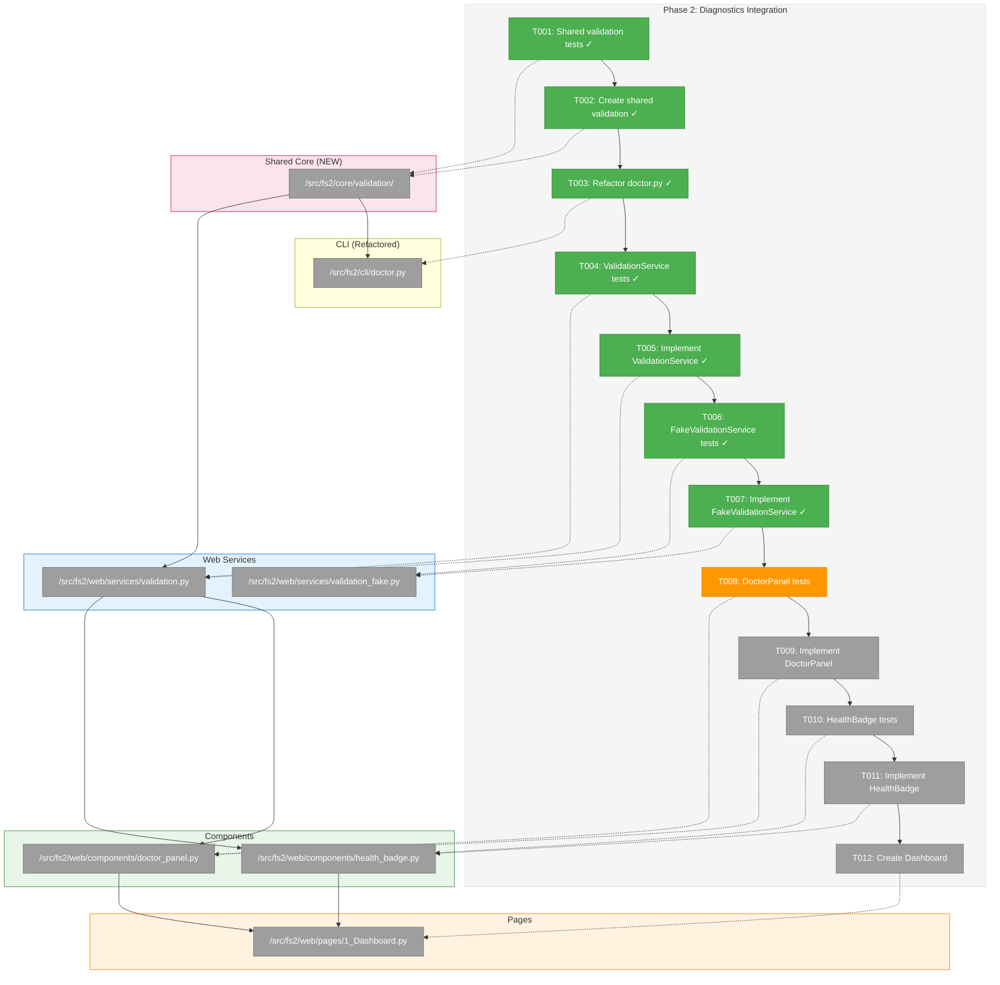
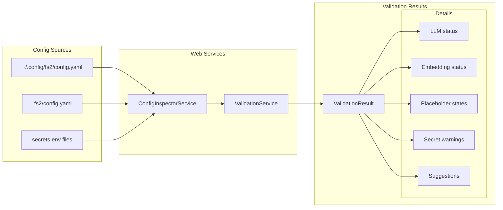
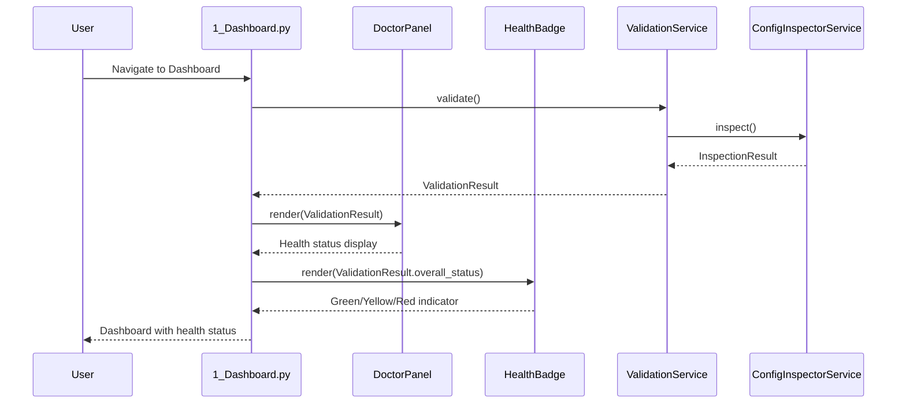

# Phase 2: Diagnostics Integration – Tasks & Alignment Brief

**Spec**: [../../web-spec.md](../../web-spec.md)
**Plan**: [../../web-plan.md](../../web-plan.md)
**Date**: 2026-01-15
**Phase Slug**: `phase-2-diagnostics-integration`

---

## Executive Briefing

### Purpose

This phase ports the doctor validation logic to the web UI and creates reusable components for displaying configuration health. It establishes the diagnostic feedback loop that users need to understand whether their fs2 setup is correct before proceeding with wizards or exploration.

### What We're Building

A **DoctorPanel component** and **Dashboard page** that:
- Runs validation checks against the current configuration (read-only, no `os.environ` mutation)
- Displays health status with green/yellow/red indicators
- Shows actionable fix suggestions when problems are detected
- Appears persistently in the sidebar as a health badge for quick status awareness

### User Value

Users can immediately see if their configuration is healthy without running CLI commands. When issues exist, they get clear, actionable guidance on how to fix them—reducing the trial-and-error cycle that frustrates first-time users.

### Example

**Healthy State**:
```
┌─ Health Status ─────────────────────────┐
│ ✅ All checks passed                    │
│                                         │
│ LLM Provider: azure (configured)        │
│ Embedding: azure (configured)           │
│ Placeholders: 2 resolved, 0 missing     │
└─────────────────────────────────────────┘
```

**Unhealthy State**:
```
┌─ Health Status ─────────────────────────┐
│ ⚠️ 2 issues need attention              │
│                                         │
│ ❌ LLM Provider: Missing base_url       │
│    → Add base_url to llm section        │
│ ⚠️ Placeholder ${AZURE_KEY} not set     │
│    → Set AZURE_KEY environment variable │
└─────────────────────────────────────────┘
```

---

## Objectives & Scope

### Objective

Port doctor validation logic to web services and create reusable diagnostic display components, enabling users to see configuration health status on the Dashboard and throughout the application.

**Behavior Checklist** (from AC-06):
- [ ] Doctor panel shows current health status
- [ ] Actionable fix suggestions displayed for each issue
- [ ] Health badge in sidebar shows green/yellow/red state
- [ ] Dashboard page provides health overview with quick actions

### Goals

- ✅ **Create shared validation module** in `src/fs2/core/validation/` (single source of truth)
- ✅ **Refactor `doctor.py`** to import from shared validation module (prevents drift)
- ✅ Implement `ValidationService` that composes shared validation with ConfigInspectorService
- ✅ Implement `DoctorPanel` component with health status display
- ✅ Implement `HealthBadge` component for sidebar
- ✅ Create `Dashboard` page integrating DoctorPanel and quick actions
- ✅ Full TDD coverage for all validation and display logic

> **Critical Insight #1 Decision**: Rather than copying validation logic (which causes drift), we extract a shared module that both CLI and Web use. See [Critical Insights Discussion](#critical-insights-discussion) for rationale.

### Non-Goals (Scope Boundaries)

- ❌ **Provider connection testing** (Phase 4: Setup Wizards handles `TestConnectionService`)
- ❌ **Configuration editing** (Phase 3: Configuration Editor)
- ❌ **Wizard flows** (Phase 4: Setup Wizards)
- ❌ **Graph management UI** (Phase 5: Graph Management)
- ❌ **LLM health check (`fs2 doctor llm`)** - CLI-only feature, not ported to web
- ❌ **Real-time config file watching** - Users refresh manually
- ❌ **Detailed merge chain visualization** - Dashboard shows summary only
- ❌ **Custom validation rules** - Use existing validation patterns from shared module
- ❌ **Copying validation logic** - Per Insight #1, we use shared module (no code duplication)

---

## Architecture Map

### Component Diagram
<!-- Status: grey=pending, orange=in-progress, green=completed, red=blocked -->
<!-- Updated by plan-6 during implementation -->



### Task-to-Component Mapping

<!-- Status: ⬜ Pending | 🟧 In Progress | ✅ Complete | 🔴 Blocked -->

| Task | Component(s) | Files | Status | Comment |
|------|-------------|-------|--------|---------|
| T001 | Shared validation tests | `/workspaces/flow_squared/tests/unit/core/validation/test_config_validator.py` | ✅ Complete | TDD: RED phase - 33 tests written |
| T002 | Shared validation module | `/workspaces/flow_squared/src/fs2/core/validation/` | ✅ Complete | 33 tests passing |
| T003 | doctor.py refactor | `/workspaces/flow_squared/src/fs2/cli/doctor.py` | ✅ Complete | 37 tests still pass |
| T004 | ValidationService tests | `/workspaces/flow_squared/tests/unit/web/services/test_validation.py` | ✅ Complete | 12 tests written |
| T005 | ValidationService | `/workspaces/flow_squared/src/fs2/web/services/validation.py` | ✅ Complete | 12 tests passing |
| T006 | FakeValidationService tests | `/workspaces/flow_squared/tests/unit/web/services/test_validation_fake.py` | ✅ Complete | 10 tests written |
| T007 | FakeValidationService | `/workspaces/flow_squared/src/fs2/web/services/validation_fake.py` | ✅ Complete | 10 tests passing |
| T008 | DoctorPanel tests | `/workspaces/flow_squared/tests/unit/web/components/test_doctor_panel.py` | 🟧 In Progress | Service integration tests (no render tests) |
| T009 | DoctorPanel | `/workspaces/flow_squared/src/fs2/web/components/doctor_panel.py` | ⬜ Pending | Main diagnostic display component |
| T010 | HealthBadge tests | `/workspaces/flow_squared/tests/unit/web/components/test_health_badge.py` | ⬜ Pending | Tests for green/yellow/red sidebar badge |
| T011 | HealthBadge | `/workspaces/flow_squared/src/fs2/web/components/health_badge.py` | ⬜ Pending | Compact sidebar health indicator |
| T012 | Dashboard page | `/workspaces/flow_squared/src/fs2/web/pages/1_Dashboard.py` | ⬜ Pending | Integrates DoctorPanel + quick actions |

---

## Tasks

| Status | ID | Task | CS | Type | Dependencies | Absolute Path(s) | Validation | Subtasks | Notes |
|--------|------|------|-----|------|--------------|------------------|------------|----------|-------|
| [x] | T001 | Write tests for shared validation module | 2 | Test | – | `/workspaces/flow_squared/tests/unit/core/validation/test_config_validator.py` | Tests cover: LLM validation, embedding validation, placeholder detection, secret detection, suggestions/warnings | – | Pure functions, no CLI deps · [log](./execution.log.md#task-t001-write-tests-for-shared-validation-module) · [^11] |
| [x] | T002 | Create shared validation module | 3 | Core | T001 | `/workspaces/flow_squared/src/fs2/core/validation/__init__.py`, `/workspaces/flow_squared/src/fs2/core/validation/config_validator.py`, `/workspaces/flow_squared/src/fs2/core/validation/constants.py` | All tests from T001 pass, pure validation functions | – | Single source of truth · [log](./execution.log.md#task-t002-create-shared-validation-module) · [^11] |
| [x] | T003 | Refactor doctor.py to use shared module | 2 | Refactor | T002 | `/workspaces/flow_squared/src/fs2/cli/doctor.py` | **Extract-and-Verify (Insight #4)**: (1) Run `pytest tests/unit/cli/test_doctor.py -v` baseline, (2) refactor imports, (3) run same tests—must pass identically | – | ~500 lines move to shared · [log](./execution.log.md#task-t003-refactor-doctorpy-to-use-shared-module) · [^12] |
| [x] | T004 | Write tests for ValidationService | 2 | Test | T003 | `/workspaces/flow_squared/tests/unit/web/services/test_validation.py` | Tests cover: composition with ConfigInspectorService, ValidationResult dataclass | – | ~12 tests · [log](./execution.log.md#task-t004-write-tests-for-validationservice) · [^13] |
| [x] | T005 | Implement ValidationService | 2 | Core | T004 | `/workspaces/flow_squared/src/fs2/web/services/validation.py` | All tests from T004 pass, imports from `fs2.core.validation` | – | Thin wrapper · [log](./execution.log.md#task-t005-implement-validationservice) · [^13] |
| [x] | T006 | Write tests for FakeValidationService | 1 | Test | T005 | `/workspaces/flow_squared/tests/unit/web/services/test_validation_fake.py` | Tests cover: call_history tracking, set_result(), simulate_error | – | Phase 1 pattern · [log](./execution.log.md#task-t006-write-tests-for-fakevalidationservice) · [^13] |
| [x] | T007 | Implement FakeValidationService | 1 | Core | T006 | `/workspaces/flow_squared/src/fs2/web/services/validation_fake.py` | Fake usable in component tests | – | [log](./execution.log.md#task-t007-implement-fakevalidationservice) · [^13] |
| [x] | T008 | Write tests for DoctorPanel component | 1 | Test | T007 | `/workspaces/flow_squared/tests/unit/web/components/test_doctor_panel.py` | Tests cover: service integration, data flow, error handling (per Insight #3 - no render tests) | – | ~3 tests only · [log](./execution.log.md#task-t008-write-tests-for-doctorpanel-component) · [^14] |
| [x] | T009 | Implement DoctorPanel component | 2 | Core | T008 | `/workspaces/flow_squared/src/fs2/web/components/doctor_panel.py` | All tests from T008 pass, renders health status | – | Per AC-06 · [log](./execution.log.md#task-t009-implement-doctorpanel-component) · [^14] |
| [x] | T010 | Write tests for HealthBadge (sidebar) | 1 | Test | T009 | `/workspaces/flow_squared/tests/unit/web/components/test_health_badge.py` | Tests cover: data flow, edge cases (per Insight #3 - no render tests) | – | ~2 tests only · [log](./execution.log.md#task-t010-write-tests-for-healthbadge-sidebar) · [^14] |
| [x] | T011 | Implement HealthBadge component | 1 | Core | T010 | `/workspaces/flow_squared/src/fs2/web/components/health_badge.py` | Badge shows correct color based on health | – | [log](./execution.log.md#task-t011-implement-healthbadge-component) · [^14] |
| [x] | T012 | Create Dashboard page | 2 | Core | T011 | `/workspaces/flow_squared/src/fs2/web/pages/1_Dashboard.py` | Page shows health overview, quick actions (scan, open config) | – | Integration point · [log](./execution.log.md#task-t012-create-dashboard-page) · [^15] |

---

## Alignment Brief

### Prior Phase Review

#### Phase 1: Foundation (Completed 2026-01-15)

**A. Deliverables Created**:
- **ConfigInspectorService** (`/workspaces/flow_squared/src/fs2/web/services/config_inspector.py`): Read-only config inspection with source attribution, placeholder detection
- **ConfigBackupService** (`/workspaces/flow_squared/src/fs2/web/services/config_backup.py`): Atomic backup with checksum verification
- **FakeConfigInspectorService** / **FakeConfigBackupService**: Test doubles following `call_history` / `simulate_error` pattern
- **CLI command** (`/workspaces/flow_squared/src/fs2/cli/web.py`): `fs2 web` with `--port`, `--host`, `--no-browser`
- **Streamlit skeleton** (`/workspaces/flow_squared/src/fs2/web/app.py`): Main app with placeholder pages
- **UIConfig model** (`/workspaces/flow_squared/src/fs2/config/objects.py`): Port/host/theme configuration
- **72 passing tests** across 5 test files

**B. Lessons Learned**:
- **Stateless services**: `inspect()` always loads fresh from disk - no cache invalidation needed
- **TDD RED→GREEN**: Tests written first ensured clean API contracts
- **Scoped fixtures**: `autouse=True` in `services/conftest.py` prevents unintended env var clearing in CLI tests

**C. Technical Discoveries**:
- `dotenv_values()` returns dict without mutation; `load_dotenv()` mutates `os.environ`
- `Path.replace()` is cross-platform safe for atomic rename (Windows compatibility)
- Multi-placeholder values handled with `re.findall()` not `re.search()`

**D. Dependencies Exported for Phase 2**:
```python
# ConfigInspectorService API (available for ValidationService)
from fs2.web.services.config_inspector import (
    ConfigInspectorService,
    InspectionResult,
    ConfigValue,
    PlaceholderState,
)

# Patterns to follow
# - FakeService pattern: call_history, set_result(), simulate_error
# - Stateless services: load fresh on each call
# - Test fixtures: scoped to services/ conftest.py
```

**E. Critical Findings Applied in Phase 1**:
- Discovery 01 (ConfigInspectorService): Uses `dotenv_values()` only (`config_inspector.py:23`)
- Discovery 02 (Secret Exposure): `_is_secret_field()` marks secrets (`config_inspector.py:93-104`)
- Discovery 03 (Source Attribution): `ConfigValue` tracks source chain (`config_inspector.py:38-53`)
- Discovery 05 (Backup Transaction): Temp → verify → `Path.replace()` (`config_backup.py:130-158`)

**F. Incomplete/Blocked Items**: None - all 13 tasks completed

**G. Test Infrastructure**:
- `clean_fs2_env` fixture: `/workspaces/flow_squared/tests/unit/web/services/conftest.py` (clears `FS2_*` env vars)
- pytest `tmp_path` for file operations
- Fake service pattern established

**H. Technical Debt**: Minimal
- Hardcoded `_SECRET_FIELD_NAMES` set (could be configurable in future)

**I. Architectural Decisions**:
- **Stateless services**: Always load fresh, no caching
- **Fake pattern**: `call_history`, `set_result()`, `simulate_error` attributes
- **Cross-platform atomicity**: `Path.replace()` not `Path.rename()`

**J. Scope Changes**: None

**K. Key Log References**:
- [T001: Directory structure](tasks/phase-1-foundation/execution.log.md#task-t001-create-web-module-directory-structure)
- [T002-T003: ConfigInspectorService](tasks/phase-1-foundation/execution.log.md#task-t003-implement-configinspectorservice)
- [T011-T013: CLI and Streamlit](tasks/phase-1-foundation/execution.log.md#tasks-t011-t013-cli-and-streamlit)

---

### Critical Findings Affecting This Phase

| Finding | What It Constrains | Tasks Addressing |
|---------|-------------------|------------------|
| **01: ConfigInspectorService Critical Path** | ValidationService may need config data from ConfigInspectorService; use `dotenv_values()` if reading secrets directly | T002 |
| **02: Secret Exposure Prevention** | ValidationService must never return actual secret values; only metadata about secret presence | T001, T002 |
| **06: Session Isolation** | ValidationService must be stateless; no module-level instances | T002 |
| **08: Test Pollution Prevention** | Tests must clear `FS2_*` env vars; use existing `clean_fs2_env` fixture | T001, T003, T005, T007 |
| **09: Web Service Composition** | ValidationService should compose with ConfigInspectorService, not duplicate file loading | T002 |

---

### ADR Decision Constraints

No ADRs exist for this project. N/A.

---

### Invariants & Guardrails

1. **Shared validation module**: Both CLI (`doctor.py`) and Web (`ValidationService`) import from `fs2.core.validation` (per Insight #1)
2. **No `os.environ` mutation**: All operations read-only
3. **No actual secret values**: Only return `is_secret: bool` and resolution status
4. **Stateless services**: Each `validate()` call loads fresh data (per Insight #2 - no caching for KISS)
5. **Test coverage ≥80%**: All validation paths tested

> **Insight #2 Decision**: No caching of validation results. Validation runs on every Streamlit rerun. KISS - local single-user performance is not a concern; optimize only if needed later.

---

### Inputs to Read

| File | Purpose |
|------|---------|
| `/workspaces/flow_squared/src/fs2/cli/doctor.py` (lines 217-700) | Reference validation logic to port |
| `/workspaces/flow_squared/src/fs2/web/services/config_inspector.py` | ConfigInspectorService API to compose with |
| `/workspaces/flow_squared/tests/unit/cli/test_doctor.py` | Reference test patterns for validation |
| `/workspaces/flow_squared/src/fs2/web/services/config_inspector_fake.py` | Fake pattern to follow |

---

### Visual Alignment Aids

#### Flow Diagram: Validation Data Flow



#### Sequence Diagram: Dashboard Load



---

### Test Plan (Full TDD)

#### ValidationService Tests (`test_validation.py`)

| Test | Rationale | Expected Output |
|------|-----------|-----------------|
| `test_validate_llm_configured_azure_complete` | Verify complete Azure LLM config passes | `is_configured=True, issues=[]` |
| `test_validate_llm_configured_azure_missing_endpoint` | Verify missing base_url detected | `is_misconfigured=True, issues=['base_url required']` |
| `test_validate_llm_configured_azure_missing_deployment` | Verify missing deployment detected | `is_misconfigured=True, issues=['azure_deployment_name required']` |
| `test_validate_llm_not_configured` | Verify no LLM section handled | `is_configured=False, is_misconfigured=False` |
| `test_validate_embedding_configured_azure_complete` | Verify complete Azure embedding passes | `is_configured=True, issues=[]` |
| `test_validate_embedding_missing_endpoint` | Verify missing endpoint detected | `is_misconfigured=True` |
| `test_validate_placeholder_resolved` | Verify resolved placeholder state | `resolved=True` |
| `test_validate_placeholder_unresolved` | Verify unresolved placeholder state | `resolved=False` |
| `test_detect_literal_secret_sk_prefix` | Verify sk-* pattern detected | `warnings=[{pattern: 'sk-*'}]` |
| `test_detect_literal_secret_long_string` | Verify long secret string detected | `warnings=[{pattern: '>64 chars'}]` |
| `test_placeholder_not_flagged_as_secret` | Verify `${VAR}` not flagged | `warnings=[]` |
| `test_get_suggestions_unresolved_placeholder` | Verify suggestions for unresolved | `suggestions=['Set VAR...']` |
| `test_get_suggestions_no_config` | Verify init suggestion | `suggestions=['Run fs2 init...']` |
| `test_get_warnings_override` | Verify override warning | `warnings=['Local overrides...']` |
| `test_validate_returns_overall_status_healthy` | Verify green status | `overall_status='healthy'` |
| `test_validate_returns_overall_status_warning` | Verify yellow status | `overall_status='warning'` |
| `test_validate_returns_overall_status_error` | Verify red status | `overall_status='error'` |
| `test_validate_does_not_import_doctor` | Static check: no doctor imports | No import statements |

#### DoctorPanel Tests (`test_doctor_panel.py`)

> **Insight #3 Decision**: Test service integration, not Streamlit rendering. DoctorPanel is a thin presentation layer—manual visual verification during development is sufficient for UI correctness.

| Test | Rationale | Expected Output |
|------|-----------|-----------------|
| `test_panel_calls_validation_service` | Verify service integration | `FakeValidationService.validate()` called |
| `test_panel_receives_validation_result` | Verify data flow | Panel function receives `ValidationResult` |
| `test_panel_handles_service_error` | Error handling | Graceful handling when service raises |

*Note: Actual rendering (green checkmarks, error messages) verified via manual inspection during development.*

#### HealthBadge Tests (`test_health_badge.py`)

> **Insight #3 Decision**: Same as DoctorPanel—test data flow, not rendering.

| Test | Rationale | Expected Output |
|------|-----------|-----------------|
| `test_badge_receives_overall_status` | Verify data flow | Badge function receives status string |
| `test_badge_handles_none_status` | Edge case | Graceful handling of missing status |

*Note: Color rendering verified via manual inspection during development.*

---

### Step-by-Step Implementation Outline

1. **T001 (RED)**: Write `test_config_validator.py` with ~18 test cases for pure validation functions
2. **T002 (GREEN)**: Create `src/fs2/core/validation/` module with extracted validation logic
3. **T003 (REFACTOR)**: Update `doctor.py` to import from shared module; verify existing tests pass
4. **T004 (RED)**: Write `test_validation.py` for ValidationService (composition layer tests)
5. **T005 (GREEN)**: Implement `ValidationService` as thin wrapper over shared module + ConfigInspectorService
6. **T006 (RED)**: Write `test_validation_fake.py` with call_history/simulate_error tests
7. **T007 (GREEN)**: Implement `FakeValidationService` following Phase 1 fake pattern
8. **T008 (RED)**: Write `test_doctor_panel.py` - service integration tests only (per Insight #3)
9. **T009 (GREEN)**: Implement `DoctorPanel` component with Streamlit widgets
10. **T010 (RED)**: Write `test_health_badge.py` - data flow tests only (per Insight #3)
11. **T011 (GREEN)**: Implement `HealthBadge` compact sidebar component
12. **T012 (Integration)**: Create `1_Dashboard.py` composing DoctorPanel + HealthBadge + quick actions

---

### Commands to Run

```bash
# T001-T002: Shared validation module tests
pytest tests/unit/core/validation/test_config_validator.py -v

# T003: Extract-and-Verify for doctor.py refactor (Insight #4)
# Step 1: Run baseline BEFORE refactor
pytest tests/unit/cli/test_doctor.py -v > /tmp/doctor_baseline.txt
# Step 2: Do the refactor (update imports in doctor.py)
# Step 3: Run AFTER refactor - must match baseline
pytest tests/unit/cli/test_doctor.py -v
# If any test fails that passed before, the refactor broke something!

# T004-T007: ValidationService and fake tests
pytest tests/unit/web/services/test_validation.py tests/unit/web/services/test_validation_fake.py -v

# T008-T011: Component integration tests (minimal per Insight #3)
pytest tests/unit/web/components/test_doctor_panel.py tests/unit/web/components/test_health_badge.py -v

# Check linting (including new shared module)
ruff check src/fs2/core/validation/ src/fs2/web/services/validation.py src/fs2/web/components/doctor_panel.py src/fs2/web/components/health_badge.py src/fs2/web/pages/1_Dashboard.py

# Verify shared module is used (not direct doctor imports)
grep -r "from fs2.cli.doctor import\|from fs2.cli import doctor" src/fs2/web/ && echo "FAIL: Forbidden import" || echo "PASS: No forbidden imports"

# Verify coverage for phase
pytest tests/unit/web/ tests/unit/core/validation/ --cov=src/fs2/web --cov=src/fs2/core/validation --cov-report=term-missing --cov-fail-under=80

# Test Dashboard page loads
python -c "from fs2.web.pages import _1_Dashboard; print('Dashboard imports successfully')"

# Full verification (all phase tests)
pytest tests/unit/core/validation/ tests/unit/web/ tests/unit/cli/test_doctor.py -v && echo "Phase 2 verification PASSED"
```

---

### Risks/Unknowns

| Risk | Severity | Mitigation | Status |
|------|----------|------------|--------|
| Validation logic differs from CLI doctor | ~~Medium~~ | ~~Cross-reference test cases~~ → **Shared module (Insight #1)** | ✅ Mitigated |
| doctor.py refactor breaks CLI | Medium | **Extract-and-Verify pattern (Insight #4)** - baseline tests before/after | ✅ Addressed |
| Streamlit component testing limitations | ~~Low~~ | ~~Focus on service logic tests~~ → **Test data flow only (Insight #3)** | ✅ Mitigated |
| Session state conflicts in HealthBadge | Low | Use namespaced keys (`fs2_web_health_*`) per Discovery 06 | Open |
| Performance from repeated validation | ~~Low~~ | **KISS - no caching (Insight #2)** - optimize later if needed | ✅ Accepted |

---

### Ready Check

- [x] Phase 1 review completed (documented above)
- [x] Critical findings mapped to tasks
- [x] ADR constraints mapped to tasks - **N/A** (no ADRs exist)
- [x] Test plan covers all acceptance criteria (AC-06)
- [x] Implementation outline maps 1:1 to tasks (12 tasks)
- [x] Commands to run documented
- [x] Risks identified with mitigations
- [x] **Critical Insights session completed** (5 insights, 5 decisions)

**Awaiting GO/NO-GO from human sponsor.**

---

## Phase Footnote Stubs

| Footnote | Task | Description | FlowSpace Node IDs |
|----------|------|-------------|-------------------|
| [^11] | T001-T002 | Shared validation module | `file:src/fs2/core/validation/__init__.py`, `file:src/fs2/core/validation/config_validator.py`, `file:src/fs2/core/validation/constants.py` |
| [^12] | T003 | doctor.py refactored | `file:src/fs2/cli/doctor.py` |
| [^13] | T004-T007 | ValidationService + Fake | `file:src/fs2/web/services/validation.py`, `file:src/fs2/web/services/validation_fake.py` |
| [^14] | T008-T011 | DoctorPanel + HealthBadge | `file:src/fs2/web/components/__init__.py`, `file:src/fs2/web/components/doctor_panel.py`, `file:src/fs2/web/components/health_badge.py` |
| [^15] | T012 | Dashboard page | `file:src/fs2/web/pages/1_Dashboard.py` |

---

## Evidence Artifacts

| Artifact | Path | Created By |
|----------|------|------------|
| Execution Log | `./execution.log.md` | plan-6-implement-phase |
| Test Results | `./test-results.txt` | pytest output |
| Coverage Report | `./coverage-report.txt` | pytest-cov output |

---

## Discoveries & Learnings

_Populated during implementation by plan-6. Log anything of interest to your future self._

| Date | Task | Type | Discovery | Resolution | References |
|------|------|------|-----------|------------|------------|
| | | | | | |

**Types**: `gotcha` | `research-needed` | `unexpected-behavior` | `workaround` | `decision` | `debt` | `insight`

**What to log**:
- Things that didn't work as expected
- External research that was required
- Implementation troubles and how they were resolved
- Gotchas and edge cases discovered
- Decisions made during implementation
- Technical debt introduced (and why)
- Insights that future phases should know about

_See also: `execution.log.md` for detailed narrative._

---

## Critical Insights Discussion

**Session**: 2026-01-15
**Context**: Phase 2: Diagnostics Integration - Tasks & Alignment Brief
**Analyst**: Claude (AI Clarity Agent)
**Reviewer**: Development Team
**Format**: Water Cooler Conversation (5 Critical Insights)

### Insight 1: Shared Validation Module Prevents Drift

**Did you know**: Copying validation logic from `doctor.py` to `ValidationService` would create two independent codebases that inevitably drift apart over time.

**Implications**:
- No shared constants (URLs, patterns, thresholds) between CLI and Web
- Future validation rule changes need to be made in two places
- Subtle bugs from copy-paste errors
- No sync mechanism to detect drift

**Options Considered**:
- Option A: Extract Shared Validation Module - Create `src/fs2/core/validation/`, both CLI and Web import from it
- Option B: Accept Duplication with Documentation - Copy logic, document sync requirement
- Option C: Validation-as-Data Pattern - Declarative rules in YAML/JSON
- Option D: Import with Side-Effect Isolation - Import doctor.py with mocked CLI parts

**AI Recommendation**: Option A (Extract Shared Validation Module)
- Reasoning: Single source of truth prevents drift; future features (MCP, other CLI) can reuse

**Discussion Summary**: User agreed that shared module is worth the upfront investment.

**Decision**: Create `src/fs2/core/validation/` as single source of truth; refactor `doctor.py` to import from it.

**Action Items**:
- [x] Add T001-T003 to tasks table for shared module creation
- [x] Update Goals section to reflect shared module approach
- [x] Update Architecture Map with new module

**Affects**: Tasks T001-T003, Goals, Architecture Map, Non-Goals

---

### Insight 2: Streamlit Reruns and Validation Performance

**Did you know**: Every user interaction in Streamlit (click, expand, navigate) triggers a full page rerun, which would execute `validate()` on every single interaction.

**Implications**:
- Repeated file system reads and YAML parsing
- Latency on every click
- Wasted compute for identical config

**Options Considered**:
- Option A: `@st.cache_data` with TTL - Cache validation results for 5 seconds
- Option B: Session State with Manual Invalidation - Store result, add refresh button
- Option C: Hash-Based Invalidation - Cache keyed by config file hash
- Option D: Accept Repeated Validation - KISS, optimize later if needed

**AI Recommendation**: Option A (`@st.cache_data` with TTL)
- Reasoning: Streamlit-native, minimal code change, good enough freshness

**Discussion Summary**: User chose KISS approach - local single-user performance is not a concern.

**Decision**: Accept repeated validation (no caching). Optimize later if needed.

**Action Items**:
- [x] Update Invariants section to document no-caching decision

**Affects**: Invariants & Guardrails section

---

### Insight 3: Streamlit Component Testing Limitations

**Did you know**: Streamlit components (`st.success()`, `st.error()`) don't return testable values - you can't assert "this rendered a green checkmark" with pytest.

**Implications**:
- Can't assert on rendered output
- Can't check colors/icons programmatically
- Test plan had a gap for component tests

**Options Considered**:
- Option A: Test Logic, Not Rendering - Test ValidationService thoroughly; DoctorPanel is thin presentation
- Option B: Use Streamlit's AppTest - Experimental API for component testing
- Option C: Extract Render Data - Add `get_render_data()` method, test the dict
- Option D: E2E Browser Tests - Playwright/Selenium for actual rendering

**AI Recommendation**: Option A (Test Logic, Not Rendering)
- Reasoning: ValidationService is where complexity lives; DoctorPanel is trivial if/else

**Discussion Summary**: User agreed - test the logic layer, manual verification for presentation.

**Decision**: Test service integration only for DoctorPanel/HealthBadge. Manual visual verification during development.

**Action Items**:
- [x] Update Test Plan section with reduced component tests
- [x] Update T008, T010 validation criteria and complexity scores

**Affects**: Test Plan, T008, T010, Step-by-Step Outline

---

### Insight 4: doctor.py Refactor Risk

**Did you know**: `doctor.py` has 1,026 lines of code and 1,181 lines of tests - refactoring it to use the shared module is the highest-risk task in this phase.

**Implications**:
- High blast radius (user-facing CLI command)
- Tight coupling between validation and rendering
- Any regression breaks `fs2 doctor` for all users

**Options Considered**:
- Option A: Extract-and-Verify Pattern - Run tests before refactor, verify identical results after
- Option B: Feature Flag the Refactor - Toggle between old and new code
- Option C: Parallel Implementation - Run both validation paths, compare results
- Option D: YOLO Direct Refactor - Trust the tests

**AI Recommendation**: Option A (Extract-and-Verify Pattern)
- Reasoning: Existing tests are comprehensive; simple before/after verification

**Discussion Summary**: User agreed - the existing test suite is a solid safety net.

**Decision**: Use Extract-and-Verify pattern with baseline test runs before/after refactor.

**Action Items**:
- [x] Update T003 validation criteria with verification steps
- [x] Add baseline/after test commands to Commands to Run section

**Affects**: T003, Commands to Run, Risks section

---

### Insight 5: Expanded Phase Scope

**Did you know**: With our decisions, Phase 2 grew from 9 tasks to 12 tasks, and now includes creating a new `src/fs2/core/validation/` module that affects the CLI—not just the web UI.

**Implications**:
- Broader blast radius (touches CLI code)
- More files created (new core module)
- Higher value (reusable validation for future features)
- Plan document task counts were stale

**Options Considered**:
- Option A: Proceed with Expanded Scope - Accept expansion as valuable investment
- Option B: Split into Phase 2a/2b - Smaller focused phases
- Option C: Defer Shared Module - Ship with tech debt, consolidate later

**AI Recommendation**: Option A (Proceed with Expanded Scope)
- Reasoning: Planning already done; expansion prevents drift problem from Insight #1

**Discussion Summary**: User agreed - the expanded scope is a worthwhile investment.

**Decision**: Proceed with 12-task Phase 2. Update web-plan.md to match.

**Action Items**:
- [x] Update web-plan.md Phase 2 section with new task structure

**Affects**: web-plan.md Phase 2 section

---

## Session Summary

**Insights Surfaced**: 5 critical insights identified and discussed
**Decisions Made**: 5 decisions reached through collaborative discussion
**Action Items Created**: 10+ updates applied across tasks.md and web-plan.md
**Files Updated**:
- `tasks/phase-2-diagnostics-integration/tasks.md` - Goals, Tasks, Architecture Map, Test Plan, Commands, Risks
- `web-plan.md` - Phase 2 section completely updated

**Shared Understanding Achieved**: ✓

**Confidence Level**: High - Key risks identified and mitigated through architectural decisions.

**Next Steps**:
1. Human GO/NO-GO on updated Phase 2 plan
2. Run `/plan-6-implement-phase --phase "Phase 2: Diagnostics Integration"`

---

## Directory Layout

```
docs/plans/026-web/
├── web-spec.md
├── web-plan.md
├── research-dossier.md
├── implementation-strategy.md
├── risk-mitigations.md
├── reviews/
│   ├── review.phase-1-foundation.md
│   └── fix-tasks.phase-1-foundation.md
└── tasks/
    ├── phase-1-foundation/
    │   ├── tasks.md
    │   └── execution.log.md
    └── phase-2-diagnostics-integration/    # This phase
        ├── tasks.md                        # This file
        └── execution.log.md                # Created by plan-6
```

---

**Plan-5 Output Complete**: 2026-01-15
**Critical Insights Session**: 2026-01-15 (5 insights, 5 decisions)
**Status**: ⏳ AWAITING GO
**Total Tasks**: 12 (expanded from 9 per Insight #1)
**Next Step**: Human GO/NO-GO, then `/plan-6-implement-phase --phase "Phase 2: Diagnostics Integration"`
