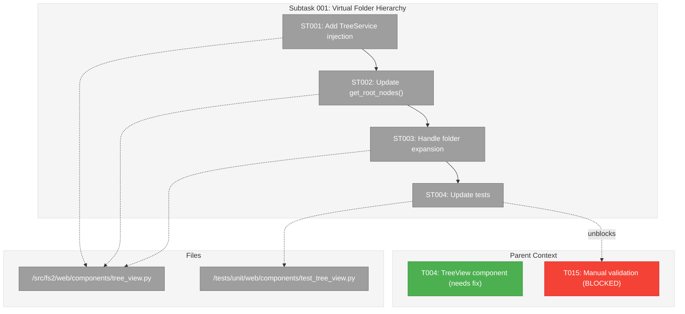
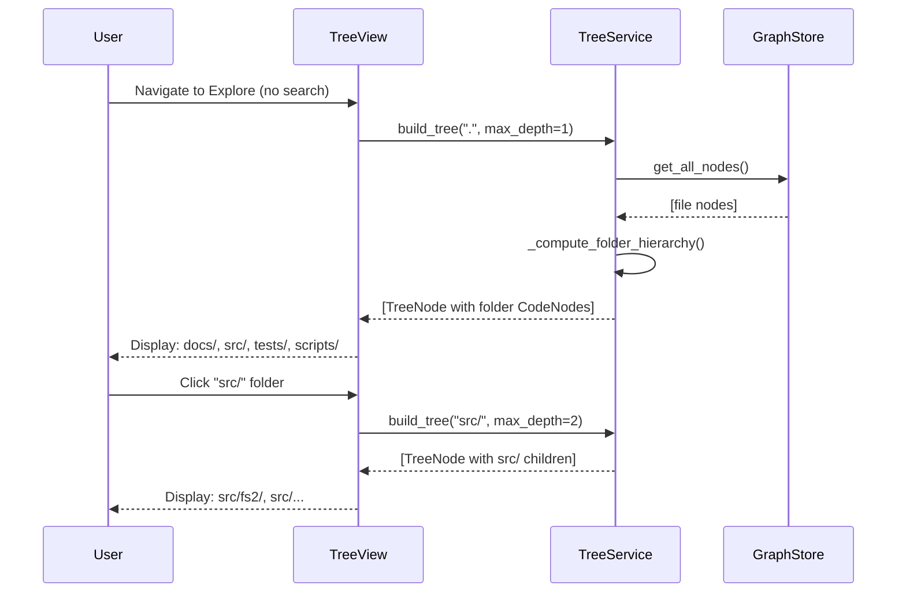

# Subtask 001: Virtual Folder Hierarchy for TreeView

**Parent Plan:** [View Plan](../../web-plan.md)
**Parent Phase:** Phase 6: Exploration
**Parent Task(s):** [T004: Implement TreeView component](./tasks.md#task-t004)
**Plan Task Reference:** [Task 6.4 in Plan](../../web-plan.md#phase-6-exploration)

**Why This Subtask:**
The current TreeView shows all file nodes as flat roots. The CLI tree command (with `--depth 1`) shows virtual folder hierarchy (docs/, src/, tests/, scripts/) using synthetic folder nodes. The web TreeView should match this behavior for consistency and usability.

**Created:** 2026-01-16
**Requested By:** Development Team

---

## Executive Briefing

### Purpose

This subtask aligns the web TreeView component with the CLI's virtual folder hierarchy behavior. When no search results are provided, the TreeView should show top-level virtual directories (like `docs/`, `src/`, `tests/`) instead of a flat list of all file nodes. This provides a familiar, navigable structure matching the CLI output.

### What We're Building

A TreeView that:
- Uses `TreeService.build_tree(pattern=".", max_depth=1)` to get virtual folder roots
- Displays synthetic folder nodes with 📁 icon and trailing slash
- Shows `[N children hidden by depth limit]` for collapsed folders
- On expand: calls `TreeService.build_tree(pattern=folder_path, max_depth=depth+1)` or uses `GraphStore.get_children()` for non-folder nodes
- Seamlessly switches to search results mode when starter_nodes are provided

### Unblocks

- T015: Manual validation (currently blocked—TreeView displays wrong root structure)
- Proper "verify your graph works" UX matching CLI output

### Example

**Current Behavior** (incorrect):
```
TreeView roots:
- file:src/fs2/cli/main.py
- file:src/fs2/cli/tree.py
- file:tests/unit/test_tree.py
... (4959 file nodes as flat roots)
```

**Expected Behavior** (matching CLI):
```
TreeView roots:
📁 docs/ [295 children hidden]
📁 scripts/ [70 children hidden]
📁 src/ [951 children hidden]
📁 tests/ [3643 children hidden]
```

---

## Objectives & Scope

### Objective

Align web TreeView with CLI tree behavior by using `TreeService._compute_folder_hierarchy()` logic to show virtual folder nodes as roots.

### Goals

- ✅ Inject `TreeService` into TreeView component
- ✅ Use `TreeService.build_tree(pattern=".", max_depth=1)` for default roots
- ✅ Extract folder nodes from `TreeNode` list for display
- ✅ Show `hidden_children_count` for collapsed folders
- ✅ On expand: increase depth and re-query `TreeService`
- ✅ Maintain existing behavior when `starter_nodes` provided (search results)

### Non-Goals

- ❌ ~~Modifying `TreeService` itself~~ **REVISED**: Adding `get_node_children()` method to TreeService (DYK Insight #2)
- ❌ Performance optimization for huge graphs (defer to Phase 7)
- ❌ Custom folder icons or theming

---

## Architecture Map

### Component Diagram
<!-- Status: grey=pending, orange=in-progress, green=completed, red=blocked -->
<!-- Updated by plan-6 during implementation -->



### Task-to-Component Mapping

<!-- Status: ⬜ Pending | 🟧 In Progress | ✅ Complete | 🔴 Blocked -->

| Task | Component(s) | Files | Status | Comment |
|------|-------------|-------|--------|---------|
| ST001 | TreeView.__init__, _render_tree_view | tree_view.py, 5_Explore.py | ⬜ Pending | Add TreeService param + wire in Explore page |
| ST001a | TreeService.get_node_children | tree_service.py | ⬜ Pending | New method: dispatch folder vs real node expansion |
| ST002 | TreeView.get_root_nodes | tree_view.py | ⬜ Pending | Use TreeService.build_tree() for virtual folders |
| ST003 | TreeView.toggle_expanded | tree_view.py | ⬜ Pending | Call tree_service.get_node_children() |
| ST004 | TestTreeView* | test_tree_view.py | ⬜ Pending | Update tests to verify folder hierarchy |
| ST004a | TestTreeService* | test_tree_service.py | ⬜ Pending | Test get_node_children() for both paths |

---

## Tasks

| Status | ID    | Task                               | CS | Type | Dependencies | Absolute Path(s)                                                      | Validation                           | Subtasks | Notes           |
|--------|-------|------------------------------------|----|------|--------------|-----------------------------------------------------------------------|--------------------------------------|----------|-----------------|
| [ ]    | ST001 | Add TreeService injection to TreeView | 2 | Core | – | /workspaces/flow_squared/src/fs2/web/components/tree_view.py, /workspaces/flow_squared/src/fs2/web/pages/5_Explore.py | TreeService is constructor param, Explore page wires it | – | Atomic: constructor + composition root wiring |
| [ ]    | ST001a | Add get_node_children() to TreeService | 2 | Core | – | /workspaces/flow_squared/src/fs2/core/services/tree_service.py | Method returns list[TreeNode] for any node_id | – | Handles folders (build_tree) and real nodes (get_children) |
| [ ]    | ST002 | Update get_root_nodes to use TreeService | 2 | Core | ST001 | /workspaces/flow_squared/src/fs2/web/components/tree_view.py | Returns virtual folder nodes when no starter_nodes | – | Use build_tree(pattern=".", max_depth=1) |
| [ ]    | ST003 | Handle folder node expansion | 2 | Core | ST001a, ST002 | /workspaces/flow_squared/src/fs2/web/components/tree_view.py | Clicking any node expands correctly | – | Calls tree_service.get_node_children() |
| [ ]    | ST004 | Update TreeView tests | 2 | Test | ST003 | /workspaces/flow_squared/tests/unit/web/components/test_tree_view.py | Tests verify folder hierarchy behavior | – | May need FakeTreeService |
| [ ]    | ST004a | Add TreeService.get_node_children tests | 2 | Test | ST001a | /workspaces/flow_squared/tests/unit/core/services/test_tree_service.py | Tests verify folder vs real node dispatch | – | Test both paths |

---

## Alignment Brief

### Objective Recap

Create a TreeView that displays virtual folder hierarchy (like CLI `fs2 tree --depth 1`) when no search results are provided, while maintaining search result display when starter_nodes are given.

### Behavior Checklist

- [ ] TreeView with no starter_nodes shows virtual folder roots (docs/, src/, etc.)
- [ ] Folder nodes display with 📁 icon and trailing slash
- [ ] Folders show `[N files]` instead of line range (DYK #4: Option B)
- [ ] Files show `[N-M]` line range as before
- [ ] Clicking folder expands to show next level (via `get_node_children()`)
- [ ] Search results still work (starter_nodes override folder hierarchy)
- [ ] Search results compute hidden_children_count lazily (DYK #1: Option C-1)
- [ ] Tests verify both folder hierarchy and search result modes

### Critical Findings Affecting This Subtask

**From Research:**
1. **TreeService.build_tree()** with `pattern="."` and `max_depth > 0` calls `_compute_folder_hierarchy()`
2. **_create_folder_node()** creates synthetic `CodeNode` with `category="folder"`, `ts_kind="folder"`
3. **Folder node_id** uses trailing slash format: `"src/"`, `"tests/"`
4. **TreeNode.hidden_children_count** tracks collapsed children

### Invariants

- TreeView must still work with GraphStore for non-folder node children
- Session state keys remain consistent (`fs2_web_expanded_nodes`, `fs2_web_selected_node`)
- Search result mode takes precedence over folder hierarchy mode

### Inputs to Read

- `/workspaces/flow_squared/src/fs2/core/services/tree_service.py` - TreeService implementation
- `/workspaces/flow_squared/src/fs2/web/components/tree_view.py` - Current TreeView implementation
- `/workspaces/flow_squared/tests/unit/web/components/test_tree_view.py` - Existing tests

### Flow Diagram

```mermaid
flowchart TD
    Start([TreeView.get_root_nodes]) --> CheckStarter{starter_nodes?}
    
    CheckStarter -->|Yes| ReturnStarter[Return nodes from GraphStore]
    CheckStarter -->|No| CallTreeService[TreeService.build_tree<br/>pattern=".", max_depth=1]
    
    CallTreeService --> ExtractFolders[Extract TreeNode list]
    ExtractFolders --> ReturnFolders[Return folder CodeNodes]
    
    ReturnStarter --> Render[Render tree]
    ReturnFolders --> Render
```

### Sequence Diagram



### Test Plan

| Test ID | Description | Type |
|---------|-------------|------|
| ST001-T1 | TreeView accepts optional TreeService in constructor | Unit |
| ST002-T1 | get_root_nodes with no starter_nodes returns virtual folders | Unit |
| ST002-T2 | get_root_nodes with starter_nodes returns those nodes | Unit |
| ST003-T1 | Clicking folder node expands to next depth | Unit |
| ST003-T2 | Clicking file node uses GraphStore.get_children() | Unit |
| ST004-T1 | Folder nodes display with folder icon | Unit |

### Implementation Outline

1. **ST001**: Modify `TreeView.__init__()` to accept optional `tree_service: TreeService`
2. **ST002**: Update `get_root_nodes()`:
   - If `starter_nodes` provided, use existing GraphStore logic
   - Otherwise, call `tree_service.build_tree(pattern=".", max_depth=1)` and extract nodes
3. **ST003**: Update `toggle_expanded()` or add new method:
   - Detect if node is folder (category == "folder")
   - For folders: call `tree_service.build_tree(pattern=folder_path, max_depth=current+1)`
   - For files: use existing `GraphStore.get_children()` logic
4. **ST004**: Add/update tests to verify folder hierarchy behavior

### Commands to Run

```bash
# Run TreeView tests
cd /workspaces/flow_squared
python -m pytest tests/unit/web/components/test_tree_view.py -v

# Run all web tests
python -m pytest tests/unit/web/ -v

# Start web UI for manual verification
fs2 web --port 8503
```

### Risks & Unknowns

| Risk | Impact | Mitigation |
|------|--------|------------|
| TreeService circular dependency | Medium | Pass TreeService as optional param, construct in Explore page |
| Test complexity with FakeTreeService | Low | May reuse existing FakeGraphStore patterns |
| Performance with large graphs | Low | Already handled by TreeService depth limiting |

### Ready Check

- [ ] TreeService source code reviewed and understood
- [ ] Current TreeView implementation analyzed
- [ ] Test patterns from existing TreeView tests identified
- [ ] No blocking dependencies

---

## Phase Footnote Stubs

_Populated during implementation by plan-6._

| Task | Anchor | Footnote Ref | Description |
|------|--------|--------------|-------------|
| | | | |

---

## Evidence Artifacts

- **Execution Log**: `001-subtask-virtual-folder-hierarchy.execution.log.md`
- **Modified Files**:
  - `/workspaces/flow_squared/src/fs2/web/components/tree_view.py`
  - `/workspaces/flow_squared/tests/unit/web/components/test_tree_view.py`

---

## Discoveries & Learnings

_Populated during implementation by plan-6. Log anything of interest to your future self._

| Date | Task | Type | Discovery | Resolution | References |
|------|------|------|-----------|------------|------------|
| 2026-01-16 | ST002 | decision | TreeService returns TreeNode, TreeView expects CodeNode | **Option C + C-1**: Store `list[TreeNode]` internally for folder browsing (preserves hidden_children_count). Expose `list[CodeNode]` via `get_root_nodes()`. For search results (starter_nodes): compute hidden_children_count lazily in `_render_node()` via `len(graph_store.get_children(node_id))`. Two code paths match two conceptual operations. | DYK V1-01 to V1-04 |
| 2026-01-17 | ST003 | decision | Folder expansion vs real node expansion dispatch | **Option 1**: Add `TreeService.get_node_children(node_id, max_depth=2) -> list[TreeNode]`. Handles both synthetic folders (`node_id.endswith("/")` → `build_tree()`) and real nodes (→ `graph_store.get_children()` wrapped in TreeNode). Single service handles all tree expansion. Revises Non-Goals. | DYK Insight #2 |
| 2026-01-17 | ST001a | decision | Depth tracking for folder expansion | **Option A**: Fixed `max_depth=2` for all folder expansions. Each call is self-contained — pattern changes, max_depth stays constant. No per-node depth tracking in session state needed. Session state remains simple `set()`. | DYK Insight #3 |
| 2026-01-17 | ST003 | decision | Hidden children count display format | **Option B**: Replace line range with file count for folders. Folders show `📁 src/ [951 files]`, files show `📄 main.py [1-245]`. Contextually appropriate info for each type. Folders have 0-0 line ranges anyway (synthetic). | DYK Insight #4 |
| 2026-01-17 | ST001 | decision | Explore page wiring scope | **Option A**: Update 5_Explore.py as part of ST001 (atomic change). Composition root is responsible for dependency wiring. ST001 now touches tree_view.py AND 5_Explore.py. CS bumped from 1 to 2. | DYK Insight #5 |

**Types**: `gotcha` | `research-needed` | `unexpected-behavior` | `workaround` | `decision` | `debt` | `insight`

**What to log**:
- Things that didn't work as expected
- External research that was required
- Implementation troubles and how they were resolved
- Gotchas and edge cases discovered
- Decisions made during implementation
- Technical debt introduced (and why)
- Insights that future phases should know about

_See also: `execution.log.md` for detailed narrative._

---

## After Subtask Completion

**This subtask resolves a blocker for:**
- Parent Task: [T004: Implement TreeView component](./tasks.md#task-t004)
- Parent Task: [T015: Manual validation](./tasks.md#task-t015)

**When all ST### tasks complete:**

1. **Record completion** in parent execution log:
   ```
   ### Subtask 001-subtask-virtual-folder-hierarchy Complete

   Resolved: TreeView now displays virtual folder hierarchy matching CLI behavior
   See detailed log: [subtask execution log](./001-subtask-virtual-folder-hierarchy.execution.log.md)
   ```

2. **Update parent task** (if it was blocked):
   - Open: [`tasks.md`](./tasks.md)
   - Find: T015
   - Update Status: `[!]` → `[ ]` (unblock if this was the blocker)
   - Update Notes: Add "Subtask 001-subtask-virtual-folder-hierarchy complete"

3. **Resume parent phase work:**
   ```bash
   /plan-6-implement-phase --phase "Phase 6: Exploration" \
     --plan "/workspaces/flow_squared/docs/plans/026-web/web-plan.md"
   ```
   (Note: NO `--subtask` flag to resume main phase)

**Quick Links:**
- 📋 [Parent Dossier](./tasks.md)
- 📄 [Parent Plan](../../web-plan.md)
- 📊 [Parent Execution Log](./execution.log.md)

---

## Directory Structure

```
docs/plans/026-web/tasks/phase-6-exploration/
├── tasks.md                                      # Phase dossier
├── execution.log.md                              # Phase execution log
├── 001-subtask-virtual-folder-hierarchy.md       # This subtask dossier
└── 001-subtask-virtual-folder-hierarchy.execution.log.md  # Subtask log (created by plan-6)
```

---

## Critical Insights Discussion (DYK Session)

**Session**: 2026-01-17
**Context**: Subtask 001 - Virtual Folder Hierarchy for TreeView
**Analyst**: AI Clarity Agent
**Reviewer**: Development Team
**Format**: Water Cooler Conversation (5 Critical Insights)

### Insight 1: TreeService Returns TreeNode, Not CodeNode

**Did you know**: TreeService.build_tree() returns `list[TreeNode]`, but TreeView.get_root_nodes() returns `list[CodeNode]`. This looks like a type mismatch but is elegantly solved by TreeNode's design.

**Implications**:
- TreeNode.node property IS the CodeNode
- TreeNode carries hidden_children_count for UI indicators
- Extraction is trivial: `[tn.node for tn in tree_nodes]`

**Options Considered**:
- Option A: Extract CodeNode via TreeNode.node property
- Option B: Change TreeView.get_root_nodes() to return TreeNode (Not Feasible - breaking change)
- Option C: Store TreeNode list internally, expose CodeNode list

**AI Recommendation**: Option C
- Reasoning: Preserves hidden_children_count for UI, no interface changes

**Discussion Summary**:
Workshopped search flow — search results bypass TreeService. Decided on C-1 variant: compute hidden_children_count lazily during render for search results.

**Decision**: Option C + C-1 — Store TreeNode internally for folder browsing, compute hidden count lazily for search results

**Action Items**: None (design decision captured)

**Affects**: ST002, ST003, _render_node()

---

### Insight 2: Folder Expansion Uses Pattern Query, Not GraphStore.get_children()

**Did you know**: Synthetic folder nodes don't exist in the graph. `GraphStore.get_children("src/")` returns empty list. Must use TreeService.build_tree(pattern="src/", max_depth=2) instead.

**Implications**:
- Folder expansion fundamentally different from file/class expansion
- Need category-based dispatch logic
- TreeService query pattern changes based on node type

**Options Considered**:
- Option A: Category-based dispatch in toggle_expanded
- Option B: Always use TreeService for all expansions (Partial - needs edge case handling)
- Option C: Use ts_kind instead of category

**AI Recommendation**: Option A initially, but workshopped to Option 1

**Discussion Summary**:
User suggested dispatch logic should live in a service, not component. Decided to extend TreeService with new method.

**Decision**: Add `TreeService.get_node_children(node_id, max_depth=2) -> list[TreeNode]` — handles both synthetic folders and real nodes

**Action Items**:
- [x] Add ST001a task for TreeService method
- [x] Add ST004a task for TreeService tests
- [x] Update Non-Goals (now modifying TreeService)

**Affects**: TreeService, ST001a, ST003, ST004a

---

### Insight 3: Depth Tracking is Already Solved

**Did you know**: The subtask sequence diagram shows `build_tree("src/", max_depth=2)` — fixed max_depth, not calculated. No per-node depth tracking needed.

**Implications**:
- Each expansion is self-contained — pattern changes, max_depth stays constant
- Session state remains simple `set()` of expanded node_ids
- Depth is implicit in folder path

**Options Considered**:
- Option A: Fixed max_depth=2 for all folder expansions
- Option B: Calculate depth from path (unnecessary complexity)
- Option C: Store depth in session state (Not Feasible - adds complexity without benefit)

**AI Recommendation**: Option A

**Discussion Summary**: Straightforward — subtask author already solved this.

**Decision**: Option A — Fixed max_depth=2

**Action Items**: None

**Affects**: ST001a implementation

---

### Insight 4: Hidden Children Count Display Needs UI Decision

**Did you know**: TreeNode.hidden_children_count provides the number, but subtask doesn't specify display format. Folders have 0-0 line ranges (synthetic).

**Implications**:
- Need to decide where/how to show count
- Folders and files need different display logic
- Line range meaningless for folders

**Options Considered**:
- Option A: Inline after node name (`📁 src/ [951 hidden]`)
- Option B: Replace line range for folders (`📁 src/ [951 files]`)
- Option C: Tooltip only (Partial - limited Streamlit support)
- Option D: Expandable summary row

**AI Recommendation**: Option B

**Discussion Summary**: Folders don't have meaningful line ranges. File count is more useful.

**Decision**: Option B — Folders show `[N files]`, files show `[N-M]` line range

**Action Items**: None (design decision captured)

**Affects**: ST003 _render_node() logic

---

### Insight 5: 5_Explore.py Needs TreeService Wiring

**Did you know**: Explore page creates GraphService but not TreeService. Once TreeView requires TreeService, the composition root (Explore page) must wire it.

**Implications**:
- ST001 scope includes 5_Explore.py changes
- Need TreeService import and instantiation
- Composition root responsibility

**Options Considered**:
- Option A: Update 5_Explore.py as part of ST001 (atomic)
- Option B: Separate ST001b task for Explore page
- Option C: TreeService optional with lazy construction (Partial - violates component simplicity)

**AI Recommendation**: Option A

**Discussion Summary**: Atomic change keeps constructor and wiring together.

**Decision**: Option A — ST001 includes both tree_view.py and 5_Explore.py

**Action Items**:
- [x] Update ST001 to include 5_Explore.py
- [x] Bump ST001 CS from 1 to 2

**Affects**: ST001 scope

---

## Session Summary

**Insights Surfaced**: 5 critical insights identified and discussed
**Decisions Made**: 5 decisions reached through collaborative discussion
**Action Items Created**: 6 updates applied to subtask document
**Areas Updated**:
- Task table: Added ST001a, ST004a; updated ST001 scope
- Non-Goals: Revised to allow TreeService modification
- Behavior Checklist: Added specific display format requirements
- Discoveries & Learnings: 5 decision entries added

**Shared Understanding Achieved**: ✓

**Confidence Level**: High — All architectural decisions made, no blockers identified

**Next Steps**:
```bash
/plan-6-implement-phase --subtask "001-subtask-virtual-folder-hierarchy"
```

**Notes**:
- ST001 and ST001a can run in parallel (no dependencies between them)
- Critical path: ST001a → ST003 (folder expansion needs get_node_children method first)
