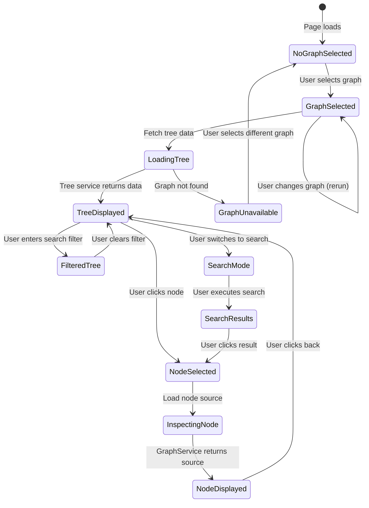
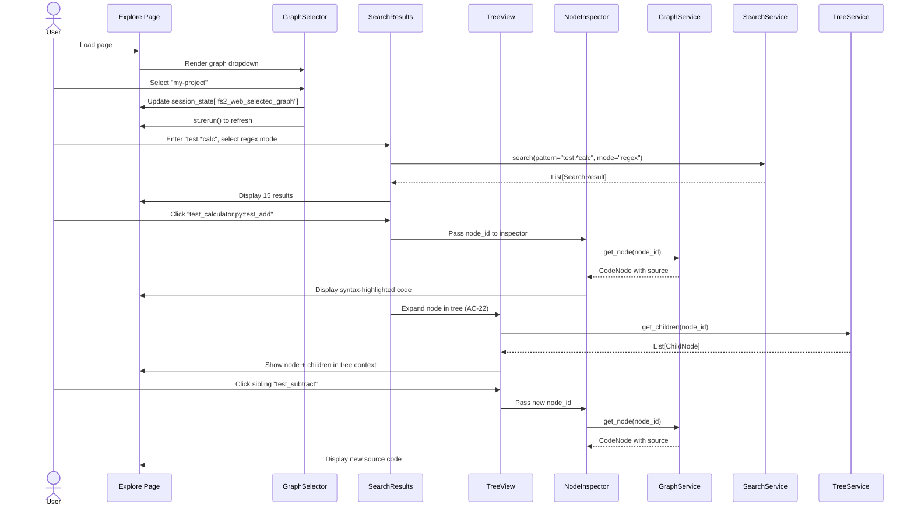

# Phase 6: Exploration – Tasks & Alignment Brief

**Spec**: [../../web-spec.md](../../web-spec.md)
**Plan**: [../../web-plan.md](../../web-plan.md)
**Date**: 2026-01-16
**Phase Slug**: `phase-6-exploration`

---

## Executive Briefing

### Purpose

This phase implements the core exploration and browsing interface for fs2 graphs, enabling users to navigate their codebase using tree views and search. This is the "verify your graph works" capability that builds trust in the system before users dive into deeper MCP integration.

### What We're Building

A **unified code exploration interface** that:
- Provides a global graph selector persisting across all exploration pages
- **TreeView as unified display**: Accepts starter node(s) + depth, defaults to root at depth 1
- **SearchPanel with metadata**: Shows search mode (text/regex/semantic), result count, pagination (limit/offset)
- **Search results feed TreeView**: Search node_ids become TreeView starter_nodes for exploration
- Shows full source code with syntax highlighting when nodes are selected (NodeInspector)
- Enables fluid workflow: search → results in tree → click to expand → inspect code

### User Value

Users can verify that their scanned graphs contain the expected code structure and content. They can quickly navigate large codebases without leaving the browser, search for specific functions or classes, and inspect source code—all confirming "yes, my setup works" before integrating fs2 with AI agents.

### Example

**Workflow**: User wants to find all test functions for the calculator module:

1. **Select graph**: Choose "my-project" from dropdown
2. **Search**: Enter "test.*calc" with regex mode
3. **See metadata**: "15 results (regex mode) — showing 1-10 of 15"
4. **TreeView shows results**: 10 matching nodes displayed as tree roots
5. **Click node**: "test_calculator.py:test_add" expands to show children
6. **NodeInspector**: Sidebar shows syntax-highlighted source code
7. **Paginate**: Click "Next" to see results 11-15

**Result**: User confirms test coverage exists and can inspect implementation details.

---

## Objectives & Scope

### Objective

Create browsing and search interfaces for fs2 graphs with global graph selection, tree navigation, multiple search modes, and source code inspection, satisfying acceptance criteria AC-11, AC-12, AC-19, AC-20, AC-21, and AC-22.

**Behavior Checklist** (from Plan Acceptance Criteria):
- [ ] Global graph selector appears on all exploration pages (AC-19)
- [ ] Graph selection persists across page navigation (AC-20)
- [ ] Tree view shows code structure with expand/collapse
- [x] Search box filters tree to matching nodes (AC-21) — **DYK#5: Clarified as "results become tree roots", not highlight-in-place; spec updated**
- [ ] Multiple search modes (text, regex, semantic if embeddings exist) (AC-11)
- [ ] Node inspector displays syntax-highlighted source code (AC-12)
- [ ] Click search result expands node in tree and shows children (AC-22)
- [ ] **MANUAL VALIDATION**: Web UI accessible via `fs2 web`, all features verified interactively

### Goals

- ✅ Implement global `GraphSelector` component with session state persistence
- ✅ Create `TreeView` component with expand/collapse and pattern filtering
- ✅ Create `SearchResults` component supporting text/regex/semantic modes
- ✅ Create `NodeInspector` component with syntax highlighting
- ✅ Integrate tree filtering from search box (AC-21)
- ✅ Enable node expansion from search results (AC-22)
- ✅ Build Explore page combining all components
- ✅ Integrate Explore page into web UI navigation
- ✅ Full TDD coverage with FakeGraphService for testing
- ✅ **MANUAL VALIDATION**: Run `fs2 web` and verify end-to-end functionality

### Non-Goals (Scope Boundaries)

- ❌ **Advanced code navigation** (jump-to-definition, call hierarchy) - out of scope
- ❌ **Code editing** - Web UI is read-only for exploration
- ❌ **Performance optimization** for huge graphs (>100k nodes) - defer to Phase 7
- ❌ **Graph management** (add/scan repos) - Phase 5 scope
- ❌ **Multi-graph comparison** - not in spec
- ❌ **Persistent bookmarks** or favorites - not required for MVP
- ❌ **Export search results** - not in acceptance criteria
- ❌ **Custom syntax themes** - use default Pygments highlighting

---

## Architecture Map

### Component Diagram

```mermaid
flowchart TD
    classDef pending fill:#9E9E9E,stroke:#757575,color:#fff
    classDef inprogress fill:#FF9800,stroke:#F57C00,color:#fff
    classDef completed fill:#4CAF50,stroke:#388E3C,color:#fff
    classDef blocked fill:#F44336,stroke:#D32F2F,color:#fff

    style Phase fill:#F5F5F5,stroke:#E0E0E0
    style Services fill:#E8F5E9,stroke:#C8E6C9
    style Components fill:#E3F2FD,stroke:#BBDEFB
    style Pages fill:#FFF9C4,stroke:#FFF59D
    style Tests fill:#FCE4EC,stroke:#F8BBD0

    subgraph Phase["Phase 6: Exploration"]
        T001["T001: GraphSelector tests"]:::pending
        T002["T002: GraphSelector impl"]:::pending
        T003["T003: TreeView tests"]:::pending
        T004["T004: TreeView impl"]:::pending
        T005["T005: Search filter tests"]:::pending
        T006["T006: Search filter impl"]:::pending
        T007["T007: SearchResults tests"]:::pending
        T008["T008: SearchResults impl"]:::pending
        T009["T009: NodeInspector tests"]:::pending
        T010["T010: NodeInspector impl"]:::pending
        T011["T011: Node expansion tests"]:::pending
        T012["T012: Node expansion impl"]:::pending
        T013["T013: Explore page"]:::pending
        T014["T014: Web UI integration"]:::pending
        T015["T015: Manual validation"]:::pending

        T001 --> T002
        T002 --> T013
        T003 --> T004
        T004 --> T013
        T005 --> T006
        T006 --> T013
        T007 --> T008
        T008 --> T013
        T009 --> T010
        T010 --> T013
        T011 --> T012
        T012 --> T013
        T013 --> T014
        T014 --> T015
    end

    subgraph Services["Services (from Phase 1)"]
        S1["GraphService (existing)"]:::completed
        S2["TreeService (existing)"]:::completed
        S3["SearchService (existing)"]:::completed
    end

    subgraph Components["Components (new)"]
        C1["/components/graph_selector.py"]:::pending
        C2["/components/tree_view.py"]:::pending
        C3["/components/search_panel.py"]:::pending
        C4["/components/node_inspector.py"]:::pending
    end

    subgraph Pages["Pages (new)"]
        P1["/pages/5_Explore.py"]:::pending
    end

    subgraph Tests["Test Files"]
        TF1["/tests/unit/web/components/test_graph_selector.py"]:::pending
        TF2["/tests/unit/web/components/test_tree_view.py"]:::pending
        TF3["/tests/unit/web/components/test_search_panel.py"]:::pending
        TF4["/tests/unit/web/components/test_node_inspector.py"]:::pending
        TF5["/tests/unit/web/components/test_search_tree_integration.py"]:::pending
        TF6["/tests/integration/web/test_explore_workflow.py"]:::pending
    end

    T001 -.-> TF1
    T002 -.-> C1
    T003 -.-> TF2
    T004 -.-> C2
    T005 -.-> TF3
    T006 -.-> C3
    T007 -.-> TF5
    T008 -.-> C2
    T008 -.-> C3
    T009 -.-> TF4
    T010 -.-> C4
    T011 -.-> TF6
    T012 -.-> C2
    T013 -.-> P1

    C1 -.-> S1
    C2 -.-> S2
    C3 -.-> S3
    C4 -.-> S1
    
    %% Data flow: SearchPanel → TreeView
    C3 -->|"node_ids"| C2
    C2 -->|"selected_node"| C4
```

<!-- Status: grey=pending, orange=in-progress, green=completed, red=blocked -->
<!-- Updated by plan-6 during implementation -->



### Task-to-Component Mapping

<!-- Status: ⬜ Pending | 🟧 In Progress | ✅ Complete | 🔴 Blocked -->

| Task | Component(s) | Files | Status | Comment |
|------|-------------|-------|--------|---------|
| T001 | GraphSelector | test_graph_selector.py | ⬜ Pending | Tests for selection persistence and page navigation |
| T002 | GraphSelector | graph_selector.py | ⬜ Pending | Dropdown with session state persistence (AC-19, AC-20) |
| T003 | TreeView | test_tree_view.py | ⬜ Pending | Tests for starter_nodes + depth, default root@depth=1 |
| T004 | TreeView | tree_view.py | ⬜ Pending | TreeView(starter_nodes, depth) - unified search results display |
| T005 | SearchPanel | test_search_panel.py | ⬜ Pending | Tests for mode selector, limit/offset, result metadata |
| T006 | SearchPanel | search_panel.py | ⬜ Pending | Search controls + metadata (count, mode, pagination) |
| T007 | Search-Tree Integration | test_search_tree_integration.py | ⬜ Pending | Tests for SearchPanel → TreeView data flow |
| T008 | Search-Tree Integration | search_panel.py, tree_view.py | ⬜ Pending | Search results passed to TreeView as starter_nodes |
| T009 | NodeInspector | test_node_inspector.py | ⬜ Pending | Tests for syntax highlighting and metadata |
| T010 | NodeInspector | node_inspector.py | ⬜ Pending | Source code viewer with Pygments highlighting (AC-12) |
| T011 | Node Expansion | test_explore_workflow.py | ⬜ Pending | Integration test for search → tree → inspect workflow |
| T012 | Node Expansion | tree_view.py | ⬜ Pending | Click node expands children + updates NodeInspector (AC-22) |
| T013 | Explore Page | 5_Explore.py | ⬜ Pending | Search + TreeView same page, NodeInspector sidebar |
| T014 | Web UI Integration | app.py | ⬜ Pending | Ensure sidebar navigation and page routing |
| T015 | Manual Validation | – | ⬜ Pending | **FIRST-CLASS**: Human-verified end-to-end testing |

---

## Tasks

| Status | ID   | Task | CS | Type | Dependencies | Absolute Path(s) | Validation | Subtasks | Notes |
|--------|------|------|----|------|--------------|------------------|------------|----------|-------|
| [x] | T001 | Write tests for GraphSelector component | 2 | Test | – | /workspaces/flow_squared/tests/unit/web/components/test_graph_selector.py | Tests cover: selection persistence, st.rerun() on change, **unavailable graphs grayed out with "(unavailable)" suffix**, session state isolation | – | AC-19, AC-20; DYK Insight #2 ⚓T001[^16] |
| [x] | T002 | Implement GraphSelector component | 2 | Core | T001 | /workspaces/flow_squared/src/fs2/web/components/graph_selector.py | Dropdown persists selection; **uses GraphInfo.available to gray out missing graphs**; triggers rerun on change | – | Uses fs2_web_selected_graph key; pre-validation pattern ⚓T002[^17] |
| [x] | T003 | Write tests for TreeView component | 3 | Test | – | /workspaces/flow_squared/tests/unit/web/components/test_tree_view.py | Tests cover: (1) no input → root nodes at depth 1, (2) starter_nodes → those nodes as roots, (3) **click node → lazy-loads children via get_children()**, (4) expanded state persists in session_state, (5) node selection | – | Uses FakeGraphStore (constructor injection); DYK Insight #4/5 ⚓T003[^18] |
| [x] | T004 | Implement TreeView component | 3 | Core | T003 | /workspaces/flow_squared/src/fs2/web/components/tree_view.py | TreeView(starter_nodes: list[str] = None); **click node → calls GraphStore.get_children() → shows next depth**; tracks expanded nodes in `fs2_web_expanded_nodes` session state | 001-subtask-virtual-folder-hierarchy | Lazy expansion, not eager tree loading ⚓T004[^19] |
| [x] | T005 | Write tests for SearchPanel component | 2 | Test | T017 | /workspaces/flow_squared/tests/unit/web/components/test_search_panel.py | Tests cover: search input, mode selector (text/regex/semantic/**auto default**), limit/offset controls, result metadata display, **SearchError handling for explicit semantic mode** | – | Uses FakeSearchPanelService; DYK Insight #3 ⚓T005[^20] |
| [x] | T006 | Implement SearchPanel component | 3 | Core | T005, T017 | /workspaces/flow_squared/src/fs2/web/components/search_panel.py | Search controls + metadata display; **defaults to AUTO mode**; catches SearchError and shows actionable message; returns node_ids to TreeView | – | AC-11, AC-21; uses SearchPanelService ⚓T006[^21] |
| [ ] | T007 | Write tests for search-to-tree integration | 2 | Test | T003, T005, **Subtask-001** | /workspaces/flow_squared/tests/unit/web/components/test_search_tree_integration.py | Tests cover: SearchPanel results → TreeView starter_nodes, pagination updates TreeView, mode change triggers new search, **empty state shows virtual folders** | – | **DYK#1/#3: Blocked by Subtask-001; use FakeGraphStore pattern from test_tree_view.py** |
| [~] | T008 | Implement search-to-tree integration | 2 | Core | T004, T006, T007 | /workspaces/flow_squared/src/fs2/web/components/search_panel.py, /workspaces/flow_squared/src/fs2/web/components/tree_view.py | Search results (node_ids) passed to TreeView as starter_nodes; paging updates displayed nodes | – | **DYK#1: Implementation exists in 5_Explore.py:63-67; mark [x] after T007 tests pass** |
| [x] | T009 | Write tests for NodeInspector component | 2 | Test | – | /workspaces/flow_squared/tests/unit/web/components/test_node_inspector.py | Tests cover: syntax highlighting, metadata display (file path, line numbers, category), empty state | – | Uses FakeGraphStore (constructor injection); DYK Insight #5 ⚓T009[^22] |
| [x] | T010 | Implement NodeInspector component | 2 | Core | T009 | /workspaces/flow_squared/src/fs2/web/components/node_inspector.py | Source code displays with Pygments syntax highlighting and metadata | – | AC-12 ⚓T010[^23] |
| [ ] | T011 | Write tests for node expansion workflow | 2 | Test | T003, T007, **Subtask-001** | /workspaces/flow_squared/tests/integration/web/test_explore_workflow.py | Integration test: search → results in TreeView → click node → children expand → NodeInspector shows code; **also test folder expansion** | – | AC-22; **DYK#2/#3: Deferred until Subtask-001; create tests/integration/web/; use test_search_integration.py pattern** |
| [~] | T012 | Implement node expansion workflow | 2 | Integration | T008, T011 | /workspaces/flow_squared/src/fs2/web/components/tree_view.py | Clicking tree node: (1) expands children in tree, (2) updates NodeInspector with selected node | – | **DYK#2: Implementation exists via session state; mark [x] after T011 tests pass** |
| [x] | T013 | Create Explore page | 3 | Core | T002, T004, T006, T008, T010, T012 | /workspaces/flow_squared/src/fs2/web/pages/5_Explore.py | Layout: GraphSelector top, SearchPanel + TreeView main area, NodeInspector sidebar | – | Search & TreeView same page ⚓T013[^24] |
| [x] | T014 | Integrate Explore page into web UI | 2 | Integration | T013 | /workspaces/flow_squared/src/fs2/web/app.py | Sidebar shows "Explore" link, navigation works from Dashboard and other pages | – | Update app.py if needed for navigation ⚓T014[^25] |
| [!] | T015 | Manual validation of web UI | 2 | Validation | T014, **Subtask-001, T007, T011** | – | Run `fs2 web`, verify: (1) Explore in sidebar, (2) graph selection, (3) search with mode/pagination, (4) results in TreeView, (5) expand nodes, (6) NodeInspector shows code | Screenshot or log evidence in execution.log.md | **FIRST-CLASS**; **DYK#4: BLOCKED until Subtask-001 → T007 → T011 complete; 4/6 checkpoints ready, 2/6 need folders** |
| [x] | T016 | Write tests for SearchPanelService | 2 | Test | – | /workspaces/flow_squared/tests/unit/web/services/test_search_panel_service.py | Tests cover: sync wrapper over async SearchService, mode routing, pagination, error handling | – | DYK Insight #1: async→sync facade ⚓T016[^26] |
| [x] | T017 | Implement SearchPanelService + Fake | 2 | Core | T016 | /workspaces/flow_squared/src/fs2/web/services/search_panel_service.py, /workspaces/flow_squared/src/fs2/web/services/search_panel_service_fake.py | Sync facade wraps async SearchService with asyncio.run(); FakeSearchPanelService for component tests | – | Matches Phase 1/2 service pattern ⚓T017[^27] |

---

## Alignment Brief

### Prior Phases Review

This section synthesizes the complete implementation landscape from Phases 1 and 2, providing the foundation for Phase 3.

#### Phase 1: Foundation (Complete 2026-01-15)

**A. Deliverables Created**:
- **ConfigInspectorService** (`src/fs2/web/services/config_inspector.py`) - Read-only config inspection with source attribution, placeholder state detection, secret masking
- **ConfigBackupService** (`src/fs2/web/services/config_backup.py`) - Atomic backup with SHA-256 verification
- **FakeConfigInspectorService** (`src/fs2/web/services/config_inspector_fake.py`) - Test double with call history
- **FakeConfigBackupService** (`src/fs2/web/services/config_backup_fake.py`) - Test double with call history
- **CLI command** (`fs2 web`) - Launches Streamlit server
- **Streamlit skeleton** (`src/fs2/web/app.py`) - Basic multi-page structure

**B. Lessons Learned**:
- **Pattern established**: Full TDD (tests first) with targeted Fakes for integration testing
- **Stateless design**: Services reload config from disk each time, never cache
- **Cross-platform atomicity**: Use `Path.replace()` for atomic rename (Windows-safe)
- **Test isolation**: Scoped `conftest.py` with `autouse=True` fixture for FS2_* cleanup

**C. Technical Discoveries**:
- **Gotcha**: `load_dotenv()` mutates `os.environ` → Must use `dotenv_values()` (read-only)
- **Gotcha**: Deep merge loses source attribution → Must track separately with ConfigValue dataclass
- **Pattern**: Temp file in same directory ensures atomic rename works across filesystems
- **Pattern**: Flat dot-notation keys (e.g., "llm.timeout") simplify UI rendering

**D. Dependencies Exported**:
- `ConfigInspectorService.inspect(user_path, project_path, secrets_path) → InspectionResult`
- `ConfigBackupService.backup(config_path, backup_dir) → BackupResult`
- `FakeConfigInspectorService` and `FakeConfigBackupService` available for component testing
- Session state pattern: `st.session_state[f"fs2_web_{namespace}_{key}"]`

**E. Critical Findings Applied**:
- **Discovery 01**: ConfigInspectorService critical path - implemented with `dotenv_values()` (no mutation)
- **Discovery 02**: Secret exposure prevention - `mask_secret()` utility implemented
- **Discovery 03**: Source attribution tracked with override chain
- **Discovery 06**: Session isolation enforced with namespaced keys

**F. Incomplete/Blocked Items**: None - Phase 1 100% complete

**G. Test Infrastructure**:
- `conftest.py` with `clear_fs2_env` autouse fixture (scoped to services/)
- `tmp_config_dir` fixture for config file creation
- FakeConfigInspectorService and FakeConfigBackupService patterns established
- 72 tests passing (63 web services + 9 CLI)

**H. Technical Debt**: None identified

**I. Architectural Decisions**:
- **Decision**: Services are stateless (reload from disk) - Rationale: Streamlit's execution model
- **Decision**: Flat attribution keys - Rationale: Simplify UI rendering
- **Decision**: Separate Fake services - Rationale: Avoid magic mocks, explicit test setup
- **Anti-pattern to avoid**: Module-level service instances (violates session isolation)

**J. Scope Changes**: None

**K. Key Log References**:
- [Task T002: ConfigInspectorService implementation](../phase-1-foundation/execution.log.md#task-t003) - Source attribution approach
- [Task T005: ConfigBackupService implementation](../phase-1-foundation/execution.log.md#task-t005) - Atomic backup pattern
- [Task T007-T008: Fake services](../phase-1-foundation/execution.log.md#task-t007) - Fake service pattern established

---

#### Phase 2: Diagnostics Integration (Complete 2026-01-16)

**A. Deliverables Created**:
- **Shared validation module** (`src/fs2/core/validation/`) - Pure functions for config validation (prevents CLI/Web drift)
  - `config_validator.py` - Core validation logic
  - `constants.py` - Shared patterns and URLs
- **ValidationService** (`src/fs2/web/services/validation.py`) - Thin wrapper composing validation + ConfigInspectorService
- **FakeValidationService** (`src/fs2/web/services/validation_fake.py`) - Test double
- **DoctorPanel** (`src/fs2/web/components/doctor_panel.py`) - Health status display component
- **HealthBadge** (`src/fs2/web/components/health_badge.py`) - Sidebar quick status component
- **Dashboard page** (`src/fs2/web/pages/1_Dashboard.py`) - Main entry point with health overview
- **Refactored doctor.py** - Now imports from shared validation module

**B. Lessons Learned**:
- **Extract-and-Verify pattern**: Shared module prevents drift between CLI and Web
- **Component design**: Separate `get_status()` (testable, no Streamlit) from `render()` (Streamlit display)
- **Service composition**: Components depend on services, not validation functions directly
- **Integration testing**: Components test service integration only, not business logic

**C. Technical Discoveries**:
- **Pattern**: Pure functions in shared module → easily testable, reusable across CLI/Web
- **Pattern**: Components have testable methods (`get_color()`, `get_status()`) separate from Streamlit rendering
- **Gotcha**: Must validate `doctor.py` tests pass after refactor (baseline verification)
- **Insight**: Shared validation module is now single source of truth for both CLI and Web

**D. Dependencies Exported**:
- `ValidationService.validate(inspection_result: InspectionResult) → ValidationResult`
- `DoctorPanel.get_status(validation_result) → dict` - Returns structured status for testing
- `HealthBadge.get_color(status) → str` - Returns green/yellow/red
- `FakeValidationService` available for component testing
- Shared validation functions from `src/fs2/core/validation/config_validator.py`

**E. Critical Findings Applied**:
- **Discovery 02**: Secret exposure prevention - ValidationService never logs secrets
- **Discovery 06**: Session isolation - All components use namespaced session keys

**F. Incomplete/Blocked Items**: None - Phase 2 100% complete (12/12 tasks)

**G. Test Infrastructure**:
- `tests/unit/core/validation/test_config_validator.py` - 33 tests for shared validation
- `tests/unit/web/services/test_validation.py` - 12 tests for ValidationService
- `tests/unit/web/components/test_doctor_panel.py` - 4 tests for DoctorPanel
- `tests/unit/web/components/test_health_badge.py` - 3 tests for HealthBadge
- `tests/unit/cli/test_doctor.py` - 37 tests still passing after refactor
- FakeValidationService pattern established
- 165 tests passing total

**H. Technical Debt**: None identified

**I. Architectural Decisions**:
- **Decision**: Shared validation module - Rationale: Single source of truth prevents CLI/Web drift
- **Decision**: Service wrapping - Rationale: Isolates components from validation logic changes
- **Decision**: Testable component methods - Rationale: Separate business logic from Streamlit rendering
- **Anti-pattern to avoid**: Copying validation logic (causes maintenance drift)

**J. Scope Changes**: Expanded from 7 to 12 tasks to include shared validation module (per Critical Insights session 2026-01-15)

**K. Key Log References**:
- [Task T002: Shared validation module](../phase-2-diagnostics-integration/execution.log.md#task-t002) - Extract-and-Verify pattern
- [Task T003: doctor.py refactor](../phase-2-diagnostics-integration/execution.log.md#task-t003) - Baseline verification approach
- [Task T009: DoctorPanel implementation](../phase-2-diagnostics-integration/execution.log.md#task-t009) - Testable component pattern

---

### Cross-Phase Synthesis

**Phase-by-Phase Evolution**:
- **Phase 1** established the foundation: read-only config services, backup safety, Streamlit skeleton, and TDD+Fakes pattern
- **Phase 2** built on Phase 1's ConfigInspectorService, adding validation layer and diagnostic UI components
- **Phase 3** (current) shifts focus from configuration to exploration, building on the established patterns but introducing new domain (GraphService, TreeService, SearchService)

**Cumulative Deliverables** (organized by phase of origin):
- **From Phase 1**: ConfigInspectorService, ConfigBackupService, FakeConfigInspectorService, FakeConfigBackupService, `fs2 web` CLI command, Streamlit app skeleton
- **From Phase 2**: Shared validation module, ValidationService, FakeValidationService, DoctorPanel, HealthBadge, Dashboard page
- **Available for Phase 3**: All services and components above, plus existing GraphService, TreeService, SearchService

**Cumulative Dependencies**:
- Phase 1 → Phase 2: ValidationService composes ConfigInspectorService
- Phase 1 → Phase 3: GraphSelector needs session state pattern from Phase 1
- Phase 2 → Phase 3: Dashboard page can link to Explore page

**Pattern Evolution**:
- **TDD approach**: Maintained consistently (RED → GREEN → REFACTOR)
- **Fake services**: Pattern proven with Config and Validation fakes, now applying to Graph/Tree/Search fakes
- **Component design**: Evolved to separate testable methods from Streamlit rendering (Phase 2 innovation)
- **Session state**: Started in Phase 1, refined in Phase 2, now critical for Phase 3 graph selection

**Recurring Issues**: None - both phases completed without technical debt

**Cross-Phase Learnings**:
- **Shared modules prevent drift**: Proven in Phase 2, applies to any CLI/Web overlap
- **Stateless services simplify testing**: Proven in Phase 1, continue in Phase 3
- **Scoped conftest.py prevents pollution**: Effective in Phase 1, maintain in Phase 3

**Foundation for Current Phase**:
- **Phase 1 provides**: Session state pattern, Fake service pattern, Streamlit multi-page structure
- **Phase 2 provides**: Component design pattern (testable methods + render), Dashboard page as navigation hub
- **Existing fs2 provides**: GraphService, TreeService, SearchService (already implemented and tested)

**Reusable Infrastructure**:
- `conftest.py` fixtures: `clear_fs2_env`, `tmp_config_dir`
- Fake service pattern: Call history tracking, `set_result()`, `simulate_error()`
- Session state namespace: `fs2_web_{namespace}_{key}`
- Component testing pattern: Test `get_*()` methods separately from `render()`

**Architectural Continuity**:
- **Maintain**: Stateless services, TDD, Fake service pattern, session state isolation
- **Extend**: Component design pattern to GraphSelector, TreeView, SearchResults, NodeInspector
- **New**: Integration tests for multi-component workflows (search → expand)

**Critical Findings Timeline**:
- **Phase 1**: Discovery 01 (ConfigInspectorService critical), Discovery 02 (secret exposure), Discovery 03 (source attribution), Discovery 06 (session isolation)
- **Phase 2**: Applied Discoveries 02 and 06, no new critical findings
- **Phase 3**: Must apply Discovery 06 (session isolation) for graph selector, Discovery 07 (graph selector persistence)

---

### Critical Findings Affecting This Phase

**Discovery 06: Session Isolation Required** (High Impact)
- **What it constrains**: All services must be session-scoped via `st.session_state` with namespaced keys (`fs2_web_*`)
- **How it affects Phase 3**: GraphSelector must use `st.session_state["fs2_web_selected_graph"]` to persist selection across pages
- **Tasks addressing it**: T001 (GraphSelector tests include session state isolation test), T002 (GraphSelector implementation uses session state)

**Discovery 07: Global Graph Selector Persistence** (High Impact)
- **What it constrains**: Graph selection must persist across page navigation; use `st.rerun()` on selection change
- **How it affects Phase 3**: Core requirement for AC-19 and AC-20; GraphSelector component must trigger rerun when selection changes
- **Tasks addressing it**: T001, T002 (GraphSelector explicitly implements persistence and rerun)

**Discovery 08: Test Pollution Prevention** (High Impact)
- **What it constrains**: Tests must use `autouse=True` fixtures to clear all `FS2_*` environment variables before each test; no module-level config loading
- **How it affects Phase 3**: Reuse existing `conftest.py` pattern from Phase 1; component tests must not assume environment state
- **Tasks addressing it**: All test tasks (T001, T003, T005, T007, T009, T011) follow pattern from Phase 1 conftest

**Discovery 09: Web Service Composition** (High Impact)
- **What it constrains**: Web services are composition wrappers, not replacements; delegate to existing GraphService, TreeService, SearchService
- **How it affects Phase 3**: Components integrate existing services rather than reimplementing logic
- **Tasks addressing it**: T004 (TreeView integrates TreeService), T008 (SearchResults integrates SearchService), T010 (NodeInspector integrates GraphService)

---

### ADR Decision Constraints

No ADRs exist for this project.

---

### Invariants & Guardrails

**Security**:
- **No secret exposure**: Even though exploration doesn't handle secrets, maintain pattern of never logging sensitive data
- **Read-only operations**: All graph operations are read-only (no code modification)

**Performance**:
- **No performance budgets yet**: Defer to Phase 7 if large graphs cause lag
- **Assumption**: Default graph size (<10k nodes) performs adequately with basic Streamlit rendering

**Session State**:
- **Namespaced keys**: Use `fs2_web_selected_graph`, `fs2_web_tree_expanded_nodes`, etc.
- **Isolation**: Each session maintains independent state (no cross-session leakage)

---

### Inputs to Read

**Configuration Files** (for context, not direct dependencies):
- `~/.config/fs2/config.yaml` - To understand multi-graph configuration (`other_graphs.graphs`)
- `.fs2/config.yaml` - Project-specific graph configuration

**Existing Services** (fs2 core):
- `src/fs2/core/graph/graph_service.py` - GraphService API for loading graphs
- `src/fs2/core/graph/tree_service.py` - TreeService API for tree queries
- `src/fs2/core/graph/search_service.py` - SearchService API for search queries

**Phase 1 & 2 Deliverables**:
- `src/fs2/web/app.py` - Streamlit multi-page structure
- `src/fs2/web/pages/1_Dashboard.py` - Dashboard page to link from
- `tests/unit/web/services/conftest.py` - Test isolation pattern

**Spec & Plan**:
- `docs/plans/026-web/web-spec.md` - AC-11, AC-12, AC-19, AC-20, AC-21, AC-22
- `docs/plans/026-web/web-plan.md` - Phase 6 (Exploration) task table and acceptance criteria

---

### Visual Alignment Aids

#### Flow Diagram: Graph Selection and Exploration States



#### Sequence Diagram: Search → Inspect → Expand Workflow (AC-22)



---

### Test Plan

**Testing Approach**: Full TDD (tests first, then implementation)

**Mock/Fake Strategy**: 
- Use **FakeGraphService**, **FakeTreeService**, **FakeSearchService** for component testing
- Follow Phase 1/2 pattern: `call_history`, `set_result()`, `simulate_error()`
- Integration tests use real services with temporary graph data

**Named Tests**:

1. **test_graph_selector_displays_all_graphs** (Unit)
   - **Rationale**: Verify dropdown shows default + other_graphs
   - **Fixtures**: FakeGraphService with 3 configured graphs
   - **Expected**: Dropdown shows all 3 graphs with availability status

2. **test_graph_selector_persists_selection** (Unit)
   - **Rationale**: AC-20 - Selection must persist across page navigation
   - **Fixtures**: FakeGraphService, mock session_state
   - **Expected**: session_state["fs2_web_selected_graph"] updated, st.rerun() called

3. **test_tree_view_expands_and_collapses_nodes** (Unit)
   - **Rationale**: Core tree navigation requirement
   - **Fixtures**: FakeTreeService with mock tree structure
   - **Expected**: Clicking node updates expanded state, children visible

4. **test_tree_view_filters_by_search_text** (Unit)
   - **Rationale**: AC-21 - Search box must filter tree nodes
   - **Fixtures**: FakeTreeService with 10 nodes
   - **Expected**: Entering "calc" shows only nodes containing "calc"

5. **test_search_results_hides_semantic_without_embeddings** (Unit)
   - **Rationale**: AC-11 - Semantic mode only if embeddings exist
   - **Fixtures**: FakeSearchService with embeddings=False
   - **Expected**: Semantic mode not shown in mode selector

6. **test_search_results_displays_similarity_scores** (Unit)
   - **Rationale**: Semantic search shows scores
   - **Fixtures**: FakeSearchService with semantic results
   - **Expected**: Each result displays score (0.0-1.0)

7. **test_node_inspector_syntax_highlights_python** (Unit)
   - **Rationale**: AC-12 - Syntax highlighting required
   - **Fixtures**: FakeGraphService with Python source code
   - **Expected**: Code rendered with Pygments highlighting

8. **test_node_inspector_displays_metadata** (Unit)
   - **Rationale**: Show file path, line numbers, category
   - **Fixtures**: FakeGraphService with CodeNode
   - **Expected**: Metadata section shows file:path, lines, category

9. **test_node_expansion_from_search_result** (Integration)
   - **Rationale**: AC-22 - Click result → expand in tree → show children
   - **Fixtures**: Real TreeService with sample graph
   - **Expected**: Search result click updates tree state, node + children visible

10. **test_explore_page_layout** (Integration)
    - **Rationale**: Verify all components render together
    - **Fixtures**: Real services with sample graph
    - **Expected**: Page renders with selector, tree, search, inspector in layout

---

### Step-by-Step Implementation Outline

This outline maps 1:1 to the task table:

1. **T001-T002: Graph Selector**
   - Write tests for dropdown rendering, selection persistence, session state updates
   - Implement GraphSelector with st.selectbox and session_state integration
   - **Checkpoint**: Dropdown shows graphs, selection persists after st.rerun()

2. **T003-T004: Tree View**
   - Write tests for tree rendering, expand/collapse state, node selection
   - Implement TreeView using st.expander or custom tree widget
   - **Checkpoint**: Tree displays code structure, nodes expand/collapse correctly

3. **T005-T006: Search Filter Integration**
   - Write tests for search box filtering tree nodes, clear button
   - Implement search input that filters tree based on node_id substring
   - **Checkpoint**: Search box filters tree, clear button restores full tree

4. **T007-T008: Search Results**
   - Write tests for text/regex/semantic modes, result display, mode visibility
   - Implement SearchResults component with mode selector and result list
   - **Checkpoint**: Search executes, results display with mode-appropriate metadata

5. **T009-T010: Node Inspector**
   - Write tests for syntax highlighting, metadata display, empty state
   - Implement NodeInspector using Pygments for highlighting
   - **Checkpoint**: Selected node displays with syntax highlighting and metadata

6. **T011-T012: Node Expansion Workflow**
   - Write integration test for search → click result → expand in tree
   - Implement session state coordination between SearchResults and TreeView
   - **Checkpoint**: Clicking search result expands node in tree with children visible

7. **T013: Explore Page**
   - Create page layout integrating all components
   - Add navigation from Dashboard (link to Explore)
   - **Checkpoint**: Page renders with all components, navigation works

---

### Commands to Run

**Development**:
```bash
# Launch web UI for manual testing
fs2 web

# Run linter during development
ruff check src/fs2/web/components/graph_selector.py src/fs2/web/components/tree_view.py
```

**Testing** (copy/paste during implementation):
```bash
# Run unit tests for each component
pytest tests/unit/web/components/test_graph_selector.py -v
pytest tests/unit/web/components/test_tree_view.py -v
pytest tests/unit/web/components/test_search_results.py -v
pytest tests/unit/web/components/test_node_inspector.py -v

# Run integration test for workflow
pytest tests/integration/web/test_explore_workflow.py -v

# Full phase verification
pytest tests/unit/web/components/ tests/integration/web/test_explore_workflow.py -v

# Coverage check (target: >80% for new code)
pytest tests/unit/web/ --cov=src/fs2/web --cov-report=term-missing --cov-fail-under=80

# Test session state isolation
pytest tests/unit/web/components/test_graph_selector.py::test_session_isolation -v
```

**Verification**:
```bash
# Lint all new files
ruff check src/fs2/web/components/graph_selector.py \
           src/fs2/web/components/tree_view.py \
           src/fs2/web/components/search_results.py \
           src/fs2/web/components/node_inspector.py \
           src/fs2/web/pages/5_Explore.py

# Type check
mypy src/fs2/web/components/

# Full test suite (including Phases 1 & 2)
pytest tests/unit/web/ tests/integration/web/ -v
```

---

### Risks/Unknowns

| Risk | Severity | Mitigation |
|------|----------|------------|
| **Large graphs cause UI lag** | Medium | Start with basic rendering; defer pagination/lazy loading to Phase 7 if needed |
| **Semantic search without embeddings** | Low | Hide semantic mode when embeddings not available (AC-11) |
| **Session state conflicts** | Low | Use namespaced keys (`fs2_web_selected_graph`, `fs2_web_tree_expanded_nodes`) |
| **Syntax highlighting performance** | Low | Pygments is fast for typical file sizes; monitor if issues arise |
| **TreeView complexity** | Medium | Use simple st.expander approach first; custom widget if needed later |
| **Node expansion state management** | Medium | Document session state keys clearly; add integration test (T011) to catch issues early |

---

### Ready Check

Checkboxes to confirm before implementation:

- [ ] **Critical Findings reviewed**: Discoveries 06, 07, 08, 09 understood and mapped to tasks
- [ ] **ADR constraints mapped**: N/A (no ADRs exist)
- [ ] **Phase 1 & 2 deliverables reviewed**: Session state pattern, Fake service pattern, component design pattern understood
- [ ] **Existing services identified**: GraphService, TreeService, SearchService APIs reviewed
- [ ] **Acceptance criteria clear**: AC-11, AC-12, AC-19, AC-20, AC-21, AC-22 understood
- [ ] **Test plan reviewed**: 10 named tests cover all acceptance criteria
- [ ] **Session state namespacing**: `fs2_web_selected_graph`, `fs2_web_tree_expanded_nodes`, `fs2_web_search_results` keys defined
- [ ] **Integration test scope**: test_explore_workflow.py covers search → expand → inspect workflow

**GO/NO-GO**: Awaiting human approval to proceed with implementation.

---

## Phase Footnote Stubs

_This section is populated by plan-6a-update-progress during implementation. Footnote tags ([^N]) are added to the task table and main plan § 12 Change Footnotes Ledger as tasks complete._

### Phase 6: Exploration (2026-01-16)

[^16]: Phase 6 T001 - GraphSelector tests (11 tests)
  - `file:tests/unit/web/components/test_graph_selector.py`

[^17]: Phase 6 T002 - GraphSelector component
  - `class:src/fs2/web/components/graph_selector.py:GraphSelector`
  - `method:src/fs2/web/components/graph_selector.py:GraphSelector.render`
  - `method:src/fs2/web/components/graph_selector.py:GraphSelector.get_graph_options`

[^18]: Phase 6 T003 - TreeView tests (13 tests)
  - `file:tests/unit/web/components/test_tree_view.py`

[^19]: Phase 6 T004 - TreeView component
  - `class:src/fs2/web/components/tree_view.py:TreeView`
  - `method:src/fs2/web/components/tree_view.py:TreeView.render`
  - `method:src/fs2/web/components/tree_view.py:TreeView.get_display_nodes`

[^20]: Phase 6 T005 - SearchPanel tests (14 tests)
  - `file:tests/unit/web/components/test_search_panel.py`

[^21]: Phase 6 T006 - SearchPanel component
  - `class:src/fs2/web/components/search_panel.py:SearchPanel`
  - `class:src/fs2/web/components/search_panel.py:SearchPanelOutput`
  - `method:src/fs2/web/components/search_panel.py:SearchPanel.render`
  - `method:src/fs2/web/components/search_panel.py:SearchPanel.get_search_output`

[^22]: Phase 6 T009 - NodeInspector tests (9 tests)
  - `file:tests/unit/web/components/test_node_inspector.py`

[^23]: Phase 6 T010 - NodeInspector component
  - `class:src/fs2/web/components/node_inspector.py:NodeInspector`
  - `method:src/fs2/web/components/node_inspector.py:NodeInspector.render`
  - `method:src/fs2/web/components/node_inspector.py:NodeInspector.get_node_data`
  - `method:src/fs2/web/components/node_inspector.py:NodeInspector.get_language`

[^24]: Phase 6 T013 - Explore page
  - `file:src/fs2/web/pages/5_Explore.py`

[^25]: Phase 6 T014 - Web UI integration
  - `method:src/fs2/web/app.py:_render_explore`

[^26]: Phase 6 T016 - SearchPanelService tests (15 tests)
  - `file:tests/unit/web/services/test_search_panel_service.py`

[^27]: Phase 6 T017 - SearchPanelService + Fake
  - `class:src/fs2/web/services/search_panel_service.py:SearchPanelService`
  - `class:src/fs2/web/services/search_panel_service.py:SearchPanelResult`
  - `method:src/fs2/web/services/search_panel_service.py:SearchPanelService.search`
  - `class:src/fs2/web/services/search_panel_service_fake.py:FakeSearchPanelService`

---

## Evidence Artifacts

**Execution Log**: `/workspaces/flow_squared/docs/plans/026-web/tasks/phase-6-exploration/execution.log.md`
- Populated by plan-6-implement-phase during implementation
- Contains detailed narrative of each task with decisions, issues, and resolutions

**Test Results**: Captured in execution log after each task's test run

**Supporting Files**:
- None additional (all artifacts in phase directory)

---

## Discoveries & Learnings

_Populated during implementation by plan-6. Log anything of interest to your future self._

| Date | Task | Type | Discovery | Resolution | References |
|------|------|------|-----------|------------|------------|
| | | | | | |

**Types**: `gotcha` | `research-needed` | `unexpected-behavior` | `workaround` | `decision` | `debt` | `insight`

**What to log**:
- Things that didn't work as expected
- External research that was required
- Implementation troubles and how they were resolved
- Gotchas and edge cases discovered
- Decisions made during implementation
- Technical debt introduced (and why)
- Insights that future phases should know about

_See also: `execution.log.md` for detailed narrative._

---

## Directory Layout

```
docs/plans/026-web/tasks/phase-6-exploration/
├── tasks.md                # This file (tasks + alignment brief)
└── execution.log.md        # Created by plan-6 during implementation
```

**Simple Mode Note**: This plan uses the full dossier approach (not Simple Mode), so tasks and execution log are in the `tasks/phase-6-exploration/` directory.

---

**END OF DOSSIER** - Awaiting GO signal to begin implementation with `/plan-6-implement-phase --phase "Phase 6: Exploration" --plan "/workspaces/flow_squared/docs/plans/026-web/web-plan.md"`

---

## Critical Insights Discussion

**Session**: 2026-01-16 02:47 UTC
**Context**: Phase 6: Exploration - Tasks & Alignment Brief
**Analyst**: AI Clarity Agent
**Reviewer**: Development Team
**Format**: Water Cooler Conversation (5 Critical Insights)

### Insight 1: SearchService is Async but Streamlit is Sync

**Did you know**: The existing SearchService is fully async (`async def search()`), but Streamlit runs synchronously - you can't `await` in the main script.

**Implications**:
- SearchPanel component cannot call SearchService directly
- Need sync wrapper or asyncio.run() bridge
- TreeService and GraphService are sync, so only search has this issue

**Options Considered**:
- Option A: asyncio.run() Wrapper - Simple one-liner, minor overhead
- Option B: SearchPanelService (Sync Facade) - Clean separation, matches Phase 1/2 pattern
- Option C: st.experimental_async - Experimental, version-dependent

**AI Recommendation**: Option B - SearchPanelService
- Reasoning: Matches established Phase 1/2 pattern, enables FakeSearchPanelService for testing

**Discussion Summary**: User agreed with recommendation. Sync facade pattern keeps components clean and testable.

**Decision**: Create SearchPanelService as sync facade over async SearchService

**Action Items**:
- [x] Added T016: Write tests for SearchPanelService
- [x] Added T017: Implement SearchPanelService + FakeSearchPanelService
- [x] Updated T005/T006 dependencies to T017

**Affects**: Tasks T005, T006, T016, T017

---

### Insight 2: Graph File Missing = Page Crash Without Graceful Handling

**Did you know**: If a user selects a graph whose pickle file was deleted, the Explore page would crash with a Python traceback instead of a helpful message.

**Implications**:
- Poor UX when graphs go stale (common during development)
- GraphService already distinguishes `GraphFileNotFoundError` vs `UnknownGraphError`
- CLI has excellent error handling with actionable guidance

**Options Considered**:
- Option A: Component-Level Error Handling - Granular but duplicated
- Option B: Page-Level Error Boundary - Single location but loses granularity
- Option C: GraphSelector Pre-Validation - Uses `GraphInfo.available`, prevents errors
- Option D: Hybrid - Pre-validation + fallback

**AI Recommendation**: Option C - GraphSelector Pre-Validation
- Reasoning: Uses existing `GraphInfo.available` field, minimal code, prevents crashes

**Discussion Summary**: User confirmed Option C. Research showed CLI already has excellent error handling infrastructure that we can leverage.

**Decision**: GraphSelector uses `list_graphs()` → `GraphInfo.available` to gray out unavailable graphs

**Action Items**:
- [x] Updated T001 to test unavailable graphs grayed out with "(unavailable)" suffix
- [x] Updated T002 to use GraphInfo.available for pre-validation

**Affects**: Tasks T001, T002

---

### Insight 3: Semantic Search May Silently Fail if Embeddings Don't Exist

**Did you know**: If a user selects "semantic" search mode but the graph was scanned without `--embed`, they get zero results with no explanation.

**Implications**:
- User confusion when semantic search returns nothing
- No indication that semantic mode requires embeddings
- AUTO mode already falls back gracefully to TEXT

**Options Considered**:
- Option A: Disable Semantic When No Embeddings - Cleanest UX but needs detection
- Option B: Show Warning When Semantic Selected - Educational but allows broken flow
- Option C: Auto-Fallback to Text Mode - Something always works

**AI Recommendation**: Option A initially, but research revealed better approach
- Research showed: AUTO mode already falls back gracefully, explicit SEMANTIC raises `SearchError` with actionable message

**Discussion Summary**: Research revealed existing infrastructure handles this elegantly. AUTO mode gracefully degrades. Just need to default to AUTO and catch SearchError.

**Decision**: Default SearchPanel to AUTO mode; catch `SearchError` for explicit SEMANTIC selection

**Action Items**:
- [x] Updated T005 to test AUTO as default, SearchError handling
- [x] Updated T006 to default to AUTO mode, catch SearchError with actionable message

**Affects**: Tasks T005, T006

---

### Insight 4: TreeView Depth Parameter Creates Confusing UX

**Did you know**: The original `depth` parameter design could cause user confusion - expansion state would be lost on pagination.

**Implications**:
- Expansion state vs pagination conflict
- Original design was "pre-load to depth N" not "lazy expand on click"
- Better UX is "click to expand next level"

**Options Considered**:
- Option A: Persist Expansion State in Session - Full state preservation
- Option B: Depth = Initial Only, No Persistence - Simple but frustrating
- Option C: Warn User Before Pagination Clears State - Doesn't solve problem

**AI Recommendation**: Option A initially

**Discussion Summary**: User clarified: "TreeView will just always expand to show the next depth" - lazy loading on click. Research confirmed `GraphStore.get_children()` exists for this.

**Decision**: TreeView uses lazy expansion - click node → `get_children()` → show children; track expanded nodes in session state

**Action Items**:
- [x] Updated T003 to test lazy-loading via get_children(), session state persistence
- [x] Updated T004 to implement click→get_children() pattern, removed `depth` param

**Affects**: Tasks T003, T004

---

### Insight 5: No FakeGraphService Exists Yet - Component Testing Blocked

**Did you know**: While Phase 1 & 2 created Fake services for testing, there's no FakeGraphService for Phase 3 components.

**Implications**:
- T003 (TreeView tests) and T009 (NodeInspector tests) need graph operations
- Without Fakes, tests would hit real GraphService → need real graph files
- Test isolation would be broken

**Options Considered**:
- Option A: Create FakeGraphService + FakeGraphStore - Full isolation, more code
- Option B: Use Existing FakeGraphStore from Core - Reuse existing code
- Option C: Minimal Test Fixtures - Simple but violates pattern

**AI Recommendation**: Option B - Use Existing FakeGraphStore

**Discussion Summary**: Research revealed `FakeGraphStore` already exists at `src/fs2/core/repos/graph_store_fake.py`. TreeService and SearchService tests already use it via constructor injection. Pattern is established.

**Decision**: Use existing FakeGraphStore via constructor injection, following TreeService test pattern

**Action Items**:
- [x] Updated T003 notes to reference FakeGraphStore pattern
- [x] Updated T009 notes to use FakeGraphStore instead of FakeGraphService

**Affects**: Tasks T003, T009

---

## Session Summary

**Insights Surfaced**: 5 critical insights identified and discussed
**Decisions Made**: 5 decisions reached through collaborative discussion
**Action Items Created**: 12 task updates applied immediately during session
**Areas Requiring Updates**: Tasks T001-T006, T009, T016-T017

**Shared Understanding Achieved**: ✓

**Confidence Level**: High - All insights addressed with concrete decisions, existing infrastructure leveraged where possible

**Next Steps**:
1. Review updated tasks (now 17 tasks: T001-T017)
2. Confirm GO/NO-GO for implementation
3. Run `/plan-6-implement-phase --phase "Phase 6: Exploration" --plan "/workspaces/flow_squared/docs/plans/026-web/web-plan.md"`

**Notes**:
- SearchPanelService (T016/T017) is new scope from DYK session
- Lazy expansion pattern (T003/T004) is cleaner than original depth-based design
- FakeGraphStore reuse avoids new fake creation
- AUTO mode default leverages existing graceful degradation

---

## Critical Insights Discussion (Session 2)

**Session**: 2026-01-16 ~03:30 UTC
**Context**: Phase 6: Exploration - Remaining Tasks Review (T007, T008, T011, T012, T015)
**Analyst**: AI Clarity Agent (Claude Opus 4.5)
**Reviewer**: Development Team
**Format**: Water Cooler Conversation (5 Critical Insights)

### Insight 1: T007/T008 Search-to-Tree Integration Already Implemented

**Did you know**: The SearchPanel→TreeView integration described in T007/T008 already exists in `5_Explore.py:63-67`. SearchPanel returns `node_ids`, TreeView accepts `starter_nodes`, and they're wired together.

**Implications**:
- T008 implementation is complete—code exists
- T007 (tests) is the only remaining work
- BUT: Empty state shows 4959 flat files, not virtual folders
- Subtask 001 must complete before T007 tests can verify both modes

**Options Considered**:
- Option A: Create separate integration service — Not needed
- Option B: Mark T008 complete, write T007 tests only — Feasible but blocked
- Option B-1: Complete Subtask 001 first, then T007/T008 — Recommended

**AI Recommendation**: Option B-1
- Reasoning: TreeView must show virtual folders when empty; T007 tests should cover both search-result mode AND folder mode

**Discussion Summary**: User confirmed B-1. Virtual folder hierarchy is prerequisite for meaningful integration tests.

**Decision**: Complete Subtask 001 (ST001-ST004) first, then write T007 tests, then mark T008 complete

**Action Items**:
- [x] Updated T007 dependencies to include Subtask-001
- [x] Updated T008 status to [~] with note that implementation exists

**Affects**: T007, T008, Subtask-001 ordering

---

### Insight 2: T011/T012 Node Expansion Also Already Implemented

**Did you know**: The node expansion workflow (T011/T012) is fully implemented via TreeView's lazy loading (`_render_node()`) and shared session state key (`fs2_web_selected_node`) between TreeView and NodeInspector.

**Implications**:
- T012 implementation exists—click expand works, NodeInspector updates
- T011 (integration tests) is the only remaining work
- Tests should cover both search-result expansion AND folder expansion

**Options Considered**:
- Option A: Write new implementation — Not needed
- Option B: Mark T012 complete, write T011 tests — Feasible but blocked
- Option C: Defer T011/T012 until Subtask 001 done — Recommended

**AI Recommendation**: Option C
- Reasoning: Integration tests should verify both modes; testing partial state gives false confidence

**Discussion Summary**: User confirmed C. One comprehensive test pass after Subtask 001 is cleaner.

**Decision**: Defer T011/T012 until after Subtask 001 → T007 completes

**Action Items**:
- [x] Updated T011 dependencies to include Subtask-001
- [x] Updated T012 status to [~] with note that implementation exists

**Affects**: T011, T012, critical path ordering

---

### Insight 3: Test Files Don't Exist But Infrastructure Is Ready

**Did you know**: Both `test_search_tree_integration.py` (T007) and `test_explore_workflow.py` (T011) don't exist, and `tests/integration/web/` directory doesn't exist. However, rich test infrastructure exists to support them.

**Implications**:
- Must create `tests/integration/web/` directory for T011
- T007 follows `test_tree_view.py` pattern with FakeGraphStore
- T011 follows `test_search_integration.py` pattern with real services
- 57 existing unit tests provide reusable helpers

**Options Considered**:
- Option A: Create both files with full TDD — Recommended
- Option B: Extend existing component tests — Violates unit/integration separation
- Option C: Lightweight smoke tests — May miss integration bugs

**AI Recommendation**: Option A
- Reasoning: Maintains established patterns; templates exist; follows documented plan

**Discussion Summary**: User confirmed A. Full TDD approach with proper separation.

**Decision**: Create both test files following established patterns when implementing T007/T011

**Action Items**:
- [x] Updated T007 notes with template reference (test_tree_view.py pattern)
- [x] Updated T011 notes with template reference (test_search_integration.py pattern)

**Affects**: T007, T011 implementation approach

---

### Insight 4: T015 Manual Validation Has 6 Checkpoints—4 Ready, 2 Blocked

**Did you know**: T015's validation checklist has 6 points. 4 are ready now (Explore sidebar, graph selection, search, NodeInspector). 2 are blocked by Subtask 001 (results in TreeView, expand nodes).

**Implications**:
- Could do partial validation now (4/6 points)
- OR wait for complete validation after critical path
- 57 unit tests already prove components work in isolation

**Options Considered**:
- Option A: Block T015 until all integration tasks complete — Recommended
- Option B: Proceed now, document gaps — Incomplete evidence
- Option C: Split T015 into component/integration validation — Extra granularity

**AI Recommendation**: Option A
- Reasoning: One clean validation pass after everything works; unit tests already prove components

**Discussion Summary**: User confirmed A. Consistent with earlier deferral decisions.

**Decision**: T015 remains blocked until Subtask-001 → T007 → T011 complete

**Action Items**:
- [x] Updated T015 status to [!] (blocked)
- [x] Updated T015 dependencies to include Subtask-001, T007, T011

**Affects**: T015 blocking status

---

### Insight 5: AC-21 Implementation Differs From Literal Spec—Intentionally

**Did you know**: AC-21 literally says "tree filters to show only nodes... preserving hierarchy context" but the implementation shows "search results as tree roots". These are different behaviors, but the implementation matches spec intent ("search narrows the tree").

**Implications**:
- Current "results as roots" behavior is clean and functional
- Literal spec wording could confuse future readers
- No code change needed—just documentation clarification

**Options Considered**:
- Option A: Accept current behavior as AC-21 compliant — Feasible
- Option B: Implement true filter mode — Scope creep
- Option C: Clarify AC-21 wording in spec — Feasible
- Option A+C: Accept + clarify — Recommended

**AI Recommendation**: Option A + C
- Reasoning: Current behavior matches spec intent; clarification prevents future confusion

**Discussion Summary**: User confirmed A+C. Update spec to document actual design decision.

**Decision**: Accept current implementation as AC-21 compliant; clarify spec wording

**Action Items**:
- [x] Updated web-spec.md AC-21 wording to describe actual behavior
- [x] Updated tasks.md behavior checklist to mark AC-21 clarified

**Affects**: AC-21 interpretation, spec documentation

---

## Session 2 Summary

**Insights Surfaced**: 5 critical insights identified and discussed
**Decisions Made**: 5 decisions reached through collaborative discussion
**Action Items Created**: 10 task/spec updates applied immediately during session
**Files Updated**:
- `/workspaces/flow_squared/docs/plans/026-web/tasks/phase-6-exploration/tasks.md` (T007, T008, T011, T012, T015, behavior checklist)
- `/workspaces/flow_squared/docs/plans/026-web/web-spec.md` (AC-21 clarification)

**Shared Understanding Achieved**: ✓

**Confidence Level**: High - Critical path clarified, implementations already exist, only tests and Subtask 001 remain

**Critical Path Clarified**:
```
Subtask 001 (virtual folders) — ST001 → ST002 → ST003 → ST004
    ↓
T007 (search-to-tree tests) — write tests
    ↓
T008 (mark complete) — implementation exists
    ↓
T011 (workflow integration tests) — write tests
    ↓
T012 (mark complete) — implementation exists
    ↓
T015 (manual validation) — verify all 6 checkpoints
```

**Next Steps**:
1. Start Subtask 001 implementation (ST001-ST004)
2. After Subtask 001: Write T007 tests, mark T008 complete
3. After T007: Write T011 tests, mark T012 complete
4. After T011: Execute T015 manual validation

**Key Realizations**:
- T008 and T012 implementations already exist—only tests are missing
- Subtask 001 is the true blocker for all remaining work
- AC-21 spec wording clarified to match implementation
